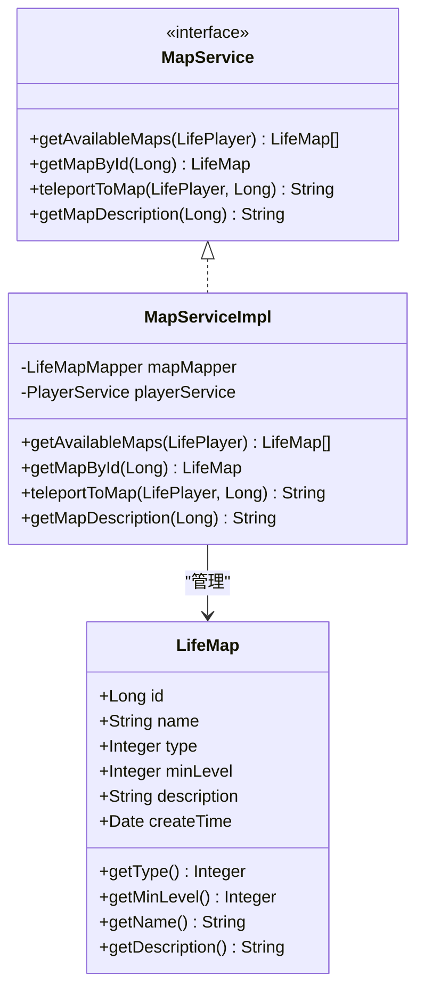
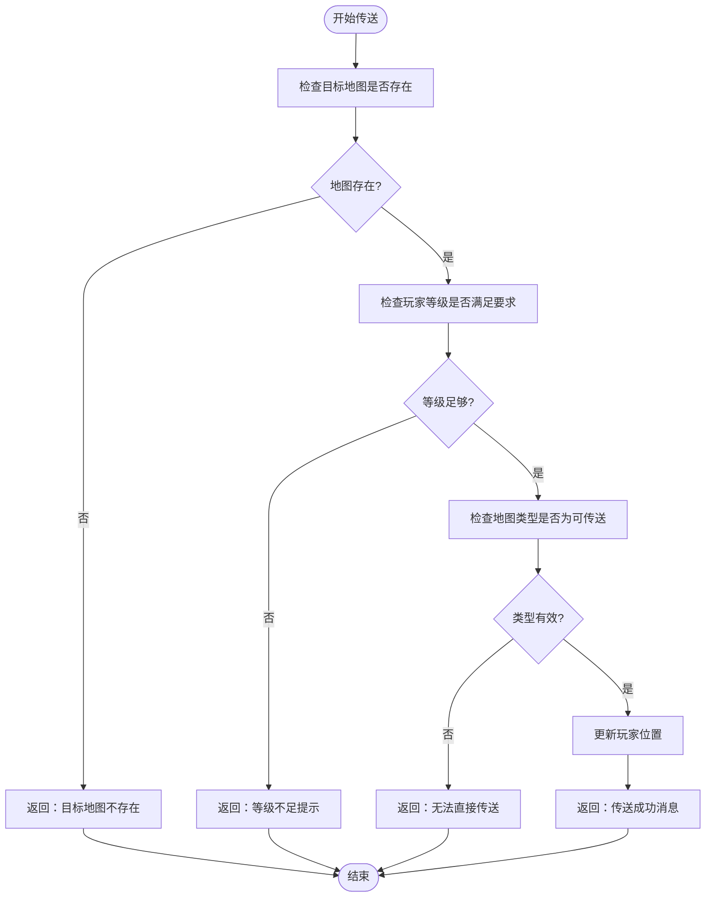
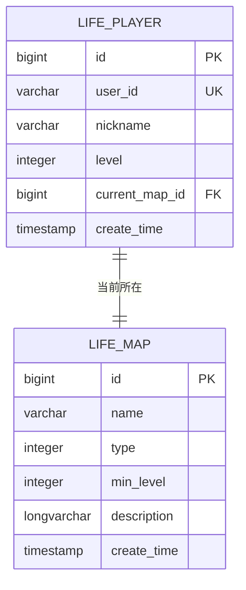
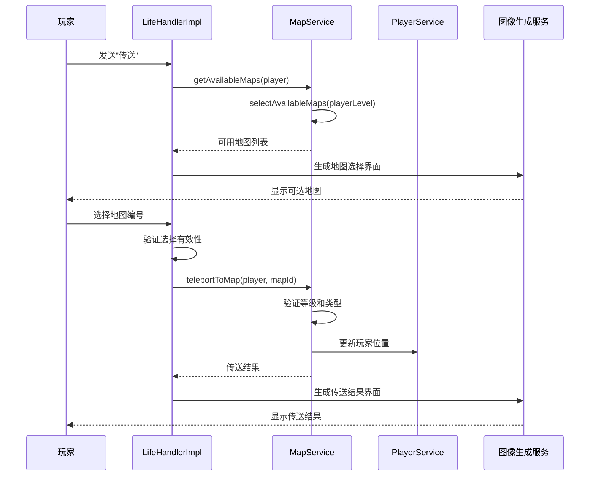

# 地图限制机制

<cite>
**本文档引用的文件**
- [LifeMap.java](file://Life/src/main/java/com/bot/life/dao/entity/LifeMap.java)
- [MapServiceImpl.java](file://Life/src/main/java/com/bot/life/service/impl/MapServiceImpl.java)
- [MapService.java](file://Life/src/main/java/com/bot/life/service/MapService.java)
- [LifeMapMapper.java](file://Life/src/main/java/com/bot/life/dao/mapper/LifeMapMapper.java)
- [LifeMapMapper.xml](file://Life/src/main/resources/mapper/LifeMapMapper.xml)
- [LifeHandlerImpl.java](file://Life/src/main/java/com/bot/life/service/impl/LifeHandlerImpl.java)
- [Life_User_Manual.md](file://Life_User_Manual.md)
</cite>

## 目录
1. [概述](#概述)
2. [地图实体结构](#地图实体结构)
3. [地图类型系统](#地图类型系统)
4. [等级限制机制](#等级限制机制)
5. [数据库查询逻辑](#数据库查询逻辑)
6. [服务层实现](#服务层实现)
7. [用户界面交互](#用户界面交互)
8. [限制规则详解](#限制规则详解)
9. [性能优化考虑](#性能优化考虑)
10. [故障排除指南](#故障排除指南)

## 概述

地图限制机制是浮生卷游戏中的核心功能之一，用于控制玩家对不同地图的访问权限。该机制通过两个主要维度进行限制：地图类型（可传送 vs 特殊地图）和玩家等级（最低境界要求）。系统确保玩家只能访问与其当前等级匹配的地图，并且能够正确区分不同类型的地图。

## 地图实体结构

地图实体定义了地图的基本属性和限制规则：

**图表来源**
- [LifeMap.java](file://Life/src/main/java/com/bot/life/dao/entity/LifeMap.java#L11-L19)
- [MapService.java](file://Life/src/main/java/com/bot/life/service/MapService.java#L12-L42)
- [MapServiceImpl.java](file://Life/src/main/java/com/bot/life/service/impl/MapServiceImpl.java#L17-L84)

**章节来源**
- [LifeMap.java](file://Life/src/main/java/com/bot/life/dao/entity/LifeMap.java#L1-L19)

## 地图类型系统

地图类型通过`type`字段进行区分，共有两种类型：

| 类型值 | 类型名称 | 描述 | 访问方式 |
|--------|----------|------|----------|
| 1 | 可传送地图 | 玩家可以直接传送到达的地图 | 通过传送功能访问 |
| 2 | 内置地图 | 需要特殊方式进入的地图（如副本） | 通过特定事件或任务进入 |

### 类型判断逻辑

系统在多个关键位置检查地图类型：

1. **传送验证**：在执行传送前检查目标地图是否为可传送类型
2. **地图筛选**：在获取可用地图列表时过滤掉非可传送地图
3. **描述显示**：在地图详情中明确标注地图类型

**章节来源**
- [MapServiceImpl.java](file://Life/src/main/java/com/bot/life/service/impl/MapServiceImpl.java#L49-L51)
- [LifeMapMapper.xml](file://Life/src/main/resources/mapper/LifeMapMapper.xml#L25-L31)

## 等级限制机制

等级限制通过`minLevel`字段实现，确保玩家只能访问符合其当前等级的地图：

### 等级检查流程

**图表来源**
- [MapServiceImpl.java](file://Life/src/main/java/com/bot/life/service/impl/MapServiceImpl.java#L36-L60)

### 等级要求计算

系统采用以下策略处理等级限制：

1. **直接比较**：比较玩家当前等级与地图最低等级要求
2. **动态筛选**：在获取可用地图列表时自动过滤不符合等级要求的地图
3. **实时验证**：每次传送尝试都进行等级验证

**章节来源**
- [MapServiceImpl.java](file://Life/src/main/java/com/bot/life/service/impl/MapServiceImpl.java#L43-L47)
- [LifeMapMapper.xml](file://Life/src/main/resources/mapper/LifeMapMapper.xml#L33-L38)

## 数据库查询逻辑

数据库层通过MyBatis映射器实现地图查询功能：

### 查询方法对比

| 方法名 | 参数 | 返回类型 | 查询条件 | 排序 |
|--------|------|----------|----------|------|
| selectAvailableMaps | Integer playerLevel | List<LifeMap> | type=1 AND min_level<=playerLevel | min_level, id |
| selectTeleportableMaps | 无 | List<LifeMap> | type=1 | min_level, id |
| selectByPrimaryKey | Long id | LifeMap | id=? | 无 |

### SQL实现细节

**图表来源**
- [LifeMapMapper.xml](file://Life/src/main/resources/mapper/LifeMapMapper.xml#L5-L12)

**章节来源**
- [LifeMapMapper.xml](file://Life/src/main/resources/mapper/LifeMapMapper.xml#L25-L39)
- [LifeMapMapper.java](file://Life/src/main/java/com/bot/life/dao/mapper/LifeMapMapper.java#L31-L36)

## 服务层实现

服务层提供了完整的地图限制机制实现：

### 核心方法实现

#### 可用地图获取
- **方法**：`getAvailableMaps(LifePlayer player)`
- **逻辑**：根据玩家等级筛选可传送地图
- **返回**：符合条件的地图列表

#### 传送功能实现
- **方法**：`teleportToMap(LifePlayer player, Long targetMapId)`
- **验证**：地图存在性、等级要求、类型有效性
- **操作**：更新玩家位置信息
- **返回**：传送结果消息

#### 地图描述获取
- **方法**：`getMapDescription(Long mapId)`
- **内容**：包含地图基本信息、等级要求、类型说明
- **用途**：向玩家展示地图详情

**章节来源**
- [MapServiceImpl.java](file://Life/src/main/java/com/bot/life/service/impl/MapServiceImpl.java#L26-L82)

## 用户界面交互

用户界面通过多层交互实现地图限制机制：

### 传送功能流程

**图表来源**
- [LifeHandlerImpl.java](file://Life/src/main/java/com/bot/life/service/impl/LifeHandlerImpl.java#L479-L548)

### 错误处理机制

系统提供多层次的错误处理：

1. **地图不存在**：当目标地图ID无效时返回明确提示
2. **等级不足**：当玩家等级低于地图要求时提供具体提示
3. **类型错误**：当尝试传送至不可传送地图时给出说明
4. **系统异常**：捕获并处理数据库访问异常

**章节来源**
- [LifeHandlerImpl.java](file://Life/src/main/java/com/bot/life/service/impl/LifeHandlerImpl.java#L479-L548)
- [MapServiceImpl.java](file://Life/src/main/java/com/bot/life/service/impl/MapServiceImpl.java#L39-L60)

## 限制规则详解

### 综合限制策略

地图限制机制采用双重保护策略：

#### 第一层：数据库层面
- **索引优化**：在`type`和`min_level`字段上建立复合索引
- **预过滤**：数据库查询时直接过滤不符合条件的地图
- **排序保证**：按等级和ID排序确保结果一致性

#### 第二层：应用层面
- **运行时验证**：每次传送请求都进行实时验证
- **缓存策略**：合理利用缓存减少数据库访问
- **事务控制**：确保玩家位置更新的原子性

### 性能考虑

系统在设计时充分考虑了性能优化：

1. **查询优化**：使用精确的SQL查询条件
2. **索引利用**：充分利用数据库索引加速查询
3. **缓存机制**：对于频繁访问的地图信息实施缓存
4. **批量操作**：支持批量获取可用地图列表

**章节来源**
- [LifeMapMapper.xml](file://Life/src/main/resources/mapper/LifeMapMapper.xml#L33-L38)

## 性能优化考虑

### 查询性能优化

系统采用了多种性能优化策略：

1. **索引设计**：在`type`和`min_level`字段上建立复合索引
2. **查询条件优化**：使用精确的WHERE子句减少扫描范围
3. **排序优化**：在数据库层面完成排序操作
4. **连接优化**：避免不必要的表连接操作

### 缓存策略

虽然当前实现未显式使用缓存，但可以考虑以下优化方案：

1. **地图信息缓存**：缓存常用地图的基本信息
2. **可用地图缓存**：缓存基于玩家等级的可用地图列表
3. **类型检查缓存**：缓存地图类型的判断结果

### 扩展性设计

系统设计具有良好的扩展性：

1. **新类型支持**：可通过修改`type`字段值支持新的地图类型
2. **新限制规则**：可在现有基础上添加新的限制条件
3. **多维度限制**：可扩展支持更多维度的访问控制

## 故障排除指南

### 常见问题及解决方案

#### 问题1：玩家无法访问任何地图
**症状**：玩家在传送功能中看不到任何可选地图
**可能原因**：
- 玩家等级过低，所有地图都不符合要求
- 数据库中缺少可传送地图记录
- 地图类型设置错误

**解决方案**：
1. 检查玩家当前等级
2. 验证数据库中是否存在type=1的地图记录
3. 确认地图的`minLevel`设置是否合理

#### 问题2：传送失败但提示信息不准确
**症状**：玩家收到错误的传送失败提示
**可能原因**：
- 地图不存在或已被删除
- 等级要求计算错误
- 类型检查逻辑异常

**解决方案**：
1. 验证目标地图ID的有效性
2. 检查玩家等级数据的准确性
3. 确认地图类型的正确性

#### 问题3：性能问题
**症状**：地图查询响应缓慢
**可能原因**：
- 数据库索引缺失
- 查询条件不够精确
- 数据量过大导致扫描效率低下

**解决方案**：
1. 检查并优化数据库索引
2. 调整查询条件以提高匹配精度
3. 考虑实施适当的缓存策略

### 调试建议

1. **日志记录**：在关键节点添加详细的日志记录
2. **参数验证**：严格验证输入参数的有效性
3. **异常处理**：完善异常处理机制
4. **监控指标**：监控查询性能和错误率

**章节来源**
- [MapServiceImpl.java](file://Life/src/main/java/com/bot/life/service/impl/MapServiceImpl.java#L39-L60)
- [LifeHandlerImpl.java](file://Life/src/main/java/com/bot/life/service/impl/LifeHandlerImpl.java#L524-L528)

## 结论

地图限制机制是浮生卷游戏中的重要组成部分，通过合理的数据库设计、服务层实现和用户界面交互，为游戏提供了完善的地图访问控制功能。该机制不仅确保了游戏平衡性，还为玩家提供了清晰的导航体验。

系统的主要优势包括：
- **清晰的限制规则**：通过地图类型和等级要求明确划分访问权限
- **高效的查询性能**：利用数据库索引和优化查询条件
- **完善的错误处理**：提供准确的错误提示和用户体验
- **良好的扩展性**：支持未来功能的扩展和优化

随着游戏的发展，该机制还可以进一步优化，例如引入更复杂的限制规则、实施智能缓存策略、增强监控和调试能力等。