# 游戏系统

<cite>
**本文档引用的文件**
- [LifeHandlerImpl.java](file://Life/src/main/java/com/bot/life/service/impl/LifeHandlerImpl.java)
- [InventoryService.java](file://Life/src/main/java/com/bot/life/service/InventoryService.java)
- [InventoryServiceImpl.java](file://Life/src/main/java/com/bot/life/service/impl/InventoryServiceImpl.java)
- [MapService.java](file://Life/src/main/java/com/bot/life/service/MapService.java)
- [MapServiceImpl.java](file://Life/src/main/java/com/bot/life/service/impl/MapServiceImpl.java)
- [FriendService.java](file://Life/src/main/java/com/bot/life/service/FriendService.java)
- [FriendServiceImpl.java](file://Life/src/main/java/com/bot/life/service/impl/FriendServiceImpl.java)
- [MailService.java](file://Life/src/main/java/com/bot/life/service/MailService.java)
- [MailServiceImpl.java](file://Life/src/main/java/com/bot/life/service/impl/MailServiceImpl.java)
- [TeamService.java](file://Life/src/main/java/com/bot/life/service/TeamService.java)
- [TeamServiceImpl.java](file://Life/src/main/java/com/bot/life/service/impl/TeamServiceImpl.java)
- [BattleService.java](file://Life/src/main/java/com/bot/life/service/BattleService.java)
- [BattleServiceImpl.java](file://Life/src/main/java/com/bot/life/service/impl/BattleServiceImpl.java)
- [LifePlayerEquipment.java](file://Life/src/main/java/com/bot/life/dao/entity/LifePlayerEquipment.java)
- [LifeEquipment.java](file://Life/src/main/java/com/bot/life/dao/entity/LifeEquipment.java)
- [ENEquipmentType.java](file://Life/src/main/java/com/bot/life/enums/ENEquipmentType.java)
- [ENBattleAction.java](file://Life/src/main/java/com/bot/life/enums/ENBattleAction.java)
- [LifeMap.java](file://Life/src/main/java/com/bot/life/dao/entity/LifeMap.java)
- [LifePlayer.java](file://Life/src/main/java/com/bot/life/dao/entity/LifePlayer.java)
</cite>

## 目录
1. [系统概述](#系统概述)
2. [核心架构](#核心架构)
3. [背包管理系统](#背包管理系统)
4. [装备系统](#装备系统)
5. [地图传送系统](#地图传送系统)
6. [社交系统](#社交系统)
7. [邮件系统](#邮件系统)
8. [组队系统](#组队系统)
9. [战斗系统](#战斗系统)
10. [系统关联与数据流转](#系统关联与数据流转)
11. [总结](#总结)

## 系统概述

浮生卷游戏系统是一个基于文本交互的修仙文字冒险游戏，采用模块化设计，包含多个核心子系统。系统通过LifeHandlerImpl作为主要入口控制器，协调各个子系统完成游戏功能。

### 系统特点
- **模块化设计**：各功能模块独立实现，便于维护和扩展
- **状态管理**：通过游戏状态机管理不同游戏阶段
- **数据持久化**：基于MySQL数据库存储玩家数据
- **实时交互**：支持实时的文本交互和状态反馈

## 核心架构

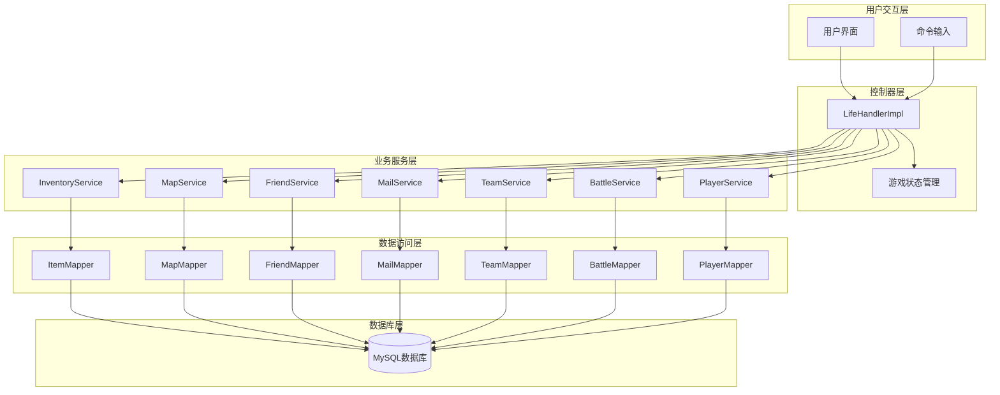

**图表来源**
- [LifeHandlerImpl.java](file://Life/src/main/java/com/bot/life/service/impl/LifeHandlerImpl.java#L42-L108)

## 背包管理系统

背包系统是游戏的核心功能之一，负责管理玩家拥有的各种道具和物品。

### 功能特性

| 功能 | 描述 | 实现方式 |
|------|------|----------|
| 道具存储 | 存储玩家获得的各种道具 | 基于LifePlayerItem实体 |
| 道具使用 | 使用背包中的道具 | InventoryServiceImpl.useItem() |
| 道具分类 | 按类型分类显示道具 | ENItemType枚举 |
| 使用限制 | 属性类道具的使用次数限制 | maxUseCount字段 |
| 数量管理 | 道具数量的增减控制 | quantity字段 |

### 数据结构

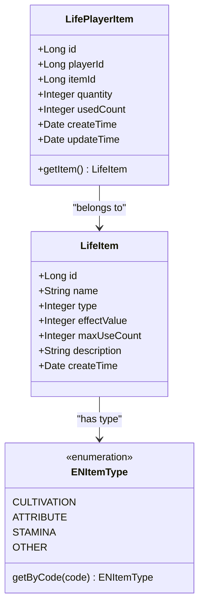

**图表来源**
- [InventoryServiceImpl.java](file://Life/src/main/java/com/bot/life/service/impl/InventoryServiceImpl.java#L44-L111)
- [LifePlayerItem.java](file://Life/src/main/java/com/bot/life/dao/entity/LifePlayerItem.java)

### 操作流程

```mermaid
flowchart TD
Start([玩家请求使用道具]) --> CheckItem{检查道具是否存在}
CheckItem --> |否| Error1[返回"没有这个道具"]
CheckItem --> |是| CheckType{检查道具类型}
CheckType --> |属性类| CheckLimit{检查使用次数}
CheckType --> |其他| ApplyEffect[应用道具效果]
CheckLimit --> |超限| Error2[返回"已达使用上限"]
CheckLimit --> |未超限| ApplyEffect
ApplyEffect --> UpdateCount[更新使用次数]
UpdateCount --> UpdateQuantity[减少道具数量]
UpdateQuantity --> UpdatePlayer[更新玩家数据]
UpdatePlayer --> Success[返回使用成功]
Error1 --> End([结束])
Error2 --> End
Success --> End
```

**图表来源**
- [InventoryServiceImpl.java](file://Life/src/main/java/com/bot/life/service/impl/InventoryServiceImpl.java#L78-L111)

**节来源**
- [InventoryService.java](file://Life/src/main/java/com/bot/life/service/InventoryService.java#L1-L52)
- [InventoryServiceImpl.java](file://Life/src/main/java/com/bot/life/service/impl/InventoryServiceImpl.java#L1-L339)

## 装备系统

装备系统管理玩家的各类装备，包括功法、心法、神通和法宝等。

### 装备类型

| 类型 | 编码 | 描述 | 特点 |
|------|------|------|------|
| 功法 | 1 | 修炼功法 | 提升基础属性 |
| 心法 | 2 | 心境修炼 | 影响精神属性 |
| 神通 | 3 | 特殊能力 | 提供特殊效果 |
| 法宝 | 4 | 修炼法宝 | 可升级强化 |

### 装备属性

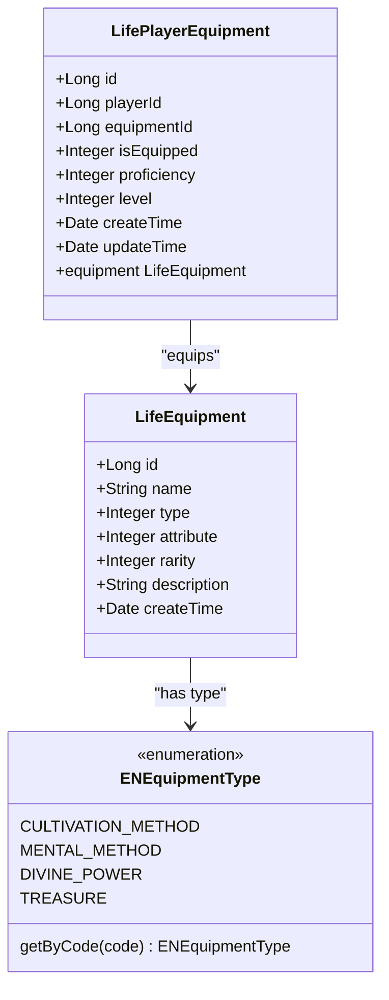

**图表来源**
- [LifeEquipment.java](file://Life/src/main/java/com/bot/life/dao/entity/LifeEquipment.java#L1-L20)
- [LifePlayerEquipment.java](file://Life/src/main/java/com/bot/life/dao/entity/LifePlayerEquipment.java#L1-L24)
- [ENEquipmentType.java](file://Life/src/main/java/com/bot/life/enums/ENEquipmentType.java#L1-L37)

### 装备穿戴流程

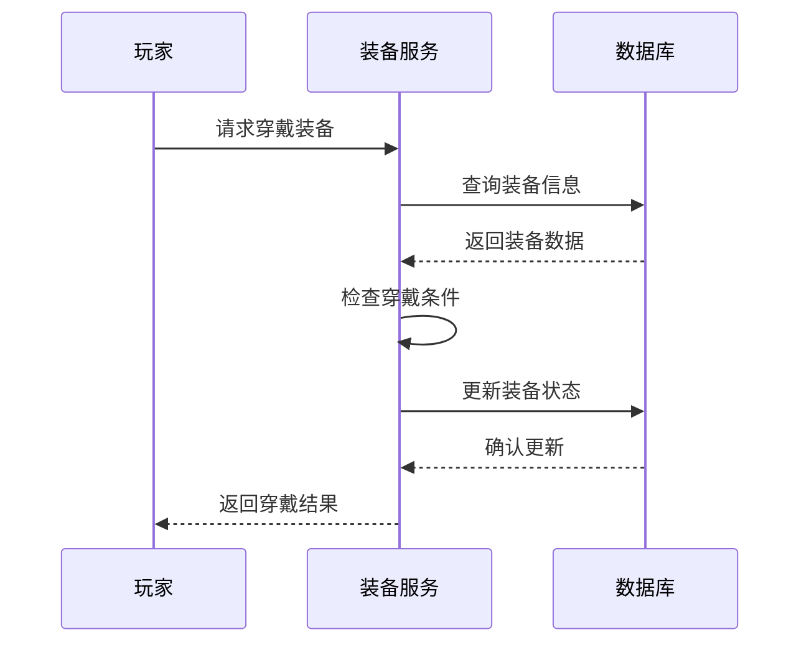

**图表来源**
- [LifeHandlerImpl.java](file://Life/src/main/java/com/bot/life/service/impl/LifeHandlerImpl.java#L474-L476)

**节来源**
- [LifeEquipment.java](file://Life/src/main/java/com/bot/life/dao/entity/LifeEquipment.java#L1-L20)
- [LifePlayerEquipment.java](file://Life/src/main/java/com/bot/life/dao/entity/LifePlayerEquipment.java#L1-L24)

## 地图传送系统

地图传送系统允许玩家在不同地图之间移动，每个地图都有相应的等级要求。

### 地图类型

| 类型 | 编码 | 描述 | 特点 |
|------|------|------|------|
| 可传送地图 | 1 | 可以直接传送 | 支持快速移动 |
| 特殊地图 | 2 | 特殊场景地图 | 通常有特殊事件 |

### 传送机制

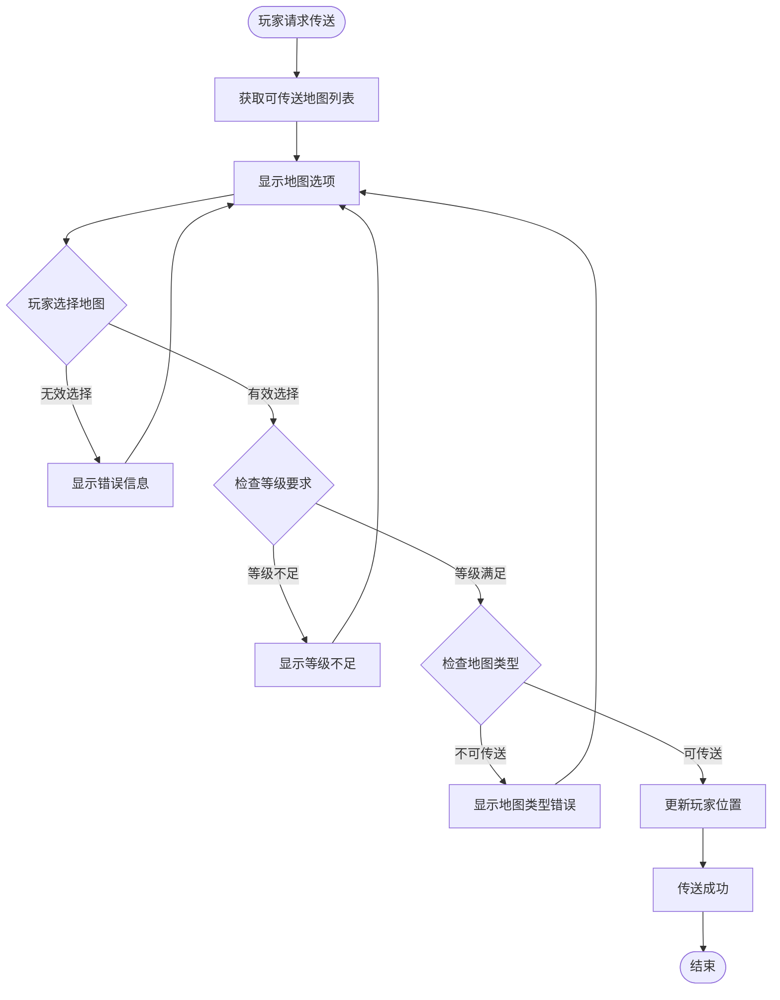

**图表来源**
- [MapServiceImpl.java](file://Life/src/main/java/com/bot/life/service/impl/MapServiceImpl.java#L37-L60)

### 地图数据结构

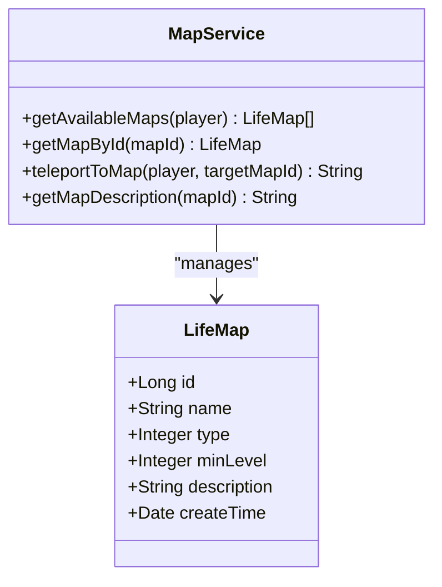

**图表来源**
- [LifeMap.java](file://Life/src/main/java/com/bot/life/dao/entity/LifeMap.java#L1-L19)
- [MapService.java](file://Life/src/main/java/com/bot/life/service/MapService.java#L1-L42)

**节来源**
- [MapService.java](file://Life/src/main/java/com/bot/life/service/MapService.java#L1-L42)
- [MapServiceImpl.java](file://Life/src/main/java/com/bot/life/service/impl/MapServiceImpl.java#L1-L83)

## 社交系统

社交系统包含好友管理和基本的社交互动功能。

### 好友功能

| 功能 | 命令格式 | 描述 |
|------|----------|------|
| 添加好友 | 添加好友+昵称 | 向指定玩家发送好友申请 |
| 同意好友 | 同意好友+ID | 同意某人的好友申请 |
| 拒绝好友 | 拒绝好友+ID | 拒绝某人的好友申请 |
| 查看好友 | 无 | 查看当前好友列表 |

### 好友关系管理

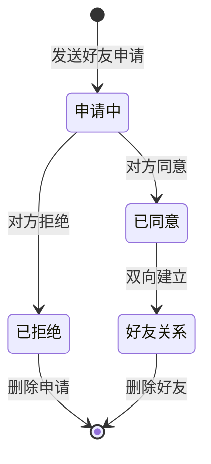

**图表来源**
- [FriendServiceImpl.java](file://Life/src/main/java/com/bot/life/service/impl/FriendServiceImpl.java#L40-L177)

### 好友系统架构

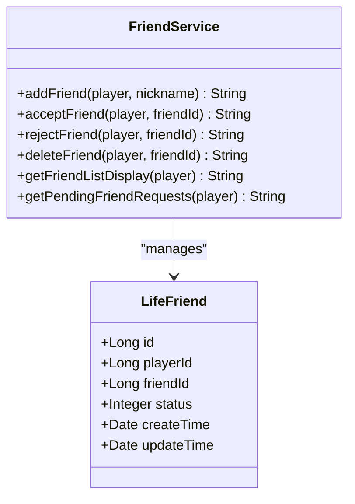

**图表来源**
- [FriendService.java](file://Life/src/main/java/com/bot/life/service/FriendService.java#L1-L56)

**节来源**
- [FriendService.java](file://Life/src/main/java/com/bot/life/service/FriendService.java#L1-L56)
- [FriendServiceImpl.java](file://Life/src/main/java/com/bot/life/service/impl/FriendServiceImpl.java#L40-L177)

## 邮件系统

邮件系统提供玩家间通信和系统消息通知功能。

### 邮件类型

| 类型 | 编码 | 描述 | 权限要求 |
|------|------|------|----------|
| 系统邮件 | 1 | 系统发送的消息 | 无限制 |
| 好友邮件 | 2 | 玩家间发送的邮件 | 必须是好友 |

### 邮件操作流程

```mermaid
flowchart TD
Start([邮件操作]) --> Choice{选择操作类型}
Choice --> |发送邮件| CheckFriend{检查好友关系}
Choice --> |读取邮件| CheckOwner{检查邮件归属}
Choice --> |领取附件| CheckAttachment{检查附件状态}
Choice --> |删除邮件| CheckDelete{检查删除条件}
CheckFriend --> |非好友| Error1[返回"不是好友"]
CheckFriend --> |是好友| SendMail[发送邮件]
CheckOwner --> |非邮件主人| Error2[返回"不是你的邮件"]
CheckOwner --> |邮件主人| ReadMail[读取邮件内容]
CheckAttachment --> |无附件| Error3[返回"没有附件"]
CheckAttachment --> |有附件| ReceiveAttachment[领取附件]
CheckDelete --> |有未领附件| Error4[返回"有未领取附件"]
CheckDelete --> |无附件| DeleteMail[删除邮件]
SendMail --> Success[操作成功]
ReadMail --> Success
ReceiveAttachment --> Success
DeleteMail --> Success
Error1 --> End([结束])
Error2 --> End
Error3 --> End
Error4 --> End
Success --> End
```

**图表来源**
- [MailServiceImpl.java](file://Life/src/main/java/com/bot/life/service/impl/MailServiceImpl.java#L48-L354)

### 邮件数据模型

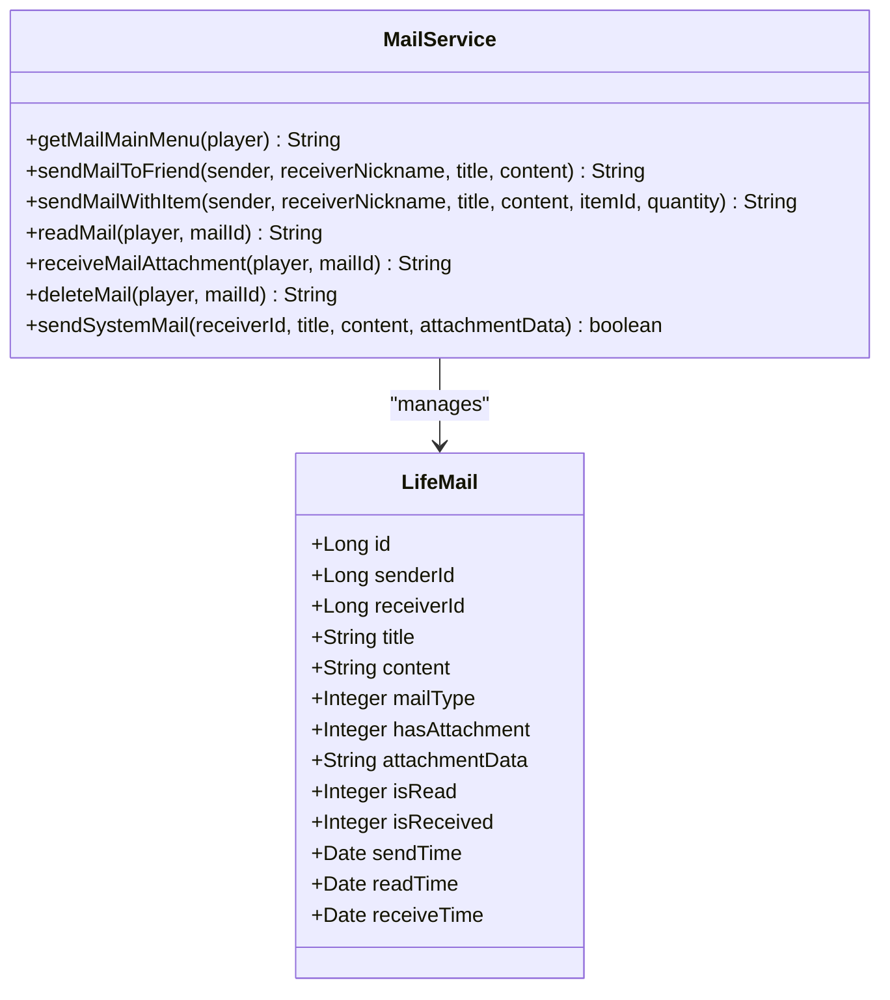

**图表来源**
- [MailService.java](file://Life/src/main/java/com/bot/life/service/MailService.java#L1-L74)

**节来源**
- [MailService.java](file://Life/src/main/java/com/bot/life/service/MailService.java#L1-L74)
- [MailServiceImpl.java](file://Life/src/main/java/com/bot/life/service/impl/MailServiceImpl.java#L48-L354)

## 组队系统

组队系统支持玩家创建队伍、邀请队友和组队战斗。

### 队伍状态

| 状态 | 编码 | 描述 | 可进行的操作 |
|------|------|------|--------------|
| 待组队 | 0 | 队伍正在招募成员 | 加入申请 |
| 已满员 | 1 | 队伍人数已满 | 无法加入 |

### 组队流程

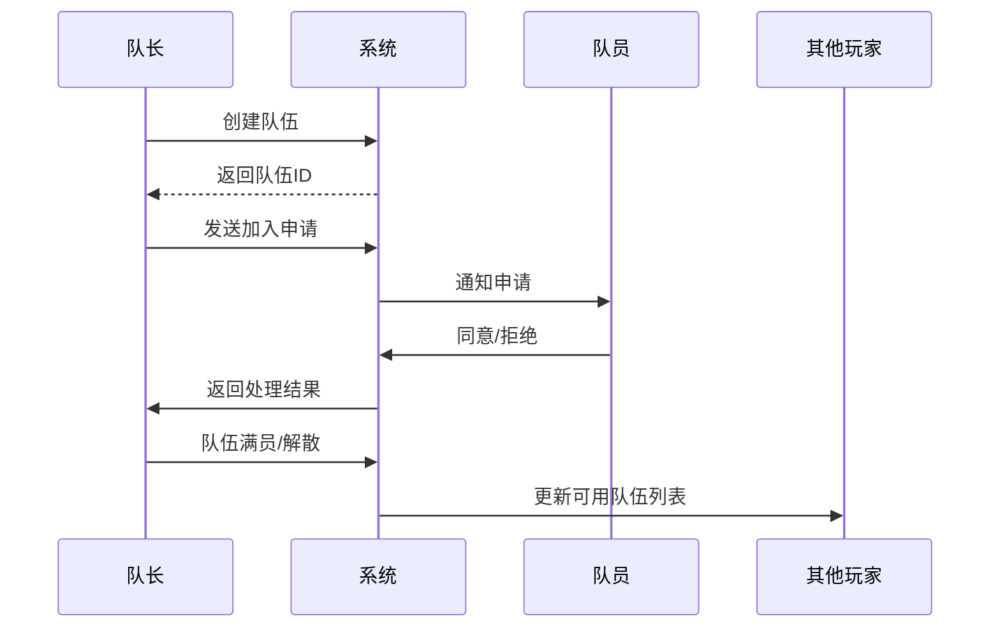

**图表来源**
- [TeamServiceImpl.java](file://Life/src/main/java/com/bot/life/service/impl/TeamServiceImpl.java#L29-L306)

### 队伍管理功能

```mermaid
flowchart TD
Start([组队操作]) --> Action{选择操作}
Action --> |创建队伍| CreateTeam[创建新队伍]
Action --> |加入队伍| JoinTeam[申请加入队伍]
Action --> |离开队伍| LeaveTeam[离开当前队伍]
Action --> |解散队伍| DisbandTeam[解散队伍]
CreateTeam --> CheckExisting{检查是否已有队伍}
CheckExisting --> |在队伍中| Error1[返回"已在队伍中"]
CheckExisting --> |不在队伍| CreateSuccess[创建成功]
JoinTeam --> CheckJoin{检查加入条件}
CheckJoin --> |已有队伍| Error2[返回"已在队伍中"]
CheckJoin --> |队伍已满| Error3[返回"队伍已满"]
CheckJoin --> |可以加入| SendRequest[发送加入请求]
LeaveTeam --> CheckLeader{检查是否队长}
CheckLeader --> |是队长| Disband[解散队伍]
CheckLeader --> |非队长| Leave[离开队伍]
Disband --> NotifyMembers[通知所有成员]
Leave --> UpdateCount[更新队伍人数]
CreateSuccess --> End([结束])
SendRequest --> End
NotifyMembers --> End
UpdateCount --> End
Error1 --> End
Error2 --> End
Error3 --> End
```

**图表来源**
- [TeamServiceImpl.java](file://Life/src/main/java/com/bot/life/service/impl/TeamServiceImpl.java#L182-L238)

### 队伍数据结构

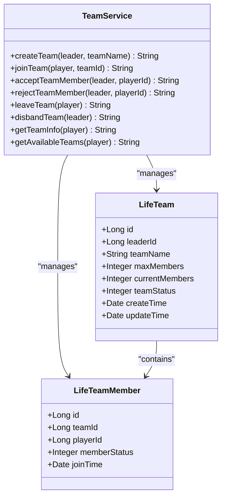

**图表来源**
- [TeamService.java](file://Life/src/main/java/com/bot/life/service/TeamService.java#L1-L60)

**节来源**
- [TeamService.java](file://Life/src/main/java/com/bot/life/service/TeamService.java#L1-L60)
- [TeamServiceImpl.java](file://Life/src/main/java/com/bot/life/service/impl/TeamServiceImpl.java#L1-L378)

## 战斗系统

战斗系统是游戏的核心玩法，支持玩家与怪物的战斗以及技能使用。

### 战斗行动类型

| 行动 | 编码 | 描述 | 效果 |
|------|------|------|------|
| 普通攻击 | 1 | 基础物理攻击 | 造成基础伤害 |
| 使用技能 | 2 | 使用战斗技能 | 造成技能伤害 |
| 防御 | 3 | 进入防御姿态 | 减少下回合伤害 |
| 使用道具 | 4 | 使用战斗道具 | 恢复或增强 |
| 逃跑 | 5 | 逃离战斗 | 有一定成功率 |

### 战斗流程

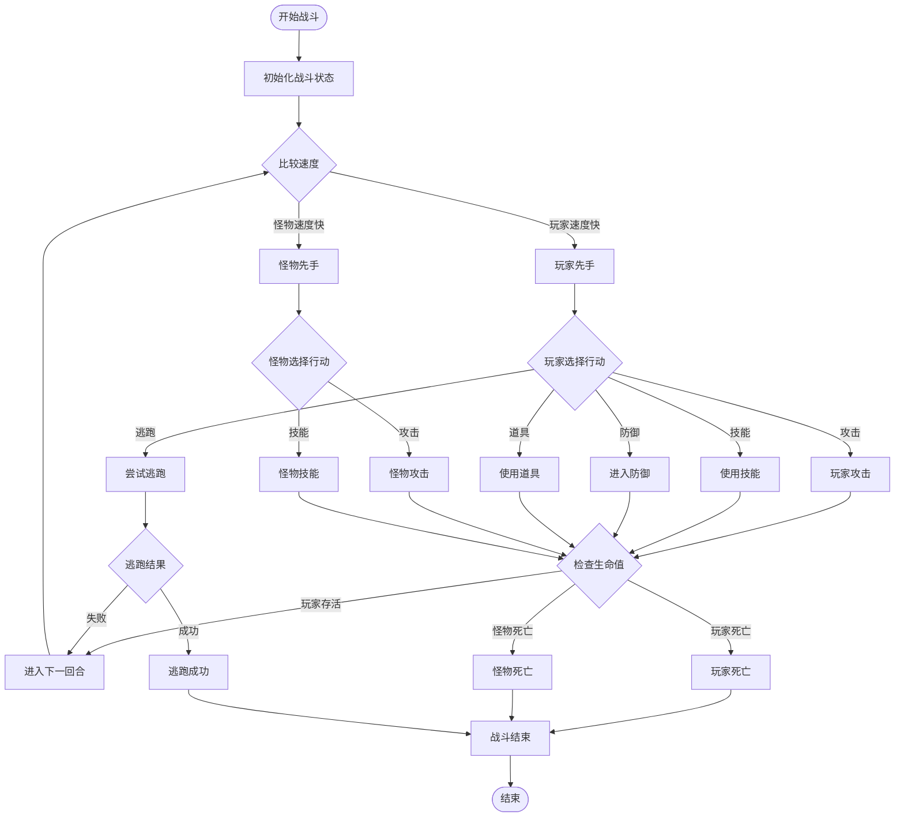

**图表来源**
- [LifeHandlerImpl.java](file://Life/src/main/java/com/bot/life/service/impl/LifeHandlerImpl.java#L1140-L1306)

### 战斗系统架构

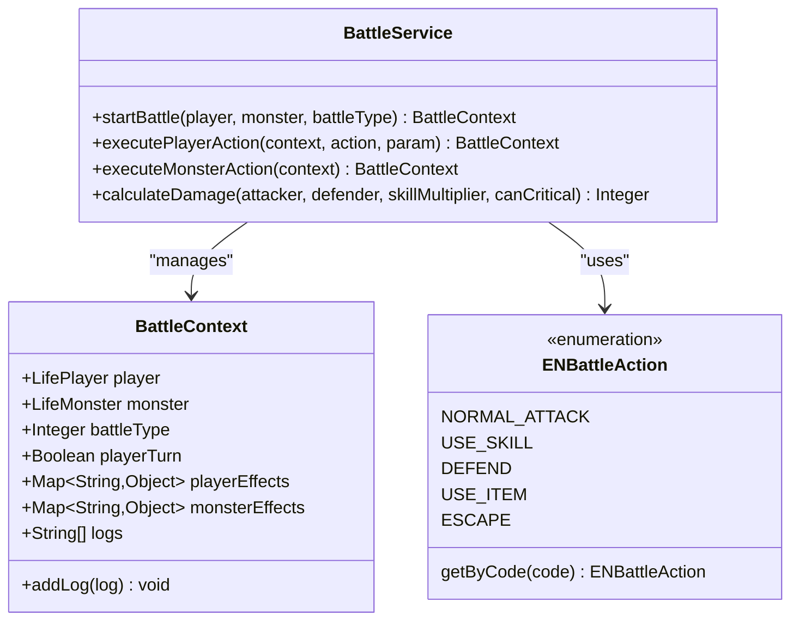

**图表来源**
- [BattleService.java](file://Life/src/main/java/com/bot/life/service/BattleService.java#L1-L46)
- [ENBattleAction.java](file://Life/src/main/java/com/bot/life/enums/ENBattleAction.java#L1-L38)

**节来源**
- [BattleService.java](file://Life/src/main/java/com/bot/life/service/BattleService.java#L1-L46)
- [BattleServiceImpl.java](file://Life/src/main/java/com/bot/life/service/impl/BattleServiceImpl.java#L41-L72)

## 系统关联与数据流转

各系统之间存在密切的数据关联和交互关系。

### 系统交互图

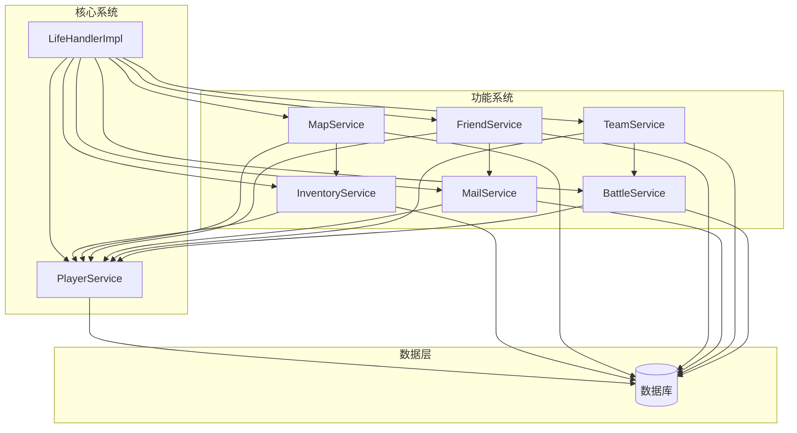

**图表来源**
- [LifeHandlerImpl.java](file://Life/src/main/java/com/bot/life/service/impl/LifeHandlerImpl.java#L42-L108)

### 数据流转示例

#### 1. 地图传送流程
```
玩家请求传送 → LifeHandlerImpl → MapService → 数据库查询地图 → 更新玩家位置 → 返回传送结果
```

#### 2. 道具使用流程
```
玩家使用道具 → LifeHandlerImpl → InventoryService → 检查道具 → 应用效果 → 更新数据库 → 返回使用结果
```

#### 3. 好友系统流程
```
添加好友 → FriendService → 检查关系 → 创建申请 → 数据库保存 → 通知对方 → 处理结果
```

#### 4. 邮件系统流程
```
发送邮件 → MailService → 检查权限 → 创建邮件 → 发送通知 → 更新附件 → 完成发送
```

#### 5. 组队系统流程
```
创建队伍 → TeamService → 检查状态 → 创建队伍 → 自动加入 → 广播更新 → 返回结果
```

#### 6. 战斗系统流程
```
开始战斗 → BattleService → 初始化状态 → 玩家行动 → 怪物行动 → 判断胜负 → 更新状态 → 返回结果
```

### 状态同步机制

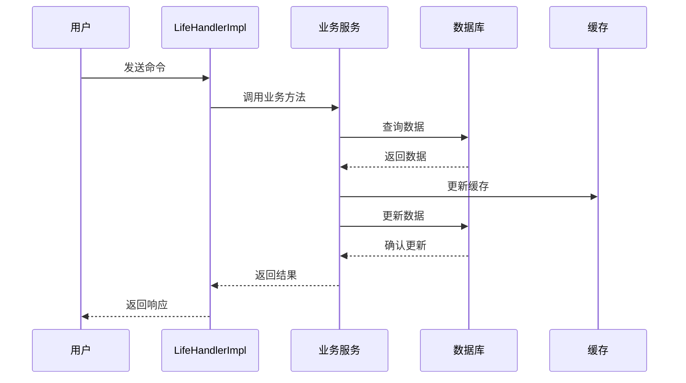

**节来源**
- [LifeHandlerImpl.java](file://Life/src/main/java/com/bot/life/service/impl/LifeHandlerImpl.java#L1-L1859)

## 总结

浮生卷游戏系统通过模块化的设计实现了完整的修仙文字冒险体验。各子系统功能明确，相互协作，形成了一个完整的生态系统：

### 系统优势
1. **模块化设计**：每个功能模块独立实现，便于维护和扩展
2. **状态管理**：完善的生命周期管理，确保数据一致性
3. **用户体验**：直观的命令交互，支持丰富的游戏功能
4. **数据安全**：基于数据库的持久化存储，保证数据安全

### 功能完整性
- **背包管理**：完整的道具管理系统，支持多种道具类型
- **装备系统**：丰富的装备种类和穿戴机制
- **地图传送**：灵活的地图导航系统
- **社交功能**：好友系统和邮件系统
- **组队功能**：支持多人协作
- **战斗系统**：策略性的战斗玩法

### 扩展性
系统采用接口抽象的设计，便于添加新的功能模块和扩展现有功能。未来可以轻松添加更多类型的装备、更复杂的战斗技能、更多的社交功能等。

这个系统为玩家提供了一个完整而有趣的修仙世界，既有深度的玩法，又有良好的用户体验，是一个设计良好的游戏系统实现。