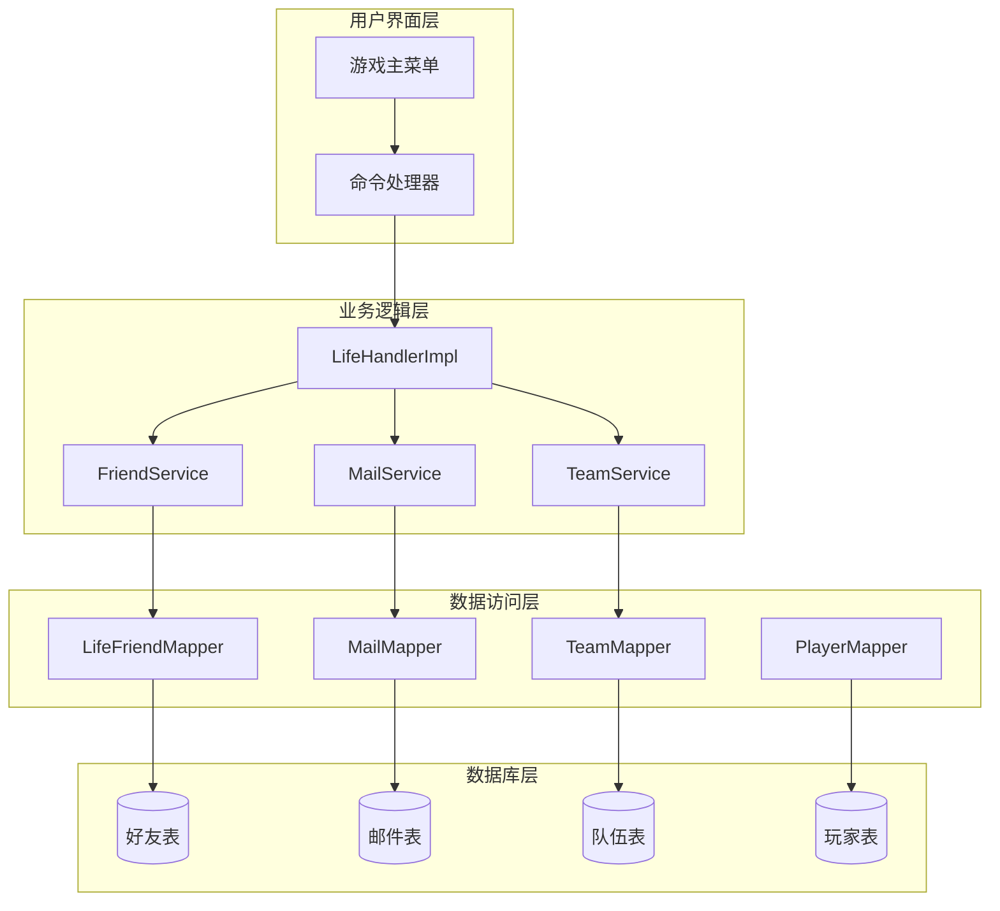
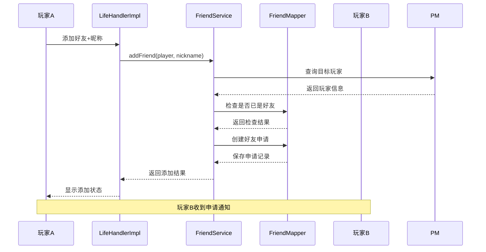
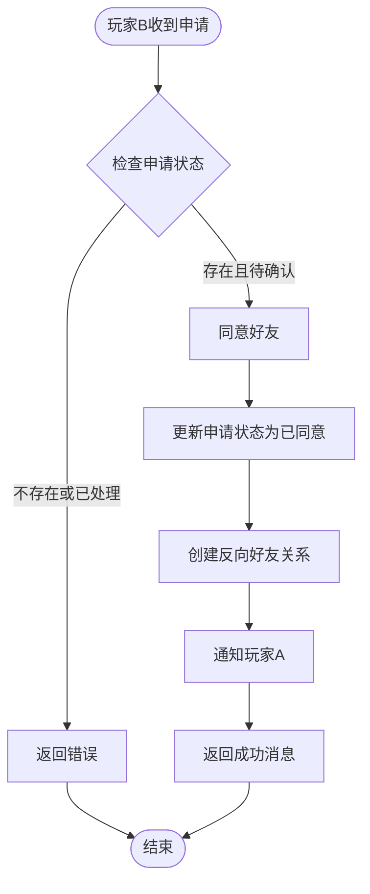
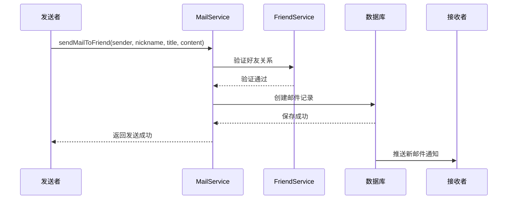
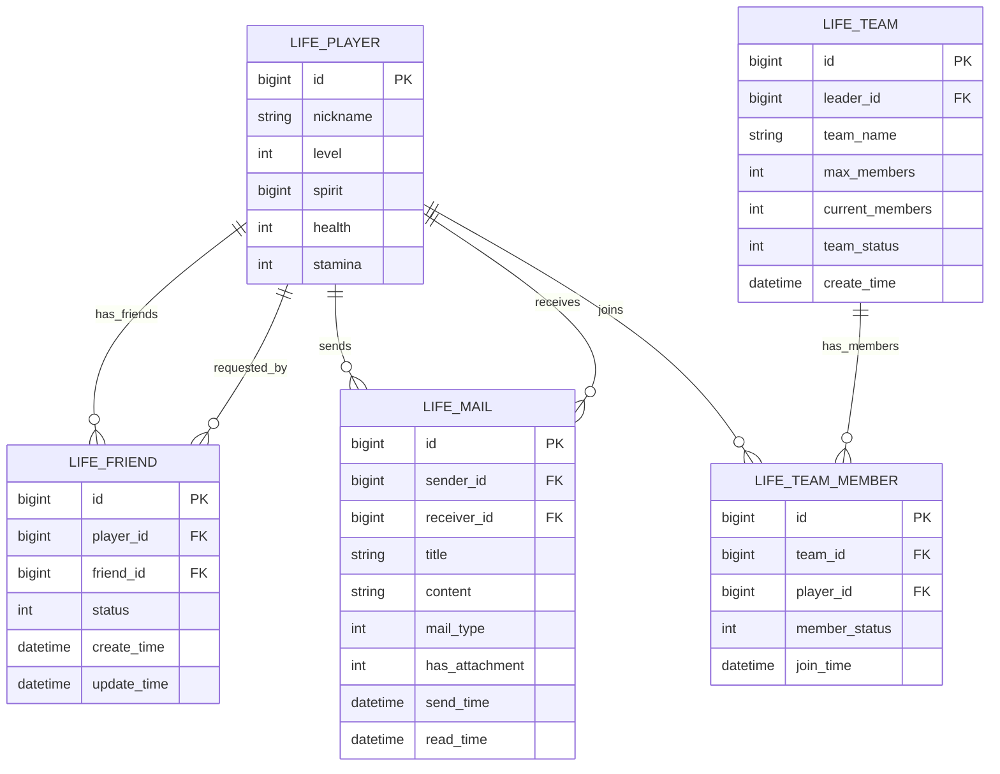
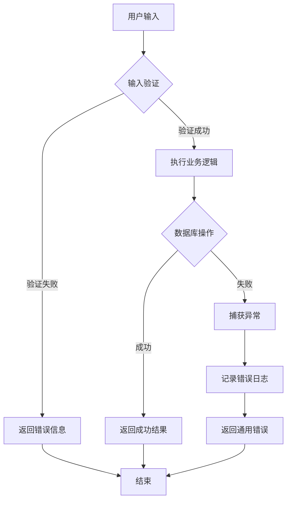

# 好友系统

<cite>
**本文档引用的文件**
- [Life_User_Manual.md](file://Life_User_Manual.md)
- [LifeHandlerImpl.java](file://Life\src\main\java\com\bot\life\service\impl\LifeHandlerImpl.java)
- [FriendServiceImpl.java](file://Life\src\main\java\com\bot\life\service\impl\FriendServiceImpl.java)
- [DeleteFriendServiceImpl.java](file://Game\src\main\java\com\bot\game\service\impl\DeleteFriendServiceImpl.java)
- [LifeFriend.java](file://Life\src\main\java\com\bot\life\dao\entity\LifeFriend.java)
- [MailServiceImpl.java](file://Life\src\main\java\com\bot\life\service\impl\MailServiceImpl.java)
- [TeamServiceImpl.java](file://Life\src\main\java\com\bot\life\service\impl\TeamServiceImpl.java)
- [浮生卷开发说明.md](file://浮生卷开发说明.md)
</cite>

## 目录
1. [系统概述](#系统概述)
2. [好友系统架构](#好友系统架构)
3. [好友操作流程](#好友操作流程)
4. [好友申请处理机制](#好友申请处理机制)
5. [社交应用场景](#社交应用场景)
6. [数据库设计](#数据库设计)
7. [错误处理与验证](#错误处理与验证)
8. [性能优化考虑](#性能优化考虑)
9. [故障排除指南](#故障排除指南)
10. [总结](#总结)

## 系统概述

好友系统是浮生卷游戏中的核心社交功能，为玩家提供了添加好友、管理好友关系、发送邮件等社交互动功能。系统采用双向确认机制，确保好友关系的安全性和可靠性。

### 主要功能特性

- **好友添加**：通过昵称搜索添加好友，需对方同意
- **好友管理**：查看好友列表、处理待办申请
- **邮件通信**：好友间发送文本和道具邮件
- **组队协作**：支持好友组队参与副本挑战
- **状态管理**：好友关系的多种状态（待确认、已同意）

## 好友系统架构

**图表来源**
- [LifeHandlerImpl.java](file://Life\src\main\java\com\bot\life\service\impl\LifeHandlerImpl.java#L1-L100)
- [FriendServiceImpl.java](file://Life\src\main\java\com\bot\life\service\impl\FriendServiceImpl.java#L1-L50)

## 好友操作流程

### 添加好友流程

**图表来源**
- [LifeHandlerImpl.java](file://Life\src\main\java\com\bot\life\service\impl\LifeHandlerImpl.java#L612-L619)
- [FriendServiceImpl.java](file://Life\src\main\java\com\bot\life\service\impl\FriendServiceImpl.java#L28-L66)

### 同意好友申请流程

**图表来源**
- [FriendServiceImpl.java](file://Life\src\main\java\com\bot\life\service\impl\FriendServiceImpl.java#L69-L99)

**章节来源**
- [LifeHandlerImpl.java](file://Life\src\main\java\com\bot\life\service\impl\LifeHandlerImpl.java#L622-L646)
- [FriendServiceImpl.java](file://Life\src\main\java\com\bot\life\service\impl\FriendServiceImpl.java#L69-L99)

## 好友申请处理机制

### 申请状态管理

好友系统采用三状态管理模式：

| 状态码 | 状态名称 | 描述 |
|--------|----------|------|
| 0 | 待确认 | 好友申请已发送，等待对方确认 |
| 1 | 已同意 | 双方好友关系建立成功 |
| 2 | 已拒绝 | 好友申请被拒绝 |

### 核心处理方法

#### handleAddFriend 方法
负责处理添加好友请求，执行以下步骤：
1. 验证目标玩家是否存在
2. 检查是否已经是好友关系
3. 验证是否已发送过申请
4. 创建好友申请记录

#### handleAcceptFriend 方法  
负责处理好友申请同意，执行以下步骤：
1. 验证申请是否存在且处于待确认状态
2. 更新申请状态为已同意
3. 创建反向好友关系
4. 通知双方玩家

#### handleRejectFriend 方法
负责处理好友申请拒绝，执行以下步骤：
1. 验证申请是否存在且处于待确认状态
2. 删除好友申请记录
3. 通知申请发送者

**章节来源**
- [LifeHandlerImpl.java](file://Life\src\main\java\com\bot\life\service\impl\LifeHandlerImpl.java#L612-L646)
- [FriendServiceImpl.java](file://Life\src\main\java\com\bot\life\service\impl\FriendServiceImpl.java#L28-L121)

## 社交应用场景

### 邮件发送场景

好友系统与邮件系统的深度集成，支持以下场景：

#### 文本邮件发送

**图表来源**
- [MailServiceImpl.java](file://Life\src\main\java\com\bot\life\service\impl\MailServiceImpl.java#L85-L118)

#### 道具邮件发送
支持发送带有道具附件的邮件，包括：
- 道具数量验证
- 附件数据序列化
- 发送者道具扣除

### 组队协作场景

好友系统与组队系统的结合，支持以下功能：

#### 队伍创建与管理
- 队长创建队伍，最多2人
- 好友申请加入队伍
- 队长审批队员申请
- 队伍解散机制

#### 副本挑战协作
- 好友组队参与副本
- 队长操作，队员托管
- 战斗中队员行动由程序控制
- 队伍状态同步

**章节来源**
- [MailServiceImpl.java](file://Life\src\main\java\com\bot\life\service\impl\MailServiceImpl.java#L121-L179)
- [TeamServiceImpl.java](file://Life\src\main\java\com\bot\life\service\impl\TeamServiceImpl.java#L29-L277)
- [浮生卷开发说明.md](file://浮生卷开发说明.md#L131-L135)

## 数据库设计

### 好友关系表结构

**图表来源**
- [LifeFriend.java](file://Life\src\main\java\com\bot\life\dao\entity\LifeFriend.java#L11-L22)

### 关键字段说明

| 字段名 | 类型 | 说明 |
|--------|------|------|
| id | bigint | 主键标识符 |
| player_id | bigint | 玩家ID |
| friend_id | bigint | 好友ID |
| status | int | 好友关系状态 |
| create_time | datetime | 创建时间 |
| update_time | datetime | 更新时间 |

**章节来源**
- [LifeFriend.java](file://Life\src\main\java\com\bot\life\dao\entity\LifeFriend.java#L11-L22)

## 错误处理与验证

### 输入验证机制

系统实现了多层次的验证机制：

#### 基础验证
- 昵称格式验证（中文字符，不超过7字）
- 玩家ID格式验证
- 道具数量验证

#### 业务逻辑验证
- 自己不能添加自己为好友
- 不能重复添加好友
- 必须是有效的好友申请
- 必须是好友关系才能发送邮件

#### 数据完整性验证
- 玩家存在性检查
- 好友关系状态检查
- 道具库存检查

### 错误处理策略

**章节来源**
- [FriendServiceImpl.java](file://Life\src\main\java\com\bot\life\service\impl\FriendServiceImpl.java#L28-L121)
- [MailServiceImpl.java](file://Life\src\main\java\com\bot\life\service\impl\MailServiceImpl.java#L85-L179)

## 性能优化考虑

### 查询优化策略

1. **索引优化**
   - 在 player_id 和 friend_id 上建立复合索引
   - 在 receiver_id 上建立索引用于邮件查询
   - 在 team_id 上建立索引用于队伍成员查询

2. **缓存策略**
   - 缓存好友列表数据
   - 缓存待处理申请信息
   - 缓存邮件未读计数

3. **批量操作**
   - 批量处理好友申请
   - 批量更新邮件状态
   - 批量查询队伍信息

### 内存管理
- 及时释放不再使用的数据库连接
- 控制内存中缓存数据大小
- 定期清理过期的临时数据

## 故障排除指南

### 常见问题及解决方案

#### 好友添加失败
**问题现象**：添加好友时提示"玩家不存在"
**可能原因**：
- 目标玩家昵称输入错误
- 玩家数据同步延迟
- 玩家账号被禁用

**解决方法**：
1. 确认目标玩家昵称拼写正确
2. 检查玩家账号状态
3. 等待数据同步完成

#### 好友申请处理异常
**问题现象**：同意或拒绝好友申请时失败
**可能原因**：
- 申请已过期或被处理
- 网络连接中断
- 数据库事务冲突

**解决方法**：
1. 检查申请状态是否有效
2. 重新尝试操作
3. 检查数据库连接状态

#### 邮件发送失败
**问题现象**：发送邮件时提示"不是好友"
**可能原因**：
- 发送者与接收者非好友关系
- 好友关系状态异常
- 权限验证失败

**解决方法**：
1. 确认双方为好友关系
2. 检查好友关系状态
3. 重新建立好友关系

### 监控与日志

系统提供了完善的监控和日志功能：

- **操作日志**：记录所有好友相关操作
- **错误日志**：记录异常情况和错误信息
- **性能监控**：监控数据库查询性能
- **用户反馈**：收集用户操作反馈

## 总结

好友系统作为浮生卷游戏的核心社交功能，实现了完善的好友管理、邮件通信和组队协作功能。系统采用模块化设计，具有良好的扩展性和维护性。

### 系统优势

1. **安全性**：采用双向确认机制，确保好友关系的安全性
2. **易用性**：简洁明了的操作界面，易于理解和使用
3. **可靠性**：完善的错误处理和验证机制
4. **扩展性**：模块化设计便于功能扩展

### 未来发展方向

1. **移动端支持**：开发移动端应用支持
2. **实时通讯**：增加实时语音和视频功能
3. **社交活动**：组织更多社交活动和比赛
4. **个性化功能**：提供更多个性化设置选项

通过持续的功能优化和用户体验改进，好友系统将继续为玩家提供优质的社交体验，促进游戏社区的健康发展。