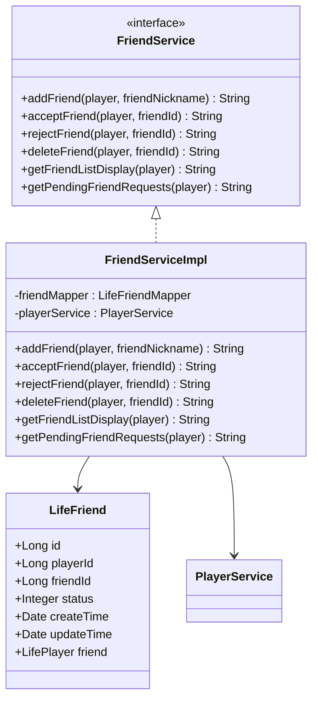
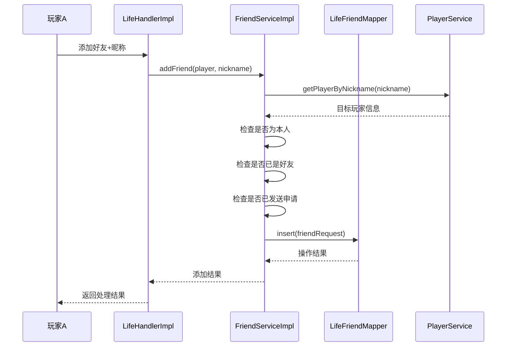
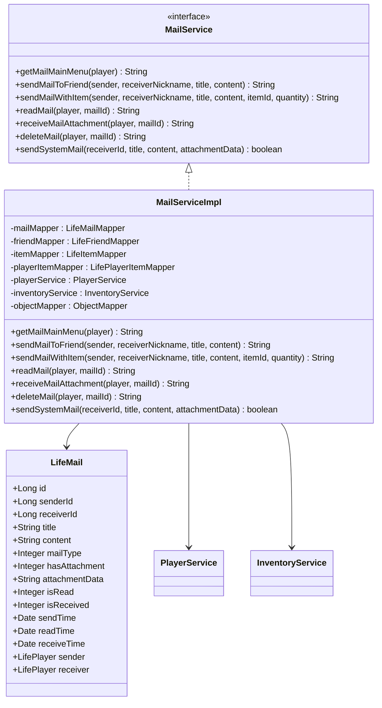
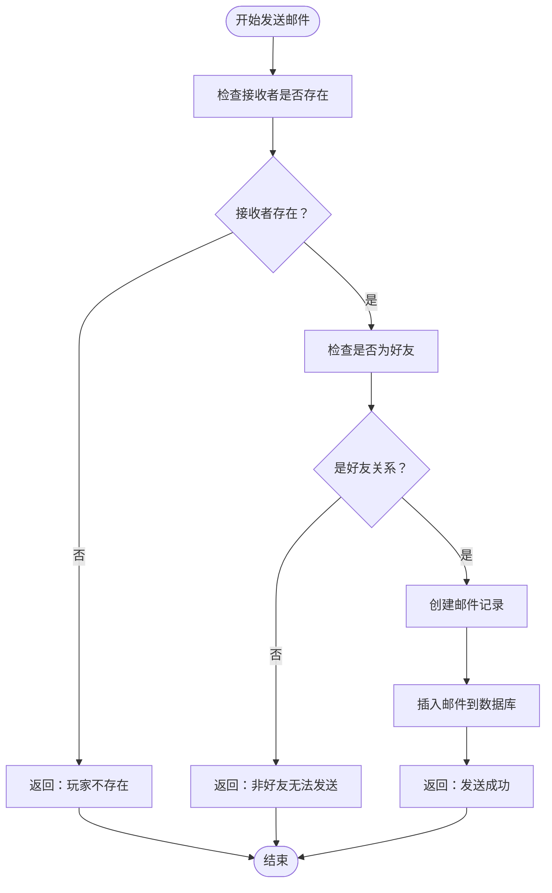
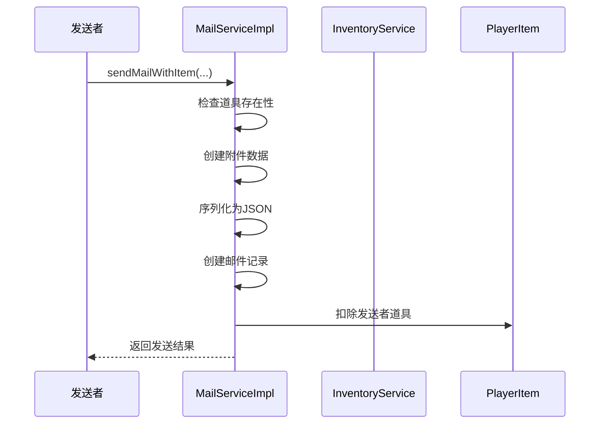
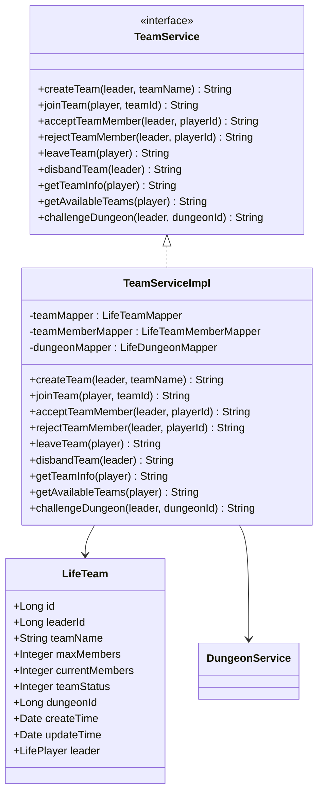
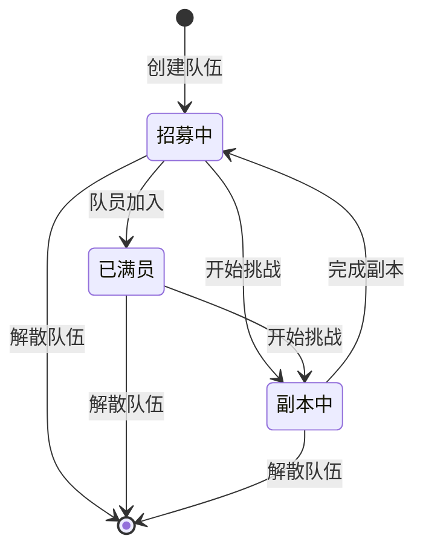
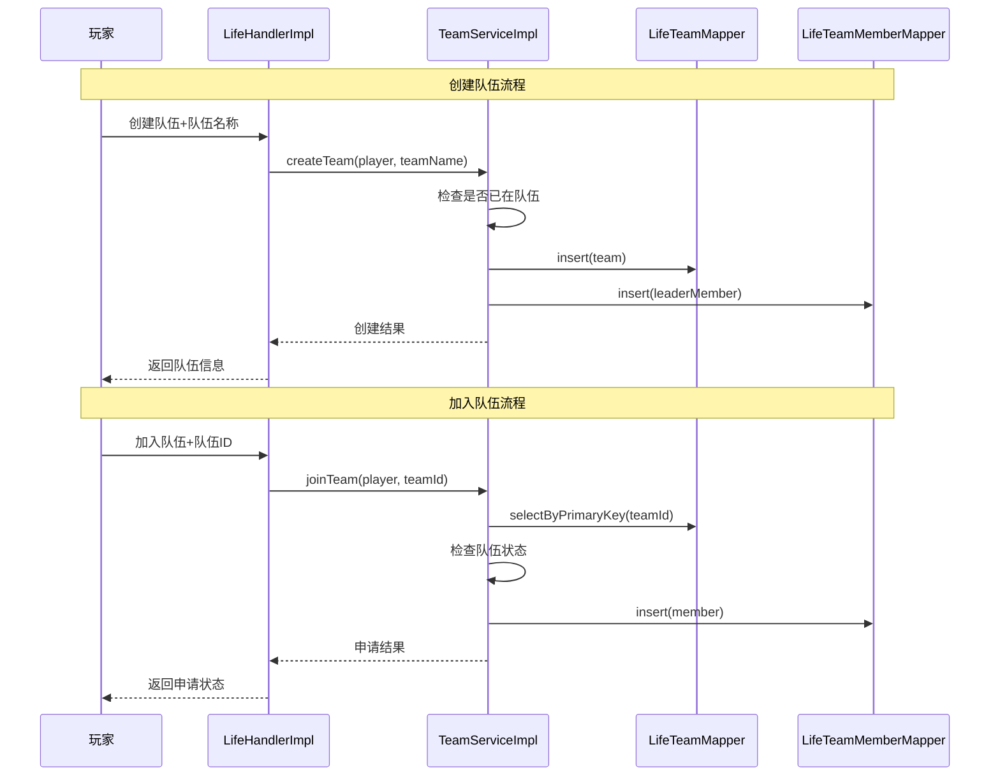
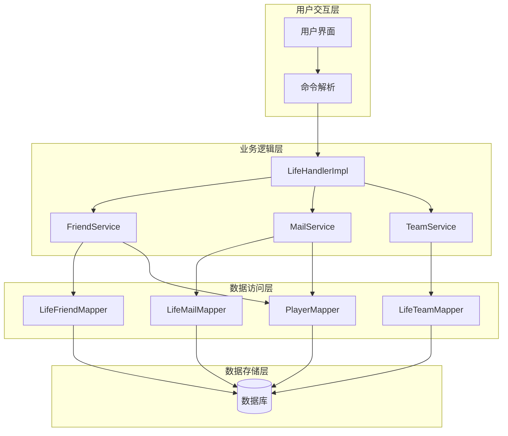
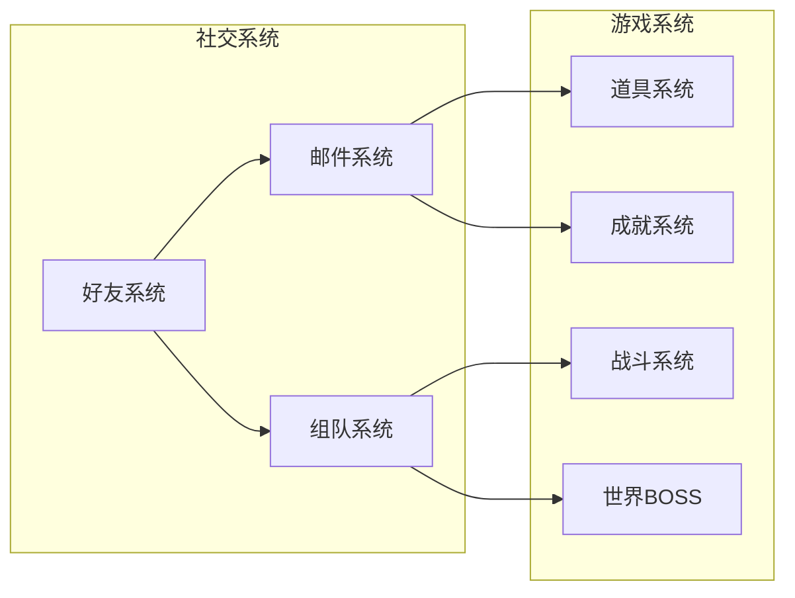

# 社交系统

<cite>
**本文档引用的文件**
- [LifeHandlerImpl.java](file://Life/src/main/java/com/bot/life/service/impl/LifeHandlerImpl.java)
- [FriendService.java](file://Life/src/main/java/com/bot/life/service/FriendService.java)
- [FriendServiceImpl.java](file://Life/src/main/java/com/bot/life/service/impl/FriendServiceImpl.java)
- [MailService.java](file://Life/src/main/java/com/bot/life/service/MailService.java)
- [MailServiceImpl.java](file://Life/src/main/java/com/bot/life/service/impl/MailServiceImpl.java)
- [TeamService.java](file://Life/src/main/java/com/bot/life/service/TeamService.java)
- [TeamServiceImpl.java](file://Life/src/main/java/com/bot/life/service/impl/TeamServiceImpl.java)
- [LifeFriend.java](file://Life/src/main/java/com/bot/life/dao/entity/LifeFriend.java)
- [LifeMail.java](file://Life/src/main/java/com/bot/life/dao/entity/LifeMail.java)
- [LifeTeam.java](file://Life/src/main/java/com/bot/life/dao/entity/LifeTeam.java)
- [LifeFriendMapper.java](file://Life/src/main/java/com/bot/life/dao/mapper/LifeFriendMapper.java)
- [LifeMailMapper.java](file://Life/src/main/java/com/bot/life/dao/mapper/LifeMailMapper.java)
- [LifeTeamMapper.java](file://Life/src/main/java/com/bot/life/dao/mapper/LifeTeamMapper.java)
- [Life_User_Manual.md](file://Life_User_Manual.md)
</cite>

## 目录
1. [系统概述](#系统概述)
2. [好友系统](#好友系统)
3. [邮件系统](#邮件系统)
4. [组队系统](#组队系统)
5. [数据交互流程](#数据交互流程)
6. [应用场景](#应用场景)
7. [技术架构](#技术架构)
8. [总结](#总结)

## 系统概述

社交系统是浮生卷游戏中的重要组成部分，为玩家提供了好友管理、邮件通信和组队协作的功能。该系统采用模块化设计，通过独立的服务层实现各项社交功能，支持玩家之间的互动和资源共享。

### 核心特性

- **好友系统**：支持好友添加、申请管理和好友列表查看
- **邮件系统**：提供好友间邮件通信，支持附件传输
- **组队系统**：支持2人小队组队，用于副本挑战和协作
- **实时交互**：所有操作均通过文字指令完成，响应迅速
- **数据持久化**：所有社交数据存储在数据库中，保证数据安全

## 好友系统

好友系统是社交系统的基础功能，允许玩家添加好友、管理好友关系，并通过好友系统进行邮件通信。

### 功能架构

**图表来源**
- [FriendService.java](file://Life/src/main/java/com/bot/life/service/FriendService.java#L1-L57)
- [FriendServiceImpl.java](file://Life/src/main/java/com/bot/life/service/impl/FriendServiceImpl.java#L1-L178)
- [LifeFriend.java](file://Life/src/main/java/com/bot/life/dao/entity/LifeFriend.java#L1-L23)

### 好友申请处理流程

**图表来源**
- [LifeHandlerImpl.java](file://Life/src/main/java/com/bot/life/service/impl/LifeHandlerImpl.java#L612-L619)
- [FriendServiceImpl.java](file://Life/src/main/java/com/bot/life/service/impl/FriendServiceImpl.java#L28-L66)

### 好友状态管理

好友关系采用双状态设计：
- **待确认状态（status=0）**：发起好友申请，等待对方确认
- **已同意状态（status=1）**：双方建立好友关系

### 数据结构设计

好友关系表包含以下字段：
- `id`: 主键标识
- `playerId`: 玩家ID（被申请者）
- `friendId`: 好友ID（申请者）
- `status`: 关系状态（0待确认，1已同意）
- `createTime`: 创建时间
- `updateTime`: 更新时间

**章节来源**
- [FriendServiceImpl.java](file://Life/src/main/java/com/bot/life/service/impl/FriendServiceImpl.java#L28-L178)
- [LifeFriend.java](file://Life/src/main/java/com/bot/life/dao/entity/LifeFriend.java#L1-L23)

## 邮件系统

邮件系统为玩家提供了便捷的通信方式，支持好友间的文本消息传递和道具附件传输。

### 功能架构

**图表来源**
- [MailService.java](file://Life/src/main/java/com/bot/life/service/MailService.java#L1-L75)
- [MailServiceImpl.java](file://Life/src/main/java/com/bot/life/service/impl/MailServiceImpl.java#L1-L355)
- [LifeMail.java](file://Life/src/main/java/com/bot/life/dao/entity/LifeMail.java#L1-L31)

### 邮件发送流程

**图表来源**
- [MailServiceImpl.java](file://Life/src/main/java/com/bot/life/service/impl/MailServiceImpl.java#L86-L118)

### 附件处理机制

邮件系统支持道具附件功能，通过JSON格式存储附件信息：

**图表来源**
- [MailServiceImpl.java](file://Life/src/main/java/com/bot/life/service/impl/MailServiceImpl.java#L121-L179)

### 邮件类型分类

系统支持两种邮件类型：
- **系统邮件（mailType=1）**：由系统发送的重要通知
- **好友邮件（mailType=2）**：玩家间相互发送的邮件

### 邮件状态管理

邮件状态通过多个字段控制：
- `isRead`：0未读，1已读
- `hasAttachment`：0无附件，1有附件
- `isReceived`：0未领取，1已领取

**章节来源**
- [MailServiceImpl.java](file://Life/src/main/java/com/bot/life/service/impl/MailServiceImpl.java#L46-L355)
- [LifeMail.java](file://Life/src/main/java/com/bot/life/dao/entity/LifeMail.java#L1-L31)

## 组队系统

组队系统支持最多2人的小队组队，主要用于副本挑战和协作玩法。

### 功能架构

**图表来源**
- [TeamService.java](file://Life/src/main/java/com/bot/life/service/TeamService.java#L1-L79)
- [TeamServiceImpl.java](file://Life/src/main/java/com/bot/life/service/impl/TeamServiceImpl.java#L1-L378)
- [LifeTeam.java](file://Life/src/main/java/com/bot/life/dao/entity/LifeTeam.java#L1-L26)

### 队伍状态流转

**图表来源**
- [TeamServiceImpl.java](file://Life/src/main/java/com/bot/life/service/impl/TeamServiceImpl.java#L376-L376)

### 组队操作流程

**图表来源**
- [LifeHandlerImpl.java](file://Life/src/main/java/com/bot/life/service/impl/LifeHandlerImpl.java#L756-L781)
- [TeamServiceImpl.java](file://Life/src/main/java/com/bot/life/service/impl/TeamServiceImpl.java#L29-L114)

### 队伍成员管理

队伍系统支持以下成员管理功能：
- **申请加入**：玩家向队长发送加入申请
- **同意/拒绝**：队长处理队员申请
- **主动离开**：队员主动退出队伍
- **解散队伍**：队长解散整个队伍

**章节来源**
- [TeamServiceImpl.java](file://Life/src/main/java/com/bot/life/service/impl/TeamServiceImpl.java#L29-L378)
- [LifeTeam.java](file://Life/src/main/java/com/bot/life/dao/entity/LifeTeam.java#L1-L26)

## 数据交互流程

社交系统的数据交互遵循清晰的层次结构，确保数据的一致性和完整性。

### 整体架构图

**图表来源**
- [LifeHandlerImpl.java](file://Life/src/main/java/com/bot/life/service/impl/LifeHandlerImpl.java#L1-L100)
- [FriendServiceImpl.java](file://Life/src/main/java/com/bot/life/service/impl/FriendServiceImpl.java#L1-L50)
- [MailServiceImpl.java](file://Life/src/main/java/com/bot/life/service/impl/MailServiceImpl.java#L1-L50)

### 数据一致性保障

系统通过以下机制确保数据一致性：
- **事务管理**：关键操作使用数据库事务
- **状态验证**：操作前验证相关状态
- **权限检查**：确保只有授权用户可执行操作
- **数据校验**：对输入数据进行严格校验

**章节来源**
- [LifeHandlerImpl.java](file://Life/src/main/java/com/bot/life/service/impl/LifeHandlerImpl.java#L1-L800)

## 应用场景

社交系统在浮生卷游戏中的应用场景广泛，为玩家提供了丰富的互动体验。

### 好友系统应用场景

1. **日常交流**
   - 玩家间问候和闲聊
   - 分享游戏心得和经验
   - 组织线下聚会

2. **资源分享**
   - 交换稀有道具
   - 分享修炼心得
   - 互相赠送礼物

3. **团队协作**
   - 组建修炼小组
   - 共同挑战高难度副本
   - 互相帮助完成任务

### 邮件系统应用场景

1. **物品交易**
   - 玩家间买卖装备和道具
   - 交易灵粹和其他资源
   - 转移稀有物品

2. **信息传递**
   - 发送重要公告和通知
   - 分享游戏攻略和技巧
   - 传递系统消息

3. **社交互动**
   - 发送生日祝福
   - 传递感谢和道歉
   - 建立长期友谊

### 组队系统应用场景

1. **副本挑战**
   - 2人小队挑战高难度副本
   - 共享战斗经验和策略
   - 提升通关效率

2. **竞技对战**
   - 组队参加竞技场
   - 互相切磋技艺
   - 提升战斗技巧

3. **日常活动**
   - 一起探索地图
   - 合作完成任务
   - 互相帮助成长

### 跨系统联动

社交系统与其他游戏系统紧密联动：

**图表来源**
- [LifeHandlerImpl.java](file://Life/src/main/java/com/bot/life/service/impl/LifeHandlerImpl.java#L244-L311)

**章节来源**
- [Life_User_Manual.md](file://Life_User_Manual.md#L191-L219)

## 技术架构

社交系统采用分层架构设计，确保系统的可维护性和扩展性。

### 架构特点

1. **模块化设计**
   - 每个社交功能独立封装
   - 便于单独测试和维护
   - 支持功能独立升级

2. **接口抽象**
   - 使用接口定义服务契约
   - 支持多种实现方式
   - 提高系统灵活性

3. **数据持久化**
   - 使用ORM框架管理数据
   - 支持复杂查询操作
   - 确保数据安全

4. **异步处理**
   - 邮件发送采用异步处理
   - 提升用户体验
   - 减少系统响应时间

### 性能优化

系统采用以下性能优化策略：
- **连接池管理**：数据库连接池复用
- **缓存机制**：常用数据缓存
- **批量操作**：减少数据库交互次数
- **索引优化**：关键字段建立索引

**章节来源**
- [FriendServiceImpl.java](file://Life/src/main/java/com/bot/life/service/impl/FriendServiceImpl.java#L1-L178)
- [MailServiceImpl.java](file://Life/src/main/java/com/bot/life/service/impl/MailServiceImpl.java#L1-L355)
- [TeamServiceImpl.java](file://Life/src/main/java/com/bot/life/service/impl/TeamServiceImpl.java#L1-L378)

## 总结

浮生卷的社交系统通过好友、邮件和组队三大核心功能，为玩家构建了一个完整的社交生态。系统设计遵循模块化原则，具有良好的可扩展性和维护性。

### 系统优势

1. **功能完整**：涵盖社交互动的主要需求
2. **易于使用**：简洁明了的操作界面
3. **数据安全**：完善的权限控制和数据保护
4. **性能稳定**：高效的数据库设计和缓存机制
5. **扩展性强**：支持未来功能扩展

### 发展方向

1. **功能增强**：增加更多社交功能如群组、聊天室
2. **性能优化**：进一步提升系统响应速度
3. **用户体验**：改进界面设计和交互体验
4. **数据分析**：添加社交行为分析功能

社交系统作为游戏的重要组成部分，不仅增强了玩家间的互动体验，也为游戏的长期发展奠定了坚实的基础。通过持续的优化和功能扩展，社交系统将为玩家带来更加丰富和有趣的社交体验。