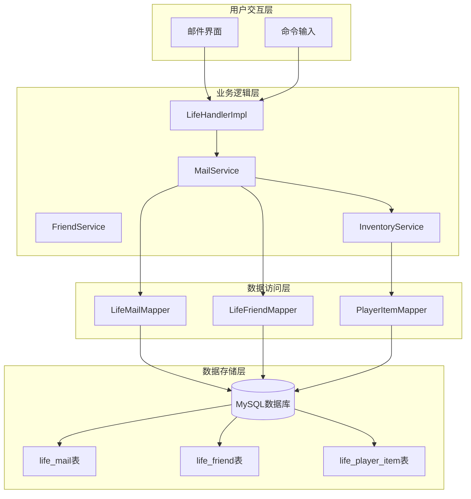
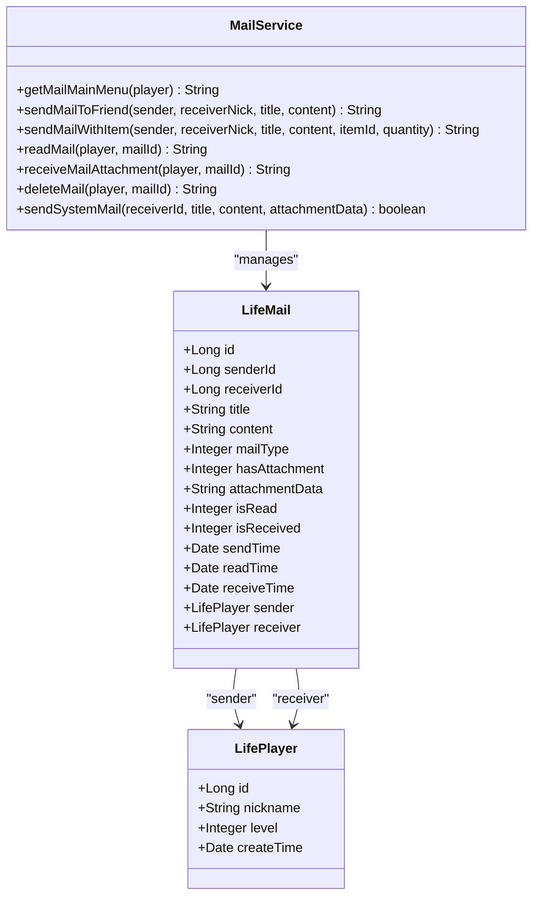
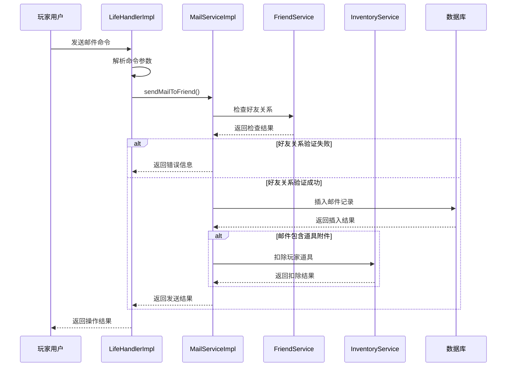
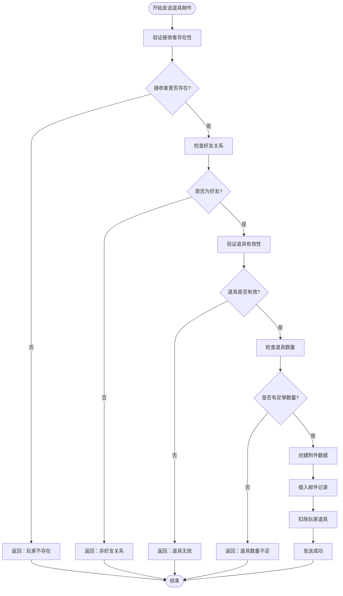
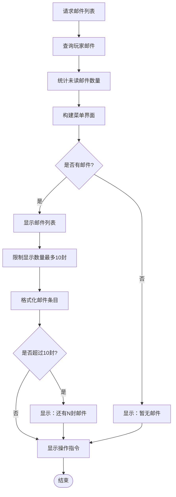
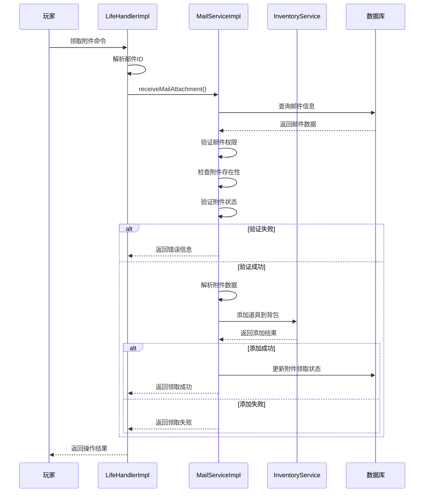
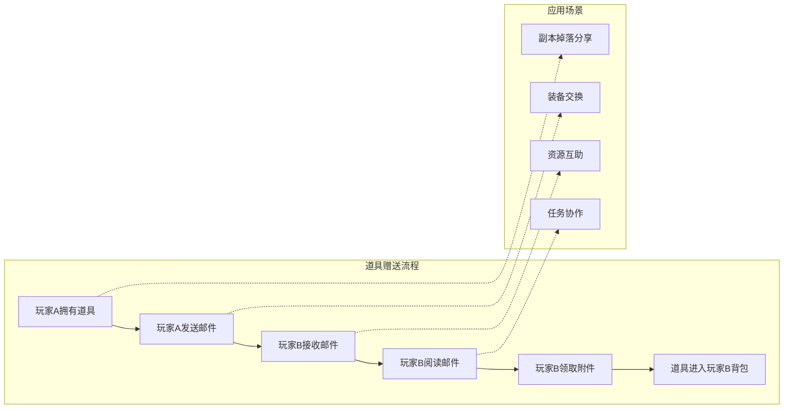
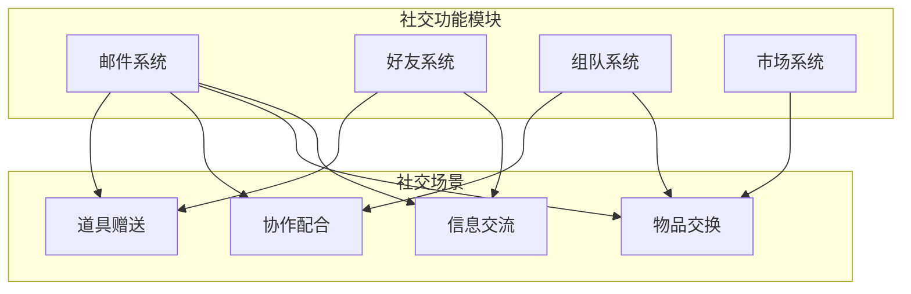
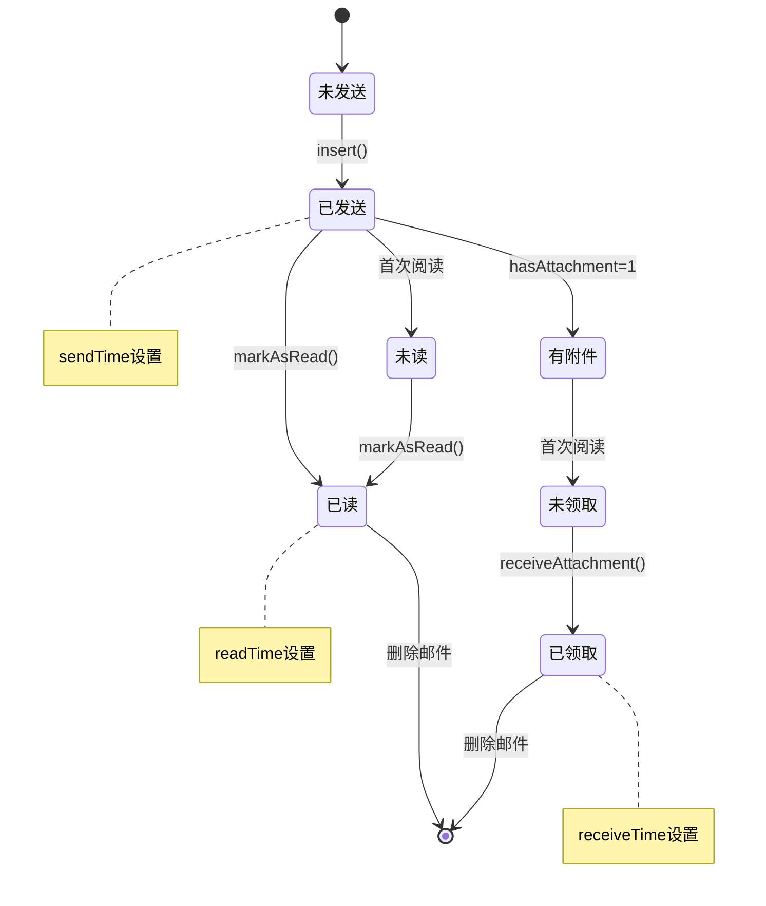
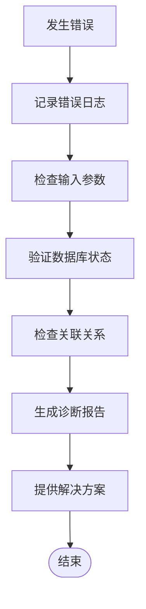

# 邮件系统

<cite>
**本文档引用的文件**
- [LifeMail.java](file://Life/src/main/java/com/bot/life/dao/entity/LifeMail.java)
- [MailService.java](file://Life/src/main/java/com/bot/life/service/MailService.java)
- [MailServiceImpl.java](file://Life/src/main/java/com/bot/life/service/impl/MailServiceImpl.java)
- [LifeHandlerImpl.java](file://Life/src/main/java/com/bot/life/service/impl/LifeHandlerImpl.java)
- [LifeMailMapper.java](file://Life/src/main/java/com/bot/life/dao/mapper/LifeMailMapper.java)
- [LifeMailMapper.xml](file://Life/src/main/resources/mapper/LifeMailMapper.xml)
- [FriendService.java](file://Life/src/main/java/com/bot/life/service/FriendService.java)
- [InventoryService.java](file://Life/src/main/java/com/bot/life/service/InventoryService.java)
- [Life_User_Manual.md](file://Life_User_Manual.md)
- [浮生卷开发说明.md](file://浮生卷开发说明.md)
- [Life_Database_Init.sql](file://Life_Database_Init.sql)
</cite>

## 目录
1. [系统概述](#系统概述)
2. [邮件系统架构](#邮件系统架构)
3. [核心数据结构](#核心数据结构)
4. [邮件发送机制](#邮件发送机制)
5. [邮件读取与管理](#邮件读取与管理)
6. [附件领取流程](#附件领取流程)
7. [社交应用场景](#社交应用场景)
8. [系统配置与扩展](#系统配置与扩展)
9. [故障排除指南](#故障排除指南)
10. [总结](#总结)

## 系统概述

浮生卷邮件系统是一个基于文本的社交通信平台，支持玩家之间的信息传递和道具赠送。该系统作为游戏社交功能的核心组件，提供了完整的邮件生命周期管理，包括发送、接收、阅读、附件领取和删除等操作。

### 系统特性

- **好友间通信**：支持玩家之间发送文本邮件和道具邮件
- **附件系统**：支持任意游戏道具作为邮件附件
- **分类管理**：区分系统邮件和好友邮件两种类型
- **状态跟踪**：提供邮件阅读状态和附件领取状态管理
- **安全验证**：确保邮件操作的安全性和完整性

## 邮件系统架构

**架构图来源**
- [LifeHandlerImpl.java](file://Life/src/main/java/com/bot/life/service/impl/LifeHandlerImpl.java#L661-L718)
- [MailServiceImpl.java](file://Life/src/main/java/com/bot/life/service/impl/MailServiceImpl.java#L25-L42)

## 核心数据结构

### 邮件实体模型

邮件系统的核心数据结构围绕`LifeMail`实体展开，定义了邮件的所有属性和关联关系。

**类图来源**
- [LifeMail.java](file://Life/src/main/java/com/bot/life/dao/entity/LifeMail.java#L11-L30)
- [MailService.java](file://Life/src/main/java/com/bot/life/service/MailService.java#L9-L74)

### 数据库表结构

邮件系统在数据库中通过`life_mail`表进行持久化存储，支持多种邮件类型和状态管理。

| 字段名 | 类型 | 约束 | 描述 |
|--------|------|------|------|
| id | bigint | PRIMARY KEY, AUTO_INCREMENT | 邮件唯一标识符 |
| sender_id | bigint | NOT NULL | 发送者玩家ID |
| receiver_id | bigint | NOT NULL | 接收者玩家ID |
| title | varchar(100) | NOT NULL | 邮件主题 |
| content | text | NULL | 邮件正文内容 |
| mail_type | integer | DEFAULT 1 | 邮件类型：1系统邮件2好友邮件 |
| has_attachment | integer | DEFAULT 0 | 是否有附件：0无1有 |
| attachment_data | longtext | NULL | 附件数据（JSON格式） |
| is_read | integer | DEFAULT 0 | 是否已读：0未读1已读 |
| is_received | integer | DEFAULT 0 | 附件是否已领取：0未领取1已领取 |
| send_time | datetime | DEFAULT CURRENT_TIMESTAMP | 发送时间 |
| read_time | datetime | NULL | 阅读时间 |
| receive_time | datetime | NULL | 领取时间 |

**表格来源**
- [Life_Database_Init.sql](file://Life_Database_Init.sql#L263-L277)

**节来源**
- [LifeMail.java](file://Life/src/main/java/com/bot/life/dao/entity/LifeMail.java#L11-L30)
- [LifeMailMapper.java](file://Life/src/main/java/com/bot/life/dao/mapper/LifeMailMapper.java#L11-L47)
- [Life_Database_Init.sql](file://Life_Database_Init.sql#L263-L277)

## 邮件发送机制

### 好友邮件发送流程

邮件发送是社交系统的核心功能，支持文本邮件和道具邮件两种类型。

**序列图来源**
- [LifeHandlerImpl.java](file://Life/src/main/java/com/bot/life/service/impl/LifeHandlerImpl.java#L689-L707)
- [MailServiceImpl.java](file://Life/src/main/java/com/bot/life/service/impl/MailServiceImpl.java#L86-L118)

### 道具邮件发送机制

道具邮件是邮件系统的重要特色功能，允许玩家之间进行道具赠送。

**流程图来源**
- [MailServiceImpl.java](file://Life/src/main/java/com/bot/life/service/impl/MailServiceImpl.java#L121-L183)

**节来源**
- [MailServiceImpl.java](file://Life/src/main/java/com/bot/life/service/impl/MailServiceImpl.java#L86-L183)
- [LifeHandlerImpl.java](file://Life/src/main/java/com/bot/life/service/impl/LifeHandlerImpl.java#L689-L707)

## 邮件读取与管理

### 邮件列表展示

邮件系统提供直观的邮件列表界面，支持分页显示和状态筛选。

**流程图来源**
- [MailServiceImpl.java](file://Life/src/main/java/com/bot/life/service/impl/MailServiceImpl.java#L46-L82)

### 邮件详情读取

邮件读取功能支持查看邮件完整内容，并自动标记为已读状态。

| 操作步骤 | 处理逻辑 | 错误处理 |
|----------|----------|----------|
| 验证邮件存在性 | 查询数据库确认邮件ID有效性 | 返回"邮件不存在！" |
| 权限验证 | 检查邮件接收者是否为当前玩家 | 返回"这不是你的邮件！" |
| 自动标记已读 | 更新邮件状态为已读，记录阅读时间 | 记录日志，不影响后续操作 |
| 构建邮件内容 | 组装发送者信息、标题、内容、附件信息 | 附件解析失败时显示异常提示 |

**表格来源**
- [MailServiceImpl.java](file://Life/src/main/java/com/bot/life/service/impl/MailServiceImpl.java#L187-L243)

**节来源**
- [MailServiceImpl.java](file://Life/src/main/java/com/bot/life/service/impl/MailServiceImpl.java#L46-L243)
- [LifeHandlerImpl.java](file://Life/src/main/java/com/bot/life/service/impl/LifeHandlerImpl.java#L663-L669)

## 附件领取流程

### 道具附件领取机制

附件领取是邮件系统的关键功能，确保道具能够安全地从邮件转移到玩家背包。

**序列图来源**
- [LifeHandlerImpl.java](file://Life/src/main/java/com/bot/life/service/impl/LifeHandlerImpl.java#L676-L686)
- [MailServiceImpl.java](file://Life/src/main/java/com/bot/life/service/impl/MailServiceImpl.java#L247-L294)

### 附件数据结构

附件系统采用JSON格式存储附件信息，支持多种附件类型。

| 字段名 | 类型 | 描述 | 示例 |
|--------|------|------|------|
| type | string | 附件类型标识 | "item" |
| itemId | long | 道具唯一标识符 | 1001 |
| itemName | string | 道具名称 | "大力丸" |
| quantity | integer | 道具数量 | 5 |

**表格来源**
- [MailServiceImpl.java](file://Life/src/main/java/com/bot/life/service/impl/MailServiceImpl.java#L149-L154)

**节来源**
- [MailServiceImpl.java](file://Life/src/main/java/com/bot/life/service/impl/MailServiceImpl.java#L247-L294)
- [LifeHandlerImpl.java](file://Life/src/main/java/com/bot/life/service/impl/LifeHandlerImpl.java#L676-L686)

## 社交应用场景

### 道具赠送场景

邮件系统在游戏社交中扮演着重要角色，特别是在道具赠送方面。

**图表来源**
- [MailServiceImpl.java](file://Life/src/main/java/com/bot/life/service/impl/MailServiceImpl.java#L121-L183)

### 信息传递场景

除了道具赠送，邮件系统还支持各种信息传递需求。

| 应用场景 | 实现方式 | 优势特点 |
|----------|----------|----------|
| 好友问候 | 文本邮件 | 简单直接，增进感情 |
| 战队协作 | 系统邮件通知 | 及时准确，便于管理 |
| 任务提醒 | 系统邮件推送 | 自动化程度高 |
| 活动公告 | 系统邮件群发 | 覆盖范围广 |
| 交易协商 | 好友邮件沟通 | 安全可靠 |

**表格来源**
- [Life_User_Manual.md](file://Life_User_Manual.md#L198-L202)

### 社交功能集成

邮件系统与游戏其他社交功能紧密集成，形成完整的社交生态。

**图表来源**
- [FriendService.java](file://Life/src/main/java/com/bot/life/service/FriendService.java#L9-L57)
- [InventoryService.java](file://Life/src/main/java/com/bot/life/service/InventoryService.java#L9-L53)

**节来源**
- [Life_User_Manual.md](file://Life_User_Manual.md#L198-L202)
- [MailServiceImpl.java](file://Life/src/main/java/com/bot/life/service/impl/MailServiceImpl.java#L121-L183)

## 系统配置与扩展

### 邮件类型配置

系统支持两种邮件类型，分别适用于不同的使用场景。

| 邮件类型 | ID值 | 发送者ID | 使用场景 | 特殊限制 |
|----------|------|----------|----------|----------|
| 系统邮件 | 1 | 0 | 系统通知、活动公告 | 无附件限制 |
| 好友邮件 | 2 | 玩家ID | 玩家间通信 | 需要好友关系 |

**表格来源**
- [MailServiceImpl.java](file://Life/src/main/java/com/bot/life/service/impl/MailServiceImpl.java#L322-L343)

### 状态管理机制

邮件系统通过多个状态字段实现精细化的状态管理。

**状态图来源**
- [LifeMail.java](file://Life/src/main/java/com/bot/life/dao/entity/LifeMail.java#L21-L25)

### 性能优化策略

为了应对大量邮件数据，系统采用了多种性能优化措施。

| 优化策略 | 实现方式 | 效果 |
|----------|----------|------|
| 分页显示 | 限制邮件列表显示数量（最多10封） | 减少内存占用 |
| 索引优化 | 在receiver_id字段建立索引 | 加快查询速度 |
| 状态缓存 | 缓存未读邮件数量 | 减少数据库查询 |
| 异步处理 | 邮件发送异步执行 | 提升响应速度 |

**表格来源**
- [LifeMailMapper.java](file://Life/src/main/java/com/bot/life/dao/mapper/LifeMailMapper.java#L31-L41)

**节来源**
- [MailServiceImpl.java](file://Life/src/main/java/com/bot/life/service/impl/MailServiceImpl.java#L322-L343)
- [LifeMailMapper.java](file://Life/src/main/java/com/bot/life/dao/mapper/LifeMailMapper.java#L31-L41)

## 故障排除指南

### 常见问题及解决方案

| 问题类型 | 症状描述 | 可能原因 | 解决方案 |
|----------|----------|----------|----------|
| 邮件发送失败 | 返回"邮件发送失败！" | 数据库连接异常、参数格式错误 | 检查数据库连接，验证命令格式 |
| 道具领取失败 | 返回"领取失败，请重试！" | 道具添加到背包失败 | 检查背包容量，验证道具有效性 |
| 邮件不存在 | 返回"邮件不存在！" | 邮件ID错误或已被删除 | 确认邮件ID正确性 |
| 非好友关系 | 返回"不是你的好友" | 发送者与接收者非好友关系 | 确保双方已添加为好友 |
| 附件已领取 | 返回"附件已经领取过了！" | 附件已被其他玩家领取 | 检查附件领取状态 |

### 调试信息收集

系统提供了详细的调试信息，帮助定位问题。

**流程图来源**
- [MailServiceImpl.java](file://Life/src/main/java/com/bot/life/service/impl/MailServiceImpl.java#L115-L118)
- [MailServiceImpl.java](file://Life/src/main/java/com/bot/life/service/impl/MailServiceImpl.java#L291-L294)

### 性能监控指标

| 监控指标 | 监控方法 | 正常范围 | 异常处理 |
|----------|----------|----------|----------|
| 邮件查询响应时间 | 记录查询耗时 | < 100ms | 优化SQL查询，增加索引 |
| 邮件发送成功率 | 统计发送成功/失败比例 | > 95% | 检查数据库连接和业务逻辑 |
| 邮件存储大小 | 监控数据库表大小 | 控制在合理范围内 | 定期清理过期邮件 |
| 并发处理能力 | 测试并发发送能力 | 支持100+并发 | 优化数据库连接池 |

**表格来源**
- [LifeMailMapper.xml](file://Life/src/main/resources/mapper/LifeMailMapper.xml#L47-L63)

**节来源**
- [MailServiceImpl.java](file://Life/src/main/java/com/bot/life/service/impl/MailServiceImpl.java#L115-L118)
- [MailServiceImpl.java](file://Life/src/main/java/com/bot/life/service/impl/MailServiceImpl.java#L291-L294)

## 总结

浮生卷邮件系统是一个功能完善、设计合理的社交通信平台。它不仅支持基本的文本邮件功能，还创新性地集成了道具赠送功能，为玩家提供了丰富的社交体验。

### 系统优势

1. **功能完整性**：涵盖了邮件生命周期的所有关键环节
2. **用户体验**：简洁直观的操作界面，清晰的状态反馈
3. **安全性**：完善的权限验证和状态管理机制
4. **扩展性**：模块化设计，易于功能扩展和维护
5. **性能优化**：针对大数据量场景进行了专门优化

### 技术特色

- **JSON附件格式**：灵活的数据存储方式，支持多种附件类型
- **状态驱动设计**：通过状态字段精确控制邮件流转过程
- **事务一致性**：确保邮件发送和道具转移的一致性
- **异步处理**：提升系统响应性能和用户体验

### 应用价值

邮件系统作为游戏社交功能的核心组件，不仅促进了玩家之间的互动，还为游戏运营提供了重要的数据支撑。通过道具赠送功能，系统有效促进了游戏内经济循环，增强了玩家粘性。

未来可以考虑的功能扩展包括：
- 邮件搜索和过滤功能
- 邮件模板系统
- 邮件转发功能
- 邮件批量操作
- 邮件加密传输

这些扩展将进一步提升邮件系统的实用性和用户体验。