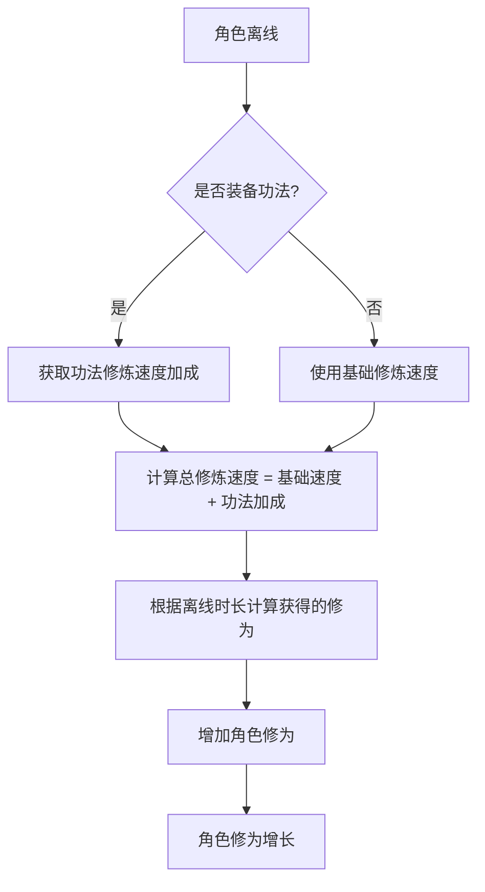
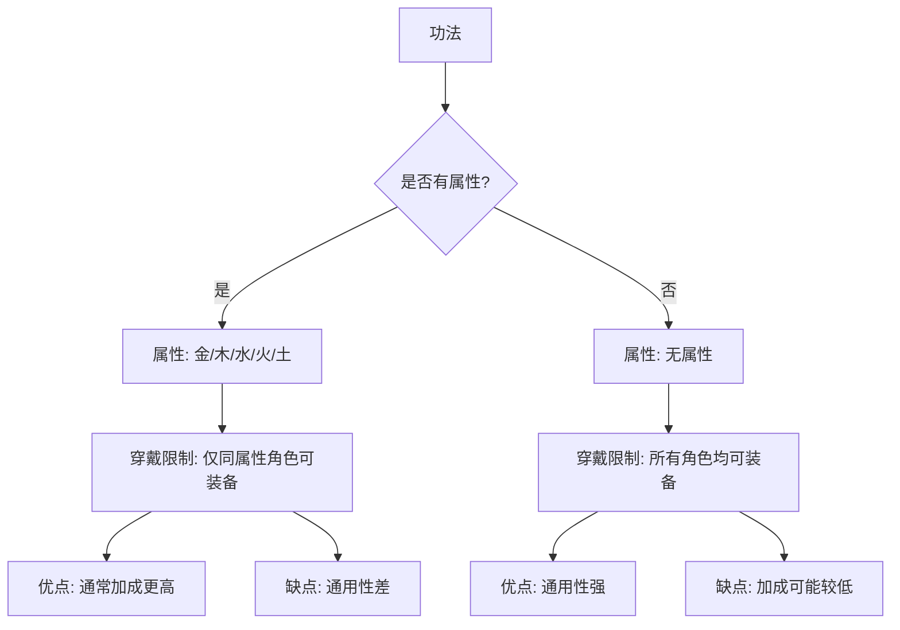

# 功法

<cite>
**本文档引用文件**  
- [Life_User_Manual.md](file://Life_User_Manual.md)
- [InventoryServiceImpl.java](file://Life/src/main/java/com/bot/life/service/impl/InventoryServiceImpl.java)
- [ENEquipmentType.java](file://Life/src/main/java/com/bot/life/enums/ENEquipmentType.java)
- [LifeEquipment.java](file://Life/src/main/java/com/bot/life/dao/entity/LifeEquipment.java)
- [LifePlayerEquipment.java](file://Life/src/main/java/com/bot/life/dao/entity/LifePlayerEquipment.java)
- [LifePlayer.java](file://Life/src/main/java/com/bot/life/dao/entity/LifePlayer.java)
- [RealmServiceImpl.java](file://Life/src/main/java/com/bot/life/service/impl/RealmServiceImpl.java)
- [浮生卷开发说明.md](file://浮生卷开发说明.md)
</cite>

## 目录
1. [功法系统概述](#功法系统概述)
2. [属性加成机制](#属性加成机制)
3. [修炼速度提升效果](#修炼速度提升效果)
4. [穿戴规则](#穿戴规则)
5. [有属性与无属性功法的使用限制](#有属性与无属性功法的使用限制)
6. [对角色修为增长的影响](#对角色修为增长的影响)
7. [功法在角色养成中的战略价值](#功法在角色养成中的战略价值)

## 功法系统概述

功法是《浮生卷》游戏中作为装备类型之一的核心养成要素，属于角色可装备的四大装备类别之一（功法、心法、神通、法宝）。根据《浮生卷开发说明.md》和《Life_User_Manual.md》的描述，每个角色可以装备一本功法。

功法的主要功能是提供**修炼速度加成**和**少量基础属性加成**。游戏的基础修炼速度为+10修为/分钟，功法的作用是在此基础上提供更快的修炼速度，使角色即使在离线状态下也能持续增加修为，这是角色提升境界和实力的根本途径。

功法分为**有属性功法**和**无属性功法**两大类，这一分类直接关联到游戏的核心五行（金、木、水、火、土）相生相克系统，对玩家的装备选择和角色养成策略产生了深远影响。

**Section sources**
- [浮生卷开发说明.md](file://浮生卷开发说明.md#L59-L61)
- [Life_User_Manual.md](file://Life_User_Manual.md#L125-L128)

## 属性加成机制

功法提供的属性加成是其辅助功能，主要体现在对角色基础属性的永久性提升。这些基础属性包括：
- **速度**：决定战斗中的出手顺序，并影响破防能力。
- **体质**：影响角色的血量上限和防御力。
- **灵力**：影响角色的会心率（暴击率）和会心效果（暴击伤害倍数）。
- **力量**：影响角色的攻击力和破防能力。

在代码实现层面，功法的属性加成是通过`LifeEquipment`实体类中的配置来实现的。当角色装备功法时，系统会读取该功法的属性配置，并将其加成应用到角色的相应属性上。例如，在境界突破时，`RealmServiceImpl`中的`applyBreakthroughBonus`方法会处理类似`"speed": 10`或`"cultivation_speed": 5`这样的属性加成配置，直接修改角色的属性值。

这种加成是直接且永久的，会立即提升角色的战斗能力和养成效率。

```mermaid
classDiagram
class LifePlayer {
+Long id
+String nickname
+Integer attribute
+Long cultivation
+Integer speed
+Integer constitution
+Integer spiritPower
+Integer strength
+Integer cultivationSpeed
+calculateExtendedAttributes()
+gainCultivation()
}
class LifeEquipment {
+Long id
+String name
+Integer type
+Integer attribute
+Integer rarity
+String description
}
class LifePlayerEquipment {
+Long id
+Long playerId
+Long equipmentId
+Integer isEquipped
+LifeEquipment equipment
}
LifePlayer "1" -- "0..*" LifePlayerEquipment : 拥有
LifePlayerEquipment "1" -- "1" LifeEquipment : 关联
LifePlayer --> "速度, 体质, 灵力, 力量" : 基础属性
LifeEquipment --> "speed, constitution, spirit_power, strength" : 加成属性
```

**Diagram sources**
- [LifePlayer.java](file://Life/src/main/java/com/bot/life/dao/entity/LifePlayer.java)
- [LifeEquipment.java](file://Life/src/main/java/com/bot/life/dao/entity/LifeEquipment.java)
- [LifePlayerEquipment.java](file://Life/src/main/java/com/bot/life/dao/entity/LifePlayerEquipment.java)
- [RealmServiceImpl.java](file://Life/src/main/java/com/bot/life/service/impl/RealmServiceImpl.java#L208-L219)

## 修炼速度提升效果

修炼速度是功法最核心的功能。根据《Life_User_Manual.md》第83行的描述：“功法可以提升修炼速度”，这直接关系到角色修为的增长效率。

游戏的基础修炼速度为**+10修为/分钟**。功法的作用就是在此基础上提供额外的加成。例如，一件功法可能提供+5修为/分钟的加成，那么装备该功法的角色总修炼速度将达到+15修为/分钟。

在代码中，这一机制由`LifePlayer`类的`gainCultivation`方法实现。该方法会根据角色当前的`cultivationSpeed`（修炼速度）属性，结合离线时间，计算出应获得的修为量。`RealmServiceImpl`中的`applyBreakthroughBonus`方法也证实了`"cultivation_speed"`是一个可配置的属性，可以直接增加角色的`cultivationSpeed`值。

这意味着，选择一件高修炼速度加成的功法，能够显著缩短角色达到下一个境界所需的时间，是快速提升角色等级的关键。



**Diagram sources**
- [Life_User_Manual.md](file://Life_User_Manual.md#L82-L83)
- [LifePlayer.java](file://Life/src/main/java/com/bot/life/dao/entity/LifePlayer.java#L107)
- [RealmServiceImpl.java](file://Life/src/main/java/com/bot/life/service/impl/RealmServiceImpl.java#L220-L221)

## 穿戴规则

功法的穿戴遵循游戏内统一的装备系统规则，具体如下：

1.  **装备槽位**：每个角色有且仅有一个“功法”装备槽位，因此只能同时装备一本功法。
2.  **装备操作**：玩家可以通过游戏内的背包或装备界面，选择一本功法进行“装备”操作。系统会检查该功法是否符合穿戴规则（主要是属性匹配）。
3.  **卸下操作**：玩家可以随时将已装备的功法“卸下”，使其回到背包中，该装备槽位变为空。
4.  **数据存储**：装备状态由`LifePlayerEquipment`实体类管理，其中`isEquipped`字段（0为未装备，1为已装备）记录了该装备的当前状态。

这些规则确保了功法系统的简洁性和可管理性。

**Section sources**
- [浮生卷开发说明.md](file://浮生卷开发说明.md#L59)
- [LifeEquipment.java](file://Life/src/main/java/com/bot/life/dao/entity/LifeEquipment.java#L15)
- [LifePlayerEquipment.java](file://Life/src/main/java/com/bot/life/dao/entity/LifePlayerEquipment.java#L16)

## 有属性与无属性功法的使用限制

功法的使用限制是其战略价值的核心体现，主要体现在“有属性”和“无属性”的区分上。

*   **有属性功法**：这类功法具有特定的五行属性（金、木、水、火、土）。根据《浮生卷开发说明.md》第61行的描述：“有属性的功法仅属性相同的角色才能装备”。这意味着，一个“金”属性的角色只能装备“金”属性的功法，无法装备“木”或“火”属性的功法。这种限制强制玩家在角色创建和装备选择上必须保持属性一致性。

*   **无属性功法**：这类功法没有五行属性（在代码中`attribute`字段为0）。根据同一文档的描述：“无属性的所有人都可以用”。这使得无属性功法具有极高的通用性，任何属性的角色都可以装备。

这种设计创造了一个平衡：有属性功法通常提供更高的属性加成或更优的修炼速度，但使用受限；无属性功法虽然通用，但加成效果可能相对平庸。玩家需要在“最优选择”和“通用性”之间做出权衡。



**Diagram sources**
- [浮生卷开发说明.md](file://浮生卷开发说明.md#L61)
- [LifeEquipment.java](file://Life/src/main/java/com/bot/life/dao/entity/LifeEquipment.java#L16)
- [InventoryServiceImpl.java](file://Life/src/main/java/com/bot/life/service/impl/InventoryServiceImpl.java#L288-L289)

## 对角色修为增长的影响

功法对角色修为增长的影响是直接且决定性的。

1.  **直接影响**：功法提供的修炼速度加成会直接叠加到角色的基础修炼速度上。一个修炼速度更高的角色，在相同离线时间内获得的修为更多，从而更快地积累修为，达到境界突破的门槛。
2.  **间接影响**：功法提供的基础属性加成（如力量、灵力）会提升角色的战斗力，使其在游历探索中更容易战胜怪物，从而获得更多的修为类道具和经验值，形成良性循环。
3.  **长期影响**：由于修炼是持续进行的过程，一本优秀的功法带来的速度优势会随着时间的推移而不断累积，导致角色之间的实力差距逐渐拉大。

因此，选择一本合适的功法，是确保角色修为能够稳定、高效增长的基石。

**Section sources**
- [Life_User_Manual.md](file://Life_User_Manual.md#L80-L83)
- [LifePlayer.java](file://Life/src/main/java/com/bot/life/dao/entity/LifePlayer.java#L107)
- [浮生卷开发说明.md](file://浮生卷开发说明.md#L61)

## 功法在角色养成中的战略价值

功法在角色养成中具有极高的战略价值，主要体现在以下几个方面：

1.  **养成效率的核心**：作为修为增长的主要加速器，功法的选择直接决定了角色的成长速度。在竞争环境中，更快的升级速度意味着能更早地解锁高级功能和挑战高难度内容。
2.  **资源分配的决策点**：玩家需要决定是追求属性匹配的“极品”有属性功法（可能需要大量资源获取或交易），还是选择方便易得的无属性功法。这涉及到对长期投入和短期收益的权衡。
3.  **角色构建的基石**：功法是角色属性构建的起点。选择一本侧重“修炼速度”的功法，适合追求快速升级的玩家；选择一本侧重“基础属性”的功法，则更适合追求战斗实力的玩家。
4.  **经济系统的关键**：由于功法的稀有度和属性差异，它们在“鬼市”交易系统中是重要的流通商品，驱动着游戏内的经济循环。

综上所述，功法不仅是简单的装备，更是玩家制定长期养成策略、进行资源管理和参与游戏经济的核心要素。

**Section sources**
- [浮生卷开发说明.md](file://浮生卷开发说明.md#L61)
- [Life_User_Manual.md](file://Life_User_Manual.md#L230-L231)
- [Life_User_Manual.md](file://Life_User_Manual.md#L215-L218)