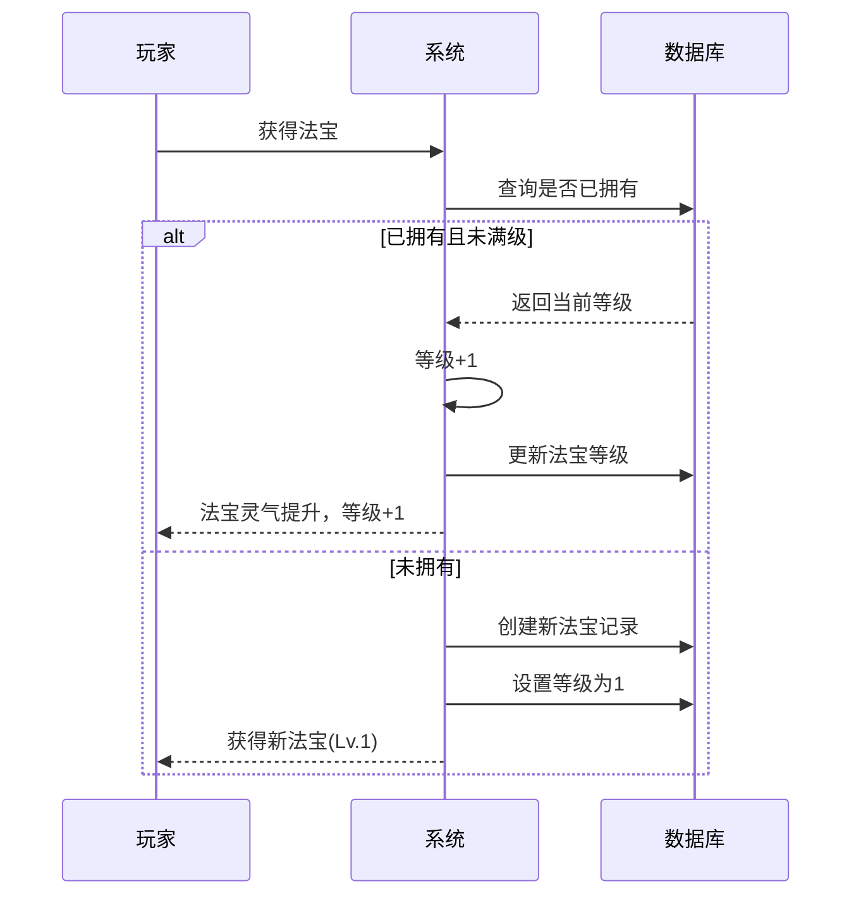
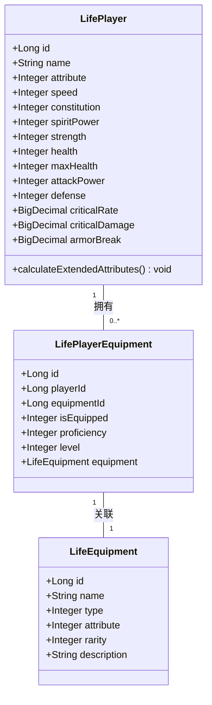

# 法宝

<cite>
**本文档引用文件**  
- [Life_User_Manual.md](file://Life_User_Manual.md)
- [LifePlayerEquipment.java](file://Life/src/main/java/com/bot/life/dao/entity/LifePlayerEquipment.java)
- [LifeEquipment.java](file://Life/src/main/java/com/bot/life/dao/entity/LifeEquipment.java)
- [ENEquipmentType.java](file://Life/src/main/java/com/bot/life/enums/ENEquipmentType.java)
- [InventoryServiceImpl.java](file://Life/src/main/java/com/bot/life/service/impl/InventoryServiceImpl.java)
- [CommonPlayer.java](file://Game/src/main/java/com/bot/game/service/impl/CommonPlayer.java)
- [浮生卷开发说明.md](file://浮生卷开发说明.md)
</cite>

## 目录
1. [法宝系统概述](#法宝系统概述)  
2. [法宝穿戴规则](#法宝穿戴规则)  
3. [熟练度系统](#熟练度系统)  
4. [等级机制](#等级机制)  
5. [属性加成计算方式](#属性加成计算方式)  
6. [有属性与无属性法宝的使用限制](#有属性与无属性法宝的使用限制)  
7. [法宝在后期角色强化中的关键作用](#法宝在后期角色强化中的关键作用)  

## 法宝系统概述

法宝是《浮生卷》游戏中一种特殊的百分比属性加成装备，属于四大装备类型之一（功法、心法、神通、法宝）。每名玩家只能装备一件法宝，其主要功能是按百分比提升角色的战斗属性，并通过熟练度和等级系统实现持续成长。法宝不仅影响角色的基础战斗力，还在境界突破和后期强化中扮演关键角色。

根据《浮生卷游戏操作手册》描述，法宝具有以下核心特性：
- 按百分比增加战斗属性
- 拥有独立的熟练度系统
- 分为有属性（金、木、水、火、土）和无属性两种类型

**Section sources**  
- [Life_User_Manual.md](file://Life_User_Manual.md#L138-L142)

## 法宝穿戴规则

法宝作为四大核心装备之一，遵循统一的装备管理机制。玩家可通过背包界面进行法宝的穿戴、卸下和更换操作。每名玩家仅可同时装备一件法宝。

穿戴规则如下：
1. 玩家必须拥有至少一件法宝才能进行装备
2. 装备时需满足法宝的属性要求（如有属性限制）
3. 更换法宝无需消耗额外资源
4. 装备状态实时生效，属性加成立即计入角色总战力

在数据模型中，`LifePlayerEquipment` 实体通过 `isEquipped` 字段（0表示未装备，1表示已装备）记录装备状态，确保同一时间只有一件法宝处于激活状态。

**Section sources**  
- [Life_User_Manual.md](file://Life_User_Manual.md#L138-L142)  
- [LifePlayerEquipment.java](file://Life/src/main/java/com/bot/life/dao/entity/LifePlayerEquipment.java#L15)

## 熟练度系统

法宝拥有独立的熟练度系统，用于衡量玩家对法宝的掌握程度。熟练度通过使用特定道具“升级法宝类”物品进行提升。根据代码逻辑，`LifePlayerEquipment` 实体中的 `proficiency` 字段专门用于存储法宝的熟练度值，该字段仅对法宝类型装备有效。

熟练度提升机制：
- 使用“升级法宝类”道具可增加熟练度
- 道具类型在 `ENItemType` 枚举中定义为 `TREASURE_UPGRADE(4, "升级法宝类")`
- 每次使用道具将触发熟练度增长逻辑
- 熟练度达到阈值后可能解锁新的属性加成或技能效果

目前系统中熟练度功能尚在开发中，相关逻辑在 `InventoryServiceImpl` 中标记为待实现。

```mermaid
flowchart TD
A[玩家使用道具] --> B{是否为"升级法宝类"道具?}
B --> |是| C[调用法宝升级逻辑]
B --> |否| D[执行其他道具逻辑]
C --> E[增加法宝熟练度]
E --> F[检查是否升级]
F --> G[更新角色属性]
```

**Diagram sources**  
- [LifePlayerEquipment.java](file://Life/src/main/java/com/bot/life/dao/entity/LifePlayerEquipment.java#L16)  
- [ENItemType.java](file://Life/src/main/java/com/bot/life/enums/ENItemType.java#L10)  
- [InventoryServiceImpl.java](file://Life/src/main/java/com/bot/life/service/impl/InventoryServiceImpl.java#L210-L212)

## 等级机制

法宝等级是衡量其成长性的核心指标，通过收集同类型法宝碎片（灵气）进行升级。根据 `CommonPlayer.java` 中的 `addWeapon` 方法逻辑，当玩家获得已拥有的法宝时，不会重复获取，而是将其转化为“灵气”，用于提升当前法宝的等级。

等级机制具体规则：
- 法宝最高等级为5级
- 每获得一个同名法宝，等级提升1级（未满级情况下）
- 等级信息存储在 `LifePlayerEquipment` 实体的 `level` 字段中
- 满级法宝提供额外战力加成



**Diagram sources**  
- [CommonPlayer.java](file://Game/src/main/java/com/bot/game/service/impl/CommonPlayer.java#L369-L384)  
- [LifePlayerEquipment.java](file://Life/src/main/java/com/bot/life/dao/entity/LifePlayerEquipment.java#L17)

## 属性加成计算方式

法宝通过百分比方式增强角色的战斗属性，这种加成方式相较于固定数值加成更具成长性。虽然具体百分比加成公式未在现有代码中明确体现，但可以通过系统整体属性计算机制推断其作用原理。

角色属性分为基础属性和战斗属性两类：
- **基础属性**：速度、体质、灵力、力量
- **战斗属性**：血量、攻击力、防御、会心率、会心效果、破防

基础属性影响战斗属性的计算：
- 每1点速度：破防+0.005%
- 每1点体质：血量+10，防御+1
- 每1点灵力：会心+0.01%，会心效果+0.005%
- 每1点力量：攻击力+6，破防+0.01%

法宝的百分比加成应在这些基础计算完成后应用，从而实现对最终战斗属性的放大效应。当角色属性发生变化时，系统会调用 `calculateExtendedAttributes()` 方法重新计算所有拓展属性。



**Diagram sources**  
- [LifePlayer.java](file://Life/src/main/java/com/bot/life/dao/entity/LifePlayer.java#L56-L76)  
- [LifePlayerEquipment.java](file://Life/src/main/java/com/bot/life/dao/entity/LifePlayerEquipment.java)  
- [LifeEquipment.java](file://Life/src/main/java/com/bot/life/dao/entity/LifeEquipment.java)

## 有属性与无属性法宝的使用限制

法宝按照属性特性分为两类：有属性法宝和无属性法宝。这一分类直接影响其装备限制和适用范围。

| 类型 | 属性值 | 装备限制 | 适用角色 |
|------|-------|----------|----------|
| 有属性法宝 | 1-5（金、木、水、火、土） | 仅限对应属性角色装备 | 特定派系角色 |
| 无属性法宝 | 0 | 所有角色均可装备 | 全体玩家 |

根据 `LifeEquipment` 实体定义，`attribute` 字段用于标识装备属性类型。游戏规则明确规定：有属性装备只能由相同属性的角色装备，无属性装备则无此限制。这使得无属性法宝成为跨派系通用的选择，而有属性法宝则能更好地发挥属性克制优势。

在战斗中，属性克制关系如下：
- 金克木：伤害+20%
- 木克土：伤害+20%
- 土克水：伤害+20%
- 水克火：伤害+20%
- 火克金：伤害+20%

被克制时，自身防御降低10%。

**Section sources**  
- [Life_User_Manual.md](file://Life_User_Manual.md#L145)  
- [LifeEquipment.java](file://Life/src/main/java/com/bot/life/dao/entity/LifeEquipment.java#L16)

## 法宝在后期角色强化中的关键作用

法宝在角色后期强化过程中扮演着至关重要的角色，其重要性体现在多个层面：

1. **持续成长性**：通过等级和熟练度系统，法宝能够伴随角色长期成长，避免装备快速淘汰的问题。
2. **战力倍增器**：百分比属性加成机制使得法宝的增益效果随基础属性提升而放大，在后期收益尤为显著。
3. **资源积累效应**：法宝等级提升依赖于同类型法宝的收集，鼓励玩家持续参与活动获取资源。
4. **境界突破辅助**：在境界突破时，法宝提供的属性加成有助于满足更高的修为和属性要求。
5. **战术多样性**：不同属性的法宝配合属性克制系统，为PVP战斗提供更多策略选择。

此外，法宝还参与战力计算系统。根据 `CommonPlayer.java` 中的战力计算逻辑，法宝提供基础战力加成，每升一级增加额外战力，满级时还有特殊奖励。这种设计确保了法宝在整个游戏生命周期内都保持其价值和吸引力。

**Section sources**  
- [CommonPlayer.java](file://Game/src/main/java/com/bot/game/service/impl/CommonPlayer.java#L89-L103)  
- [浮生卷开发说明.md](file://浮生卷开发说明.md#L27-L45)