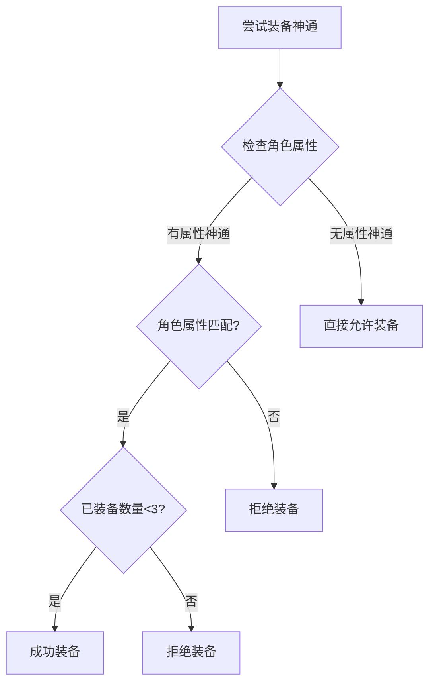
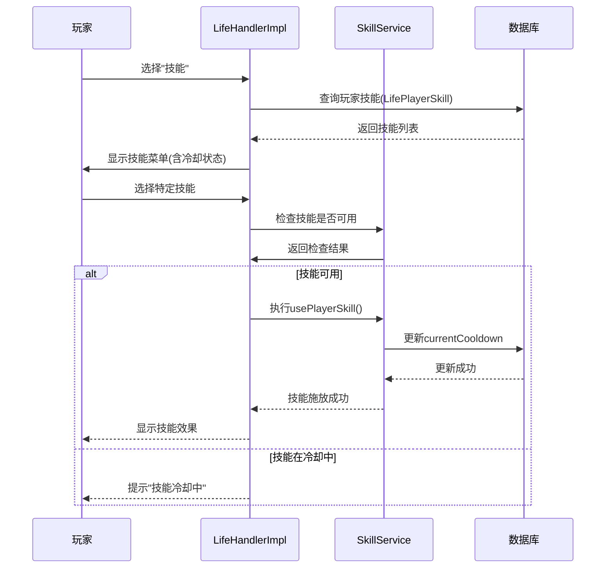
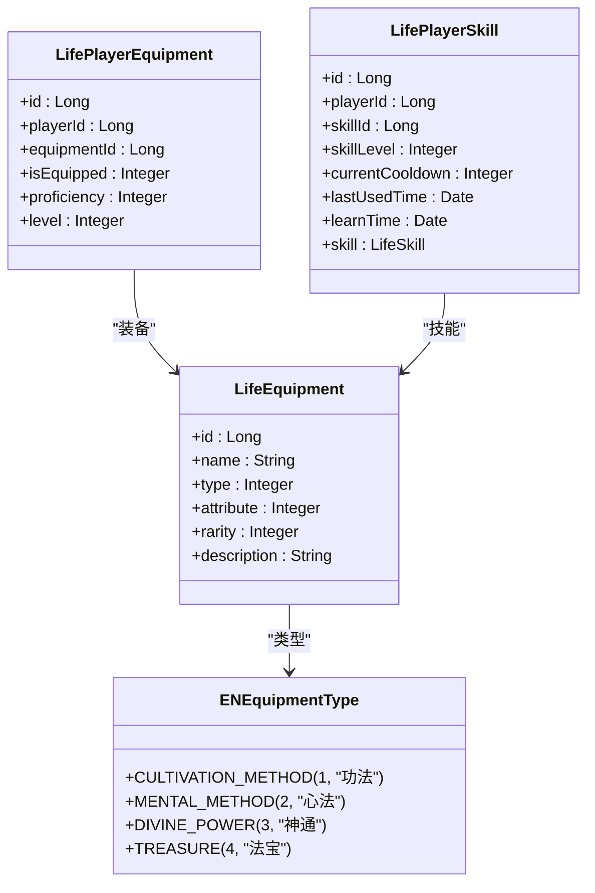

# 神通

<cite>
**本文档引用文件**   
- [Life_User_Manual.md](file://Life_User_Manual.md)
- [LifeHandlerImpl.java](file://Life/src/main/java/com/bot/life/service/impl/LifeHandlerImpl.java)
- [ENEquipmentType.java](file://Life/src/main/java/com/bot/life/enums/ENEquipmentType.java)
- [LifeEquipment.java](file://Life/src/main/java/com/bot/life/dao/entity/LifeEquipment.java)
- [LifePlayerSkill.java](file://Life/src/main/java/com/bot/life/dao/entity/LifePlayerSkill.java)
- [SkillServiceImpl.java](file://Life/src/main/java/com/bot/life/service/impl/SkillServiceImpl.java)
- [UseGoodsPrinter.java](file://Game/src/main/java/com/bot/game/chain/menu/UseGoodsPrinter.java)
- [浮生卷开发说明.md](file://浮生卷开发说明.md)
</cite>

## 目录
1. [神通概述](#神通概述)
2. [装备限制](#装备限制)
3. [技能释放机制](#技能释放机制)
4. [有属性与无属性神通](#有属性与无属性神通)
5. [战斗中的战术应用](#战斗中的战术应用)
6. [神通与技能系统关联](#神通与技能系统关联)

## 神通概述

神通是浮生卷游戏中作为战斗技能装备的核心系统之一。根据《浮生卷开发说明.md》和《Life_User_Manual.md》的描述，角色可以装备三个神通，这些神通在战斗中可作为技能使用。神通分为有属性和无属性两大类，其设计旨在丰富战斗策略和角色个性化发展路径。

在游戏架构中，神通作为装备类型之一，其类型码为3，对应枚举`ENEquipmentType.DIVINE_POWER`。每个玩家最多可装备三个神通，这一限制确保了战斗中的策略平衡性，防止技能过度堆叠。

**Section sources**
- [Life_User_Manual.md](file://Life_User_Manual.md#L134-L137)
- [浮生卷开发说明.md](file://浮生卷开发说明.md#L59-L65)
- [ENEquipmentType.java](file://Life/src/main/java/com/bot/life/enums/ENEquipmentType.java#L10)

## 装备限制

神通系统实行严格的三件位限制，即每位玩家最多只能同时装备三个神通。这一机制在代码层面通过`UseGoodsPrinter.java`中的逻辑实现：当玩家尝试为幻影（角色）装备神通时，系统会检查该幻影已装备的神通数量。若已存在三个神通，则无法继续装备新的神通。

具体实现逻辑如下：系统通过`getSkills()`方法获取幻影当前已装备的神通列表，将其以逗号分隔的字符串形式解析为数组。若数组长度达到3，则判定为已满，拒绝新的装备请求。此限制确保了战斗的平衡性，迫使玩家在众多神通中做出战略性选择。

此外，装备神通还需满足属性匹配要求。有属性的神通仅能被相同属性的角色装备，而无属性神通则无此限制。

**Diagram sources**
- [UseGoodsPrinter.java](file://Game/src/main/java/com/bot/game/chain/menu/UseGoodsPrinter.java#L88-L95)

**Section sources**
- [UseGoodsPrinter.java](file://Game/src/main/java/com/bot/game/chain/menu/UseGoodsPrinter.java#L82-L105)
- [Life_User_Manual.md](file://Life_User_Manual.md#L145-L146)

## 技能释放机制

神通的释放机制集成在游戏的战斗系统中，由`LifeHandlerImpl.java`中的战斗处理逻辑控制。当玩家在战斗中选择“技能”行动时，系统会调用`handleBattleSkill`方法，该方法负责检索玩家已学会的所有技能（即已装备的神通）。

技能释放流程如下：
1. 玩家在战斗菜单中选择“技能”选项。
2. 系统调用`playerSkillMapper.selectByPlayerId()`获取该玩家所有已装备的神通。
3. 向玩家展示可用技能列表，包括技能名称、威力、描述及冷却状态。
4. 玩家选择目标技能后，系统检查该技能是否处于冷却中。
5. 若技能可用，则执行`usePlayerSkill()`方法，施放技能并设置冷却时间。

技能的冷却机制通过`currentCooldown`字段实现，每次使用后，该值被设置为技能的冷却回合数，并在每回合结束时递减。这确保了神通不能被无限制地连续使用，增加了战斗的策略深度。

**Diagram sources**
- [LifeHandlerImpl.java](file://Life/src/main/java/com/bot/life/service/impl/LifeHandlerImpl.java#L1295-L1325)
- [LifeHandlerImpl.java](file://Life/src/main/java/com/bot/life/service/impl/LifeHandlerImpl.java#L1555-L1568)

**Section sources**
- [LifeHandlerImpl.java](file://Life/src/main/java/com/bot/life/service/impl/LifeHandlerImpl.java#L1295-L1325)
- [LifeHandlerImpl.java](file://Life/src/main/java/com/bot/life/service/impl/LifeHandlerImpl.java#L1555-L1568)

## 有属性与无属性神通

神通根据其属性特性分为两大类：有属性神通和无属性神通。

**有属性神通**与游戏中的五行派系（金、木、水、火、土）紧密关联。这类神通只能由属性相同的角色装备和使用。例如，一个“火系”神通只能被派系为“火”的角色装备。这种设计强化了角色的职业专精，鼓励玩家围绕特定属性构建角色和战术。在数据模型中，`LifeEquipment`实体的`attribute`字段用于标识神通的属性，0代表无属性，1-5分别代表金、木、水、火、土。

**无属性神通**则没有属性限制，任何派系的角色都可以装备和使用。这类神通通常提供通用性较强的效果，如基础的伤害加成、防御提升或状态恢复，是玩家在游戏初期或构建混合流派时的重要选择。

这种二元分类系统（有属性/无属性）为玩家提供了丰富的策略选择：玩家可以选择专精于单一属性，最大化属性克制的收益；也可以选择灵活搭配无属性神通，构建适应性更强的通用型角色。

**Diagram sources**
- [ENEquipmentType.java](file://Life/src/main/java/com/bot/life/enums/ENEquipmentType.java#L7-L11)
- [LifeEquipment.java](file://Life/src/main/java/com/bot/life/dao/entity/LifeEquipment.java#L13-L16)
- [LifePlayerEquipment.java](file://Life/src/main/java/com/bot/life/dao/entity/LifePlayerEquipment.java#L13-L18)
- [LifePlayerSkill.java](file://Life/src/main/java/com/bot/life/dao/entity/LifePlayerSkill.java#L13-L18)

**Section sources**
- [LifeEquipment.java](file://Life/src/main/java/com/bot/life/dao/entity/LifeEquipment.java#L13-L16)
- [ENEquipmentType.java](file://Life/src/main/java/com/bot/life/enums/ENEquipmentType.java#L7-L11)

## 战斗中的战术应用

神通在战斗中扮演着决定性的角色，其战术应用主要体现在增益（Buff）和减益（Debuff）两大类效果上。

**增益类神通**用于强化自身或队友。例如，火系技能可提升自身和队友的速度，从而在出手顺序上取得优势；水系技能可立即恢复生命值并附加持续恢复效果，极大地提升生存能力。这类神通在持久战或面对高伤害对手时尤为关键。

**减益类神通**则用于削弱敌人。例如，土系技能可限制目标使用技能，使其在数回合内只能进行普通攻击或防御，从而打破敌方的战斗节奏；木系技能可造成持续伤害，对高血量目标构成威胁。这类神通在对抗依赖技能的敌人时效果显著。

战斗策略的核心在于根据敌我双方的属性、血量、技能冷却状态以及战场环境，选择最合适的神通。例如，利用“金克木”的属性克制关系，使用金系神通攻击木系敌人，可造成20%的额外伤害。同时，需要合理管理神通的冷却时间，避免在关键时刻无法使用关键技能。

**Section sources**
- [浮生卷开发说明.md](file://浮生卷开发说明.md#L51-L54)
- [Life_User_Manual.md](file://Life_User_Manual.md#L68-L71)

## 神通与技能系统关联

神通系统与游戏的技能系统深度集成，本质上，玩家所装备的神通就是其在战斗中可使用的技能。

在数据模型上，`LifePlayerSkill`实体是连接两者的桥梁。当玩家通过使用技能书学习一个神通时，系统会在`life_player_skill`数据库表中创建一条记录。这条记录关联了玩家ID和技能ID，并存储了技能等级、冷却时间等状态信息。`LifeEquipment`表中的神通记录（type=3）与`LifeSkill`表中的技能记录共同定义了神通的属性和效果。

`SkillServiceImpl.java`中的`getPlayerSkills`和`learnSkill`方法是管理这一关联的核心。`getPlayerSkills`方法查询`LifePlayerSkill`表，将玩家已学会的技能（即已装备的神通）整理成可读的列表展示给玩家。`learnSkill`方法则负责处理学习新技能的逻辑，包括检查学习条件（如等级、属性匹配）和在数据库中创建新的`LifePlayerSkill`记录。

因此，神通并非一个独立的系统，而是技能系统在装备和战斗应用层面的具体体现。玩家通过装备（学习）神通来扩充其技能库，并在战斗中通过技能系统来释放这些神通。

**Section sources**
- [SkillServiceImpl.java](file://Life/src/main/java/com/bot/life/service/impl/SkillServiceImpl.java#L31-L63)
- [SkillServiceImpl.java](file://Life/src/main/java/com/bot/life/service/impl/SkillServiceImpl.java#L67-L183)
- [LifePlayerSkill.java](file://Life/src/main/java/com/bot/life/dao/entity/LifePlayerSkill.java)
- [LifeEquipment.java](file://Life/src/main/java/com/bot/life/dao/entity/LifeEquipment.java#L15)