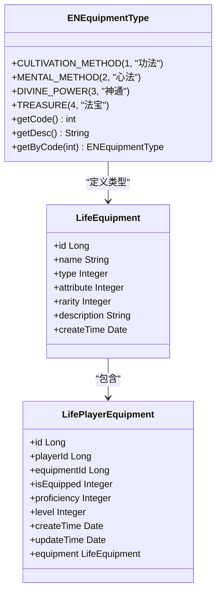
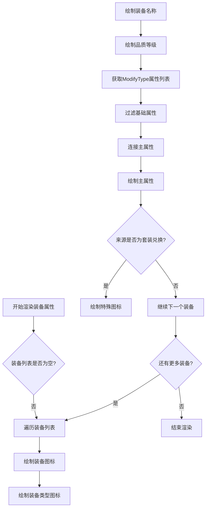
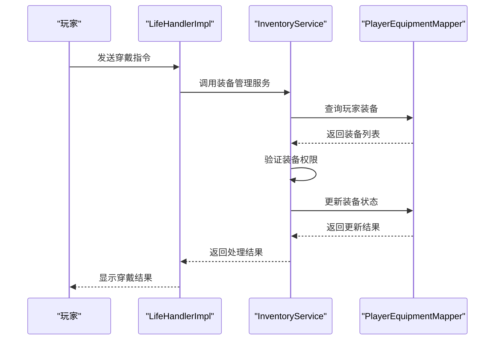

# 装备系统

<cite>
**本文档引用文件**  
- [Life_User_Manual.md](file://Life_User_Manual.md)
- [LifeHandlerImpl.java](file://Life\src\main\java\com\bot\life\service\impl\LifeHandlerImpl.java)
- [LifeEquipment.java](file://Life\src\main\java\com\bot\life\dao\entity\LifeEquipment.java)
- [LifePlayerEquipment.java](file://Life\src\main\java\com\bot\life\dao\entity\LifePlayerEquipment.java)
- [ENEquipmentType.java](file://Life\src\main\java\com\bot\life\enums\ENEquipmentType.java)
- [EquipInfo.java](file://Base\src\main\java\com\bot\base\dto\jx\attribute\EquipInfo.java)
- [JXAttributeInitUtil.java](file://Base\src\main\java\com\bot\base\util\JXAttributeInitUtil.java)
- [InventoryServiceImpl.java](file://Life\src\main\java\com\bot\life\service\impl\InventoryServiceImpl.java)
</cite>

## 目录
1. [装备系统概述](#装备系统概述)
2. [四类装备详解](#四类装备详解)
3. [装备属性与加成机制](#装备属性与加成机制)
4. [穿戴规则与限制](#穿戴规则与限制)
5. [装备获取方式](#装备获取方式)
6. [装备系统实现逻辑](#装备系统实现逻辑)
7. [战斗中的装备影响](#战斗中的装备影响)

## 装备系统概述

浮生卷游戏中的装备系统包含功法、心法、神通、法宝四类装备，每类装备具有不同的属性加成、穿戴规则和获取方式。装备系统通过玩家属性与装备属性的匹配来实现克制关系，影响战斗中的伤害输出和防御效果。装备信息在游戏界面中以图片形式展示，包括装备图标、名称、品质、属性和来源等详细信息。

**本节来源**  
- [Life_User_Manual.md](file://Life_User_Manual.md#L121-L147)

## 四类装备详解

### 功法

功法是玩家可穿戴的一件特殊装备，主要提供修炼速度加成和少量基础属性加成。功法分为有属性和无属性两种类型，有属性功法只能由相同属性的角色装备。

### 心法

心法是玩家可穿戴的三件基础装备，主要提供基础属性加成。心法同样分为有属性和无属性两种类型，有属性心法只能由相同属性的角色装备。

### 神通

神通是玩家可学习和使用的三个技能装备，用于在战斗中释放特殊技能。神通分为有属性和无属性两种类型，有属性神通只能由相同属性的角色使用。

### 法宝

法宝是玩家可穿戴的一件特殊装备，按百分比增加战斗属性，并具有熟练度系统。法宝分为有属性和无属性两种类型，有属性法宝只能由相同属性的角色装备。

**图示来源**  
- [ENEquipmentType.java](file://Life\src\main\java\com\bot\life\enums\ENEquipmentType.java#L7-L37)
- [LifeEquipment.java](file://Life\src\main\java\com\bot\life\dao\entity\LifeEquipment.java#L11-L19)
- [LifePlayerEquipment.java](file://Life\src\main\java\com\bot\life\dao\entity\LifePlayerEquipment.java#L11-L23)

**本节来源**  
- [Life_User_Manual.md](file://Life_User_Manual.md#L125-L142)

## 装备属性与加成机制

### 装备属性类型

装备属性分为有属性和无属性两种类型。有属性装备具有五行属性（金、木、水、火、土），无属性装备没有特定属性。装备属性决定了装备的使用限制和战斗中的克制关系。

### 属性加成计算

装备的属性加成通过ModifyType类实现，每个装备可以有多个ModifyType属性加成。在角色属性面板中，系统会排除基础属性后显示装备的主属性加成。

**图示来源**  
- [JXAttributeInitUtil.java](file://Base\src\main\java\com\bot\base\util\JXAttributeInitUtil.java#L76-L97)
- [EquipInfo.java](file://Base\src\main\java\com\bot\base\dto\jx\attribute\EquipInfo.java#L65-L66)
- [ModifyType.java](file://Base\src\main\java\com\bot\base\dto\jx\attribute\ModifyType.java#L8-L15)

**本节来源**  
- [Life_User_Manual.md](file://Life_User_Manual.md#L44-L65)
- [JXAttributeInitUtil.java](file://Base\src\main\java\com\bot\base\util\JXAttributeInitUtil.java#L76-L97)

## 穿戴规则与限制

### 有属性与无属性装备

有属性装备只能由相同属性的角色装备，无属性装备可以被所有角色使用。这一规则确保了属性克制系统的有效性，同时为玩家提供了灵活的装备选择。

### 穿戴状态管理

玩家装备的穿戴状态通过LifePlayerEquipment实体中的isEquipped字段管理，0表示未装备，1表示已装备。系统通过查询玩家已装备的装备列表来计算角色的最终属性。

### 熟练度系统

法宝装备具有熟练度系统，通过proficiency字段记录熟练度等级。熟练度影响法宝的属性加成效果，玩家可以通过使用升级法宝类道具来提升熟练度。

**本节来源**  
- [Life_User_Manual.md](file://Life_User_Manual.md#L144-L147)
- [LifePlayerEquipment.java](file://Life\src\main\java\com\bot\life\dao\entity\LifePlayerEquipment.java#L16-L18)

## 装备获取方式

### 怪物掉落

玩家通过游历探索遭遇怪物战斗，击败怪物后有一定概率获得装备作为掉落奖励。不同等级和类型的怪物掉落不同品质和类型的装备。

### 商店购买

玩家可以在鬼市的神秘商人处购买装备，神秘商人每日提供折扣商品。商店出售的装备包括各种品质的功法、心法、神通和法宝。

### 玩家交易

玩家之间可以通过鬼市的玩家摆摊系统进行装备交易。玩家可以自由定价出售自己的装备，也可以购买其他玩家出售的装备。

### 成就奖励

完成特定成就后，玩家可以获得特殊装备作为奖励。这些装备通常具有独特的属性加成和外观。

**本节来源**  
- [Life_User_Manual.md](file://Life_User_Manual.md#L239-L240)
- [Life_User_Manual.md](file://Life_User_Manual.md#L215-L218)

## 装备系统实现逻辑

### 装备数据结构

装备系统的核心数据结构包括LifeEquipment和LifePlayerEquipment两个实体类。LifeEquipment存储装备的基础信息，如名称、类型、属性、稀有度等。LifePlayerEquipment存储玩家与装备的关系信息，如是否装备、熟练度、等级等。

### 装备穿戴实现

装备穿戴功能通过LifeHandlerImpl类中的指令处理逻辑实现。当玩家选择穿戴装备时，系统会更新LifePlayerEquipment实体中的isEquipped字段，并重新计算角色属性。

### 属性计算流程

角色属性计算流程包括基础属性计算和装备属性加成计算。基础属性根据玩家的体质、力量、灵力、速度等属性按固定公式计算。装备属性加成通过遍历玩家已装备的装备列表，累加各装备的ModifyType属性加成。

**图示来源**  
- [LifeHandlerImpl.java](file://Life\src\main\java\com\bot\life\service\impl\LifeHandlerImpl.java#L1362-L1394)
- [InventoryServiceImpl.java](file://Life\src\main\java\com\bot\life\service\impl\InventoryServiceImpl.java#L78-L111)
- [LifePlayerEquipment.java](file://Life\src\main\java\com\bot\life\dao\entity\LifePlayerEquipment.java#L16-L18)

**本节来源**  
- [LifeHandlerImpl.java](file://Life\src\main\java\com\bot\life\service\impl\LifeHandlerImpl.java#L1362-L1394)
- [InventoryServiceImpl.java](file://Life\src\main\java\com\bot\life\service\impl\InventoryServiceImpl.java#L78-L111)

## 战斗中的装备影响

### 属性克制效果

在战斗中，装备的五行属性会触发属性克制效果。克制对方时，最终伤害增加20%；被克制时，自身防御减少10%。这一机制鼓励玩家根据对手属性选择合适的装备组合。

### 法宝特殊效果

法宝装备在战斗中提供百分比属性加成，包括攻击力、防御力和血量值的提升。部分特殊法宝还具有额外的战斗效果，如增加暴击率或减少技能冷却时间。

### 装备限制影响

有属性装备的使用限制直接影响战斗策略。玩家必须确保自己的属性与装备属性匹配才能发挥装备的最大效果。这一限制增加了游戏的策略深度，要求玩家在角色培养和装备选择上做出权衡。

**本节来源**  
- [Life_User_Manual.md](file://Life_User_Manual.md#L66-L72)
- [Life_User_Manual.md](file://Life_User_Manual.md#L139-L141)