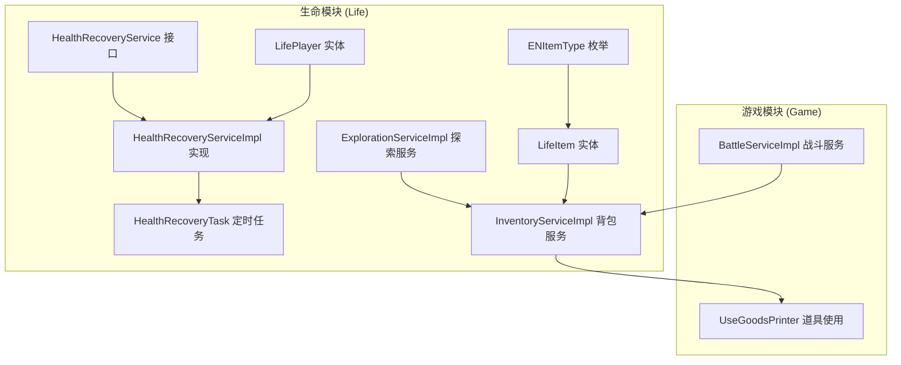
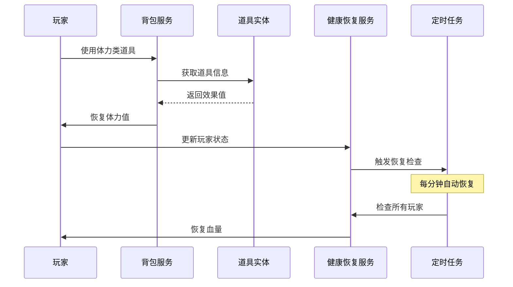
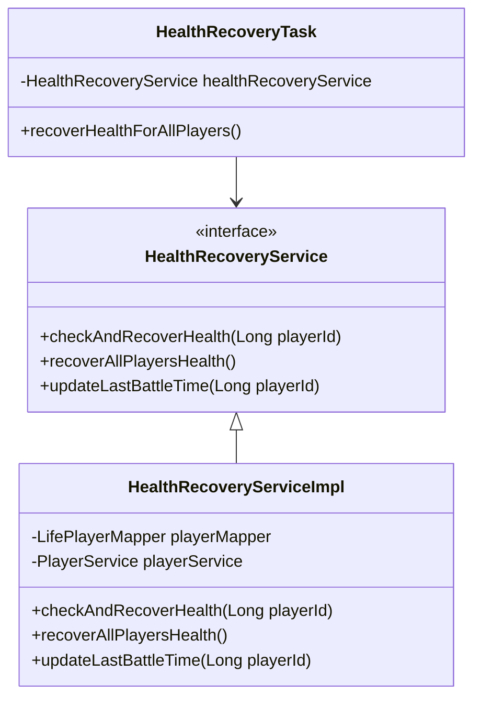
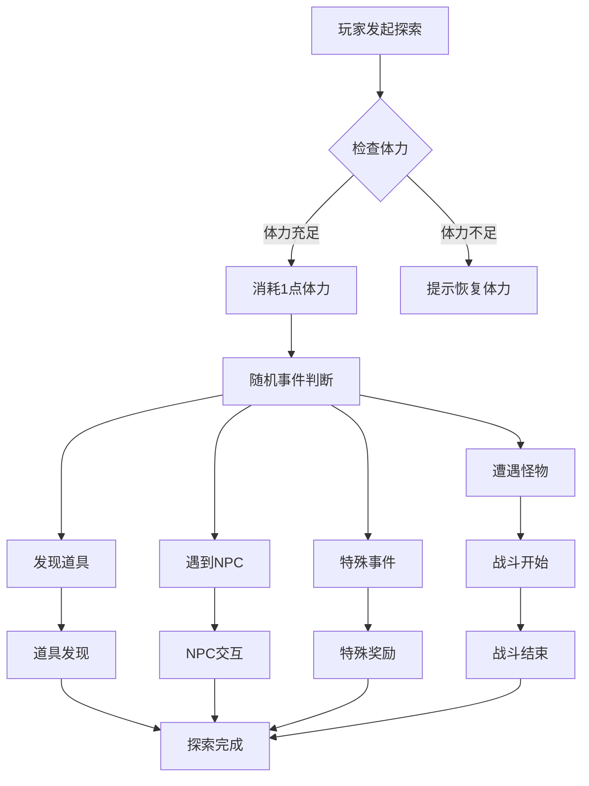
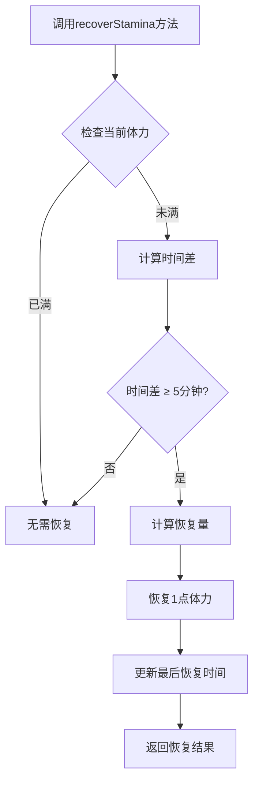
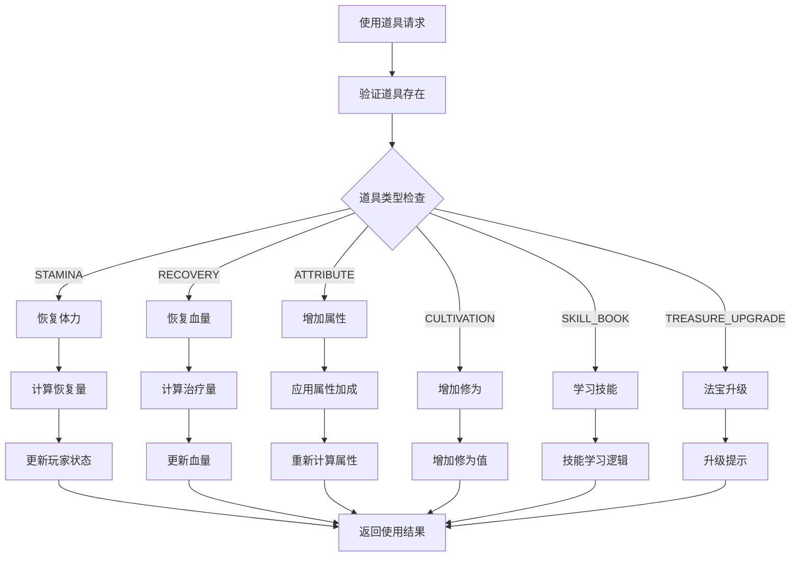
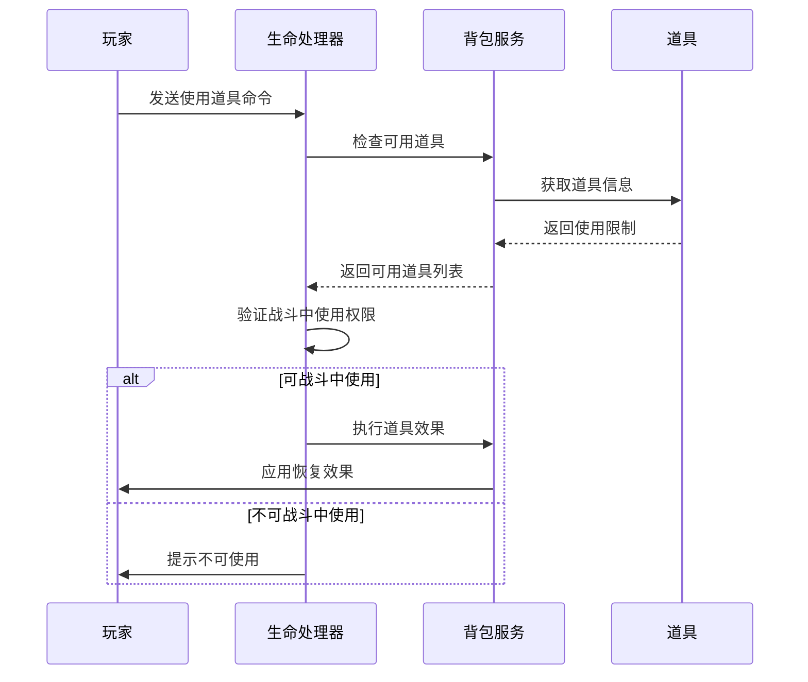
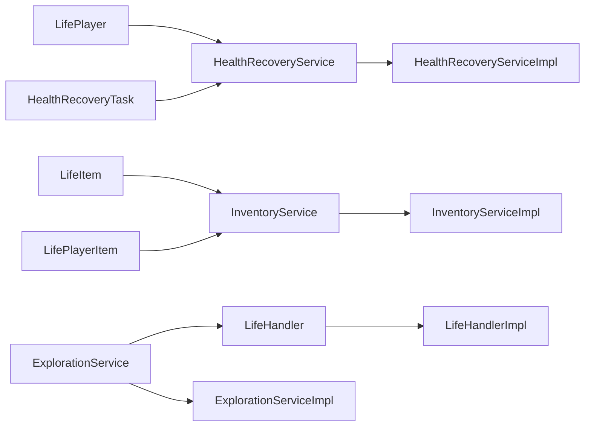

# 体力类道具

<cite>
**本文档引用的文件**
- [ENItemType.java](file://Life/src/main/java/com/bot/life/enums/ENItemType.java)
- [LifeItem.java](file://Life/src/main/java/com/bot/life/dao/entity/LifeItem.java)
- [LifePlayer.java](file://Life/src/main/java/com/bot/life/dao/entity/LifePlayer.java)
- [HealthRecoveryService.java](file://Life/src/main/java/com/bot/life/service/HealthRecoveryService.java)
- [HealthRecoveryServiceImpl.java](file://Life/src/main/java/com/bot/life/service/impl/HealthRecoveryServiceImpl.java)
- [HealthRecoveryTask.java](file://Life/src/main/java/com/bot/life/task/HealthRecoveryTask.java)
- [ExplorationServiceImpl.java](file://Life/src/main/java/com/bot/life/service/impl/ExplorationServiceImpl.java)
- [InventoryServiceImpl.java](file://Life/src/main/java/com/bot/life/service/impl/InventoryServiceImpl.java)
- [LifeHandlerImpl.java](file://Life/src/main/java/com/bot/life/service/impl/LifeHandlerImpl.java)
- [LifePlayerItem.java](file://Life/src/main/java/com/bot/life/dao/entity/LifePlayerItem.java)
</cite>

## 目录
1. [简介](#简介)
2. [项目结构](#项目结构)
3. [核心组件](#核心组件)
4. [架构概览](#架构概览)
5. [详细组件分析](#详细组件分析)
6. [依赖关系分析](#依赖关系分析)
7. [性能考虑](#性能考虑)
8. [故障排除指南](#故障排除指南)
9. [结论](#结论)

## 简介

体力类道具是《浮生卷》游戏中重要的资源管理机制之一，主要用于恢复玩家的体力值。在探索、战斗等高消耗行为后，玩家可以通过使用体力类道具快速恢复体力，维持游戏活动的连续性。本文档将详细介绍体力类道具的功能特性、使用机制以及相关的健康恢复服务。

## 项目结构

《浮生卷》项目采用模块化架构设计，体力类道具功能主要分布在以下模块中：

**图表来源**
- [ENItemType.java](file://Life/src/main/java/com/bot/life/enums/ENItemType.java#L1-L40)
- [HealthRecoveryService.java](file://Life/src/main/java/com/bot/life/service/HealthRecoveryService.java#L1-L27)

## 核心组件

### 道具类型定义

系统通过 `ENItemType` 枚举定义了多种道具类型，其中体力类道具对应代码 `3`：

| 道具类型 | 代码 | 描述 |
|---------|------|------|
| 修为类 | 1 | 提升玩家修为值 |
| 属性类 | 2 | 增加玩家基础属性 |
| 体力类 | 3 | 恢复玩家体力值 |
| 升级法宝类 | 4 | 提升法宝等级 |
| 恢复类 | 5 | 恢复玩家血量 |
| 技能书 | 6 | 学习新技能 |

**节来源**
- [ENItemType.java](file://Life/src/main/java/com/bot/life/enums/ENItemType.java#L8-L13)

### 道具实体结构

`LifeItem` 实体类定义了道具的基本属性，包括类型、效果值、使用限制等关键信息：

| 字段名 | 类型 | 描述 |
|--------|------|------|
| id | Long | 道具唯一标识符 |
| name | String | 道具名称 |
| type | Integer | 道具类型（1-6） |
| effectValue | Integer | 效果值（修为类、体力类、恢复类使用） |
| maxUseCount | Integer | 最大使用次数（-1表示无限制） |
| canUseInBattle | Integer | 是否可战斗中使用（0否1是） |

**节来源**
- [LifeItem.java](file://Life/src/main/java/com/bot/life/dao/entity/LifeItem.java#L1-L24)

## 架构概览

体力类道具系统采用分层架构设计，包含数据访问层、业务逻辑层和服务层：

**图表来源**
- [InventoryServiceImpl.java](file://Life/src/main/java/com/bot/life/service/impl/InventoryServiceImpl.java#L174-L220)
- [HealthRecoveryServiceImpl.java](file://Life/src/main/java/com/bot/life/service/impl/HealthRecoveryServiceImpl.java#L28-L62)

## 详细组件分析

### 体力恢复机制

#### 自动恢复服务

`HealthRecoveryService` 接口定义了健康恢复的核心功能：

**图表来源**
- [HealthRecoveryService.java](file://Life/src/main/java/com/bot/life/service/HealthRecoveryService.java#L7-L26)
- [HealthRecoveryServiceImpl.java](file://Life/src/main/java/com/bot/life/service/impl/HealthRecoveryServiceImpl.java#L19-L74)

#### 恢复规则详解

系统实现了严格的恢复规则以平衡游戏体验：

1. **战斗脱离检测**：只有在战斗结束后1分钟以上才能开始恢复
2. **恢复间隔控制**：每次恢复后需要等待1分钟才能再次触发
3. **恢复速率计算**：每分钟恢复最大血量的20%

**节来源**
- [HealthRecoveryServiceImpl.java](file://Life/src/main/java/com/bot/life/service/impl/HealthRecoveryServiceImpl.java#L35-L56)

### 体力消耗与恢复

#### 探索系统中的体力管理

`ExplorationServiceImpl` 负责管理玩家的探索活动和体力消耗：

**图表来源**
- [ExplorationServiceImpl.java](file://Life/src/main/java/com/bot/life/service/impl/ExplorationServiceImpl.java#L34-L60)

#### 体力恢复算法

玩家体力恢复遵循以下算法：

**图表来源**
- [LifePlayer.java](file://Life/src/main/java/com/bot/life/dao/entity/LifePlayer.java#L81-L95)

### 道具使用流程

#### 道具效果应用

`InventoryServiceImpl` 的 `applyItemEffect` 方法处理不同类型道具的效果：

**图表来源**
- [InventoryServiceImpl.java](file://Life/src/main/java/com/bot/life/service/impl/InventoryServiceImpl.java#L174-L220)

**节来源**
- [InventoryServiceImpl.java](file://Life/src/main/java/com/bot/life/service/impl/InventoryServiceImpl.java#L197-L202)

### 冷却机制与限制

#### 使用次数限制

系统为某些道具设置了使用次数限制，防止无限使用：

| 限制类型 | 实现方式 | 示例 |
|----------|----------|------|
| 无限制使用 | maxUseCount = -1 | 普通恢复类道具 |
| 固定次数限制 | maxUseCount > 0 | 属性类道具 |
| 战斗中使用 | canUseInBattle = 1 | 恢复类道具 |

**节来源**
- [InventoryServiceImpl.java](file://Life/src/main/java/com/bot/life/service/impl/InventoryServiceImpl.java#L115-L131)

#### 战斗中道具使用

战斗中只能使用特定类型的道具，系统通过 `canUseInBattle` 字段控制：

**图表来源**
- [LifeHandlerImpl.java](file://Life/src/main/java/com/bot/life/service/impl/LifeHandlerImpl.java#L1362-L1394)

## 依赖关系分析

### 模块间依赖关系

**图表来源**
- [HealthRecoveryServiceImpl.java](file://Life/src/main/java/com/bot/life/service/impl/HealthRecoveryServiceImpl.java#L22-L26)
- [InventoryServiceImpl.java](file://Life/src/main/java/com/bot/life/service/impl/InventoryServiceImpl.java#L28-L36)

**节来源**
- [HealthRecoveryServiceImpl.java](file://Life/src/main/java/com/bot/life/service/impl/HealthRecoveryServiceImpl.java#L1-L74)
- [InventoryServiceImpl.java](file://Life/src/main/java/com/bot/life/service/impl/InventoryServiceImpl.java#L1-L339)

## 性能考虑

### 定时任务优化

健康恢复服务采用定时任务机制，每分钟检查一次所有玩家的状态，避免频繁查询数据库：

- **任务频率**：每60秒执行一次
- **批量处理**：一次性处理所有需要恢复的玩家
- **异常处理**：单个玩家处理失败不影响整体任务

### 数据库访问优化

系统通过以下方式优化数据库访问性能：

1. **批量查询**：定时任务一次性获取所有玩家数据
2. **条件过滤**：只处理需要恢复的玩家
3. **缓存机制**：减少重复的数据库查询

## 故障排除指南

### 常见问题及解决方案

#### 体力恢复异常

**问题描述**：玩家体力无法正常恢复

**可能原因**：
1. 最后战斗时间未正确更新
2. 恢复间隔时间未达到
3. 玩家状态数据损坏

**解决方案**：
1. 检查 `lastBattleTime` 字段是否正确设置
2. 验证恢复时间间隔逻辑
3. 重新初始化玩家状态数据

#### 道具使用失败

**问题描述**：玩家无法使用体力类道具

**可能原因**：
1. 道具数量不足
2. 使用次数达到上限
3. 战斗中使用权限不足

**解决方案**：
1. 检查玩家背包中的道具数量
2. 验证道具的使用次数限制
3. 确认道具的战斗中使用权限

**节来源**
- [HealthRecoveryServiceImpl.java](file://Life/src/main/java/com/bot/life/service/impl/HealthRecoveryServiceImpl.java#L28-L62)
- [InventoryServiceImpl.java](file://Life/src/main/java/com/bot/life/service/impl/InventoryServiceImpl.java#L115-L131)

## 结论

体力类道具系统是《浮生卷》游戏中的重要组成部分，通过合理的恢复机制和使用限制，为玩家提供了平衡的游戏体验。系统采用了分层架构设计，确保了功能的可维护性和扩展性。自动恢复服务和定时任务机制保证了系统的稳定运行，而严格的使用限制则维护了游戏的公平性。

未来可以考虑以下优化方向：
1. 增加更多类型的体力恢复道具
2. 实现动态难度调整机制
3. 优化大量玩家同时在线时的性能表现
4. 增强道具使用的策略性