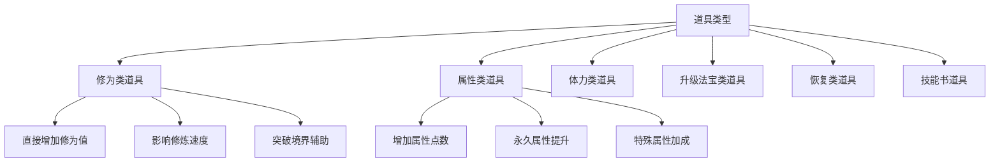
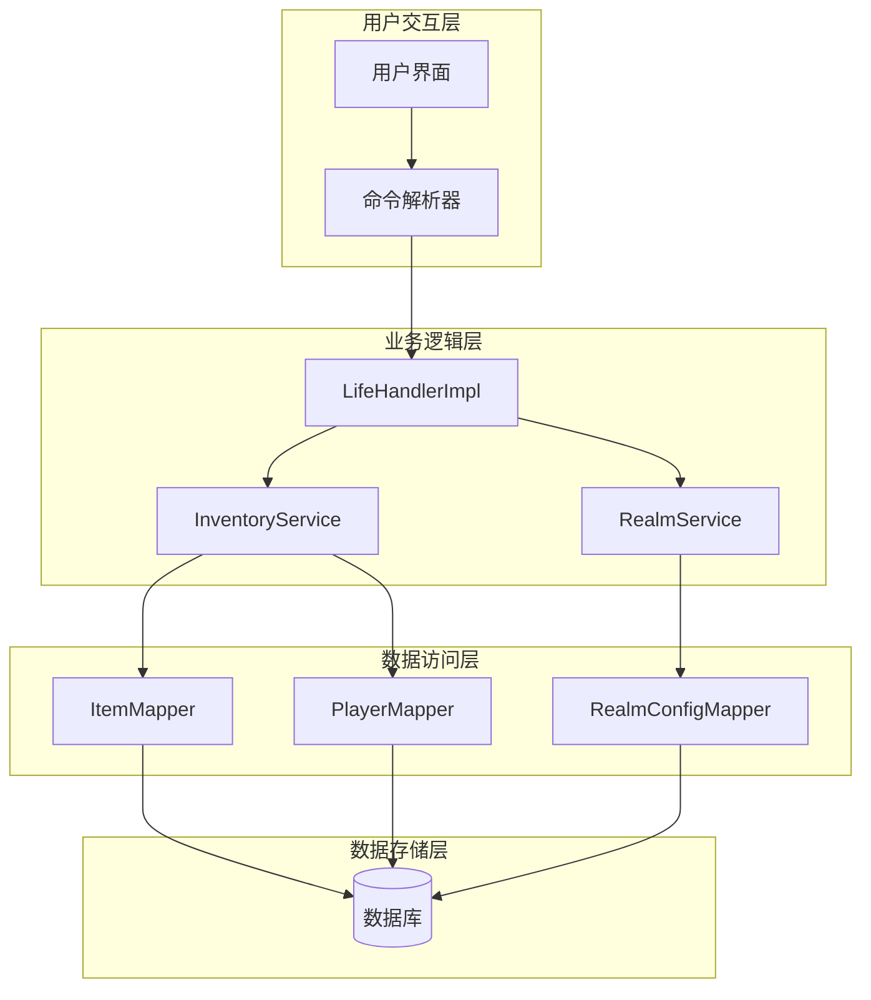
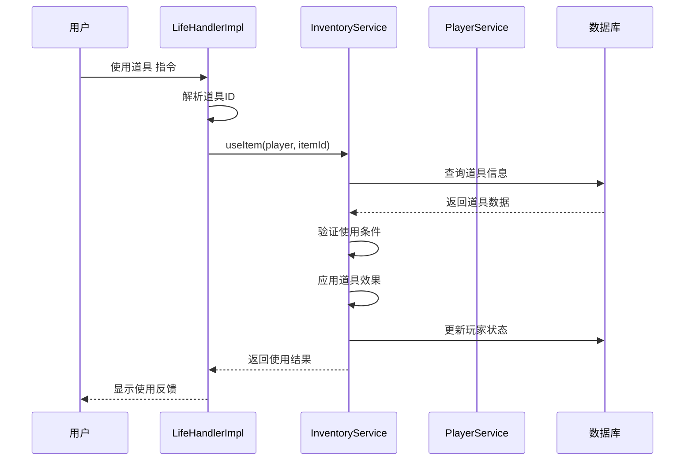
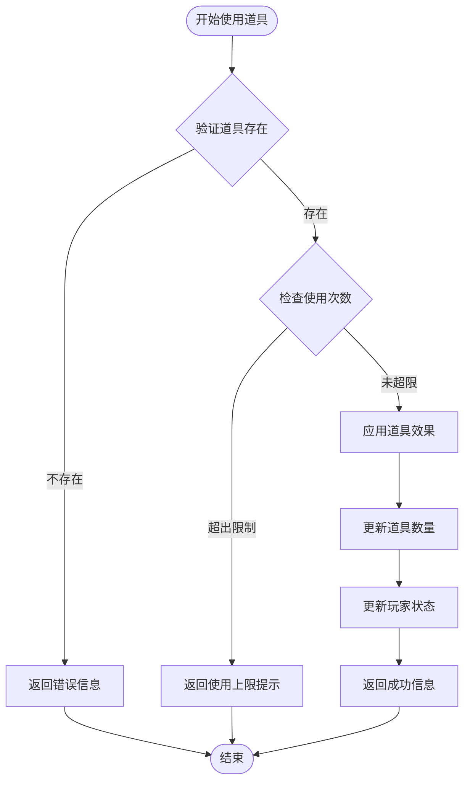
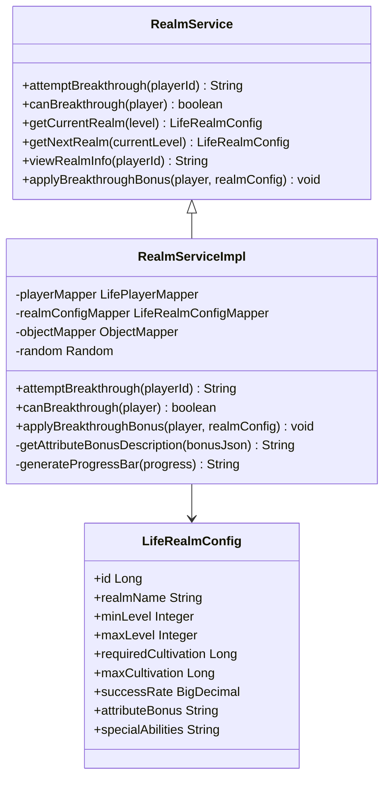
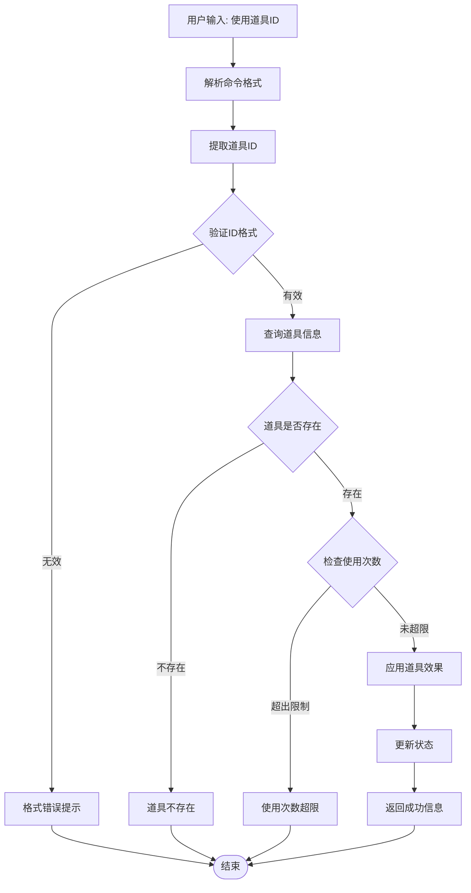
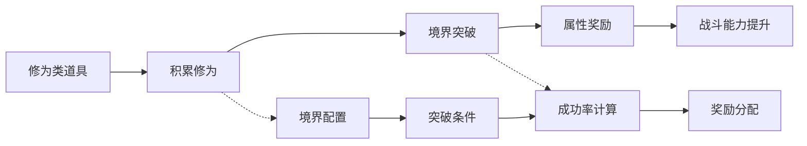
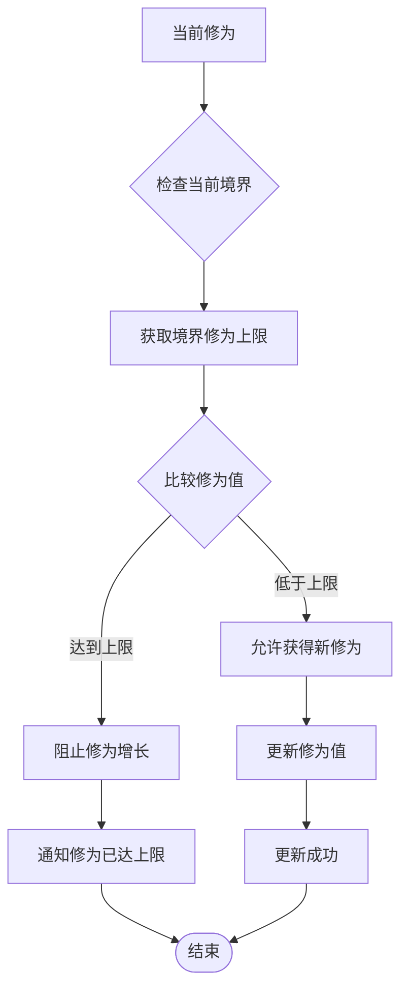

# 修为类道具

<cite>
**本文档引用的文件**
- [LifeHandlerImpl.java](file://Life/src/main/java/com/bot/life/service/impl/LifeHandlerImpl.java)
- [InventoryServiceImpl.java](file://Life/src/main/java/com/bot/life/service/impl/InventoryServiceImpl.java)
- [LifeItem.java](file://Life/src/main/java/com/bot/life/dao/entity/LifeItem.java)
- [ENItemType.java](file://Life/src/main/java/com/bot/life/enums/ENItemType.java)
- [RealmServiceImpl.java](file://Life/src/main/java/com/bot/life/service/impl/RealmServiceImpl.java)
- [RealmService.java](file://Life/src/main/java/com/bot/life/service/RealmService.java)
- [LifeRealmConfig.java](file://Life/src/main/java/com/bot/life/dao/entity/LifeRealmConfig.java)
- [LifeRealmConfigMapper.xml](file://Life/src/main/resources/mapper/LifeRealmConfigMapper.xml)
</cite>

## 目录
1. [简介](#简介)
2. [修为类道具概述](#修为类道具概述)
3. [系统架构](#系统架构)
4. [核心组件分析](#核心组件分析)
5. [使用机制详解](#使用机制详解)
6. [与境界系统的交互](#与境界系统的交互)
7. [实际使用示例](#实际使用示例)
8. [性能考虑](#性能考虑)
9. [故障排除指南](#故障排除指南)
10. [总结](#总结)

## 简介

修为类道具是《浮生卷》修仙游戏中一个重要的核心系统，它允许玩家通过使用特定的修炼资源来提升自身的修为值。修为作为修仙者的核心属性，直接影响着玩家的成长潜力和战斗能力。本文档将详细说明修为类道具的功能特性、使用方法以及与其他系统之间的交互关系。

## 修为类道具概述

修为类道具是游戏中专门用于增加玩家修为值的特殊物品。它们通过直接提升玩家的修炼基础值，帮助玩家更快地积累修为，从而解锁更高级别的修炼资源和技能。

### 道具类型分类

根据功能特性，游戏中的道具分为以下几种类型：

**图表来源**
- [ENItemType.java](file://Life/src/main/java/com/bot/life/enums/ENItemType.java#L8-L13)

**章节来源**
- [LifeItem.java](file://Life/src/main/java/com/bot/life/dao/entity/LifeItem.java#L14-L20)
- [ENItemType.java](file://Life/src/main/java/com/bot/life/enums/ENItemType.java#L8-L13)

## 系统架构

修为类道具系统采用模块化设计，主要由以下几个层次组成：

**图表来源**
- [LifeHandlerImpl.java](file://Life/src/main/java/com/bot/life/service/impl/LifeHandlerImpl.java#L49-L120)
- [InventoryServiceImpl.java](file://Life/src/main/java/com/bot/life/service/impl/InventoryServiceImpl.java#L49-L75)

## 核心组件分析

### LifeHandlerImpl 类

`LifeHandlerImpl` 是整个修为类道具系统的核心控制器，负责处理用户的使用指令并协调各个服务组件的工作。

#### 关键方法分析

**图表来源**
- [LifeHandlerImpl.java](file://Life/src/main/java/com/bot/life/service/impl/LifeHandlerImpl.java#L594-L604)
- [InventoryServiceImpl.java](file://Life/src/main/java/com/bot/life/service/impl/InventoryServiceImpl.java#L78-L111)

### InventoryServiceImpl 类

`InventoryServiceImpl` 负责道具的具体使用逻辑，包括效果计算和状态更新。

#### 修为类道具处理机制

**图表来源**
- [InventoryServiceImpl.java](file://Life/src/main/java/com/bot/life/service/impl/InventoryServiceImpl.java#L78-L111)

**章节来源**
- [InventoryServiceImpl.java](file://Life/src/main/java/com/bot/life/service/impl/InventoryServiceImpl.java#L78-L111)

### RealmService 系统

境界系统与修为类道具紧密相关，修为的积累直接影响境界的突破和提升。

**图表来源**
- [RealmService.java](file://Life/src/main/java/com/bot/life/service/RealmService.java#L11-L52)
- [RealmServiceImpl.java](file://Life/src/main/java/com/bot/life/service/impl/RealmServiceImpl.java#L23-L40)
- [LifeRealmConfig.java](file://Life/src/main/java/com/bot/life/dao/entity/LifeRealmConfig.java#L14-L23)

**章节来源**
- [RealmServiceImpl.java](file://Life/src/main/java/com/bot/life/service/impl/RealmServiceImpl.java#L42-L121)
- [LifeRealmConfig.java](file://Life/src/main/java/com/bot/life/dao/entity/LifeRealmConfig.java#L14-L23)

## 使用机制详解

### 命令解析流程

修为类道具的使用通过统一的命令解析机制处理：

**图表来源**
- [LifeHandlerImpl.java](file://Life/src/main/java/com/bot/life/service/impl/LifeHandlerImpl.java#L594-L604)

### 修为值计算机制

修为类道具的效果计算遵循以下规则：

| 道具类型 | 效果计算方式 | 使用限制 | 特殊机制 |
|---------|-------------|----------|----------|
| 修为丹 | 直接增加固定修为值 | 无限制 | 无 |
| 修炼石 | 增加修炼速度系数 | 无限制 | 提升修炼效率 |
| 灵泉 | 增加最大修为上限 | 无限制 | 影响境界突破 |
| 传承玉简 | 增加特定属性 | 无限制 | 永久属性提升 |

**章节来源**
- [InventoryServiceImpl.java](file://Life/src/main/java/com/bot/life/service/impl/InventoryServiceImpl.java#L180-L185)

### 使用限制与保护机制

系统实现了多层次的使用保护机制：

1. **数量检查**：确保玩家拥有足够的道具数量
2. **使用次数限制**：防止属性类道具被过度使用
3. **状态验证**：检查玩家是否满足使用条件
4. **并发保护**：防止同时使用多个道具导致的状态冲突

**章节来源**
- [InventoryServiceImpl.java](file://Life/src/main/java/com/bot/life/service/impl/InventoryServiceImpl.java#L89-L106)

## 与境界系统的交互

修为类道具与境界系统之间存在密切的交互关系，主要体现在以下几个方面：

### 境界突破的修为需求

**图表来源**
- [RealmServiceImpl.java](file://Life/src/main/java/com/bot/life/service/impl/RealmServiceImpl.java#L42-L121)

### 修为上限管理

系统实现了动态的修为上限管理机制：

**图表来源**
- [RealmServiceImpl.java](file://Life/src/main/java/com/bot/life/service/impl/RealmServiceImpl.java#L125-L189)

**章节来源**
- [RealmServiceImpl.java](file://Life/src/main/java/com/bot/life/service/impl/RealmServiceImpl.java#L125-L189)

### 突破成功率计算

境界突破的成功率基于多种因素计算：

| 因素 | 权重 | 计算方式 | 影响程度 |
|------|------|----------|----------|
| 当前修为 | 40% | 修为/突破需求 × 100% | 主要影响因素 |
| 道具加成 | 30% | 使用突破辅助道具 | 中等影响 |
| 境界等级 | 20% | 当前境界系数 | 较小影响 |
| 随机因素 | 10% | 随机概率计算 | 不确定性因素 |

**章节来源**
- [RealmServiceImpl.java](file://Life/src/main/java/com/bot/life/service/impl/RealmServiceImpl.java#L66-L68)

## 实际使用示例

### 基本使用流程

以下是使用修为类道具的完整示例：

1. **查询背包**：玩家首先需要查看自己的道具列表
2. **选择道具**：确定要使用的修为类道具
3. **执行使用**：发送使用指令
4. **确认效果**：查看使用后的状态变化

### 常见使用场景

#### 场景一：快速积累修为
- **适用道具**：修为丹、修炼石
- **使用时机**：日常修炼、境界突破准备
- **预期效果**：短时间内大幅提升修为值

#### 场景二：境界突破辅助
- **适用道具**：灵泉、突破丹
- **使用时机**：接近境界突破临界点
- **预期效果**：提高突破成功率，获得更多属性奖励

#### 场景三：长期属性培养
- **适用道具**：传承玉简、属性修炼资源
- **使用时机**：稳定修炼阶段
- **预期效果**：永久提升战斗属性

**章节来源**
- [InventoryServiceImpl.java](file://Life/src/main/java/com/bot/life/service/impl/InventoryServiceImpl.java#L180-L195)

## 性能考虑

### 数据库优化策略

1. **缓存机制**：对频繁查询的道具配置进行缓存
2. **批量操作**：合并多个状态更新操作
3. **索引优化**：为常用查询字段建立索引
4. **连接池管理**：合理配置数据库连接池

### 内存使用优化

1. **对象复用**：重用常用的字符串和对象
2. **及时清理**：定期清理过期的缓存数据
3. **内存监控**：监控系统内存使用情况

### 并发处理

1. **事务隔离**：确保道具使用的原子性
2. **锁机制**：防止同一道具被同时使用
3. **重试机制**：处理并发冲突的情况

## 故障排除指南

### 常见问题及解决方案

#### 问题1：道具使用后修为未增加
**可能原因**：
- 道具数量不足
- 使用次数已达到上限
- 数据库更新失败

**解决步骤**：
1. 检查道具背包状态
2. 验证使用次数限制
3. 查看系统日志
4. 重新尝试使用

#### 问题2：境界突破失败后修为损失过多
**可能原因**：
- 突破成功率设置过低
- 道具加成不足
- 系统计算错误

**解决步骤**：
1. 检查当前修为与突破需求
2. 使用突破辅助道具
3. 调整突破策略
4. 联系技术支持

#### 问题3：修为上限显示错误
**可能原因**：
- 境界配置数据异常
- 缓存数据过期
- 计算逻辑错误

**解决步骤**：
1. 刷新玩家状态
2. 检查境界配置
3. 清理相关缓存
4. 重启服务

**章节来源**
- [InventoryServiceImpl.java](file://Life/src/main/java/com/bot/life/service/impl/InventoryServiceImpl.java#L89-L111)
- [RealmServiceImpl.java](file://Life/src/main/java/com/bot/life/service/impl/RealmServiceImpl.java#L106-L118)

## 总结

修为类道具系统是《浮生卷》修仙游戏中的核心成长机制，它通过精心设计的使用机制和丰富的交互功能，为玩家提供了多样化的修炼途径。系统的主要特点包括：

1. **多样化道具类型**：涵盖修为、属性、恢复等多个方面
2. **智能使用机制**：完善的验证和保护机制
3. **深度系统交互**：与境界系统、战斗系统紧密集成
4. **用户体验优化**：直观的命令界面和详细的反馈信息

通过合理使用修为类道具，玩家可以加速修炼进程，提升战斗能力，在修仙之路上走得更远。系统的可配置性和扩展性也为未来的功能增强提供了良好的基础。