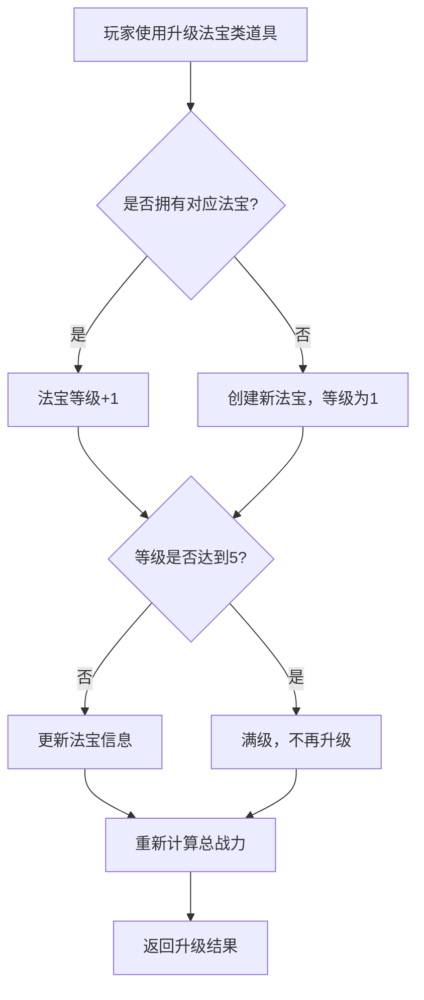
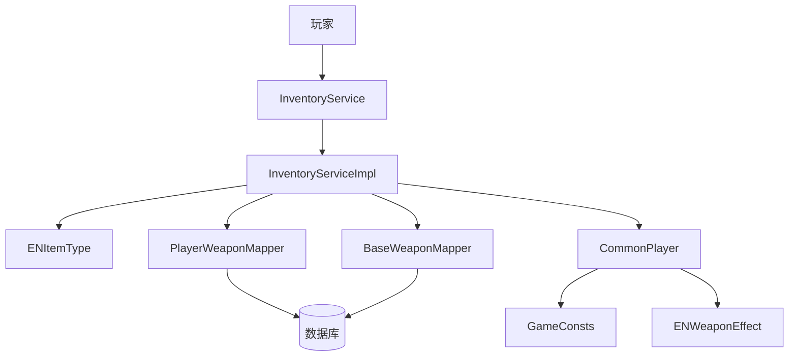
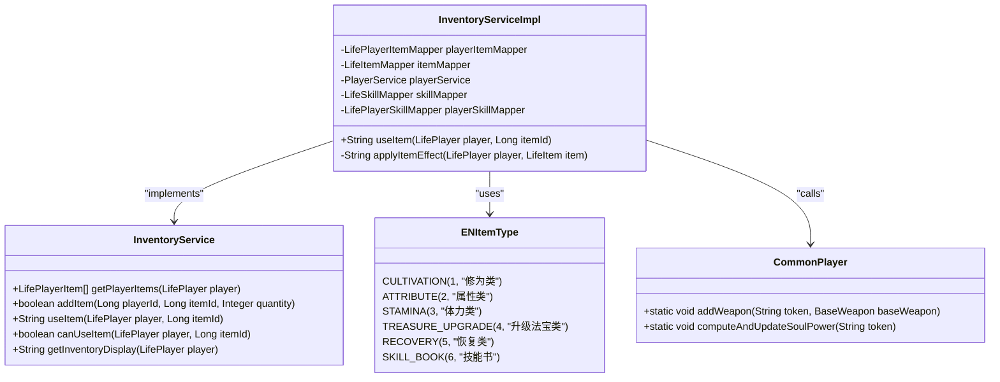
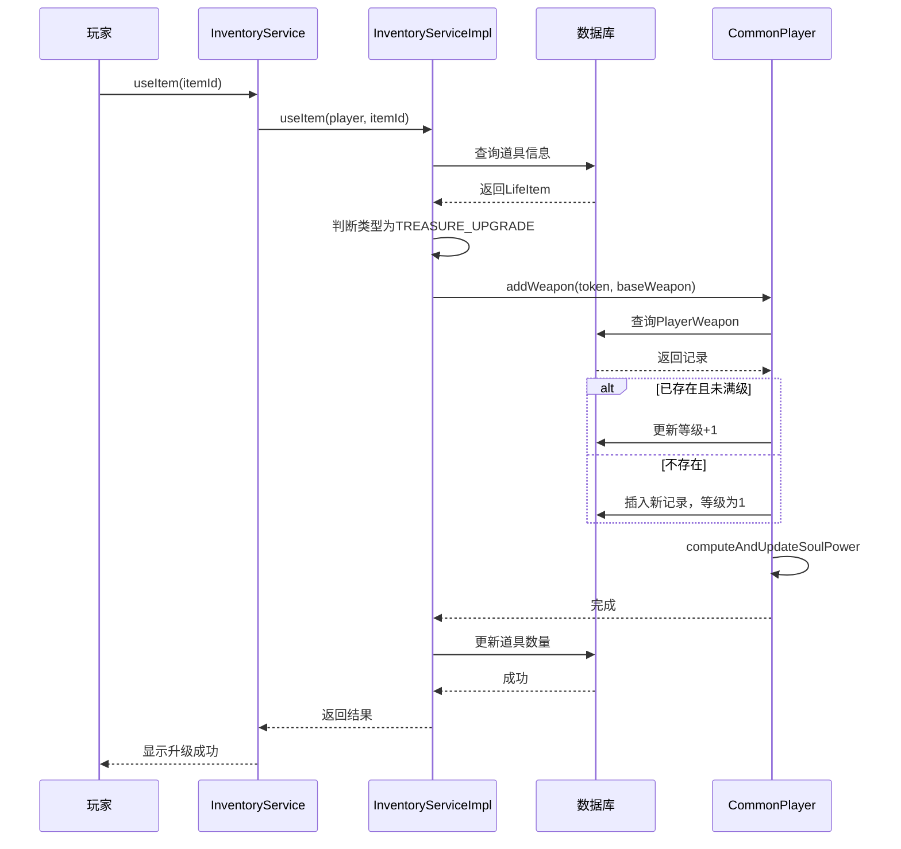
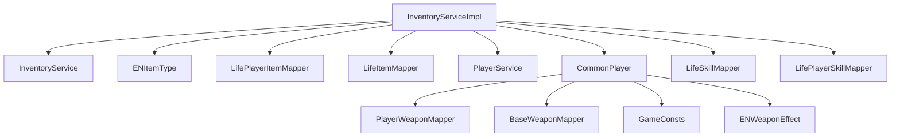

# 升级法宝类道具

<cite>
**本文档引用文件**  
- [InventoryService.java](file://Life\src\main\java\com\bot\life\service\InventoryService.java)
- [InventoryServiceImpl.java](file://Life\src\main\java\com\bot\life\service\impl\InventoryServiceImpl.java)
- [ENItemType.java](file://Life\src\main\java\com\bot\life\enums\ENItemType.java)
- [CommonPlayer.java](file://Game\src\main\java\com\bot\game\service\impl\CommonPlayer.java)
- [BaseWeapon.java](file://Game\src\main\java\com\bot\game\dao\entity\BaseWeapon.java)
- [PlayerWeapon.java](file://Game\src\main\java\com\bot\game\dao\entity\PlayerWeapon.java)
- [GameConsts.java](file://Common\src\main\java\com\bot\common\constant\GameConsts.java)
- [ENWeaponEffect.java](file://Game\src\main\java\com\bot\game\enums\ENWeaponEffect.java)
- [BattleServiceImpl.java](file://Game\src\main\java\com\bot\game\service\impl\BattleServiceImpl.java)
</cite>

## 目录
1. [引言](#引言)
2. [升级法宝类道具功能说明](#升级法宝类道具功能说明)
3. [修仙体系中的战略价值](#修仙体系中的战略价值)
4. [背包物品操作逻辑与联动机制](#背包物品操作逻辑与联动机制)
5. [使用示例与成功率说明](#使用示例与成功率说明)
6. [核心组件分析](#核心组件分析)
7. [系统架构概述](#系统架构概述)
8. [详细组件分析](#详细组件分析)
9. [依赖关系分析](#依赖关系分析)
10. [性能考量](#性能考量)
11. [故障排除指南](#故障排除指南)
12. [结论](#结论)

## 引言
在修仙体系中，法宝是修仙者提升实力的重要途径之一。通过使用升级法宝类道具，玩家可以提升法宝等级，从而增强自身战力。本文件将详细说明该功能的实现机制、战略价值以及具体使用方法。

## 升级法宝类道具功能说明
升级法宝类道具是一种特殊类型的道具，其主要功能是提升玩家所拥有的法宝等级。当玩家使用此类道具时，若已拥有对应法宝，则法宝的等级（即“灵气”）将提升一级，最高可达5级。每提升一级，法宝提供的战力和战斗效果都会相应增强。

### 功能特点
- **等级上限**：法宝最高等级为5级。
- **战力加成**：每升一级，法宝提供固定的战力加成。
- **满级奖励**：达到5级后，额外获得大量战力加成。
- **属性增强**：不同法宝具有不同的战斗属性加成效果，随等级提升而增强。

**Section sources**
- [ENItemType.java](file://Life\src\main\java\com\bot\life\enums\ENItemType.java#L11)
- [CommonPlayer.java](file://Game\src\main\java\com\bot\game\service\impl\CommonPlayer.java#L369-L384)

## 修仙体系中的战略价值
在修仙体系中，法宝不仅是身份的象征，更是战斗力的核心组成部分。通过升级法宝，玩家可以在以下几个方面获得显著优势：

### 战斗力提升
法宝等级直接影响角色的总体战力值（灵魂力）。根据代码中的计算逻辑：
- 每件法宝基础提供500点战力。
- 每升一级额外增加200点战力。
- 满级（5级）时额外再增加400点战力。

这使得高阶法宝成为决定战斗胜负的关键因素。

### 战斗属性加成
不同法宝具有独特的战斗效果，例如：
- **翻天印**：提升参战幻灵的攻击力。
- **护灵甲**：提升防御力。
- **玄王佩**：增加血量。
- **醒世符**：免疫伤害回合数。
- **极影斗篷**：提升速度百分比。

这些效果随着法宝等级提升而增强，为玩家在战斗中提供了多样化的策略选择。

### 资源管理与成长路径
法宝升级机制鼓励玩家积极参与各种活动以获取升级材料，形成了清晰的成长路径。同时，由于等级上限的存在，玩家需要合理规划资源分配，避免浪费。

**Section sources**
- [GameConsts.java](file://Common\src\main\java\com\bot\common\constant\GameConsts.java#L209-L211)
- [ENWeaponEffect.java](file://Game\src\main\java\com\bot\game\enums\ENWeaponEffect.java#L13-L19)

## 背包物品操作逻辑与联动机制
升级法宝类道具的功能实现依赖于`InventoryService`中的背包物品操作逻辑。以下是其核心联动机制的详细说明。

### 道具类型定义
在`ENItemType`枚举中，定义了“升级法宝类”道具的类型码为4，描述为“升级法宝类”。这是系统识别该类道具的基础。

### 使用流程
1. **检查背包**：调用`getPlayerItems`获取玩家当前背包内容。
2. **验证道具**：确认玩家拥有指定的升级法宝类道具。
3. **应用效果**：调用`useItem`方法执行道具效果。
4. **更新状态**：消耗道具并更新法宝等级。

### 核心逻辑实现
在`InventoryServiceImpl`的`useItem`方法中，针对`TREASURE_UPGRADE`类型的道具，系统会触发法宝升级逻辑。具体步骤如下：
- 查询玩家是否已拥有对应法宝。
- 若存在且未满级（<5级），则将其等级+1。
- 若不存在，则创建新的法宝记录，初始等级为1。
- 更新数据库中的法宝信息，并重新计算角色总战力。

**Diagram sources**
- [InventoryServiceImpl.java](file://Life\src\main\java\com\bot\life\service\impl\InventoryServiceImpl.java#L211-L213)
- [CommonPlayer.java](file://Game\src\main\java\com\bot\game\service\impl\CommonPlayer.java#L377-L379)

**Section sources**
- [InventoryService.java](file://Life\src\main\java\com\bot\life\service\InventoryService.java#L36-L37)
- [InventoryServiceImpl.java](file://Life\src\main\java\com\bot\life\service\impl\InventoryServiceImpl.java#L78-L111)

## 使用示例与成功率说明
### 使用示例
假设玩家拥有一件名为“翻天印”的法宝，当前等级为3级。玩家获得一个“翻天印·灵气”道具（属于升级法宝类），使用该道具后：
1. 系统检测到玩家已拥有“翻天印”。
2. 将其等级从3级提升至4级。
3. 战力增加200点（根据`WEAPON_LEVEL`配置）。
4. 在战斗中，“翻天印”的攻击力加成效果从8%提升至10%。

命令格式：`使用+道具ID`  
示例：`使用4`

### 成功率说明
法宝升级机制本身不存在失败概率，只要玩家拥有合法的升级道具，升级必定成功。然而，获取升级道具的过程可能涉及随机掉落或任务完成，这些环节的成功率由具体活动规则决定。

例如，在副本挑战中获得法宝的概率受以下因素影响：
- 玩家等级与副本难度匹配度
- 当前幸运值
- 掉落率配置

一旦获得道具，升级过程即为确定性操作，无任何失败可能。

**Section sources**
- [CommonPlayer.java](file://Game\src\main\java\com\bot\game\service\impl\CommonPlayer.java#L377-L379)
- [DungeonCommonHolder.java](file://Game\src\main\java\com\bot\game\service\DungeonCommonHolder.java#L204-L211)

## 核心组件分析
### InventoryService
作为背包管理的核心接口，`InventoryService`定义了所有与背包相关的操作方法，包括获取物品、添加物品、使用物品等。

### InventoryServiceImpl
实现了`InventoryService`接口，负责具体的业务逻辑处理，特别是`useItem`方法中对不同类型道具的差异化处理。

### ENItemType
枚举类，定义了所有道具类型，其中`TREASURE_UPGRADE`专门用于标识升级法宝类道具。

### CommonPlayer
包含静态工具方法，用于处理玩家相关的通用操作，如法宝升级、战力计算等。

**Section sources**
- [InventoryService.java](file://Life\src\main\java\com\bot\life\service\InventoryService.java#L12-L51)
- [InventoryServiceImpl.java](file://Life\src\main\java\com\bot\life\service\impl\InventoryServiceImpl.java#L26-L42)
- [ENItemType.java](file://Life\src\main\java\com\bot\life\enums\ENItemType.java#L7-L13)
- [CommonPlayer.java](file://Game\src\main\java\com\bot\game\service\impl\CommonPlayer.java#L369-L384)

## 系统架构概述
整个法宝升级系统基于模块化设计，各组件职责分明，协同工作。

**Diagram sources**
- [InventoryServiceImpl.java](file://Life\src\main\java\com\bot\life\service\impl\InventoryServiceImpl.java)
- [CommonPlayer.java](file://Game\src\main\java\com\bot\game\service\impl\CommonPlayer.java)

## 详细组件分析
### Object-Oriented Components

**Diagram sources**
- [InventoryService.java](file://Life\src\main\java\com\bot\life\service\InventoryService.java#L12-L51)
- [InventoryServiceImpl.java](file://Life\src\main\java\com\bot\life\service\impl\InventoryServiceImpl.java#L26-L42)
- [ENItemType.java](file://Life\src\main\java\com\bot\life\enums\ENItemType.java#L7-L13)
- [CommonPlayer.java](file://Game\src\main\java\com\bot\game\service\impl\CommonPlayer.java#L369-L384)

### API/Service Components

**Diagram sources**
- [InventoryServiceImpl.java](file://Life\src\main\java\com\bot\life\service\impl\InventoryServiceImpl.java#L78-L111)
- [CommonPlayer.java](file://Game\src\main\java\com\bot\game\service\impl\CommonPlayer.java#L369-L384)

## 依赖关系分析
系统各组件之间存在明确的依赖关系，确保功能的正确执行。

**Diagram sources**
- [InventoryServiceImpl.java](file://Life\src\main\java\com\bot\life\service\impl\InventoryServiceImpl.java#L28-L41)
- [CommonPlayer.java](file://Game\src\main\java\com\bot\game\service\impl\CommonPlayer.java)

## 性能考量
### 数据库查询优化
- 使用`selectByPlayerIdAndItemId`进行精确查询，避免全表扫描。
- 所有Mapper方法均基于主键或唯一索引进行操作，保证查询效率。

### 事务处理
- 道具使用和法宝升级操作在同一个事务中完成，确保数据一致性。
- 更新操作后立即提交，减少锁持有时间。

### 缓存机制
- 虽然当前代码未显式使用缓存，但可通过Spring Cache等机制对频繁访问的数据（如玩家信息、法宝配置）进行缓存，进一步提升性能。

## 故障排除指南
### 常见问题
1. **无法使用道具**
   - 检查背包中是否有该道具。
   - 确认道具是否已达到使用次数上限。
   - 检查角色状态是否允许使用道具。

2. **法宝未升级**
   - 确认使用的是否为正确的升级类道具。
   - 检查法宝是否已达到满级（5级）。
   - 查看日志是否有异常信息。

3. **战力未更新**
   - 确保调用了`computeAndUpdateSoulPower`方法。
   - 检查数据库中法宝等级是否已正确更新。

### 调试建议
- 启用SQL日志，观察数据库操作是否正常。
- 在关键方法（如`useItem`、`addWeapon`）中添加日志输出，跟踪执行流程。
- 使用单元测试验证核心逻辑的正确性。

**Section sources**
- [InventoryServiceImpl.java](file://Life\src\main\java\com\bot\life\service\impl\InventoryServiceImpl.java#L78-L111)
- [CommonPlayer.java](file://Game\src\main\java\com\bot\game\service\impl\CommonPlayer.java#L369-L384)

## 结论
升级法宝类道具是修仙体系中至关重要的成长机制，它不仅提升了玩家的战斗力，还丰富了游戏策略。通过`InventoryService`与`CommonPlayer`等组件的协同工作，实现了高效、可靠的法宝升级功能。该机制设计合理，具备良好的扩展性和维护性，为玩家提供了清晰的成长路径和丰富的战斗体验。