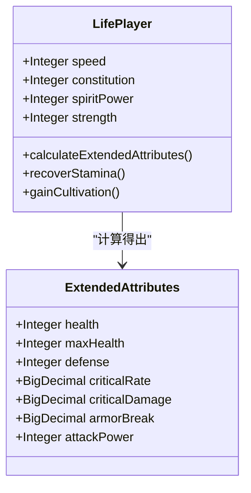
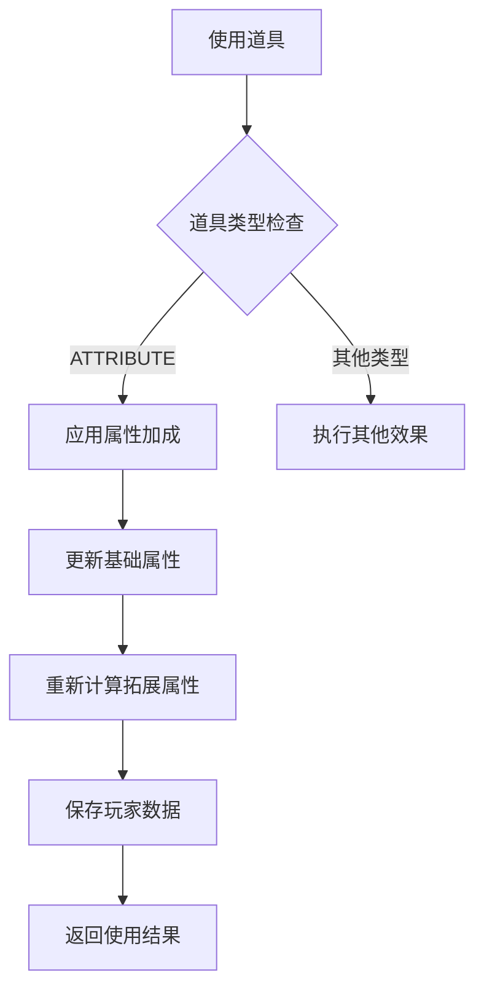
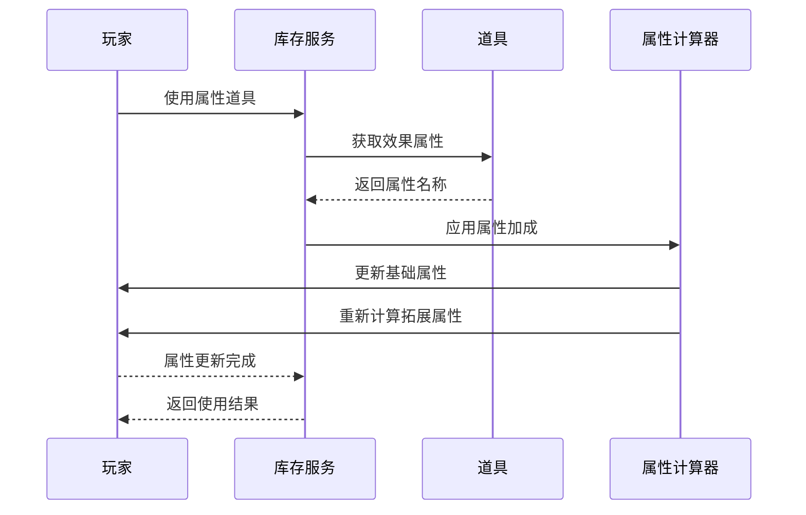
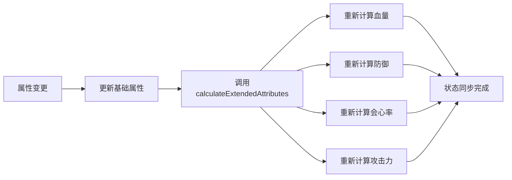
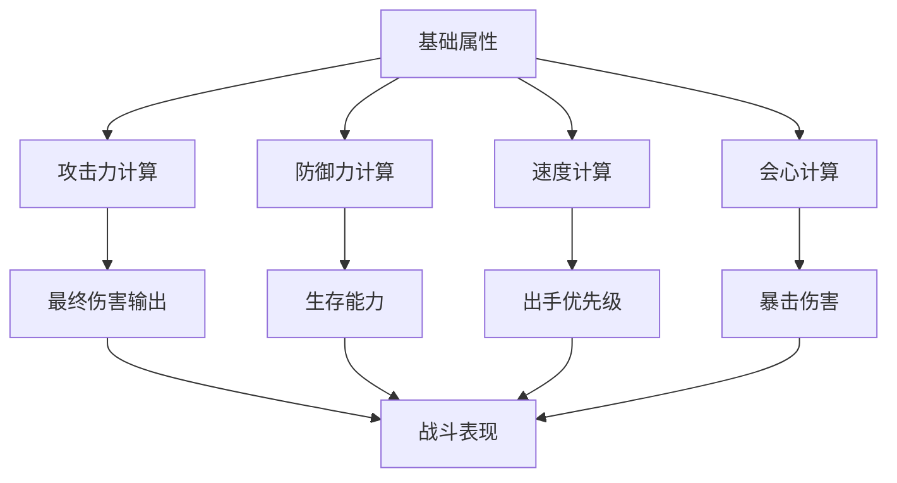
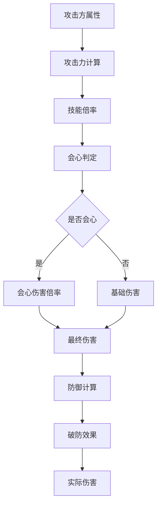
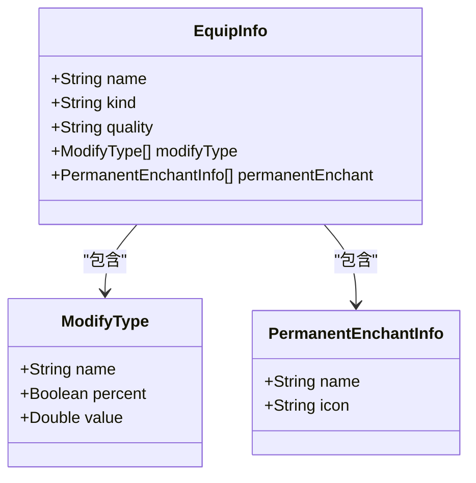
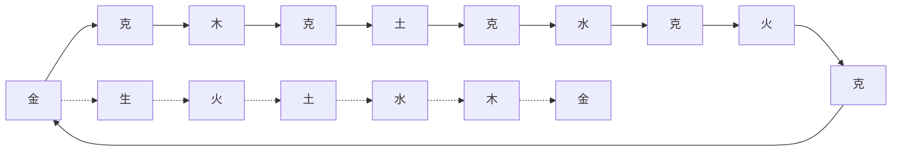
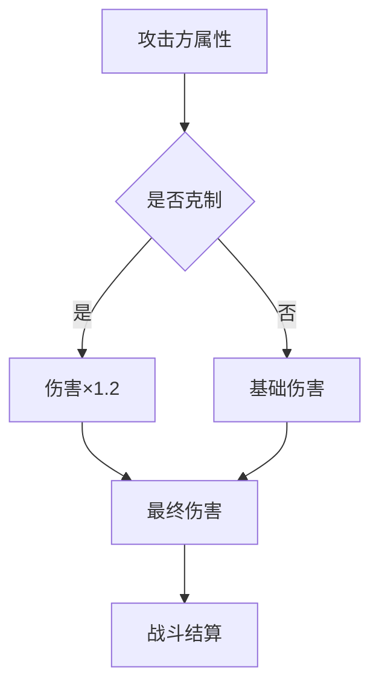
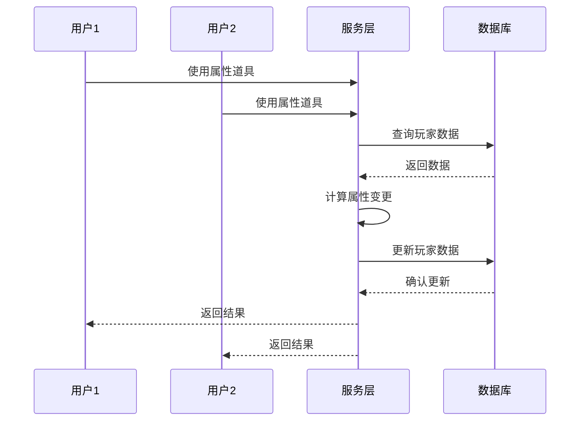

# 属性类道具

<cite>
**本文档引用的文件**
- [LifeHandlerImpl.java](file://Life/src/main/java/com/robot/life/service/impl/LifeHandlerImpl.java)
- [PlayerServiceImpl.java](file://Life/src/main/java/com/robot/life/service/impl/PlayerServiceImpl.java)
- [LifePlayer.java](file://Life/src/main/java/com/robot/life/dao/entity/LifePlayer.java)
- [InventoryServiceImpl.java](file://Life/src/main/java/com/robot/life/service/impl/InventoryServiceImpl.java)
- [BattleServiceImpl.java](file://Life/src/main/java/com/robot/life/service/impl/BattleServiceImpl.java)
- [ENAttribute.java](file://Life/src/main/java/com/robot/life/enums/ENAttribute.java)
- [AttributeBaseInfo.java](file://Base/src/main/java/com/bot/base/dto/jx/attribute/AttributeBaseInfo.java)
- [AttributeDetailInfo.java](file://Base/src/main/java/com/bot/base/dto/jx/attribute/AttributeDetailInfo.java)
- [EquipInfo.java](file://Base/src/main/java/com/bot/base/dto/jx/attribute/EquipInfo.java)
</cite>

## 目录
1. [概述](#概述)
2. [基础属性系统](#基础属性系统)
3. [属性类道具机制](#属性类道具机制)
4. [属性变更与状态刷新](#属性变更与状态刷新)
5. [战斗能力影响](#战斗能力影响)
6. [装备系统集成](#装备系统集成)
7. [属性克制关系](#属性克制关系)
8. [性能优化考虑](#性能优化考虑)
9. [故障排除指南](#故障排除指南)
10. [总结](#总结)

## 概述

属性类道具是《浮生卷》游戏中的核心机制之一，通过使用特定道具可以直接提升角色的基础属性值，包括力量、灵力、体质、敏捷等关键战斗属性。这些道具的使用不仅能够显著增强角色的战斗能力，还能影响角色的成长路径和战斗策略。

## 基础属性系统

### 四维属性结构

游戏采用四维属性体系，每种属性都对应着不同的战斗能力和成长特性：

**图表来源**
- [LifePlayer.java](file://Life/src/main/java/com/robot/life/dao/entity/LifePlayer.java#L25-L76)

### 属性计算公式

每个基础属性都会通过特定的公式转换为战斗属性：

| 基础属性 | 拓展属性 | 计算公式 |
|---------|---------|----------|
| 速度 | 破防率 | 每点速度增加0.005%破防率 |
| 体质 | 血量/防御 | 每点体质增加10点血量和1点防御 |
| 灵力 | 会心率/效果 | 每点灵力增加0.01%会心率和0.005%会心效果 |
| 力量 | 攻击力/破防 | 每点力量增加6点攻击力和0.01%破防率 |

**节来源**
- [LifePlayer.java](file://Life/src/main/java/com/robot/life/dao/entity/LifePlayer.java#L56-L76)

## 属性类道具机制

### 道具分类与效果

属性类道具通过`ENItemType.ATTRIBUTE`类型标识，具有以下特征：

**图表来源**
- [InventoryServiceImpl.java](file://Life/src/main/java/com/robot/life/service/impl/InventoryServiceImpl.java#L187-L195)

### 属性加成算法

属性加成的核心实现在`applyAttributeBonus`方法中：

**图表来源**
- [InventoryServiceImpl.java](file://Life/src/main/java/com/robot/life/service/impl/InventoryServiceImpl.java#L232-L254)

**节来源**
- [InventoryServiceImpl.java](file://Life/src/main/java/com/robot/life/service/impl/InventoryServiceImpl.java#L187-L195)

## 属性变更与状态刷新

### 状态刷新流程

当属性发生变更时，系统会自动触发状态刷新机制：

**图表来源**
- [LifePlayer.java](file://Life/src/main/java/com/robot/life/dao/entity/LifePlayer.java#L56-L76)

### 自动恢复机制

系统还实现了自动恢复功能，确保玩家状态的平衡性：

| 恢复类型 | 触发条件 | 恢复速率 |
|---------|---------|----------|
| 体力恢复 | 每5分钟 | 1点/5分钟 |
| 血量恢复 | 每小时 | 10%最大血量 |
| 修为增长 | 每分钟 | 根据修炼速度 |

**节来源**
- [LifePlayer.java](file://Life/src/main/java/com/robot/life/dao/entity/LifePlayer.java#L81-L96)

## 战斗能力影响

### 战斗属性计算

属性类道具对战斗能力的影响体现在多个维度：

**图表来源**
- [BattleServiceImpl.java](file://Life/src/main/java/com/robot/life/service/impl/BattleServiceImpl.java#L149-L162)

### 伤害计算公式

战斗中的伤害计算综合考虑了多种属性因素：

**图表来源**
- [BattleServiceImpl.java](file://Life/src/main/java/com/robot/life/service/impl/BattleServiceImpl.java#L149-L162)

**节来源**
- [BattleServiceImpl.java](file://Life/src/main/java/com/robot/life/service/impl/BattleServiceImpl.java#L149-L162)

## 装备系统集成

### 装备属性加成

装备系统通过`EquipInfo`类提供属性加成支持：

**图表来源**
- [EquipInfo.java](file://Base/src/main/java/com/bot/base/dto/jx/attribute/EquipInfo.java#L10-L71)

### 属性叠加规则

装备属性与道具属性之间存在叠加规则：

| 属性类型 | 叠加方式 | 限制条件 |
|---------|---------|----------|
| 基础属性 | 直接相加 | 无上限 |
| 百分比属性 | 累计计算 | 最大100% |
| 固定数值 | 直接相加 | 无上限 |

**节来源**
- [EquipInfo.java](file://Base/src/main/java/com/bot/base/dto/jx/attribute/EquipInfo.java#L10-L71)

## 属性克制关系

### 克制系统设计

游戏实现了五行相生相克的属性克制系统：

**图表来源**
- [ENAttribute.java](file://Life/src/main/java/com/robot/life/enums/ENAttribute.java#L45-L63)

### 克制效果计算

属性克制在战斗中产生20%的伤害加成：

**图表来源**
- [BattleServiceImpl.java](file://Life/src/main/java/com/robot/life/service/impl/BattleServiceImpl.java#L129-L131)

**节来源**
- [ENAttribute.java](file://Life/src/main/java/com/robot/life/enums/ENAttribute.java#L45-L63)

## 性能优化考虑

### 数据访问优化

系统采用了多层缓存和延迟加载策略：

| 优化策略 | 实现方式 | 效果 |
|---------|---------|------|
| 延迟计算 | 仅在需要时重新计算拓展属性 | 减少CPU开销 |
| 批量更新 | 合并多次属性变更操作 | 减少数据库IO |
| 内存缓存 | 缓存频繁访问的配置数据 | 提升响应速度 |

### 并发控制

系统实现了适当的并发控制机制：

## 故障排除指南

### 常见问题及解决方案

| 问题类型 | 症状描述 | 解决方案 |
|---------|---------|----------|
| 属性不生效 | 使用道具后属性未变化 | 检查道具配置的effectAttribute字段 |
| 计算错误 | 拓展属性计算结果异常 | 验证calculateExtendedAttributes方法逻辑 |
| 性能问题 | 属性计算耗时过长 | 优化属性计算算法，减少不必要的循环 |
| 数据不一致 | 属性显示与实际不符 | 检查状态刷新流程，确保数据一致性 |

### 调试建议

1. **日志记录**：启用详细的属性变更日志
2. **单元测试**：编写针对属性计算的单元测试
3. **性能监控**：监控属性计算的执行时间
4. **数据验证**：定期验证属性数据的完整性

## 总结

属性类道具系统是《浮生卷》游戏的核心机制之一，它通过简洁而有效的设计实现了角色属性的动态调整。系统的主要特点包括：

1. **模块化设计**：清晰的职责分离，便于维护和扩展
2. **自动状态管理**：属性变更后自动刷新相关状态
3. **性能优化**：合理的缓存和计算策略
4. **用户体验**：直观的使用界面和反馈机制

该系统为玩家提供了丰富的角色培养选择，同时保持了游戏平衡性和可玩性。通过持续的优化和改进，属性类道具系统将继续为玩家带来更好的游戏体验。