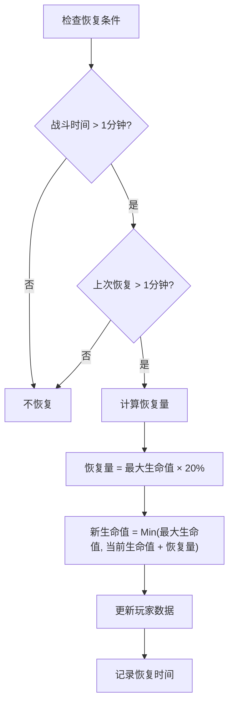
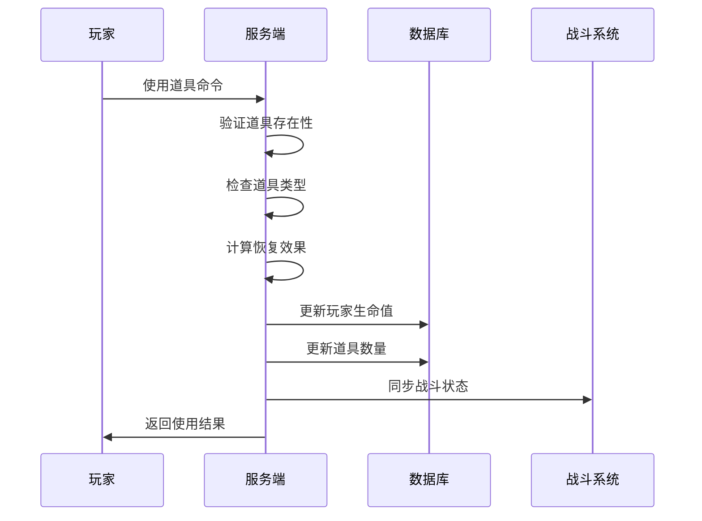
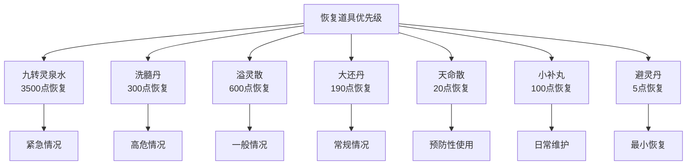
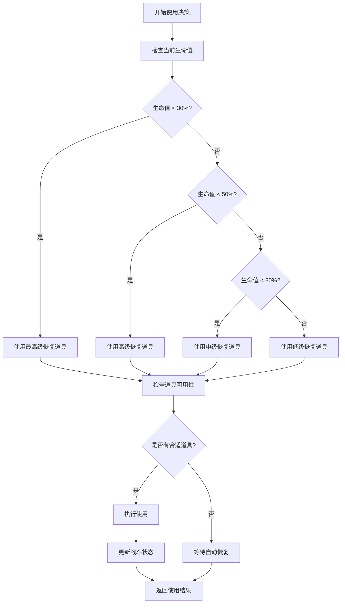
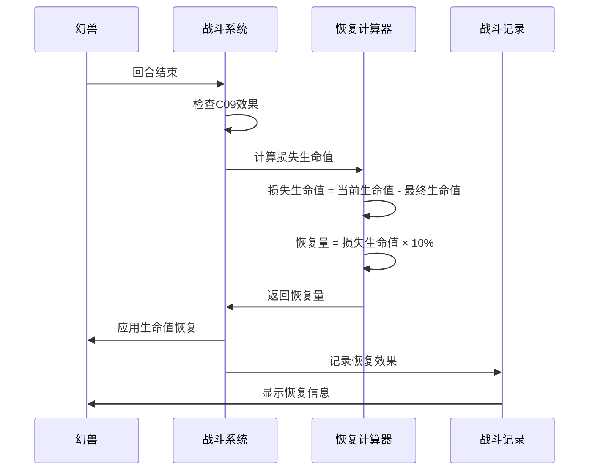
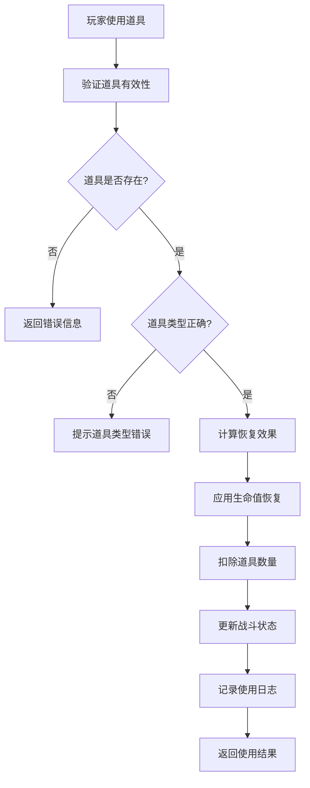

# 恢复类道具

<cite>
**本文档引用的文件**
- [HealthRecoveryServiceImpl.java](file://Life/src/main/java/com/bot/life/service/impl/HealthRecoveryServiceImpl.java)
- [LifeHandlerImpl.java](file://Life/src/main/java/com/bot/life/service/impl/LifeHandlerImpl.java)
- [HealthRecoveryService.java](file://Life/src/main/java/com/bot/life/service/HealthRecoveryService.java)
- [HealthRecoveryTask.java](file://Life/src/main/java/com/bot/life/task/HealthRecoveryTask.java)
- [ENItemType.java](file://Life/src/main/java/com/bot/life/enums/ENItemType.java)
- [LifeItem.java](file://Life/src/main/java/com/bot/life/dao/entity/LifeItem.java)
- [BattleServiceImpl.java](file://Game/src/main/java/com/bot/game/service/impl/BattleServiceImpl.java)
- [ENGoodEffect.java](file://Game/src/main/java/com/bot/game/enums/ENGoodEffect.java)
- [UseGoodsDTO.java](file://Game/src/main/java/com/bot/game/dto/UseGoodsDTO.java)
- [UseGoodsPrinter.java](file://Game/src/main/java/com/bot/game/chain/menu/UseGoodsPrinter.java)
- [ENSkillEffect.java](file://Game/src/main/java/com/bot/game/enums/ENSkillEffect.java)
</cite>

## 目录
1. [概述](#概述)
2. [恢复类道具分类](#恢复类道具分类)
3. [生命值恢复机制](#生命值恢复机制)
4. [战斗中恢复策略](#战斗中恢复策略)
5. [战斗外恢复策略](#战斗外恢复策略)
6. [道具使用场景与限制](#道具使用场景与限制)
7. [优先级判断规则](#优先级判断规则)
8. [恢复效果生效流程](#恢复效果生效流程)
9. [性能优化考虑](#性能优化考虑)
10. [故障排除指南](#故障排除指南)

## 概述

恢复类道具是游戏中重要的资源管理工具，主要用于在玩家生命值受损时提供即时恢复效果。这些道具在战斗内外都有不同的使用策略和生效机制，通过精心的使用可以显著提升玩家的生存能力和战斗效率。

恢复类道具系统包含两个主要层面：
- **生命值自动恢复服务**：基于时间间隔的被动恢复机制
- **主动使用道具系统**：玩家手动控制的即时恢复手段

## 恢复类道具分类

根据游戏设计，恢复类道具主要分为以下几种类型：

### 生命值恢复类道具
- **基础恢复道具**：提供固定生命值恢复
- **百分比恢复道具**：按最大生命值百分比恢复
- **持续恢复道具**：产生持续性治疗效果

### 法力值恢复类道具
- **能量补充道具**：恢复法力值或技能能量
- **法力上限提升道具**：增加最大法力值

### 综合恢复类道具
- **全属性恢复道具**：同时恢复生命值和法力值
- **状态恢复道具**：解除负面状态并恢复生命值

**节来源**
- [ENItemType.java](file://Life/src/main/java/com/bot/life/enums/ENItemType.java#L12)
- [LifeItem.java](file://Life/src/main/java/com/bot/life/dao/entity/LifeItem.java#L15)

## 生命值恢复机制

### 自动恢复机制

生命值自动恢复系统通过HealthRecoveryService实现，具有以下特点：

#### 恢复触发条件
1. **战斗脱离检测**：玩家最后战斗时间超过1分钟
2. **恢复间隔控制**：两次恢复之间至少间隔1分钟
3. **生命值不足**：当前生命值低于最大生命值

#### 恢复计算公式

**图表来源**
- [HealthRecoveryServiceImpl.java](file://Life/src/main/java/com/bot/life/service/impl/HealthRecoveryServiceImpl.java#L28-L62)

#### 定时任务调度
系统通过HealthRecoveryTask实现每分钟的自动恢复检查，确保所有玩家都能及时获得生命值恢复。

**节来源**
- [HealthRecoveryServiceImpl.java](file://Life/src/main/java/com/bot/life/service/impl/HealthRecoveryServiceImpl.java#L28-L84)
- [HealthRecoveryTask.java](file://Life/src/main/java/com/bot/life/task/HealthRecoveryTask.java#L21-L29)

### 主动使用恢复机制

战斗中的主动恢复通过玩家指令实现，具有以下特点：

#### 使用流程
1. **道具选择**：玩家从可用道具列表中选择恢复道具
2. **类型验证**：确认道具为恢复类道具
3. **效果应用**：立即恢复指定的生命值
4. **道具消耗**：减少道具数量

#### 恢复效果计算

**图表来源**
- [LifeHandlerImpl.java](file://Life/src/main/java/com/bot/life/service/impl/LifeHandlerImpl.java#L1362-L1412)

**节来源**
- [LifeHandlerImpl.java](file://Life/src/main/java/com/bot/life/service/impl/LifeHandlerImpl.java#L1362-L1412)

## 战斗中恢复策略

### 战斗内恢复时机

战斗中的恢复策略需要考虑以下因素：

#### 战斗状态判断
- **战斗进行中**：只能使用战斗中可用的道具
- **战斗准备阶段**：可以使用准备阶段道具
- **战斗结束后**：进入自动恢复阶段

#### 恢复优先级
1. **紧急情况**：生命值低于30%时优先使用
2. **关键技能**：配合关键技能使用以最大化效果
3. **团队协作**：在团队战斗中优先支援队友

### 战斗外恢复策略

战斗外的恢复策略更加灵活：

#### 日常恢复
- **定时恢复**：利用自动恢复机制
- **道具储备**：合理规划道具使用
- **状态监控**：定期检查生命值状态

#### 特殊场景
- **探索前准备**：确保有足够的生命值进行探索
- **副本挑战**：提前使用恢复道具应对高难度挑战
- **竞技场**：保持最佳状态参与竞争

**节来源**
- [LifeHandlerImpl.java](file://Life/src/main/java/com/bot/life/service/impl/LifeHandlerImpl.java#L1331-L1357)

## 战斗外恢复策略

### 日常恢复管理

战斗外的恢复管理主要包括：

#### 自动恢复配置
- **恢复间隔**：系统默认每分钟恢复20%
- **触发条件**：脱离战斗1分钟后开始恢复
- **恢复上限**：单次恢复不超过最大生命值的20%

#### 手动恢复策略
- **批量使用**：在安全区域集中使用多个恢复道具
- **效果叠加**：避免同时使用多种相同效果的道具
- **效果维持**：利用持续效果道具延长恢复时间

### 特殊场景处理

#### 掉落战恢复
当玩家在战斗中被击败时：
1. **生命值重置**：生命值恢复到1点
2. **体力消耗**：扣除5点体力值
3. **状态清理**：清除所有负面效果

#### 探索恢复
在探索过程中：
- **环境恢复**：某些特殊地点提供加速恢复效果
- **事件恢复**：完成特定事件获得临时恢复加成
- **装备恢复**：穿戴恢复类装备获得持续恢复效果

**节来源**
- [LifeHandlerImpl.java](file://Life/src/main/java/com/bot/life/service/impl/LifeHandlerImpl.java#L1419-L1484)

## 道具使用场景与限制

### 使用场景限制

不同类型的恢复道具有不同的使用场景：

#### 战斗中使用
- **可用标志**：`canUseInBattle = 1`
- **效果类型**：即时恢复效果
- **使用频率**：无严格限制，但需考虑战斗节奏

#### 战斗外使用
- **可用标志**：`canUseInBattle = 0`
- **效果类型**：被动恢复或状态恢复
- **使用频率**：通常无限制

### 道具效果限制

#### 效果值范围
- **最小恢复**：5点生命值
- **最大恢复**：3500点生命值（九转灵泉水）
- **百分比恢复**：按最大生命值的百分比计算

#### 使用次数限制
- **有限使用**：部分道具有使用次数限制
- **无限使用**：大多数恢复道具可无限使用
- **冷却时间**：某些道具使用后有冷却时间

**节来源**
- [LifeItem.java](file://Life/src/main/java/com/bot/life/dao/entity/LifeItem.java#L15-L20)
- [ENGoodEffect.java](file://Game/src/main/java/com/bot/game/enums/ENGoodEffect.java#L15-L24)

## 优先级判断规则

### 恢复优先级体系

系统采用多层次的优先级判断机制：

#### 1. 紧急程度优先
- **生命值低于30%**：最高优先级
- **生命值低于50%**：高优先级
- **生命值低于80%**：中等优先级
- **生命值高于80%**：低优先级

#### 2. 效果强度排序

**图表来源**
- [ENGoodEffect.java](file://Game/src/main/java/com/bot/game/enums/ENGoodEffect.java#L15-L24)

#### 3. 效果持续性考虑
- **即时效果**：立即生效，适合紧急情况
- **持续效果**：产生持续恢复，适合长期作战
- **状态恢复**：解除负面状态，适合团队作战

### 使用决策算法

系统通过以下算法确定最优使用策略：

**图表来源**
- [LifeHandlerImpl.java](file://Life/src/main/java/com/bot/life/service/impl/LifeHandlerImpl.java#L1362-L1412)

**节来源**
- [ENGoodEffect.java](file://Game/src/main/java/com/bot/game/enums/ENGoodEffect.java#L15-L24)

## 恢复效果生效流程

### 战斗中恢复效果

战斗中的恢复效果通过技能系统实现：

#### C09效果机制
C09效果（每回合结束时回复已损失生命值的10%）的生效流程：

**图表来源**
- [BattleServiceImpl.java](file://Game/src/main/java/com/bot/game/service/impl/BattleServiceImpl.java#L493-L499)

#### 恢复效果类型
- **直接恢复**：立即恢复指定生命值
- **百分比恢复**：按当前生命值百分比恢复
- **持续恢复**：产生持续性治疗效果

### 道具使用效果

道具使用的效果生效流程：

**图表来源**
- [LifeHandlerImpl.java](file://Life/src/main/java/com/bot/life/service/impl/LifeHandlerImpl.java#L1392-L1412)

**节来源**
- [BattleServiceImpl.java](file://Game/src/main/java/com/bot/game/service/impl/BattleServiceImpl.java#L493-L499)
- [LifeHandlerImpl.java](file://Life/src/main/java/com/bot/life/service/impl/LifeHandlerImpl.java#L1392-L1412)

## 性能优化考虑

### 系统性能优化

#### 1. 恢复检查优化
- **批量处理**：定时任务一次性检查所有玩家
- **缓存机制**：缓存玩家状态减少数据库查询
- **异步处理**：非阻塞式的恢复计算

#### 2. 内存使用优化
- **对象池化**：复用恢复相关的对象
- **延迟加载**：按需加载道具数据
- **垃圾回收**：及时释放不再使用的对象

#### 3. 数据库优化
- **索引优化**：为玩家ID建立索引
- **批量操作**：合并多个更新操作
- **连接池**：使用数据库连接池

### 网络传输优化

#### 1. 数据压缩
- **消息压缩**：对恢复结果进行压缩传输
- **增量更新**：只传输变化的数据
- **协议优化**：使用高效的通信协议

#### 2. 缓存策略
- **本地缓存**：在客户端缓存常用数据
- **CDN加速**：使用内容分发网络
- **预加载**：预先加载可能需要的数据

## 故障排除指南

### 常见问题及解决方案

#### 1. 恢复功能异常
**症状**：生命值无法自动恢复
**排查步骤**：
1. 检查最后战斗时间是否超过1分钟
2. 验证上次恢复时间是否超过1分钟
3. 确认玩家生命值是否已满

**解决方案**：
- 强制更新最后战斗时间
- 手动触发恢复检查
- 检查定时任务是否正常运行

#### 2. 道具使用失败
**症状**：无法使用恢复道具
**排查步骤**：
1. 检查道具是否在战斗中可用
2. 验证道具数量是否充足
3. 确认道具类型是否正确

**解决方案**：
- 更新道具可用性标记
- 补充道具库存
- 修复道具类型识别逻辑

#### 3. 战斗状态同步问题
**症状**：战斗中生命值显示异常
**排查步骤**：
1. 检查战斗状态数据完整性
2. 验证恢复效果应用顺序
3. 确认状态更新同步机制

**解决方案**：
- 重新同步战斗状态
- 调整效果应用顺序
- 修复状态同步逻辑

### 监控与诊断

#### 关键指标监控
- **恢复成功率**：自动恢复功能的成功率
- **道具使用率**：各类恢复道具的使用频率
- **响应时间**：恢复功能的平均响应时间

#### 日志分析
- **错误日志**：记录恢复过程中的异常
- **性能日志**：监控系统性能指标
- **用户行为日志**：分析玩家使用习惯

**节来源**
- [HealthRecoveryServiceImpl.java](file://Life/src/main/java/com/bot/life/service/impl/HealthRecoveryServiceImpl.java#L28-L84)

## 结论

恢复类道具系统是游戏平衡性和可玩性的关键组成部分。通过合理的使用策略和优化的实现机制，可以为玩家提供流畅的游戏体验。建议玩家根据具体情况选择合适的恢复策略，系统管理员应关注性能指标和用户体验，确保恢复功能的稳定性和高效性。

未来的改进方向包括：
- **智能推荐**：根据玩家状态推荐最佳恢复策略
- **动态调整**：根据游戏进度动态调整恢复参数
- **社交互动**：增加团队间的恢复协作机制