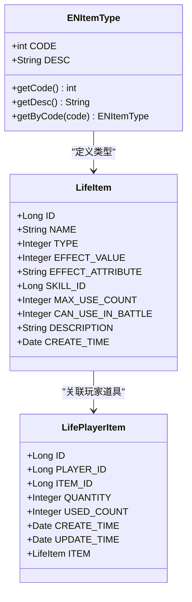
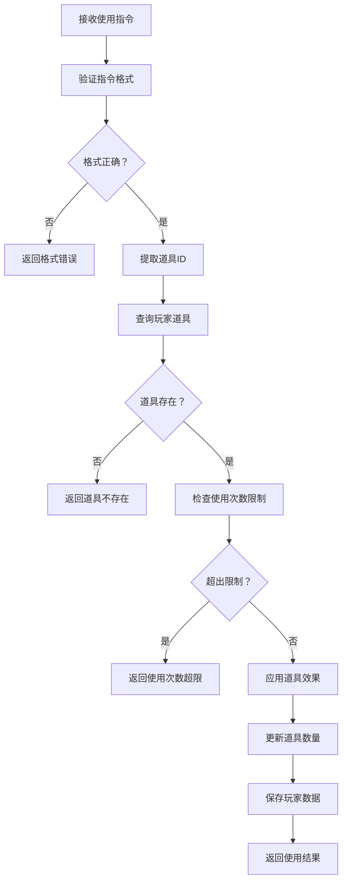
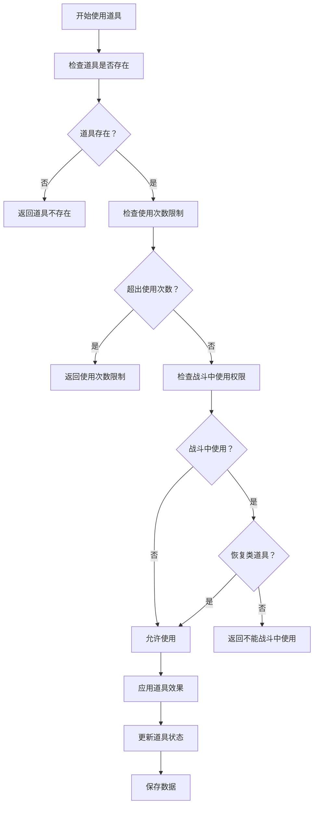
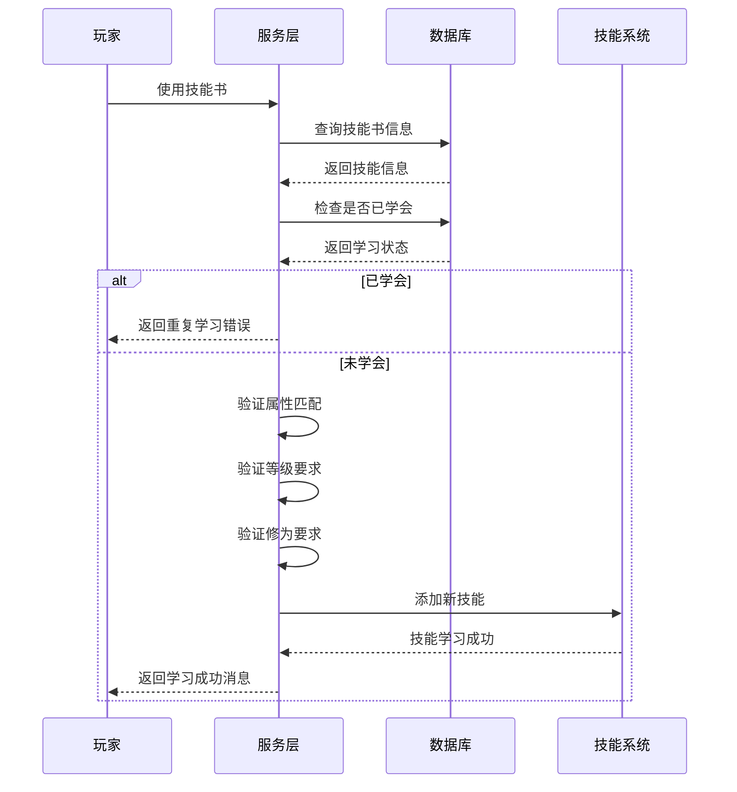
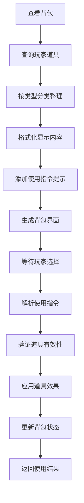
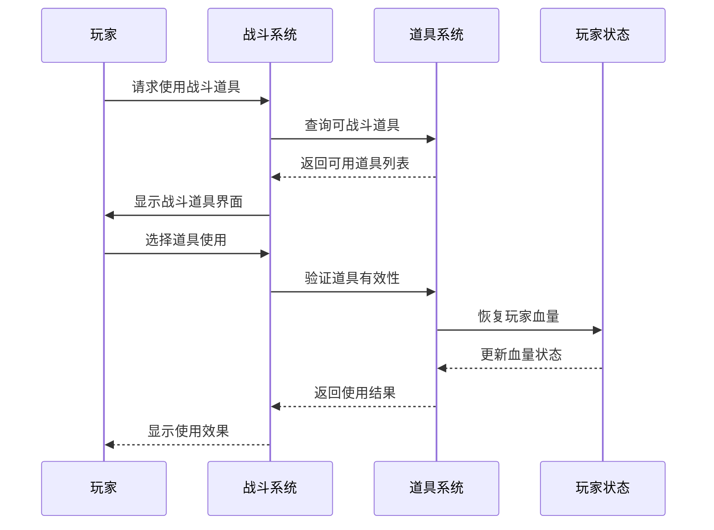
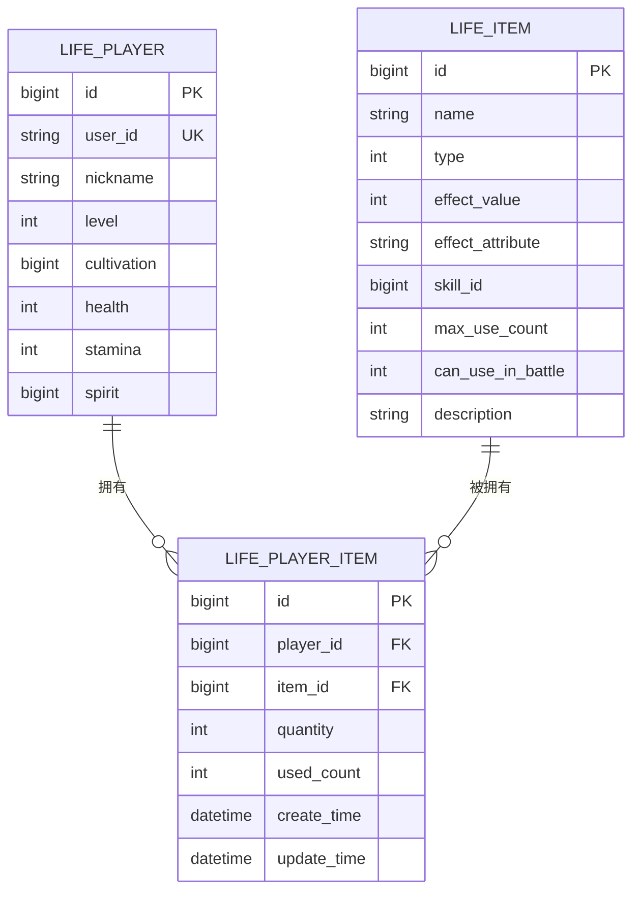
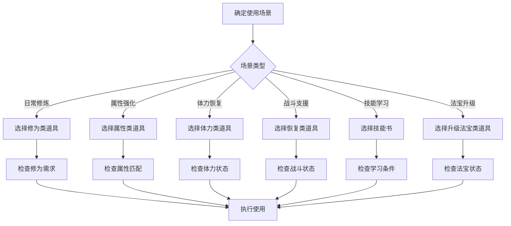

# 道具系统

<cite>
**本文档引用的文件**
- [LifeHandlerImpl.java](file://Life/src/main/java/com/bot/life/service/impl/LifeHandlerImpl.java)
- [InventoryServiceImpl.java](file://Life/src/main/java/com/bot/life/service/impl/InventoryServiceImpl.java)
- [ENItemType.java](file://Life/src/main/java/com/bot/life/enums/ENItemType.java)
- [LifeItem.java](file://Life/src/main/java/com/bot/life/dao/entity/LifeItem.java)
- [LifePlayerItem.java](file://Life/src/main/java/com/bot/life/dao/entity/LifePlayerItem.java)
- [Life_User_Manual.md](file://Life_User_Manual.md)
- [UseGoodsPrinter.java](file://Game/src/main/java/com/bot/game/chain/menu/UseGoodsPrinter.java)
- [ENGoodEffect.java](file://Game/src/main/java/com/bot/game/enums/ENGoodEffect.java)
- [LifeHandlerImpl.java](file://Life/src/main/java/com/bot/life/service/impl/LifeHandlerImpl.java)
</cite>

## 目录
1. [系统概述](#系统概述)
2. [道具类型分类](#道具类型分类)
3. [道具使用指令解析](#道具使用指令解析)
4. [道具使用限制](#道具使用限制)
5. [道具效果应用](#道具效果应用)
6. [背包管理系统](#背包管理系统)
7. [战斗中道具使用](#战斗中道具使用)
8. [道具数据库结构](#道具数据库结构)
9. [使用场景分析](#使用场景分析)
10. [故障排除指南](#故障排除指南)

## 系统概述

浮生卷的道具系统是一个完整的修仙主题游戏道具管理框架，支持多种类型的道具使用和管理。系统基于Java Spring架构，采用分层设计，包含道具类型枚举、数据库实体、服务层逻辑和用户交互界面。

### 核心特性

- **多类型支持**：支持修为类、属性类、体力类、升级法宝类、恢复类和技能书六种道具类型
- **使用限制**：针对不同道具设置使用次数限制和战斗中使用权限
- **效果多样化**：每种道具类型具有独特的效果和应用场景
- **智能管理**：提供背包管理和道具使用自动化处理
- **战斗集成**：支持战斗中使用恢复类道具

## 道具类型分类

### 1. 修为类道具 (Type: 1)
**功能**：直接增加玩家修为值
**特点**：
- 一次性使用
- 无使用次数限制
- 效果值直接叠加到玩家当前修为

**使用示例**：
```
使用123  // 使用ID为123的修为类道具
```

### 2. 属性类道具 (Type: 2)
**功能**：永久增加玩家属性值
**特点**：
- 可设置使用次数限制（-1表示无限次）
- 影响具体属性：速度、体质、灵力、力量
- 使用后属性永久增加

**支持的属性**：
- `speed`：速度，影响出手顺序和破防
- `constitution`：体质，影响血量和防御
- `spirit_power`：灵力，影响会心率和会心效果
- `strength`：力量，影响攻击力和破防

### 3. 体力类道具 (Type: 3)
**功能**：恢复玩家体力值
**特点**：
- 一次性使用
- 效果值用于恢复体力
- 自动限制在最大体力范围内

### 4. 升级法宝类道具 (Type: 4)
**功能**：增加法宝熟练度
**特点**：
- 开发中功能
- 计划支持法宝升级和熟练度提升
- 与法宝系统深度集成

### 5. 恢复类道具 (Type: 5)
**功能**：恢复玩家血量
**特点**：
- 可在战斗中使用
- 一次性使用
- 效果值用于恢复生命值

### 6. 技能书道具 (Type: 6)
**功能**：学习新技能
**特点**：
- 关联具体技能ID
- 需满足属性匹配和等级要求
- 学习后永久获得技能



**图表来源**
- [ENItemType.java](file://Life/src/main/java/com/bot/life/enums/ENItemType.java#L6-L38)
- [LifeItem.java](file://Life/src/main/java/com/bot/life/dao/entity/LifeItem.java#L10-L22)
- [LifePlayerItem.java](file://Life/src/main/java/com/bot/life/dao/entity/LifePlayerItem.java#L10-L22)

**章节来源**
- [Life_User_Manual.md](file://Life_User_Manual.md#L149-L156)
- [ENItemType.java](file://Life/src/main/java/com/bot/life/enums/ENItemType.java#L6-L12)

## 道具使用指令解析

### 基本使用语法

道具使用指令遵循统一的格式规范：

```
使用 + 道具ID
```

### 指令解析流程



**图表来源**
- [LifeHandlerImpl.java](file://Life/src/main/java/com/bot/life/service/impl/LifeHandlerImpl.java#L594-L605)
- [InventoryServiceImpl.java](file://Life/src/main/java/com/bot/life/service/impl/InventoryServiceImpl.java#L78-L111)

### 具体实现步骤

1. **指令识别**：检测以"使用"开头的指令
2. **参数提取**：移除"使用"前缀，提取道具ID
3. **格式验证**：确保ID为有效数字
4. **道具查询**：根据玩家ID和道具ID查找道具
5. **状态检查**：验证道具可用性和使用限制
6. **效果应用**：执行相应的道具效果
7. **状态更新**：更新道具数量和使用次数
8. **结果反馈**：向玩家返回使用结果

**章节来源**
- [LifeHandlerImpl.java](file://Life/src/main/java/com/bot/life/service/impl/LifeHandlerImpl.java#L594-L605)
- [InventoryServiceImpl.java](file://Life/src/main/java/com/bot/life/service/impl/InventoryServiceImpl.java#L78-L111)

## 道具使用限制

### 使用次数限制

属性类道具支持使用次数限制机制：

```java
// 检查使用次数限制
if (item.getType() == ENItemType.ATTRIBUTE.getCode() && item.getMaxUseCount() > 0) {
    if (playerItem.getUsedCount() >= item.getMaxUseCount()) {
        return String.format("『使用失败』\n\n『%s』已达使用上限！\n已使用：%d/%d次", 
            item.getName(), playerItem.getUsedCount(), item.getMaxUseCount());
    }
}
```

### 战斗中使用限制

道具在战斗中的使用权限由`canUseInBattle`字段控制：

- **可战斗中使用**：`canUseInBattle = 1`
- **不可战斗中使用**：`canUseInBattle = 0`

**战斗中使用规则**：
1. 只有恢复类道具可在战斗中使用
2. 检查道具类型是否为恢复类
3. 验证战斗状态下的使用权限
4. 应用战斗中恢复效果

### 条件检查流程



**图表来源**
- [InventoryServiceImpl.java](file://Life/src/main/java/com/bot/life/service/impl/InventoryServiceImpl.java#L89-L106)
- [LifeHandlerImpl.java](file://Life/src/main/java/com/bot/life/service/impl/LifeHandlerImpl.java#L1387-L1390)

**章节来源**
- [InventoryServiceImpl.java](file://Life/src/main/java/com/bot/life/service/impl/InventoryServiceImpl.java#L89-L106)
- [LifeHandlerImpl.java](file://Life/src/main/java/com/bot/life/service/impl/LifeHandlerImpl.java#L1387-L1390)

## 道具效果应用

### 修为类道具效果

```java
case CULTIVATION:
    player.setCultivation(player.getCultivation() + item.getEffectValue());
    return String.format("『使用成功！』\n\n服用了『%s』\n获得修为：%d\n当前修为：%s", 
                       item.getName(), item.getEffectValue(), formatNumber(player.getCultivation()));
```

### 属性类道具效果

属性类道具的效果应用涉及多个属性维度：

```java
private String applyAttributeBonus(LifePlayer player, LifeItem item) {
    String effectAttr = item.getEffectAttribute();
    int value = item.getEffectValue();
    
    switch (effectAttr) {
        case "speed":
            player.setSpeed(player.getSpeed() + value);
            return "速度";
        case "constitution":
            player.setConstitution(player.getConstitution() + value);
            return "体质";
        case "spirit_power":
            player.setSpiritPower(player.getSpiritPower() + value);
            return "灵力";
        case "strength":
            player.setStrength(player.getStrength() + value);
            return "力量";
        default:
            return null;
    }
}
```

### 体力类道具效果

体力恢复效果自动限制在最大体力范围内：

```java
int oldStamina = player.getStamina();
player.setStamina(Math.min(player.getMaxStamina(), player.getStamina() + item.getEffectValue()));
int recovered = player.getStamina() - oldStamina;
```

### 恢复类道具效果

血量恢复效果同样自动处理边界情况：

```java
int oldHealth = player.getHealth();
player.setHealth(Math.min(player.getMaxHealth(), player.getHealth() + item.getEffectValue()));
int healed = player.getHealth() - oldHealth;
```

### 技能书道具效果

技能书的学习过程包含多重验证：

1. **技能关联检查**：验证技能ID有效性
2. **重复学习检查**：防止重复学习同一技能
3. **属性匹配检查**：确保技能属性与玩家匹配
4. **等级要求检查**：验证玩家等级是否满足
5. **修为要求检查**：验证修为是否足够



**图表来源**
- [InventoryServiceImpl.java](file://Life/src/main/java/com/bot/life/service/impl/InventoryServiceImpl.java#L175-L219)
- [InventoryServiceImpl.java](file://Life/src/main/java/com/bot/life/service/impl/InventoryServiceImpl.java#L267-L324)

**章节来源**
- [InventoryServiceImpl.java](file://Life/src/main/java/com/bot/life/service/impl/InventoryServiceImpl.java#L175-L219)
- [InventoryServiceImpl.java](file://Life/src/main/java/com/bot/life/service/impl/InventoryServiceImpl.java#L267-L324)

## 背包管理系统

### 背包显示结构

背包系统按道具类型组织显示：

```java
StringBuilder display = new StringBuilder();
display.append("『").append(player.getNickname()).append("的背包』\n\n");
display.append("当前灵粹：").append(player.getSpirit() != null ? player.getSpirit() : 0).append("\n\n");

String currentType = "";
for (LifePlayerItem playerItem : items) {
    LifeItem item = playerItem.getItem();
    String itemType = getItemTypeName(item.getType());
    
    if (!itemType.equals(currentType)) {
        display.append("『").append(itemType).append("』\n");
        currentType = itemType;
    }
    
    display.append(String.format("%d. %s x%d", 
                 item.getId(), item.getName(), playerItem.getQuantity()));
    
    if (item.getMaxUseCount() > 0) {
        display.append(String.format("（已使用%d/%d次）", 
                     playerItem.getUsedCount(), item.getMaxUseCount()));
    }
    display.append("\n");
}
```

### 道具管理功能

1. **道具查询**：按玩家ID查询所有拥有的道具
2. **数量管理**：跟踪道具数量和使用次数
3. **类型分类**：按道具类型自动分类显示
4. **使用统计**：显示已使用次数和剩余次数

### 背包交互流程



**图表来源**
- [InventoryServiceImpl.java](file://Life/src/main/java/com/bot/life/service/impl/InventoryServiceImpl.java#L135-L171)

**章节来源**
- [InventoryServiceImpl.java](file://Life/src/main/java/com/bot/life/service/impl/InventoryServiceImpl.java#L135-L171)

## 战斗中道具使用

### 战斗道具选择界面

战斗中可使用的道具通过专门的界面展示：

```java
StringBuilder itemList = new StringBuilder();
itemList.append("『战斗道具』\n\n");

int index = 1;
boolean hasUsableItem = false;
for (LifePlayerItem playerItem : playerItems) {
    LifeItem item = playerItem.getItem();
    if (item != null && item.getCanUseInBattle() == 1) {
        itemList.append(String.format("%d. %s x%d\n", index, item.getName(), playerItem.getQuantity()));
        itemList.append(String.format("   效果：%s\n", item.getDescription()));
        hasUsableItem = true;
        index++;
    }
}
```

### 战斗道具使用限制

战斗中道具使用有严格的限制机制：

1. **类型限制**：只有恢复类道具可在战斗中使用
2. **权限检查**：验证道具的战斗使用权限
3. **效果应用**：自动恢复玩家血量
4. **战斗平衡**：防止滥用道具影响战斗平衡

### 战斗道具使用流程



**图表来源**
- [LifeHandlerImpl.java](file://Life/src/main/java/com/bot/life/service/impl/LifeHandlerImpl.java#L1331-L1394)

**章节来源**
- [LifeHandlerImpl.java](file://Life/src/main/java/com/bot/life/service/impl/LifeHandlerImpl.java#L1331-L1394)

## 道具数据库结构

### 核心数据表

#### 道具基础表 (life_item)
存储所有道具的基础信息：

| 字段名 | 类型 | 描述 |
|--------|------|------|
| id | bigint | 道具唯一标识 |
| name | varchar(50) | 道具名称 |
| type | tinyint | 道具类型（1-6） |
| effect_value | int | 效果值（修为、体力、恢复量） |
| effect_attribute | varchar(20) | 影响的属性（speed/constitution/spirit_power/strength） |
| skill_id | bigint | 关联技能ID（技能书专用） |
| max_use_count | int | 最大使用次数（-1表示无限次） |
| can_use_in_battle | tinyint | 战斗中使用权限（0否1是） |
| description | text | 道具描述 |

#### 玩家道具表 (life_player_item)
存储玩家拥有的道具信息：

| 字段名 | 类型 | 描述 |
|--------|------|------|
| id | bigint | 玩家道具唯一标识 |
| player_id | bigint | 玩家ID |
| item_id | bigint | 道具ID |
| quantity | int | 道具数量 |
| used_count | int | 已使用次数 |
| create_time | datetime | 创建时间 |
| update_time | datetime | 更新时间 |

### 数据关系图



**图表来源**
- [LifeItem.java](file://Life/src/main/java/com/bot/life/dao/entity/LifeItem.java#L10-L22)
- [LifePlayerItem.java](file://Life/src/main/java/com/bot/life/dao/entity/LifePlayerItem.java#L10-L22)

**章节来源**
- [LifeItem.java](file://Life/src/main/java/com/bot/life/dao/entity/LifeItem.java#L10-L22)
- [LifePlayerItem.java](file://Life/src/main/java/com/bot/life/dao/entity/LifePlayerItem.java#L10-L22)

## 使用场景分析

### 日常游戏场景

#### 1. 修为增长场景
**场景描述**：玩家通过使用修为类道具快速提升修为
**使用时机**：日常修炼、完成任务奖励、探索发现
**推荐道具**：各类修为丹药、修炼资源

#### 2. 属性强化场景
**场景描述**：玩家根据战斗需求选择合适的属性道具
**使用时机**：战斗前准备、境界突破、技能学习
**推荐道具**：属性丹药、天赋石、资质丹

#### 3. 体力恢复场景
**场景描述**：玩家在探索或战斗后恢复体力
**使用时机**：战斗结束后、探索疲劳、准备下次行动
**推荐道具**：体力丹药、恢复药剂

#### 4. 战斗支援场景
**场景描述**：战斗中使用恢复类道具维持战斗力
**使用时机**：战斗血量告急、连续战斗、BOSS战
**推荐道具**：血瓶、回血丹药

### 高级玩法场景

#### 1. 技能学习场景
**场景描述**：通过技能书学习新技能
**前置条件**：
- 玩家等级达到技能要求
- 修为满足技能学习条件
- 属性匹配技能属性
- 未重复学习同一技能

#### 2. 法宝升级场景
**场景描述**：使用升级法宝类道具提升法宝熟练度
**未来功能**：计划支持法宝系统深度集成

### 场景使用策略



**章节来源**
- [Life_User_Manual.md](file://Life_User_Manual.md#L149-L156)

## 故障排除指南

### 常见问题及解决方案

#### 1. 道具使用失败
**问题现象**：使用道具时提示"道具不存在"或"使用失败"
**可能原因**：
- 道具ID输入错误
- 道具数量不足
- 使用次数已达到上限
- 道具类型不匹配

**解决步骤**：
1. 检查道具ID是否正确
2. 确认背包中有足够数量的道具
3. 查看道具的使用次数限制
4. 验证道具类型是否符合使用条件

#### 2. 战斗中无法使用道具
**问题现象**：战斗中选择道具时提示"该道具不能在战斗中使用"
**可能原因**：
- 道具类型不是恢复类
- 道具战斗使用权限未开启
- 道具不在战斗可用列表中

**解决步骤**：
1. 确认道具类型为恢复类
2. 检查道具的`canUseInBattle`字段
3. 验证道具是否在战斗可用列表中

#### 3. 属性加成不生效
**问题现象**：使用属性类道具后属性没有变化
**可能原因**：
- 道具属性配置错误
- 属性字段为空或无效
- 属性计算逻辑异常

**解决步骤**：
1. 检查道具的`effectAttribute`字段
2. 验证属性值是否正确
3. 确认属性计算方法正常工作

#### 4. 技能学习失败
**问题现象**：使用技能书后提示各种学习失败信息
**可能原因**：
- 技能ID关联错误
- 玩家等级不足
- 修为不够
- 属性不匹配
- 已经学会该技能

**解决步骤**：
1. 检查技能书的`skillId`字段
2. 验证玩家等级是否满足要求
3. 确认修为是否足够
4. 检查属性是否匹配
5. 确认未重复学习技能

### 调试和监控

#### 道具使用日志
系统应记录以下关键信息：
- 使用时间
- 道具ID和名称
- 使用结果
- 状态变更前后值
- 错误信息

#### 性能监控指标
- 道具查询响应时间
- 使用成功率
- 异常使用频率
- 各类型道具使用分布

**章节来源**
- [InventoryServiceImpl.java](file://Life/src/main/java/com/bot/life/service/impl/InventoryServiceImpl.java#L78-L111)
- [LifeHandlerImpl.java](file://Life/src/main/java/com/bot/life/service/impl/LifeHandlerImpl.java#L594-L605)

## 总结

浮生卷的道具系统是一个设计完善、功能丰富的修仙主题游戏道具管理框架。系统通过清晰的类型划分、严格的使用限制、多样化的效果应用和智能的背包管理，为玩家提供了完整的道具使用体验。

### 系统优势

1. **类型丰富**：涵盖修仙游戏的各种道具需求
2. **限制合理**：通过使用次数和战斗权限控制游戏平衡
3. **效果明确**：每种道具都有清晰的效果和使用场景
4. **管理智能**：自动分类、统计和状态跟踪
5. **扩展性强**：模块化设计便于功能扩展

### 发展方向

1. **功能完善**：实现法宝升级等高级功能
2. **性能优化**：提升大量道具时的查询效率
3. **用户体验**：优化道具界面和交互流程
4. **数据分析**：提供道具使用统计和分析功能

通过持续的优化和完善，道具系统将继续为玩家提供更加丰富和有趣的修仙体验。