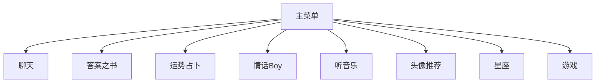
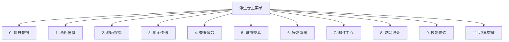

# 用户手册

<cite>
**本文档引用的文件**  
- [Life_User_Manual.md](file://Life_User_Manual.md)
- [MainMenuPrinter.java](file://Base/src/main/java/com/bot/base/chain/menu/MainMenuPrinter.java)
- [LifeHandlerImpl.java](file://Life/src/main/java/com/bot/life/service/impl/LifeHandlerImpl.java)
- [ChatMenuPrinter.java](file://Base/src/main/java/com/bot/base/chain/menu/ChatMenuPrinter.java)
- [GameMenuPrinter.java](file://Base/src/main/java/com/bot/base/chain/menu/GameMenuPrinter.java)
- [SweetMenuPrinter.java](file://Base/src/main/java/com/bot/base/chain/menu/SweetMenuPrinter.java)
- [LuckMenuPrinter.java](file://Base/src/main/java/com/bot/base/chain/menu/LuckMenuPrinter.java)
- [AnswerMenuPrinter.java](file://Base/src/main/java/com/bot/base/chain/menu/AnswerMenuPrinter.java)
- [CloudMusicMenuPrinter.java](file://Base/src/main/java/com/bot/base/chain/menu/CloudMusicMenuPrinter.java)
- [PhotoMenuPrinter.java](file://Base/src/main/java/com/bot/base/chain/menu/PhotoMenuPrinter.java)
- [ConstellationMenuPrinter.java](file://Base/src/main/java/com/bot/base/chain/menu/ConstellationMenuPrinter.java)
- [BaseConsts.java](file://Common/src/main/java/com/bot/common/constant/BaseConsts.java)
</cite>

## 目录
1. [简介](#简介)
2. [主菜单系统](#主菜单系统)
3. [浮生卷游戏玩法](#浮生卷游戏玩法)
4. [其他功能菜单](#其他功能菜单)
5. [用户指南](#用户指南)
6. [高级技巧](#高级技巧)

## 简介

本用户手册为Bot项目提供完整的使用说明，重点介绍如何通过QQ指令与机器人交互。文档基于`Life_User_Manual.md`的内容，详细描述了菜单系统的使用方法和游戏玩法。通过分析`MainMenuPrinter.java`和`LifeHandlerImpl.java`中的业务逻辑，为不同类型的用户提供定制化指南。

**Section sources**
- [Life_User_Manual.md](file://Life_User_Manual.md#L1-L257)

## 主菜单系统

主菜单系统是用户与机器人交互的核心入口。通过`MainMenuPrinter.java`文件的分析，主菜单包含多个子菜单选项，每个选项对应不同的功能模块。

**Diagram sources**
- [MainMenuPrinter.java](file://Base/src/main/java/com/bot/base/chain/menu/MainMenuPrinter.java#L1-L38)

**Section sources**
- [MainMenuPrinter.java](file://Base/src/main/java/com/bot/base/chain/menu/MainMenuPrinter.java#L1-L38)
- [BaseConsts.java](file://Common/src/main/java/com/bot/common/constant/BaseConsts.java#L18-L46)

## 浮生卷游戏玩法

浮生卷是一个修仙主题的文字RPG游戏，集成在聊天机器人中。玩家通过文字指令进行游戏，所有游戏界面以图片形式展示。

### 游戏入口

在聊天中发送`浮生卷`即可进入游戏模式。游戏会显示欢迎界面，然后：
- 发送`1`正式进入游戏
- 发送其他内容取消进入

### 角色创建

首次进入游戏需要创建角色，格式为：`昵称-派系`。例如：`张三-金`。

**昵称要求：**
- 只能包含中文字符
- 不超过7个字
- 不能与其他玩家重复

**派系选择：**

| 派系 | 特色 | 攻击力 | 防御力 | 养成难度 |
|------|------|--------|--------|----------|
| 金 | 强大破坏力，一力破万法 | ★★★★★ | ★★ | ★★★★ |
| 木 | 强大恢复能力，治疗用毒 | ★★★ | ★★★★ | ★★★ |
| 水 | 包容万物，各领域涉及 | ★★★★ | ★★★★ | ★★★★ |
| 火 | 持续伤害，可观爆发力 | ★★★★ | ★★★ | ★★★ |
| 土 | 超强防御，不俗控制力 | ★★★ | ★★★★★ | ★★★★★ |

### 主菜单功能

进入游戏后可选择以下操作（发送对应数字）：

**Diagram sources**
- [LifeHandlerImpl.java](file://Life/src/main/java/com/bot/life/service/impl/LifeHandlerImpl.java#L407-L422)

**Section sources**
- [Life_User_Manual.md](file://Life_User_Manual.md#L85-L96)
- [LifeHandlerImpl.java](file://Life/src/main/java/com/bot/life/service/impl/LifeHandlerImpl.java#L148-L471)

## 其他功能菜单

除了浮生卷游戏，机器人还提供多种其他功能菜单。

### 聊天功能

通过`ChatMenuPrinter.java`实现，用户可以与机器人进行日常聊天。发送包含"聊天"关键词的消息即可触发此功能。

### 答案之书

通过`AnswerMenuPrinter.java`实现，为了不与正常聊天冲突，只有包含"请问"才会触发答案之书的回答。例如：
- "请问我应该吃包子吗？"
- "请问为什么我这么好看呢？"

### 运势占卜

通过`LuckMenuPrinter.java`实现，用户可以通过"占卜"、"运势"等关键字来触发运势占卜。此功能纯属娱乐，不可作为任何行为、事件的凭证。

### 情话Boy

通过`SweetMenuPrinter.java`实现，发送的内容中包含"情话"，即可让机器人化身情话Boy。

### 听音乐

通过`CloudMusicMenuPrinter.java`实现，机器人会随机从网易云音乐的排行榜上发送一首歌。支持的排行榜包括：热歌榜、新歌榜、飙升榜、抖音榜、电音榜。

### 头像推荐

通过`PhotoMenuPrinter.java`实现，用户可以通过发送"头像"、"男头"、"女头"来获取头像推荐。

### 星座查询

通过`ConstellationMenuPrinter.java`实现，机器人可以查询星座运势，包括亲近星座、幸运色、健康、爱情、工作、金钱、综合运势等信息。

**Section sources**
- [ChatMenuPrinter.java](file://Base/src/main/java/com/bot/base/chain/menu/ChatMenuPrinter.java#L1-L21)
- [AnswerMenuPrinter.java](file://Base/src/main/java/com/bot/base/chain/menu/AnswerMenuPrinter.java#L1-L24)
- [LuckMenuPrinter.java](file://Base/src/main/java/com/bot/base/chain/menu/LuckMenuPrinter.java#L1-L25)
- [SweetMenuPrinter.java](file://Base/src/main/java/com/bot/base/chain/menu/SweetMenuPrinter.java#L1-L25)
- [CloudMusicMenuPrinter.java](file://Base/src/main/java/com/bot/base/chain/menu/CloudMusicMenuPrinter.java#L1-L26)
- [PhotoMenuPrinter.java](file://Base/src/main/java/com/bot/base/chain/menu/PhotoMenuPrinter.java#L1-L20)
- [ConstellationMenuPrinter.java](file://Base/src/main/java/com/bot/base/chain/menu/ConstellationMenuPrinter.java#L1-L20)

## 用户指南

### 新手入门

1. **进入游戏**：在聊天中发送`浮生卷`进入游戏模式
2. **创建角色**：按照`昵称-派系`的格式创建角色
3. **了解主菜单**：熟悉主菜单的各项功能
4. **开始探索**：使用"游历探索"功能开始游戏

### 日常玩法

1. **每日签到**：每天登录游戏进行签到，获取奖励
2. **属性提升**：通过战斗和使用道具提升角色属性
3. **地图探索**：使用"地图传送"功能前往不同地图
4. **背包管理**：定期检查和管理背包中的道具
5. **社交互动**：添加好友，互发邮件，参与组队

### 退出游戏

在游戏模式中随时发送`退出`即可退出游戏模式，返回正常聊天状态。

**Section sources**
- [Life_User_Manual.md](file://Life_User_Manual.md#L9-L20)
- [LifeHandlerImpl.java](file://Life/src/main/java/com/bot/life/service/impl/LifeHandlerImpl.java#L129-L144)

## 高级技巧

### 战斗系统

**战斗行动**：
1. **普通攻击** - 基础攻击
2. **使用技能** - 消耗神通
3. **防御** - 减少50%受到伤害
4. **使用道具** - 使用恢复类道具
5. **逃跑** - 尝试逃离战斗

**伤害计算**：
- 普通攻击伤害 = 攻击力 × 倍率 - 防御 × (1 - 破防率)
- 会心时伤害 × 会心效果
- 破防率最高30%
- 最少造成1点伤害

**逃跑机制**：
- 速度≥对方：必定成功
- 速度<对方：基础成功率50%，每低10点速度-2%成功率

### 装备系统

**装备类型**：
1. **功法**（1件）- 提供修炼速度加成
2. **心法**（3件）- 提供基础属性加成
3. **神通**（3个）- 战斗中可使用的技能
4. **法宝**（1件）- 按百分比增加战斗属性

**装备限制**：
有属性装备只能由相同属性角色装备，无属性装备所有人都能用。

### 社交系统

**好友系统**：
- 通过昵称搜索添加好友
- 需要对方同意
- 可互发邮件

**邮件系统**：
- 包含主题、内容、附件
- 附件可以是任意道具
- 不能发送灵粹

**Section sources**
- [Life_User_Manual.md](file://Life_User_Manual.md#L97-L202)