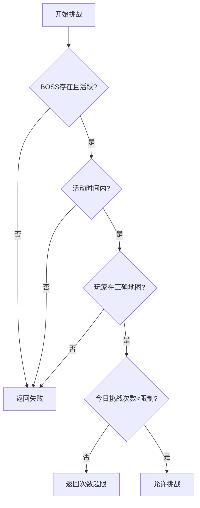
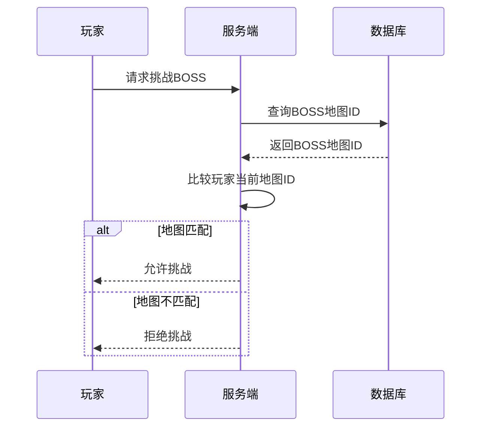
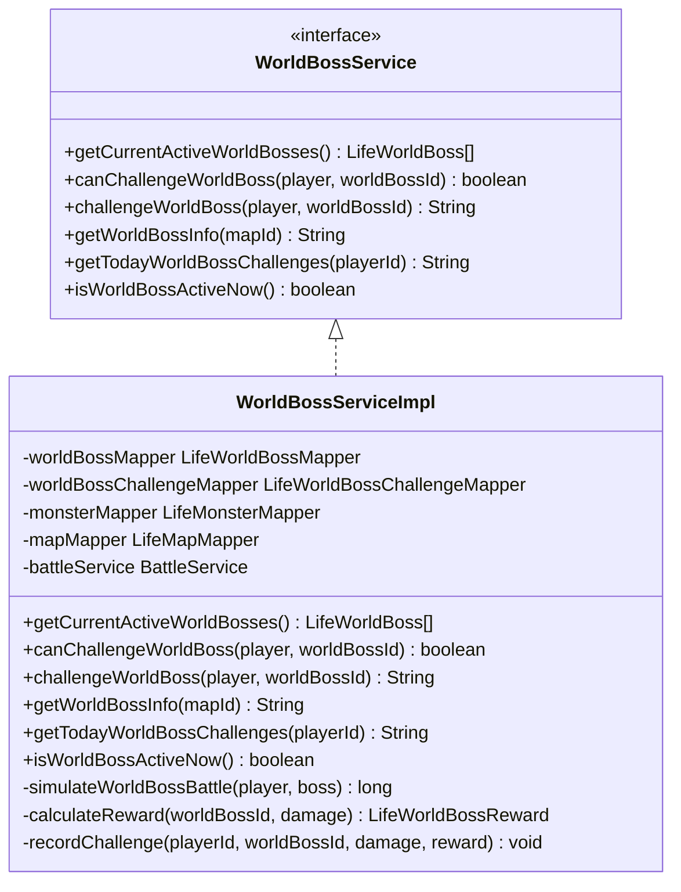
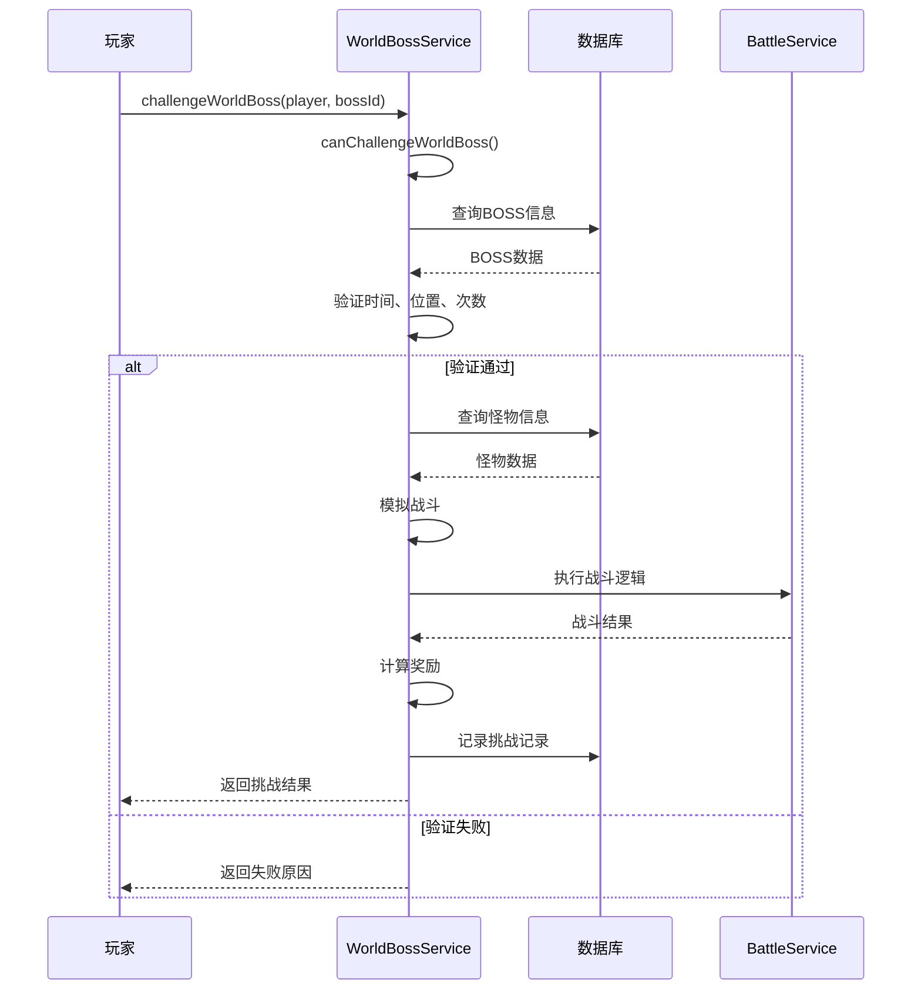
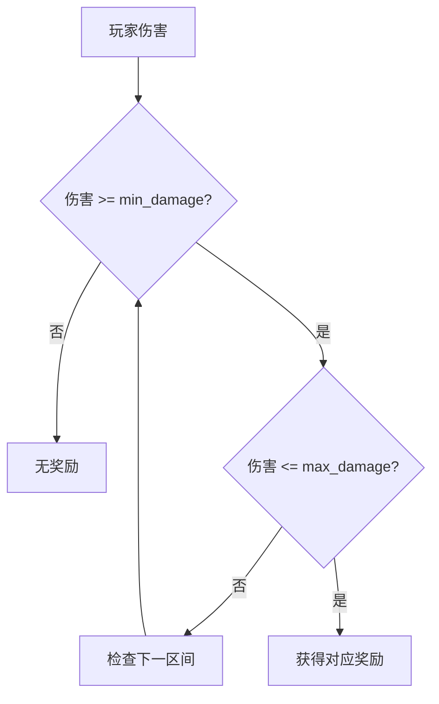

# 世界BOSS出现机制

<cite>
**本文档引用的文件**
- [WorldBossServiceImpl.java](file://Life/src/main/java/com/bot/life/service/impl/WorldBossServiceImpl.java)
- [GameConsts.java](file://Common/src/main/java/com/bot/common/constant/GameConsts.java)
- [LifeWorldBoss.java](file://Life/src/main/java/com/bot/life/dao/entity/LifeWorldBoss.java)
- [LifeWorldBossChallenge.java](file://Life/src/main/java/com/bot/life/dao/entity/LifeWorldBossChallenge.java)
- [LifeWorldBossMapper.xml](file://Life/src/main/resources/mapper/LifeWorldBossMapper.xml)
- [LifeWorldBossChallengeMapper.xml](file://Life/src/main/resources/mapper/LifeWorldBossChallengeMapper.xml)
- [WorldBossService.java](file://Life/src/main/java/com/bot/life/service/WorldBossService.java)
- [Life_Database_Init.sql](file://Life_Database_Init.sql)
</cite>

## 目录
1. [概述](#概述)
2. [世界BOSS活动时间规则](#世界BOSS活动时间规则)
3. [挑战条件详解](#挑战条件详解)
4. [挑战次数限制机制](#挑战次数限制机制)
5. [位置验证逻辑](#位置验证逻辑)
6. [数据库结构分析](#数据库结构分析)
7. [核心业务流程](#核心业务流程)
8. [技术实现细节](#技术实现细节)
9. [玩家指南](#玩家指南)
10. [故障排除](#故障排除)

## 概述

世界BOSS是游戏中重要的PVE玩法之一，具有严格的活动时间和挑战条件。本机制确保玩家在特定时间段内才能参与挑战，并要求玩家位于正确的地图区域。每次挑战都会消耗一定的体力值，且每日有挑战次数限制。

## 世界BOSS活动时间规则

### 活动时间段设定

世界BOSS采用固定的时间段开放机制，每天有两个活动窗口：

```mermaid
gantt
title 世界BOSS活动时间安排
dateFormat HH:mm
axisFormat %H:%M
section 活动窗口
上午活动期 :active1, 11:00, 12:00
下午活动期 :active2, 19:00, 20:00
```



**图表来源**
- [WorldBossServiceImpl.java](file://Life/src/main/java/com/bot/life/service/impl/WorldBossServiceImpl.java#L184-L191)

### 时间验证逻辑

系统通过LocalTime类进行精确的时间判断：

| 时间段 | 开始时间 | 结束时间 | 活动状态 |
|--------|----------|----------|----------|
| 上午 | 11:00 | 12:00 | 活跃 |
| 下午 | 19:00 | 20:00 | 活跃 |
| 其他时间 | - | - | 非活跃 |

**节来源**
- [WorldBossServiceImpl.java](file://Life/src/main/java/com/bot/life/service/impl/WorldBossServiceImpl.java#L181-L192)

## 挑战条件详解

### 条件检查流程

挑战世界BOSS需要满足以下四个核心条件：



**图表来源**
- [WorldBossServiceImpl.java](file://Life/src/main/java/com/bot/life/service/impl/WorldBossServiceImpl.java#L54-L74)

### 具体验证步骤

1. **BOSS存在性验证**：检查世界BOSS是否存在于数据库中且处于活跃状态
2. **时间范围验证**：确认当前时间在11:00-12:00或19:00-20:00之间
3. **地图位置验证**：确保玩家当前所在地图与BOSS所在地图一致
4. **挑战次数验证**：检查玩家当日对该BOSS的挑战次数是否超过限制

**节来源**
- [WorldBossServiceImpl.java](file://Life/src/main/java/com/bot/life/service/impl/WorldBossServiceImpl.java#L55-L74)

## 挑战次数限制机制

### 限制规则

每个世界BOSS都有独立的每日挑战次数限制，这个限制由数据库中的`max_challenge_count`字段控制。

### 次数统计方式

系统通过以下SQL查询统计玩家当日挑战次数：

```sql
SELECT COUNT(*) 
FROM life_world_boss_challenge 
WHERE player_id = #{playerId} 
  AND world_boss_id = #{worldBossId}
  AND DATE(challenge_time) = CURDATE()
```

**图表来源**
- [LifeWorldBossChallengeMapper.xml](file://Life/src/main/resources/mapper/LifeWorldBossChallengeMapper.xml#L27-L32)

### 挑战记录存储

每次挑战完成后，系统会记录以下信息：
- 玩家ID
- BOSS ID
- 造成的伤害值
- 获得的灵粹奖励
- 获得的道具奖励
- 挑战时间戳

**节来源**
- [LifeWorldBossChallenge.java](file://Life/src/main/java/com/bot/life/dao/entity/LifeWorldBossChallenge.java#L1-L24)

## 位置验证逻辑

### 地图匹配机制

世界BOSS的位置验证基于地图ID匹配：



**图表来源**
- [WorldBossServiceImpl.java](file://Life/src/main/java/com/bot/life/service/impl/WorldBossServiceImpl.java#L67-L69)

### 地图关联设计

每个世界BOSS实体包含以下关键字段：
- `mapId`: BOSS所在地图的唯一标识
- `monsterId`: 对应的怪物实体ID
- `isActive`: BOSS活跃状态标志

**节来源**
- [LifeWorldBoss.java](file://Life/src/main/java/com/bot/life/dao/entity/LifeWorldBoss.java#L1-L24)

## 数据库结构分析

### 主要数据表

#### 世界BOSS表 (life_world_boss)

| 字段名 | 类型 | 描述 | 约束 |
|--------|------|------|------|
| id | BIGINT | 主键ID | PRIMARY KEY |
| monster_id | BIGINT | 怪物ID | FOREIGN KEY |
| map_id | BIGINT | 地图ID | FOREIGN KEY |
| start_time | TIME | 开始时间 | NOT NULL |
| end_time | TIME | 结束时间 | NOT NULL |
| max_challenge_count | INTEGER | 最大挑战次数 | NOT NULL |
| is_active | INTEGER | 是否活跃 | NOT NULL |

#### 世界BOSS挑战记录表 (life_world_boss_challenge)

| 字段名 | 类型 | 描述 | 约束 |
|--------|------|------|------|
| id | BIGINT | 主键ID | PRIMARY KEY |
| player_id | BIGINT | 玩家ID | FOREIGN KEY |
| world_boss_id | BIGINT | BOSS ID | FOREIGN KEY |
| damage_dealt | BIGINT | 造成伤害 | NOT NULL |
| spirit_reward | INTEGER | 灵粹奖励 | DEFAULT 0 |
| item_rewards | TEXT | 道具奖励(JSON) | |
| challenge_time | TIMESTAMP | 挑战时间 | NOT NULL |

**节来源**
- [Life_Database_Init.sql](file://Life_Database_Init.sql#L288-L318)

## 核心业务流程

### 世界BOSS服务接口



**图表来源**
- [WorldBossService.java](file://Life/src/main/java/com/bot/life/service/WorldBossService.java#L1-L55)
- [WorldBossServiceImpl.java](file://Life/src/main/java/com/bot/life/service/impl/WorldBossServiceImpl.java#L18-L287)

### 挑战执行流程



**图表来源**
- [WorldBossServiceImpl.java](file://Life/src/main/java/com/bot/life/service/impl/WorldBossServiceImpl.java#L77-L118)

## 技术实现细节

### 时间判断算法

系统使用LocalTime类进行精确的时间比较：

```java
// 时间判断逻辑示例
LocalTime now = LocalTime.now();
LocalTime morning1 = LocalTime.of(11, 0);
LocalTime morning2 = LocalTime.of(12, 0);
LocalTime evening1 = LocalTime.of(19, 0);
LocalTime evening2 = LocalTime.of(20, 0);

return (now.isAfter(morning1) && now.isBefore(morning2)) ||
       (now.isAfter(evening1) && now.isBefore(evening2));
```

**节来源**
- [WorldBossServiceImpl.java](file://Life/src/main/java/com/bot/life/service/impl/WorldBossServiceImpl.java#L181-L192)

### 战斗模拟机制

世界BOSS战斗采用简化的模拟算法：

1. **基础伤害计算**：基于玩家攻击力和属性加成
2. **属性克制**：根据五行相克关系调整伤害倍率
3. **暴击判定**：基于玩家暴击率和暴击伤害
4. **随机波动**：±20%的随机伤害调整

**节来源**
- [WorldBossServiceImpl.java](file://Life/src/main/java/com/bot/life/service/impl/WorldBossServiceImpl.java#L194-L225)

### 奖励分配系统

奖励基于玩家造成的伤害值区间确定：



**图表来源**
- [WorldBossServiceImpl.java](file://Life/src/main/java/com/bot/life/service/impl/WorldBossServiceImpl.java#L241-L251)

## 玩家指南

### 参与时机

1. **关注活动时间**：每日11:00-12:00和19:00-20:00
2. **准备充足体力**：每次挑战消耗一定体力值
3. **确保位置正确**：必须在BOSS所在的地图区域

### 挑战策略

1. **属性优势**：选择属性克制BOSS的幻灵
2. **装备优化**：提升攻击力和暴击能力
3. **团队协作**：多人组队提高挑战成功率

### 查看信息

玩家可以通过以下方式获取BOSS信息：
- 发送"世界BOSS"查看当前地图的BOSS状态
- 查看BOSS名称、等级、血量和可挑战次数
- 了解活动时间提醒

**节来源**
- [WorldBossServiceImpl.java](file://Life/src/main/java/com/bot/life/service/impl/WorldBossServiceImpl.java#L122-L149)

## 故障排除

### 常见问题及解决方案

#### 问题1：无法挑战BOSS
**症状**：收到"无法挑战该世界BOSS"提示
**原因**：
- 不在活动时间内
- 玩家不在正确地图
- 已达到当日挑战次数限制

**解决方法**：
1. 检查当前时间是否在11:00-12:00或19:00-20:00
2. 确认玩家所在地图与BOSS地图一致
3. 查看今日挑战记录，等待次日重置

#### 问题2：BOSS信息显示异常
**症状**：无法看到BOSS信息或显示错误
**原因**：
- BOSS数据库配置错误
- 网络连接问题
- 缓存数据过期

**解决方法**：
1. 检查BOSS是否设置为活跃状态
2. 验证地图ID配置正确性
3. 清除客户端缓存重新加载

#### 问题3：挑战记录丢失
**症状**：挑战后未记录挑战次数
**原因**：
- 数据库插入失败
- 异常中断导致事务未提交
- 时间同步问题

**解决方法**：
1. 检查数据库连接状态
2. 验证挑战记录插入语句
3. 确保系统时间准确

**节来源**
- [WorldBossServiceImpl.java](file://Life/src/main/java/com/bot/life/service/impl/WorldBossServiceImpl.java#L78-L80)

### 监控指标

系统提供以下监控指标：
- 当前活跃BOSS数量
- 玩家当日挑战次数
- BOSS击杀率统计
- 挑战成功率分析

这些指标有助于运营人员了解BOSS玩法的活跃度和玩家参与情况。