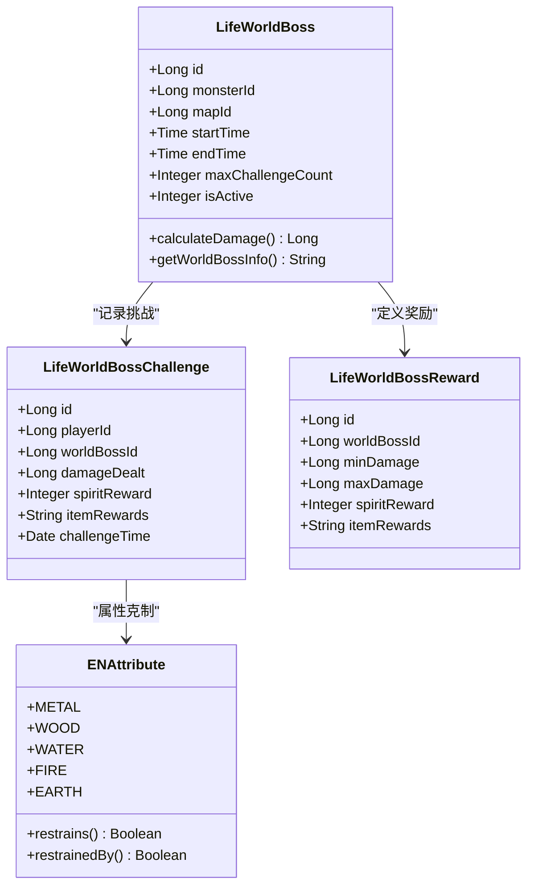
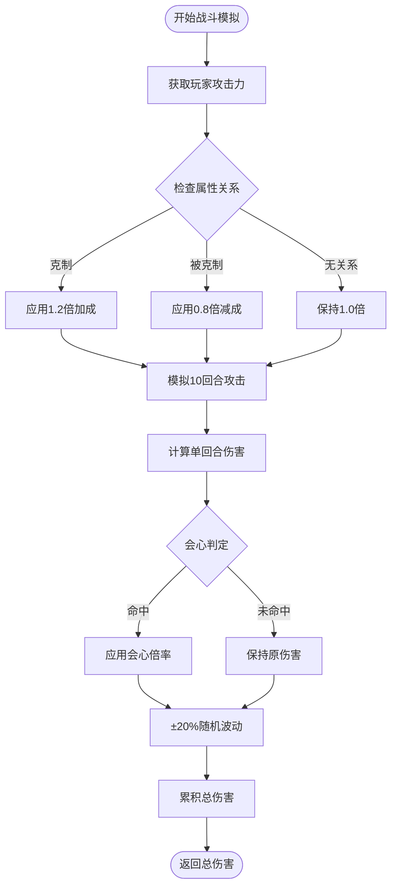
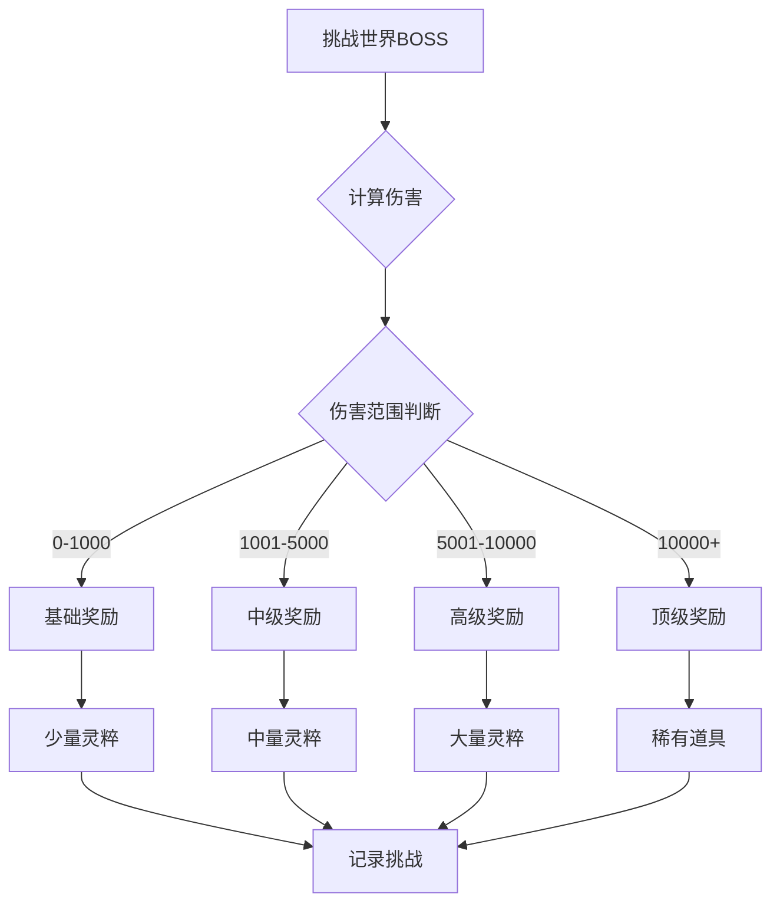
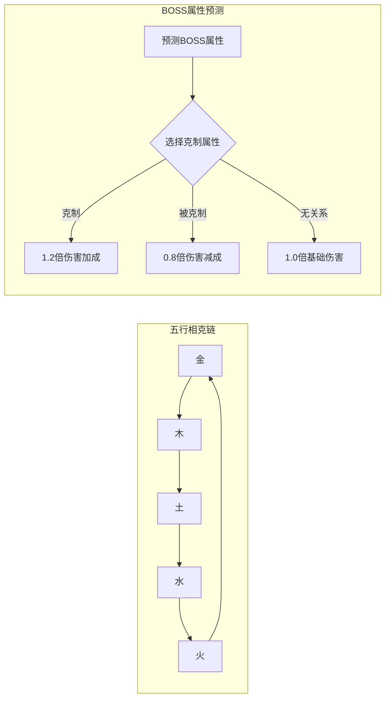
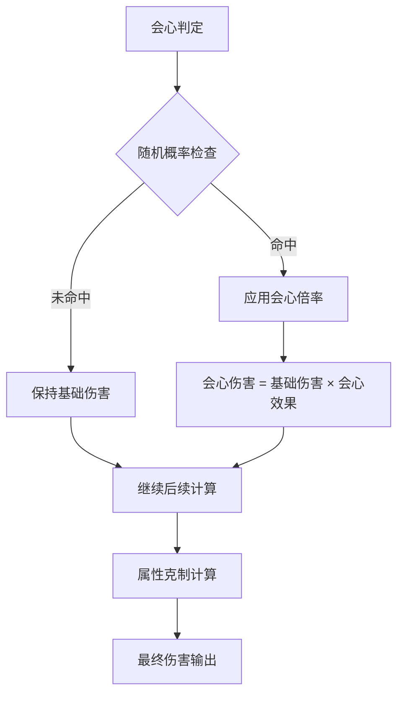
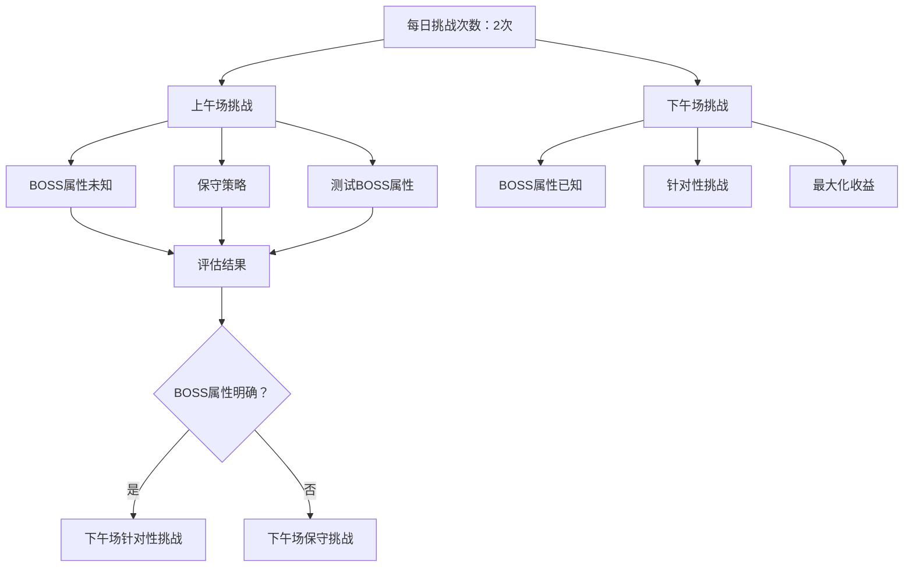

# 世界BOSS挑战策略

<cite>
**本文档引用的文件**
- [Life_User_Manual.md](file://Life_User_Manual.md)
- [LifeHandlerImpl.java](file://Life\src\main\java\com\bot\life\service\impl\LifeHandlerImpl.java)
- [WorldBossServiceImpl.java](file://Life\src\main\java\com\bot\life\service\impl\WorldBossServiceImpl.java)
- [BattleServiceImpl.java](file://Life\src\main\java\com\bot\life\service\impl\BattleServiceImpl.java)
- [LifeWorldBoss.java](file://Life\src\main\java\com\bot\life\dao\entity\LifeWorldBoss.java)
- [LifeWorldBossChallenge.java](file://Life\src\main\java\com\bot\life\dao\entity\LifeWorldBossChallenge.java)
- [LifeWorldBossReward.java](file://Life\src\main\java\com\bot\life\dao\entity\LifeWorldBossReward.java)
- [ENAttribute.java](file://Life\src\main\java\com\bot\life\enums\ENAttribute.java)
- [GameConsts.java](file://Common\src\main\java\com\bot\common\constant\GameConsts.java)
</cite>

## 目录
1. [世界BOSS概述](#世界boss概述)
2. [出现机制与活动时间](#出现机制与活动时间)
3. [伤害计算规则](#伤害计算规则)
4. [奖励分配策略](#奖励分配策略)
5. [最佳战斗时机选择](#最佳战斗时机选择)
6. [属性搭配建议](#属性搭配建议)
7. [伤害最大化技巧](#伤害最大化技巧)
8. [挑战次数优化策略](#挑战次数优化策略)
9. [实战案例分析](#实战案例分析)
10. [常见问题解答](#常见问题解答)

## 世界BOSS概述

世界BOSS是浮生卷游戏中的重要高级玩法，具有以下特点：

### 核心特性
- **全服挑战**：所有玩家都可以参与挑战
- **伤害分段奖励**：根据造成的伤害量获得不同档次的奖励
- **限定挑战次数**：每位玩家每天有固定的挑战次数限制
- **属性克制系统**：存在五行相克关系影响战斗效果

### BOSS基本信息
世界BOSS系统包含以下核心实体：



**图表来源**
- [LifeWorldBoss.java](file://Life\src\main\java\com\bot\life\dao\entity\LifeWorldBoss.java#L11-L24)
- [LifeWorldBossChallenge.java](file://Life\src\main\java\com\bot\life\dao\entity\LifeWorldBossChallenge.java#L11-L24)
- [LifeWorldBossReward.java](file://Life\src\main\java\com\bot\life\dao\entity\LifeWorldBossReward.java#L9-L17)
- [ENAttribute.java](file://Life\src\main\java\com\bot\life\enums\ENAttribute.java#L7-L13)

**章节来源**
- [Life_User_Manual.md](file://Life_User_Manual.md#L204-L209)

## 出现机制与活动时间

### 活动时间安排
世界BOSS采用固定时间段活动机制：

```mermaid
gantt
title 世界BOSS活动时间表
dateFormat HH:mm
axisFormat %H:%M
section 活动时段
上午活动 :active, morning1, 11:00, 12:00
下午活动 :active, evening1, 19:00, 20:00
section 日常维护
休息时段 :milestone, rest1, 12:00, 19:00
```



**图表来源**
- [WorldBossServiceImpl.java](file://Life\src\main\java\com\bot\life\service\impl\WorldBossServiceImpl.java#L184-L191)

### 活动检测机制
系统通过时间判断确定BOSS是否处于活动状态：

| 时间段 | 活动状态 | 可挑战性 |
|--------|----------|----------|
| 11:00-12:00 | 上午活动期 | 可挑战 |
| 12:00-19:00 | 休息期 | 不可挑战 |
| 19:00-20:00 | 下午活动期 | 可挑战 |
| 20:00-次日11:00 | 休息期 | 不可挑战 |

**章节来源**
- [WorldBossServiceImpl.java](file://Life\src\main\java\com\bot\life\service\impl\WorldBossServiceImpl.java#L181-L192)

## 伤害计算规则

### 基础伤害公式
世界BOSS战斗采用简化的伤害计算模型：

```
基础伤害 = 玩家攻击力 × 属性加成系数 × 会心倍率 × 随机波动
```

### 伤害计算流程



**图表来源**
- [WorldBossServiceImpl.java](file://Life\src\main\java\com\bot\life\service\impl\WorldBossServiceImpl.java#L194-L224)

### 属性克制关系
五行相克系统对伤害产生显著影响：

| 攻击属性 | 克制属性 | 被克制属性 | 加成效果 |
|----------|----------|------------|----------|
| 金 | 木 | 土 | +20%伤害 |
| 木 | 土 | 金 | +20%伤害 |
| 土 | 水 | 木 | +20%伤害 |
| 水 | 火 | 土 | +20%伤害 |
| 火 | 金 | 水 | +20%伤害 |

**章节来源**
- [WorldBossServiceImpl.java](file://Life\src\main\java\com\bot\life\service\impl\WorldBossServiceImpl.java#L227-L235)
- [ENAttribute.java](file://Life\src\main\java\com\bot\life\enums\ENAttribute.java#L45-L63)

## 奖励分配策略

### 奖励机制设计
世界BOSS采用分段奖励系统，根据造成的伤害量分配不同档次的奖励：



**图表来源**
- [WorldBossServiceImpl.java](file://Life\src\main\java\com\bot\life\service\impl\WorldBossServiceImpl.java#L241-L251)

### 奖励计算逻辑
系统根据伤害范围匹配对应的奖励配置：

```java
// 奖励匹配算法（伪代码）
for (LifeWorldBossReward reward : rewards) {
    if (damage >= reward.getMinDamage() && damage <= reward.getMaxDamage()) {
        return reward; // 返回匹配的奖励
    }
}
```

### 挑战记录管理
每次挑战都会记录详细信息：

| 字段 | 类型 | 描述 |
|------|------|------|
| playerId | Long | 玩家ID |
| worldBossId | Long | BOSS ID |
| damageDealt | Long | 造成的伤害 |
| spiritReward | Integer | 灵粹奖励数量 |
| itemRewards | String | 道具奖励（JSON格式） |
| challengeTime | Date | 挑战时间 |

**章节来源**
- [LifeWorldBossChallenge.java](file://Life\src\main\java\com\bot\life\dao\entity\LifeWorldBossChallenge.java#L13-L19)

## 最佳战斗时机选择

### 时间窗口分析
根据活动时间表，最佳挑战时机为：

```mermaid
timeline
title 世界BOSS挑战时间规划
section 早晨准备
09:00-10:00 : 属性调整
: 装备检查
: 体力恢复
section 上午挑战
11:00-12:00 : 世界BOSS活动
: 高效挑战黄金期
section 下午准备
12:00-18:00 : 休息调整
: 战术复盘
section 下午挑战
19:00-20:00 : 世界BOSS活动
: 第二轮挑战
section 晚间总结
20:00-23:00 : 挑战回顾
: 策略优化
```

### 体力管理策略
- **早晨挑战前**：确保体力充足（100点）
- **上午活动**：利用第一个小时的高效率
- **下午活动**：作为补充挑战机会
- **挑战间隔**：合理安排两次挑战之间的休息

### 挑战次数规划
每位玩家每天最多可挑战世界BOSS：
- **上午场**：最多1次
- **下午场**：最多1次
- **总计**：每天最多2次挑战机会

**章节来源**
- [WorldBossServiceImpl.java](file://Life\src\main\java\com\bot\life\service\impl\WorldBossServiceImpl.java#L181-L192)

## 属性搭配建议

### 派系优势分析

| 派系 | 攻击力 | 防御力 | 养成难度 | BOSS挑战优势 |
|------|--------|--------|----------|--------------|
| 金 | ★★★★★ | ★★ | ★★★★ | 高爆发伤害，克制木系BOSS |
| 木 | ★★★ | ★★★★ | ★★★ | 恢复能力强，适合持久战 |
| 水 | ★★★★ | ★★★★ | ★★★★ | 属性均衡，适应性强 |
| 火 | ★★★★ | ★★★ | ★★★ | 持续伤害输出，爆发力强 |
| 土 | ★★★ | ★★★★★ | ★★★★★ | 防御厚实，生存能力强 |

### 属性克制策略



**图表来源**
- [ENAttribute.java](file://Life\src\main\java\com\bot\life\enums\ENAttribute.java#L45-L63)

### 推荐属性组合

#### 金系玩家（高爆发）
- **优势**：攻击力最高，会心率优秀
- **推荐策略**：优先选择木系BOSS，追求高伤害输出
- **注意事项**：注意会心率和会心效果的平衡

#### 火系玩家（持续输出）
- **优势**：爆发力强，持续伤害稳定
- **推荐策略**：适合各种BOSS，尤其克制土系
- **注意事项**：保持稳定的伤害输出节奏

#### 水系玩家（全能型）
- **优势**：属性均衡，适应性强
- **推荐策略**：作为通用选择，适合不确定BOSS属性时
- **注意事项**：在特定克制关系下发挥最大优势

**章节来源**
- [Life_User_Manual.md](file://Life_User_Manual.md#L34-L41)

## 伤害最大化技巧

### 基础属性优化

#### 速度属性（决定出手顺序）
- **作用**：影响战斗出手顺序，同时提升破防能力
- **计算公式**：每1点速度 → 破防+0.005%
- **优化建议**：优先提升速度，确保先手优势

#### 体质属性（影响生存能力）
- **作用**：增加血量和防御力
- **计算公式**：每1点体质 → 血量+10，防御+1
- **优化建议**：保持合理的体质水平，确保生存能力

#### 灵力属性（影响会心系统）
- **作用**：提升会心率和会心效果
- **计算公式**：每1点灵力 → 会心+0.01%，会心效果+0.005%
- **优化建议**：根据战斗风格选择性提升

#### 力量属性（直接影响伤害）
- **作用**：提升攻击力和破防能力
- **计算公式**：每1点力量 → 攻击力+6，破防+0.01%
- **优化建议**：主要提升方向，直接影响伤害输出

### 会心系统优化



**图表来源**
- [BattleServiceImpl.java](file://Life\src\main\java\com\bot\life\service\impl\BattleServiceImpl.java#L149-L162)

### 破防系统应用
- **破防上限**：30%（最高可无视30%防御）
- **计算方法**：攻击力 × (1 - 破防率)
- **优化重点**：通过力量属性和速度属性提升破防能力

### 随机波动利用
- **波动范围**：±20%
- **利用策略**：多次挑战积累平均值
- **心理准备**：接受合理的伤害波动

**章节来源**
- [BattleServiceImpl.java](file://Life\src\main\java\com\bot\life\service\impl\BattleServiceImpl.java#L149-L162)
- [Life_User_Manual.md](file://Life_User_Manual.md#L46-L64)

## 挑战次数优化策略

### 挑战次数分配原则



### 挑战策略矩阵

| 挑战阶段 | BOSS属性状态 | 推荐策略 | 风险等级 | 收益预期 |
|----------|--------------|----------|----------|----------|
| 第一次挑战 | 未知 | 保守输出，观察BOSS反应 | 低 | 中等 |
| 第二次挑战 | 已知属性 | 针对性强化，追求高伤害 | 中 | 高 |
| 第三次挑战 | 已知属性 | 极限输出，争取最高奖励 | 高 | 极高 |

### 挑战记录分析
系统会记录每次挑战的详细信息，便于策略调整：

```java
// 挑战记录示例（伪代码）
public String getTodayWorldBossChallenges(Long playerId) {
    List<LifeWorldBossChallenge> challenges = 
        worldBossChallengeMapper.findByPlayerIdAndToday(playerId);
    
    StringBuilder record = new StringBuilder();
    for (LifeWorldBossChallenge challenge : challenges) {
        record.append("BOSS ID: ").append(challenge.getWorldBossId())
              .append(", 伤害: ").append(challenge.getDamageDealt())
              .append(", 奖励: ").append(challenge.getSpiritReward())
              .append("\n");
    }
    return record.toString();
}
```

### 策略调整建议
- **首次挑战**：以获取BOSS属性信息为主
- **第二次挑战**：根据第一次结果调整策略
- **长期规划**：建立个人BOSS挑战数据库

**章节来源**
- [WorldBossServiceImpl.java](file://Life\src\main\java\com\bot\life\service\impl\WorldBossServiceImpl.java#L155-L177)

## 实战案例分析

### 案例一：金系玩家上午挑战
**背景信息**：
- 玩家属性：金系，攻击力1000，会心率5%，会心效果150%
- BOSS属性：木系（克制关系）
- 挑战时间：11:15

**战斗过程**：
1. **属性加成**：1.2倍伤害加成
2. **会心判定**：5%概率，期望会心效果150%
3. **随机波动**：±20%波动范围
4. **总伤害计算**：约1200-1600点伤害

**结果分析**：
- 由于克制关系，实际伤害可能达到1500+点
- 有机会获得高级奖励
- 为下午场挑战提供BOSS属性参考

### 案例二：火系玩家下午挑战
**背景信息**：
- 玩家属性：火系，攻击力800，会心率8%，会心效果140%
- BOSS属性：已知为土系（被克制）
- 挑战时间：19:30

**战斗过程**：
1. **属性减成**：0.8倍伤害减成
2. **会心判定**：8%概率，期望会心效果140%
3. **随机波动**：±20%波动范围
4. **总伤害计算**：约640-860点伤害

**结果分析**：
- 被克制属性导致伤害大幅下降
- 需要更高的会心率和攻击力补偿
- 可能获得基础奖励而非高级奖励

### 案例三：水系玩家通用挑战
**背景信息**：
- 玩家属性：水系，攻击力900，会心率6%，会心效果145%
- BOSS属性：未知
- 挑战时间：11:45

**战斗过程**：
1. **无属性加成**：1.0倍基础伤害
2. **会心判定**：6%概率，期望会心效果145%
3. **随机波动**：±20%波动范围
4. **总伤害计算**：约900-1200点伤害

**结果分析**：
- 作为通用选择，适应性强
- 在BOSS属性未知时的最佳策略
- 为后续挑战提供重要信息

## 常见问题解答

### Q1: 世界BOSS什么时候出现？
**A**: 世界BOSS每天有两个活动时间段：
- 上午：11:00-12:00
- 下午：19:00-20:00
在这两个时间段之外无法挑战世界BOSS。

### Q2: 我每天可以挑战几次世界BOSS？
**A**: 每位玩家每天最多可以挑战世界BOSS2次：
- 上午场：最多1次
- 下午场：最多1次

### Q3: 如何知道BOSS的属性？
**A**: 第一次挑战世界BOSS时，系统会显示BOSS的属性信息。之后可以通过查看挑战记录了解BOSS属性。

### Q4: 属性克制对伤害有多大影响？
**A**: 属性克制会产生20%的伤害加成，被克制则会有20%的伤害减成。这对总伤害有显著影响。

### Q5: 如何最大化我的世界BOSS收益？
**A**: 最佳策略是：
1. 第一次挑战获取BOSS属性信息
2. 根据BOSS属性选择相应的派系进行第二次挑战
3. 在BOSS属性已知的情况下，集中提升攻击力和会心率

### Q6: 挑战失败会有什么后果？
**A**: 挑战失败不会有任何严重后果，只是消耗一次挑战机会。可以重新挑战。

### Q7: 世界BOSS的奖励是如何计算的？
**A**: 奖励根据造成的伤害量分段计算：
- 0-1000伤害：基础奖励
- 1001-5000伤害：中级奖励  
- 5001-10000伤害：高级奖励
- 10000以上伤害：顶级奖励

### Q8: 如何查看我的世界BOSS挑战记录？
**A**: 可以通过游戏主菜单查看今天的挑战记录，了解每次挑战的伤害和获得的奖励。

**章节来源**
- [Life_User_Manual.md](file://Life_User_Manual.md#L229-L244)

## 总结

世界BOSS挑战是浮生卷游戏中重要的高级玩法，掌握以下要点可以帮助玩家获得最佳收益：

1. **时间管理**：充分利用两个活动时间段，合理安排挑战计划
2. **属性选择**：根据BOSS属性选择最适合的派系
3. **伤害计算**：理解属性克制、会心系统和随机波动的影响
4. **策略制定**：通过两次挑战获取完整信息，制定针对性策略
5. **持续优化**：根据挑战记录不断调整和优化战斗策略

通过系统性的挑战策略和持续的经验积累，玩家可以在世界BOSS挑战中获得丰厚的奖励，加速角色的成长进程。