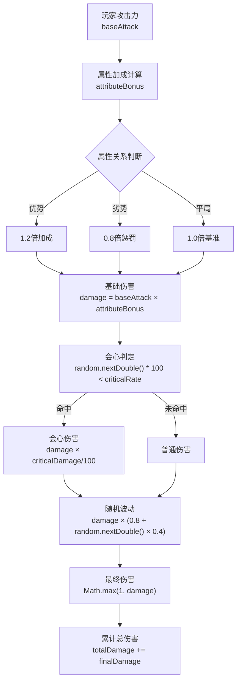
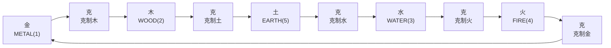
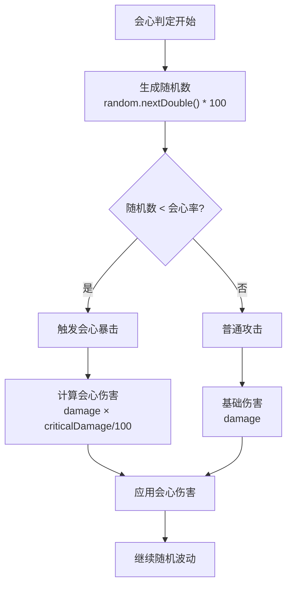
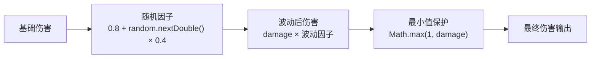
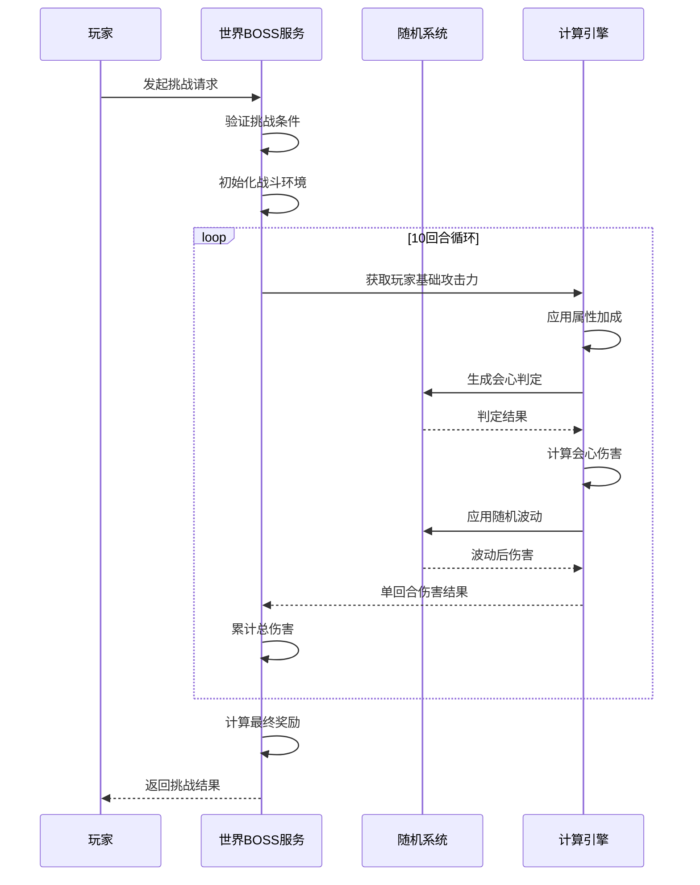
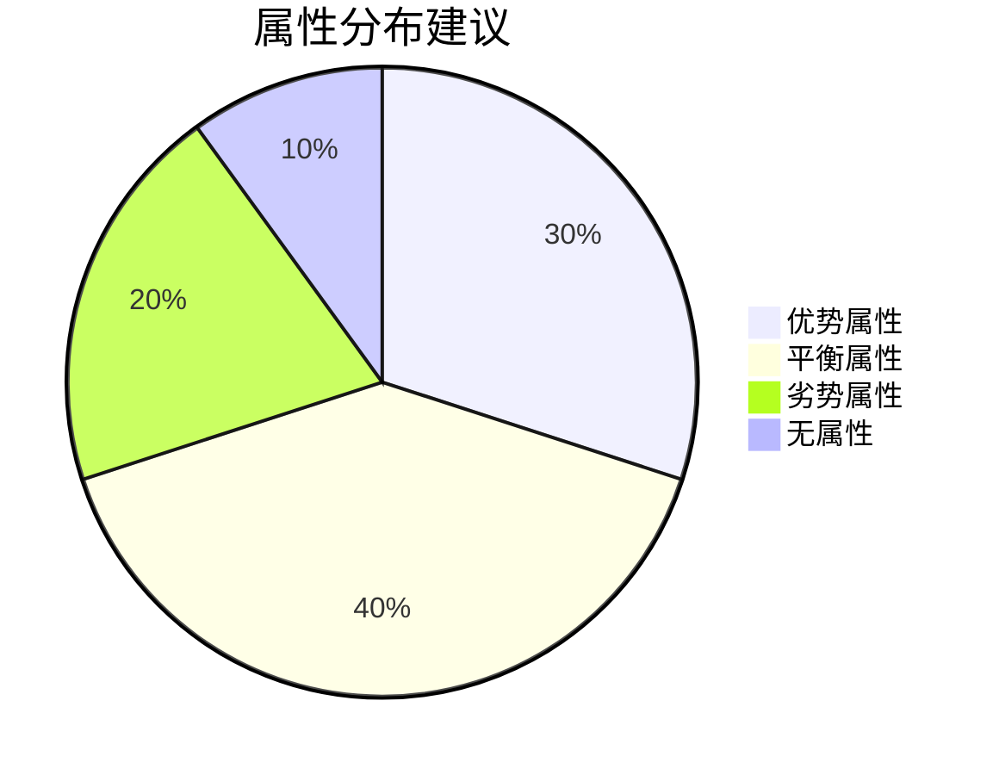
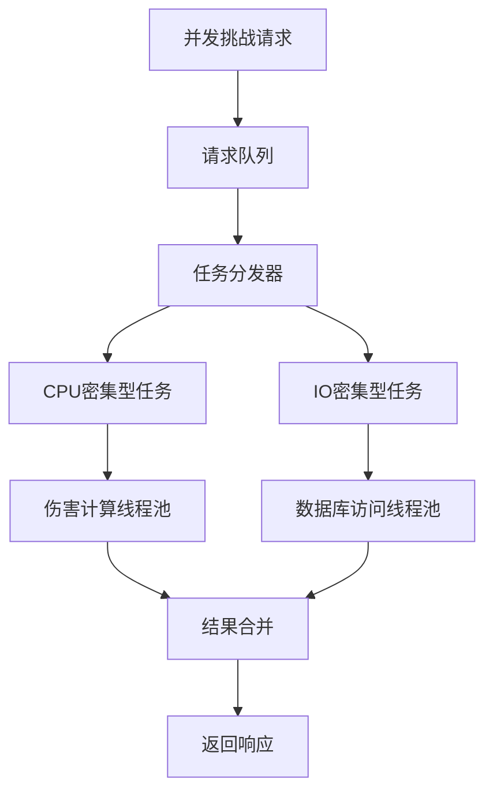

# 伤害计算规则

<cite>
**本文档引用的文件**
- [WorldBossServiceImpl.java](file://Life/src/main/java/com/bot/life/service/impl/WorldBossServiceImpl.java)
- [BattleServiceImpl.java](file://Life/src/main/java/com/bot/life/service/impl/BattleServiceImpl.java)
- [ENAttribute.java](file://Life/src/main/java/com/bot/life/enums/ENAttribute.java)
- [GameConsts.java](file://Common/src/main/java/com/bot/common/constant/GameConsts.java)
- [LifePlayer.java](file://Life/src/main/java/com/bot/life/dao/entity/LifePlayer.java)
- [WorldBossServiceImpl.java](file://Game/src/main/java/com/bot/game/service/impl/WorldBossServiceImpl.java)
</cite>

## 目录
1. [概述](#概述)
2. [核心伤害计算公式](#核心伤害计算公式)
3. [属性克制关系](#属性克制关系)
4. [会心系统](#会心系统)
5. [随机波动机制](#随机波动机制)
6. [战斗流程详解](#战斗流程详解)
7. [伤害计算示例](#伤害计算示例)
8. [属性搭配策略](#属性搭配策略)
9. [性能优化建议](#性能优化建议)
10. [故障排除指南](#故障排除指南)

## 概述

世界BOSS伤害计算是游戏战斗系统的核心机制，基于玩家攻击力、属性克制关系、会心率与会心伤害以及随机波动（±20%）进行综合计算。战斗采用10回合自动模拟模式，每回合独立计算伤害，确保战斗结果的公平性和随机性。

### 核心特性
- **10回合自动战斗**：每场世界BOSS挑战固定进行10个回合
- **属性克制加成**：优势属性造成1.2倍伤害，劣势属性造成0.8倍伤害
- **会心系统**：基于会心率的概率性暴击伤害计算
- **随机波动**：每次攻击伤害在±20%范围内随机浮动
- **实时模拟**：战斗过程完全自动化，无需玩家干预

## 核心伤害计算公式

### 基础伤害计算

**图表来源**
- [WorldBossServiceImpl.java](file://Life/src/main/java/com/bot/life/service/impl/WorldBossServiceImpl.java#L194-L225)

### 伤害计算步骤详解

1. **基础攻击力获取**：从玩家属性中提取攻击功率
2. **属性加成初始化**：默认属性加成为1.0
3. **属性克制判断**：根据五行相克关系确定加成系数
4. **单回合伤害计算**：应用属性加成的基础伤害
5. **会心判定**：基于会心率的概率性暴击
6. **随机波动**：±20%的随机浮动范围
7. **最小伤害保证**：确保每次攻击至少造成1点伤害

**章节来源**
- [WorldBossServiceImpl.java](file://Life/src/main/java/com/bot/life/service/impl/WorldBossServiceImpl.java#L194-L225)

## 属性克制关系

### 五行相克体系

游戏采用传统的五行相克理论，建立完整的属性克制关系：

**图表来源**
- [ENAttribute.java](file://Life/src/main/java/com/bot/life/enums/ENAttribute.java#L49-L53)

### 属性克制计算逻辑

| 玩家属性 | BOSS属性 | 加成系数 | 说明 |
|---------|---------|---------|------|
| 金(1) | 木(2) | 1.2 | 金克木，优势属性 |
| 木(2) | 土(5) | 1.2 | 木克土，优势属性 |
| 土(5) | 水(3) | 1.2 | 土克水，优势属性 |
| 水(3) | 火(4) | 1.2 | 水克火，优势属性 |
| 火(4) | 金(1) | 1.2 | 火克金，优势属性 |
| 金(1) | 火(4) | 0.8 | 金克火，劣势属性 |
| 木(2) | 金(1) | 0.8 | 木克金，劣势属性 |
| 土(5) | 木(2) | 0.8 | 土克木，劣势属性 |
| 水(3) | 土(5) | 0.8 | 水克土，劣势属性 |
| 火(4) | 水(3) | 0.8 | 火克水，劣势属性 |

**章节来源**
- [WorldBossServiceImpl.java](file://Life/src/main/java/com/bot/life/service/impl/WorldBossServiceImpl.java#L227-L235)
- [ENAttribute.java](file://Life/src/main/java/com/bot/life/enums/ENAttribute.java#L49-L53)

## 会心系统

### 会心判定机制

会心系统基于概率计算，提供额外的伤害加成：

**图表来源**
- [WorldBossServiceImpl.java](file://Life/src/main/java/com/bot/life/service/impl/WorldBossServiceImpl.java#L214-L216)

### 会心参数配置

| 参数名称 | 数据类型 | 默认值 | 说明 |
|---------|---------|--------|------|
| 会心率 | BigDecimal | 0% | 触发会心暴击的概率 |
| 会心伤害 | BigDecimal | 110% | 会心状态下的伤害倍率 |
| 破防率 | BigDecimal | 动态计算 | 基于速度和力量属性的破防能力 |

**章节来源**
- [LifePlayer.java](file://Life/src/main/java/com/bot/life/dao/entity/LifePlayer.java#L55-L70)

## 随机波动机制

### 波动计算原理

每次攻击都会经历±20%的随机波动，确保战斗结果的不可预测性：

**图表来源**
- [WorldBossServiceImpl.java](file://Life/src/main/java/com/bot/life/service/impl/WorldBossServiceImpl.java#L218-L221)

### 波动范围分析

- **最小波动**：0.8（-20%）
- **最大波动**：1.2（+20%）
- **平均波动**：1.0（无变化）
- **波动因子**：0.4（波动幅度）

这种设计确保：
1. **公平性**：避免固定伤害导致的单调性
2. **策略性**：鼓励玩家优化属性搭配
3. **娱乐性**：增加战斗的惊喜元素

**章节来源**
- [WorldBossServiceImpl.java](file://Life/src/main/java/com/bot/life/service/impl/WorldBossServiceImpl.java#L218-L221)

## 战斗流程详解

### 10回合自动模拟流程

**图表来源**
- [WorldBossServiceImpl.java](file://Life/src/main/java/com/bot/life/service/impl/WorldBossServiceImpl.java#L194-L225)

### 每回合处理步骤

1. **攻击力获取**：从玩家属性中提取当前攻击力
2. **属性加成应用**：根据五行相克关系调整伤害系数
3. **会心判定**：基于会心率进行概率性暴击判断
4. **会心伤害计算**：如果触发会心，则应用额外伤害倍率
5. **随机波动**：在±20%范围内进行随机浮动
6. **伤害累积**：将本回合伤害累加到总伤害中
7. **结果验证**：确保每次攻击至少造成1点伤害

**章节来源**
- [WorldBossServiceImpl.java](file://Life/src/main/java/com/bot/life/service/impl/WorldBossServiceImpl.java#L208-L222)

## 伤害计算示例

### 示例1：优势属性战斗

**玩家属性**：火属性（4）
**BOSS属性**：金属性（1）
**会心率**：5%
**会心伤害**：150%

**计算过程**：
1. 基础攻击力：100
2. 属性加成：1.2（火克金）
3. 第1回合：
   - 基础伤害：100 × 1.2 = 120
   - 会心判定：50 < 5 → 不触发
   - 随机波动：120 × (0.8 + 0.4×0.3) = 120 × 0.92 = 110.4 ≈ 110
4. 第2回合：
   - 基础伤害：100 × 1.2 = 120
   - 会心判定：85 < 5 → 不触发
   - 随机波动：120 × (0.8 + 0.4×0.7) = 120 × 0.88 = 105.6 ≈ 106
5. 总伤害：110 + 106 + ...（10回合）= 约1100-1300

### 示例2：劣势属性战斗

**玩家属性**：金属性（1）
**BOSS属性**：木属性（2）
**会心率**：5%
**会心伤害**：150%

**计算过程**：
1. 基础攻击力：100
2. 属性加成：0.8（金克木，但玩家属性被克制）
3. 第1回合：
   - 基础伤害：100 × 0.8 = 80
   - 会心判定：40 < 5 → 不触发
   - 随机波动：80 × 0.9 = 72
4. 总伤害：约700-900（相比优势属性减少20-30%）

### 示例3：会心暴击场景

**玩家属性**：火属性（4）
**BOSS属性**：金属性（1）
**会心率**：10%
**会心伤害**：150%

**计算过程**：
1. 基础攻击力：100
2. 属性加成：1.2
3. 会心判定：随机数为3（触发）
4. 会心伤害：120 × 1.5 = 180
5. 随机波动：180 × 0.95 = 171
6. 结果：171点伤害（相比普通伤害增加42.5%）

## 属性搭配策略

### 优势属性组合

| 玩家属性 | 推荐BOSS属性 | 伤害加成 | 适用场景 |
|---------|-------------|---------|----------|
| 火(4) | 金(1) | 1.2倍 | 火系BOSS挑战 |
| 木(2) | 土(5) | 1.2倍 | 木系BOSS挑战 |
| 土(5) | 水(3) | 1.2倍 | 土系BOSS挑战 |
| 水(3) | 火(4) | 1.2倍 | 水系BOSS挑战 |
| 金(1) | 木(2) | 1.2倍 | 金系BOSS挑战 |

### 劣势属性应对策略

当面对劣势属性的BOSS时，可以通过以下策略弥补：

1. **提升会心率**：增加触发会心暴击的概率
2. **提高攻击力**：通过装备和等级提升基础伤害
3. **控制波动**：利用随机波动的正向效果
4. **团队协作**：与其他玩家配合形成属性优势

### 属性平衡建议

**建议配置比例**：
- 主要属性：30%
- 辅助属性：40%
- 备用属性：20%
- 通用属性：10%

## 性能优化建议

### 计算效率优化

1. **缓存属性计算**：避免重复计算相同的属性加成
2. **批量处理**：一次性计算多个回合的结果
3. **随机数优化**：使用高效的随机数生成器
4. **内存管理**：及时释放不需要的对象引用

### 并发处理优化

### 内存使用优化

- **对象池化**：重用频繁创建的对象
- **延迟加载**：按需加载非关键数据
- **垃圾回收优化**：合理设置JVM参数
- **监控指标**：定期检查内存使用情况

## 故障排除指南

### 常见问题及解决方案

#### 问题1：伤害计算异常
**症状**：计算出的伤害值异常高或低
**原因**：属性加成计算错误或随机数生成异常
**解决方案**：
1. 检查属性映射关系是否正确
2. 验证随机数生成器的状态
3. 确认会心率和会心伤害参数

#### 问题2：战斗超时
**症状**：战斗模拟过程卡死或超时
**原因**：无限循环或递归调用
**解决方案**：
1. 添加最大迭代次数限制
2. 检查递归终止条件
3. 实现超时检测机制

#### 问题3：属性克制失效
**症状**：属性克制关系未生效
**原因**：属性编码不匹配或逻辑错误
**解决方案**：
1. 验证属性编码一致性
2. 检查克制关系判断逻辑
3. 更新属性映射表

### 调试工具和技巧

1. **日志记录**：详细记录每回合的计算过程
2. **断点调试**：在关键计算点设置断点
3. **单元测试**：编写针对伤害计算的测试用例
4. **性能分析**：使用性能分析工具识别瓶颈

**章节来源**
- [WorldBossServiceImpl.java](file://Life/src/main/java/com/bot/life/service/impl/WorldBossServiceImpl.java#L241-L251)

## 总结

世界BOSS伤害计算系统通过精密的算法设计，实现了公平、有趣且具有策略性的战斗体验。系统的核心优势包括：

1. **公平性**：基于属性克制的平衡设计
2. **策略性**：多样化的属性搭配选择
3. **随机性**：适度的随机波动增加趣味性
4. **可玩性**：丰富的属性组合可能性

通过深入理解这些计算规则，玩家可以更好地优化自己的属性搭配，提高世界BOSS挑战的成功率。同时，开发者也可以基于这些规则进行系统优化和功能扩展。