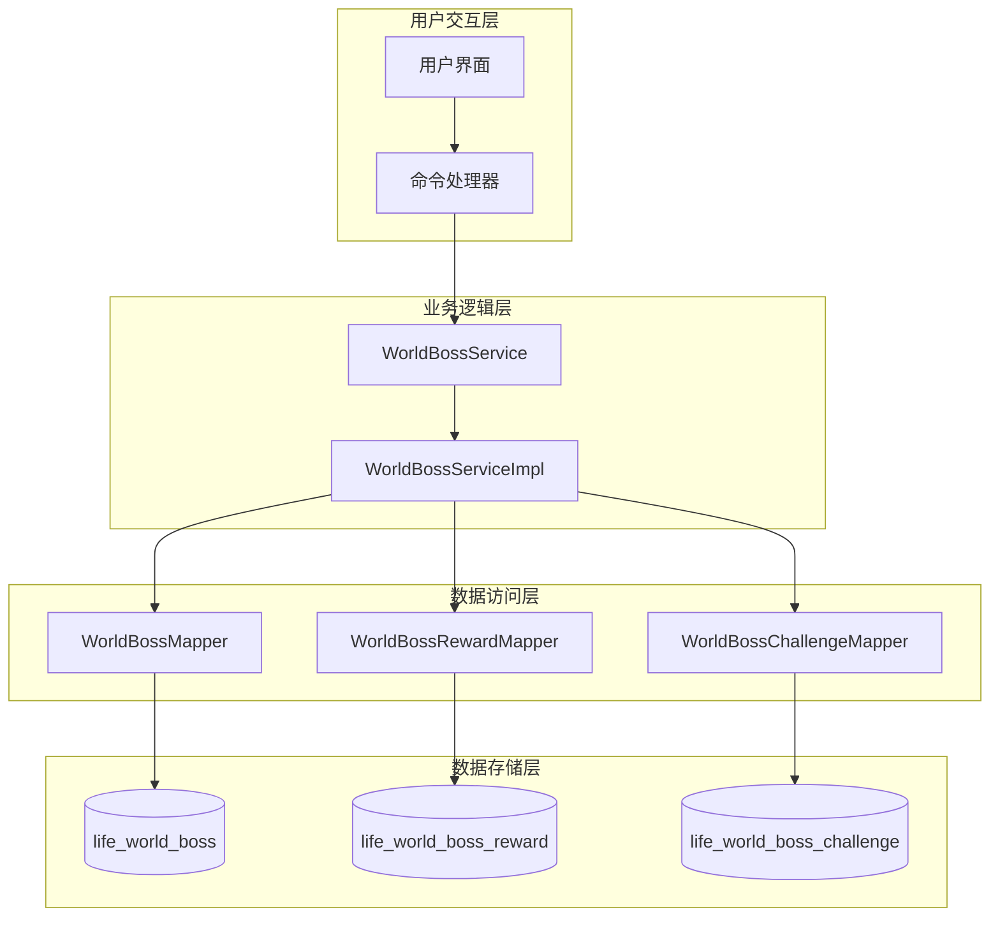
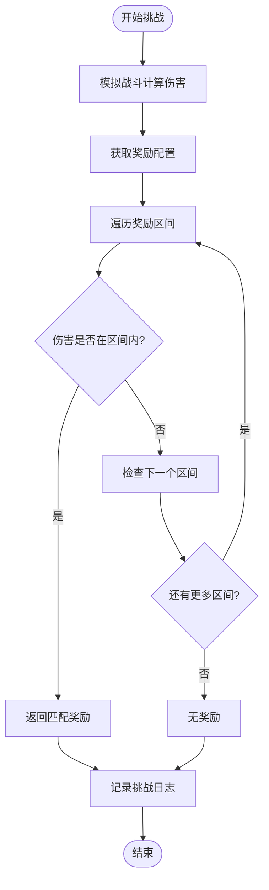
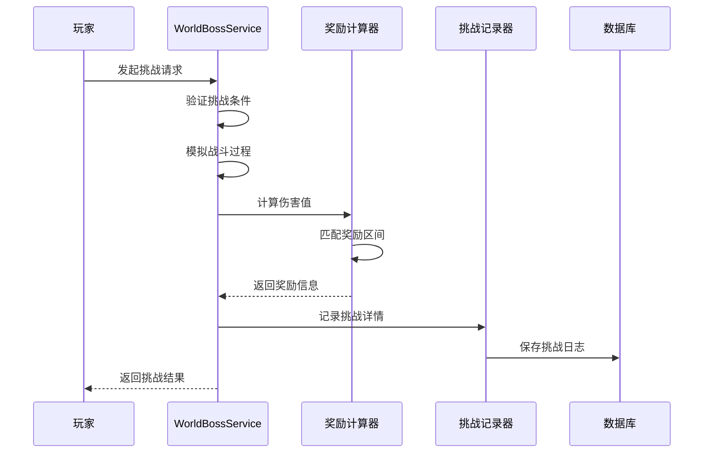
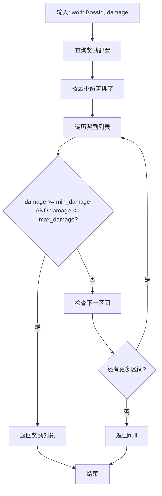
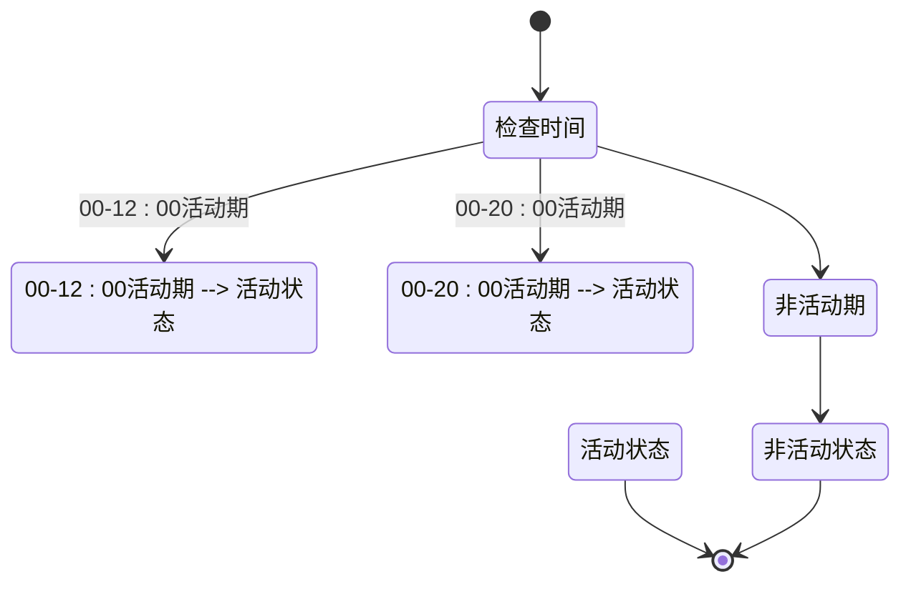
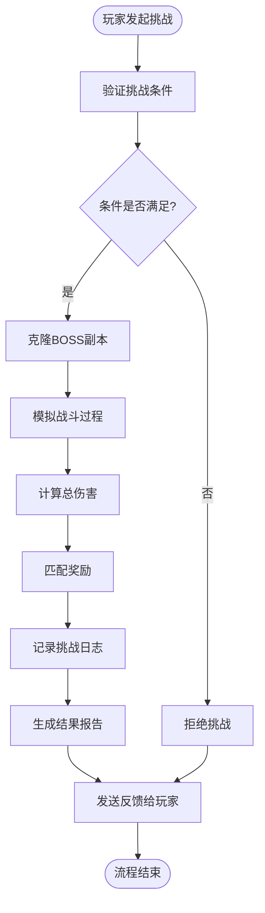

# 世界BOSS奖励分配策略

<cite>
**本文档中引用的文件**
- [WorldBossServiceImpl.java](file://Life/src/main/java/com/bot/life/service/impl/WorldBossServiceImpl.java)
- [LifeWorldBossReward.java](file://Life/src/main/java/com/bot/life/dao/entity/LifeWorldBossReward.java)
- [LifeWorldBossChallenge.java](file://Life/src/main/java/com/bot/life/dao/entity/LifeWorldBossChallenge.java)
- [LifeWorldBossRewardMapper.xml](file://Life/src/main/resources/mapper/LifeWorldBossRewardMapper.xml)
- [LifeWorldBossChallengeMapper.xml](file://Life/src/main/resources/mapper/LifeWorldBossChallengeMapper.xml)
- [WorldBossService.java](file://Life/src/main/java/com/bot/life/service/WorldBossService.java)
</cite>

## 目录
1. [概述](#概述)
2. [系统架构](#系统架构)
3. [奖励分段机制](#奖励分段机制)
4. [结算逻辑](#结算逻辑)
5. [数据库设计](#数据库设计)
6. [核心算法分析](#核心算法分析)
7. [挑战流程](#挑战流程)
8. [性能考虑](#性能考虑)
9. [故障排除指南](#故障排除指南)
10. [总结](#总结)

## 概述

世界BOSS奖励分配策略是一个基于玩家造成的伤害值动态匹配预设奖励区间的智能系统。该系统通过精确的伤害计算和奖励匹配机制，为玩家提供公平且激励性的挑战体验。系统支持多档位奖励设置，包含灵粹和道具两种主要奖励类型，并采用JSON格式存储复杂的道具奖励配置。

## 系统架构

世界BOSS奖励系统采用分层架构设计，确保功能模块的清晰分离和高效执行：

**图表来源**
- [WorldBossServiceImpl.java](file://Life/src/main/java/com/bot/life/service/impl/WorldBossServiceImpl.java#L22-L42)
- [WorldBossService.java](file://Life/src/main/java/com/bot/life/service/WorldBossService.java#L12-L55)

**章节来源**
- [WorldBossServiceImpl.java](file://Life/src/main/java/com/bot/life/service/impl/WorldBossServiceImpl.java#L1-L287)

## 奖励分段机制

### 基础分段原理

奖励分段机制基于玩家造成的伤害值范围进行匹配，每个世界BOSS都配置有一系列奖励区间，每个区间定义了最小伤害阈值和最大伤害阈值。

**图表来源**
- [WorldBossServiceImpl.java](file://Life/src/main/java/com/bot/life/service/impl/WorldBossServiceImpl.java#L240-L251)

### 奖励区间配置

每个奖励区间包含以下关键参数：

| 参数名称 | 数据类型 | 描述 | 示例值 |
|---------|---------|------|--------|
| min_damage | BIGINT | 最小伤害阈值 | 0 |
| max_damage | BIGINT | 最大伤害阈值 | 10000 |
| spirit_reward | INTEGER | 灵粹奖励数量 | 100 |
| item_rewards | LONGVARCHAR | 道具奖励（JSON格式） | {"itemId":1001,"count":5} |

### 匹配算法详解

系统使用精确匹配算法确定奖励区间：

1. **顺序遍历**：按min_damage升序排列的奖励区间
2. **边界检查**：验证伤害值是否满足 damage >= min_damage 且 damage <= max_damage
3. **优先级原则**：先匹配到的第一个符合条件的区间即为最终奖励
4. **兜底处理**：无匹配区间时返回null，表示未达到最低奖励门槛

**章节来源**
- [WorldBossServiceImpl.java](file://Life/src/main/java/com/bot/life/service/impl/WorldBossServiceImpl.java#L240-L251)
- [LifeWorldBossReward.java](file://Life/src/main/java/com/bot/life/dao/entity/LifeWorldBossReward.java#L1-L18)

## 结算逻辑

### 即时结算机制

系统采用即时结算模式，在挑战完成后立即计算并发放奖励，确保玩家能够及时获得反馈。

**图表来源**
- [WorldBossServiceImpl.java](file://Life/src/main/java/com/bot/life/service/impl/WorldBossServiceImpl.java#L76-L118)

### 奖励内容构成

奖励系统支持两种主要奖励类型：

#### 灵粹奖励
- **类型**：基础资源奖励
- **特点**：即时生效，可用于角色培养
- **获取方式**：根据伤害区间直接发放

#### 道具奖励
- **存储格式**：JSON字符串
- **灵活性**：支持多种道具组合
- **扩展性**：可配置任意数量和类型的道具

### 未达标处理

当玩家造成的伤害低于最低奖励阈值时：
- 系统不发放任何奖励
- 挑战记录仍然保存，用于统计分析
- 提供明确的反馈信息："伤害不足，未获得奖励"

**章节来源**
- [WorldBossServiceImpl.java](file://Life/src/main/java/com/bot/life/service/impl/WorldBossServiceImpl.java#L95-L118)
- [LifeWorldBossChallenge.java](file://Life/src/main/java/com/bot/life/dao/entity/LifeWorldBossChallenge.java#L1-L24)

## 数据库设计

### 核心表结构

#### life_world_boss_reward 表
存储世界BOSS的奖励配置信息：

| 字段名 | 类型 | 约束 | 描述 |
|--------|------|------|------|
| id | BIGINT | PRIMARY KEY | 主键标识 |
| world_boss_id | BIGINT | NOT NULL | 所属世界BOSS ID |
| min_damage | BIGINT | NOT NULL | 最小伤害阈值 |
| max_damage | BIGINT | NOT NULL | 最大伤害阈值 |
| spirit_reward | INTEGER | NOT NULL | 灵粹奖励数量 |
| item_rewards | LONGVARCHAR | NULLABLE | 道具奖励（JSON格式） |

#### life_world_boss_challenge 表
记录玩家的挑战历史：

| 字段名 | 类型 | 约束 | 描述 |
|--------|------|------|------|
| id | BIGINT | PRIMARY KEY | 主键标识 |
| player_id | BIGINT | NOT NULL | 玩家ID |
| world_boss_id | BIGINT | NOT NULL | 世界BOSS ID |
| damage_dealt | BIGINT | NOT NULL | 造成的伤害 |
| spirit_reward | INTEGER | NOT NULL | 获得的灵粹奖励 |
| item_rewards | LONGVARCHAR | NULLABLE | 获得的道具奖励 |
| challenge_time | TIMESTAMP | NOT NULL | 挑战时间 |

### 索引优化策略

1. **复合索引**：world_boss_id + min_damage，加速奖励匹配查询
2. **时间索引**：challenge_time字段，支持快速统计分析
3. **唯一约束**：确保每日挑战次数限制的有效性

**章节来源**
- [LifeWorldBossRewardMapper.xml](file://Life/src/main/resources/mapper/LifeWorldBossRewardMapper.xml#L1-L56)
- [LifeWorldBossChallengeMapper.xml](file://Life/src/main/resources/mapper/LifeWorldBossChallengeMapper.xml#L1-L66)

## 核心算法分析

### calculateReward 方法详解

这是奖励分配的核心算法，其实现体现了系统的智能化设计：

**图表来源**
- [WorldBossServiceImpl.java](file://Life/src/main/java/com/bot/life/service/impl/WorldBossServiceImpl.java#L240-L251)

### 战斗模拟算法

战斗模拟采用简化的数值模型，考虑以下因素：

1. **基础攻击力**：基于玩家属性计算
2. **属性相克**：优势1.2倍，劣势0.8倍
3. **暴击机制**：基于暴击率和暴击伤害计算
4. **随机波动**：±20%的随机因素
5. **回合制战斗**：固定10回合的攻击循环

### 时间检测算法

系统通过精确的时间窗口控制世界BOSS的活动周期：

**图表来源**
- [WorldBossServiceImpl.java](file://Life/src/main/java/com/bot/life/service/impl/WorldBossServiceImpl.java#L180-L192)

**章节来源**
- [WorldBossServiceImpl.java](file://Life/src/main/java/com/bot/life/service/impl/WorldBossServiceImpl.java#L240-L287)

## 挑战流程

### 完整挑战生命周期

世界BOSS挑战遵循严格的流程控制，确保游戏平衡性和用户体验：

**图表来源**
- [WorldBossServiceImpl.java](file://Life/src/main/java/com/bot/life/service/impl/WorldBossServiceImpl.java#L76-L118)

### 条件验证体系

系统实施多层次的挑战验证：

1. **BOSS状态验证**：检查BOSS是否存在且处于活跃状态
2. **时间窗口验证**：确认当前时间在允许的活动范围内
3. **位置验证**：确保玩家位于正确的地图区域
4. **次数限制验证**：检查今日挑战次数是否超过上限

### 挑战记录管理

每次挑战都会生成详细的记录，包含以下关键信息：

- **玩家标识**：唯一识别玩家身份
- **BOSS标识**：记录挑战的具体BOSS
- **伤害统计**：精确的伤害数值
- **奖励详情**：灵粹和道具奖励信息
- **时间戳**：挑战发生的确切时间

**章节来源**
- [WorldBossServiceImpl.java](file://Life/src/main/java/com/bot/life/service/impl/WorldBossServiceImpl.java#L54-L74)
- [WorldBossServiceImpl.java](file://Life/src/main/java/com/bot/life/service/impl/WorldBossServiceImpl.java#L253-L267)

## 性能考虑

### 查询优化策略

1. **索引利用**：合理使用复合索引提高查询效率
2. **缓存机制**：对频繁访问的奖励配置进行缓存
3. **批量操作**：减少数据库交互次数
4. **连接池管理**：优化数据库连接利用率

### 内存管理

1. **对象复用**：重用Monster对象减少GC压力
2. **临时变量**：及时释放不需要的临时对象
3. **集合优化**：选择合适的集合类型

### 并发控制

1. **线程安全**：确保Random实例的安全使用
2. **事务管理**：保证挑战记录的一致性
3. **锁机制**：防止重复挑战和奖励发放

## 故障排除指南

### 常见问题及解决方案

#### 奖励未正确发放
**症状**：玩家挑战成功但未获得预期奖励
**排查步骤**：
1. 检查奖励区间配置是否正确
2. 验证伤害计算是否准确
3. 确认数据库记录完整性

#### 挑战条件验证失败
**症状**：玩家无法发起挑战
**排查步骤**：
1. 检查BOSS状态配置
2. 验证时间窗口设置
3. 确认玩家位置信息

#### 数据库连接异常
**症状**：挑战记录保存失败
**排查步骤**：
1. 检查数据库连接状态
2. 验证表结构完整性
3. 确认权限配置正确

### 监控指标

建议监控以下关键指标：
- 奖励匹配成功率
- 挑战完成率
- 平均伤害值分布
- 数据库查询响应时间

**章节来源**
- [WorldBossServiceImpl.java](file://Life/src/main/java/com/bot/life/service/impl/WorldBossServiceImpl.java#L263-L267)

## 总结

世界BOSS奖励分配策略是一个设计精良的智能系统，通过精确的伤害计算、灵活的奖励配置和高效的结算机制，为玩家提供了丰富而公平的游戏体验。系统的主要优势包括：

1. **精确匹配**：基于伤害值的精确奖励分配
2. **灵活配置**：支持多样化的奖励组合
3. **即时反馈**：挑战完成后立即获得奖励
4. **完整记录**：详细的挑战历史便于分析
5. **性能优化**：高效的查询和处理机制

该系统不仅满足了当前的功能需求，还具备良好的扩展性，能够适应未来可能的功能增强和技术升级。通过合理的数据库设计和算法优化，系统能够在高并发环境下稳定运行，为大量玩家提供优质的服务。