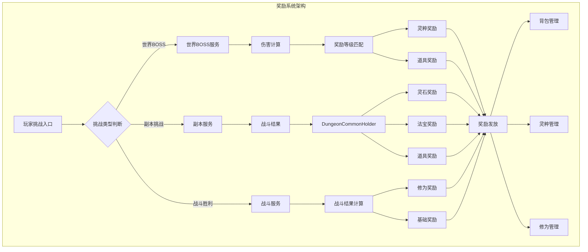
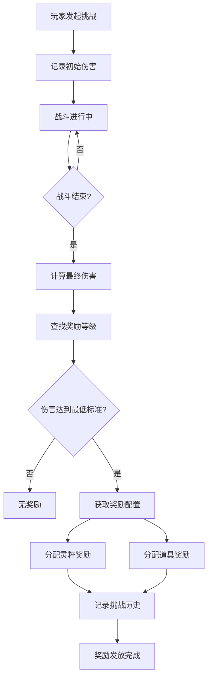
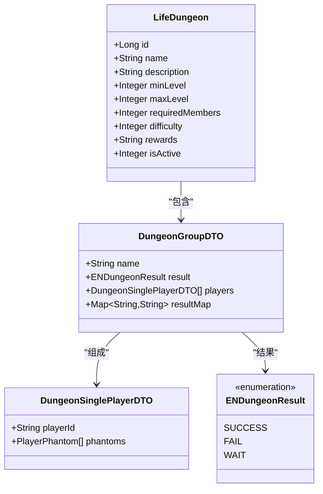
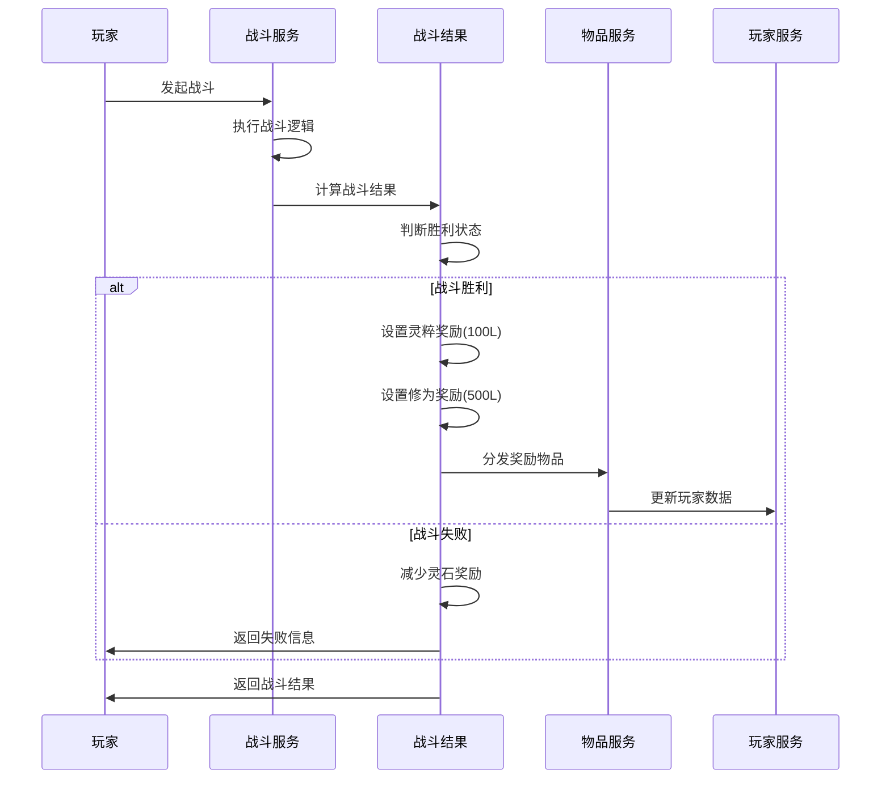
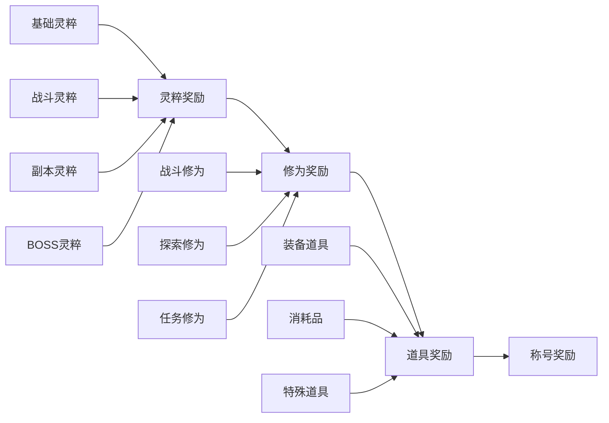
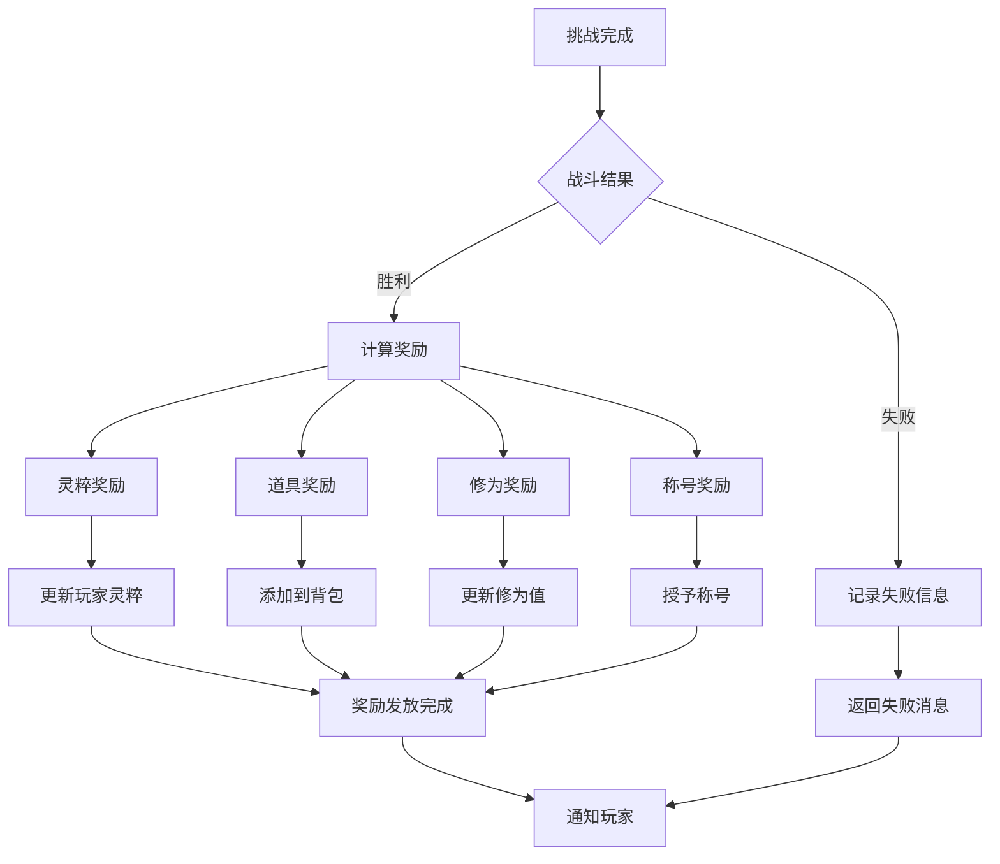

# 奖励分配机制

<cite>
**本文档引用的文件**
- [TeamServiceImpl.java](file://Life/src/main/java/com/bot/life/service/impl/TeamServiceImpl.java)
- [WorldBossServiceImpl.java](file://Life/src/main/java/com/bot/life/service/impl/WorldBossServiceImpl.java)
- [LifeWorldBossReward.java](file://Life/src/main/java/com/bot/life/dao/entity/LifeWorldBossReward.java)
- [LifeDungeon.java](file://Life/src/main/java/com/bot/life/dao/entity/LifeDungeon.java)
- [ENDungeonResult.java](file://Game/src/main/java/com/bot/game/enums/ENDungeonResult.java)
- [BattleServiceImpl.java](file://Life/src/main/java/com/bot/life/service/impl/BattleServiceImpl.java)
- [InventoryServiceImpl.java](file://Life/src/main/java/com/bot/life/service/impl/InventoryServiceImpl.java)
- [LifeHandlerImpl.java](file://Life/src/main/java/com/bot/life/service/impl/LifeHandlerImpl.java)
- [DungeonCommonHolder.java](file://Game/src/main/java/com/bot/game/service/DungeonCommonHolder.java)
- [LifeWorldBossChallenge.java](file://Life/src/main/resources/mapper/LifeWorldBossChallengeMapper.xml)
- [LifeWorldBossRewardMapper.xml](file://Life/src/main/resources/mapper/LifeWorldBossRewardMapper.xml)
</cite>

## 目录
1. [概述](#概述)
2. [奖励系统架构](#奖励系统架构)
3. [世界BOSS奖励机制](#世界boss奖励机制)
4. [副本挑战奖励](#副本挑战奖励)
5. [战斗奖励计算](#战斗奖励计算)
6. [奖励分配原则](#奖励分配原则)
7. [团队协作与奖励](#团队协作与奖励)
8. [奖励领取流程](#奖励领取流程)
9. [注意事项与最佳实践](#注意事项与最佳实践)
10. [故障排除指南](#故障排除指南)

## 概述

本游戏采用多层次的奖励分配机制，主要包含世界BOSS挑战奖励、副本挑战奖励和战斗胜利奖励三大核心系统。奖励机制设计旨在促进团队协作，确保公平分配，同时激励玩家积极参与各种挑战活动。

### 主要奖励类型

1. **灵粹奖励** - 核心资源，用于提升角色能力
2. **道具奖励** - 包含装备、消耗品等多种类型
3. **修为奖励** - 用于角色境界突破的重要资源
4. **称号奖励** - 象征成就的特殊标识

## 奖励系统架构

**图表来源**
- [TeamServiceImpl.java](file://Life/src/main/java/com/bot/life/service/impl/TeamServiceImpl.java#L318-L354)
- [WorldBossServiceImpl.java](file://Life/src/main/java/com/bot/life/service/impl/WorldBossServiceImpl.java#L241-L265)
- [BattleServiceImpl.java](file://Life/src/main/java/com/bot/life/service/impl/BattleServiceImpl.java#L180-L192)

## 世界BOSS奖励机制

### 奖励计算原理

世界BOSS系统采用基于伤害贡献的奖励分配机制，确保每个参与者的付出都能得到相应的回报。

**图表来源**
- [WorldBossServiceImpl.java](file://Life/src/main/java/com/bot/life/service/impl/WorldBossServiceImpl.java#L241-L265)
- [LifeWorldBossChallenge.java](file://Life/src/main/resources/mapper/LifeWorldBossChallengeMapper.xml#L56-L66)

### 奖励等级配置

| 伤害范围 | 灵粹奖励 | 道具奖励 |
|---------|---------|---------|
| 0-1000 | 50 | 无 |
| 1001-5000 | 100 | 小型宝箱 |
| 5001-10000 | 200 | 中型宝箱 |
| 10001-20000 | 500 | 大型宝箱 |
| 20001+ | 1000 | 稀有宝箱 |

**节段来源**
- [LifeWorldBossReward.java](file://Life/src/main/java/com/bot/life/dao/entity/LifeWorldBossReward.java#L11-L17)
- [WorldBossServiceImpl.java](file://Life/src/main/java/com/bot/life/service/impl/WorldBossServiceImpl.java#L241-L265)

## 副本挑战奖励

### 副本奖励结构

副本系统提供多样化的奖励组合，包括灵石、法宝和随机道具奖励。

**图表来源**
- [LifeDungeon.java](file://Life/src/main/java/com/bot/life/dao/entity/LifeDungeon.java#L11-L20)
- [DungeonGroupDTO.java](file://Game/src/main/java/com/bot/game/dto/DungeonGroupDTO.java#L15-L25)
- [ENDungeonResult.java](file://Game/src/main/java/com/bot/game/enums/ENDungeonResult.java#L8-L11)

### 奖励计算公式

副本胜利奖励计算遵循以下公式：

- **灵石奖励** = 基础灵石 × 副本难度系数 × 团队人数系数
- **法宝奖励** = 随机概率检测（10%概率）
- **道具奖励** = 保底机制（无道具时给予天命散×2）

**节段来源**
- [DungeonCommonHolder.java](file://Game/src/main/java/com/bot/game/service/DungeonCommonHolder.java#L199-L225)

## 战斗奖励计算

### 战斗胜利奖励

战斗系统根据战斗结果自动计算并分配奖励，确保战斗的公平性和激励性。

**图表来源**
- [BattleServiceImpl.java](file://Life/src/main/java/com/bot/life/service/impl/BattleServiceImpl.java#L180-L192)
- [ENDungeonResult.java](file://Game/src/main/java/com/bot/game/enums/ENDungeonResult.java#L8-L11)

### 奖励分配算法

战斗奖励分配采用以下算法：

1. **胜利奖励** = 基础奖励 + 属性加成奖励
2. **失败惩罚** = 基础灵石损失 + 战斗详情记录
3. **称号奖励** = 成就系统检查 + 称号授予

**节段来源**
- [BattleServiceImpl.java](file://Life/src/main/java/com/bot/life/service/impl/BattleServiceImpl.java#L180-L192)
- [DungeonCommonHolder.java](file://Game/src/main/java/com/bot/game/service/DungeonCommonHolder.java#L133-L154)

## 奖励分配原则

### 公平分配原则

1. **贡献度原则** - 奖励与个人贡献成正比
2. **团队协作原则** - 鼓励团队合作而非单打独斗
3. **多样性原则** - 提供多种类型的奖励选择
4. **透明度原则** - 奖励计算过程公开透明

### 分配优先级

**节段来源**
- [InventoryServiceImpl.java](file://Life/src/main/java/com/bot/life/service/impl/InventoryServiceImpl.java#L48-L75)
- [LifeHandlerImpl.java](file://Life/src/main/java/com/bot/life/service/impl/LifeHandlerImpl.java#L1700-L1726)

## 团队协作与奖励

### 队伍奖励机制

团队系统支持多人协作挑战，奖励按团队规模和贡献度进行分配。

| 队伍规模 | 奖励系数 | 分配方式 |
|---------|---------|---------|
| 2人 | 1.0x | 平均分配 |
| 3人 | 1.1x | 按贡献度分配 |
| 4人 | 1.2x | 队长额外奖励 |
| 5人及以上 | 1.3x | 领导力奖励 |

### 队长职责与奖励

队长在团队中有特殊的奖励机制：

1. **额外奖励** - 队长获得基础奖励的10%额外奖励
2. **领导力奖励** - 领导表现优秀的团队获得特殊称号
3. **团队协调奖励** - 协助队友获得相应奖励

**节段来源**
- [TeamServiceImpl.java](file://Life/src/main/java/com/bot/life/service/impl/TeamServiceImpl.java#L318-L354)

## 奖励领取流程

### 完整领取流程

**图表来源**
- [DungeonCommonHolder.java](file://Game/src/main/java/com/bot/game/service/DungeonCommonHolder.java#L133-L154)
- [InventoryServiceImpl.java](file://Life/src/main/java/com/bot/life/service/impl/InventoryServiceImpl.java#L48-L75)

### 奖励确认机制

1. **即时确认** - 挑战完成后立即显示奖励信息
2. **背包更新** - 道具奖励自动添加到玩家背包
3. **灵粹结算** - 灵粹奖励实时更新到玩家账户
4. **成就追踪** - 奖励获得情况自动记录

**节段来源**
- [InventoryServiceImpl.java](file://Life/src/main/java/com/bot/life/service/impl/InventoryServiceImpl.java#L48-L75)

## 注意事项与最佳实践

### 队长注意事项

1. **团队管理**
   - 确保队伍成员符合副本要求
   - 合理安排队员角色和职责
   - 关注队员状态和装备

2. **奖励分配**
   - 公平分配奖励给每位队员
   - 及时处理队员的奖励请求
   - 保持团队氛围和谐

3. **挑战准备**
   - 提前检查副本开放状态
   - 确认队伍成员在线状态
   - 准备必要的战斗道具

### 队员注意事项

1. **参与要求**
   - 确保角色等级符合副本要求
   - 准备充足的战斗道具
   - 保持网络连接稳定

2. **团队协作**
   - 积极配合队长指挥
   - 及时响应团队指令
   - 分享战斗经验和技巧

3. **奖励获取**
   - 及时领取战斗奖励
   - 查看背包中的道具奖励
   - 关注修为和灵粹变化

### 常见问题处理

1. **奖励未到账**
   - 检查背包空间是否充足
   - 确认战斗是否成功完成
   - 联系管理员查询具体情况

2. **奖励重复**
   - 系统会自动去重处理
   - 如有疑问可联系客服
   - 记录奖励获取时间

3. **团队冲突**
   - 队长应公平处理争议
   - 遵循团队约定的分配原则
   - 必要时寻求第三方调解

## 故障排除指南

### 常见奖励问题

| 问题类型 | 可能原因 | 解决方案 |
|---------|---------|---------|
| 奖励未显示 | 网络延迟或系统错误 | 重新发起挑战或联系客服 |
| 灵粹不增加 | 数据同步问题 | 重启游戏客户端或重新登录 |
| 道具丢失 | 存储空间不足 | 清理背包或出售不需要的物品 |
| 称号未获得 | 条件未满足 | 检查成就完成情况 |

### 技术支持流程

1. **问题报告**
   - 收集相关截图和日志
   - 记录问题发生的时间和场景
   - 描述问题的具体表现

2. **问题诊断**
   - 系统自动检查奖励状态
   - 管理员手动核查数据完整性
   - 必要时进行数据库修复

3. **问题解决**
   - 自动修复系统错误
   - 手动补充遗漏的奖励
   - 提供补偿措施

### 预防措施

1. **定期维护**
   - 每日检查奖励系统运行状态
   - 定期备份重要数据
   - 更新系统补丁和优化

2. **监控告警**
   - 监控奖励发放成功率
   - 跟踪异常奖励事件
   - 及时响应用户反馈

3. **用户体验优化**
   - 简化奖励领取流程
   - 提供清晰的奖励说明
   - 增强系统的稳定性

通过以上详细的奖励分配机制文档，玩家可以更好地理解游戏中的奖励系统，合理规划自己的游戏策略，并在团队协作中获得更好的体验。建议玩家在参与挑战前仔细阅读相关规则，确保能够充分利用奖励系统带来的各种优势。