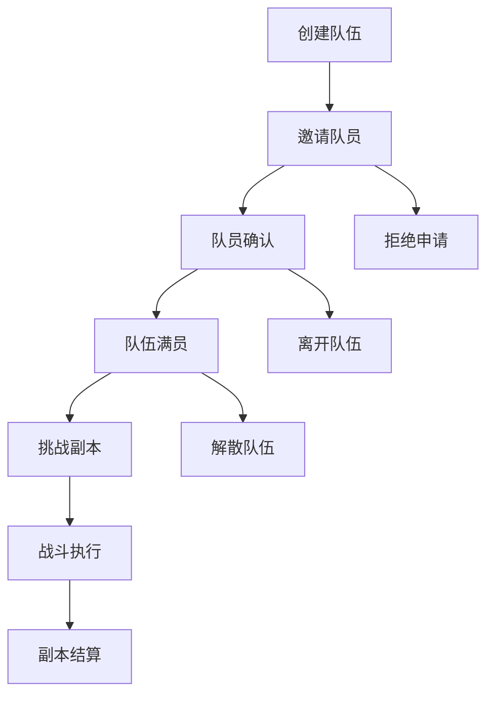
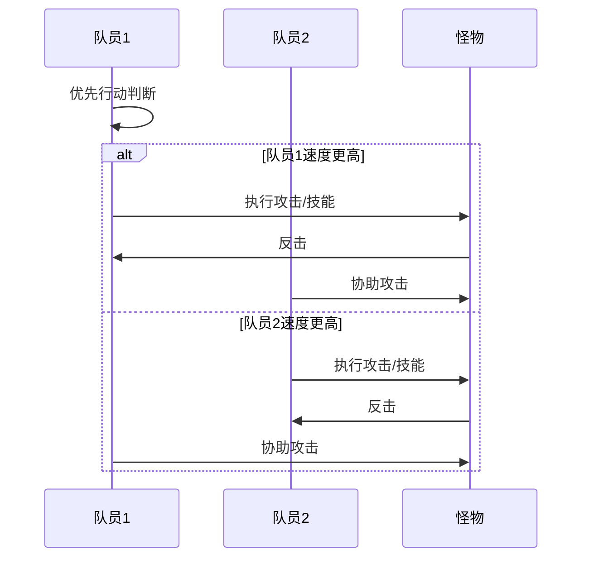

# 战斗协作策略

<cite>
**本文档引用的文件**
- [Life_User_Manual.md](file://Life_User_Manual.md)
- [BattleServiceImpl.java](file://Life\src\main\java\com\bot\life\service\impl\BattleServiceImpl.java)
- [LifeHandlerImpl.java](file://Life\src\main\java\com\bot\life\service\impl\LifeHandlerImpl.java)
- [TeamServiceImpl.java](file://Life\src\main\java\com\bot\life\service\impl\TeamServiceImpl.java)
- [BattleContext.java](file://Life\src\main\java\com\bot\life\dto\BattleContext.java)
- [BattleEffect.java](file://Life\src\main\java\com\bot\life\dto\BattleEffect.java)
- [ENBattleAction.java](file://Life\src\main\java\com\bot\life\enums\ENBattleAction.java)
- [ENAttribute.java](file://Life\src\main\java\com\bot\life\enums\ENAttribute.java)
- [ENSkillEffect.java](file://Game\src\main\java\com\bot\game\enums\ENSkillEffect.java)
- [DungeonGroupDTO.java](file://Game\src\main\java\com\bot\game\dto\DungeonGroupDTO.java)
- [LifeTeamMember.java](file://Life\src\main\java\com\bot\life\dao\entity\LifeTeamMember.java)
</cite>

## 目录
1. [引言](#引言)
2. [战斗系统概述](#战斗系统概述)
3. [团队副本机制](#团队副本机制)
4. [职业与派系分析](#职业与派系分析)
5. [战斗协作策略](#战斗协作策略)
6. [技能搭配与战术](#技能搭配与战术)
7. [团队配置方案](#团队配置方案)
8. [实战应用指南](#实战应用指南)
9. [常见问题解答](#常见问题解答)
10. [总结](#总结)

## 引言

在《浮生卷》这款修仙主题的文字RPG游戏中，组队副本是玩家提升实力、挑战强敌的重要玩法。战斗协作策略的掌握对于团队的成功至关重要。本文档基于游戏的核心战斗系统和团队机制，为玩家提供全面的战斗协作指导。

## 战斗系统概述

### 基础战斗机制

游戏采用回合制战斗系统，战斗行动包括：
- **普通攻击**：基础物理伤害输出
- **使用技能**：消耗神通进行特殊攻击
- **防御**：减少50%受到的伤害
- **使用道具**：恢复生命值或提供增益效果
- **逃跑**：尝试脱离战斗

### 战斗伤害计算

战斗伤害遵循以下公式：
```
伤害 = 攻击力 × 倍率 - 防御 × (1 - 破防率)
```

其中：
- 会心率 ≥ 50% 时触发暴击，伤害 × 会心效果
- 破防率最高30%
- 最少造成1点伤害

### 属性克制系统

五行相克关系：
- 金克木
- 木克土  
- 土克水
- 水克火
- 火克金

克制效果：
- 克制对方：最终伤害+20%
- 被克制：自身防御-10%

**章节来源**
- [Life_User_Manual.md](file://Life_User_Manual.md#L97-L120)
- [BattleServiceImpl.java](file://Life\src\main\java\com\bot\life\service\impl\BattleServiceImpl.java#L148-L163)

## 团队副本机制

### 队伍组建系统

游戏支持最多2人组队，具有以下特点：



**图表来源**
- [TeamServiceImpl.java](file://Life\src\main\java\com\bot\life\service\impl\TeamServiceImpl.java#L29-L60)

### 队伍状态管理

队伍状态分为三种：
- **招募中（0）**：正在寻找队员
- **已满员（1）**：队伍人数已达上限
- **副本中（2）**：正在进行副本挑战

### 队长权限

队长拥有以下特殊权限：
- 创建和解散队伍
- 处理队员申请
- 发起副本挑战
- 管理队伍成员

**章节来源**
- [TeamServiceImpl.java](file://Life\src\main\java\com\bot\life\service\impl\TeamServiceImpl.java#L318-L354)

## 职业与派系分析

### 派系特性对比

| 派系 | 特色 | 攻击力 | 防御力 | 养成难度 |
|------|------|--------|--------|----------|
| 金 | 强大破坏力，一力破万法 | ★★★★★ | ★★ | ★★★★ |
| 木 | 强大恢复能力，治疗用毒 | ★★★ | ★★★★ | ★★★ |
| 水 | 包容万物，各领域涉及 | ★★★★ | ★★★★ | ★★★★ |
| 火 | 持续伤害，可观爆发力 | ★★★★ | ★★★ | ★★★ |
| 土 | 超强防御，不俗控制力 | ★★★ | ★★★★★ | ★★★★★ |

### 属性系统详解

**基础属性：**
- **速度**：决定出手顺序，影响破防
- **体质**：影响血量和防御
- **灵力**：影响会心率和会心效果
- **力量**：影响攻击力和破防

**属性计算公式：**
- 每1点速度：破防+0.005%
- 每1点体质：血量+10，防御+1
- 每1点灵力：会心+0.01%，会心效果+0.005%
- 每1点力量：攻击力+6，破防+0.01%

**章节来源**
- [Life_User_Manual.md](file://Life_User_Manual.md#L33-L64)
- [ENAttribute.java](file://Life\src\main\java\com\bot\life\enums\ENAttribute.java#L40-L64)

## 战斗协作策略

### 团队定位分配

#### 1. 输出型角色（主要伤害来源）
- **金派系**：高爆发伤害，适合快速击杀
- **火派系**：持续伤害输出，适合长时间战斗
- **木派系**：群体伤害，适合清理小怪

#### 2. 坦克型角色（吸收伤害）
- **土派系**：超高防御，承担主要伤害
- **水派系**：均衡属性，兼具防御和辅助能力

#### 3. 辅助型角色（提供支援）
- **木派系**：治疗和增益效果
- **水派系**：控制和减益效果
- **火派系**：范围伤害和点燃效果

### 行动顺序优化



**图表来源**
- [BattleServiceImpl.java](file://Life\src\main\java\com\bot\life\service\impl\BattleServiceImpl.java#L47-L48)

### 战术配合要点

#### 1. 速度优先原则
- 队伍中应至少有一名速度较高的角色
- 速度优势确保先手行动，掌握战斗节奏

#### 2. 属性互补策略
- 利用五行相克关系选择合适的职业组合
- 避免同属性队伍，确保战斗多样性

#### 3. 技能协同效应
- 不同技能之间产生连锁反应
- 合理安排技能释放时机，最大化伤害输出

**章节来源**
- [BattleServiceImpl.java](file://Life\src\main\java\com\bot\life\service\impl\BattleServiceImpl.java#L119-L138)

## 技能搭配与战术

### 技能效果分类

游戏中的技能效果分为多个类型：

#### 攻击类技能（A系列）
- **A01**：造成双倍伤害
- **A02**：造成1.5倍伤害
- **A03**：3倍伤害但防御降低30%
- **A04**：50%几率造成3倍伤害

#### 控制类技能（C系列）
- **C01-C04**：降低目标攻击或防御
- **C05**：使目标停止行动1回合
- **C06-C07**：持续扣血效果

#### 增益类技能（U系列）
- **U01-U03**：提升攻击力、速度、防御
- **W01-W07**：特殊战斗增益效果

### 技能使用策略

#### 1. 冷却时间管理
- 合理规划技能释放顺序
- 在关键时刻使用关键技能
- 避免技能同时冷却

#### 2. 效果叠加利用
- Buff效果可以叠加
- Debuff效果相互独立
- 合理安排效果生效时机

#### 3. 目标优先级
- 优先处理威胁最大的敌人
- 保护队友免受控制效果
- 利用控制技能打断敌人行动

**章节来源**
- [ENSkillEffect.java](file://Game\src\main\java\com\bot\game\enums\ENSkillEffect.java#L13-L83)

## 团队配置方案

### 方案一：高输出型组合

**配置**：金派系 + 火派系
- **金派系**：提供高爆发伤害和破防能力
- **火派系**：补充持续伤害和范围效果

**战术特点**：
- 快速解决战斗
- 适合对付单一强力BOSS
- 对生存能力要求较高

### 方案二：均衡发展型组合

**配置**：木派系 + 土派系
- **木派系**：治疗和辅助能力
- **土派系**：防御和控制能力

**战术特点**：
- 战斗稳定性高
- 适合长时间战斗
- 能够应对各种突发状况

### 方案三：灵活多变型组合

**配置**：水派系 + 火派系
- **水派系**：属性均衡，适应性强
- **火派系**：爆发力强，机动性好

**战术特点**：
- 战术选择多样
- 能应对不同类型的敌人
- 灵活性高，适应性强

### 方案四：控制为主型组合

**配置**：土派系 + 木派系
- **土派系**：强大的控制能力
- **木派系**：辅助控制和治疗

**战术特点**：
- 通过控制限制敌人行动
- 逐步削弱敌人战斗力
- 适合对付群体敌人

## 实战应用指南

### 战斗准备阶段

#### 1. 队伍组建
- 确保两名队员都在线
- 检查双方的属性和技能配置
- 确认副本难度匹配

#### 2. 装备检查
- 确保装备属性与派系匹配
- 检查神通技能的冷却状态
- 准备充足的恢复道具

#### 3. 战术规划
- 确定各自的角色定位
- 商量技能使用顺序
- 制定应对突发情况的预案

### 战斗执行阶段

#### 1. 开局策略
- 优先处理威胁最大的敌人
- 利用属性克制关系
- 保持合理的距离和位置

#### 2. 中期推进
- 根据战斗情况调整战术
- 及时补充队友状态
- 注意敌人的技能冷却

#### 3. 结束阶段
- 集中火力快速解决战斗
- 避免不必要的风险
- 确保全员安全撤离

### 战斗复盘

#### 1. 数据分析
- 记录战斗过程中的关键事件
- 分析技能使用的效果
- 总结经验教训

#### 2. 配置优化
- 根据战斗结果调整装备
- 改进技能使用策略
- 提升团队配合默契度

#### 3. 持续改进
- 定期回顾战斗经验
- 学习新的战术技巧
- 与队友保持沟通交流

**章节来源**
- [BattleContext.java](file://Life\src\main\java\com\bot\life\dto\BattleContext.java#L16-L38)

## 常见问题解答

### Q1：如何选择合适的队友？

**A1**：选择与自己派系互补的队友，考虑以下因素：
- 属性克制关系
- 技能效果搭配
- 战术风格契合度
- 游戏时间安排

### Q2：战斗中应该优先使用什么技能？

**A2**：根据具体情况选择：
- 开局使用控制技能限制敌人
- 中期使用高伤害技能快速解决
- 后期使用治疗和增益技能维持状态

### Q3：如何提高团队协作效率？

**A3**：建立良好的沟通机制：
- 战斗前明确分工
- 战斗中及时通报情况
- 战斗后总结经验
- 定期练习配合默契

### Q4：遇到强敌时该如何应对？

**A4**：采取针对性策略：
- 分析敌人弱点
- 调整队伍配置
- 优化技能使用
- 保持耐心和冷静

### Q5：战斗失败后如何改进？

**A5**：从失败中学习：
- 分析失败原因
- 调整战斗策略
- 提升个人能力
- 加强团队配合

## 总结

战斗协作策略是《浮生卷》团队副本成功的关键因素。通过合理的职业搭配、技能协同和战术执行，团队能够充分发挥整体实力，在副本挑战中取得优异成绩。

### 核心要点回顾

1. **团队配置**：选择互补的职业组合，发挥各自优势
2. **技能配合**：合理安排技能使用，创造协同效应
3. **战术执行**：根据战斗情况灵活调整策略
4. **团队协作**：保持良好沟通，培养默契配合
5. **持续改进**：总结经验教训，不断提升水平

### 实践建议

- 多参与团队副本，积累实战经验
- 与不同类型的队友配合，提升适应能力
- 关注游戏更新，及时调整战术策略
- 保持积极心态，享受团队合作的乐趣

通过系统学习和实践应用，相信每位玩家都能成为优秀的战斗指挥官，在《浮生卷》的修仙道路上披荆斩棘，共创辉煌！