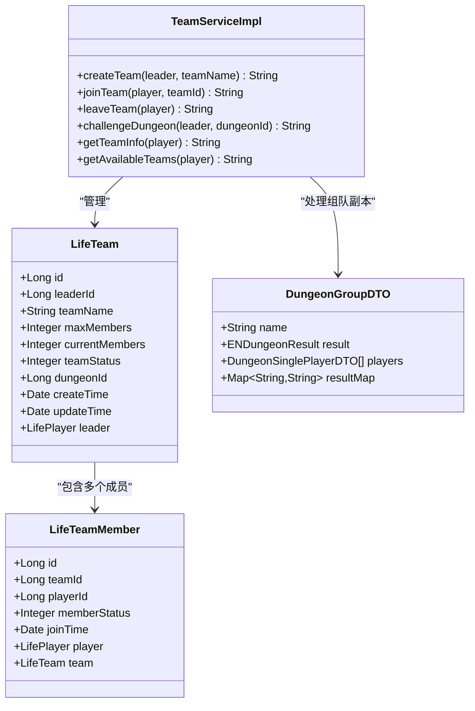
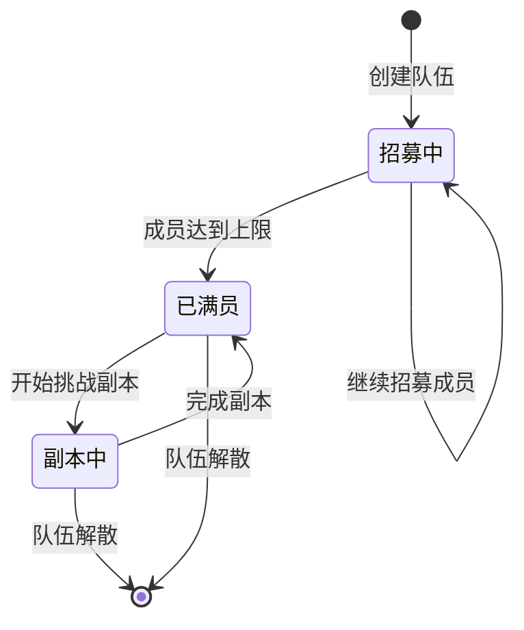
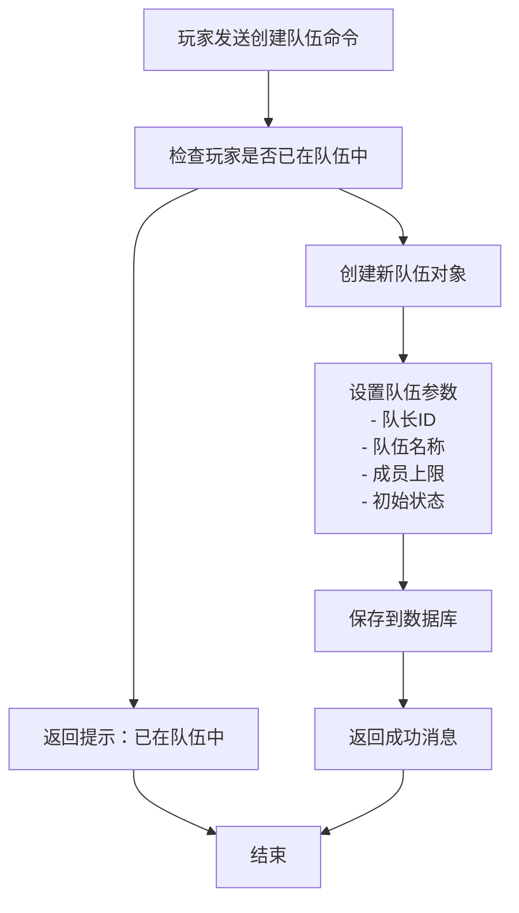
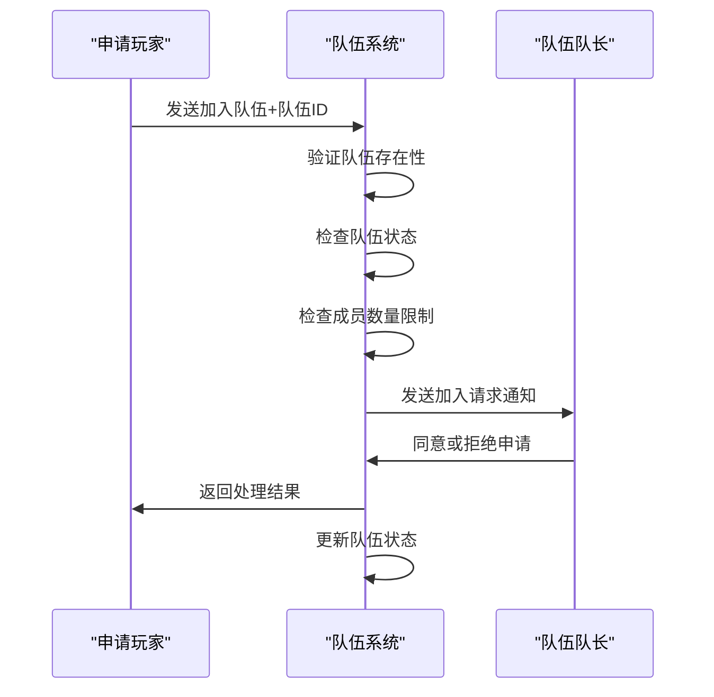
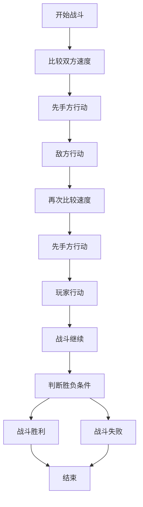
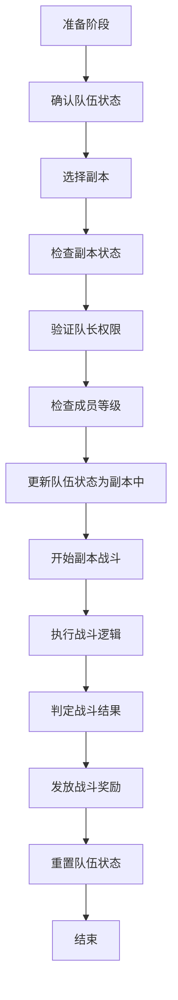
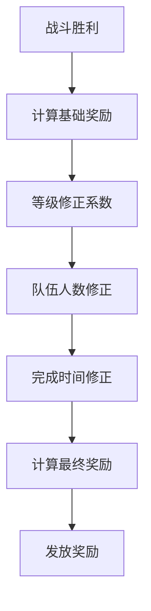

# 组队副本协作技巧

<cite>
**本文档引用的文件**
- [LifeHandlerImpl.java](file://Life/src/main/java/com/bot/life/service/impl/LifeHandlerImpl.java)
- [TeamServiceImpl.java](file://Life/src/main/java/com/bot/life/service/impl/TeamServiceImpl.java)
- [TeamService.java](file://Life/src/main/java/com/bot/life/service/TeamService.java)
- [LifeTeam.java](file://Life/src/main/java/com/bot/life/dao/entity/LifeTeam.java)
- [LifeTeamMember.java](file://Life/src/main/java/com/bot/life/dao/entity/LifeTeamMember.java)
- [BattleServiceImpl.java](file://Game/src/main/java/com/bot/game/service/impl/BattleServiceImpl.java)
- [DungeonGroupDTO.java](file://Game/src/main/java/com/bot/game/dto/DungeonGroupDTO.java)
- [CreateGroupPrinter.java](file://Game/src/main/java/com/bot/game/chain/menu/dungeon/CreateGroupPrinter.java)
- [JoinDungeonPrinter.java](file://Game/src/main/java/com/bot/game/chain/menu/dungeon/JoinDungeonPrinter.java)
- [DungeonWaitMenuPrinter.java](file://Game/src/main/java/com/bot/game/chain/menu/dungeon/DungeonWaitMenuPrinter.java)
- [BattleResult.java](file://Life/src/main/java/com/bot/life/dto/BattleResult.java)
- [TeamCdDetailData.java](file://Base/src/main/java/com/bot/base/dto/jx/teamcd/TeamCdDetailData.java)
- [TeamCdBossInfo.java](file://Base/src/main/java/com/bot/base/dto/jx/teamcd/TeamCdBossInfo.java)
</cite>

## 目录
1. [引言](#引言)
2. [组队系统架构](#组队系统架构)
3. [队伍创建与管理](#队伍创建与管理)
4. [成员招募与协作](#成员招募与协作)
5. [战斗协作策略](#战斗协作策略)
6. [副本挑战流程](#副本挑战流程)
7. [奖励分配机制](#奖励分配机制)
8. [团队协作技巧](#团队协作技巧)
9. [常见问题与解决方案](#常见问题与解决方案)
10. [总结](#总结)

## 引言

在《浮生卷》游戏中，组队副本是提升玩家实力和获取丰厚奖励的重要玩法。通过有效的团队协作，玩家可以更高效地挑战高难度副本，获得更好的游戏体验。本文档基于LifeHandlerImpl.java和TeamServiceImpl.java中的组队逻辑，详细说明如何进行组队副本挑战，包括队伍创建、成员管理、战斗协作和奖励分配等关键环节。

## 组队系统架构

### 系统核心组件

**图表来源**
- [LifeTeam.java](file://Life/src/main/java/com/bot/life/dao/entity/LifeTeam.java#L12-L26)
- [LifeTeamMember.java](file://Life/src/main/java/com/bot/life/dao/entity/LifeTeamMember.java#L12-L23)
- [TeamServiceImpl.java](file://Life/src/main/java/com/bot/life/service/impl/TeamServiceImpl.java#L17-L377)

### 队伍状态管理

队伍系统采用状态机设计，支持以下状态转换：

**节来源**
- [TeamServiceImpl.java](file://Life/src/main/java/com/bot/life/service/impl/TeamServiceImpl.java#L369-L376)

## 队伍创建与管理

### 队长职责

作为队长，您需要承担以下职责：

1. **队伍创建**：使用`创建队伍`命令发起组队
2. **成员管理**：审核成员申请，维护队伍秩序
3. **副本决策**：选择合适的副本和挑战时机
4. **沟通协调**：确保团队成员之间的有效沟通

### 队伍配置参数

| 参数 | 默认值 | 说明 |
|------|--------|------|
| 最大成员数 | 2人 | 单副本最多容纳2名玩家 |
| 队伍状态 | 0（招募中） | 表示队伍正在招募成员 |
| 副本状态 | 0（未开始） | 表示尚未进入副本 |
| 创建时间 | 当前时间 | 队伍成立的时间戳 |

**节来源**
- [TeamServiceImpl.java](file://Life/src/main/java/com/bot/life/service/impl/TeamServiceImpl.java#L36-L46)

### 队伍创建流程

**图表来源**
- [TeamServiceImpl.java](file://Life/src/main/java/com/bot/life/service/impl/TeamServiceImpl.java#L29-L47)

**节来源**
- [TeamServiceImpl.java](file://Life/src/main/java/com/bot/life/service/impl/TeamServiceImpl.java#L29-L47)

## 成员招募与协作

### 成员招募策略

1. **明确队伍目标**：确定副本类型和挑战难度
2. **技能互补**：确保队伍中有不同类型的战斗角色
3. **经验匹配**：优先招募等级相近的玩家
4. **沟通能力**：选择愿意配合的队友

### 加入队伍流程

**图表来源**
- [DungeonWaitMenuPrinter.java](file://Game/src/main/java/com/bot/game/chain/menu/dungeon/DungeonWaitMenuPrinter.java#L72-L85)
- [JoinDungeonPrinter.java](file://Game/src/main/java/com/bot/game/chain/menu/dungeon/JoinDungeonPrinter.java#L42-L65)

### 队伍状态查询

玩家可以通过以下方式查看可用队伍：

- **队伍列表**：显示所有可加入的队伍信息
- **队伍详情**：查看特定队伍的详细信息
- **成员状态**：了解队伍当前的成员构成

**节来源**
- [TeamServiceImpl.java](file://Life/src/main/java/com/bot/life/service/impl/TeamServiceImpl.java#L304-L316)

## 战斗协作策略

### 战斗系统基础

游戏采用回合制战斗系统，支持多种战斗动作：

| 战斗动作 | 说明 | 使用场景 |
|----------|------|----------|
| 攻击 | 对敌人造成物理伤害 | 普通战斗阶段 |
| 防御 | 减少受到的伤害 | 面临强敌时 |
| 技能 | 使用特殊技能攻击或辅助 | 战术需要时 |
| 道具 | 使用消耗品辅助战斗 | 战斗关键时刻 |
| 逃跑 | 逃离战斗场景 | 力量悬殊过大时 |

### 团队战斗协作

**图表来源**
- [BattleServiceImpl.java](file://Game/src/main/java/com/bot/game/service/impl/BattleServiceImpl.java#L189-L200)

### 战斗策略建议

1. **角色定位**：
   - **输出型**：专注于造成伤害
   - **坦克型**：承担主要伤害
   - **辅助型**：提供治疗和增益

2. **技能配合**：
   - 制定技能使用顺序
   - 避免技能冲突
   - 合理利用控制技能

3. **资源管理**：
   - 合理使用道具
   - 注意能量恢复
   - 保持血量健康

**节来源**
- [BattleServiceImpl.java](file://Game/src/main/java/com/bot/game/service/impl/BattleServiceImpl.java#L88-L122)

## 副本挑战流程

### 副本挑战步骤

**图表来源**
- [TeamServiceImpl.java](file://Life/src/main/java/com/bot/life/service/impl/TeamServiceImpl.java#L318-L355)

### 副本挑战要求

1. **队伍完整性**：必须达到最大成员数才能挑战
2. **副本开放性**：副本必须处于激活状态
3. **成员资格**：所有成员必须满足副本要求
4. **权限验证**：只有队长才有挑战权限

**节来源**
- [TeamServiceImpl.java](file://Life/src/main/java/com/bot/life/service/impl/TeamServiceImpl.java#L319-L339)

### 战斗结果处理

战斗结束后，系统会根据战斗结果进行相应处理：

- **胜利**：获得经验值、灵石和道具奖励
- **失败**：扣除一定体力，无奖励
- **逃跑**：视具体情况处理

**节来源**
- [BattleResult.java](file://Life/src/main/java/com/bot/life/dto/BattleResult.java#L11-L40)

## 奖励分配机制

### 奖励类型

游戏中的奖励分为以下几类：

| 奖励类型 | 说明 | 获取方式 |
|----------|------|----------|
| 灵粹奖励 | 提升修炼资质的资源 | 战斗胜利获得 |
| 修为奖励 | 提升境界的资源 | 战斗胜利获得 |
| 道具奖励 | 各种消耗品和装备 | 根据战斗表现获得 |
| 装备奖励 | 提升属性的装备 | 高难度副本掉落 |

### 奖励计算

**图表来源**
- [BattleResult.java](file://Life/src/main/java/com/bot/life/dto/BattleResult.java#L184-L193)

### 奖励分配原则

1. **按贡献分配**：根据战斗表现分配奖励
2. **公平原则**：确保每位成员都能获得相应奖励
3. **团队优先**：优先考虑团队整体利益
4. **激励机制**：鼓励成员积极参与团队活动

**节来源**
- [BattleResult.java](file://Life/src/main/java/com/bot/life/dto/BattleResult.java#L184-L193)

## 团队协作技巧

### 沟通协作要点

1. **明确分工**：每个成员清楚自己的职责
2. **及时反馈**：战斗中及时通报重要信息
3. **战术配合**：制定并执行团队战术
4. **互相支持**：在困难时刻给予队友支持

### 团队建设建议

1. **建立信任**：通过多次合作建立团队默契
2. **定期训练**：通过日常副本提升团队实力
3. **经验分享**：交流战斗经验和技巧
4. **目标一致**：确保团队成员有共同的目标

### 应对突发情况

1. **成员离线**：准备应对成员临时离线的方案
2. **战斗失误**：及时调整战术弥补失误
3. **资源不足**：合理分配有限的资源
4. **进度落后**：采取措施加快团队进度

## 常见问题与解决方案

### 队伍相关问题

**问题1：无法创建队伍**
- **原因**：玩家已在其他队伍中
- **解决方案**：先退出当前队伍再创建新队伍

**问题2：成员无法加入**
- **原因**：队伍已满员或队伍不存在
- **解决方案**：检查队伍状态或创建新的队伍

**问题3：队长权限不足**
- **原因**：非队长身份尝试挑战副本
- **解决方案**：确保由队长发起副本挑战

### 战斗相关问题

**问题1：战斗效率低**
- **原因**：缺乏团队协作或战术不当
- **解决方案**：制定明确的战斗策略，加强团队配合

**问题2：频繁失败**
- **原因**：队伍实力不足或准备不充分
- **解决方案**：提升队伍整体实力，做好充分准备

**问题3：奖励分配争议**
- **原因**：奖励分配不公或沟通不畅
- **解决方案**：建立明确的奖励分配规则，加强沟通

### 性能优化建议

1. **网络连接**：确保稳定的网络连接
2. **设备性能**：使用性能良好的设备
3. **内存管理**：及时清理不必要的数据
4. **并发控制**：避免同时进行过多操作

## 总结

组队副本协作是《浮生卷》游戏中的重要内容，成功的团队协作需要：

1. **完善的组织结构**：清晰的队伍管理和职责分工
2. **有效的沟通机制**：及时准确的信息传递
3. **合理的战术策略**：针对不同情况制定相应策略
4. **良好的团队氛围**：相互信任和支持的团队文化

通过掌握本文档介绍的组队副本协作技巧，玩家可以：
- 更高效地组建和管理团队
- 提升战斗协作能力
- 最大化副本挑战收益
- 获得更好的游戏体验

记住，团队的成功不仅依赖于个人实力，更取决于团队成员之间的默契配合和共同努力。祝各位玩家在组队副本挑战中取得优异成绩！