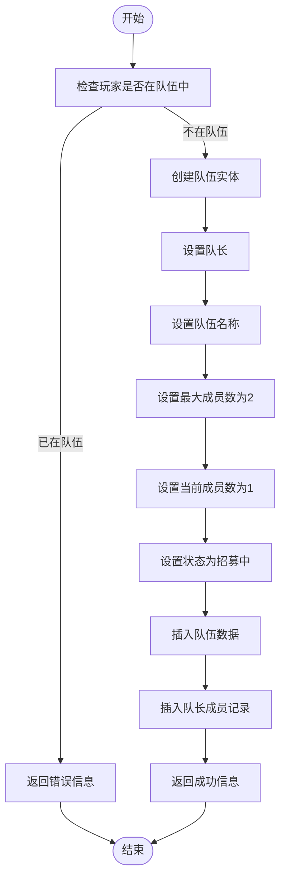
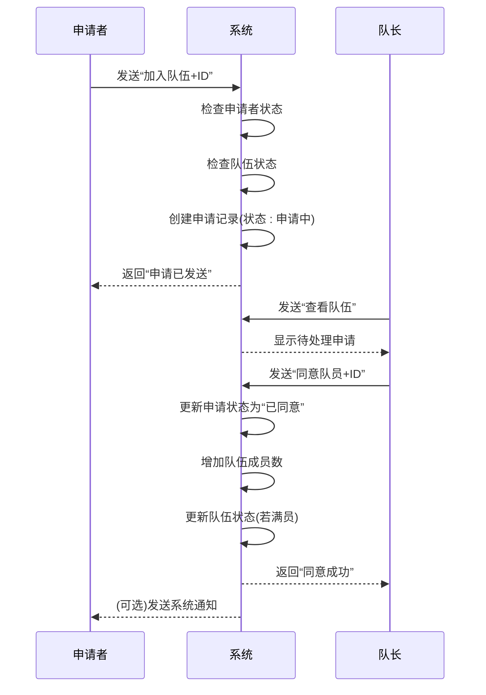
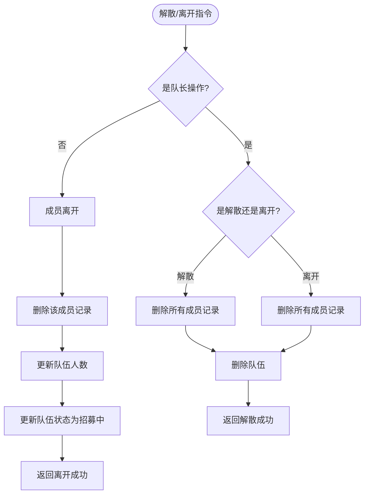
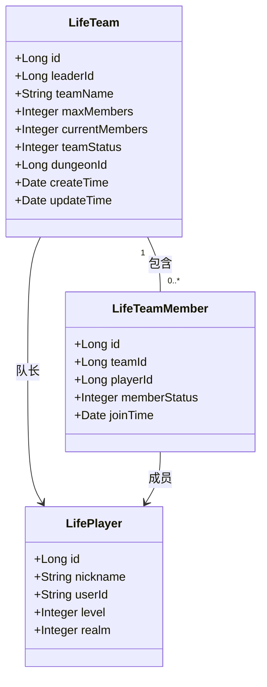

# 队伍管理技巧

<cite>
**本文档引用文件**  
- [Life_User_Manual.md](file://Life_User_Manual.md)
- [LifeHandlerImpl.java](file://Life\src\main\java\com\bot\life\service\impl\LifeHandlerImpl.java)
- [TeamServiceImpl.java](file://Life\src\main\java\com\bot\life\service\impl\TeamServiceImpl.java)
- [LifeTeam.java](file://Life\src\main\java\com\bot\life\dao\entity\LifeTeam.java)
- [LifeTeamMember.java](file://Life\src\main\java\com\bot\life\dao\entity\LifeTeamMember.java)
</cite>

## 目录
1. [引言](#引言)
2. [队伍创建](#队伍创建)
3. [成员邀请与审批](#成员邀请与审批)
4. [队伍解散](#队伍解散)
5. [队长职责与策略](#队长职责与策略)
6. [最佳实践总结](#最佳实践总结)

## 引言

在《浮生卷》这款修仙主题的文字RPG游戏中，组队副本是玩家协作挑战高难度内容的重要玩法。根据游戏设计，组队副本最多支持2人组队，由队长发起操作，队员以托管形式参与，奖励由队伍成员共享。高效的队伍管理不仅能提升副本挑战的成功率，还能增强玩家间的协作体验。

本文档基于《Life_User_Manual.md》中的组队副本说明和`LifeHandlerImpl.java`中的队伍管理逻辑，详细阐述队伍创建、成员邀请、审批流程和队伍解散的最佳实践，旨在帮助玩家建立高效的副本挑战团队。

**本文档引用文件**  
- [Life_User_Manual.md](file://Life_User_Manual.md)
- [LifeHandlerImpl.java](file://Life\src\main\java\com\bot\life\service\impl\LifeHandlerImpl.java)

## 队伍创建

创建队伍是组队副本的第一步。玩家需要确保自己当前未加入任何队伍，才能成功创建新队伍。

### 创建流程
1. **检查状态**：系统首先检查玩家是否已在队伍中。如果已在队伍中，将提示“你已经在队伍中了！请先离开当前队伍。”
2. **输入指令**：玩家发送“创建队伍+队伍名称”指令，例如“创建队伍+修仙小队”。
3. **队伍初始化**：系统创建队伍实体，设置队长为发起者，队伍名称为指定名称，最大成员数为2人，当前成员数为1人，队伍状态为“招募中”。
4. **返回信息**：创建成功后，系统返回队伍信息，包括队伍名称、队长、当前人数和队伍ID，其他玩家可通过队伍ID申请加入。

**图示来源**  
- [TeamServiceImpl.java](file://Life\src\main\java\com\bot\life\service\impl\TeamServiceImpl.java#L29-L63)

**本文档引用文件**  
- [TeamServiceImpl.java](file://Life\src\main\java\com\bot\life\service\impl\TeamServiceImpl.java#L29-L63)
- [LifeHandlerImpl.java](file://Life\src\main\java\com\bot\life\service\impl\LifeHandlerImpl.java#L756-L768)

## 成员邀请与审批

成员邀请与审批是队伍管理的核心环节，确保了队伍成员的合理加入。

### 申请加入
1. **检查状态**：申请者需确保自己未在任何队伍中。
2. **查找队伍**：通过发送“查看队伍”指令，获取当前可加入的队伍列表，包括队伍ID、名称、队长和人数。
3. **发送申请**：申请者发送“加入队伍+队伍ID”指令，例如“加入队伍+123”。
4. **系统处理**：系统检查队伍是否存在、是否已满员、是否处于招募状态，并确认申请者未重复申请。若条件满足，创建申请记录，状态为“申请中”。

### 审批流程
1. **查看申请**：队长在查看队伍信息时，会看到“待处理申请”列表，显示申请者的昵称和对应的处理指令。
2. **同意申请**：队长发送“同意队员+玩家ID”指令，例如“同意队员+456”。系统将申请者状态更新为“已同意”，队伍当前成员数加1。若队伍满员，状态更新为“已满员”。
3. **拒绝申请**：队长发送“拒绝队员+玩家ID”指令，例如“拒绝队员+456”。系统删除申请记录。

**图示来源**  
- [TeamServiceImpl.java](file://Life\src\main\java\com\bot\life\service\impl\TeamServiceImpl.java#L67-L153)
- [LifeHandlerImpl.java](file://Life\src\main\java\com\bot\life\service\impl\LifeHandlerImpl.java#L771-L795)

**本文档引用文件**  
- [TeamServiceImpl.java](file://Life\src\main\java\com\bot\life\service\impl\TeamServiceImpl.java#L67-L153)
- [LifeHandlerImpl.java](file://Life\src\main\java\com\bot\life\service\impl\LifeHandlerImpl.java#L771-L795)

## 队伍解散

队伍解散是队伍生命周期的结束，由队长或成员触发。

### 解散条件
- **队长解散**：队长发送“解散队伍”指令，系统删除队伍及其所有成员记录。
- **队长离开**：如果队长发送“离开队伍”指令，系统会自动解散整个队伍。
- **成员离开**：普通成员发送“离开队伍”指令，仅从队伍中移除自己，队伍继续存在（除非因此解散）。

### 解散流程
1. **触发**：队长或成员发送相应指令。
2. **验证**：系统验证操作者身份和队伍状态。
3. **执行**：
   - 若为队长解散或队长离开：删除所有成员记录，删除队伍。
   - 若为成员离开：删除该成员记录，更新队伍人数和状态（重新开放招募）。
4. **通知**：系统返回操作结果。

**图示来源**  
- [TeamServiceImpl.java](file://Life\src\main\java\com\bot\life\service\impl\TeamServiceImpl.java#L183-L238)
- [LifeHandlerImpl.java](file://Life\src\main\java\com\bot\life\service\impl\LifeHandlerImpl.java#L810-L815)

**本文档引用文件**  
- [TeamServiceImpl.java](file://Life\src\main\java\com\bot\life\service\impl\TeamServiceImpl.java#L183-L238)
- [LifeHandlerImpl.java](file://Life\src\main\java\com\bot\life\service\impl\LifeHandlerImpl.java#L810-L815)

## 队长职责与策略

队长在队伍管理中扮演着至关重要的角色，其决策直接影响队伍的效率和氛围。

### 核心职责
1. **队伍创建与命名**：创建一个清晰、有吸引力的队伍名称，便于识别。
2. **成员筛选**：及时处理申请，根据队员的等级、装备和活跃度进行筛选，确保队伍实力均衡。
3. **副本挑战**：当队伍满员后，作为队长可以发送“挑战副本+副本ID”指令，带领队伍进入副本。
4. **沟通协调**：在挑战前与队员沟通战术，确保双方对副本目标有共同理解。

### 管理策略
- **及时响应**：尽快处理成员的加入申请，避免让潜在队员等待过久。
- **明确沟通**：在队伍信息中或通过其他方式，明确说明队伍的目标副本和期望的队员要求。
- **公平公正**：在审批时，避免偏袒，根据游戏需求做出决策。
- **灵活调整**：如果队员临时离开，队长应迅速寻找替补或调整计划。

**图示来源**  
- [LifeTeam.java](file://Life\src\main\java\com\bot\life\dao\entity\LifeTeam.java)
- [LifeTeamMember.java](file://Life\src\main\java\com\bot\life\dao\entity\LifeTeamMember.java)

**本文档引用文件**  
- [LifeTeam.java](file://Life\src\main\java\com\bot\life\dao\entity\LifeTeam.java)
- [LifeTeamMember.java](file://Life\src\main\java\com\bot\life\dao\entity\LifeTeamMember.java)

## 最佳实践总结

为了建立一个高效的副本挑战团队，建议遵循以下最佳实践：

1. **快速组队**：创建队伍后，主动在聊天频道宣传，或寻找活跃玩家直接邀请，缩短组队时间。
2. **明确目标**：在队伍名称或信息中注明目标副本，如“创建队伍+火域副本小队”，避免无效申请。
3. **高效审批**：设定一个合理的审批时间窗口，对于长时间未响应的申请者，可以礼貌地拒绝并寻找其他队员。
4. **尊重队员**：即使拒绝申请，也应保持礼貌，维护良好的游戏社区氛围。
5. **善用系统**：充分利用“查看队伍”功能，了解当前服务器的组队情况，避免创建重复的队伍。

通过遵循这些技巧，玩家可以更有效地管理队伍，提升副本挑战的成功率和整体游戏体验。

**本文档引用文件**  
- [Life_User_Manual.md](file://Life_User_Manual.md)
- [TeamServiceImpl.java](file://Life\src\main\java\com\bot\life\service\impl\TeamServiceImpl.java)
- [LifeHandlerImpl.java](file://Life\src\main\java\com\bot\life\service\impl\LifeHandlerImpl.java)