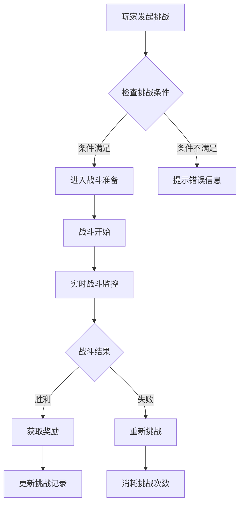
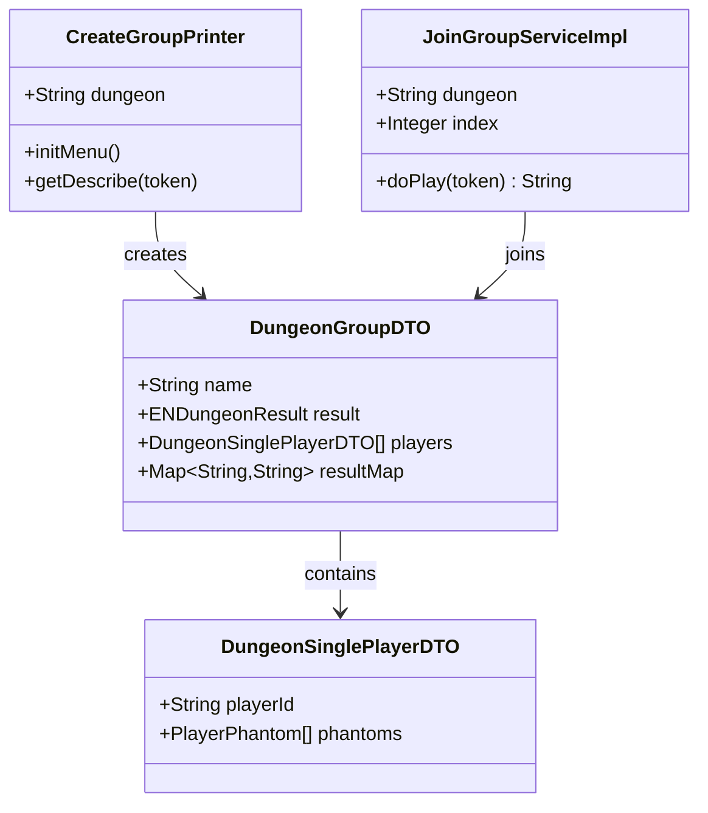
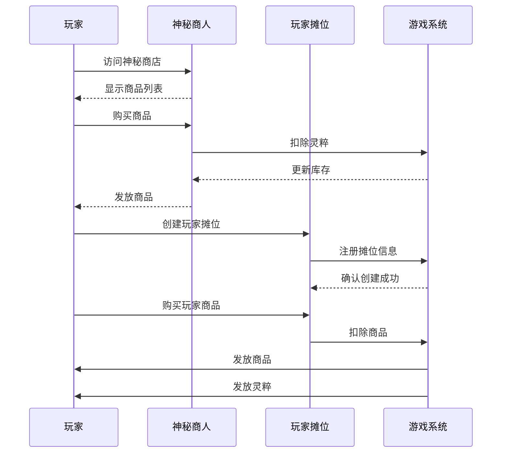
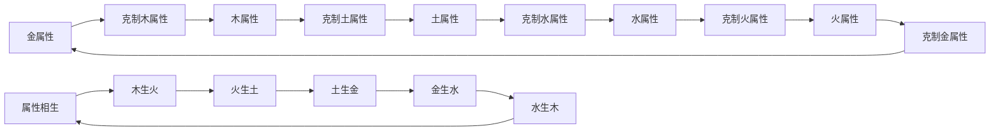
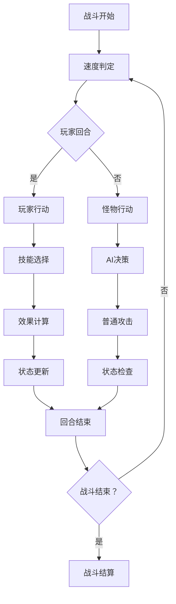
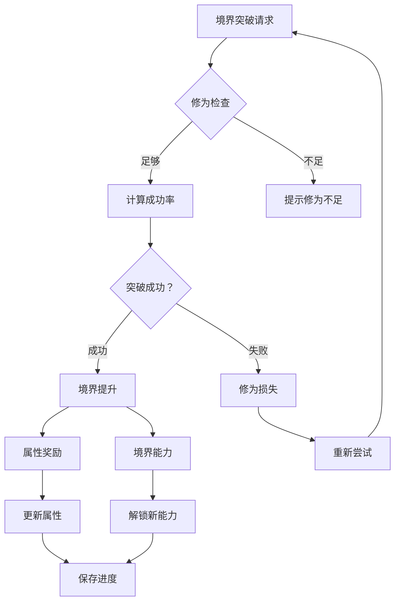

# 高级技巧

<cite>
**本文档引用的文件**
- [LifeHandlerImpl.java](file://Life/src/main/java/com/bot/life/service/impl/LifeHandlerImpl.java)
- [WorldBossServiceImpl.java](file://Life/src/main/java/com/bot/life/service/impl/WorldBossServiceImpl.java)
- [MarketServiceImpl.java](file://Life/src/main/java/com/bot/life/service/impl/MarketServiceImpl.java)
- [BattleServiceImpl.java](file://Life/src/main/java/com/bot/life/service/impl/BattleServiceImpl.java)
- [RealmServiceImpl.java](file://Life/src/main/java/com/bot/life/service/impl/RealmServiceImpl.java)
- [Life_Realm_Breakthrough_System.md](file://Life_Realm_Breakthrough_System.md)
- [ENAttribute.java](file://Life/src/main/java/com/bot/life/enums/ENAttribute.java)
- [ENSkillEffect.java](file://Game/src/main/java/com/bot/game/enums/ENSkillEffect.java)
- [DungeonGroupDTO.java](file://Game/src/main/java/com\bot\game\dto\DungeonGroupDTO.java)
- [EquipInfo.java](file://Base/src/main/java/com\bot\base\dto\jx\attribute\EquipInfo.java)
- [LifeEquipment.java](file://Life/src/main/java/com\bot\life\dao\entity\LifeEquipment.java)
</cite>

## 目录
1. [引言](#引言)
2. [世界BOSS挑战策略](#世界boss挑战策略)
3. [组队副本协作技巧](#组队副本协作技巧)
4. [鬼市交易优化方法](#鬼市交易优化方法)
5. [资源管理与属性搭配](#资源管理与属性搭配)
6. [战斗序列与技能组合](#战斗序列与技能组合)
7. [境界突破与属性强化](#境界突破与属性强化)
8. [高级战术建议](#高级战术建议)
9. [总结](#总结)

## 引言

本高级技巧文档专为有经验的玩家设计，基于LifeHandlerImpl.java中的高级功能实现，结合游戏核心机制深入分析，为您提供深度的游戏策略指导。通过掌握这些高级技巧，您将能够最大化游戏收益，提升战斗效率，并在修仙世界中脱颖而出。

## 世界BOSS挑战策略

### BOSS挑战系统架构

世界BOSS系统采用实时挑战机制，支持多玩家同时参与。系统通过精确的时间管理和战斗平衡算法，确保每位玩家都有公平的挑战机会。

**图表来源**
- [WorldBossServiceImpl.java](file://Life/src/main/java/com/bot/life/service/impl/WorldBossServiceImpl.java#L45-L52)

### 高效挑战策略

#### 1. 时间窗口利用
- **最佳挑战时机**：BOSS刷新后的黄金窗口期（通常为刷新后15分钟内）
- **团队协调**：提前组织好团队，在BOSS刷新前提前集结
- **装备检查**：确保所有成员携带最佳装备和充足补给

#### 2. 战斗准备清单
- **属性克制**：根据BOSS属性选择相应克制属性的玩家
- **技能配置**：确保关键技能已升级并处于冷却状态
- **药品准备**：携带足够的治疗药品和增益药品

#### 3. 团队协作模式
- **角色分工**：明确坦克、输出、辅助等角色定位
- **技能配合**：制定统一的技能释放时机和优先级
- **资源共享**：建立团队药品和道具共享机制

**节来源**
- [WorldBossServiceImpl.java](file://Life/src/main/java/com/bot/life/service/impl/WorldBossServiceImpl.java#L45-L52)

## 组队副本协作技巧

### 副本组队系统

组队副本系统支持动态组队和实时协作，通过智能匹配算法确保队伍平衡和战斗效率。

**图表来源**
- [DungeonGroupDTO.java](file://Game/src/main/java/com\bot\game\dto\DungeonGroupDTO.java#L1-L25)
- [CreateGroupPrinter.java](file://Game/src/main/java/com\bot\game\chain\menu\dungeon\CreateGroupPrinter.java#L1-L58)

### 高效组队策略

#### 1. 队伍构建原则
- **属性平衡**：确保队伍包含不同属性的玩家
- **职业互补**：坦克、输出、治疗角色合理分配
- **装备协同**：装备属性相互增强的玩家优先组队

#### 2. 战斗协作技巧
- **技能连携**：制定技能释放序列，最大化群体伤害
- **状态控制**：优先控制敌方关键单位
- **资源管理**：合理分配药品和增益道具使用时机

#### 3. 动态调整策略
- **实时监控**：关注队伍成员状态变化
- **战术调整**：根据战斗进程灵活改变策略
- **撤退时机**：及时识别不利局面，果断撤退保存实力

**节来源**
- [CreateGroupPrinter.java](file://Game/src/main/java/com\bot\game\chain\menu\dungeon\CreateGroupPrinter.java#L1-L58)
- [JoinGroupServiceImpl.java](file://Game/src/main/java/com\bot\game\service\impl\dungeon\JoinGroupServiceImpl.java#L1-L58)

## 鬼市交易优化方法

### 鬼市经济系统

鬼市作为游戏的核心交易平台，提供神秘商人系统和玩家间交易功能，形成完整的经济生态。

**图表来源**
- [MarketServiceImpl.java](file://Life/src/main/java/com/bot/life/service/impl/MarketServiceImpl.java#L1-L49)
- [LifeHandlerImpl.java](file://Life/src/main/java/com/bot/life/service/impl/LifeHandlerImpl.java#L960-L1070)

### 高效交易策略

#### 1. 商店定价策略
- **每日刷新**：利用神秘商人每日折扣进行批量采购
- **价格波动**：观察市场供需关系，把握买卖时机
- **稀缺品囤积**：重点关注稀有道具和装备的采购

#### 2. 摊位经营技巧
- **商品选择**：选择市场需求大且稳定的商品
- **价格策略**：参考市场价格设定合理售价
- **库存管理**：保持充足的库存应对突发需求

#### 3. 投机交易方法
- **套利机会**：在不同渠道间寻找价格差异
- **热点追踪**：关注游戏内热点事件和道具需求
- **风险控制**：分散投资，避免过度集中于单一商品

**节来源**
- [MarketServiceImpl.java](file://Life/src/main/java/com/bot/life/service/impl/MarketServiceImpl.java#L1-L49)
- [LifeHandlerImpl.java](file://Life/src/main/java/com/bot/life/service/impl/LifeHandlerImpl.java#L960-L1070)

## 资源管理与属性搭配

### 属性系统机制

游戏采用五行相生相克的属性体系，通过精确的数值计算和效果叠加，形成丰富的策略深度。

**图表来源**
- [ENAttribute.java](file://Life/src/main/java/com/bot/life/enums/ENAttribute.java#L40-L64)

### 高效资源管理

#### 1. 装备属性优化
- **五行搭配**：合理配置不同属性的装备，形成属性链
- **精炼策略**：优先精炼关键属性的装备
- **套装效果**：追求套装属性加成的最大化

#### 2. 属性培养方案
- **属性克制**：针对特定敌人选择克制属性
- **相生关系**：利用属性相生提高整体战斗力
- **平衡发展**：避免单一属性过度强化

#### 3. 资源分配策略
- **优先级排序**：根据战斗频率和重要性分配资源
- **长期规划**：为境界突破和技能升级预留资源
- **应急储备**：保持一定比例的应急资源

**节来源**
- [ENAttribute.java](file://Life/src/main/java/com/bot/life/enums/ENAttribute.java#L40-L64)
- [EquipInfo.java](file://Base/src/main/java/com\bot\base\dto\jx\attribute\EquipInfo.java#L1-L71)

## 战斗序列与技能组合

### 战斗系统架构

战斗系统采用回合制机制，结合技能效果、状态控制和属性克制，形成复杂的战斗策略。

**图表来源**
- [BattleServiceImpl.java](file://Life/src/main/java/com/bot/life/service/impl/BattleServiceImpl.java#L1-L200)

### 高效战斗策略

#### 1. 技能释放时机
- **冷却管理**：合理安排技能冷却时间
- **状态控制**：优先使用控制类技能
- **爆发输出**：在关键时刻释放高伤害技能

#### 2. 效果叠加机制
- **Buff管理**：最大化正面效果持续时间
- **Debuff应用**：有效施加负面效果
- **状态清理**：及时移除不利状态

#### 3. 属性克制运用
- **克制判断**：准确识别敌方属性
- **克制发挥**：利用属性优势造成额外伤害
- **反制策略**：针对克制关系制定应对方案

**节来源**
- [BattleServiceImpl.java](file://Life/src/main/java/com/bot/life/service/impl/BattleServiceImpl.java#L1-L200)
- [ENSkillEffect.java](file://Game/src/main/java/com\bot\game\enums\ENSkillEffect.java#L28-L83)

## 境界突破与属性强化

### 境界系统机制

境界突破系统采用概率机制和属性奖励，为玩家提供持续成长的动力和策略选择。

**图表来源**
- [RealmServiceImpl.java](file://Life/src/main/java/com/bot/life/service/impl/RealmServiceImpl.java#L71-L245)

### 高效突破策略

#### 1. 突破时机选择
- **修为积累**：在突破成功率较高时进行
- **资源准备**：确保有足够的突破材料
- **状态检查**：避免在不利状态下尝试突破

#### 2. 属性奖励优化
- **属性评估**：根据战斗风格选择最适合的属性
- **平衡发展**：避免过度依赖单一属性
- **长期规划**：考虑未来发展的属性需求

#### 3. 成功率提升
- **运气管理**：合理安排突破次数
- **资源投入**：在关键时刻投入更多资源
- **状态调整**：保持最佳状态进行突破

**节来源**
- [RealmServiceImpl.java](file://Life/src/main/java/com/bot/life/service/impl/RealmServiceImpl.java#L71-L245)
- [Life_Realm_Breakthrough_System.md](file://Life_Realm_Breakthrough_System.md#L37-L84)

## 高级战术建议

### 综合策略指南

基于游戏核心机制的深度分析，以下是经过验证的高级战术建议：

#### 1. 游戏节奏掌控
- **资源分配**：建立科学的资源分配体系
- **时间管理**：合理安排各项活动的时间投入
- **优先级设置**：根据当前阶段确定行动优先级

#### 2. 战略规划
- **长期目标**：设定清晰的长期发展目标
- **短期计划**：制定可执行的短期行动计划
- **灵活调整**：根据游戏进展及时调整策略

#### 3. 风险控制
- **保守策略**：在不确定情况下采取保守策略
- **备份方案**：为关键目标准备备用方案
- **止损机制**：及时止损，避免重大损失

## 总结

本高级技巧文档涵盖了游戏的核心机制和深度策略，通过掌握这些技巧，您将能够在修仙世界中取得显著优势。记住，游戏的核心在于策略和规划，只有不断学习和实践，才能成为真正的修仙大师。

建议玩家：
- 定期回顾和更新自己的策略
- 关注游戏更新和平衡调整
- 与其他高手交流学习经验
- 保持耐心和持续投入

祝您在修仙之旅中取得辉煌成就！