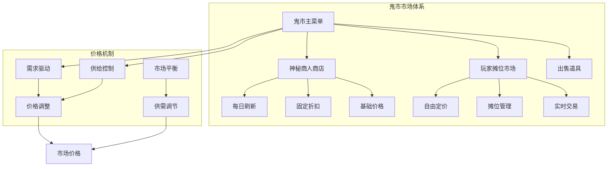
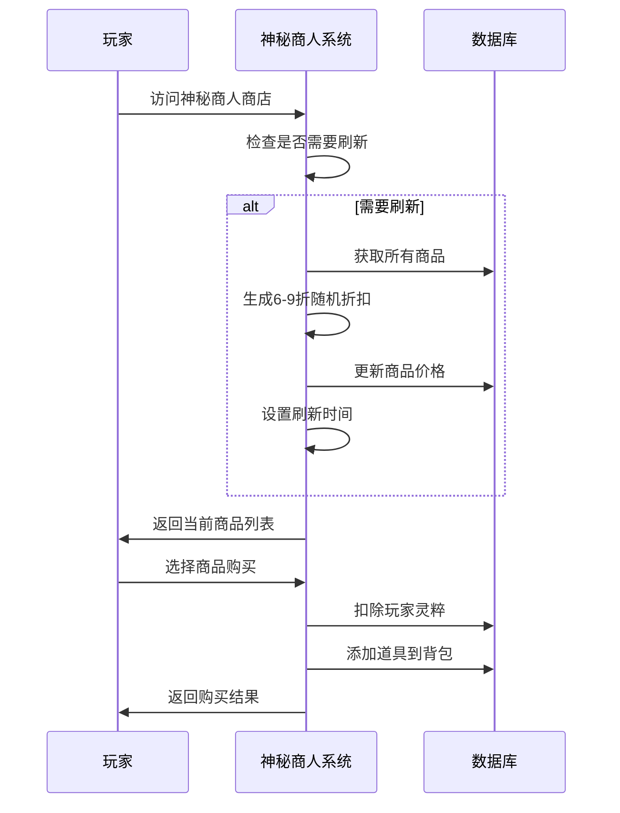
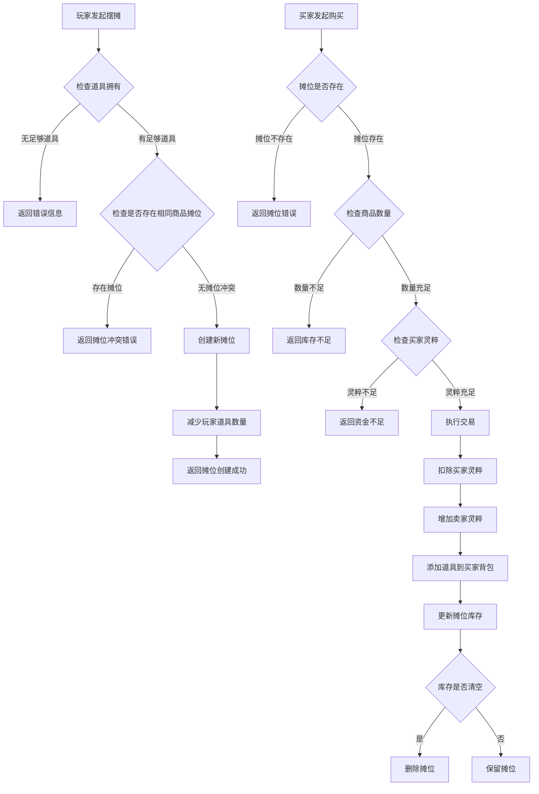
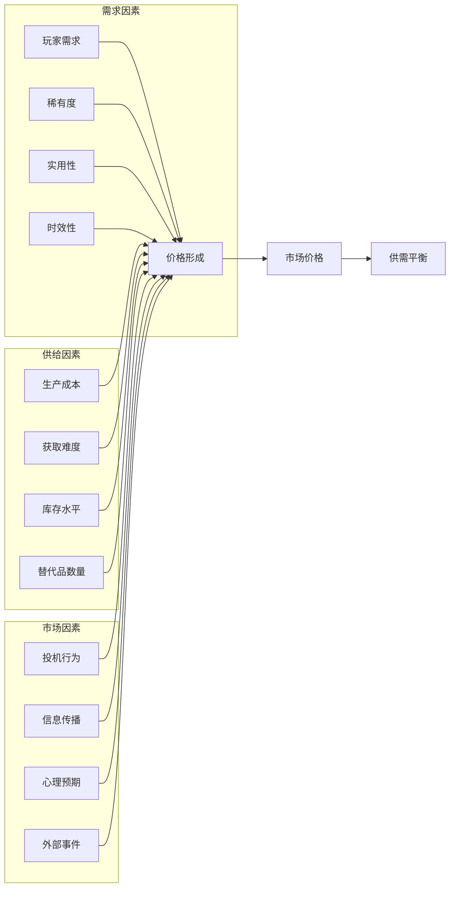
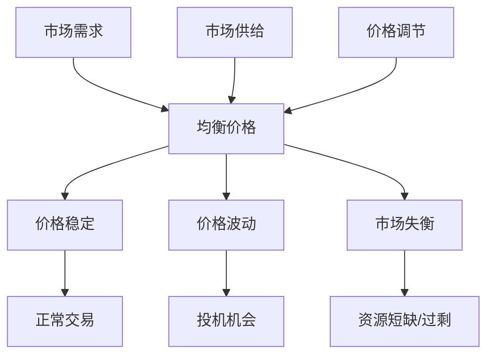

# 供需关系

<cite>
**本文档引用的文件**
- [Life_User_Manual.md](file://Life_User_Manual.md)
- [MarketServiceImpl.java](file://Life\src\main\java\com\bot\life\service\impl\MarketServiceImpl.java)
- [MarketService.java](file://Life\src\main\java\com\bot\life\service\MarketService.java)
- [LifeShop.java](file://Life\src\main\java\com\bot\life\dao\entity\LifeShop.java)
- [LifePlayerStall.java](file://Life\src\main\java\com\bot\life\dao\entity\LifePlayerStall.java)
- [ENItemType.java](file://Life\src\main\java\com\bot\life\enums\ENItemType.java)
- [InventoryService.java](file://Life\src\main\java\com\bot\life\service\InventoryService.java)
- [LifeHandlerImpl.java](file://Life\src\main\java\com\bot\life\service\impl\LifeHandlerImpl.java)
- [Life_Method_Call_Fix.md](file://Life_Method_Call_Fix.md)
- [Life_Database_Init.sql](file://Life_Database_Init.sql)
</cite>

## 目录
1. [引言](#引言)
2. [市场机制概述](#市场机制概述)
3. [神秘商人市场](#神秘商人市场)
4. [玩家摊位市场](#玩家摊位市场)
5. [价格形成机制](#价格形成机制)
6. [供需平衡分析](#供需平衡分析)
7. [市场策略指南](#市场策略指南)
8. [价格波动因素](#价格波动因素)
9. [市场优化建议](#市场优化建议)
10. [总结](#总结)

## 引言

在《浮生卷》这款修仙主题的文字RPG游戏中，市场机制是玩家经济活动的核心组成部分。游戏提供了两种主要的市场形式：神秘商人市场和玩家摊位市场。这两种市场共同构成了一个动态的供需平衡系统，影响着游戏内各种道具和装备的价格形成。

本文档基于游戏的实际代码实现，深入分析市场供需关系的形成机制，为玩家提供有效的交易策略和市场洞察。

## 市场机制概述

### 市场类型架构

游戏市场采用双轨制结构，包含两个相互独立但又相互关联的市场体系：

**图表来源**
- [MarketServiceImpl.java](file://Life\src\main\java\com\bot\life\service\impl\MarketServiceImpl.java#L46-L81)
- [MarketService.java](file://Life\src\main\java\com\bot\life\service\MarketService.java#L8-L81)

### 市场参与主体

市场参与者包括：

1. **玩家玩家**：参与买卖交易的普通玩家
2. **神秘商人**：系统控制的NPC，提供固定商品
3. **系统机制**：自动维护市场平衡的后台逻辑

**章节来源**
- [MarketServiceImpl.java](file://Life\src\main\java\com\bot\life\service\impl\MarketServiceImpl.java#L25-L42)

## 神秘商人市场

### 商店运营机制

神秘商人市场采用每日刷新制度，确保商品价格的动态变化：

**图表来源**
- [MarketServiceImpl.java](file://Life\src\main\java\com\bot\life\service\impl\MarketServiceImpl.java#L356-L377)

### 价格计算模型

神秘商人的价格机制遵循以下公式：

| 参数 | 描述 | 计算方式 |
|------|------|----------|
| 基础价格 | 商品原始定价 | 数据库预设 |
| 折扣范围 | 每日随机折扣 | 60%-90% |
| 当前价格 | 实际销售价格 | 基础价格 × 折扣 |
| 刷新频率 | 价格更新周期 | 每日0点 |

**章节来源**
- [MarketServiceImpl.java](file://Life\src\main\java\com\bot\life\service\impl\MarketServiceImpl.java#L369-L375)
- [LifeShop.java](file://Life\src\main\java\com\bot\life\dao\entity\LifeShop.java#L17-L20)

### 商品类型分类

神秘商人提供的商品按类型分为六种：

| 类型代码 | 商品类型 | 特点 | 价格机制 |
|----------|----------|------|----------|
| 1 | 修为类 | 直接增加修为 | 固定基础价格 |
| 2 | 属性类 | 永久属性提升 | 基于属性价值 |
| 3 | 体力类 | 恢复体力值 | 基于恢复效率 |
| 4 | 升级法宝类 | 增加法宝熟练度 | 基于法宝价值 |
| 5 | 恢复类 | 战斗中使用恢复 | 基于使用频率 |
| 6 | 技能书 | 学习新技能 | 基于技能强度 |

**章节来源**
- [ENItemType.java](file://Life\src\main\java\com\bot\life\enums\ENItemType.java#L8-L13)
- [MarketServiceImpl.java](file://Life\src\main\java\com\bot\life\service\impl\MarketServiceImpl.java#L133-L144)

## 玩家摊位市场

### 摊位创建机制

玩家摊位市场允许玩家自由定价，创造了一个完全由市场力量驱动的价格体系：

**图表来源**
- [MarketServiceImpl.java](file://Life\src\main\java\com\bot\life\service\impl\MarketServiceImpl.java#L256-L354)

### 自由定价特点

玩家摊位市场具有以下显著特点：

1. **完全自由定价**：卖家可以设定任意价格
2. **单一商品限制**：每个玩家只能为同一种商品开设一个摊位
3. **实时交易**：交易即时完成，无延迟
4. **无中间费用**：系统不抽取交易佣金

**章节来源**
- [MarketServiceImpl.java](file://Life\src\main\java\com\bot\life\service\impl\MarketServiceImpl.java#L264-L268)

### 摊位管理功能

玩家摊位系统提供完整的管理功能：

| 功能 | 描述 | 实现方式 |
|------|------|----------|
| 摊位浏览 | 查看所有开放摊位 | 查询数据库摊位表 |
| 商品详情 | 查看摊位具体信息 | 显示商品名称、数量、单价 |
| 购买功能 | 从摊位购买商品 | 执行价格计算和库存更新 |
| 库存管理 | 自动处理售罄摊位 | 删除无库存摊位记录 |

**章节来源**
- [MarketServiceImpl.java](file://Life\src\main\java\com\bot\life\service\impl\MarketServiceImpl.java#L221-L252)

## 价格形成机制

### 价格驱动因素

市场价格受多种因素影响，形成复杂的供需关系：

### 价格弹性分析

不同类型的道具具有不同的价格弹性特征：

| 道具类型 | 价格弹性 | 影响因素 | 价格稳定性 |
|----------|----------|----------|------------|
| 修为类道具 | 高弹性 | 修炼进度、经验需求 | 中等 |
| 属性类道具 | 中弹性 | 角色发展、战斗需求 | 高 |
| 体力类道具 | 低弹性 | 日常活动、战斗频率 | 很高 |
| 恢复类道具 | 中弹性 | 战斗频率、风险承受 | 中等 |
| 技能书 | 高弹性 | 技能学习、战斗策略 | 中等 |

**章节来源**
- [ENItemType.java](file://Life\src\main\java\com\bot\life\enums\ENItemType.java#L8-L13)

### 价格发现过程

市场价格通过以下过程逐步形成：

1. **信息收集阶段**：玩家观察市场行情
2. **决策制定阶段**：根据需求确定购买/出售意愿
3. **交易执行阶段**：达成买卖协议
4. **价格调整阶段**：根据交易结果调整预期

## 供需平衡分析

### 供需曲线模型

基于游戏市场特性，可以构建简化的供需曲线模型：

### 平衡状态判断

市场处于平衡状态的标志：

1. **价格稳定**：连续多个交易日价格无明显波动
2. **成交量适中**：每日交易量保持在合理范围内
3. **库存充足**：各类商品库存维持在安全水平
4. **买卖双方满意**：买卖双方都能接受当前价格

### 失衡状态识别

市场失衡的表现：

1. **价格过高**：商品价格远高于玩家预期
2. **价格过低**：商品价格低于合理价值
3. **交易停滞**：长时间无交易发生
4. **库存积压**：某类商品库存过多

**章节来源**
- [MarketServiceImpl.java](file://Life\src\main\java\com\bot\life\service\impl\MarketServiceImpl.java#L308-L313)

## 市场策略指南

### 卖家策略

#### 1. 稀有道具定价策略

对于稀有度高的道具，建议采用以下定价策略：

- **成本加成法**：在基础成本上增加20-30%利润
- **市场比较法**：参考同类道具市场价格
- **价值定位法**：根据道具对玩家的价值定价

#### 2. 时效性商品策略

针对时效性强的商品：

- **早期定价**：在需求高峰期前建立价格优势
- **促销策略**：在需求低谷期适当降价
- **捆绑销售**：与其他商品组合销售

#### 3. 库存管理策略

- **定期检查**：每日检查库存状况
- **价格调整**：根据库存水平调整价格
- **及时补货**：在价格有利时补充库存

### 买家策略

#### 1. 采购时机选择

- **价格低位**：在神秘商人商店刷新时购买
- **摊位促销**：关注低价摊位的出现
- **批量采购**：在价格较低时大量购买

#### 2. 预算管理

- **分散投资**：不要将所有灵粹投入单一商品
- **风险控制**：设置单次交易的最大损失限额
- **长期规划**：根据角色发展计划制定采购策略

#### 3. 信息收集

- **市场监控**：定期查看市场行情
- **趋势分析**：跟踪商品价格走势
- **社区交流**：与其他玩家分享市场信息

**章节来源**
- [MarketServiceImpl.java](file://Life\src\main\java\com\bot\life\service\impl\MarketServiceImpl.java#L256-L295)

## 价格波动因素

### 外部环境因素

1. **游戏版本更新**：新功能上线可能改变道具价值
2. **活动影响**：限时活动期间某些道具需求激增
3. **玩家群体变化**：新玩家加入或老玩家流失
4. **竞争产品**：类似游戏的流行程度

### 内部机制因素

1. **神秘商人刷新**：每日价格变动影响整体市场
2. **摊位活跃度**：卖家数量和积极性影响供给
3. **玩家行为模式**：购买习惯和偏好变化
4. **系统维护**：服务器重启可能短暂影响交易

### 心理因素

1. **羊群效应**：玩家跟随他人交易行为
2. **锚定效应**：依赖历史价格作为参考
3. **损失厌恶**：避免亏损的心理倾向
4. **过度自信**：高估自己判断准确性的倾向

## 市场优化建议

### 对于玩家

#### 1. 建立个人市场档案

- **记录交易历史**：跟踪每次交易的价格和数量
- **分析收益情况**：计算平均利润率
- **识别最佳时机**：找出最有利的交易时段

#### 2. 构建多元化投资组合

- **分散风险**：不要过度集中于单一类型商品
- **平衡收益**：结合高风险高回报和稳定收益商品
- **适时调整**：根据市场变化调整投资策略

#### 3. 加强市场情报收集

- **建立信息网络**：与其他玩家建立交易联系
- **关注市场动态**：及时了解市场变化
- **预测价格趋势**：培养价格走势判断能力

### 对于系统设计

#### 1. 完善市场监控机制

- **实时价格追踪**：监控关键商品价格变化
- **异常检测**：识别价格异常波动
- **趋势分析**：分析市场长期发展趋势

#### 2. 优化用户体验

- **简化操作流程**：减少交易步骤复杂度
- **提供市场工具**：增加价格查询、统计功能
- **改善信息展示**：提供更直观的市场信息

#### 3. 维护市场秩序

- **打击恶意行为**：防止价格操纵和欺诈
- **保护新手玩家**：提供交易指导和保护
- **促进公平竞争**：确保市场机会均等

**章节来源**
- [MarketServiceImpl.java](file://Life\src\main\java\com\bot\life\service\impl\MarketServiceImpl.java#L356-L377)

## 总结

《浮生卷》的游戏市场机制体现了现代经济学中供需关系的基本原理。通过神秘商人市场和玩家摊位市场的有机结合，游戏创造了一个既受系统控制又充满市场活力的经济环境。

### 关键要点

1. **双重市场结构**：神秘商人提供稳定的基准价格，玩家市场提供灵活的自由定价
2. **动态价格机制**：每日神秘商人刷新和实时玩家交易共同塑造市场价格
3. **供需平衡**：市场通过价格信号自动调节供需关系
4. **策略多样性**：不同类型的道具需要采用不同的交易策略

### 实践建议

- **深入了解市场**：掌握各类道具的特性和价值
- **把握交易时机**：在价格有利时进行买卖
- **分散投资风险**：不要将所有资源集中在单一商品
- **持续学习改进**：根据市场变化不断调整策略

通过深入理解和运用这些市场机制，玩家可以在《浮生卷》的经济体系中获得竞争优势，实现财富的稳健增长。市场永远在变化，但基本的供需原理始终不变，掌握这些原理将帮助玩家在修仙之路上走得更远。