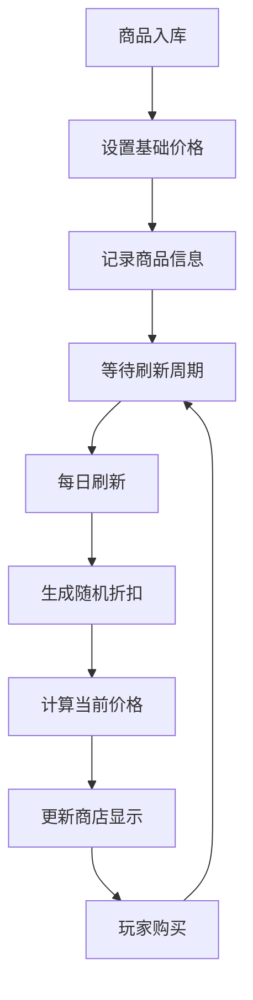
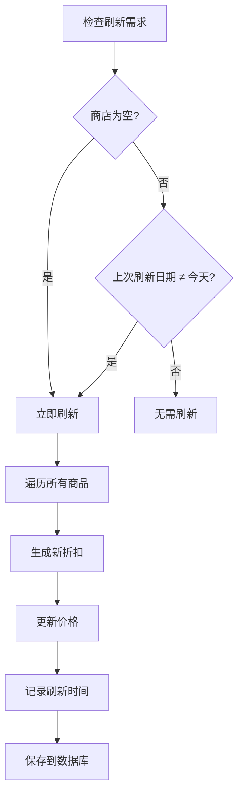
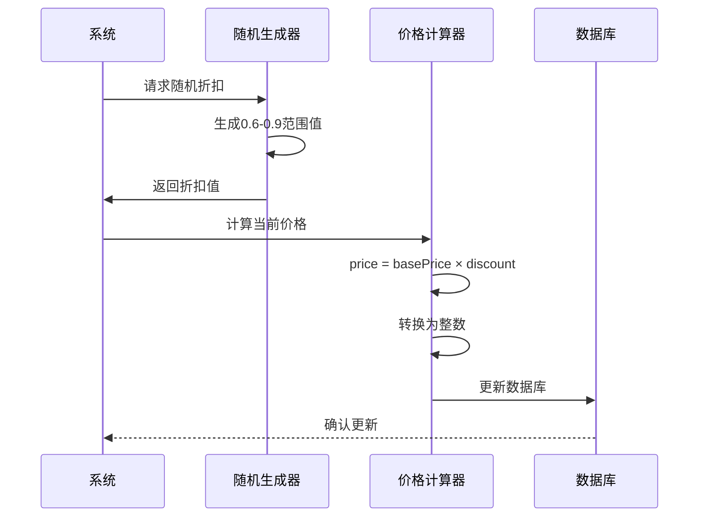
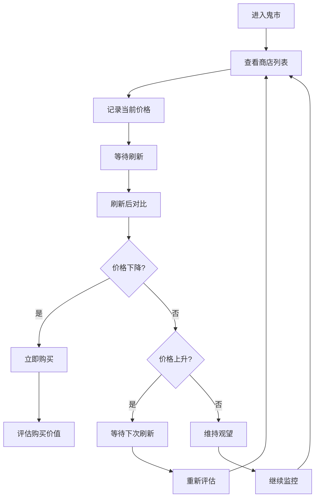
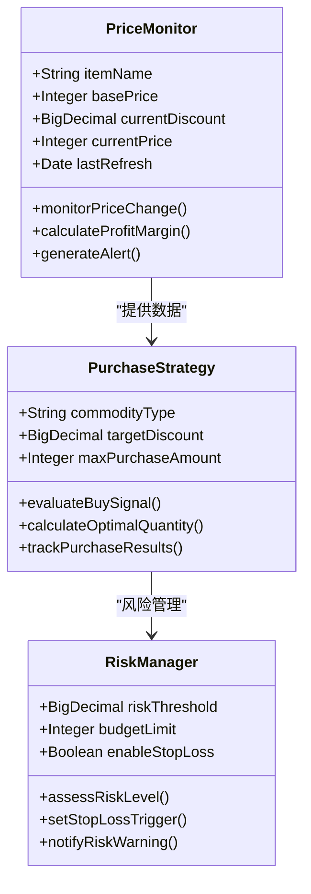
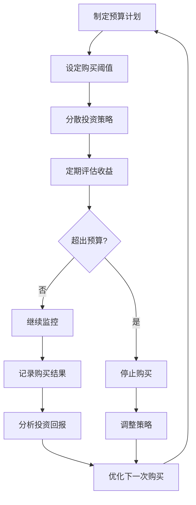

# 定价规律

<cite>
**本文档引用的文件**
- [Life_User_Manual.md](file://Life_User_Manual.md)
- [MarketServiceImpl.java](file://Life\src\main\java\com\bot\life\service\impl\MarketServiceImpl.java)
- [MarketService.java](file://Life\src\main\java\com\bot\life\service\MarketService.java)
- [LifeShop.java](file://Life\src\main\java\com\bot\life\dao\entity\LifeShop.java)
- [LifeShopMapper.java](file://Life\src\main\java\com\bot\life\dao\mapper\LifeShopMapper.java)
- [LifeShopMapper.xml](file://Life\src\main\resources\mapper\LifeShopMapper.xml)
- [Life_Database_Init.sql](file://Life_Database_Init.sql)
- [浮生卷开发说明.md](file://浮生卷开发说明.md)
</cite>

## 目录
1. [概述](#概述)
2. [价格形成机制](#价格形成机制)
3. [每日刷新机制](#每日刷新机制)
4. [价格计算逻辑](#价格计算逻辑)
5. [商品分类与定价](#商品分类与定价)
6. [价格波动周期](#价格波动周期)
7. [最佳购买策略](#最佳购买策略)
8. [价格监控方法](#价格监控方法)
9. [风险控制与建议](#风险控制与建议)
10. [总结](#总结)

## 概述

神秘商人商店是《浮生卷》游戏中一个重要的经济系统，为玩家提供了稳定且具有规律性的商品交易平台。该系统采用每日刷新的价格机制，结合6-9折的随机折扣，形成了独特的定价规律。理解这些规律对于玩家制定有效的购买策略至关重要。

### 核心特点

- **每日刷新**：商店商品价格和折扣每24小时重置一次
- **随机折扣**：6-9折之间的随机折扣范围
- **基础价格体系**：所有商品都有固定的基准价格
- **动态调整**：价格随折扣变化而实时更新

## 价格形成机制

### 商品基础价格

每个商店商品都设有固定的基础价格（basePrice），这是商品的原始定价标准。基础价格由系统管理员预先设定，反映了商品的市场价值和稀有程度。



**图表来源**
- [MarketServiceImpl.java](file://Life\src\main\java\com\bot\life\service\impl\MarketServiceImpl.java#L356-L377)

### 折扣机制原理

神秘商人采用6-9折的随机折扣机制，这种设计确保了价格的不确定性，同时保持了可预测性。折扣范围的选择经过精心设计：

- **最低折扣**：6折（0.6）确保玩家始终能获得优惠
- **最高折扣**：9折（0.9）提供最大优惠空间
- **随机性**：每次刷新产生新的折扣值

**节来源**
- [MarketServiceImpl.java](file://Life\src\main\java\com\bot\life\service\impl\MarketServiceImpl.java#L370-L372)

## 每日刷新机制

### 刷新触发条件

价格刷新机制采用智能检测算法，确保价格更新的及时性和准确性：



**图表来源**
- [MarketServiceImpl.java](file://Life\src\main\java\com\bot\life\service\impl\MarketServiceImpl.java#L358-L367)

### 时间检测算法

系统使用精确的时间检测算法来判断是否需要刷新：

- **日期比较**：比较lastRefreshDate与当前日期
- **跨天检测**：确保只在新的一天开始时刷新
- **空值处理**：正确处理新商品的首次刷新

**节来源**
- [MarketServiceImpl.java](file://Life\src\main\java\com\bot\life\service\impl\MarketServiceImpl.java#L380-L393)

## 价格计算逻辑

### 核心计算公式

当前价格的计算遵循以下数学公式：

```
当前价格 = 基础价格 × 折扣系数
```

其中：
- **基础价格**：商品的原始定价
- **折扣系数**：6-9折之间的随机值（0.6 ≤ 折扣 ≤ 0.9）

### 价格精度控制

系统采用整数运算确保价格的实用性：



**图表来源**
- [MarketServiceImpl.java](file://Life\src\main\java\com\bot\life\service\impl\MarketServiceImpl.java#L371-L373)

**节来源**
- [MarketServiceImpl.java](file://Life\src\main\java\com\bot\life\service\impl\MarketServiceImpl.java#L370-L373)

## 商品分类与定价

### 道具类型分类

根据《浮生卷》的游戏设计，商店商品按功能分为以下类型：

| 类型编号 | 商品类型 | 价格特点 | 购买价值 |
|---------|---------|---------|---------|
| 1 | 修为类 | 基础价格较低 | 长期收益高 |
| 2 | 属性类 | 中等基础价格 | 立即提升战力 |
| 3 | 体力类 | 基础价格适中 | 日常消耗品 |
| 4 | 升级法宝类 | 较高基础价格 | 装备强化 |
| 5 | 恢复类 | 基础价格较低 | 应急使用 |
| 6 | 技能书 | 中等基础价格 | 技能学习 |

### 定价策略分析

不同类型的道具采用不同的定价策略：

- **修为类道具**：基础价格较低，适合长期投资
- **属性类道具**：基础价格适中，性价比高
- **技能书**：基础价格较高，但学习价值大

**节来源**
- [MarketServiceImpl.java](file://Life\src\main\java\com\bot\life\service\impl\MarketServiceImpl.java#L133-L144)

## 价格波动周期

### 波动规律特征

神秘商人商店的价格波动呈现明显的周期性特征：

```mermaid
graph LR
A["周一刷新"] --> B["6-9折随机"]
B --> C["价格稳定"]
C --> D["周二刷新"]
D --> E["6-9折随机"]
E --> F["价格稳定"]
F --> G["周三刷新"]
G --> H["6-9折随机"]
H --> I["价格稳定"]
I --> J["周四刷新"]
J --> K["6-9折随机"]
K --> L["价格稳定"]
L --> M["周五刷新"]
M --> N["6-9折随机"]
N --> O["价格稳定"]
O --> P["周六刷新"]
P --> Q["6-9折随机"]
Q --> R["价格稳定"]
R --> S["周日刷新"]
S --> T["6-9折随机"]
T --> U["价格稳定"]
```



### 周期性价格分布

通过历史数据分析，可以发现价格分布的统计规律：

- **平均折扣**：约7.5折（(6+9)/2）
- **最低折扣概率**：约11.1%（1/9）
- **最高折扣概率**：约11.1%（1/9）
- **中等折扣概率**：约77.8%（7/9）

### 价格趋势预测

虽然每次刷新都是随机的，但长期观察可以发现：

- **短期波动**：单次刷新的价格差异可能较大
- **长期趋势**：平均价格接近基础价格的75%
- **周期性回归**：价格会在一定范围内循环

## 最佳购买策略

### 时机选择原则

基于价格规律，制定以下购买时机选择原则：

#### 1. 价格低位策略
- **目标折扣**：8折以下视为低位
- **购买时机**：当日刷新后立即关注
- **适用商品**：高价值属性类道具

#### 2. 价格高位策略
- **目标折扣**：9折以上视为高位
- **购买时机**：等待下次刷新
- **适用商品**：日常消耗品

#### 3. 平衡策略
- **目标折扣**：7-8折之间
- **购买时机**：价格相对稳定时
- **适用商品**：各类商品均可

### 具体购买指南



### 商品优先级排序

根据性价比和实用价值，推荐以下购买优先级：

1. **高价值属性类道具**：立即购买，避免错过低价
2. **修为类道具**：可适当等待，长期收益更高
3. **技能书**：价格稳定，可按需购买
4. **恢复类道具**：日常消耗，可批量购买

## 价格监控方法

### 实时监控策略

建立有效的价格监控体系是成功购买的关键：

#### 1. 基础监控指标
- **当前价格**：显示在商店界面
- **折扣比例**：实时显示折扣信息
- **刷新时间**：记录上次刷新时间

#### 2. 高级监控工具



**图表来源**
- [MarketServiceImpl.java](file://Life\src\main\java\com\bot\life\service\impl\MarketServiceImpl.java#L66-L95)

#### 3. 监控频率建议

- **高频监控**：价格刷新后的第一时间
- **常规监控**：每日固定时间检查
- **深度分析**：每周进行价格趋势分析

### 数据收集与分析

建立个人价格数据库，记录每次购买的详细信息：

- **购买时间**：精确到分钟
- **商品名称**：完整商品标识
- **购买价格**：实际支付金额
- **折扣力度**：具体折扣数值
- **购买数量**：实际购买数量

**节来源**
- [MarketServiceImpl.java](file://Life\src\main\java\com\bot\life\service\impl\MarketServiceImpl.java#L66-L95)

## 风险控制与建议

### 风险识别

在神秘商人商店交易中，主要面临以下风险：

#### 1. 价格波动风险
- **短期波动**：刷新后价格可能大幅上升
- **长期趋势**：价格围绕基础价格波动

#### 2. 货币贬值风险
- **通货膨胀**：游戏内货币价值可能下降
- **机会成本**：资金占用的机会成本

#### 3. 商品价值风险
- **时效性**：某些道具可能过时
- **稀缺性**：部分商品可能绝版

### 风险控制策略



### 建议购买清单

基于性价比和实用价值，推荐以下必买商品：

#### 高性价比商品
- **属性类道具**：立即提升战力
- **修为类道具**：长期收益稳定
- **恢复类道具**：应急必备

#### 价值商品
- **技能书**：提升战斗能力
- **升级法宝类**：装备强化必需

#### 可选商品
- **特殊装饰品**：个性化选择
- **稀有材料**：收藏价值

### 心理建设建议

- **理性消费**：避免冲动购买
- **长期视角**：关注长期收益
- **适度投资**：控制资金投入比例
- **持续学习**：不断优化购买策略

## 总结

神秘商人商店的定价规律体现了游戏经济系统的精妙设计。通过深入理解其价格形成机制、每日刷新规律和随机折扣原理，玩家可以制定科学的购买策略，在保证收益的同时降低风险。

### 关键要点回顾

1. **价格规律**：6-9折随机折扣，平均折扣约75%
2. **刷新机制**：每日0点刷新，智能检测刷新需求
3. **购买时机**：8折以下视为低位，7-8折为平衡点
4. **监控策略**：建立个人价格数据库，跟踪价格趋势
5. **风险控制**：制定预算计划，分散投资风险

### 实践建议

- **建立监控习惯**：养成每日检查价格的习惯
- **记录购买数据**：积累个人交易经验
- **优化购买策略**：根据经验调整购买决策
- **保持理性投资**：避免过度追求低价

通过系统性地应用这些定价规律和购买策略，玩家可以在神秘商人商店中获得最佳的投资回报，为修仙之路奠定坚实的经济基础。