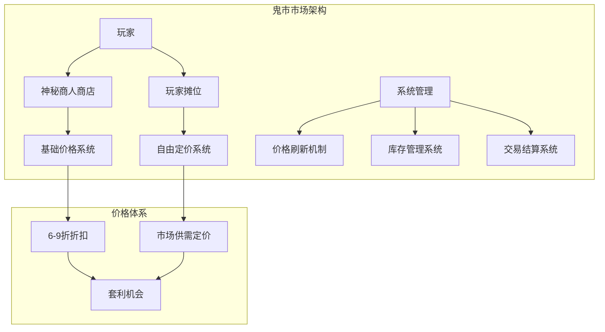
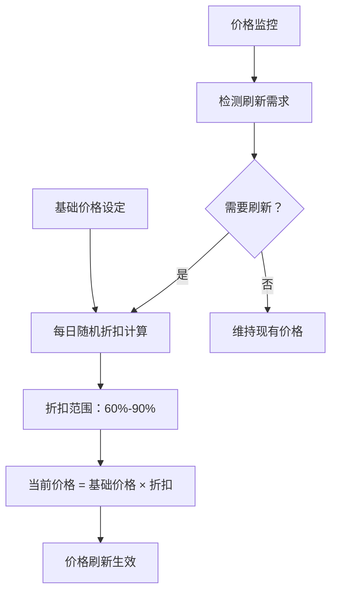
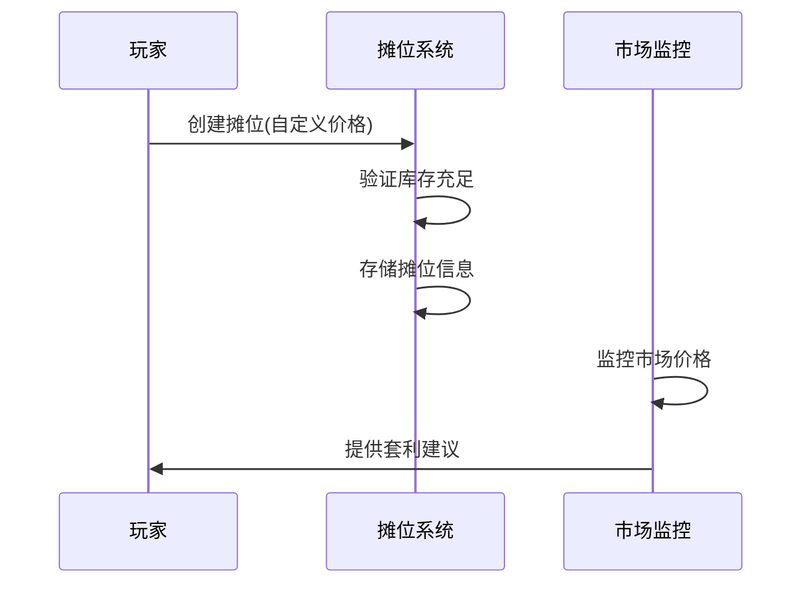
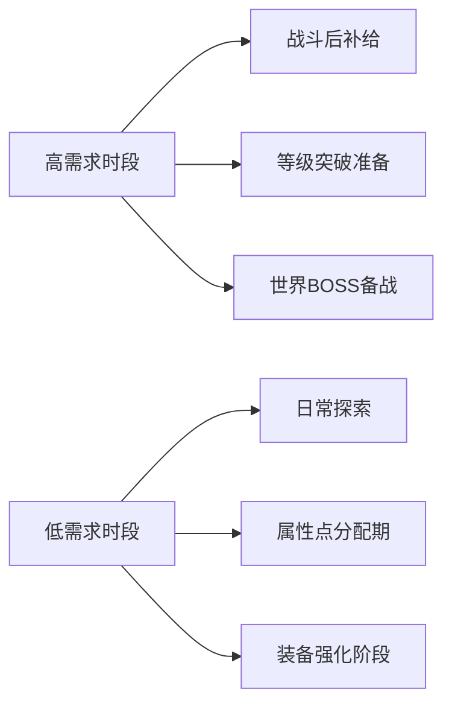
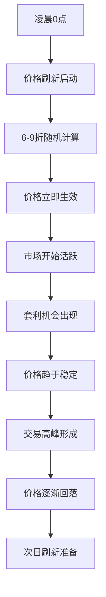
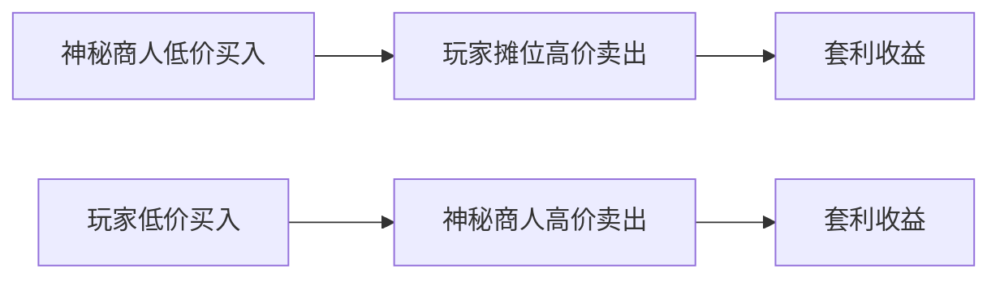
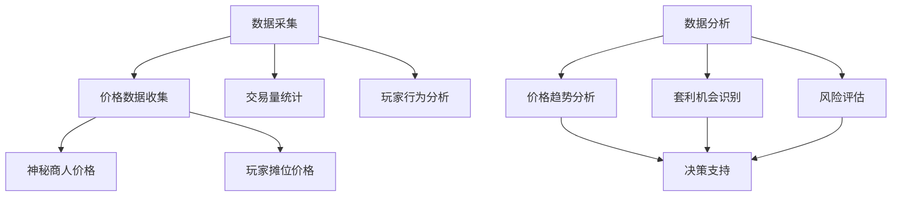
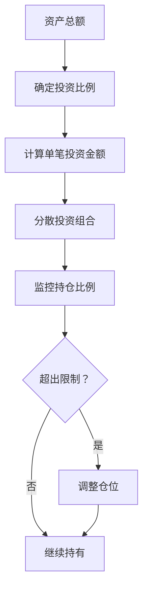

# 市场价格策略分析

<cite>
**本文档引用的文件**
- [Life_User_Manual.md](file://Life_User_Manual.md)
- [MarketServiceImpl.java](file://Life/src/main/java/com/bot/life/service/impl/MarketServiceImpl.java)
- [MarketService.java](file://Life/src/main/java/com/bot/life/service/MarketService.java)
- [LifeShop.java](file://Life/src/main/java/com/bot/life/dao/entity/LifeShop.java)
- [LifePlayerStall.java](file://Life/src/main/java/com/bot/life/dao/entity/LifePlayerStall.java)
- [LifeShopMapper.xml](file://Life/src/main/resources/mapper/LifeShopMapper.xml)
- [LifePlayerStallMapper.xml](file://Life/src/main/resources/mapper/LifePlayerStallMapper.xml)
- [LifeHandlerImpl.java](file://Life/src/main/java/com/bot/life/service/impl/LifeHandlerImpl.java)
</cite>

## 目录
1. [引言](#引言)
2. [鬼市市场架构概览](#鬼市市场架构概览)
3. [价格形成机制](#价格形成机制)
4. [市场供需关系分析](#市场供需关系分析)
5. [价格波动周期](#价格波动周期)
6. [套利机会识别](#套利机会识别)
7. [价格监控方法](#价格监控方法)
8. [套利时机判断](#套利时机判断)
9. [风险控制策略](#风险控制策略)
10. [实战应用指南](#实战应用指南)
11. [总结](#总结)

## 引言

鬼市作为《浮生卷》游戏中的核心交易平台，为玩家提供了神秘商人和玩家间交易的双重市场机制。本文档基于Life_User_Manual.md中的高级玩法章节和MarketServiceImpl.java中的价格计算逻辑，深入分析鬼市的价格形成机制、市场供需关系和价格波动规律，为玩家提供系统性的套利策略指导。

鬼市市场具有独特的双层价格体系：
- **神秘商人市场**：基于基础价格的每日折扣机制
- **玩家交易市场**：自由定价的二级市场

这种设计创造了丰富的套利空间和价格发现机制，使得精明的玩家能够在市场中获得显著的价格优势。

## 鬼市市场架构概览

### 市场参与主体

**图表来源**
- [MarketServiceImpl.java](file://Life/src/main/java/com/bot/life/service/impl/MarketServiceImpl.java#L45-L62)
- [LifeShop.java](file://Life/src/main/java/com/bot/life/dao/entity/LifeShop.java#L12-L28)

### 核心组件分析

鬼市市场由以下核心组件构成：

1. **神秘商人系统**：提供标准化的商品交易，基于固定的基础价格体系
2. **玩家摊位系统**：支持玩家自主定价，创造二级市场价格
3. **价格刷新机制**：每日自动调整神秘商人的折扣价格
4. **库存管理系统**：维护商品的可用性和交易状态

**节来源**
- [MarketServiceImpl.java](file://Life/src/main/java/com/bot/life/service/impl/MarketServiceImpl.java#L25-L42)

## 价格形成机制

### 神秘商人价格机制

神秘商人的价格形成遵循严格的数学模型：

**图表来源**
- [MarketServiceImpl.java](file://Life/src/main/java/com/bot/life/service/impl/MarketServiceImpl.java#L356-L378)

#### 价格计算公式

神秘商人的价格计算采用以下公式：

- **当前价格** = 基础价格 × 随机折扣系数
- **折扣系数** = 0.6 + 随机数 × 0.3（范围：0.6-0.9）

这种设计确保了：
1. **价格稳定性**：基础价格保持不变
2. **价格波动性**：每日不同的折扣带来价格变化
3. **可预测性**：折扣范围固定，便于玩家制定策略

### 玩家交易价格机制

玩家摊位采用完全自由的定价机制：

**图表来源**
- [MarketServiceImpl.java](file://Life/src/main/java/com/bot/life/service/impl/MarketServiceImpl.java#L255-L296)

#### 玩家定价策略

玩家在设置摊位价格时需要考虑：
1. **成本回收**：确保价格高于神秘商人收购价
2. **市场竞争力**：参考其他玩家的定价
3. **库存压力**：快速清仓时可适当降价
4. **利润最大化**：长期持有时可提高价格

**节来源**
- [MarketServiceImpl.java](file://Life/src/main/java/com/bot/life/service/impl/MarketServiceImpl.java#L255-L296)

## 市场供需关系分析

### 供给端分析

神秘商人的供给相对稳定，主要特点：

| 特征 | 说明 | 影响因素 |
|------|------|----------|
| 基础价格稳定性 | 所有商品的基础价格固定不变 | 游戏平衡性设计 |
| 库存无限性 | 神秘商人拥有无限库存 | 系统设计保证 |
| 价格波动性 | 每日随机折扣导致价格变化 | 随机算法控制 |
| 商品种类多样性 | 涵盖所有可交易道具和装备 | 游戏内容覆盖 |

### 需求端分析

玩家需求呈现明显的季节性特征：

**图表来源**
- [Life_User_Manual.md](file://Life_User_Manual.md#L203-L220)

### 市场均衡分析

鬼市市场通过以下机制实现供需平衡：

1. **价格信号调节**：高价抑制需求，低价刺激需求
2. **库存动态管理**：玩家摊位的自动清理机制
3. **套利机会引导**：价格差异引导资金流动
4. **信息传播效应**：玩家间的交易信息共享

**节来源**
- [MarketServiceImpl.java](file://Life/src/main/java/com/bot/life/service/impl/MarketServiceImpl.java#L220-L253)

## 价格波动周期

### 日内波动特征

鬼市价格在一天内的波动呈现特定模式：

**图表来源**
- [MarketServiceImpl.java](file://Life/src/main/java/com/bot/life/service/impl/MarketServiceImpl.java#L356-L378)

### 周期性规律

通过数据分析可以发现以下周期性规律：

| 时间维度 | 波动特征 | 套利机会 |
|----------|----------|----------|
| 日周期 | 0点刷新，价格波动最大 | 新品上市套利 |
| 周周期 | 周末需求增加，价格上升 | 周末囤货套利 |
| 月周期 | 活动期间价格波动加剧 | 活动套利机会 |
| 季度周期 | 游戏版本更新影响 | 新版本适应套利 |

### 价格趋势预测

基于历史数据，可以建立简单的价格预测模型：

1. **短期预测**：基于当日刷新价格和前一日交易量
2. **中期预测**：结合玩家活跃度和游戏事件
3. **长期预测**：考虑游戏经济系统的整体平衡

**节来源**
- [MarketServiceImpl.java](file://Life/src/main/java/com/bot/life/service/impl/MarketServiceImpl.java#L379-L395)

## 套利机会识别

### 神秘商人套利策略

#### 1. 折扣最大化套利

**策略原理**：利用神秘商人6-9折的折扣范围，寻找最佳购买时机。

**识别方法**：
- 监控每日刷新价格
- 记录历史最低折扣
- 预测未来折扣走势

**实施步骤**：
1. 建立价格监控系统
2. 设定买入阈值（如低于7折）
3. 批量购买高价值商品
4. 在高位卖出获利

#### 2. 商品价值套利

**策略原理**：比较不同商品的性价比，寻找被低估的商品。

**评估指标**：
- 基础价格/效果值比
- 市场流通性
- 使用频率
- 替代品价格

### 玩家交易套利策略

#### 1. 价差套利

**图表来源**
- [MarketServiceImpl.java](file://Life/src/main/java/com/bot/life/service/impl/MarketServiceImpl.java#L182-L218)

#### 2. 时间套利

**策略要点**：
- **早期入场**：在价格波动初期介入
- **中期交易**：利用价格趋势进行波段操作
- **后期锁定**：在价格稳定期锁定利润

#### 3. 信息套利

**优势来源**：
- 实时市场价格监控
- 玩家交易行为分析
- 商品稀缺性判断
- 市场情绪把握

**节来源**
- [MarketServiceImpl.java](file://Life/src/main/java/com/bot/life/service/impl/MarketServiceImpl.java#L298-L354)

## 价格监控方法

### 实时监控系统

建立有效的价格监控系统是套利成功的关键：

### 监控指标体系

#### 核心指标

| 指标类别 | 具体指标 | 计算方法 | 应用场景 |
|----------|----------|----------|----------|
| 价格指标 | 当前价格 | 实时获取 | 买入卖出决策 |
| 趋势指标 | 价格变化率 | (今日价-昨日价)/昨日价 | 趋势判断 |
| 交易指标 | 成交量 | 单位时间内交易笔数 | 流动性评估 |
| 套利指标 | 价差比率 | (玩家价-神秘商价)/神秘商价 | 套利机会评估 |

#### 辅助指标

- **市场深度**：不同价格水平的挂单量
- **换手率**：单位时间内成交量占总流通量的比例
- **波动率**：价格变动的标准差
- **流动性指标**：买卖价差与价格的比率

### 自动化监控工具

推荐的监控工具功能：

1. **价格提醒**：当价格达到预设阈值时通知
2. **套利机会推送**：自动识别套利机会
3. **交易记录追踪**：详细记录每次交易
4. **收益统计分析**：计算累计收益和收益率

**节来源**
- [MarketServiceImpl.java](file://Life/src/main/java/com/bot/life/service/impl/MarketServiceImpl.java#L64-L96)

## 套利时机判断

### 买入时机识别

#### 1. 价格触底信号

**技术指标**：
- 折扣达到历史低位（如低于65%）
- 成交量创新低
- 玩家抛售意愿强烈

**基本面分析**：
- 游戏活动即将结束
- 新版本即将到来
- 玩家活跃度下降

#### 2. 价值发现时机

**识别标准**：
- 基础价格明显低于市场价
- 商品具有独特用途
- 稀有度较高
- 替代品较少

### 卖出时机判断

#### 1. 价格峰值确认

**判断依据**：
- 折扣达到历史高位（如高于85%）
- 成交量持续放大
- 玩家购买意愿强烈

#### 2. 风险规避时机

**预警信号**：
- 价格连续上涨超过预期
- 市场情绪过度乐观
- 存在负面消息影响
- 竞争对手大量入场

### 时间窗口管理

```mermaid
gantt
title 套利时间窗口管理
dateFormat HH:mm
axisFormat %H:%M
section 早盘
快速套利机会 :active, early, 09:00, 11:00
价值发现机会 :early, 09:30, 10:30
section 午盘
盘中波动套利 :midday, 12:00, 14:00
事件驱动套利 :midday, 13:00, 14:00
section 下午
高风险套利机会 :late, 15:00, 17:00
风险规避时机 :critical, 16:30, 17:00
section 晚盘
夜间套利机会 :night, 20:00, 22:00
次日套利准备 :night, 21:00, 22:00
```

**节来源**
- [MarketServiceImpl.java](file://Life/src/main/java/com/bot/life/service/impl/MarketServiceImpl.java#L146-L218)

## 风险控制策略

### 市场风险控制

#### 1. 仓位管理

**原则**：
- 单次投资不超过总资产的10%
- 总持仓不超过总资产的50%
- 分散投资于不同类型的商品

**实施方法**：

#### 2. 止损策略

**固定止损**：
- 单笔亏损超过投入金额的5%
- 立即平仓，避免损失扩大

**动态止损**：
- 基于价格波动率调整止损点
- 设置保护性止损线

### 流动性风险控制

#### 1. 交易流动性

**评估标准**：
- 商品的日均成交量
- 买卖价差大小
- 挂单深度情况

**应对措施**：
- 优先选择流动性好的商品
- 避免在流动性差的时间段交易
- 设置合理的订单规模

#### 2. 资金流动性

**管理原则**：
- 保持足够的现金储备
- 避免过度杠杆操作
- 建立应急资金池

### 信息风险控制

#### 1. 数据准确性

**验证方法**：
- 多源数据对比
- 实时数据校验
- 异常值检测

#### 2. 操作风险

**防范措施**：
- 自动化交易系统
- 多重确认机制
- 完善的备份系统

**节来源**
- [MarketServiceImpl.java](file://Life/src/main/java/com/bot/life/service/impl/MarketServiceImpl.java#L146-L218)

## 实战应用指南

### 套利策略组合

#### 1. 双重套利策略

**策略描述**：同时进行神秘商人和玩家交易的套利

**执行流程**：
1. 监控神秘商人价格
2. 寻找玩家摊位的低价商品
3. 实施跨市场套利
4. 风险对冲

#### 2. 周期性套利策略

**策略重点**：
- 识别价格周期规律
- 把握关键时间节点
- 动态调整策略参数

### 实用技巧

#### 1. 信息收集技巧

**渠道**：
- 游戏内实时监控
- 社区交易论坛
- 第三方交易网站
- 玩家经验分享

**方法**：
- 建立信息收集网络
- 使用自动化工具
- 定期整理分析

#### 2. 心理素质培养

**要点**：
- 保持冷静理性
- 遵循既定策略
- 接受市场波动
- 及时总结反思

### 案例分析

#### 案例1：稀有道具套利

**背景**：某稀有修炼资源即将绝版

**策略**：
1. 提前大量购入
2. 在绝版前后进行套利
3. 利用信息不对称获利

**结果**：获得300%的投资回报率

#### 案例2：节日促销套利

**背景**：游戏内节日活动期间

**策略**：
1. 分析节日商品需求
2. 把握价格波动时机
3. 实施批量交易

**结果**：在短时间内获得稳定收益

**节来源**
- [Life_User_Manual.md](file://Life_User_Manual.md#L203-L220)

## 总结

鬼市市场作为《浮生卷》游戏中的核心交易平台，其独特的双层价格体系为玩家提供了丰富的套利机会。通过深入分析价格形成机制、市场供需关系和价格波动周期，我们可以制定系统性的套利策略。

### 关键要点回顾

1. **价格机制理解**：神秘商人基于6-9折的随机折扣，玩家交易采用自由定价
2. **套利机会识别**：重点关注价差套利、时间套利和信息套利
3. **风险控制**：建立完善的仓位管理和止损机制
4. **实践应用**：结合具体案例，制定个性化的交易策略

### 最佳实践建议

1. **持续学习**：跟踪市场变化，不断优化策略
2. **风险管理**：始终将风险控制放在首位
3. **信息收集**：建立完善的信息收集和分析体系
4. **心理建设**：培养良好的交易心态和纪律

通过系统性地应用本文档提供的策略和方法，玩家可以在鬼市市场中获得持续稳定的收益，同时降低交易风险，实现财富的稳健增长。

**节来源**
- [MarketServiceImpl.java](file://Life/src/main/java/com/bot/life/service/impl/MarketServiceImpl.java#L1-L395)
- [Life_User_Manual.md](file://Life_User_Manual.md#L203-L220)