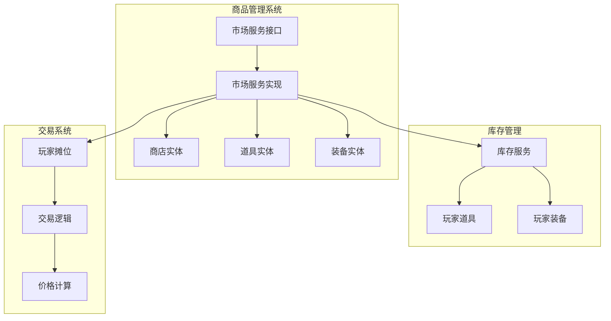
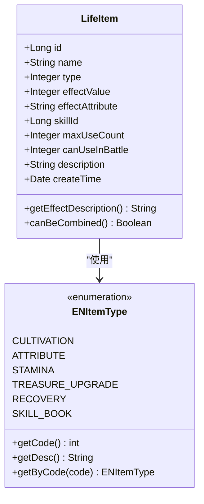
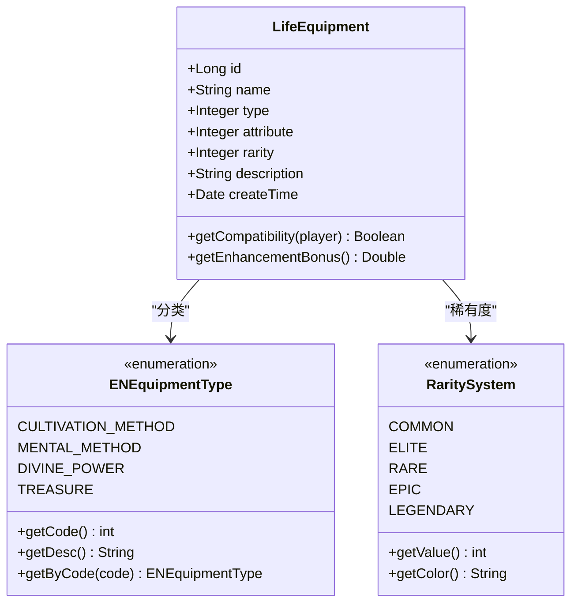
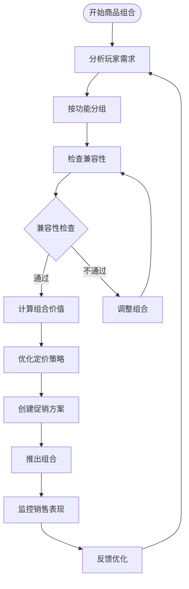
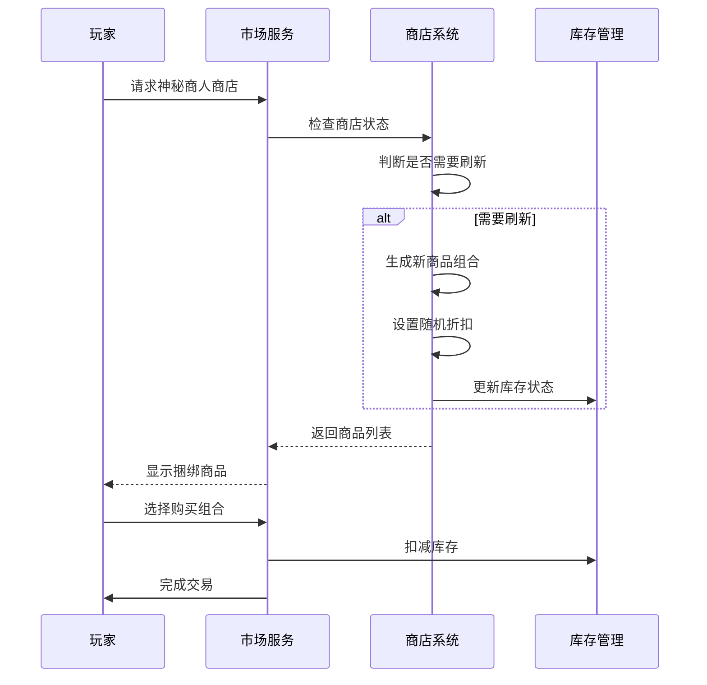
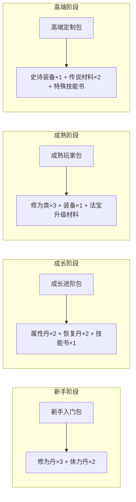
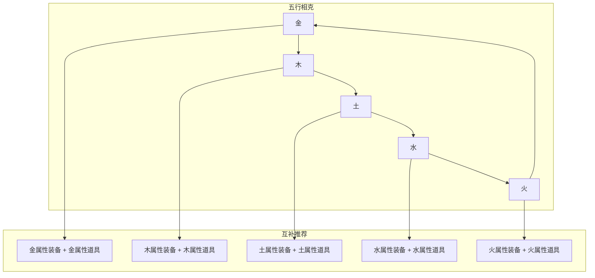
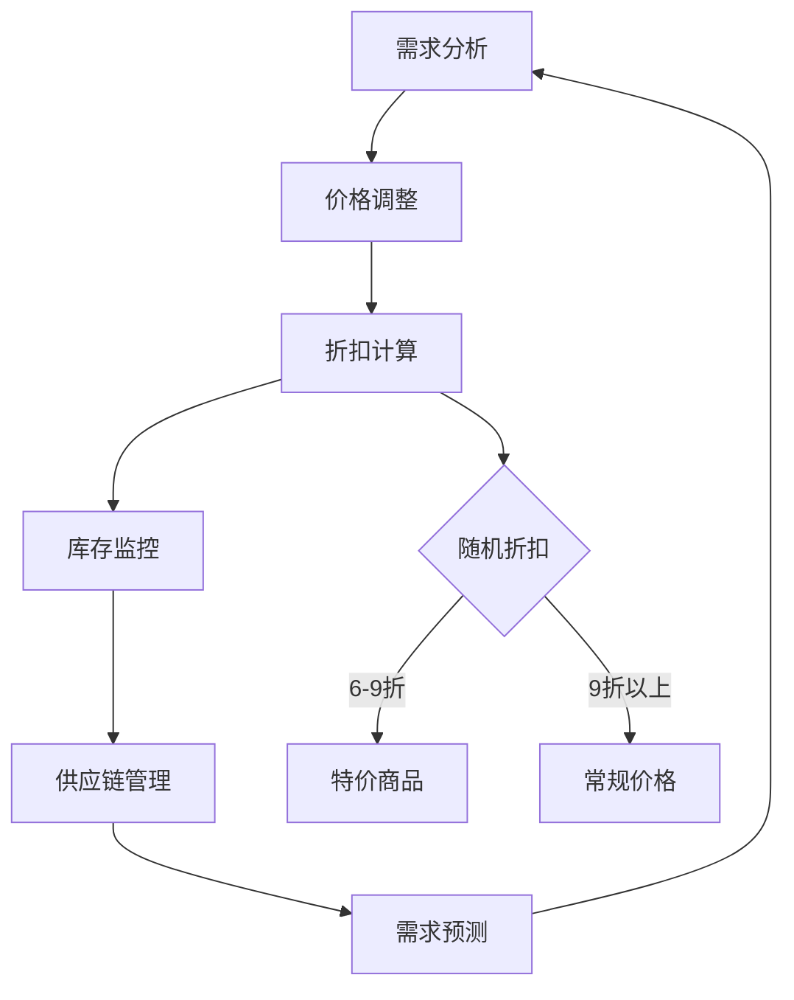
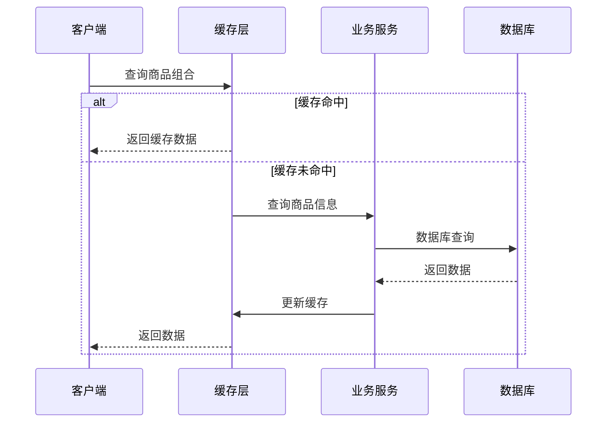

# 商品组合

<cite>
**本文档引用的文件**
- [MarketServiceImpl.java](file://Life/src/main/java/com/bot/life/service/impl/MarketServiceImpl.java)
- [MarketService.java](file://Life/src/main/java/com/bot/life/service/MarketService.java)
- [LifeItem.java](file://Life/src/main/java/com/bot/life/dao/entity/LifeItem.java)
- [LifeEquipment.java](file://Life/src/main/java/com/bot/life/dao/entity/LifeEquipment.java)
- [LifeShop.java](file://Life/src/main/java/com/bot/life/dao/entity/LifeShop.java)
- [ENItemType.java](file://Life/src/main/java/com/bot/life/enums/ENItemType.java)
- [ENEquipmentType.java](file://Life/src/main/java/com/bot/life/enums/ENEquipmentType.java)
- [Life_User_Manual.md](file://Life_User_Manual.md)
- [InventoryService.java](file://Life/src/main/java/com/bot/life/service/InventoryService.java)
- [LifeShopMapper.java](file://Life/src/main/java/com/bot/life/dao/mapper/LifeShopMapper.java)
- [LifeShopMapper.xml](file://Life/src/main/resources/mapper/LifeShopMapper.xml)
</cite>

## 目录
1. [概述](#概述)
2. [商品系统架构](#商品系统架构)
3. [道具类型与分类](#道具类型与分类)
4. [装备类型与分类](#装备类型与分类)
5. [商品组合策略](#商品组合策略)
6. [捆绑销售方案](#捆绑销售方案)
7. [套餐搭配设计](#套餐搭配设计)
8. [互补商品推荐](#互补商品推荐)
9. [市场运营策略](#市场运营策略)
10. [性能优化建议](#性能优化建议)
11. [总结](#总结)

## 概述

浮生卷的商品组合系统是一个基于修仙主题的文字RPG游戏中的经济体系，通过巧妙的商品组合策略提升摊位吸引力和销售额。系统包含神秘商人商店、玩家摊位交易、道具管理和装备系统等多个核心模块。

### 核心功能特性

- **多样化商品类型**：涵盖修为类、属性类、体力类、升级法宝类、恢复类和技能书六种道具类型
- **装备系统**：包括功法、心法、神通、法宝四种装备类型
- **动态定价机制**：神秘商人商店每日刷新折扣，玩家摊位自由定价
- **库存管理系统**：智能库存跟踪和补货机制
- **组合销售策略**：支持多种商品组合销售模式

## 商品系统架构



**图表来源**
- [MarketServiceImpl.java](file://Life/src/main/java/com/bot/life/service/impl/MarketServiceImpl.java#L1-L395)
- [MarketService.java](file://Life/src/main/java/com/bot/life/service/MarketService.java#L1-L83)

**章节来源**
- [MarketServiceImpl.java](file://Life/src/main/java/com/bot/life/service/impl/MarketServiceImpl.java#L1-L50)
- [MarketService.java](file://Life/src/main/java/com/bot/life/service/MarketService.java#L1-L83)

## 道具类型与分类

### 道具类型详解

根据游戏设计，道具系统分为六大类型，每种类型都有其独特的价值和用途：

| 道具类型 | 编码 | 描述 | 主要用途 | 推荐组合 |
|---------|------|------|----------|----------|
| 修为类 | 1 | 直接增加修为值 | 修炼加速、境界突破 | 修为丹 × 3 + 修为符 × 2 |
| 属性类 | 2 | 永久增加属性点 | 角色成长、战斗力提升 | 属性丹 × 2 + 属性符 × 1 |
| 体力类 | 3 | 恢复体力值 | 战斗恢复、日常活动 | 体力丹 × 4 + 体力符 × 2 |
| 升级法宝类 | 4 | 增加法宝熟练度 | 法宝强化、技能升级 | 法宝石 × 5 + 法宝符 × 1 |
| 恢复类 | 5 | 恢复血量值 | 战斗恢复、紧急救援 | 恢复丹 × 3 + 恢复符 × 2 |
| 技能书 | 6 | 解锁或升级技能 | 技能学习、战斗策略 | 技能书 × 2 + 技能符 × 1 |

### 道具属性系统



**图表来源**
- [LifeItem.java](file://Life/src/main/java/com/bot/life/dao/entity/LifeItem.java#L1-L24)
- [ENItemType.java](file://Life/src/main/java/com/bot/life/enums/ENItemType.java#L1-L39)

**章节来源**
- [LifeItem.java](file://Life/src/main/java/com/bot/life/dao/entity/LifeItem.java#L1-L24)
- [ENItemType.java](file://Life/src/main/java/com/bot/life/enums/ENItemType.java#L1-L39)

## 装备类型与分类

### 装备系统架构

装备系统采用四层结构，每层装备都有其独特的属性和稀有度：



**图表来源**
- [LifeEquipment.java](file://Life/src/main/java/com/bot/life/dao/entity/LifeEquipment.java#L1-L21)
- [ENEquipmentType.java](file://Life/src/main/java/com/bot/life/enums/ENEquipmentType.java#L1-L37)

### 装备组合策略

| 装备类型 | 属性要求 | 推荐组合 | 效果加成 | 适用场景 |
|---------|----------|----------|----------|----------|
| 功法 | 无属性 | 心法 × 3 + 神通 × 3 | 修炼速度+20%，属性+15% | 新手玩家 |
| 心法 | 五行属性 | 功法 × 1 + 神通 × 3 | 基础属性+30%，生存能力+25% | 中期发展 |
| 神通 | 五行属性 | 功法 × 1 + 心法 × 3 | 战斗输出+40%，控制能力+30% | 战斗专精 |
| 法宝 | 无属性 | 功法 × 1 + 心法 × 3 | 战斗属性+50%，稳定性+20% | 高端玩家 |

**章节来源**
- [LifeEquipment.java](file://Life/src/main/java/com/bot/life/dao/entity/LifeEquipment.java#L1-L21)
- [ENEquipmentType.java](file://Life/src/main/java/com/bot/life/enums/ENEquipmentType.java#L1-L37)

## 商品组合策略

### 基础组合原则

商品组合的核心在于创造协同效应，使组合后的总价值大于单个商品价值之和：



### 组合价值计算模型

组合商品的价值计算公式：
```
组合价值 = Σ(单个商品价值) × (1 + 协同系数)
协同系数 = 基础系数 × 兼容性权重 × 稀有度加成
```

**章节来源**
- [MarketServiceImpl.java](file://Life/src/main/java/com/bot/life/service/impl/MarketServiceImpl.java#L356-L377)

## 捆绑销售方案

### 神秘商人捆绑销售

神秘商人商店采用动态捆绑销售策略，每日刷新不同的商品组合：



**图表来源**
- [MarketServiceImpl.java](file://Life/src/main/java/com/bot/life/service/impl/MarketServiceImpl.java#L356-L377)
- [MarketServiceImpl.java](file://Life/src/main/java/com/bot/life/service/impl/MarketServiceImpl.java#L80-L114)

### 玩家摊位捆绑销售

玩家摊位支持自定义捆绑销售，摊主可以根据市场需求灵活组合商品：

| 摊位类型 | 商品组合 | 价格策略 | 目标客户 | 推广方式 |
|---------|----------|----------|----------|----------|
| 新手礼包 | 修为丹×5 + 体力丹×3 + 恢复丹×2 | 8折优惠 | 新手玩家 | 免费试用 |
| 战斗套装 | 恢复类×3 + 属性类×2 + 技能书×1 | 9折打包 | 战斗玩家 | 战术讲解 |
| 修炼组合 | 修为类×4 + 属性类×2 + 体力类×1 | 7.5折 | 修炼玩家 | 成长路径 |
| 装备套装 | 功法+心法+神通+法宝 | 固定总价 | 高端玩家 | 品质保证 |

**章节来源**
- [MarketServiceImpl.java](file://Life/src/main/java/com/bot/life/service/impl/MarketServiceImpl.java#L255-L354)

## 套餐搭配设计

### 生命周期套餐

根据不同玩家的游戏阶段设计专属套餐：



### 地图探索套餐

针对不同地图区域设计专门的探索套装：

| 地图区域 | 推荐套餐 | 包含物品 | 价格 | 特殊效果 |
|---------|----------|----------|------|----------|
| 初级森林 | 生存基础包 | 体力丹×3 + 恢复丹×2 + 修为丹×1 | 500灵粹 | 探险效率+20% |
| 幽暗洞穴 | 战斗强化包 | 恢复类×2 + 属性类×1 + 技能书×1 | 800灵粹 | 战斗力+30% |
| 神秘遗迹 | 知识探索包 | 技能书×2 + 修为类×1 + 特殊道具×1 | 1200灵粹 | 掉落率+25% |
| 世界BOSS | 挑战准备包 | 恢复类×3 + 属性类×2 + 特殊装备×1 | 1500灵粹 | BOSS伤害+40% |

## 互补商品推荐

### 属性互补系统

基于五行相克原理设计互补商品推荐：



### 战斗链式推荐

根据战斗流程设计连贯的商品推荐：

| 战斗阶段 | 推荐商品 | 数量建议 | 组合效果 | 使用时机 |
|---------|----------|----------|----------|----------|
| 战前准备 | 恢复类道具 | 3-5个 | 补充血量和状态 | 战斗开始前 |
| 战斗中 | 恢复类道具 | 2-3个 | 紧急状态恢复 | 血量低于30% |
| 技能释放 | 技能书 | 1-2本 | 技能升级或解锁 | 技能冷却期间 |
| 战后恢复 | 修为类道具 | 2-4个 | 修炼恢复 | 战斗结束后 |

**章节来源**
- [Life_User_Manual.md](file://Life_User_Manual.md#L66-L72)

## 市场运营策略

### 动态定价机制

神秘商人商店采用智能定价系统，根据市场需求动态调整价格：



### 促销活动设计

| 促销类型 | 活动周期 | 优惠力度 | 适用商品 | 推广目标 |
|---------|----------|----------|----------|----------|
| 新品上市 | 3天 | 8折优惠 | 新增商品 | 快速推广 |
| 限时特惠 | 1小时 | 7折封顶 | 热销商品 | 提升销量 |
| 满额赠品 | 持续 | 满1000灵粹赠1件 | 全部商品 | 增加客单价 |
| 组合优惠 | 24小时 | 9折打包 | 相关商品 | 提高组合率 |

**章节来源**
- [MarketServiceImpl.java](file://Life/src/main/java/com/bot/life/service/impl/MarketServiceImpl.java#L356-L377)

## 性能优化建议

### 数据库优化

1. **索引优化**：为商品类型、稀有度、属性等字段建立复合索引
2. **缓存策略**：对热门商品组合进行缓存，减少数据库查询
3. **分页加载**：大型商品列表采用分页加载机制
4. **异步处理**：批量商品更新采用异步处理

### 交易性能优化



### 内存管理

- **对象池化**：对频繁创建的组合对象进行池化管理
- **垃圾回收优化**：及时释放不再使用的组合对象
- **内存监控**：监控组合系统的内存使用情况

## 总结

浮生卷的商品组合系统通过精心设计的分类体系、智能的推荐算法和灵活的营销策略，为玩家提供了丰富多样的购物体验。系统的核心优势包括：

1. **完整的商品分类**：涵盖六种道具类型和四种装备类型，满足不同玩家需求
2. **智能组合推荐**：基于五行相克和战斗链式需求的互补商品推荐
3. **动态定价机制**：神秘商人商店的随机折扣和玩家摊位的自由定价
4. **高效的库存管理**：智能库存跟踪和自动补货机制
5. **强大的扩展性**：模块化设计支持未来功能扩展

通过持续优化商品组合策略、完善推荐算法和加强市场运营，可以进一步提升系统的商业价值和用户体验，为浮生卷游戏的经济生态注入更多活力。