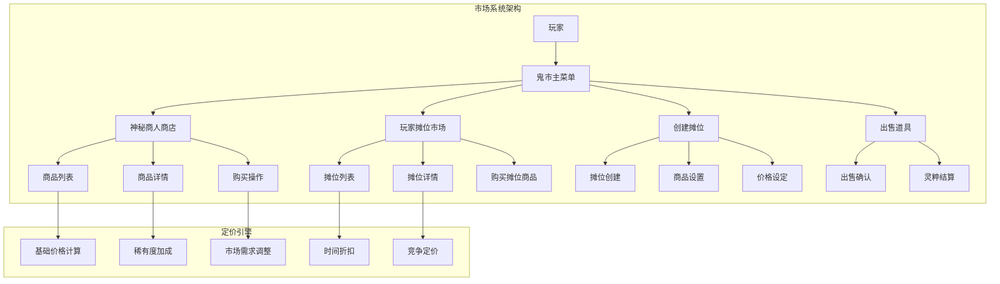
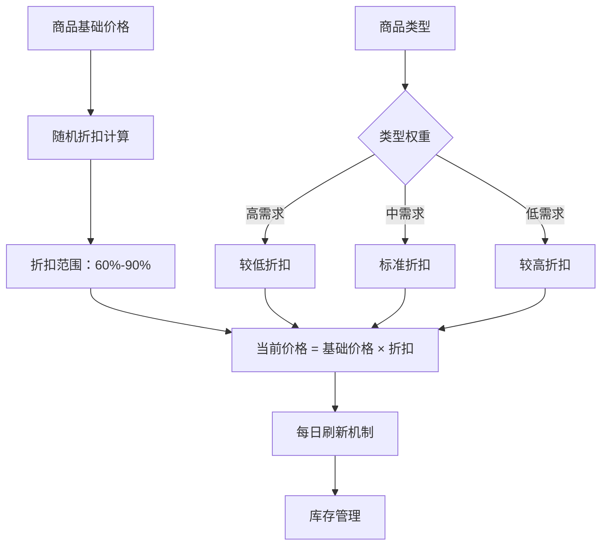
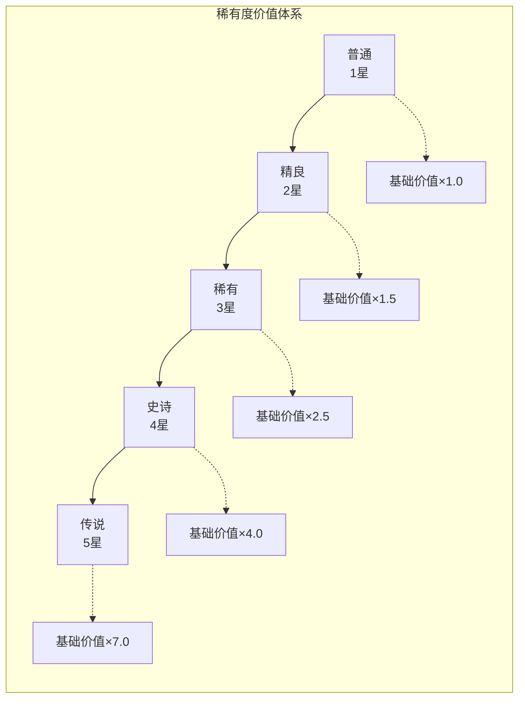
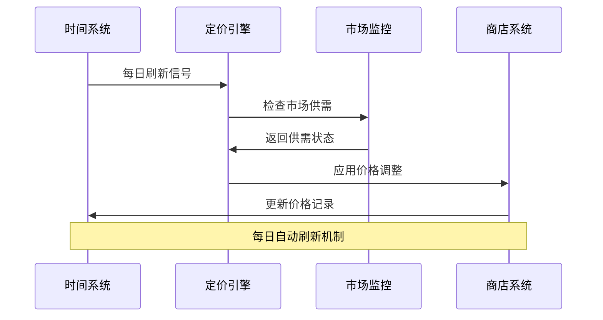
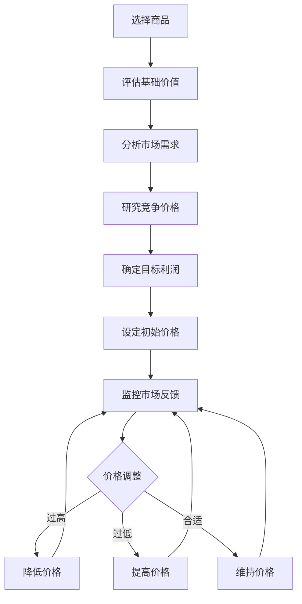
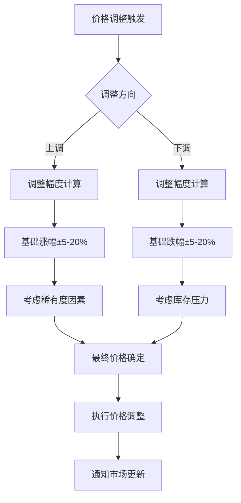

# 定价策略

<cite>
**本文档引用的文件**
- [MarketServiceImpl.java](file://Life/src/main/java/com/bot/life/service/impl/MarketServiceImpl.java)
- [Life_User_Manual.md](file://Life_User_Manual.md)
- [ENRarity.java](file://Game/src/main/java/com/bot/game/enums/ENRarity.java)
- [LifeEquipment.java](file://Life/src/main/java/com/bot/life/dao/entity/LifeEquipment.java)
- [LifeShop.java](file://Life/src/main/java/com/bot/life/dao/entity/LifeShop.java)
- [LifeItem.java](file://Life/src/main/java/com/bot/life/dao/entity/LifeItem.java)
- [ENItemType.java](file://Life/src/main/java/com/bot/life/enums/ENItemType.java)
- [ENEquipmentType.java](file://Life/src/main/java/com/bot/life/enums/ENEquipmentType.java)
- [LifeHandlerImpl.java](file://Life/src/main/java/com/bot/life/service/impl/LifeHandlerImpl.java)
</cite>

## 目录
1. [概述](#概述)
2. [市场系统架构](#市场系统架构)
3. [商品分类体系](#商品分类体系)
4. [定价机制分析](#定价机制分析)
5. [稀有度与价值评估](#稀有度与价值评估)
6. [动态定价策略](#动态定价策略)
7. [玩家摊位定价指南](#玩家摊位定价指南)
8. [价格调整策略](#价格调整策略)
9. [市场需求分析](#市场需求分析)
10. [最佳实践建议](#最佳实践建议)

## 概述

浮生卷游戏的定价策略系统基于复杂的市场机制设计，旨在为玩家提供公平、合理的商品交易环境。本系统包含两个主要市场：神秘商人商店和玩家摆摊市场，每种市场都有其独特的定价规则和动态调整机制。

### 核心特性

- **双市场机制**：神秘商人商店和玩家摊位市场并存
- **动态定价**：基于稀有度、市场需求和时间因素的智能定价
- **稀有度分级**：严格的商品稀有度评估体系
- **实时监控**：持续的市场价格监控和调整
- **供需平衡**：基于玩家行为的动态供需调节

## 市场系统架构

**图表来源**
- [MarketServiceImpl.java](file://Life/src/main/java/com/bot/life/service/impl/MarketServiceImpl.java#L46-L61)
- [LifeHandlerImpl.java](file://Life/src/main/java/com/bot/life/service/impl/LifeHandlerImpl.java#L990-L1058)

**章节来源**
- [MarketServiceImpl.java](file://Life/src/main/java/com/bot/life/service/impl/MarketServiceImpl.java#L46-L61)
- [Life_User_Manual.md](file://Life_User_Manual.md#L215-L219)

## 商品分类体系

### 道具类型分类

| 类型代码 | 类型名称 | 描述 | 价值特征 |
|---------|---------|------|---------|
| 1 | 修为类 | 直接增加修为值的道具 | 稳定价值，需求长期稳定 |
| 2 | 属性类 | 永久增加角色属性的道具 | 高价值，随角色成长而增值 |
| 3 | 体力类 | 恢复体力值的道具 | 中等价值，日常必需品 |
| 4 | 升级法宝类 | 增加法宝熟练度的道具 | 中高价值，依赖装备系统 |
| 5 | 恢复类 | 战斗中使用的恢复道具 | 中等价值，战斗期间需求高 |
| 6 | 技能书 | 学习新技能的书籍 | 高价值，技能树发展关键 |

### 装备类型分类

| 类型代码 | 类型名称 | 描述 | 价值特征 |
|---------|---------|------|---------|
| 1 | 功法 | 提供修炼速度加成的装备 | 长期价值，修炼效率关键 |
| 2 | 心法 | 提供基础属性加成的装备 | 中等价值，属性提升稳定 |
| 3 | 神通 | 战斗中可使用的技能装备 | 高价值，战斗能力核心 |
| 4 | 法宝 | 按百分比增加战斗属性的装备 | 高价值，战斗优势明显 |

**章节来源**
- [ENItemType.java](file://Life/src/main/java/com/bot/life/enums/ENItemType.java#L8-L13)
- [ENEquipmentType.java](file://Life/src/main/java/com/bot/life/enums/ENEquipmentType.java#L8-L11)

## 定价机制分析

### 神秘商人商店定价

神秘商人商店采用基于基础价格的动态折扣机制：

**图表来源**
- [MarketServiceImpl.java](file://Life/src/main/java/com/bot/life/service/impl/MarketServiceImpl.java#L357-L377)

#### 定价公式

神秘商人商店的价格计算遵循以下公式：
- **基础价格**：商品的原始定价
- **随机折扣**：每日60%-90%之间的随机折扣
- **当前价格**：`基础价格 × 折扣系数`
- **刷新机制**：每日自动刷新所有商品价格

### 玩家摊位定价

玩家摊位采用自由定价机制，但受以下因素影响：

#### 基础定价策略

1. **成本定价法**：基于商品的基础价值和获取成本
2. **竞争定价法**：参考其他玩家的类似商品价格
3. **价值定价法**：根据商品的实际使用价值定价
4. **心理定价法**：利用消费者心理设定价格

**章节来源**
- [MarketServiceImpl.java](file://Life/src/main/java/com/bot/life/service/impl/MarketServiceImpl.java#L357-L377)
- [MarketServiceImpl.java](file://Life/src/main/java/com/bot/life/service/impl/MarketServiceImpl.java#L182-L218)

## 稀有度与价值评估

### 稀有度分级体系

游戏采用五级稀有度评估体系，对商品价值产生重大影响：

**图表来源**
- [ENRarity.java](file://Game/src/main/java/com/bot/game/enums/ENRarity.java#L17-L20)
- [LifeEquipment.java](file://Life/src/main/java/com/bot/life/dao/entity/LifeEquipment.java#L16)

### 稀有度对定价的影响

| 稀有度级别 | 价值倍数 | 市场需求 | 定价策略建议 |
|-----------|---------|---------|-------------|
| 普通 | 1.0x | 稳定需求 | 基础定价，薄利多销 |
| 精良 | 1.5x | 中等需求 | 标准定价，适度溢价 |
| 稀有 | 2.5x | 高需求 | 加强溢价，限量供应 |
| 史诗 | 4.0x | 极高需求 | 大幅溢价，稀缺定价 |
| 传说 | 7.0x | 极限需求 | 顶级定价，垄断地位 |

**章节来源**
- [ENRarity.java](file://Game/src/main/java/com/bot/game/enums/ENRarity.java#L17-L20)
- [LifeEquipment.java](file://Life/src/main/java/com/bot/life/dao/entity/LifeEquipment.java#L16)

## 动态定价策略

### 时间因素定价

**图表来源**
- [MarketServiceImpl.java](file://Life/src/main/java/com/bot/life/service/impl/MarketServiceImpl.java#L357-L377)

### 动态调整机制

1. **每日刷新**：神秘商人商店商品价格每日自动刷新
2. **供需响应**：根据玩家交易行为调整价格策略
3. **季节性调整**：特殊时期的价格波动管理
4. **竞争监控**：玩家摊位价格的竞争性调整

**章节来源**
- [MarketServiceImpl.java](file://Life/src/main/java/com/bot/life/service/impl/MarketServiceImpl.java#L357-L377)

## 玩家摊位定价指南

### 摆摊前准备工作

#### 商品评估流程

#### 定价决策矩阵

| 评估维度 | 权重 | 评分标准 | 价格调整建议 |
|---------|------|---------|-------------|
| 商品稀有度 | 30% | 稀有度等级越高，价格越高 | 按稀有度倍数调整 |
| 市场需求 | 25% | 当前购买意愿和竞争程度 | 高需求商品适度提价 |
| 获取难度 | 20% | 商品的获取成本和稀缺性 | 难获取商品适当溢价 |
| 竞争对比 | 15% | 类似商品的市场价格 | 参考竞争对手定价 |
| 自身成本 | 10% | 已投入的资源和机会成本 | 确保基本利润空间 |

### 摊位运营策略

#### 价格层次化

1. **高端定位**：稀有度高的商品，采用高端定价策略
2. **中端定位**：普通商品，采用市场标准定价
3. **低端促销**：清理库存，采用低价促销策略

#### 动态价格调整

- **快速反应**：根据市场反馈及时调整价格
- **批量销售**：大量出售时给予适当折扣
- **组合销售**：多种商品组合提供优惠套餐

**章节来源**
- [MarketServiceImpl.java](file://Life/src/main/java/com/bot/life/service/impl/MarketServiceImpl.java#L256-L295)

## 价格调整策略

### 市场监控指标

#### 关键价格指标

| 指标名称 | 计算方法 | 监控频率 | 调整阈值 |
|---------|---------|---------|---------|
| 平均成交价 | ∑(成交价格)/成交次数 | 实时 | ±10% |
| 销售速度 | 日均成交量 | 每小时 | ±20% |
| 库存周转率 | 销售量/库存量 | 每日 | ±15% |
| 市场渗透率 | 销售量/总需求量 | 每周 | ±10% |

### 价格调整时机

#### 上调策略触发条件

1. **需求激增**：商品被大量抢购，库存快速下降
2. **稀有度提升**：商品变得更为稀有或难以获取
3. **替代品缺失**：市场上缺乏相似替代商品
4. **玩家反馈积极**：收到正面的市场反馈

#### 下调策略触发条件

1. **库存积压**：商品长时间无人问津
2. **需求下降**：玩家对该类型商品需求减少
3. **竞争加剧**：市场上出现大量同类商品
4. **替代品出现**：新的更好商品出现

### 价格调整幅度

**图表来源**
- [MarketServiceImpl.java](file://Life/src/main/java/com/bot/life/service/impl/MarketServiceImpl.java#L357-L377)

**章节来源**
- [MarketServiceImpl.java](file://Life/src/main/java/com/bot/life/service/impl/MarketServiceImpl.java#L357-L377)

## 市场需求分析

### 需求预测模型

#### 影响因素分析

1. **游戏阶段**：不同游戏阶段的需求重点不同
2. **玩家群体**：不同类型的玩家有不同的需求偏好
3. **经济周期**：游戏内经济的周期性变化
4. **事件驱动**：特殊活动对需求的影响

#### 需求分类

| 需求类型 | 特征 | 定价策略 | 应对措施 |
|---------|------|---------|---------|
| 必需品 | 稳定需求，弹性低 | 基础定价 | 保证供应 |
| 常用品 | 中等需求，弹性中等 | 标准定价 | 适度促销 |
| 奢侈品 | 高弹性需求 | 高价策略 | 限量供应 |
| 替代品 | 可被其他商品替代 | 竞争定价 | 提升差异化 |

### 供给管理策略

#### 库存优化

1. **安全库存**：保持适当的库存水平避免断货
2. **库存轮换**：定期清理滞销商品
3. **季节性储备**：提前准备旺季商品
4. **应急补货**：建立快速补货机制

#### 供应链管理

- **采购策略**：根据市场需求制定采购计划
- **质量控制**：确保商品质量满足玩家期望
- **物流优化**：提高商品流转效率
- **风险控制**：防范供应链中断风险

**章节来源**
- [MarketServiceImpl.java](file://Life/src/main/java/com/bot/life/service/impl/MarketServiceImpl.java#L221-L252)

## 最佳实践建议

### 新手玩家定价策略

#### 初期定价原则

1. **保守定价**：初期采用保守定价吸引买家
2. **学习观察**：观察市场行情，积累定价经验
3. **灵活调整**：根据销售情况及时调整价格
4. **建立信誉**：保持诚信经营，建立良好口碑

#### 推荐定价步骤

1. **评估商品价值**：综合考虑稀有度、需求等因素
2. **参考市场价格**：查看类似商品的定价
3. **设定初始价格**：比市场价格略低吸引买家
4. **监控销售情况**：根据销售速度调整价格
5. **优化定价策略**：逐步找到最优价格区间

### 高级玩家定价策略

#### 专业定价技巧

1. **价值定价**：根据商品的实际使用价值定价
2. **心理定价**：利用消费者心理设定价格
3. **捆绑销售**：多种商品组合提供优惠
4. **会员定价**：为忠实客户提供专属优惠

#### 市场领导策略

1. **价格标杆**：成为某种类型商品的定价标杆
2. **品质保证**：提供高质量的商品和服务
3. **客户服务**：提供优质客户服务体验
4. **品牌建设**：建立个人或团队品牌声誉

### 风险控制建议

#### 价格风险管理

1. **分散投资**：不要将所有资金投入单一商品
2. **止损机制**：设定价格下跌的止损点
3. **流动性管理**：保持一定的现金流动性
4. **市场监测**：持续关注市场变化

#### 操作风险控制

1. **合规经营**：遵守游戏规则和市场秩序
2. **信息安全**：保护个人和交易信息
3. **合同履行**：按时交付商品和服务
4. **纠纷处理**：妥善处理交易纠纷

### 持续优化建议

#### 数据驱动优化

1. **销售数据分析**：定期分析销售数据找出规律
2. **客户行为分析**：了解玩家的购买习惯和偏好
3. **市场竞争分析**：跟踪竞争对手的定价策略
4. **成本效益分析**：评估各项经营成本和收益

#### 策略迭代优化

1. **A/B测试**：通过实验验证不同定价策略的效果
2. **快速迭代**：根据市场反馈快速调整策略
3. **知识分享**：与其他玩家交流定价经验
4. **技能提升**：不断学习新的定价和营销技巧

通过以上定价策略的实施，玩家可以在浮生卷游戏中实现商品价值的最大化，同时为整个游戏市场的健康发展做出贡献。记住，成功的定价不仅仅是技术问题，更是对市场、玩家心理和游戏生态深刻理解的结果。