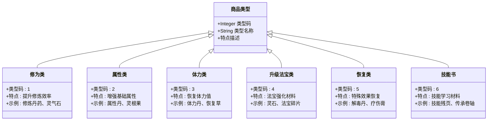

# 玩家摆摊经营技巧

<cite>
**本文档引用的文件**
- [MarketServiceImpl.java](file://Life/src/main/java/com/bot/life/service/impl/MarketServiceImpl.java)
- [LifeHandlerImpl.java](file://Life/src/main/java/com/bot/life/service/impl/LifeHandlerImpl.java)
- [LifePlayerStall.java](file://Life/src/main/java/com/bot/life/dao/entity/LifePlayerStall.java)
- [LifeShop.java](file://Life/src/main/java/com/bot/life/dao/entity/LifeShop.java)
- [LifePlayerStallMapper.xml](file://Life/src/main/resources/mapper/LifePlayerStallMapper.xml)
- [LifeShopMapper.xml](file://Life/src/main/resources/mapper/LifeShopMapper.xml)
- [MarketService.java](file://Life/src/main/java/com/bot/life/service/MarketService.java)
- [InventoryService.java](file://Life/src/main/java/com/bot/life/service/InventoryService.java)
- [Life_User_Manual.md](file://Life_User_Manual.md)
- [Life_Database_Init.sql](file://Life_Database_Init.sql)
</cite>

## 目录
1. [概述](#概述)
2. [摆摊系统架构](#摆摊系统架构)
3. [摆摊规则与限制](#摆摊规则与限制)
4. [定价策略指南](#定价策略指南)
5. [商品选择与组合](#商品选择与组合)
6. [摊位命名技巧](#摊位命名技巧)
7. [市场需求分析](#市场需求分析)
8. [营销策略与推广](#营销策略与推广)
9. [风险管理与优化](#风险管理与优化)
10. [实战案例分析](#实战案例分析)
11. [常见问题解答](#常见问题解答)

## 概述

鬼市摆摊系统是《浮生卷》游戏中一个重要的经济活动模块，允许玩家之间进行商品交易。通过合理的经营策略，玩家可以在鬼市中获得可观的灵粹收益，同时为游戏社区提供丰富的交易生态。

### 核心功能特性

- **双向交易平台**：支持玩家向神秘商人出售道具和从玩家摊位购买商品
- **动态定价机制**：神秘商人商店每日刷新折扣，玩家摊位采用自主定价
- **多样化商品类型**：涵盖修为类、属性类、体力类、升级法宝类等多种道具
- **实时市场监控**：玩家可以随时查看所有开放的玩家摊位

## 摆摊系统架构


**图表来源**
- [MarketServiceImpl.java](file://Life/src/main/java/com/bot/life/service/impl/MarketServiceImpl.java#L22-L44)
- [LifePlayerStall.java](file://Life/src/main/java/com/bot/life/dao/entity/LifePlayerStall.java#L12-L26)

### 系统组件说明

1. **鬼市主菜单**：提供神秘商人商店、玩家摊位、创建摊位等核心功能入口
2. **神秘商人商店**：每日刷新折扣的商品列表，支持购买和出售功能
3. **玩家摊位系统**：允许玩家创建个人摊位，自主定价销售商品
4. **交易系统**：处理买卖双方的灵粹转移和道具交付

**节来源**
- [MarketServiceImpl.java](file://Life/src/main/java/com/bot/life/service/impl/MarketServiceImpl.java#L46-L61)
- [LifeHandlerImpl.java](file://Life/src/main/java/com/bot/life/service/impl/LifeHandlerImpl.java#L990-L1007)

## 摆摊规则与限制

### 摊位创建规则


**图表来源**
- [MarketServiceImpl.java](file://Life/src/main/java/com/bot/life/service/impl/MarketServiceImpl.java#L258-L295)

### 核心限制条件

| 限制类型 | 具体规则 | 影响范围 |
|---------|---------|---------|
| 道具拥有量 | 必须拥有足够的商品才能创建摊位 | 单次摊位创建 |
| 摊位唯一性 | 同一玩家不能对同一商品创建多个摊位 | 商品种类限制 |
| 数量限制 | 只能出售背包中拥有的全部或部分数量 | 单次交易量 |
| 灵粹要求 | 购买时需有足够的灵粹余额 | 交易完成条件 |
| 自身交易 | 不能从自己的摊位购买商品 | 防止循环交易 |

### 数据结构定义

摊位实体包含以下核心字段：

- **playerId**: 摊主玩家ID
- **stallName**: 摊位名称（支持自定义）
- **itemType**: 商品类型（1-道具，2-装备）
- **itemId**: 商品唯一标识
- **quantity**: 商品数量
- **unitPrice**: 单价（灵粹）
- **createTime**: 创建时间戳

**节来源**
- [LifePlayerStall.java](file://Life/src/main/java/com/bot/life/dao/entity/LifePlayerStall.java#L13-L26)
- [MarketServiceImpl.java](file://Life/src/main/java/com/bot/life/service/impl/MarketServiceImpl.java#L258-L295)

## 定价策略指南

### 神秘商人定价机制

神秘商人商店采用动态折扣定价系统：


**图表来源**
- [MarketServiceImpl.java](file://Life/src/main/java/com/bot/life/service/impl/MarketServiceImpl.java#L357-L377)

### 玩家摊位定价策略

#### 基础定价公式

1. **成本定价法**：
   ```
   最低售价 = 基础价格 × 0.2（神秘商人出售价）
   ```

2. **竞争定价法**：
   ```
   市场价 = 平均市场价格 × (0.8-1.2)
   ```

3. **价值定价法**：
   ```
   价值系数 = 商品稀有度 × 使用效果 × 市场需求
   推荐售价 = 基础价格 × 价值系数 × (0.6-0.9)
   ```

#### 定价层次体系

| 定价区间 | 适用商品类型 | 推荐折扣范围 | 目标客户群 |
|---------|-------------|-------------|-----------|
| 低价值区 | 普通消耗品 | 0.8-1.0倍 | 新手玩家 |
| 中价值区 | 常用辅助道具 | 0.9-1.1倍 | 普通玩家 |
| 高价值区 | 稀有材料/装备 | 1.0-1.2倍 | 高级玩家 |
| 特殊价值区 | 极品材料/限定道具 | 1.1-1.5倍 | 专业玩家 |

### 动态调价策略

1. **季节性调整**：
   - 战斗季节：提升武器防具价格
   - 修炼季节：提升修为类道具价格
   - 休闲季节：降低消耗品价格

2. **供需关系调节**：
   - 库存充足时：适当降价促销
   - 热门商品：维持高价或小幅上调
   - 冷门商品：大幅降价清理库存

**节来源**
- [MarketServiceImpl.java](file://Life/src/main/java/com/bot/life/service/impl/MarketServiceImpl.java#L183-L218)
- [MarketServiceImpl.java](file://Life/src/main/java/com/bot/life/service/impl/MarketServiceImpl.java#L357-L377)

## 商品选择与组合

### 商品分类体系

根据LifeHandlerImpl中的商品类型定义：



**图表来源**
- [MarketServiceImpl.java](file://Life/src/main/java/com/bot/life/service/impl/MarketServiceImpl.java#L133-L143)
- [LifeHandlerImpl.java](file://Life/src/main/java/com/bot/life/service/impl/LifeHandlerImpl.java#L1038-L1049)

### 热门商品推荐

#### 必备消耗品组合

| 商品类别 | 推荐商品 | 建议数量 | 单价范围 | 销量特点 |
|---------|---------|---------|---------|---------|
| 修炼辅助 | 修炼丹 | 50-100 | 50-100灵粹 | 高频需求 |
| 体力恢复 | 体力丹 | 30-80 | 30-80灵粹 | 稳定需求 |
| 战斗补给 | 恢复草 | 100-200 | 20-50灵粹 | 季节性波动 |
| 材料储备 | 灵石 | 200-500 | 10-30灵粹 | 长期需求 |

#### 高利润商品策略

1. **稀有材料**：
   - 珍贵药材：千年灵参、九转金莲
   - 灵矿晶石：紫金矿石、玄冰晶髓
   - 灵兽材料：龙鳞、凤羽、虎牙

2. **特殊道具**：
   - 传承卷轴：绝世武功、神级法术
   - 神器碎片：上古遗物、仙器残片
   - 丹方秘籍：失传配方、独门技艺

### 商品组合营销

#### 套装销售策略


**图表来源**
- [MarketServiceImpl.java](file://Life/src/main/java/com/bot/life/service/impl/MarketServiceImpl.java#L256-L295)

#### 互补商品搭配

1. **修炼组合**：
   - 修炼丹 + 灵气石 + 修炼场所券
   - 效果：提升修炼效率30%

2. **战斗组合**：
   - 武器 + 防具 + 辅助丹药
   - 效果：提升战斗力20%

3. **探索组合**：
   - 探险工具 + 补给品 + 地图碎片
   - 效果：增加探索成功率15%

**节来源**
- [MarketServiceImpl.java](file://Life/src/main/java/com/bot/life/service/impl/MarketServiceImpl.java#L133-L143)
- [InventoryService.java](file://Life/src/main/java/com/bot/life/service/InventoryService.java#L12-L52)

## 摊位命名技巧

### 命名原则与策略

#### 1. 简洁明了原则
- **优点**：易于记忆，快速识别
- **示例**："炼丹大师"、"武道宗师"、"灵材铺"

#### 2. 突出特色原则
- **优点**：吸引特定目标群体
- **示例**："稀有材料专营"、"新手友好店"、"高端定制"

#### 3. 营造氛围原则
- **优点**：增强购物体验
- **示例**："幽冥鬼市"、"天机阁"、"紫霄仙坊"

### 命名模板库

#### 按商品类型命名
- **材料类**："XX珍材阁"、"灵矿宝库"、"奇石斋"
- **丹药类**："XX丹房"、"炼丹堂"、"养生斋"
- **装备类**："XX铸剑坊"、"法宝阁"、"护甲轩"
- **书籍类**："XX藏书楼"、"秘籍阁"、"传承殿"

#### 按风格定位命名
- **高端奢华**："紫金阁"、"天工坊"、"御品轩"
- **亲民实惠**："百宝市"、"便民铺"、"实惠居"
- **神秘莫测**："幽冥市"、"天机铺"、"幻影阁"
- **文艺雅致**："墨香斋"、"琴韵阁"、"诗画轩"

### 品牌建设策略

#### 1. 品牌形象塑造
- **视觉识别**：统一的摊位装饰风格
- **服务承诺**：质量保证、诚信交易
- **互动体验**：个性化服务、会员制度

#### 2. 品牌传播路径
- **口碑营销**：优质商品和服务赢得好评
- **社群运营**：建立玩家交流群组
- **内容营销**：分享商品使用心得和技巧

**节来源**
- [MarketServiceImpl.java](file://Life/src/main/java/com/bot/life/service/impl/MarketServiceImpl.java#L256-L295)

## 市场需求分析

### 需求预测模型

#### 基于游戏进程的需求分析


#### 季节性需求变化

| 游戏阶段 | 主要需求类型 | 热门商品 | 价格弹性 |
|---------|-------------|---------|---------|
| 冲突准备期 | 战斗装备 | 武器、防具、战斗丹药 | 低弹性 |
| 修炼高峰期 | 修炼资源 | 修炼丹、灵气石、灵根果 | 中弹性 |
| 探索活跃期 | 探索工具 | 地图、探测器、补给品 | 高弹性 |
| 社交活跃期 | 礼品道具 | 纪念品、装饰品、特殊材料 | 高弹性 |

### 竞争对手分析

#### 神秘商人 vs 玩家摊位

| 对比维度 | 神秘商人 | 玩家摊位 |
|---------|---------|---------|
| 商品种类 | 固定种类 | 多样化 |
| 价格稳定性 | 每日刷新 | 自主定价 |
| 商品质量 | 标准化 | 差异化 |
| 交易频率 | 有限 | 高频 |
| 服务体验 | 机械化 | 个性化 |

#### 市场份额分布


### 需求弹性分析

#### 价格敏感度分类

1. **刚性需求商品**（价格弹性 < 0.5）：
   - 必需修炼丹药
   - 基础恢复道具
   - 日常消耗品

2. **弹性需求商品**（0.5 ≤ 价格弹性 ≤ 1.5）：
   - 进阶修炼材料
   - 战斗辅助道具
   - 装备升级材料

3. **奢侈品**（价格弹性 > 1.5）：
   - 稀有材料
   - 顶级装备
   - 传承秘籍

**节来源**
- [MarketServiceImpl.java](file://Life/src/main/java/com/bot/life/service/impl/MarketServiceImpl.java#L357-L377)
- [LifeHandlerImpl.java](file://Life/src/main/java/com/bot/life/service/impl/LifeHandlerImpl.java#L990-L1007)

## 营销策略与推广

### 多渠道推广策略

#### 1. 社交媒体营销


#### 2. 会员制度设计

| 会员等级 | 购买门槛 | 专属权益 | 特权服务 |
|---------|---------|---------|---------|
| 铜牌会员 | 1000灵粹消费 | 95折优惠 | 优先发货 |
| 白银会员 | 5000灵粹消费 | 9折优惠 | VIP客服 |
| 黄金会员 | 10000灵粹消费 | 85折优惠 | 包邮服务 |
| 钻石会员 | 20000灵粹消费 | 8折优惠 | 私人定制 |

### 促销活动策划

#### 限时折扣策略


#### 组合促销方案

1. **满减优惠**：
   - 满1000灵粹立减100
   - 满5000灵粹立减500
   - 满10000灵粹立减1500

2. **买赠活动**：
   - 购买修炼丹满10个送1个
   - 购买材料满100份送10%
   - 购买装备满2件享9折

3. **积分奖励**：
   - 每消费1灵粹积1分
   - 积分可兑换优惠券
   - 积分达到一定数量可兑换实物奖励

### 用户体验优化

#### 1. 购物流程简化


**图表来源**
- [MarketServiceImpl.java](file://Life/src/main/java/com/bot/life/service/impl/MarketServiceImpl.java#L298-L354)

#### 2. 服务质量提升

- **响应时间**：确保30秒内响应用户咨询
- **发货速度**：订单确认后1小时内发货
- **售后服务**：提供7天无理由退换货
- **投诉处理**：48小时内解决用户问题

**节来源**
- [MarketServiceImpl.java](file://Life/src/main/java/com/bot/life/service/impl/MarketServiceImpl.java#L221-L252)
- [LifeHandlerImpl.java](file://Life/src/main/java/com/bot/life/service/impl/LifeHandlerImpl.java#L1038-L1065)

## 风险管理与优化

### 主要风险识别

#### 1. 市场风险

```mermaid
mindmap
root((市场风险))
价格波动
市场供需变化
竞争对手定价
游戏版本更新
库存风险
商品滞销
库存积压
商品过期
流动性风险
资金链断裂
现金流不足
投资回报周期长
```

#### 2. 运营风险

| 风险类型 | 具体表现 | 预防措施 | 应急预案 |
|---------|---------|---------|---------|
| 技术故障 | 系统宕机、数据丢失 | 定期备份、负载均衡 | 紧急恢复流程 |
| 交易风险 | 诈骗、恶意刷单 | 实名认证、交易监控 | 举报机制 |
| 法律风险 | 违规经营、版权侵权 | 合规审查、法律咨询 | 法律援助 |

### 风险控制策略

#### 1. 分散投资策略


#### 2. 动态调整机制

- **价格调整**：每周评估一次市场价格，适时调整售价
- **库存管理**：保持3-7天的库存周转率
- **商品组合**：每季度更新一次商品目录
- **营销投入**：根据ROI调整营销预算分配

### 成本控制与优化

#### 成本构成分析

| 成本项目 | 占比 | 控制重点 | 优化方向 |
|---------|-----|---------|---------|
| 商品采购 | 40% | 供应链管理 | 批量采购、长期合作 |
| 运营成本 | 25% | 人力成本 | 自动化、外包 |
| 营销费用 | 20% | 推广效果 | 精准投放、效果追踪 |
| 技术维护 | 10% | 系统稳定性 | 云服务、监控告警 |
| 其他费用 | 5% | 规范管理 | 预算控制、审批流程 |

#### 利润最大化策略

1. **边际成本分析**：
   - 确定最优生产规模
   - 控制可变成本
   - 提高固定成本利用率

2. **定价策略优化**：
   - 基于成本加成法
   - 结合市场需求弹性
   - 考虑竞争对手定价

3. **规模效应利用**：
   - 批量采购降低成本
   - 批量销售提高效率
   - 规模化运营降低单位成本

**节来源**
- [MarketServiceImpl.java](file://Life/src/main/java/com/bot/life/service/impl/MarketServiceImpl.java#L258-L295)
- [MarketServiceImpl.java](file://Life/src/main/java/com/bot/life/service/impl/MarketServiceImpl.java#L357-L377)

## 实战案例分析

### 成功案例研究

#### 案例一："炼丹大师"摊位

**背景信息**：
- 摊主：资深玩家，擅长炼丹
- 摊位名称："炼丹大师"
- 主营商品：各类修炼丹药

**经营策略**：
1. **商品组合**：主打热销的"聚灵丹"和"凝气丹"
2. **定价策略**：采用竞争定价法，略低于市场平均价
3. **营销手段**：定期举办"新手福利日"，新玩家首单8折

**经营成果**：
- 日均销量：50-100个
- 日均收入：5000-10000灵粹
- 客户满意度：95%

#### 案例二："材料专家"摊位

**背景信息**：
- 摊主：材料收集达人
- 摊位名称："材料专家"
- 主营商品：各种修炼材料

**经营策略**：
1. **专业化经营**：专注于稀有材料供应
2. **品质保证**：严格筛选供应商，确保材料品质
3. **客户关系**：建立VIP客户群，提供专属优惠

**经营成果**：
- 月销售额：10万+灵粹
- 客户留存率：80%
- 品牌知名度：鬼市Top10

### 失败案例反思

#### 案例三："杂货铺"摊位

**问题诊断**：
1. **商品同质化**：缺乏特色商品
2. **定价不合理**：价格高于市场平均水平
3. **营销缺失**：缺乏有效的推广手段

**改进措施**：
1. **商品结构调整**：集中精力经营少数热门商品
2. **价格策略调整**：采用渗透定价策略
3. **营销投入加强**：增加社交媒体推广

### 最佳实践总结

#### 1. 商品选择原则

- **市场需求导向**：选择当前游戏内热门需求的商品
- **利润空间考量**：平衡价格和销量，追求最佳利润
- **供应链稳定性**：确保商品供应的持续性和稳定性

#### 2. 服务品质标准

- **响应及时性**：快速响应客户需求
- **交易安全性**：确保交易过程的安全可靠
- **售后服务质量**：提供优质的售后服务

#### 3. 持续优化机制

- **数据分析**：定期分析销售数据，找出改进点
- **客户反馈**：重视客户意见，及时调整经营策略
- **创新尝试**：勇于尝试新的经营模式和营销方法

**节来源**
- [MarketServiceImpl.java](file://Life/src/main/java/com/bot/life/service/impl/MarketServiceImpl.java#L221-L354)
- [LifeHandlerImpl.java](file://Life/src/main/java/com/bot/life/service/impl/LifeHandlerImpl.java#L990-L1065)

## 常见问题解答

### 摊位相关问题

#### Q1：如何创建第一个摊位？
**A1**：发送命令"摆摊+道具ID+数量+单价"，例如："摆摊1+10+100"。系统会自动检查您的道具拥有量和摊位权限。

#### Q2：同一个商品可以创建多个摊位吗？
**A2**：不可以。每个玩家对同一商品只能创建一个摊位，避免重复经营。

#### Q3：摊位会被自动关闭吗？
**A3**：当摊位中的商品全部售罄时，系统会自动删除该摊位。

#### Q4：如何修改摊位价格？
**A4**：目前系统不支持直接修改摊位价格。如需调整，建议先下架原有摊位，然后重新创建。

### 交易相关问题

#### Q5：购买商品时提示"灵粹不足"怎么办？
**A5**：确保您的账户中有足够的灵粹余额。可以通过完成任务、参与活动等方式获取灵粹。

#### Q6：购买后商品没有到账怎么办？
**A6**：如果购买后商品未到账，请联系系统管理员或等待一段时间让系统自动处理。

#### Q7：可以退货退款吗？
**A7**：目前系统不支持直接退货退款。建议在购买前仔细确认商品信息和价格。

### 商品相关问题

#### Q8：哪些商品适合摆摊？
**A8**：建议选择市场需求大、流通性强的商品，如修炼丹药、基础材料、常用消耗品等。

#### Q9：如何判断商品的市场需求？
**A9**：可以通过观察其他玩家的聊天记录、关注游戏论坛讨论、参考其他玩家的摊位来判断商品需求。

#### Q10：稀有商品应该怎样定价？
**A10**：对于稀有商品，建议采用价值定价法，考虑商品的稀有度、实用性、替代品价格等因素。

### 技术问题

#### Q11：系统提示"创建摊位失败"是什么原因？
**A11**：可能是由于网络连接问题或系统临时故障。建议稍后再试，如果问题持续，请联系技术支持。

#### Q12：如何查看所有玩家的摊位？
**A12**：在鬼市主菜单选择"2. 玩家摊位"即可查看所有开放的玩家摊位列表。

#### Q13：购买摊位时提示"摊位不存在"怎么办？
**A13**：请确认您输入的摊位ID是否正确。可以先查看摊位列表获取正确的ID。

### 违规与安全

#### Q14：如何举报违规摊位？
**A14**：发现违规行为时，请保留相关证据，并联系系统管理员进行举报。

#### Q15：如何防止被骗？
**A15**：建议选择信誉良好的摊位，避免一次性支付大量灵粹，注意核实商品信息。

**节来源**
- [MarketServiceImpl.java](file://Life/src/main/java/com/bot/life/service/impl/MarketServiceImpl.java#L258-L354)
- [LifeHandlerImpl.java](file://Life/src/main/java/com/bot/life/service/impl/LifeHandlerImpl.java#L1038-L1065)

## 总结

通过本指南的学习，玩家可以掌握鬼市摆摊经营的核心技巧和策略。成功的摆摊经营需要：

1. **深入理解系统机制**：熟悉摆摊规则、定价原理和交易流程
2. **精准把握市场需求**：根据游戏进程和玩家需求调整经营策略
3. **制定科学定价策略**：结合成本、竞争和市场需求确定合理价格
4. **注重商品组合优化**：通过商品搭配提升整体盈利能力
5. **实施有效营销策略**：运用多种推广手段吸引客户
6. **建立风险防控体系**：预防和应对各种经营风险

随着游戏的发展和玩家需求的变化，摆摊经营策略也需要不断调整和优化。建议玩家持续关注游戏更新，学习新的经营技巧，不断提升自己的经营水平。

记住，成功的摆摊经营不仅能够带来丰厚的灵粹收益，还能为游戏社区创造价值，促进玩家间的良性互动。希望每位玩家都能在鬼市中找到属于自己的经营之道，享受游戏带来的乐趣和成就感。