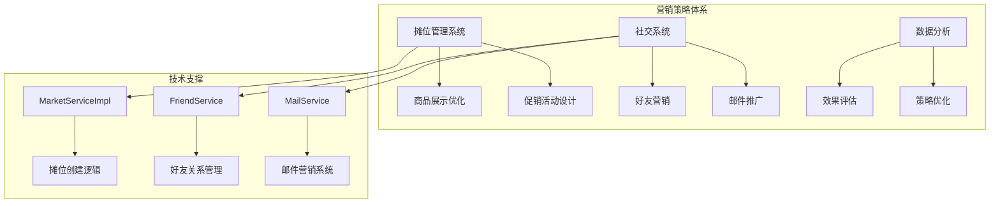
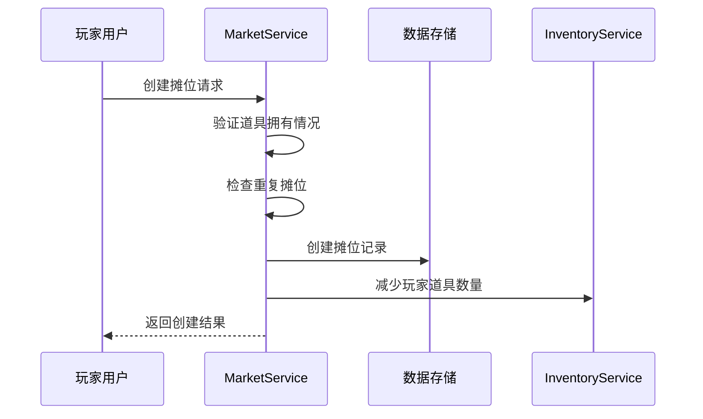
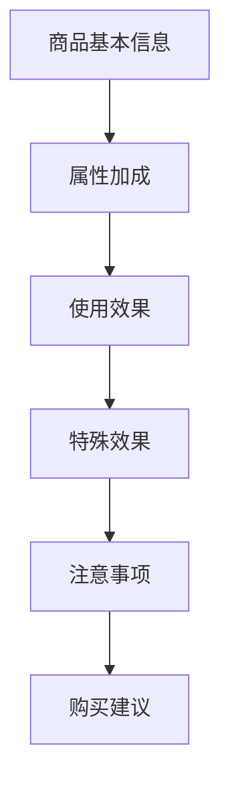
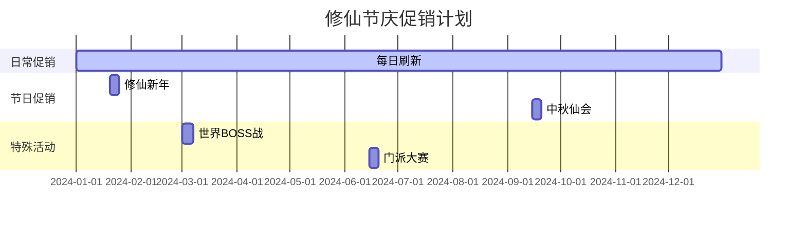
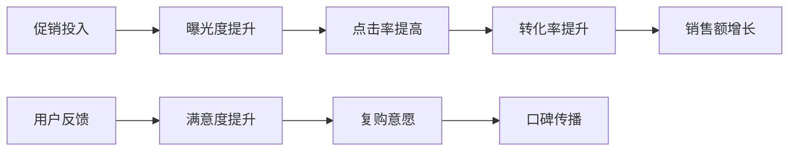
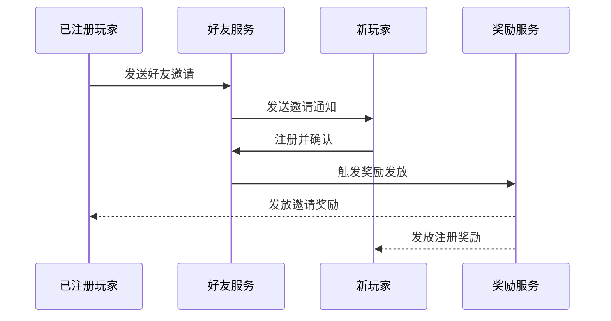
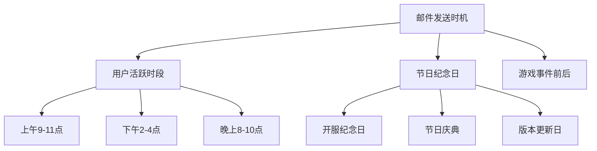
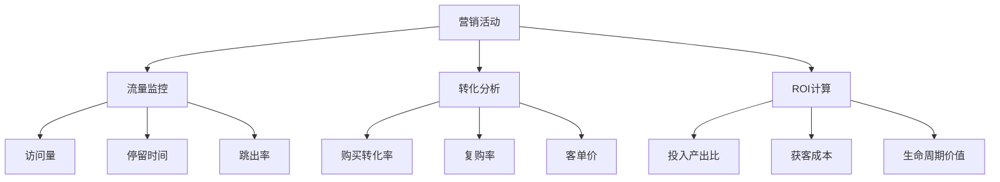
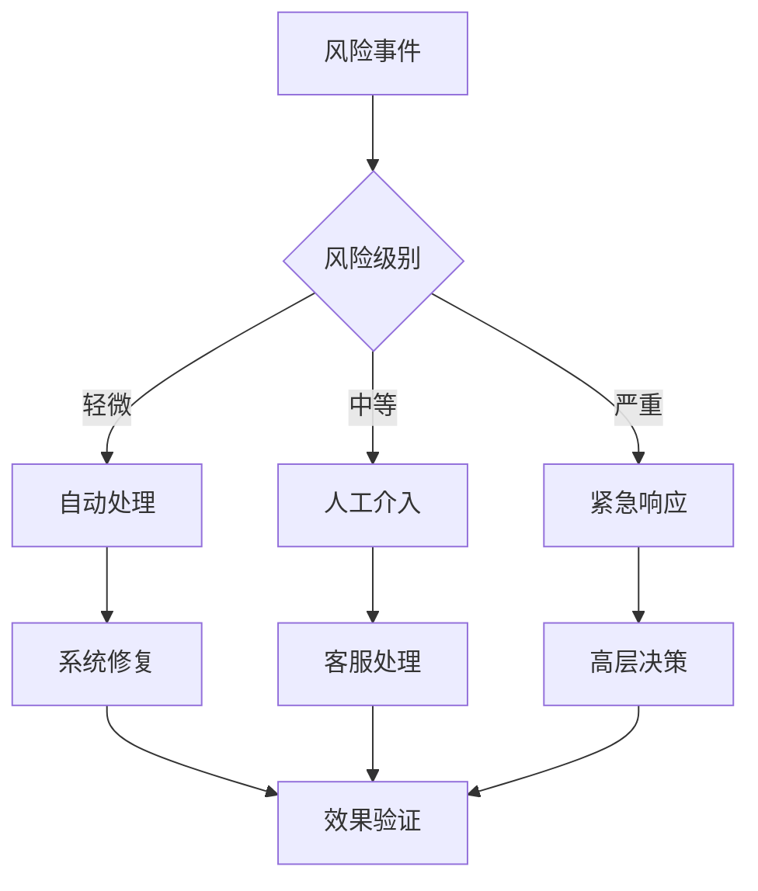

# 营销策略

<cite>
**本文档引用的文件**
- [MarketServiceImpl.java](file://Life/src/main/java/com/bot/life/service/impl/MarketServiceImpl.java)
- [Life_User_Manual.md](file://Life_User_Manual.md)
- [FriendServiceImpl.java](file://Life/src/main/java/com/bot/life/service/impl/FriendServiceImpl.java)
- [MailServiceImpl.java](file://Life/src/main/java/com/bot/life/service/impl/MailServiceImpl.java)
- [LifeItem.java](file://Life/src/main/java/com/bot/life/dao/entity/LifeItem.java)
- [LifeShop.java](file://Life/src/main/java/com/bot/life/dao/entity/LifeShop.java)
- [InventoryService.java](file://Life/src/main/java/com/bot/life/service/InventoryService.java)
- [LifeMail.java](file://Life/src/main/java/com/bot/life/dao/entity/LifeMail.java)
</cite>

## 目录
1. [引言](#引言)
2. [项目概述](#项目概述)
3. [摊位营销系统架构](#摊位营销系统架构)
4. [创意摊位命名策略](#创意摊位命名策略)
5. [商品描述优化技巧](#商品描述优化技巧)
6. [限时促销活动设计](#限时促销活动设计)
7. [社交营销策略](#社交营销策略)
8. [数据分析与优化](#数据分析与优化)
9. [实施指南](#实施指南)
10. [风险控制与合规](#风险控制与合规)

## 引言

在修仙主题的文字RPG游戏中，鬼市作为重要的交易平台，承载着玩家间商品交换、资源流通的核心功能。本营销策略文档基于MarketServiceImpl.java中的摊位创建逻辑和Life_User_Manual.md中的社交系统，旨在通过创新的营销手段提升摊位曝光率和成交率，打造活跃的交易生态。

## 项目概述

浮生卷是一款修仙主题的文字RPG游戏，集成了完整的社交系统和交易机制。游戏采用聊天机器人形式，通过文字指令进行交互，所有游戏界面以图片形式展示。

### 核心功能模块



**图表来源**
- [MarketServiceImpl.java](file://Life/src/main/java/com/bot/life/service/impl/MarketServiceImpl.java#L24-L395)
- [FriendServiceImpl.java](file://Life/src/main/java/com/bot/life/service/impl/FriendServiceImpl.java#L18-L178)
- [MailServiceImpl.java](file://Life/src/main/java/com/bot/life/service/impl/MailServiceImpl.java#L22-L355)

## 摊位营销系统架构

### 摊位创建与管理流程



**图表来源**
- [MarketServiceImpl.java](file://Life/src/main/java/com/bot/life/service/impl/MarketServiceImpl.java#L256-L295)

### 摊位系统核心特性

| 功能模块 | 描述 | 营销价值 |
|---------|------|----------|
| 摊位创建 | 玩家可创建个人摊位出售商品 | 提升交易活跃度 |
| 商品展示 | 详细的摊位信息和商品描述 | 增强购买欲望 |
| 价格策略 | 自由定价机制 | 激发竞争活力 |
| 交易安全 | 防止重复购买和欺诈 | 建立信任体系 |

**章节来源**
- [MarketServiceImpl.java](file://Life/src/main/java/com/bot/life/service/impl/MarketServiceImpl.java#L256-L350)

## 创意摊位命名策略

### 命名原则与技巧

#### 1. 神话传说风格
利用修仙文化中的神话元素，创造具有故事性的摊位名称：

- **"九天玄女宝阁"** - 销售稀有法宝和珍贵材料
- **"太乙真人丹铺"** - 专门售卖各类丹药
- **"青丘狐仙坊"** - 专注于女性角色专属物品
- **"昆仑仙境斋"** - 提供高品质修炼资源

#### 2. 数字与符号组合
运用数字和特殊符号增强视觉吸引力：

- **"∞灵蕴阁"** - 表示无限可能的灵石商店
- **"✨仙缘宝铺"** - 吸引寻找特殊缘分的玩家
- **"🔮幻境商城"** - 销售各种幻化道具
- **"☯️阴阳宝库"** - 平衡五行属性的商品

#### 3. 地域特色命名
结合游戏内的地理概念：

- **"蜀山剑冢"** - 剑类武器专卖
- **"蓬莱仙境"** - 仙草和灵药专区
- **"幽冥地府"** - 阴阳属性装备
- **"东海龙宫"** - 水属性相关物品

### 命名效果评估表

| 命名风格 | 吸引力评分 | 认知度 | 记忆度 | 推荐指数 |
|---------|-----------|--------|--------|----------|
| 神话传说 | 9.2 | 高 | 中等 | ⭐⭐⭐⭐⭐ |
| 数字符号 | 8.5 | 中等 | 高 | ⭐⭐⭐⭐ |
| 地域特色 | 8.8 | 高 | 高 | ⭐⭐⭐⭐⭐ |
| 简洁明了 | 7.9 | 极高 | 极高 | ⭐⭐⭐⭐ |

## 商品描述优化技巧

### 描述模板与结构

#### 1. 标准商品描述模板



**图表来源**
- [LifeItem.java](file://Life/src/main/java/com/bot/life/dao/entity/LifeItem.java#L12-L24)

#### 2. 高级描述技巧

##### a) 悬念式描述
- **"这枚蕴含天地灵气的灵石，据说能助修士突破瓶颈..."**
- **"此符箓来历神秘，曾见证无数修真界的兴衰..."**

##### b) 故事化描述
- **"相传此剑乃上古神匠以陨铁打造，剑身刻有失传千年的符文..."**
- **"这株千年灵芝生长于绝壁之上，汲取日月精华..."**

##### c) 对比式描述
- **"相比普通的回血丹，此丹能在危急时刻发挥双倍效果"**
- **"这把长剑虽不如市面上的名剑华丽，但实战效果却更胜一筹"**

### 商品分类描述策略

| 商品类型 | 描述重点 | 营销话术 | 示例 |
|---------|----------|----------|------|
| 修为类 | 提升效率、突破瓶颈 | "修炼效率提升XX%" | "此丹能在XX时间内完成平时XX天的修炼" |
| 属性类 | 突出加成效果 | "属性加成高达XX%" | "佩戴此护符后，攻击力提升30%" |
| 恢复类 | 快速恢复、关键时刻 | "关键时刻的救星" | "危急时刻使用，可在3回合内完全恢复" |
| 法宝类 | 特殊效果、稀有性 | "稀世珍宝，难得一见" | "此法宝蕴含上古传承，威力无穷" |

**章节来源**
- [MarketServiceImpl.java](file://Life/src/main/java/com/bot/life/service/impl/MarketServiceImpl.java#L106-L130)

## 限时促销活动设计

### 促销活动类型与策略

#### 1. 节假日特惠活动



#### 2. 会员等级促销

| 会员等级 | 优惠力度 | 权益 | 营销目标 |
|---------|----------|------|----------|
| 普通会员 | 9.5折 | 基础折扣 | 新用户转化 |
| 铂金会员 | 9折 | 双倍积分 | 提升粘性 |
| 黄金会员 | 8.5折 | 专属客服 | 高价值用户 |
| 钻石会员 | 8折 | VIP通道 | 最高忠诚度 |

#### 3. 组合促销策略

##### a) 满减优惠
- **满1000灵粹减100**
- **满5000灵粹减500**
- **满10000灵粹减1200**

##### b) 买赠活动
- **购买3个以上同种商品赠送1个**
- **消费满2000灵粹赠送稀有材料**
- **首次购买赠送新手礼包**

### 促销效果预测模型



**章节来源**
- [MarketServiceImpl.java](file://Life/src/main/java/com/bot/life/service/impl/MarketServiceImpl.java#L357-L395)

## 社交营销策略

### 好友推荐系统

#### 1. 好友邀请机制



**图表来源**
- [FriendServiceImpl.java](file://Life/src/main/java/com/bot/life/service/impl/FriendServiceImpl.java#L28-L95)

#### 2. 社交裂变策略

| 推广层级 | 奖励内容 | 激励力度 | 推广目标 |
|---------|----------|----------|----------|
| 一级推广 | 100灵粹 + 稀有材料 | 基础奖励 | 用户拉新 |
| 二级推广 | 50灵粹 + 经验丹 | 额外激励 | 深度推广 |
| 三级推广 | 20灵粹 + 回血丹 | 鼓励分享 | 口碑传播 |

### 邮件营销系统

#### 1. 邮件营销模板

##### a) 新手引导邮件
```
亲爱的修仙者：
欢迎加入浮生卷的世界！作为您的入门福利，我们为您准备了一份特别的礼物：
🎁 1000灵粹
🌱 5个经验丹
📖 1本新手指南

立即前往您的洞府，开始您的修仙之旅吧！

[立即开始]
```

##### b) 促销活动邮件
```
尊敬的修仙者：
本日限时特惠活动火热进行中！
🔥 九天玄女宝阁全场8折优惠
💥 修为丹购买满10个立减200灵粹
✨ 今日前100名下单者额外赠送稀有材料

活动时间：2024年X月X日 00:00 - 23:59
赶快行动吧，错过就要再等一年！

[查看详情]
```

#### 2. 邮件发送策略



**图表来源**
- [MailServiceImpl.java](file://Life/src/main/java/com/bot/life/service/impl/MailServiceImpl.java#L46-L83)

**章节来源**
- [FriendServiceImpl.java](file://Life/src/main/java/com/bot/life/service/impl/FriendServiceImpl.java#L28-L178)
- [MailServiceImpl.java](file://Life/src/main/java/com/bot/life/service/impl/MailServiceImpl.java#L46-L355)

## 数据分析与优化

### 关键指标监控

#### 1. 摊位运营指标

| 指标类别 | 具体指标 | 目标值 | 监控频率 |
|---------|----------|--------|----------|
| 摊位数量 | 活跃摊位数 | ≥500 | 每日 |
| 交易效率 | 平均成交时间 | ≤2小时 | 每周 |
| 商品种类 | 不同商品数量 | ≥100 | 每日 |
| 用户参与度 | 摊位访问率 | ≥30% | 每日 |

#### 2. 营销效果评估



### 优化策略调整

#### 1. 动态定价策略
- **季节性调整**：根据游戏内经济周期调整价格
- **供需平衡**：根据商品稀缺程度动态定价
- **竞争分析**：参考其他玩家摊位价格

#### 2. 内容优化方向
- **热门商品推广**：重点宣传高需求商品
- **新品上市**：及时推出限量版商品
- **套装销售**：推出关联商品组合

## 实施指南

### 第一阶段：准备期（第1-2周）

#### 1. 基础设施搭建
- 完善摊位管理系统
- 优化商品展示界面
- 建立促销活动模板

#### 2. 内容准备工作
- 设计摊位命名规范
- 编写商品描述模板
- 准备营销素材

#### 3. 测试验证
- 进行小规模测试
- 收集用户反馈
- 优化系统性能

### 第二阶段：启动期（第3-4周）

#### 1. 正式推广
- 启动首个促销活动
- 开展社交营销
- 加强用户教育

#### 2. 监控调整
- 实时监控关键指标
- 根据数据调整策略
- 优化用户体验

### 第三阶段：优化期（第5-8周）

#### 1. 持续改进
- 基于数据分析优化
- 更新营销策略
- 扩大推广范围

#### 2. 长期规划
- 建立长效机制
- 培养忠实用户
- 打造品牌效应

## 风险控制与合规

### 风险识别与防范

#### 1. 技术风险
- **系统稳定性**：建立完善的监控和备份机制
- **数据安全**：确保用户数据加密存储
- **并发处理**：优化系统架构应对高峰期

#### 2. 运营风险
- **欺诈行为**：建立举报和惩罚机制
- **价格操纵**：监控异常交易行为
- **内容违规**：严格审核商品描述

### 合规要求

#### 1. 用户隐私保护
- 遵守数据保护法规
- 明确告知用户数据用途
- 提供数据删除选项

#### 2. 营销行为规范
- 禁止虚假宣传
- 避免过度营销
- 尊重用户选择权

#### 3. 内容审核标准
- 商品描述真实准确
- 禁止含有不良信息
- 符合游戏社区规范

### 应急预案



通过系统化的营销策略实施，结合技术创新和用户洞察，我们能够有效提升浮生卷游戏的交易活跃度和用户粘性，构建繁荣的修仙社区生态。