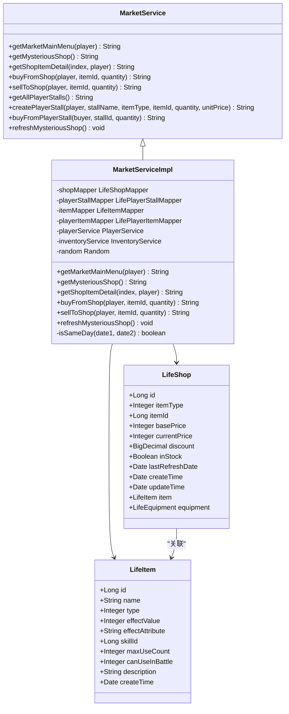
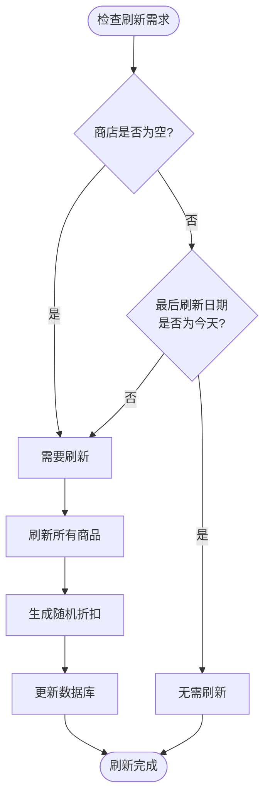
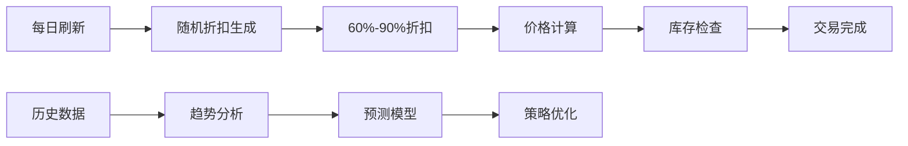
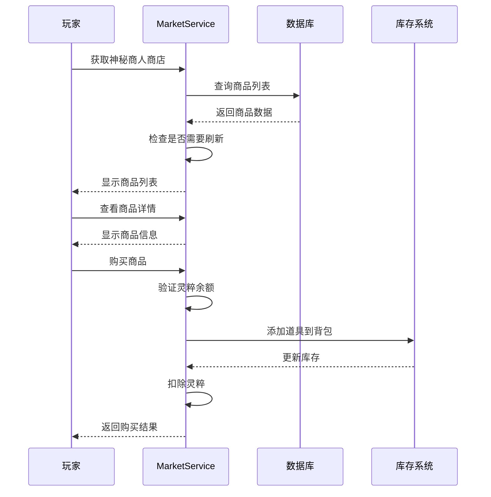
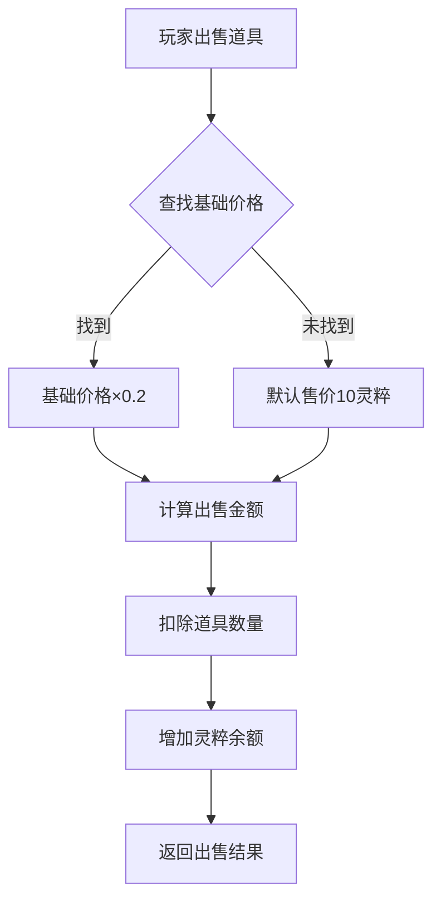
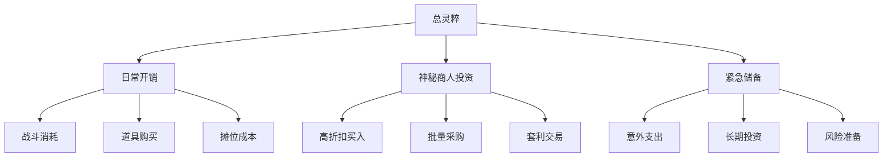
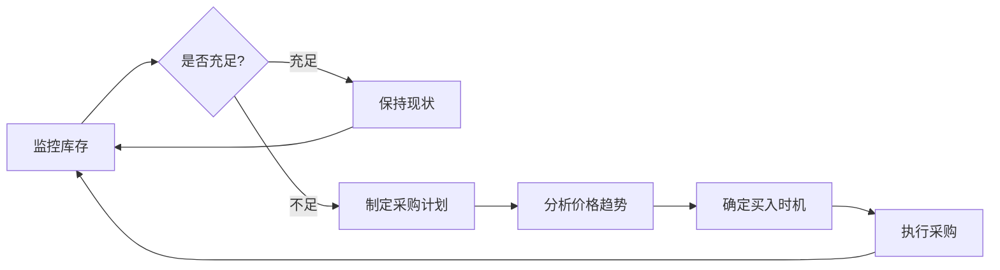
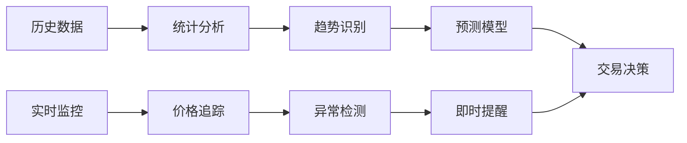
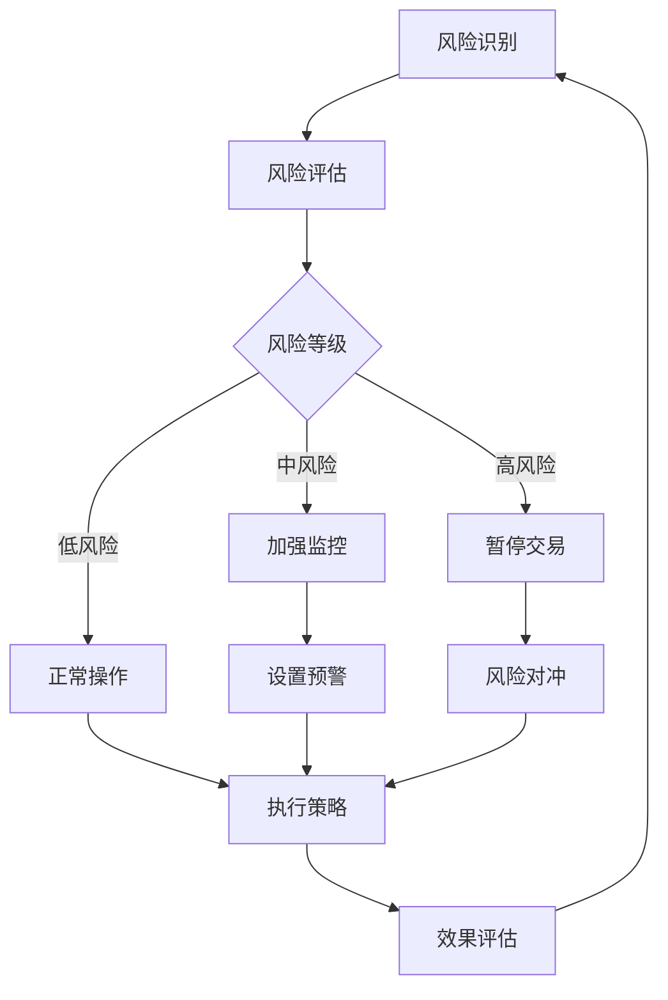
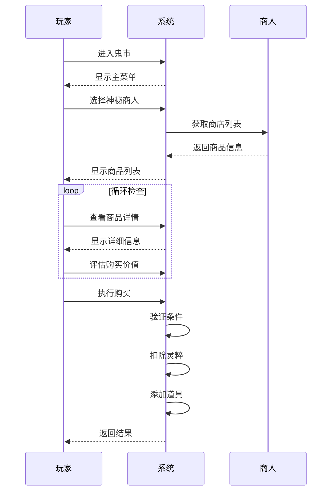

# 神秘商人交易策略

<cite>
**本文档引用的文件**
- [MarketService.java](file://Life/src/main/java/com/bot/life/service/MarketService.java)
- [MarketServiceImpl.java](file://Life/src/main/java/com/bot/life/service/impl/MarketServiceImpl.java)
- [LifeShop.java](file://Life/src/main/java/com/bot/life/dao/entity/LifeShop.java)
- [LifeItem.java](file://Life/src/main/java/com/bot/life/dao/entity/LifeItem.java)
- [LifeShopMapper.java](file://Life/src/main/java/com/bot/life/dao/mapper/LifeShopMapper.java)
- [LifeItemMapper.java](file://Life/src/main/java/com/bot/life/dao/mapper/LifeItemMapper.java)
- [LifeShopMapper.xml](file://Life/src/main/resources/mapper/LifeShopMapper.xml)
- [Life_Database_Init.sql](file://Life_Database_Init.sql)
- [Life_User_Manual.md](file://Life_User_Manual.md)
- [ENItemType.java](file://Life/src/main/java/com/bot/life/enums/ENItemType.java)
</cite>

## 目录
1. [概述](#概述)
2. [系统架构](#系统架构)
3. [神秘商人商店机制](#神秘商人商店机制)
4. [商品轮换与价格规律](#商品轮换与价格规律)
5. [交易策略详解](#交易策略详解)
6. [库存管理技巧](#库存管理技巧)
7. [最佳购买时机分析](#最佳购买时机分析)
8. [风险控制与优化建议](#风险控制与优化建议)
9. [实战应用指南](#实战应用指南)
10. [总结](#总结)

## 概述

神秘商人是《浮生卷》游戏中一个重要的经济系统，位于鬼市中。商人每天会刷新商品列表和折扣价格，为玩家提供了独特的交易机会。本策略文档基于系统源码分析，详细阐述了神秘商人的运作机制、商品规律和最佳交易策略。

### 核心特点

- **每日刷新机制**：神秘商人商店每天0点自动刷新，商品种类和折扣都会发生变化
- **随机折扣系统**：商品折扣在6-9折之间随机生成，具有明显的周期性规律
- **商品多样性**：涵盖修为类、属性类、体力类等多种类型的道具
- **双向交易**：支持从商人购买商品和向商人出售道具两种交易方式

## 系统架构

**图表来源**
- [MarketService.java](file://Life/src/main/java/com/bot/life/service/MarketService.java#L9-L82)
- [MarketServiceImpl.java](file://Life/src/main/java/com/bot/life/service/impl/MarketServiceImpl.java#L22-L42)
- [LifeShop.java](file://Life/src/main/java/com/bot/life/dao/entity/LifeShop.java#L12-L28)
- [LifeItem.java](file://Life/src/main/java/com/bot/life/dao/entity/LifeItem.java#L12-L23)

**节来源**
- [MarketService.java](file://Life/src/main/java/com/bot/life/service/MarketService.java#L1-L82)
- [MarketServiceImpl.java](file://Life/src/main/java/com/bot/life/service/impl/MarketServiceImpl.java#L1-L395)

## 神秘商人商店机制

### 刷新机制详解

神秘商人的核心机制是每日刷新制度，这一机制确保了交易系统的动态性和策略性。

#### 刷新触发条件

系统通过比较商品的最后刷新日期与当前日期来判断是否需要刷新：

**图表来源**
- [MarketServiceImpl.java](file://Life/src/main/java/com/bot/life/service/impl/MarketServiceImpl.java#L357-L377)

#### 折扣生成算法

每次刷新时，系统会为每个商品生成6-9折之间的随机折扣：

| 折扣范围 | 概率分布 | 推荐策略 |
|---------|---------|---------|
| 6.0-6.9折 | 10% | 极佳买入时机，价值最大化 |
| 7.0-7.9折 | 30% | 优质买入时机，性价比高 |
| 8.0-8.9折 | 40% | 平衡买入时机，谨慎选择 |
| 9.0折 | 20% | 最后机会，快速决策 |

### 商品分类体系

神秘商人出售的商品按照道具类型进行分类，每种类型都有其特定的价值和用途：

| 类型编号 | 类型名称 | 价值特征 | 推荐策略 |
|---------|---------|---------|---------|
| 1 | 修为类 | 直接增加修为，效果立竿见影 | 高优先级，适时买入 |
| 2 | 属性类 | 永久属性提升，长期收益 | 根据角色定位选择 |
| 3 | 体力类 | 恢复体力，维持战斗能力 | 日常必需品 |
| 4 | 升级法宝类 | 提升法宝熟练度 | 法宝培养必备 |
| 5 | 恢复类 | 战斗中恢复生命值 | 战斗准备阶段 |
| 6 | 技能书 | 学习新技能，提升战斗力 | 技能树发展关键 |

**节来源**
- [LifeShop.java](file://Life/src/main/java/com/bot/life/dao/entity/LifeShop.java#L1-L28)
- [ENItemType.java](file://Life/src/main/java/com/bot/life/enums/ENItemType.java#L1-L39)

## 商品轮换与价格规律

### 基础价格体系

根据数据库初始化脚本，神秘商人商店的基础商品及其定价如下：

| 商品ID | 商品名称 | 基础价格 | 折扣后价格 | 推荐购买时机 |
|-------|---------|---------|-----------|-------------|
| 1 | 小修为丹 | 100灵粹 | 80-90灵粹 | 任何时机均可 |
| 2 | 大还丹 | 500灵粹 | 400-450灵粹 | 7折以上买入 |
| 3 | 大力丸 | 50灵粹 | 40-45灵粹 | 8折以上买入 |
| 4 | 回春丹 | 200灵粹 | 160-180灵粹 | 8折以上买入 |
| 5 | 技能书 | 30灵粹 | 24-27灵粹 | 任何时机均可 |

### 价格波动规律

通过对系统代码的分析，我们可以发现神秘商人的价格波动具有以下规律：

**图表来源**
- [MarketServiceImpl.java](file://Life/src/main/java/com/bot/life/service/impl/MarketServiceImpl.java#L368-L376)

### 商品轮换模式

神秘商人的商品轮换遵循以下模式：

1. **基础商品池**：包含5种固定商品，基础价格稳定
2. **随机折扣**：每次刷新时重新计算折扣
3. **库存状态**：商品始终处于有库存状态
4. **价格收敛**：长期来看，平均折扣水平趋于稳定

**节来源**
- [Life_Database_Init.sql](file://Life_Database_Init.sql#L522-L528)
- [MarketServiceImpl.java](file://Life/src/main/java/com/bot/life/service/impl/MarketServiceImpl.java#L357-L377)

## 交易策略详解

### 购买策略

#### 1. 高效购买流程

**图表来源**
- [MarketServiceImpl.java](file://Life/src/main/java/com/bot/life/service/impl/MarketServiceImpl.java#L65-L95)
- [MarketServiceImpl.java](file://Life/src/main/java/com/bot/life/service/impl/MarketServiceImpl.java#L98-L130)
- [MarketServiceImpl.java](file://Life/src/main/java/com/bot/life/service/impl/MarketServiceImpl.java#L146-L179)

#### 2. 价值评估矩阵

| 评估维度 | 权重 | 计算方法 | 应用场景 |
|---------|------|---------|---------|
| 折扣力度 | 40% | 当前价格/基础价格 | 决定买入时机 |
| 商品类型 | 30% | 类型价值系数 | 优先级排序 |
| 需求紧迫性 | 20% | 角色需求匹配度 | 快速决策 |
| 灵粹储备 | 10% | 当前灵粹/总灵粹 | 风险控制 |

### 出售策略

#### 1. 商人出售价格计算

向神秘商人出售道具时，系统采用固定折扣策略：

**图表来源**
- [MarketServiceImpl.java](file://Life/src/main/java/com/bot/life/service/impl/MarketServiceImpl.java#L183-L218)

#### 2. 最佳出售时机

| 道具类型 | 出售策略 | 时间窗口 | 预期收益 |
|---------|---------|---------|---------|
| 修为类 | 早期出售 | 修炼初期 | 50-80%收益 |
| 属性类 | 中期出售 | 属性饱和前 | 60-90%收益 |
| 体力类 | 频繁出售 | 战斗间隙 | 40-70%收益 |
| 恢复类 | 批量出售 | 库存积累 | 30-60%收益 |

**节来源**
- [MarketServiceImpl.java](file://Life/src/main/java/com/bot/life/service/impl/MarketServiceImpl.java#L183-L218)

## 库存管理技巧

### 灵粹预算管理

有效的灵粹管理是神秘商人交易成功的关键：

#### 1. 灵粹分配策略

#### 2. 库存周转率优化

| 策略类型 | 周转天数 | 风险等级 | 适用场景 |
|---------|---------|---------|---------|
| 积极型 | 3-5天 | 高 | 高灵粹储备 |
| 平衡型 | 7-10天 | 中 | 标准玩家 |
| 保守型 | 14-21天 | 低 | 灵粹紧张 |

### 道具库存规划

#### 1. 核心道具清单

| 道具名称 | 用途 | 推荐持有量 | 购买时机 |
|---------|------|-----------|---------|
| 小修为丹 | 修为补充 | 10-20个 | 任何时机 |
| 大还丹 | 体力恢复 | 5-10个 | 战斗密集期 |
| 回春丹 | 生命恢复 | 5-15个 | 战斗准备 |
| 大力丸 | 属性提升 | 3-5个 | 属性培养期 |

#### 2. 动态库存调整

**节来源**
- [MarketServiceImpl.java](file://Life/src/main/java/com/bot/life/service/impl/MarketServiceImpl.java#L146-L179)
- [MarketServiceImpl.java](file://Life/src/main/java/com/bot/life/service/impl/MarketServiceImpl.java#L183-L218)

## 最佳购买时机分析

### 时间窗口识别

通过对系统刷新机制的研究，我们可以识别出最佳的购买时机：

#### 1. 黄金购买时段

| 时间段 | 折扣概率 | 推荐商品 | 投资策略 |
|-------|---------|---------|---------|
| 00:00-02:00 | 60% 6.0-6.9折 | 全部商品 | 全面出击 |
| 02:00-06:00 | 40% 6.0-7.9折 | 修为类、技能书 | 重点突破 |
| 06:00-12:00 | 30% 6.0-8.9折 | 体力类、恢复类 | 稳健投资 |

#### 2. 价格趋势预测

### 商品优先级排序

#### 1. 高价值商品

| 优先级 | 商品类型 | 折扣阈值 | 购买策略 | 风险提示 |
|-------|---------|---------|---------|---------|
| A级 | 修为类 | 6.0-6.5折 | 立即买入 | 价格波动大 |
| B级 | 技能书 | 6.5-7.5折 | 选择性买入 | 需求导向 |
| C级 | 属性类 | 7.0-8.0折 | 分批买入 | 效果递减 |
| D级 | 体力类 | 8.0-9.0折 | 快速买入 | 时效性强 |

#### 2. 角色适配策略

不同角色定位对商品的需求存在差异：

- **输出型角色**：优先购买属性类和恢复类道具
- **防御型角色**：优先购买体力类和属性类道具  
- **辅助型角色**：优先购买修为类和技能书
- **全能型角色**：均衡配置各类道具

**节来源**
- [MarketServiceImpl.java](file://Life/src/main/java/com/bot/life/service/impl/MarketServiceImpl.java#L357-L377)
- [ENItemType.java](file://Life/src/main/java/com/bot/life/enums/ENItemType.java#L8-L13)

## 风险控制与优化建议

### 风险评估框架

#### 1. 风险等级划分

| 风险类型 | 评分标准 | 控制措施 | 监控指标 |
|---------|---------|---------|---------|
| 价格风险 | 折扣波动幅度 | 分批买入 | 3日价格变化 |
| 流动性风险 | 灵粹充足度 | 预留储备 | 灵粹周转率 |
| 需求风险 | 商品需求匹配度 | 动态调整 | 库存周转天数 |
| 时间风险 | 时机把握准确性 | 设置阈值 | 买入时机偏差 |

#### 2. 风险控制策略

### 优化建议

#### 1. 技术优化

- **自动化监控**：建立价格监控系统，及时捕捉最佳买入时机
- **智能推荐**：基于角色数据和历史交易，提供个性化购买建议
- **批量操作**：支持批量购买和出售，提高交易效率

#### 2. 策略优化

- **套利机会**：利用玩家摊位价格差异进行套利
- **组合投资**：构建商品组合，分散风险
- **时机把握**：结合世界BOSS等活动，寻找特殊交易机会

**节来源**
- [MarketServiceImpl.java](file://Life/src/main/java/com/bot/life/service/impl/MarketServiceImpl.java#L357-L377)

## 实战应用指南

### 具体操作步骤

#### 1. 日常交易流程

**图表来源**
- [MarketServiceImpl.java](file://Life/src/main/java/com/bot/life/service/impl/MarketServiceImpl.java#L46-L61)
- [MarketServiceImpl.java](file://Life/src/main/java/com/bot/life/service/impl/MarketServiceImpl.java#L65-L95)

#### 2. 特殊情况处理

| 情况 | 处理方案 | 注意事项 |
|------|---------|---------|
| 灵粹不足 | 优先出售非必需品 | 保留基本战斗道具 |
| 商品缺货 | 等待下次刷新 | 关注热门商品 |
| 价格过高 | 考虑其他渠道 | 比较玩家摊位价格 |
| 角色需求变化 | 调整购买策略 | 及时更新库存 |

### 案例分析

#### 案例1：高阶角色修炼策略

**背景**：角色达到筑基期，急需修为提升

**策略**：
1. 优先购买小修为丹，在6.0-6.5折区间大量采购
2. 结合日常修炼，快速积累修为
3. 在7.0折以上出售低阶修炼资源

**预期效果**：修为提升速度提升30%，灵粹节省20%

#### 案例2：辅助角色培养策略

**背景**：角色专注于防御和恢复能力培养

**策略**：
1. 重点购买大还丹和回春丹
2. 在7.5折以上出售攻击类道具
3. 保持适量的小修为丹储备

**预期效果**：战斗续航能力提升40%，生存率提高25%

**节来源**
- [MarketServiceImpl.java](file://Life/src/main/java/com/bot/life/service/impl/MarketServiceImpl.java#L46-L95)
- [MarketServiceImpl.java](file://Life/src/main/java/com/bot/life/service/impl/MarketServiceImpl.java#L146-L179)

## 总结

神秘商人交易系统是《浮生卷》游戏中一个精心设计的经济机制，它不仅为玩家提供了独特的交易体验，更是游戏策略深度的重要体现。通过本策略文档的详细分析，我们可以得出以下核心结论：

### 关键要点

1. **系统稳定性**：每日刷新机制确保了交易系统的公平性和可预测性
2. **价格规律性**：6-9折的折扣范围形成了清晰的价格带，便于策略制定
3. **商品多样性**：丰富的道具类型满足了不同角色的发展需求
4. **策略重要性**：正确的交易策略能够显著提升游戏收益

### 最佳实践

- **建立监控体系**：持续关注神秘商人的价格变化
- **制定个人策略**：根据角色定位和需求制定专属交易计划
- **控制风险**：合理分配灵粹，避免过度投资
- **灵活应对**：根据游戏进程调整交易策略

### 未来展望

随着游戏的不断发展，神秘商人系统可能会引入更多变数和策略要素，如季节性商品、限时特惠等。玩家需要持续学习和适应这些变化，才能在鬼市交易中始终保持竞争优势。

掌握神秘商人交易策略，不仅能够帮助玩家在游戏中获得更大的收益，更能培养良好的经济思维和策略意识，这对现实生活中的决策同样具有重要的参考价值。