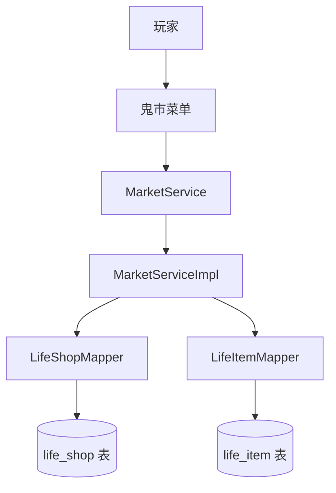
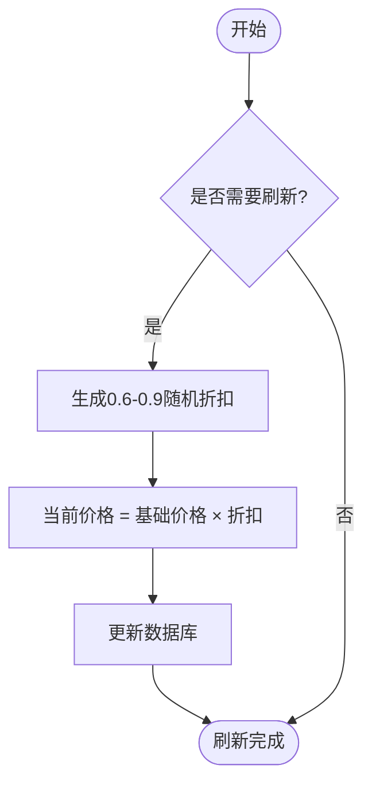
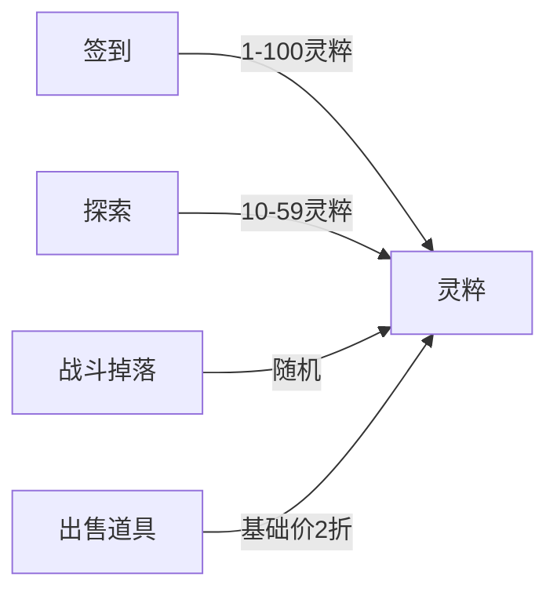
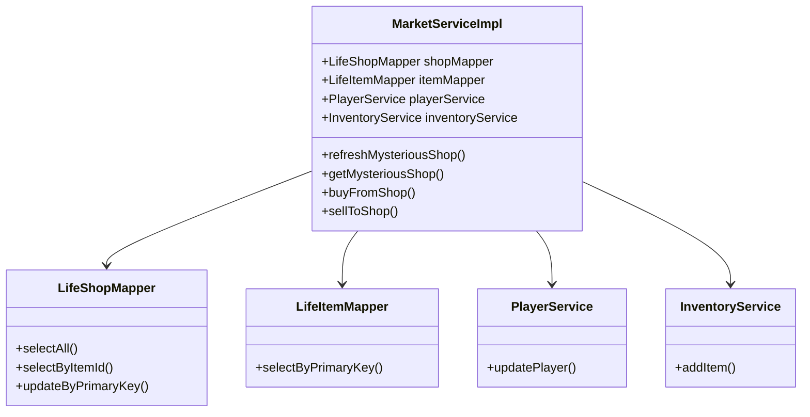

# 神秘商人商品折扣规律

<cite>
**本文档引用文件**  
- [MarketService.java](file://Life/src/main/java/com/bot/life/service/MarketService.java)
- [MarketServiceImpl.java](file://Life/src/main/java/com/bot/life/service/impl/MarketServiceImpl.java)
- [LifeShop.java](file://Life/src/main/java/com/bot/life/dao/entity/LifeShop.java)
- [LifeItem.java](file://Life/src/main/java/com/bot/life/dao/entity/LifeItem.java)
- [Life_User_Manual.md](file://Life_User_Manual.md)
- [浮生卷开发说明.md](file://浮生卷开发说明.md)
</cite>

## 目录
1. [引言](#引言)
2. [项目结构](#项目结构)
3. [核心组件](#核心组件)
4. [架构概述](#架构概述)
5. [详细组件分析](#详细组件分析)
6. [依赖分析](#依赖分析)
7. [性能考虑](#性能考虑)
8. [故障排除指南](#故障排除指南)
9. [结论](#结论)

## 引言
本文档深入分析了《浮生卷》游戏中神秘商人商品的折扣规律，基于`MarketService.java`接口和`MarketServiceImpl.java`实现类，解析商品定价策略、折扣模式及价格波动周期。结合灵粹货币系统，提供折扣计算公式与最优购买时机预测方法，帮助玩家识别高性价比商品，提升游戏内经济决策效率。

## 项目结构
游戏经济系统主要由Life模块实现，核心功能集中在`MarketService`及其`MarketServiceImpl`实现类中。商品数据通过`LifeShop`和`LifeItem`实体类管理，数据库表为`life_shop`和`life_item`。灵粹作为唯一货币贯穿整个交易系统。

```mermaid
graph TB
subgraph "Life模块"
MarketService["MarketService.java<br/>接口定义"]
MarketServiceImpl["MarketServiceImpl.java<br/>实现类"]
LifeShop["LifeShop.java<br/>商店实体"]
LifeItem["LifeItem.java<br/>道具实体"]
end
MarketService --> MarketServiceImpl
MarketServiceImpl --> LifeShop
MarketServiceImpl --> LifeItem
LifeShop --> LifeItem : "关联"
```

**图示来源**  
- [MarketService.java](file://Life/src/main/java/com/bot/life/service/MarketService.java#L1-L82)
- [MarketServiceImpl.java](file://Life/src/main/java/com/bot/life/service/impl/MarketServiceImpl.java#L1-L395)
- [LifeShop.java](file://Life/src/main/java/com/bot/life/dao/entity/LifeShop.java#L1-L28)
- [LifeItem.java](file://Life/src/main/java/com/bot/life/dao/entity/LifeItem.java#L1-L24)

**本节来源**  
- [MarketService.java](file://Life/src/main/java/com/bot/life/service/MarketService.java#L1-L82)
- [MarketServiceImpl.java](file://Life/src/main/java/com/bot/life/service/impl/MarketServiceImpl.java#L1-L395)

## 核心组件
核心组件包括`MarketService`接口和`MarketServiceImpl`实现类，负责神秘商人商店的展示、折扣刷新、商品购买与出售逻辑。`LifeShop`实体存储商品基础价格、当前价格和折扣信息，`LifeItem`实体定义道具类型与效果。

**本节来源**  
- [MarketService.java](file://Life/src/main/java/com/bot/life/service/MarketService.java#L1-L82)
- [MarketServiceImpl.java](file://Life/src/main/java/com/bot/life/service/impl/MarketServiceImpl.java#L1-L395)
- [LifeShop.java](file://Life/src/main/java/com/bot/life/dao/entity/LifeShop.java#L1-L28)

## 架构概述
系统采用典型的三层架构：表现层（菜单交互）、业务逻辑层（MarketService）、数据访问层（MyBatis Mapper）。神秘商人商店每日刷新折扣，玩家通过灵粹进行交易，所有操作均通过服务类协调完成。



**图示来源**  
- [MarketServiceImpl.java](file://Life/src/main/java/com/bot/life/service/impl/MarketServiceImpl.java#L22-L42)
- [LifeShopMapper.java](file://Life/src/main/java/com/bot/life/dao/mapper/LifeShopMapper.java#L1-L43)
- [LifeItemMapper.java](file://Life/src/main/java/com/bot/life/dao/mapper/LifeItemMapper.java#L1-L30)

## 详细组件分析

### 神秘商人折扣机制分析
神秘商人商店每日刷新一次折扣，折扣范围为6-9折，随机生成。所有商品共享同一刷新机制，确保每日价格波动。

#### 折扣刷新逻辑


**图示来源**  
- [MarketServiceImpl.java](file://Life/src/main/java/com/bot/life/service/impl/MarketServiceImpl.java#L357-L377)

#### 商品类别与定价策略
根据`浮生卷开发说明.md`，商品分为六大类：
- 修为类：直接增加修为
- 属性类：永久增加属性
- 体力类：恢复体力
- 升级法宝类：增加法宝熟练度
- 恢复类：恢复生命值
- 技能书：学习新技能

不同类别商品的基础价格由配置决定，但折扣机制统一。

**本节来源**  
- [浮生卷开发说明.md](file://浮生卷开发说明.md#L107-L117)
- [LifeItem.java](file://Life/src/main/java/com/bot/life/dao/entity/LifeItem.java#L13-L20)

### 灵粹货币系统分析
灵粹是游戏内唯一交易货币，用于购买神秘商人商品或玩家摊位商品。玩家可通过签到、探索、战斗掉落等方式获取灵粹。

#### 灵粹获取途径


**图示来源**  
- [SigninServiceImpl.java](file://Life/src/main/java/com/bot/life/service/impl/SigninServiceImpl.java#L43)
- [ExplorationServiceImpl.java](file://Life/src/main/java/com/bot/life/service/impl/ExplorationServiceImpl.java#L130)
- [MarketServiceImpl.java](file://Life/src/main/java/com/bot/life/service/impl/MarketServiceImpl.java#L198-L202)

#### 出售机制
玩家向神秘商人出售道具时，价格为商品基础价格的2折，无论当前折扣如何。

**本节来源**  
- [浮生卷开发说明.md](file://浮生卷开发说明.md#L189-L190)
- [MarketServiceImpl.java](file://Life/src/main/java/com/bot/life/service/impl/MarketServiceImpl.java#L198-L202)

## 依赖分析
系统依赖MyBatis进行数据库操作，通过Spring注入`LifeShopMapper`和`LifeItemMapper`。`MarketServiceImpl`依赖`PlayerService`和`InventoryService`完成玩家信息更新和背包管理。



**图示来源**  
- [MarketServiceImpl.java](file://Life/src/main/java/com/bot/life/service/impl/MarketServiceImpl.java#L25-L41)
- [MarketService.java](file://Life/src/main/java/com/bot/life/service/MarketService.java#L1-L82)

**本节来源**  
- [MarketServiceImpl.java](file://Life/src/main/java/com/bot/life/service/impl/MarketServiceImpl.java#L25-L41)
- [LifeShopMapper.java](file://Life/src/main/java/com/bot/life/dao/mapper/LifeShopMapper.java#L1-L43)

## 性能考虑
- 折扣刷新采用每日一次机制，避免频繁计算
- 商品列表查询使用全表扫描，建议对`life_shop`表的`item_id`建立索引
- 灵粹交易操作均在事务中完成，确保数据一致性

## 故障排除指南
常见问题及解决方案：
- **商品不存在**：检查`life_shop`表是否配置商品
- **灵粹不足**：确认玩家灵粹数量及商品价格
- **购买失败**：检查背包容量及数据库事务状态

**本节来源**  
- [MarketServiceImpl.java](file://Life/src/main/java/com/bot/life/service/impl/MarketServiceImpl.java#L160-L162)
- [MarketServiceImpl.java](file://Life/src/main/java/com/bot/life/service/impl/MarketServiceImpl.java#L351-L353)

## 结论
神秘商人商品折扣规律为每日刷新的6-9折随机折扣，所有商品统一刷新机制。玩家应关注每日首次访问商店以获取最优折扣。出售给商人的价格固定为基础价格的2折，不受折扣影响。建议玩家优先购买高价值属性类或修为类商品，最大化灵粹使用效率。