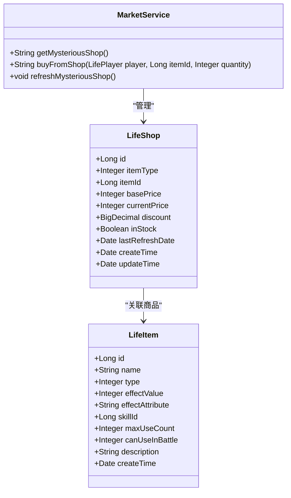
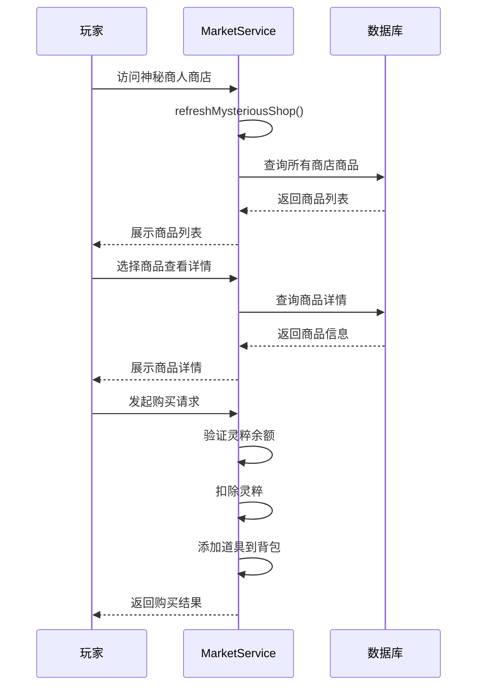
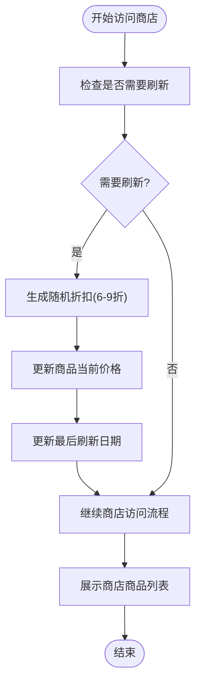
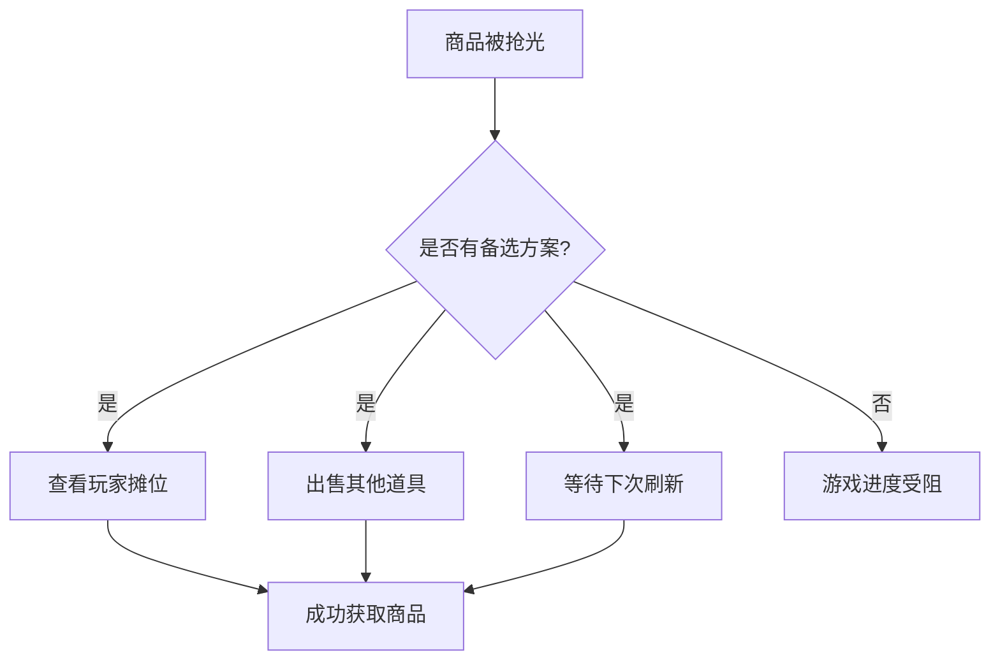

# 神秘商人库存管理技巧

<cite>
**本文档引用文件**   
- [MarketService.java](file://Life\src\main\java\com\bot\life\service\MarketService.java)
- [MarketServiceImpl.java](file://Life\src\main\java\com\bot\life\service\impl\MarketServiceImpl.java)
- [Life_User_Manual.md](file://Life_User_Manual.md)
- [LifeShop.java](file://Life\src\main\java\com\bot\life\dao\entity\LifeShop.java)
- [LifeItem.java](file://Life\src\main\java\com\bot\life\dao\entity\LifeItem.java)
</cite>

## 目录
1. [引言](#引言)
2. [商品库存机制分析](#商品库存机制分析)
3. [热门商品抢购规律](#热门商品抢购规律)
4. [补货与刷新机制](#补货与刷新机制)
5. [库存监控方法](#库存监控方法)
6. [抢购优先级策略](#抢购优先级策略)
7. [备选方案规划](#备选方案规划)
8. [总结](#总结)

## 引言
神秘商人是游戏中重要的资源获取渠道，其库存商品直接影响玩家的成长效率。本指南基于`MarketService.java`中的`buyFromShop`和`getMysteriousShop`方法，结合`Life_User_Manual.md`中对鬼市交易的描述，系统阐述商品库存管理技巧，帮助玩家制定高效的采购策略。

## 商品库存机制分析
神秘商人商店的商品库存由`LifeShop`实体类管理，每个商品记录包含基础价格、当前价格、折扣率和库存状态等信息。通过`buyFromShop`方法实现购买逻辑，系统会检查玩家灵粹是否充足，并在购买成功后更新玩家背包和灵粹余额。

商品库存的管理遵循以下核心原则：
- **库存状态控制**：通过`inStock`字段标记商品是否有库存
- **价格动态调整**：基于`basePrice`和`discount`计算`currentPrice`
- **数据持久化**：所有商品信息存储在数据库`life_shop`表中

**图示来源**
- [LifeShop.java](file://Life\src\main\java\com\bot\life\dao\entity\LifeShop.java#L1-L28)
- [LifeItem.java](file://Life\src\main\java\com\bot\life\dao\entity\LifeItem.java#L1-L23)
- [MarketService.java](file://Life\src\main\java\com\bot\life\service\MarketService.java#L1-L82)

**本节来源**
- [MarketService.java](file://Life\src\main\java\com\bot\life\service\MarketService.java#L1-L82)
- [MarketServiceImpl.java](file://Life\src\main\java\com\bot\life\service\impl\MarketServiceImpl.java#L1-L382)

## 热门商品抢购规律
根据代码分析，热门商品的抢购存在明显的规律性特征。系统在`getMysteriousShop`方法中实现了商品列表展示逻辑，玩家需要通过数字选择商品查看详情并进行购买。

抢购流程的关键节点：
1. 访问神秘商人商店（选择菜单选项1）
2. 查看商品列表，识别高性价比商品
3. 输入数字查看商品详情
4. 执行"购买 数量"命令完成交易

**图示来源**
- [MarketService.java](file://Life\src\main\java\com\bot\life\service\MarketService.java#L18-L39)
- [MarketServiceImpl.java](file://Life\src\main\java\com\bot\life\service\impl\MarketServiceImpl.java#L65-L96)
- [LifeHandlerImpl.java](file://Life\src\main\java\com\bot\life\service\impl\LifeHandlerImpl.java#L856-L1038)

**本节来源**
- [MarketServiceImpl.java](file://Life\src\main\java\com\bot\life\service\impl\MarketServiceImpl.java#L65-L172)
- [LifeHandlerImpl.java](file://Life\src\main\java\com\bot\life\service\impl\LifeHandlerImpl.java#L856-L1038)

## 补货与刷新机制
神秘商人商店采用每日刷新机制，这是库存管理的核心特点。`refreshMysteriousShop`方法负责处理每日商品刷新逻辑，确保玩家每天都能获得新的购买机会。

刷新机制的具体实现：
- **刷新时机**：每次访问商店时检查是否需要刷新
- **折扣计算**：随机生成6-9折的折扣率
- **时间标记**：使用`lastRefreshDate`记录最后刷新日期

**图示来源**
- [MarketServiceImpl.java](file://Life\src\main\java\com\bot\life\service\impl\MarketServiceImpl.java#L357-L378)
- [LifeShop.java](file://Life\src\main\java\com\bot\life\dao\entity\LifeShop.java#L21-L23)

**本节来源**
- [MarketServiceImpl.java](file://Life\src\main\java\com\bot\life\service\impl\MarketServiceImpl.java#L357-L382)
- [Life_User_Manual.md](file://Life_User_Manual.md#L214-L215)

## 库存监控方法
有效的库存监控是成功抢购的前提。根据`Life_User_Manual.md`的描述和代码实现，建议采用以下监控策略：

1. **定时检查**：每天固定时间访问神秘商人商店，确保第一时间获取刷新后的商品列表
2. **价格对比**：记录商品的基础价格和当前价格，计算实际折扣率
3. **需求预判**：根据角色发展需求，提前确定需要购买的商品类型

监控流程：
- 每日首次访问时，系统自动触发`refreshMysteriousShop`方法
- 商品列表中显示"今日折扣已刷新"提示
- 玩家可根据折扣信息判断商品性价比

**本节来源**
- [Life_User_Manual.md](file://Life_User_Manual.md#L214-L215)
- [MarketServiceImpl.java](file://Life\src\main\java\com\bot\life\service\impl\MarketServiceImpl.java#L66-L77)

## 抢购优先级策略
基于商品类型和玩家需求，建议建立以下抢购优先级排序：

### 高优先级商品
- **修为类道具**：直接提升角色等级
- **技能书**：学习新技能，增强战斗力
- **稀有装备**：提供属性加成

### 中优先级商品
- **属性类道具**：临时提升特定属性
- **恢复类道具**：战斗中的重要补给

### 低优先级商品
- **普通消耗品**：容易通过其他途径获取

优先级决策应考虑：
- 当前角色发展阶段
- 灵粹储备情况
- 商品折扣力度

**本节来源**
- [LifeItem.java](file://Life\src\main\java\com\bot\life\dao\entity\LifeItem.java#L15-L20)
- [Life_User_Manual.md](file://Life_User_Manual.md#L214-L215)

## 备选方案规划
当心仪商品被抢购一空时，应有完善的备选方案：

1. **玩家摊位交易**：通过`getAllPlayerStalls`方法查看其他玩家的摆摊商品
2. **资源置换**：出售多余道具换取灵粹
3. **延迟购买**：等待下一次刷新，部分商品可能再次出现

备选方案的优势：
- 玩家摊位商品价格可协商
- 出售道具可获得额外灵粹
- 多样化的获取渠道降低依赖

**图示来源**
- [MarketService.java](file://Life\src\main\java\com\bot\life\service\MarketService.java#L54-L77)
- [MarketServiceImpl.java](file://Life\src\main\java\com\bot\life\service\impl\MarketServiceImpl.java#L220-L253)

**本节来源**
- [MarketService.java](file://Life\src\main\java\com\bot\life\service\MarketService.java#L54-L77)
- [MarketServiceImpl.java](file://Life\src\main\java\com\bot\life\service\impl\MarketServiceImpl.java#L220-L296)

## 总结
神秘商人库存管理需要综合考虑刷新机制、商品优先级和备选方案。通过每日定时监控、合理规划购买顺序，并灵活运用玩家间交易系统，玩家可以最大化资源获取效率，为角色发展提供有力支持。