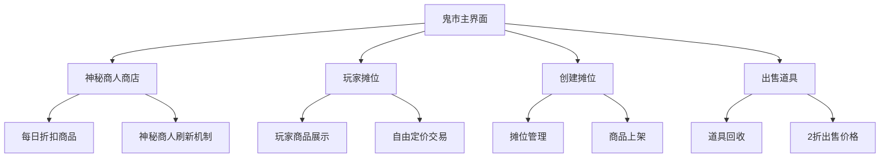
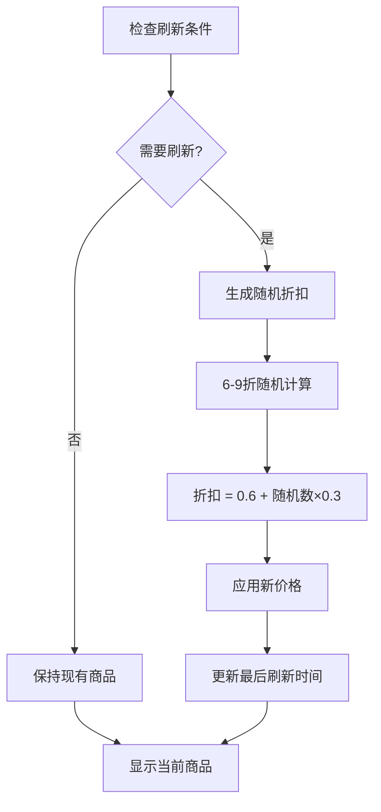
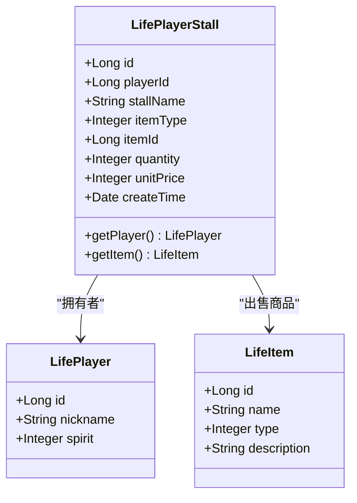
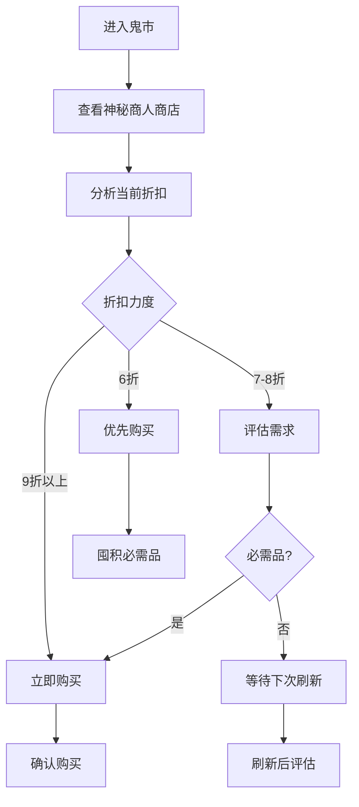
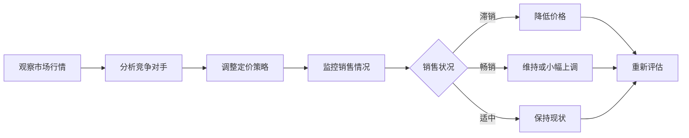
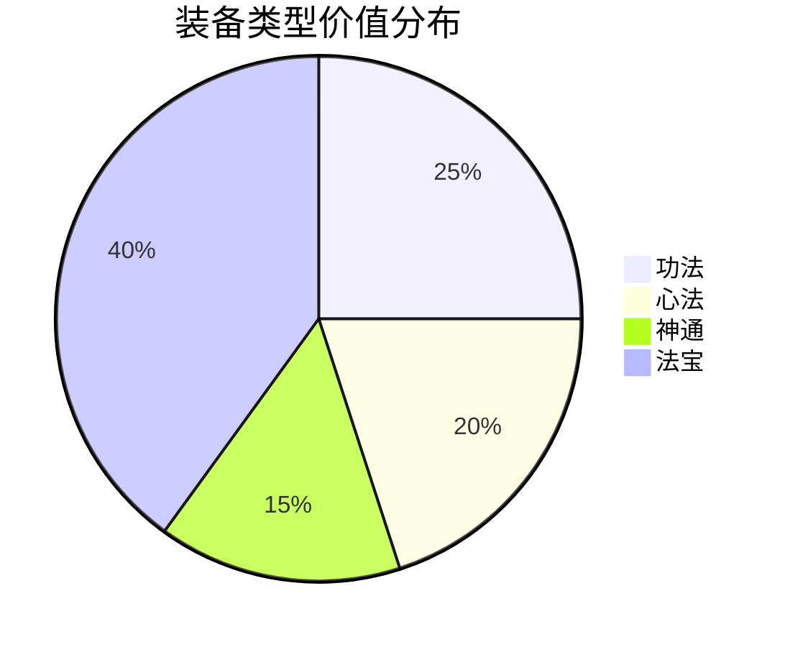
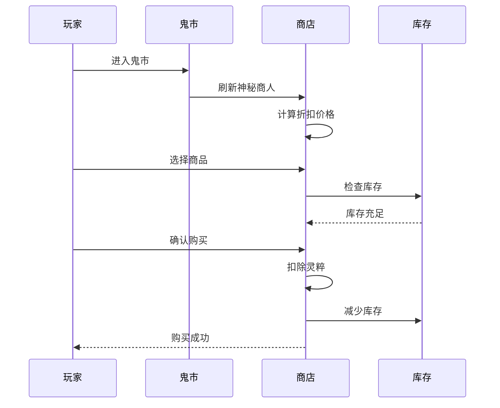

# 鬼市交易优化方法

<cite>
**本文档引用的文件**
- [Life_User_Manual.md](file://Life_User_Manual.md)
- [LifeHandlerImpl.java](file://Life\src\main\java\com\bot\life\service\impl\LifeHandlerImpl.java)
- [MarketServiceImpl.java](file://Life\src\main\java\com\bot\life\service\impl\MarketServiceImpl.java)
- [MarketService.java](file://Life\src\main\java\com\bot\life\service\MarketService.java)
- [LifeShop.java](file://Life\src\main\java\com\bot\life\dao\entity\LifeShop.java)
- [LifePlayerStall.java](file://Life\src\main\java\com\bot\life\dao\entity\LifePlayerStall.java)
- [LifeItem.java](file://Life\src\main\java\com\bot\life\dao\entity\LifeItem.java)
- [ENItemType.java](file://Life\src\main\java\com\bot\life\enums\ENItemType.java)
- [ENEquipmentType.java](file://Life\src\main\java\com\bot\life\enums\ENEquipmentType.java)
- [Life_Database_Init.sql](file://Life_Database_Init.sql)
</cite>

## 目录
1. [概述](#概述)
2. [神秘商人系统](#神秘商人系统)
3. [玩家摆摊系统](#玩家摆摊系统)
4. [交易策略与技巧](#交易策略与技巧)
5. [市场供需分析](#市场供需分析)
6. [最佳实践指南](#最佳实践指南)
7. [常见问题解答](#常见问题解答)

## 概述

鬼市是《浮生卷》游戏中一个特殊的交易场所，融合了神秘商人和玩家交易两大核心功能。在这里，玩家可以享受神秘商人提供的每日折扣商品，也可以自由摆摊与其他玩家进行交易。掌握鬼市交易技巧是提升游戏收益的重要手段。

### 鬼市核心功能



**图表来源**
- [LifeHandlerImpl.java](file://Life\src\main\java\com\bot\life\service\impl\LifeHandlerImpl.java#L960-L1070)
- [MarketServiceImpl.java](file://Life\src\main\java\com\bot\life\service\impl\MarketServiceImpl.java#L48-L62)

## 神秘商人系统

### 商店刷新机制

神秘商人的商品每天都会刷新，这是鬼市交易的核心机制之一。

#### 刷新时间与频率
- **刷新时间**：每日零点自动刷新
- **刷新范围**：所有商品的折扣重新计算
- **刷新条件**：当商店为空或商品最后刷新日期不是当天时触发

#### 折扣计算规则



**图表来源**
- [MarketServiceImpl.java](file://Life\src\main\java\com\bot\life\service\impl\MarketServiceImpl.java#L356-L377)

#### 折扣范围详解

| 折扣范围 | 概率 | 价格计算 |
|---------|------|----------|
| 6折 | 10% | 基础价格 × 0.6 |
| 7折 | 30% | 基础价格 × 0.7 |
| 8折 | 40% | 基础价格 × 0.8 |
| 9折 | 20% | 基础价格 × 0.9 |

### 商品价格策略

#### 基础价格与当前价格

每个商品都有两个关键价格指标：
- **基础价格**：商品的原始定价
- **当前价格**：基于折扣计算后的实际售价

#### 价格计算公式
```
当前价格 = 基础价格 × 折扣系数
折扣系数 = 0.6 + 随机数 × 0.3
```

**节来源**
- [MarketServiceImpl.java](file://Life\src\main\java\com\bot\life\service\impl\MarketServiceImpl.java#L356-L377)
- [LifeShop.java](file://Life\src\main\java\com\bot\life\dao\entity\LifeShop.java#L14-L28)

## 玩家摆摊系统

### 摊位创建流程

玩家可以通过摆摊功能创建自己的交易摊位，与其他玩家进行直接交易。

#### 摆摊命令格式
```
摆摊+道具ID+数量+单价
示例：摆摊1+10+100
```

#### 摊位信息组成



**图表来源**
- [LifePlayerStall.java](file://Life\src\main\java\com\bot\life\dao\entity\LifePlayerStall.java#L11-L26)

### 摆摊定价策略

#### 定价原则

1. **成本回收原则**：确保至少覆盖成本
2. **市场竞争力**：参考其他玩家定价
3. **需求导向**：根据商品稀缺性调整价格

#### 价格区间建议

| 商品类型 | 基础定价 | 推荐价格区间 | 最高价格 |
|---------|----------|-------------|----------|
| 修为类道具 | 50-200灵粹 | 60-250灵粹 | 300灵粹 |
| 属性类道具 | 100-500灵粹 | 120-600灵粹 | 800灵粹 |
| 体力恢复道具 | 20-100灵粹 | 25-120灵粹 | 150灵粹 |
| 恢复类道具 | 30-150灵粹 | 35-180灵粹 | 200灵粹 |
| 技能书 | 200-1000灵粹 | 250-1200灵粹 | 1500灵粹 |

**节来源**
- [MarketServiceImpl.java](file://Life\src\main\java\com\bot\life\service\impl\MarketServiceImpl.java#L255-L290)

## 交易策略与技巧

### 最佳购买时机

#### 神秘商人购买策略



#### 购买决策矩阵

| 折扣等级 | 购买优先级 | 推荐策略 |
|---------|------------|----------|
| 9折 | 低 | 评估需求，非必需品可等待 |
| 8折 | 中 | 评估需求，可适量购买 |
| 7折 | 高 | 必需品优先购买 |
| 6折 | 极高 | 必需品立即购买 |

### 玩家交易策略

#### 摆摊时机选择

1. **商品稀缺期**：某些稀有道具刚产出时
2. **活动期间**：游戏活动奖励道具大量产出时
3. **版本更新**：新版本发布后旧道具贬值时

#### 价格调整策略



**节来源**
- [LifeHandlerImpl.java](file://Life\src\main\java\com\bot\life\service\impl\LifeHandlerImpl.java#L1037-L1066)

## 市场供需分析

### 商品分类与价值评估

#### 道具类型价值对比

| 类型 | 特点 | 交易价值 | 流动性 |
|------|------|----------|--------|
| 修为类 | 基础修炼资源 | 中等 | 高 |
| 属性类 | 永久属性提升 | 高 | 中等 |
| 体力类 | 恢复体力 | 中等 | 高 |
| 恢复类 | 战斗中使用 | 中等 | 高 |
| 技能书 | 技能学习 | 高 | 低 |
| 法宝 | 战斗装备 | 极高 | 低 |

#### 装备价值评估



**节来源**
- [ENItemType.java](file://Life\src\main\java\com\bot\life\enums\ENItemType.java#L8-L13)
- [ENEquipmentType.java](file://Life\src\main\java\com\bot\life\enums\ENEquipmentType.java#L8-L11)

### 市场周期规律

#### 季节性波动

1. **月初**：新玩家涌入，对基础道具需求旺盛
2. **月中**：活跃玩家交易高峰期
3. **月末**：清理库存，价格普遍下降

#### 特殊事件影响

- **版本更新**：旧版本道具大幅贬值
- **活动结束**：活动道具价格暴跌
- **服务器维护**：交易量显著下降

## 最佳实践指南

### 神秘商人交易优化

#### 日常交易计划

1. **每日检查**：早上9点检查神秘商人刷新
2. **需求评估**：列出必需品清单
3. **预算分配**：合理分配灵粹预算
4. **批量购买**：对必需品进行批量采购

#### 高效购买流程



**图表来源**
- [MarketServiceImpl.java](file://Life\src\main\java\com\bot\life\service\impl\MarketServiceImpl.java#L146-L179)

### 玩家交易优化

#### 摆摊成功要素

1. **商品选择**：选择市场需求大的商品
2. **价格定位**：参考市场价格合理定价
3. **宣传策略**：通过聊天频道推广
4. **客户服务**：及时响应买家咨询

#### 交易风险管理

- **信用建立**：保持良好的交易记录
- **价格透明**：明码标价，避免纠纷
- **安全交易**：优先选择信誉好的买家
- **库存管理**：合理控制库存量

**节来源**
- [MarketServiceImpl.java](file://Life\src\main\java\com\bot\life\service\impl\MarketServiceImpl.java#L255-L354)

### 灵粹管理策略

#### 灵粹分配原则

1. **必需品优先**：确保基本生存需求
2. **投资导向**：在高回报商品上投入
3. **流动性保持**：保留一定流动资金
4. **风险分散**：不要把所有灵粹押注单一商品

#### 灵粹增长途径

| 来源 | 稳定性 | 回报率 | 风险 |
|------|--------|--------|------|
| 战斗奖励 | 高 | 中 | 低 |
| 成就奖励 | 中 | 高 | 低 |
| 鬼市交易 | 中 | 高 | 中 |
| 世界BOSS | 低 | 极高 | 高 |

## 常见问题解答

### 神秘商人相关

**Q: 神秘商人什么时候刷新？**
A: 每天零点自动刷新，刷新后所有商品的折扣重新计算。

**Q: 怎么判断神秘商人商品值得购买？**
A: 重点关注6折和7折的商品，特别是对角色成长有帮助的属性类道具。

**Q: 神秘商人商品卖完怎么办？**
A: 可以等待第二天刷新，或者在鬼市的玩家摊位寻找替代商品。

### 玩家交易相关

**Q: 摆摊需要手续费吗？**
A: 不需要手续费，但需要消耗一定的灵粹作为保证金。

**Q: 怎么知道其他玩家的价格？**
A: 在"玩家摊位"功能中可以看到所有摊位的详细信息。

**Q: 摆摊后怎么下架商品？**
A: 当商品数量为0时自动下架，或者联系管理员手动处理。

### 交易策略相关

**Q: 如何判断商品价格是否合理？**
A: 参考神秘商人当前的折扣价格，以及同类商品在其他玩家摊位的售价。

**Q: 交易失败怎么办？**
A: 检查双方灵粹余额，确认商品库存，确保交易指令格式正确。

**Q: 怎么避免被坑？**
A: 选择信誉好的卖家，对于高价商品要多方比较，谨慎交易。

**节来源**
- [Life_User_Manual.md](file://Life_User_Manual.md#L203-L220)
- [MarketServiceImpl.java](file://Life\src\main\java\com\bot\life\service\impl\MarketServiceImpl.java#L64-L95)

## 结论

鬼市交易系统是《浮生卷》游戏中最重要的经济系统之一。通过掌握神秘商人的刷新机制、理解玩家交易的运作原理、制定合理的交易策略，玩家可以在游戏中获得显著的经济优势。

成功的鬼市交易需要：
- 对市场趋势的准确把握
- 合理的资金管理
- 高效的时间利用
- 良好的交易策略

持续关注市场动态，积累交易经验，将帮助玩家在鬼市这个虚拟经济体系中获得最大收益。