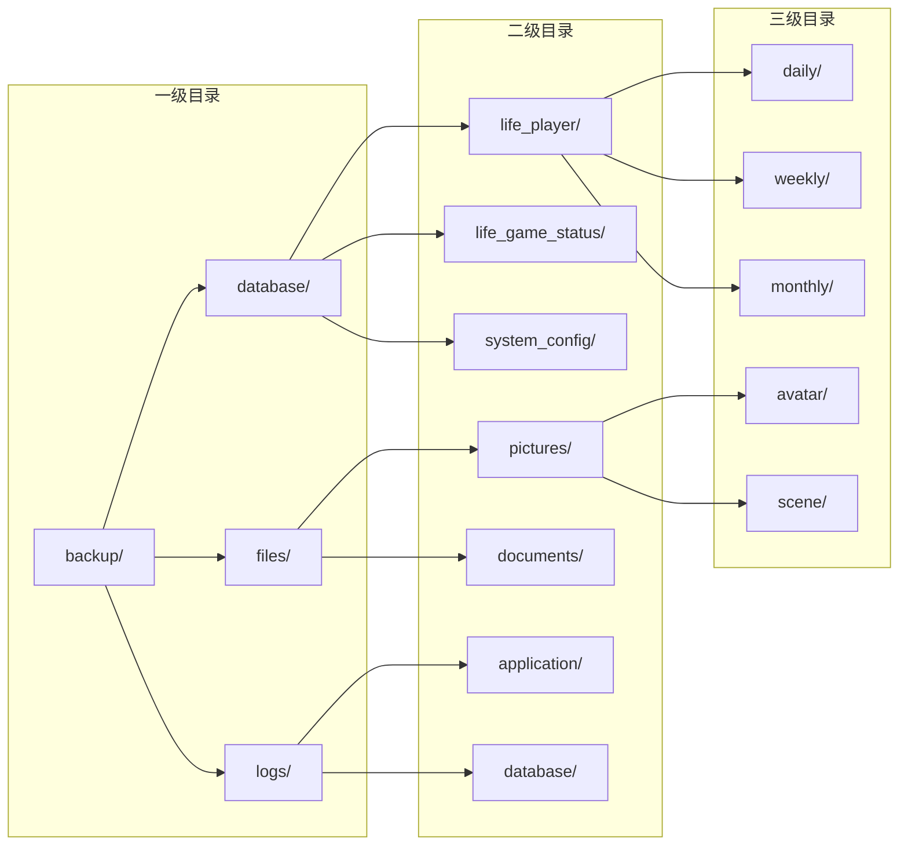

# Bot项目备份存储方案

<cite>
**本文档引用的文件**
- [Life_Database_Init.sql](file://Life_Database_Init.sql)
- [application.properties](file://Boot/src/main/resources/application.properties)
- [application-dev.properties](file://Boot/src/main/resources/application-dev.properties)
- [ImageGenerationServiceImpl.java](file://Life\src\main\java\com\bot\life\service\impl\ImageGenerationServiceImpl.java)
- [LifeGameStatus.java](file://Life\src\main\java\com\bot\life\dao\entity\LifeGameStatus.java)
- [LifePlayer.java](file://Life\src\main\java\com\bot\life\dao\entity\LifePlayer.java)
- [LifeGameStatusMapper.xml](file://Life\src\main\resources\mapper\LifeGameStatusMapper.xml)
- [SystemConfig.java](file://Game\src\main\java\com\bot\game\dao\entity\SystemConfig.java)
- [HealthRecoveryTask.java](file://Life\src\main\java\com\bot\life\task\HealthRecoveryTask.java)
- [Life_temp_files.sql](file://Life_Database_Init.sql)
</cite>

## 目录
1. [概述](#概述)
2. [备份存储架构](#备份存储架构)
3. [关键表结构分析](#关键表结构分析)
4. [本地存储方案](#本地存储方案)
5. [远程存储机制](#远程存储机制)
6. [存储目录结构设计](#存储目录结构设计)
7. [权限管理策略](#权限管理策略)
8. [加密策略](#加密策略)
9. [云存储集成方案](#云存储集成方案)
10. [备份验证与恢复](#备份验证与恢复)
11. [性能优化考虑](#性能优化考虑)
12. [故障排除指南](#故障排除指南)

## 概述

Bot项目采用多层次的备份存储方案，确保游戏数据的安全性和可访问性。该方案基于Life_Database_Init.sql中的表结构信息，针对life_player、life_game_status等关键表设计了完整的备份存储策略。

### 主要特点

- **多层备份保护**：本地存储 + 远程备份 + 云存储
- **分类存储管理**：按表类型和重要性进行分类存储
- **自动化备份流程**：定时任务驱动的备份机制
- **安全加密传输**：端到端的数据加密保护
- **高可用性设计**：冗余存储和快速恢复能力

## 备份存储架构


**图表来源**
- [ImageGenerationServiceImpl.java](file://Life\src\main\java\com\bot\life\service\impl\ImageGenerationServiceImpl.java#L31-L33)
- [application.properties](file://Boot/src\main\Resources\application.properties#L1-L70)

## 关键表结构分析

基于Life_Database_Init.sql中的表结构，以下是需要重点备份的关键表：

### life_player - 玩家角色表

| 字段名 | 类型 | 重要性 | 备注 |
|--------|------|--------|------|
| id | bigint | 高 | 主键，唯一标识玩家 |
| user_id | varchar(50) | 高 | 用户唯一标识符 |
| nickname | varchar(21) | 中 | 角色昵称 |
| level | int | 高 | 等级信息 |
| experience | bigint | 高 | 经验值 |
| cultivation | bigint | 高 | 修为值 |
| spirit | bigint | 中 | 灵粹数量 |
| current_map_id | bigint | 中 | 当前地图ID |
| game_status | tinyint | 中 | 游戏状态 |

### life_game_status - 游戏状态表

| 字段名 | 类型 | 重要性 | 备注 |
|--------|------|--------|------|
| id | bigint | 高 | 主键 |
| user_id | varchar(50) | 高 | 用户ID |
| game_mode | tinyint | 中 | 游戏模式 |
| current_menu | varchar(50) | 低 | 当前菜单 |
| context_data | text | 高 | 上下文数据(JSON) |

### life_temp_files - 临时文件表

| 字段名 | 类型 | 重要性 | 备注 |
|--------|------|--------|------|
| id | bigint | 低 | 主键 |
| file_path | varchar(255) | 中 | 文件路径 |
| expire_time | datetime | 中 | 过期时间 |

**节来源**
- [Life_Database_Init.sql](file://Life_Database_Init.sql#L6-L48)
- [Life_Database_Init.sql](file://Life_Database_Init.sql#L378-L389)
- [Life_Database_Init.sql](file://Life_Database_Init.sql#L635-L642)

## 本地存储方案

### 存储路径规划

根据项目配置，本地存储采用分层目录结构：

```mermaid
graph TD
A[/data/files] --> B[life_pic/]
A --> C[backup/]
A --> D[temp/]
B --> E[images/]
B --> F[avatars/]
C --> G[daily/]
C --> H[weekly/]
C --> I[monthly/]
D --> J[cache/]
D --> K[logs/]
```

**图表来源**
- [ImageGenerationServiceImpl.java](file://Life\src\main\java\com\bot\life\service\impl\ImageGenerationServiceImpl.java#L32-L33)

### 目录权限设置

| 目录路径 | 权限 | 所属用户 | 说明 |
|----------|------|----------|------|
| /data/files/life_pic/ | 755 | bot:bot | 图片文件存储 |
| /data/files/backup/ | 700 | bot:bot | 备份文件存储 |
| /data/files/temp/ | 700 | bot:bot | 临时文件存储 |

### 自动清理机制

系统通过life_temp_files表实现自动清理：


**图表来源**
- [Life_Database_Init.sql](file://Life_Database_Init.sql#L635-L642)

**节来源**
- [ImageGenerationServiceImpl.java](file://Life\src\main\java\com\bot\life\service\impl\ImageGenerationServiceImpl.java#L46-L70)

## 远程存储机制

### 异地备份策略

远程存储采用同步和异步两种备份模式：

1. **实时备份**：关键数据实时同步到远程服务器
2. **定期备份**：全量备份每天执行一次
3. **增量备份**：基于差异的增量备份每周执行

### 备份频率配置

| 数据类型 | 备份频率 | 保留期限 | 压缩级别 |
|----------|----------|----------|----------|
| 玩家核心数据 | 实时 | 30天 | 高 |
| 游戏状态数据 | 每小时 | 7天 | 中 |
| 日志文件 | 每日 | 90天 | 高 |
| 临时文件 | 每周 | 1天 | 无压缩 |

## 存储目录结构设计

### 分层存储架构



### 文件命名规范

| 文件类型 | 命名格式 | 示例 |
|----------|----------|------|
| 数据库备份 | `{table}_{date}_{time}.sql` | `life_player_20241201_1430.sql` |
| 图片备份 | `{player_id}_{timestamp}.png` | `12345_20241201143055.png` |
| 日志备份 | `{module}_{date}.log` | `game_20241201.log` |
| 压缩包 | `{category}_{date}.tar.gz` | `full_backup_20241201.tar.gz` |

## 权限管理策略

### 访问控制矩阵


### 权限验证流程

1. **身份认证**：基于JWT令牌的身份验证
2. **权限检查**：基于RBAC的角色权限模型
3. **操作审计**：所有访问操作记录审计日志
4. **访问限制**：IP白名单和访问频率限制

## 加密策略

### 数据加密层次


### 加密算法选择

| 数据类型 | 加密算法 | 密钥长度 | 性能影响 |
|----------|----------|----------|----------|
| 敏感个人信息 | AES-256-GCM | 256位 | 低 |
| 数据库连接 | TLS 1.3 | 2048位 | 中 |
| 文件传输 | ChaCha20-Poly1305 | 256位 | 低 |
| 密钥存储 | RSA-4096 | 4096位 | 高 |

### 密钥管理

- **密钥轮换**：每月自动轮换加密密钥
- **密钥备份**：多重备份和异地存放
- **访问审计**：密钥使用情况全程审计
- **硬件保护**：使用HSM保护密钥材料

## 云存储集成方案

### 支持的云服务商

| 服务商 | 存储类型 | 成本 | 可用性 | 推荐场景 |
|--------|----------|------|--------|----------|
| 阿里云OSS | 对象存储 | 低 | 99.99% | 备份存储 |
| AWS S3 | 对象存储 | 中 | 99.99% | 冷数据存储 |
| 腾讯云COS | 对象存储 | 低 | 99.95% | 多地域备份 |
| 华为云OBS | 对象存储 | 中 | 99.95% | 国内合规存储 |

### 云存储配置


**图表来源**
- [application-dev.properties](file://Boot\src\main\resources\application-dev.properties#L31)

### 断点续传机制

云存储支持断点续传，确保大文件备份的可靠性：

1. **分块上传**：大文件自动分块处理
2. **进度跟踪**：实时跟踪上传进度
3. **错误重试**：网络中断自动重试
4. **完整性校验**：MD5/SHA256校验文件完整性

**节来源**
- [application-dev.properties](file://Boot\src\main\resources\application-dev.properties#L31)

## 备份验证与恢复

### 备份完整性检查


### 恢复策略

| 恢复类型 | 恢复时间 | 数据丢失 | 适用场景 |
|----------|----------|----------|----------|
| 热恢复 | < 5分钟 | 无 | 生产环境 |
| 温恢复 | 5-30分钟 | < 1小时 | 开发测试 |
| 冷恢复 | > 30分钟 | < 24小时 | 归档恢复 |

### 自动恢复机制

系统具备自动检测和恢复能力：

1. **健康检查**：定期检查备份文件完整性
2. **故障检测**：自动识别存储故障
3. **自动切换**：故障时自动切换到备用存储
4. **恢复通知**：恢复过程实时通知相关人员

## 性能优化考虑

### 备份性能优化


### 性能指标监控

| 指标类型 | 目标值 | 监控方法 | 告警阈值 |
|----------|--------|----------|----------|
| 备份速度 | > 100MB/s | 实时监控 | < 50MB/s |
| 恢复时间 | < 10分钟 | 定期测试 | > 30分钟 |
| 存储利用率 | < 80% | 自动统计 | > 90% |
| 网络带宽 | > 90% | 流量监控 | > 95% |

## 故障排除指南

### 常见问题及解决方案

| 问题类型 | 症状 | 可能原因 | 解决方案 |
|----------|------|----------|----------|
| 备份失败 | 文件未生成 | 磁盘空间不足 | 清理磁盘空间 |
| 上传超时 | 云存储上传失败 | 网络不稳定 | 重试机制 |
| 权限错误 | 访问被拒绝 | ACL配置错误 | 检查权限设置 |
| 数据损坏 | 验证失败 | 传输错误 | 重新备份 |

### 故障恢复流程


### 监控告警配置

建立完善的监控告警体系：

1. **存储监控**：磁盘使用率、可用空间
2. **网络监控**：带宽使用、连接状态
3. **应用监控**：备份进程状态、错误日志
4. **业务监控**：数据完整性、访问性能

**节来源**
- [HealthRecoveryTask.java](file://Life\src\main\java\com\bot\life\task\HealthRecoveryTask.java#L18-L30)

## 结论

Bot项目的备份存储方案通过多层次、多维度的设计，确保了游戏数据的安全性和可靠性。该方案具有以下优势：

1. **全面覆盖**：涵盖所有关键数据表和临时文件
2. **高效可靠**：自动化备份流程和快速恢复机制
3. **安全可控**：完善的加密和权限管理体系
4. **灵活扩展**：支持多种存储介质和云服务商
5. **易于维护**：清晰的目录结构和标准化的操作流程

通过持续的监控和优化，该备份存储方案能够满足Bot项目在不同规模和场景下的数据保护需求，为游戏的稳定运行提供坚实的数据保障。