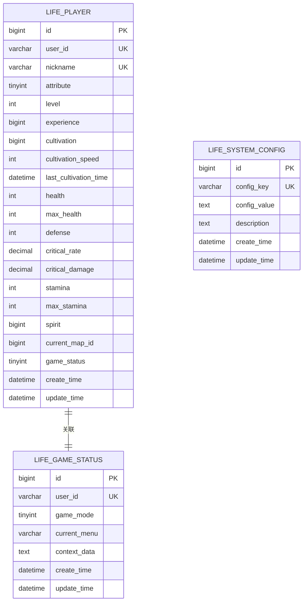
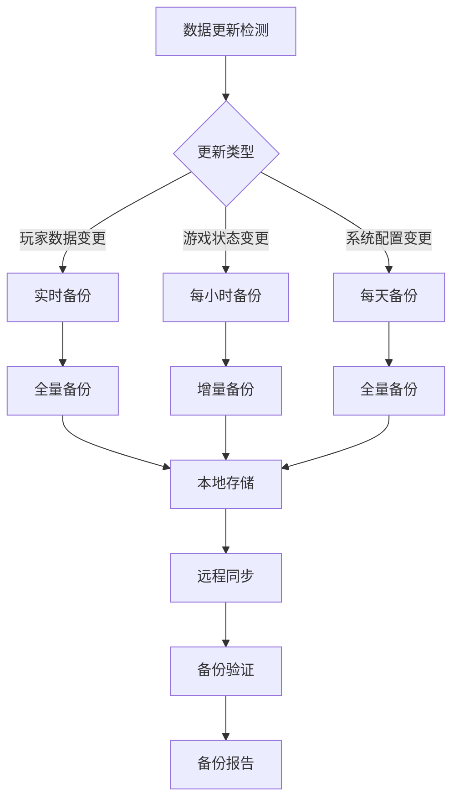
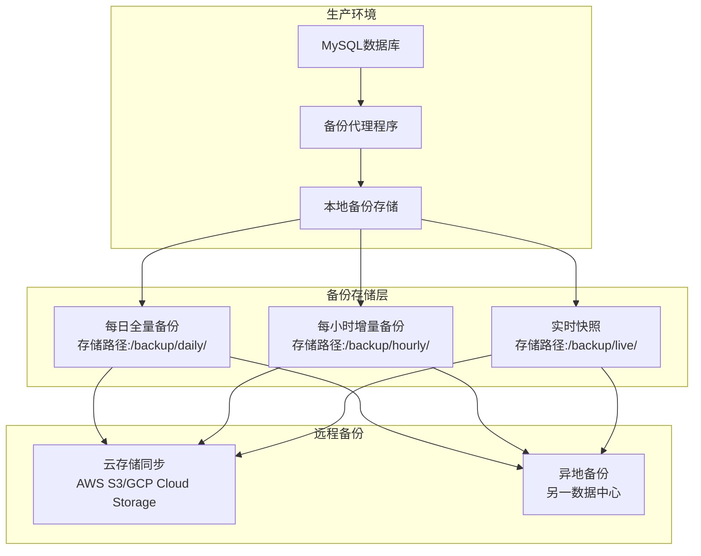
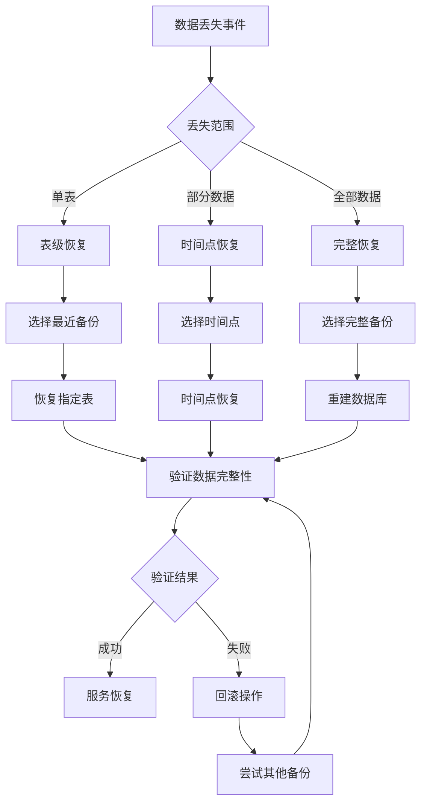
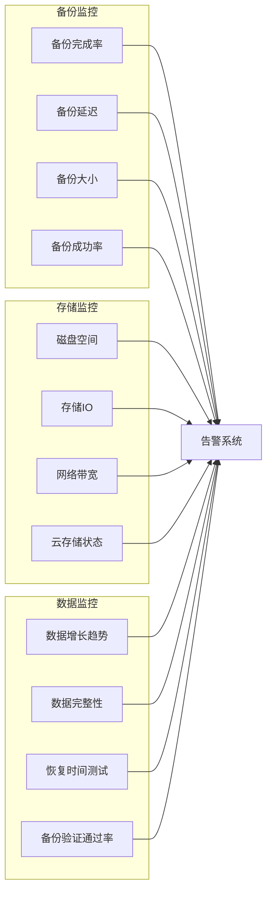
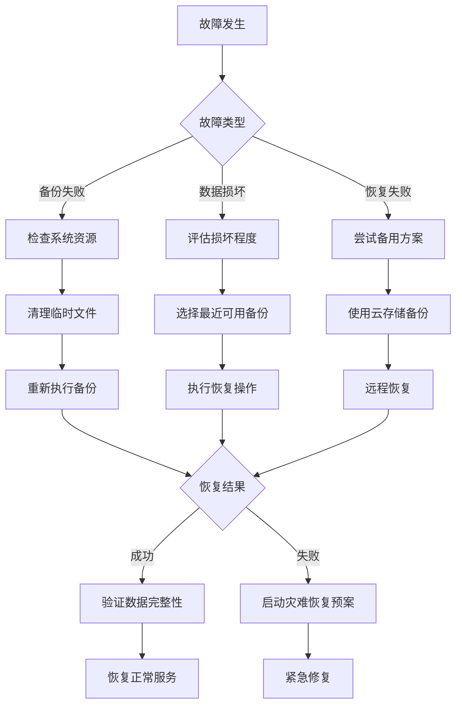

# 备份策略

<cite>
**本文档引用的文件**
- [Life_Database_Init.sql](file://Life_Database_Init.sql)
- [Life_Deployment_Guide.md](file://Life_Deployment_Guide.md)
- [LifePlayerMapper.java](file://Life\src\main\java\com\bot\life\dao\mapper\LifePlayerMapper.java)
- [LifeGameStatusMapper.java](file://Life\src\main\resources\mapper\LifeGameStatusMapper.xml)
- [LifeSystemConfigMapper.java](file://Life\src\main\resources\mapper\SystemConfigMapper.xml)
- [HealthRecoveryTask.java](file://Life\src\main\java\com\bot\life\task\HealthRecoveryTask.java)
- [LifeHandlerImpl.java](file://Life\src\main\java\com\bot\life\service\impl\LifeHandlerImpl.java)
- [LifePlayer.java](file://Life\src\main\java\com\bot\life\dao\entity\LifePlayer.java)
- [LifeGameStatus.java](file://Life\src\main\java\com\bot\life\dao\entity\LifeGameStatus.java)
- [Life_temp_files](file://Life_Database_Init.sql#L635-L645)
</cite>

## 目录
1. [概述](#概述)
2. [备份对象分析](#备份对象分析)
3. [备份策略设计](#备份策略设计)
4. [备份实施流程](#备份实施流程)
5. [恢复流程](#恢复流程)
6. [验证方法](#验证方法)
7. [监控与维护](#监控与维护)
8. [故障排除](#故障排除)
9. [最佳实践](#最佳实践)

## 概述

Bot项目作为基于Java Spring Boot框架的QQ聊天机器人游戏，其核心数据存储在MySQL数据库中。本备份策略针对Life模块的核心数据表进行保护，确保玩家数据、游戏状态和系统配置的安全性。备份策略的设计遵循以下原则：
- **数据完整性**：确保备份数据的准确性和一致性
- **快速恢复**：最小化数据丢失时间和恢复时间
- **自动化**：减少人工干预，提高备份可靠性
- **可验证性**：提供完整的验证机制确保备份质量

## 备份对象分析

### 核心数据表结构

基于`Life_Database_Init.sql`分析，Bot项目的主要备份对象包括三个核心表：



**图表来源**
- [LifePlayer.java](file://Life\src\main\java\com\bot\life\dao\entity\LifePlayer.java#L1-L20)
- [LifeGameStatus.java](file://Life\src\main\java\com\bot\life\dao\entity\LifeGameStatus.java#L1-L20)
- [Life_Database_Init.sql](file://Life_Database_Init.sql#L6-L48)

### 数据重要性评估

| 表名 | 数据类型 | 重要性 | 备份频率 | 存储大小 | 恢复优先级 |
|------|----------|--------|----------|----------|------------|
| life_player | 玩家数据 | 极高 | 每小时 | 中等 | 最高 |
| life_game_status | 游戏状态 | 高 | 每小时 | 小 | 高 |
| life_system_config | 系统配置 | 中 | 每天 | 小 | 中 |

**节来源**
- [LifePlayerMapper.java](file://Life\src\main\java\com\bot\life\dao\mapper\LifePlayerMapper.java#L1-L47)
- [LifeGameStatusMapper.xml](file://Life\src\main\resources\mapper\LifeGameStatusMapper.xml#L1-L56)

## 备份策略设计

### 备份频率规划

基于数据更新频率和业务需求，制定以下备份频率策略：



**图表来源**
- [HealthRecoveryTask.java](file://Life\src\main\java\com\bot\life\task\HealthRecoveryTask.java#L1-L30)
- [LifeHandlerImpl.java](file://Life\src\main\java\com\bot\life\service\impl\LifeHandlerImpl.java#L827-L858)

### 备份存储架构



### 备份类型选择

| 备份类型 | 适用场景 | 存储空间 | 恢复时间 | 实施复杂度 |
|----------|----------|----------|----------|------------|
| 全量备份 | 初始备份、定期完整备份 | 高 | 中 | 低 |
| 增量备份 | 日常频繁更新 | 低 | 快 | 中 |
| 差异备份 | 介于全量和增量之间 | 中 | 快 | 中 |
| 实时快照 | 关键数据保护 | 高 | 极快 | 高 |

## 备份实施流程

### 自动化备份脚本

```bash
#!/bin/bash
# Bot项目数据库备份脚本

# 配置参数
DB_HOST="localhost"
DB_PORT="3306"
DB_NAME="bot"
BACKUP_DIR="/backup/mysql"
DATE=$(date +%Y%m%d_%H%M%S)
RETENTION_DAYS=30

# 创建备份目录
mkdir -p $BACKUP_DIR/{daily,hourly,live}

# 1. 全量备份（每小时）
echo "开始每小时备份..."
mysqldump -h$DB_HOST -P$DB_PORT -u$DB_USER -p$DB_PASS \
    --single-transaction \
    --routines \
    --triggers \
    --databases $DB_NAME \
    --tables life_player life_game_status life_system_config \
    > $BACKUP_DIR/hourly/bot_life_$DATE.sql

# 2. 增量备份（实时）
echo "开始实时快照..."
mysqldump -h$DB_HOST -P$DB_PORT -u$DB_USER -p$DB_PASS \
    --single-transaction \
    --routines \
    --triggers \
    --databases $DB_NAME \
    --tables life_player life_game_status \
    --where="update_time >= DATE_SUB(NOW(), INTERVAL 1 MINUTE)" \
    > $BACKUP_DIR/live/bot_live_$DATE.sql

# 3. 清理过期备份
echo "清理过期备份..."
find $BACKUP_DIR -type f -mtime +$RETENTION_DAYS -exec rm -f {} \;

# 4. 上传到云存储
echo "上传到云存储..."
aws s3 sync $BACKUP_DIR s3://bot-backup-bucket/mysql/

echo "备份完成：$DATE"
```

### 备份调度配置

```bash
# crontab配置示例
# 每小时全量备份
0 * * * * /usr/local/bin/bot_backup.sh hourly

# 每分钟实时快照
* * * * * /usr/local/bin/bot_backup.sh live

# 每天凌晨2点全量备份
0 2 * * * /usr/local/bin/bot_backup.sh daily
```

**节来源**
- [Life_Deployment_Guide.md](file://Life_Deployment_Guide.md#L170-L193)

## 恢复流程

### 恢复策略矩阵



### 恢复操作步骤

#### 1. 单表恢复流程

```sql
-- 步骤1：停止应用服务
systemctl stop bot-application

-- 步骤2：恢复指定表
mysql -u$DB_USER -p$DB_PASS bot < /backup/mysql/hourly/bot_life_20241201_120000.sql

-- 步骤3：验证数据完整性
SELECT COUNT(*) FROM life_player;
SELECT COUNT(*) FROM life_game_status;

-- 步骤4：重启应用服务
systemctl start bot-application
```

#### 2. 时间点恢复流程

```sql
-- 步骤1：创建恢复数据库
CREATE DATABASE bot_restore;

-- 步骤2：恢复到指定时间点
mysql -u$DB_USER -p$DB_PASS bot_restore < /backup/mysql/daily/bot_full_20241201.sql

-- 步骤3：应用增量备份
mysql -u$DB_USER -p$DB_PASS bot_restore < /backup/mysql/live/bot_live_20241201_123000.sql

-- 步骤4：导出恢复数据
mysqldump -u$DB_USER -p$DB_PASS --no-create-info bot_restore > /tmp/recovery_data.sql
```

**节来源**
- [LifePlayerMapper.java](file://Life\src\main\java\com\bot\life\dao\mapper\LifePlayerMapper.java#L25-L47)

## 验证方法

### 备份验证清单

| 验证项目 | 验证方法 | 预期结果 | 失败处理 |
|----------|----------|----------|----------|
| 文件完整性 | md5sum校验 | 校验码匹配 | 重新备份 |
| 数据完整性 | SELECT COUNT(*) | 记录数一致 | 检查源数据 |
| 连接测试 | mysql连接 | 连接成功 | 检查网络配置 |
| 权限验证 | 登录测试 | 可正常访问 | 修复权限设置 |
| 备份时间戳 | 文件修改时间 | 时间戳正确 | 更新备份时间 |

### 自动化验证脚本

```bash
#!/bin/bash
# 备份验证脚本

BACKUP_DIR="/backup/mysql"
LOG_FILE="/var/log/bot_backup_verify.log"

# 验证函数
verify_backup() {
    local backup_file=$1
    local expected_size=$2
    
    echo "$(date): 开始验证 $backup_file" >> $LOG_FILE
    
    # 检查文件存在性
    if [ ! -f "$backup_file" ]; then
        echo "$(date): 错误：文件不存在 $backup_file" >> $LOG_FILE
        return 1
    fi
    
    # 检查文件大小
    actual_size=$(stat -c%s "$backup_file")
    if [ "$actual_size" -ne "$expected_size" ]; then
        echo "$(date): 错误：文件大小不匹配 $backup_file" >> $LOG_FILE
        return 1
    fi
    
    # 验证SQL语法
    if ! mysql -u$DB_USER -p$DB_PASS --execute="SOURCE $backup_file" >/dev/null 2>&1; then
        echo "$(date): 错误：SQL语法错误 $backup_file" >> $LOG_FILE
        return 1
    fi
    
    echo "$(date): 验证成功 $backup_file" >> $LOG_FILE
    return 0
}

# 执行验证
verify_backup "$BACKUP_DIR/latest/bot_full.sql" 104857600
```

### 数据一致性检查

```sql
-- 玩家数据一致性检查
SELECT 
    'life_player' as table_name,
    COUNT(*) as record_count,
    SUM(CASE WHEN level < 1 OR level > 99 THEN 1 ELSE 0 END) as invalid_levels,
    SUM(CASE WHEN health <= 0 OR health > 9999 THEN 1 ELSE 0 END) as invalid_health
FROM life_player;

-- 游戏状态一致性检查
SELECT 
    'life_game_status' as table_name,
    COUNT(*) as record_count,
    SUM(CASE WHEN game_mode NOT IN (0,1,2) THEN 1 ELSE 0 END) as invalid_modes
FROM life_game_status;
```

## 监控与维护

### 监控指标体系



### 定期维护任务

| 维护任务 | 频率 | 负责人 | 预期成果 |
|----------|------|--------|----------|
| 备份验证 | 每日 | 运维工程师 | 验证通过率≥99% |
| 存储空间检查 | 每周 | 运维工程师 | 磁盘使用率<80% |
| 备份策略优化 | 每月 | 数据管理员 | 提升备份效率 |
| 恢复演练 | 每季度 | 全体团队 | 恢复时间<30分钟 |

**节来源**
- [Life_Database_Init.sql](file://Life_Database_Init.sql#L635-L645)

## 故障排除

### 常见备份问题及解决方案

| 问题类型 | 症状描述 | 可能原因 | 解决方案 |
|----------|----------|----------|----------|
| 备份失败 | 备份进程异常终止 | 磁盘空间不足、权限问题 | 清理磁盘空间、检查权限 |
| 数据不一致 | 恢复后数据异常 | 备份过程中数据变更 | 使用事务备份、暂停写入 |
| 恢复缓慢 | 恢复时间过长 | 硬件性能不足、网络延迟 | 升级硬件、优化网络 |
| 备份文件损坏 | SQL语法错误 | 备份中断、存储介质故障 | 重新备份、更换存储 |

### 故障应急响应流程



## 最佳实践

### 备份策略优化建议

1. **多层备份策略**
   - 本地即时备份：实时快照，用于快速恢复
   - 云端定期备份：全量备份，用于长期保存
   - 异地容灾备份：跨地域备份，防止区域性灾难

2. **自动化运维**
   - 使用CI/CD工具集成备份流程
   - 设置自动告警和通知机制
   - 实现备份失败自动重试

3. **性能优化**
   - 使用并行备份提高效率
   - 启用压缩减少存储空间
   - 优化数据库连接参数

4. **安全加固**
   - 对备份文件进行加密存储
   - 实施严格的访问控制
   - 定期更新备份密钥

### 文档维护规范

- 定期更新备份策略文档
- 记录每次备份和恢复的操作细节
- 建立知识库共享最佳实践
- 进行定期的备份演练培训

通过以上全面的备份策略，Bot项目能够有效保护核心数据资产，确保在任何情况下都能快速恢复服务，保障业务连续性和数据安全性。