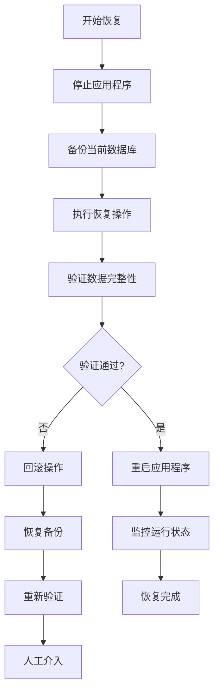
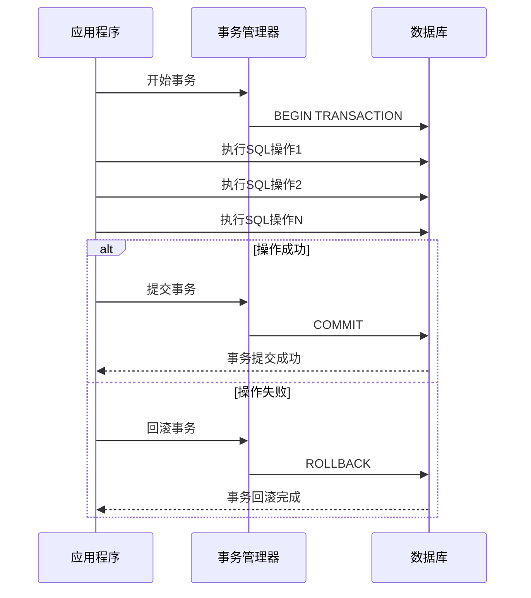
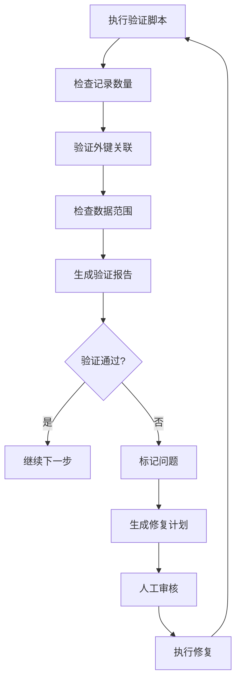

# 恢复流程

<cite>
**本文档引用的文件**
- [Life_Deployment_Guide.md](file://Life_Deployment_Guide.md)
- [Life_Database_Init.sql](file://Life_Database_Init.sql)
- [logback-spring.xml](file://Boot/src/main/resources/logback-spring.xml)
- [application.properties](file://Boot/src/main/resources/application.properties)
- [BotApplication.java](file://Boot/src/main/java/com/bot/boot/BotApplication.java)
- [PlayerServiceImpl.java](file://Life\src\main\java\com\bot\life\service\impl\PlayerServiceImpl.java)
- [LifePlayerMapper.java](file://Life\src\main\java\com\bot\life\dao\mapper\LifePlayerMapper.java)
- [HealthRecoveryTask.java](file://Life\src\main\java\com\bot\life\task\HealthRecoveryTask.java)
- [LifeGameStatusMapper.java](file://Life\src\main\java\com\bot\life\dao\mapper\LifeGameStatusMapper.java)
</cite>

## 目录
1. [概述](#概述)
2. [备份策略](#备份策略)
3. [恢复前准备](#恢复前准备)
4. [恢复流程](#恢复流程)
5. [事务管理](#事务管理)
6. [日志记录](#日志记录)
7. [数据验证](#数据验证)
8. [故障排除](#故障排除)
9. [最佳实践](#最佳实践)

## 概述

本文档详细说明了Bot项目中Life模块的数据库备份恢复流程，重点针对`life_player`和`life_game_status`等关键表的恢复操作。该流程旨在帮助运维人员在数据丢失或损坏时进行快速、可靠的恢复操作。

### 关键表说明

| 表名 | 用途 | 重要性 |
|------|------|--------|
| `life_player` | 存储玩家角色基本信息 | 极高 |
| `life_game_status` | 存储玩家游戏状态和上下文 | 极高 |
| `life_player_item` | 存储玩家道具信息 | 高 |
| `life_player_skill` | 存储玩家技能信息 | 高 |
| `life_player_achievement` | 存储玩家成就信息 | 中 |

## 备份策略

### 自动备份配置

根据部署指南，建议定期备份以下关键表：

```sql
-- 玩家数据备份
mysqldump -u root -p bot life_player life_player_item life_player_skill life_player_achievement > player_backup_$(date +%Y%m%d_%H%M%S).sql

-- 游戏状态备份  
mysqldump -u root -p bot life_game_status > game_status_backup_$(date +%Y%m%d_%H%M%S).sql

-- 系统配置备份
mysqldump -u root -p bot life_system_config > system_config_backup_$(date +%Y%m%d_%H%M%S).sql
```

### 备份频率建议

| 数据类型 | 备份频率 | 备份保留期 |
|----------|----------|------------|
| 玩家数据 | 每小时 | 30天 |
| 游戏状态 | 每15分钟 | 7天 |
| 系统配置 | 每天 | 90天 |
| 战斗记录 | 每小时 | 14天 |

## 恢复前准备

### 环境检查

在执行恢复操作前，必须进行以下环境检查：

#### 1. 数据库连接检查

```bash
# 检查MySQL服务状态
systemctl status mysql

# 测试数据库连接
mysql -u root -p -e "SELECT VERSION();"
```

#### 2. 应用程序状态检查

```bash
# 检查应用程序进程
ps aux | grep BotApplication

# 检查端口占用
netstat -tlnp | grep :9091
```

#### 3. 磁盘空间检查

```bash
# 检查磁盘空间
df -h

# 检查日志目录空间
du -sh /logs/bot/
```

### 备份文件验证

```bash
# 验证备份文件完整性
mysql -u root -p -e "SOURCE /path/to/backup.sql;"
# 如果没有错误，说明备份文件完整

# 检查备份文件中的表
mysql -u root -p -e "USE bot; SHOW TABLES LIKE 'life_%';"
```

## 恢复流程

### 恢复架构图



### 具体恢复步骤

#### 步骤1：停止应用程序

```bash
# 停止Spring Boot应用
curl -X POST http://localhost:9091/bot/shutdown

# 或者使用进程管理
kill $(pgrep -f BotApplication)
```

#### 步骤2：执行恢复操作

```bash
# 恢复玩家数据
mysql -u root -p bot < /backup/player_backup_YYYYMMDD_HHMMSS.sql

# 恢复游戏状态
mysql -u root -p bot < /backup/game_status_backup_YYYYMMDD_HHMMSS.sql

# 恢复系统配置
mysql -u root -p bot < /backup/system_config_backup_YYYYMMDD_HHMMSS.sql
```

#### 步骤3：数据一致性检查

```sql
-- 检查玩家数据完整性
SELECT COUNT(*) as player_count FROM life_player;
SELECT COUNT(*) as game_status_count FROM life_game_status;

-- 检查外键关联
SELECT p.user_id, g.user_id 
FROM life_player p 
LEFT JOIN life_game_status g ON p.user_id = g.user_id 
WHERE g.user_id IS NULL;

-- 检查数据范围
SELECT MAX(level) as max_level, MIN(level) as min_level FROM life_player;
SELECT COUNT(*) as invalid_status FROM life_game_status WHERE game_mode NOT IN (0,1,2);
```

## 事务管理

### Spring事务配置

应用程序使用Spring的声明式事务管理，确保数据一致性：

```java
@Service
public class PlayerServiceImpl implements PlayerService {
    
    @Transactional(rollbackFor = Exception.class)
    public boolean createPlayer(String userId, String nickname, Integer attribute) {
        // 事务边界内的数据库操作
        playerMapper.insert(player);
        achievementService.checkAndTriggerAchievements(player);
        return true;
    }
}
```

### 事务恢复策略



### 手动事务控制

对于批量恢复操作，建议使用手动事务控制：

```sql
START TRANSACTION;

-- 执行恢复操作
SOURCE /path/to/recovery_script.sql;

-- 验证数据
SELECT COUNT(*) FROM life_player;

-- 提交或回滚
COMMIT;
-- 或
ROLLBACK;
```

## 日志记录

### 日志配置

根据`logback-spring.xml`配置，恢复过程中的日志记录如下：

```xml
<logger name="com.bot.life" level="DEBUG"/>
<logger name="org.springframework.transaction" level="DEBUG"/>
<logger name="com.mysql.cj.jdbc" level="INFO"/>
```

### 关键日志信息

恢复过程中应关注以下日志信息：

| 日志级别 | 关键信息 | 说明 |
|----------|----------|------|
| ERROR | "Database connection failed" | 数据库连接问题 |
| WARN | "Data inconsistency detected" | 数据不一致警告 |
| INFO | "Starting data recovery" | 恢复开始 |
| DEBUG | "Transaction committed" | 事务提交 |
| ERROR | "Rollback occurred" | 回滚发生 |

### 日志监控脚本

```bash
#!/bin/bash
# 监控恢复过程日志
tail -f /logs/bot/bot-controller/*.log | grep -E "(ERROR|WARN|Starting|committed|rolled)"
```

## 数据验证

### 自动验证脚本

```sql
-- 验证脚本：life_data_integrity_check.sql
DELIMITER $$

CREATE PROCEDURE validate_data_integrity()
BEGIN
    DECLARE player_count INT;
    DECLARE status_count INT;
    DECLARE orphan_count INT;
    
    -- 检查玩家数据
    SELECT COUNT(*) INTO player_count FROM life_player;
    SELECT COUNT(*) INTO status_count FROM life_game_status;
    
    -- 检查孤儿记录
    SELECT COUNT(*) INTO orphan_count 
    FROM life_game_status g 
    LEFT JOIN life_player p ON g.user_id = p.user_id 
    WHERE p.user_id IS NULL;
    
    -- 输出验证结果
    SELECT 
        player_count AS '玩家记录数',
        status_count AS '游戏状态记录数',
        orphan_count AS '孤儿记录数',
        CASE 
            WHEN orphan_count = 0 THEN '数据完整'
            ELSE '数据不完整'
        END AS '验证结果';
END$$

DELIMITER ;
```

### 验证流程



### 常见验证规则

| 验证项 | 规则 | 预期结果 |
|--------|------|----------|
| 玩家数量 | > 0 | 正常 |
| 游戏状态数量 | = 玩家数量 | 正常 |
| 孤儿记录 | = 0 | 正常 |
| 等级范围 | 1-99 | 正常 |
| 修为范围 | 0-50000000 | 正常 |

## 故障排除

### 常见问题及解决方案

#### 1. 数据库连接失败

**症状**: 恢复过程中出现连接超时

**解决方案**:
```bash
# 检查MySQL配置
mysqladmin variables -u root -p | grep max_connections

# 增加连接池大小
echo "max_connections = 1000" >> /etc/mysql/my.cnf
systemctl restart mysql
```

#### 2. 数据不一致

**症状**: 外键约束违反

**解决方案**:
```sql
-- 删除孤儿记录
DELETE FROM life_game_status 
WHERE user_id NOT IN (SELECT user_id FROM life_player);

-- 修复缺失的游戏状态
INSERT INTO life_game_status (user_id, game_mode, current_menu, context_data)
SELECT user_id, 0, NULL, '{}' 
FROM life_player 
WHERE user_id NOT IN (SELECT user_id FROM life_game_status);
```

#### 3. 恢复速度慢

**症状**: 大型备份恢复时间过长

**解决方案**:
```sql
-- 优化恢复性能
SET autocommit=0;
SET unique_checks=0;
SET foreign_key_checks=0;

-- 执行恢复操作
SOURCE /large_backup.sql;

-- 恢复设置
SET autocommit=1;
SET unique_checks=1;
SET foreign_key_checks=1;
```

### 恢复失败回滚

```bash
#!/bin/bash
# 恢复失败回滚脚本

echo "恢复失败，正在回滚..."
mysql -u root -p bot < /backup/previous_backup.sql

# 验证回滚结果
mysql -u root -p -e "
USE bot;
SELECT COUNT(*) as player_count FROM life_player;
SELECT COUNT(*) as status_count FROM life_game_status;
" > /tmp/rollback_validation.txt

echo "回滚完成，请检查验证结果"
```

## 最佳实践

### 恢复前准备清单

- [ ] 确认数据库服务正常运行
- [ ] 备份当前生产数据
- [ ] 停止应用程序服务
- [ ] 验证备份文件完整性
- [ ] 准备恢复脚本
- [ ] 确认监控告警暂停

### 恢复执行清单

- [ ] 使用专用恢复账户
- [ ] 记录恢复开始时间
- [ ] 监控恢复进度
- [ ] 验证数据完整性
- [ ] 记录恢复结果
- [ ] 通知相关人员

### 恢复后验证清单

- [ ] 验证关键功能正常
- [ ] 检查用户数据完整性
- [ ] 确认游戏状态正确
- [ ] 监控系统性能
- [ ] 更新恢复文档
- [ ] 解除监控告警

### 文档更新要求

每次恢复操作后，必须更新以下文档：
- 系统维护手册
- 应急响应计划
- 数据备份策略
- 恢复测试记录

通过遵循本文档的指导原则和流程，运维团队可以确保在数据丢失或损坏情况下能够快速、可靠地恢复系统，最大限度地减少业务中断时间。