# 备份数据验证方法

<cite>
**本文档引用的文件**
- [Life_Database_Init.sql](file://Life_Database_Init.sql)
- [Life_Database_Tables_Check.md](file://Life_Database_Tables_Check.md)
- [LifeGameStatusMapper.xml](file://Life\src\main\resources\mapper\LifeGameStatusMapper.xml)
- [LifePlayerMapper.xml](file://Life\src\main\resources\mapper\LifePlayerMapper.xml)
- [HealthRecoveryServiceImpl.java](file://Life\src\main\java\com\bot\life\service\impl\HealthRecoveryServiceImpl.java)
- [HealthRecoveryService.java](file://Life\src\main\java\com\bot\life\service\HealthRecoveryService.java)
- [application.properties](file://Boot\src\main\resources\application.properties)
- [application-dev.properties](file://Boot\src\main\resources\application-dev.properties)
- [LifeMapMapper.xml](file://Life\src\main\resources\mapper\LifeMapMapper.xml)
</cite>

## 目录
1. [概述](#概述)
2. [备份验证架构](#备份验证架构)
3. [关键表结构分析](#关键表结构分析)
4. [验证方法设计](#验证方法设计)
5. [自动化验证脚本](#自动化验证脚本)
6. [数据一致性检查](#数据一致性检查)
7. [恢复演练机制](#恢复演练机制)
8. [监控与告警](#监控与告警)
9. [最佳实践建议](#最佳实践建议)
10. [故障排除指南](#故障排除指南)

## 概述

本文档详细阐述了基于Life_Database_Init.sql中表结构定义的备份数据验证方法，旨在确保备份文件的完整性和可恢复性。通过建立完善的备份质量保障体系，包括校验和验证、数据抽样比对、恢复演练等策略，为浮生卷游戏提供可靠的数据安全保障。

### 验证目标

- 确保备份文件中life_player、life_game_status等关键表的数据完整性
- 验证数据库表结构与实体类映射的一致性
- 检测数据迁移过程中的潜在问题
- 提供自动化的备份验证流程
- 建立实时监控和告警机制

## 备份验证架构

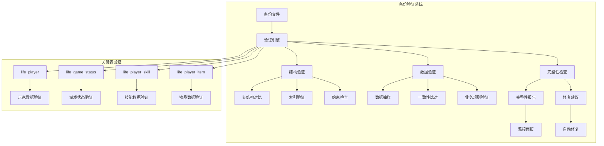

**图表来源**
- [Life_Database_Init.sql](file://Life_Database_Init.sql#L6-L48)
- [Life_Database_Tables_Check.md](file://Life_Database_Tables_Check.md#L1-L147)

## 关键表结构分析

### life_player 表验证

life_player表是游戏的核心数据表，包含玩家的基本信息和状态数据。

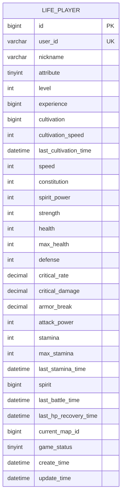

**图表来源**
- [Life_Database_Init.sql](file://Life_Database_Init.sql#L6-L48)

### life_game_status 表验证

游戏状态表记录玩家的游戏进程和上下文信息。

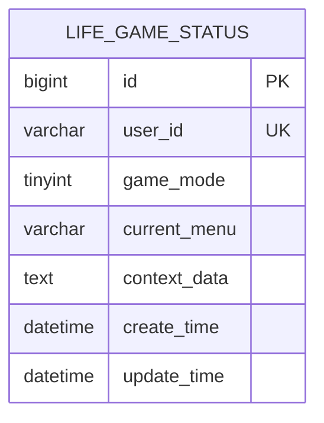

**图表来源**
- [Life_Database_Init.sql](file://Life_Database_Init.sql#L378-L389)

**节来源**
- [Life_Database_Init.sql](file://Life_Database_Init.sql#L6-L48)
- [Life_Database_Init.sql](file://Life_Database_Init.sql#L378-L389)

## 验证方法设计

### 校验和验证策略

#### MD5 校验和计算

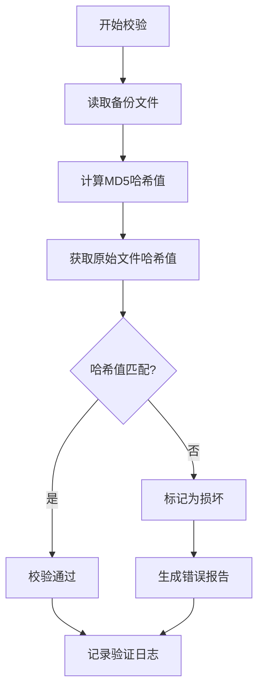

#### SHA256 完整性验证

对于关键表数据，采用SHA256算法进行双重验证：

1. **表级别验证**：计算整个表的SHA256哈希
2. **行级别验证**：对重要字段组合计算哈希
3. **列级别验证**：验证特定字段的数据类型和约束

### 数据抽样比对

#### 随机抽样策略

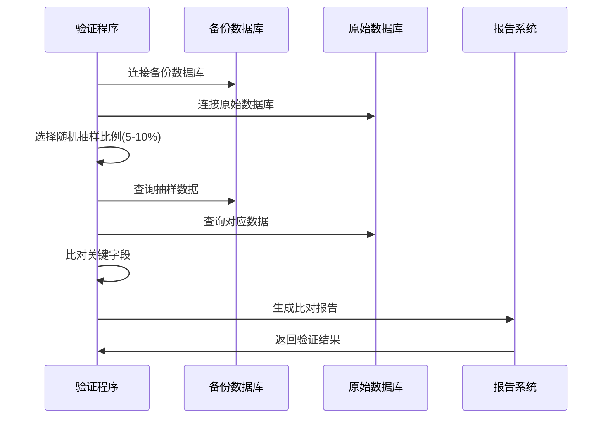

**图表来源**
- [HealthRecoveryServiceImpl.java](file://Life\src\main\java\com\bot\life\service\impl\HealthRecoveryServiceImpl.java#L66-L74)

#### 关键字段验证清单

| 表名 | 关键字段 | 验证规则 | 优先级 |
|------|----------|----------|--------|
| life_player | user_id, level, experience | 用户唯一性、数值范围 | 高 |
| life_game_status | user_id, game_mode | 状态一致性、模式有效性 | 高 |
| life_player_skill | player_id, skill_id, skill_level | 技能关联性、等级合理性 | 中 |
| life_player_item | player_id, item_id, quantity | 物品数量有效性 | 中 |

**节来源**
- [HealthRecoveryServiceImpl.java](file://Life\src\main\java\com\bot\life\service\impl\HealthRecoveryServiceImpl.java#L66-L74)

## 自动化验证脚本

### 验证脚本架构

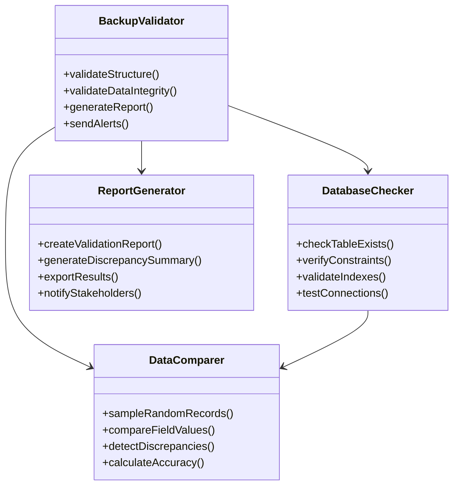

**图表来源**
- [HealthRecoveryService.java](file://Life\src\main\java\com\bot\life\service\HealthRecoveryService.java#L1-L27)

### 核心验证流程

#### 1. 结构验证阶段

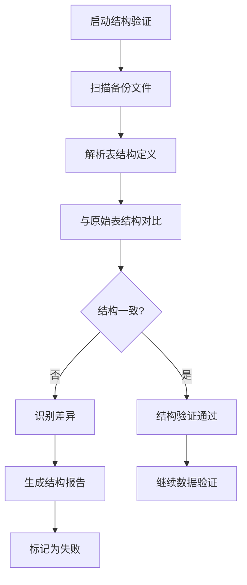

#### 2. 数据验证阶段

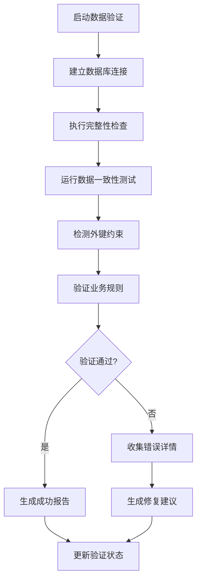

**节来源**
- [HealthRecoveryService.java](file://Life\src\main\java\com\bot\life\service\HealthRecoveryService.java#L1-L27)

## 数据一致性检查

### 实体类映射验证

基于Life_Database_Init.sql中的表结构，验证Java实体类与数据库表的映射关系：

#### life_player 实体验证

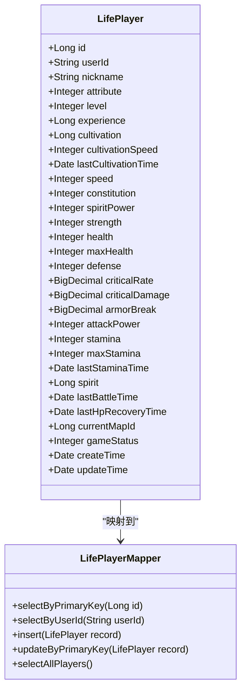

**图表来源**
- [LifePlayerMapper.xml](file://Life\src\main\resources\mapper\LifePlayerMapper.xml#L2-L35)

### 约束验证机制

#### 主键约束验证

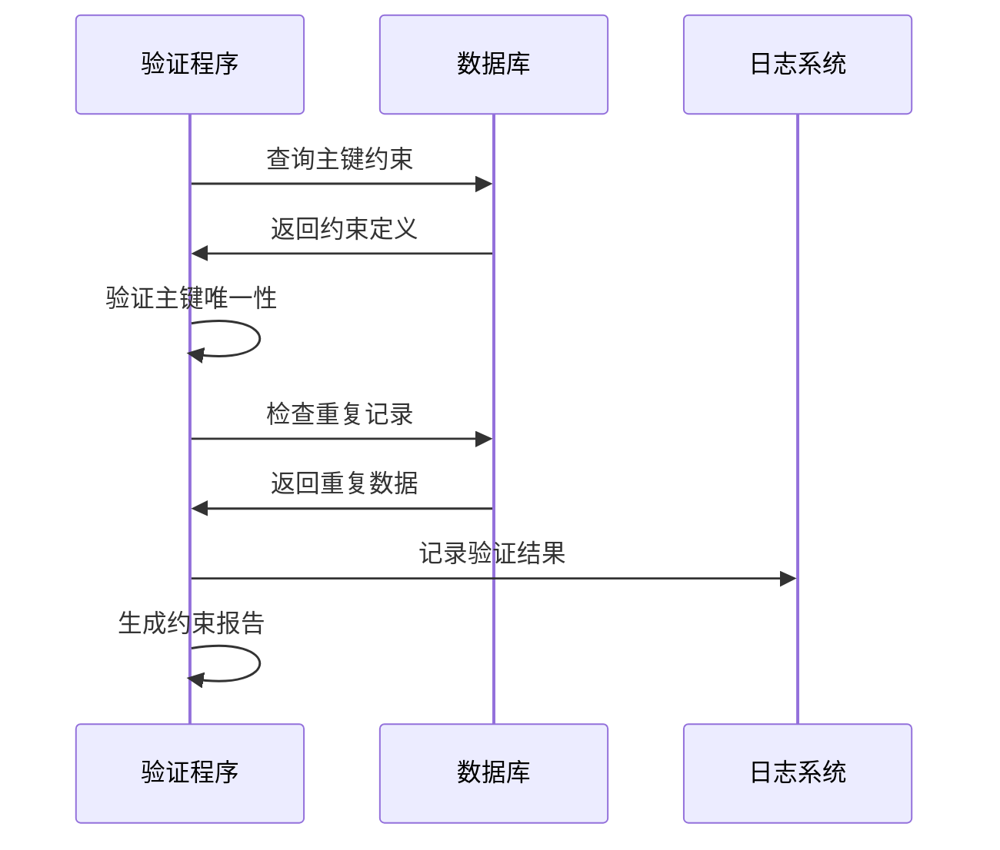

#### 外键约束验证

对于life_player_skill、life_player_item等关联表，验证外键约束的有效性：

1. **引用完整性检查**：确保外键指向的记录存在
2. **级联操作验证**：检查删除和更新的级联行为
3. **约束冲突检测**：识别违反外键约束的数据

**节来源**
- [LifePlayerMapper.xml](file://Life\src\main\resources\mapper\LifePlayerMapper.xml#L2-L35)

## 恢复演练机制

### 定期恢复测试

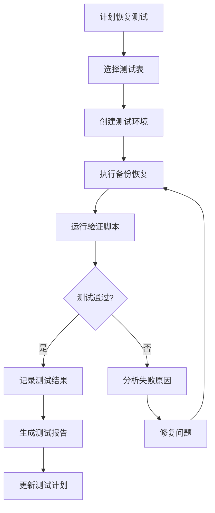

### 恢复性能评估

#### 恢复时间指标

| 指标类别 | 目标值 | 监控方法 | 告警阈值 |
|----------|--------|----------|----------|
| 完整恢复时间 | ≤30分钟 | 自动计时 | >45分钟 |
| 部分恢复时间 | ≤10分钟 | 分表测试 | >15分钟 |
| 数据验证时间 | ≤5分钟 | 验证脚本 | >10分钟 |
| 恢复成功率 | ≥99% | 统计分析 | <95% |

### 回滚机制

当恢复过程中发现问题时，自动触发回滚程序：

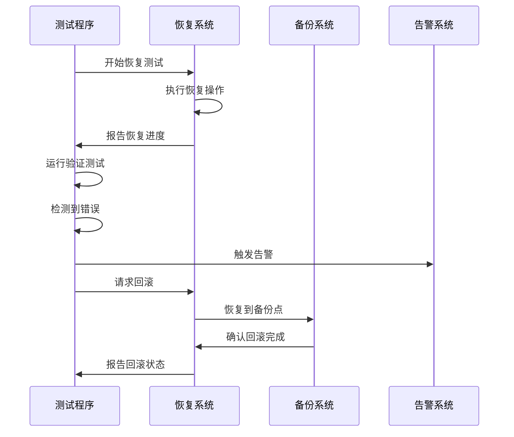

**节来源**
- [application.properties](file://Boot\src\main\resources\application.properties#L47-L62)

## 监控与告警

### 实时监控指标

#### 关键性能指标(KPI)

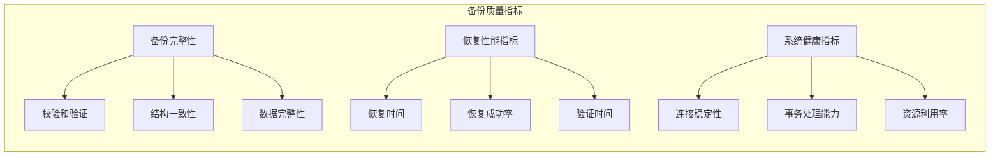

#### 告警规则配置

| 告警级别 | 触发条件 | 响应时间 | 处理措施 |
|----------|----------|----------|----------|
| 严重 | 校验和不匹配 | 立即 | 自动回滚，人工介入 |
| 高 | 恢复失败 | 5分钟内 | 启动备用备份 |
| 中 | 性能下降 | 15分钟内 | 优化资源分配 |
| 低 | 异常增长 | 1小时内 | 记录日志，跟踪分析 |

### 监控仪表板

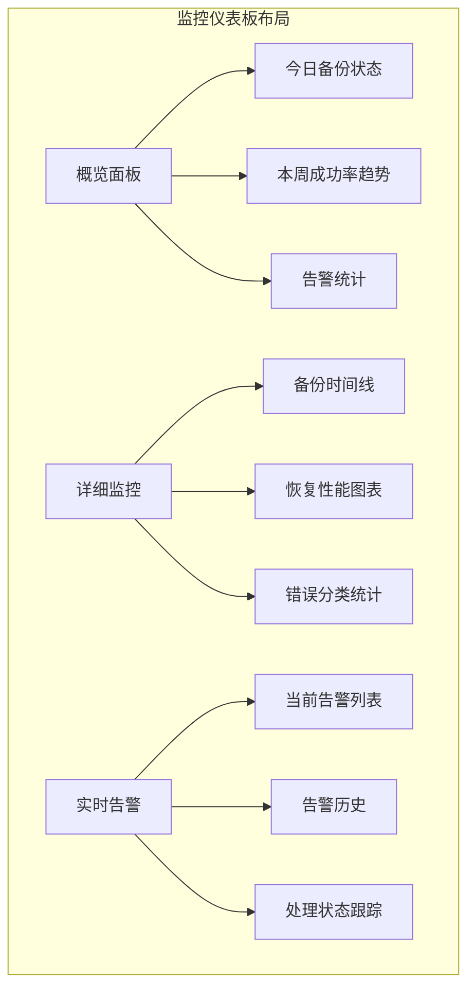

**节来源**
- [application-dev.properties](file://Boot\src\main\resources\application-dev.properties#L34-L58)

## 最佳实践建议

### 备份策略优化

#### 1. 多层次备份策略

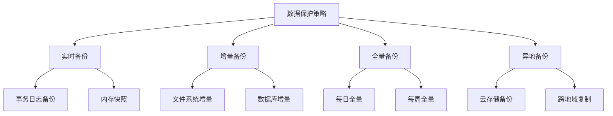

#### 2. 验证频率规划

| 数据类型 | 验证频率 | 验证深度 | 自动化程度 |
|----------|----------|----------|------------|
| 核心玩家数据 | 每小时 | 全面验证 | 100% |
| 游戏状态数据 | 每30分钟 | 关键字段 | 80% |
| 配置数据 | 每日 | 结构验证 | 50% |
| 历史数据 | 每周 | 抽样验证 | 30% |

### 性能优化建议

#### 1. 验证脚本优化

- **并行处理**：同时验证多个表
- **智能采样**：根据数据分布优化抽样策略
- **缓存机制**：缓存频繁访问的数据
- **索引优化**：为验证查询创建专用索引

#### 2. 资源管理

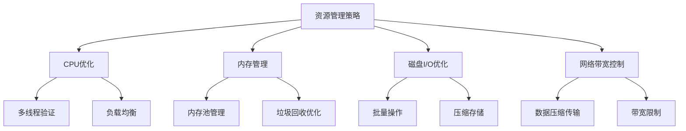

## 故障排除指南

### 常见问题诊断

#### 1. 校验和不匹配

**症状**：备份文件校验失败
**可能原因**：
- 文件传输过程中损坏
- 存储介质故障
- 权限问题导致部分数据写入失败

**解决方案**：
1. 重新下载或复制备份文件
2. 检查存储设备健康状况
3. 验证文件权限设置
4. 使用更可靠的传输协议

#### 2. 数据类型不匹配

**症状**：实体类与数据库表映射失败
**可能原因**：
- 数据库字段类型变更
- Java实体类定义错误
- MyBatis映射配置问题

**解决方案**：
1. 比对表结构定义与实体类
2. 检查MyBatis XML映射文件
3. 验证字段命名约定
4. 更新相关映射配置

#### 3. 约束违反

**症状**：数据导入时出现约束错误
**可能原因**：
- 外键关联数据缺失
- 主键重复
- 数据类型转换错误

**解决方案**：
1. 检查关联表数据完整性
2. 验证数据类型兼容性
3. 清理重复或无效数据
4. 调整导入顺序

### 故障恢复流程

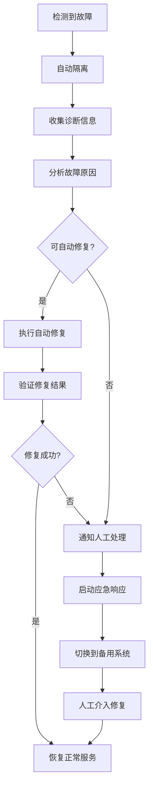

### 性能调优指南

#### 1. 数据库连接优化

基于application.properties中的配置，优化数据库连接池参数：

- **initial-size**: 初始连接数设置为3
- **max-active**: 最大连接数设置为60000
- **min-idle**: 最小空闲连接数设置为3
- **max-wait**: 最大等待时间设置为20ms

#### 2. 查询性能优化

- 为验证查询创建专用索引
- 使用批量查询减少网络往返
- 实现查询结果缓存机制
- 优化复杂查询的执行计划

**节来源**
- [application.properties](file://Boot\src\main\resources\application.properties#L47-L62)

## 结论

通过建立完善的备份数据验证方法，可以有效确保浮生卷游戏数据的安全性和可靠性。本文档提供的验证策略涵盖了从基础的校验和验证到高级的数据一致性检查，形成了多层次、全方位的备份质量保障体系。

关键成功要素包括：

1. **全面的验证覆盖**：涵盖结构、数据、约束等多个维度
2. **自动化执行**：减少人工干预，提高验证效率
3. **实时监控告警**：及时发现和处理问题
4. **灵活的恢复机制**：确保在出现问题时能够快速恢复
5. **持续优化改进**：根据实际运行情况不断优化验证策略

通过实施这些验证方法，可以显著降低数据丢失风险，提高系统的可靠性和用户体验，为浮生卷游戏的稳定运营提供坚实的数据保障。