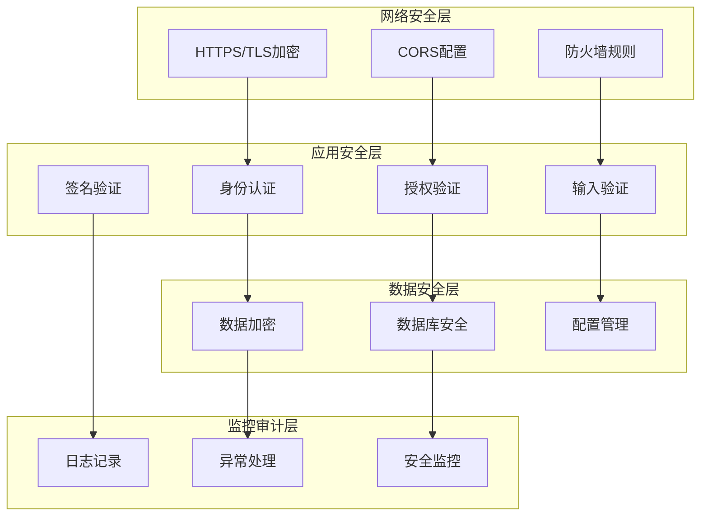
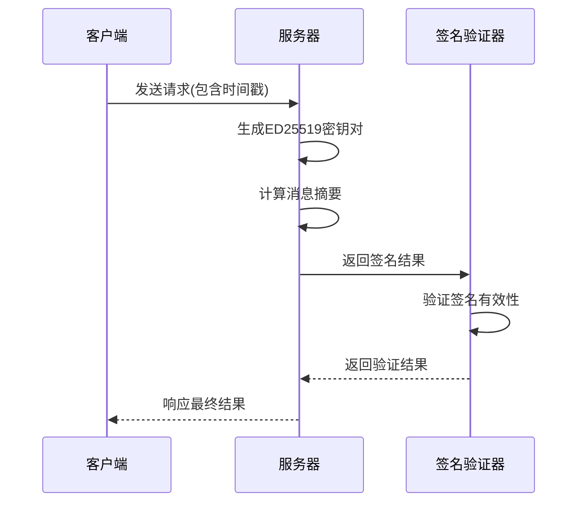
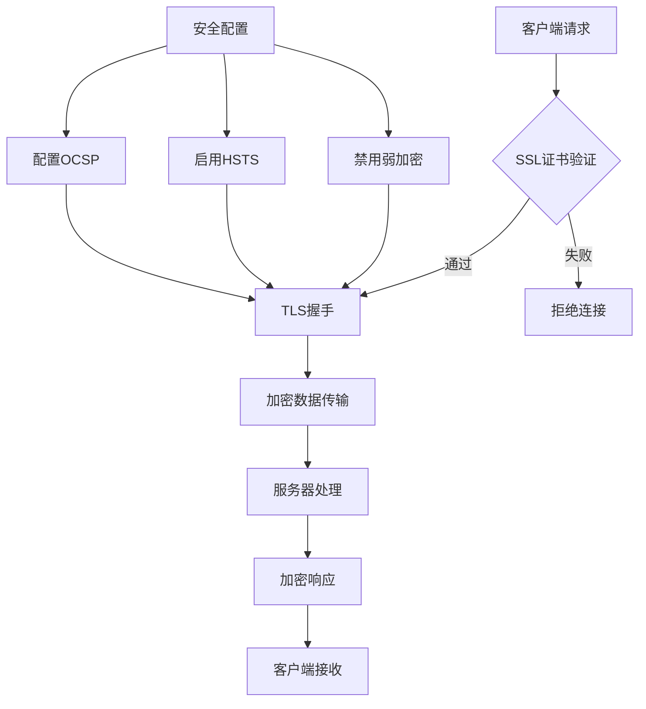
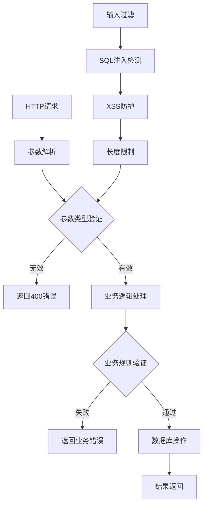
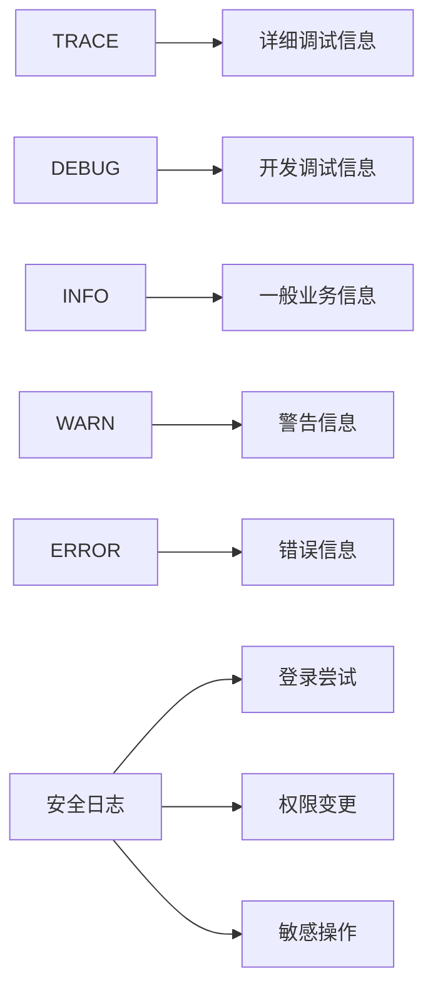

# Bot项目安全加固文档

<cite>
**本文档引用的文件**
- [Life_Deployment_Guide.md](file://Life_Deployment_Guide.md)
- [application.properties](file://Boot/src/main/resources/application.properties)
- [application-prod.properties](file://Boot/src/main/resources/application-prod.properties)
- [SignatureED25519.java](file://Common/src/main/java/com/bot/common/util/SignatureED25519.java)
- [CallBackSignUtil.java](file://Common/src/main/java/com/bot/common/util/CallBackSignUtil.java)
- [newInstructDistributeController.java](file://Boot/src/main/java/com/bot/boot/controller/newInstructDistributeController.java)
- [HttpSenderUtil.java](file://Common/src/main/java/com/bot/common/util/HttpSenderUtil.java)
- [logback-spring.xml](file://Boot/src/main/resources/logback-spring.xml)
- [GlobalExceptionHandler.java](file://Boot/src/main/java/com/bot/boot/aspect/GlobalExceptionHandler.java)
- [ENSystemConfig.java](file://Common/src/main/java/com/bot/common/enums/ENSystemConfig.java)
</cite>

## 目录
1. [概述](#概述)
2. [安全架构分析](#安全架构分析)
3. [身份认证与授权](#身份认证与授权)
4. [数据加密与传输安全](#数据加密与传输安全)
5. [输入验证与防护](#输入验证与防护)
6. [安全配置管理](#安全配置管理)
7. [日志审计与监控](#日志审计与监控)
8. [数据库安全](#数据库安全)
9. [网络安全配置](#网络安全配置)
10. [安全最佳实践](#安全最佳实践)
11. [故障排除指南](#故障排除指南)

## 概述

Bot项目是一个基于Spring Boot框架的多功能聊天机器人系统，包含游戏、生活等多个模块。本文档基于项目的安全配置和实现，提供全面的安全加固指导，帮助运维团队提升系统的整体安全性。

### 安全威胁评估

基于项目分析，主要面临以下安全威胁：
- **身份伪造攻击**：未经授权的用户冒充合法用户
- **数据泄露风险**：敏感配置信息暴露
- **中间人攻击**：网络通信被截获
- **SQL注入攻击**：恶意SQL语句注入
- **日志泄露**：敏感信息在日志中暴露

## 安全架构分析

### 系统安全层次



**图表来源**
- [application.properties](file://Boot/src/main/resources/application.properties#L48-L71)
- [SignatureED25519.java](file://Common/src/main/java/com/bot/common/util/SignatureED25519.java#L1-L65)

### 核心安全组件

项目实现了多层次的安全防护机制：

1. **ED25519数字签名**：用于API调用的身份验证
2. **HTTPS通信**：确保数据传输安全
3. **数据库连接池安全配置**：防止连接池攻击
4. **全局异常处理**：统一错误响应，避免信息泄露
5. **日志安全配置**：分级日志记录，避免敏感信息泄露

**章节来源**
- [SignatureED25519.java](file://Common/src/main/java/com/bot/common/util/SignatureED25519.java#L1-L65)
- [CallBackSignUtil.java](file://Common/src/main/java/com/bot/common/util/CallBackSignUtil.java#L1-L128)

## 身份认证与授权

### ED25519数字签名机制

项目采用ED25519椭圆曲线数字签名算法进行身份验证，提供了强大的安全保障。

#### 签名生成流程



**图表来源**
- [SignatureED25519.java](file://Common/src/main/java/com/bot/common/util/SignatureED25519.java#L31-L37)
- [CallBackSignUtil.java](file://Common/src/main/java/com/bot/common/util/CallBackSignUtil.java#L52-L68)

#### 密钥管理最佳实践

1. **密钥生成**：
   - 使用强随机数生成器
   - 密钥长度至少32字节
   - 定期轮换密钥

2. **密钥存储**：
   - 使用环境变量或专用密钥管理系统
   - 避免硬编码在源代码中
   - 实施访问控制和审计

3. **密钥分发**：
   - 使用安全通道传输
   - 实施密钥版本控制
   - 建立密钥撤销机制

**章节来源**
- [SignatureED25519.java](file://Common/src/main/java/com/bot/common/util/SignatureED25519.java#L12-L18)
- [CallBackSignUtil.java](file://Common/src/main/java/com/bot/common/util/CallBackSignUtil.java#L54-L58)

### 系统配置令牌管理

系统通过多种令牌类型实现细粒度的权限控制：

| 令牌类型 | 用途 | 安全级别 | 生命周期 |
|---------|------|----------|----------|
| BASE_URL | 基础URL访问 | 中等 | 长期有效 |
| TOKEN | 标准API访问 | 高 | 90天 |
| INVITE_CODE | 邀请码系统 | 高 | 单次使用 |
| TOP_TOKEN | 顶级权限 | 最高 | 临时 |
| SIGN_TOKEN | 签到权限 | 中等 | 24小时 |
| MAINTENANCE_FLAG | 维护模式 | 管理员 | 手动控制 |

**章节来源**
- [ENSystemConfig.java](file://Common/src/main/java/com/bot/common/enums/ENSystemConfig.java#L9-L17)

## 数据加密与传输安全

### HTTPS/TLS配置

项目已经启用了基本的HTTPS配置，但需要进一步强化：

#### SSL证书配置

1. **证书选择**：
   - 使用Let's Encrypt免费证书
   - 或购买商业CA证书
   - 支持多域名证书

2. **加密套件**：
   - 禁用弱加密算法（DES、RC4）
   - 优先使用AES-GCM
   - 启用Perfect Forward Secrecy (PFS)

3. **TLS版本**：
   - 禁用TLS 1.0/1.1
   - 强制使用TLS 1.2或更高版本
   - 支持TLS 1.3

#### 传输层安全增强



**图表来源**
- [HttpSenderUtil.java](file://Common/src/main/java/com/bot/common/util/HttpSenderUtil.java#L367-L391)

**章节来源**
- [application.properties](file://Boot/src/main/resources/application.properties#L48-L51)
- [HttpSenderUtil.java](file://Common/src/main/java/com/bot/common/util/HttpSenderUtil.java#L367-L391)

### 数据库连接加密

#### 连接池安全配置

项目使用Druid连接池，需要实施以下安全措施：

1. **连接加密**：
   ```properties
   spring.datasource.url=jdbc:mysql://localhost:3306/bot?useSSL=true&requireSSL=true
   ```

2. **连接池配置优化**：
   ```properties
   spring.datasource.druid.initial-size=5
   spring.datasource.druid.max-active=20
   spring.datasource.druid.min-idle=5
   spring.datasource.druid.max-wait=60000
   spring.datasource.druid.pool-prepared-statements=true
   spring.datasource.druid.max-pool-prepared-statement-per-connection-size=20
   ```

3. **连接验证**：
   ```properties
   spring.datasource.druid.validation-query=SELECT 1
   spring.datasource.druid.test-while-idle=true
   spring.datasource.druid.test-on-borrow=false
   spring.datasource.druid.test-on-return=false
   ```

**章节来源**
- [application.properties](file://Boot/src/main/resources/application.properties#L52-L62)

## 输入验证与防护

### 请求参数验证

项目在多个层面实现了输入验证：

#### 控制器级验证



**图表来源**
- [newInstructDistributeController.java](file://Boot/src/main/java/com/bot/boot/controller/newInstructDistributeController.java#L72-L254)

#### SQL注入防护

1. **预编译语句**：
   - 使用MyBatis的参数化查询
   - 避免动态SQL拼接
   - 实施SQL模式匹配检测

2. **字符过滤**：
   - 过滤危险字符（'; -- \）
   - 实施白名单验证
   - 使用ORM框架自动防护

#### XSS防护策略

1. **输出编码**：
   - HTML实体编码
   - JavaScript转义
   - CSS/URL编码

2. **内容安全策略**：
   - 设置CSP头
   - 限制脚本执行
   - 禁用内联脚本

**章节来源**
- [newInstructDistributeController.java](file://Boot/src/main/java/com/bot/boot/controller/newInstructDistributeController.java#L72-L150)

### 文件上传安全

对于图片和文件上传功能，需要实施以下安全措施：

1. **文件类型验证**：
   - 严格检查MIME类型
   - 验证文件扩展名
   - 检查文件头部魔数

2. **文件大小限制**：
   - 设置合理的上传大小上限
   - 实施磁盘空间监控
   - 防止文件上传攻击

3. **文件存储安全**：
   - 存储在非Web可访问目录
   - 实施文件名随机化
   - 设置适当的文件权限

## 安全配置管理

### 敏感信息保护

#### 配置文件安全

项目配置文件中包含敏感信息，需要采取以下保护措施：

1. **配置文件分离**：
   - 开发环境配置与生产环境分离
   - 使用环境变量覆盖敏感配置
   - 实施配置文件权限控制

2. **密钥管理**：
   - 使用专用密钥管理系统
   - 实施密钥轮换机制
   - 记录密钥使用审计日志

#### 环境变量配置

推荐使用环境变量管理敏感配置：

```bash
# 生产环境配置示例
export BOT_DB_PASSWORD="secure_random_password"
export BOT_APP_SECRET="strong_application_secret"
export BOT_QQ_CLIENT_SECRET="qq_client_secret"
```

**章节来源**
- [application-prod.properties](file://Boot/src/main/resources/application-prod.properties#L14-L15)
- [application.properties](file://Boot/src/main/resources/application.properties#L25-L26)

### 数据库凭据安全

#### 凭据管理最佳实践

1. **最小权限原则**：
   - 为不同环境创建独立数据库用户
   - 授予必要的最小权限
   - 定期审查用户权限

2. **凭据轮换**：
   - 建立定期密码轮换机制
   - 使用密码管理工具
   - 实施凭据变更通知

3. **访问控制**：
   - 限制数据库访问IP范围
   - 使用VPN或专线访问
   - 实施双因子认证

**章节来源**
- [application.properties](file://Boot/src/main/resources/application.properties#L48-L51)
- [application-prod.properties](file://Boot/src/main/resources/application-prod.properties#L71-L74)

## 日志审计与监控

### 日志安全配置

项目已经实现了基本的日志功能，但需要加强安全配置：

#### 日志级别控制



**图表来源**
- [logback-spring.xml](file://Boot/src/main/resources/logback-spring.xml#L14-L58)

#### 敏感信息过滤

1. **日志脱敏**：
   - 过滤密码字段
   - 脱敏用户个人信息
   - 隐藏API密钥

2. **日志格式标准化**：
   - 统一日志格式
   - 包含时间戳和上下文信息
   - 支持结构化日志

#### 日志轮转策略

```properties
# 日志文件配置
logback.path=/data/logs/bot
logback.level=INFO
logback.charset=UTF-8
logback.pattern=%d{yyyy-MM-dd HH:mm:ss.SSS} [%thread] %-5level %logger{36}:%L - %msg%n

# 日志轮转配置
maxFileSize=100MB
maxHistory=30
totalSizeCap=10GB
```

**章节来源**
- [logback-spring.xml](file://Boot/src/main/resources/logback-spring.xml#L1-L58)

### 异常处理安全

#### 全局异常处理

项目实现了统一的异常处理机制，需要确保不泄露敏感信息：

1. **异常信息脱敏**：
   - 屏蔽堆栈跟踪信息
   - 提供通用错误消息
   - 记录详细错误日志

2. **错误响应标准化**：
   ```json
   {
     "code": "ERROR_001",
     "message": "系统暂时不可用，请稍后重试",
     "timestamp": "2024-01-01T12:00:00Z"
   }
   ```

**章节来源**
- [GlobalExceptionHandler.java](file://Boot/src/main/java/com/bot/boot/aspect/GlobalExceptionHandler.java#L18-L26)

### 安全监控指标

#### 关键监控指标

1. **访问监控**：
   - 登录失败次数统计
   - 异常请求频率
   - IP地址访问模式

2. **系统监控**：
   - 数据库连接池状态
   - CPU和内存使用率
   - 磁盘空间使用情况

3. **安全事件监控**：
   - 签名验证失败
   - 权限异常访问
   - 敏感操作记录

## 数据库安全

### 数据库访问控制

#### 用户权限管理

1. **数据库用户分离**：
   - 应用程序用户：只读权限
   - 管理员用户：完整权限
   - 只读用户：报表查询权限

2. **数据库连接限制**：
   ```sql
   -- 创建应用程序用户
   CREATE USER 'bot_app'@'localhost' IDENTIFIED BY 'secure_password';
   GRANT SELECT, INSERT, UPDATE ON bot.* TO 'bot_app'@'localhost';
   
   -- 创建管理员用户
   CREATE USER 'bot_admin'@'localhost' IDENTIFIED BY 'admin_password';
   GRANT ALL PRIVILEGES ON bot.* TO 'bot_admin'@'localhost';
   ```

#### 数据库审计

1. **操作审计**：
   - 记录所有DDL操作
   - 监控敏感数据访问
   - 跟踪权限变更

2. **备份安全**：
   - 加密数据库备份
   - 定期测试恢复流程
   - 监控备份完整性

**章节来源**
- [application.properties](file://Boot/src/main/resources/application.properties#L48-L51)

### 数据加密

#### 敏感数据加密

1. **字段级加密**：
   - 用户密码：使用强哈希算法
   - 个人身份信息：透明加密
   - 支付信息：硬件安全模块保护

2. **传输加密**：
   - 启用SSL/TLS连接
   - 使用加密的备份传输
   - 安全的数据迁移

## 网络安全配置

### 防火墙配置

#### 端口管理

1. **开放端口**：
   - 9091：应用服务端口
   - 3306：数据库端口（仅内部访问）
   - 22：SSH管理端口（限制IP）

2. **端口限制**：
   ```bash
   # iptables规则示例
   iptables -A INPUT -p tcp --dport 9091 -j ACCEPT
   iptables -A INPUT -p tcp --dport 22 -s 192.168.1.0/24 -j ACCEPT
   iptables -A INPUT -j DROP
   ```

#### DDOS防护

1. **速率限制**：
   - 限制每秒请求数
   - 实施IP黑名单机制
   - 使用CDN服务

2. **流量分析**：
   - 监控异常流量模式
   - 自动识别攻击行为
   - 实施智能防护策略

### CDN和反向代理

#### Web服务器配置

推荐使用Nginx作为反向代理：

```nginx
server {
    listen 443 ssl;
    server_name bot.example.com;
    
    # SSL配置
    ssl_certificate /path/to/cert.pem;
    ssl_certificate_key /path/to/key.pem;
    ssl_protocols TLSv1.2 TLSv1.3;
    ssl_ciphers HIGH:!aNULL:!MD5;
    
    # 安全头
    add_header X-Frame-Options DENY;
    add_header X-Content-Type-Options nosniff;
    add_header X-XSS-Protection "1; mode=block";
    
    location / {
        proxy_pass http://localhost:9091;
        proxy_set_header Host $host;
        proxy_set_header X-Real-IP $remote_addr;
    }
}
```

## 安全最佳实践

### 开发阶段安全

#### 代码审查清单

1. **输入验证**：
   - 检查所有用户输入
   - 实施参数化查询
   - 验证文件上传

2. **权限控制**：
   - 实施最小权限原则
   - 验证用户身份
   - 检查资源访问权限

3. **错误处理**：
   - 避免信息泄露
   - 记录安全事件
   - 提供友好的错误页面

#### 安全测试

1. **静态代码分析**：
   - 使用SonarQube扫描
   - 检测安全漏洞
   - 评估代码质量

2. **动态安全测试**：
   - 渗透测试
   - 漏洞扫描
   - 性能测试

### 部署阶段安全

#### 环境隔离

1. **开发环境**：
   - 使用测试数据
   - 禁用生产功能
   - 限制外部访问

2. **测试环境**：
   - 模拟生产环境
   - 使用真实数据
   - 实施完整测试

3. **生产环境**：
   - 最小化安装
   - 严格访问控制
   - 实施监控告警

#### 配置管理

1. **版本控制**：
   - 配置文件纳入版本控制
   - 使用配置模板
   - 实施变更审批流程

2. **自动化部署**：
   - 使用CI/CD管道
   - 实施蓝绿部署
   - 自动化回滚机制

### 运维阶段安全

#### 监控和维护

1. **持续监控**：
   - 实施实时监控
   - 设置告警阈值
   - 定期安全评估

2. **定期维护**：
   - 系统更新和补丁
   - 安全配置审查
   - 备份和恢复测试

#### 应急响应

1. **事件响应计划**：
   - 制定应急响应流程
   - 建立沟通渠道
   - 实施事件分类

2. **恢复程序**：
   - 制定数据恢复计划
   - 测试恢复流程
   - 维护恢复文档

## 故障排除指南

### 常见安全问题

#### 签名验证失败

**症状**：API调用返回签名验证错误

**排查步骤**：
1. 检查时间戳是否过期
2. 验证密钥配置正确性
3. 确认消息格式符合规范

**解决方案**：
```java
// 确保时间戳在允许范围内
long currentTime = System.currentTimeMillis();
long timestamp = Long.parseLong(timestampStr);
if (Math.abs(currentTime - timestamp) > 30000) {
    throw new SecurityException("时间戳过期");
}
```

#### 数据库连接问题

**症状**：应用无法连接数据库

**排查步骤**：
1. 检查数据库服务状态
2. 验证网络连接
3. 确认用户权限

**解决方案**：
```properties
# 增强连接配置
spring.datasource.druid.test-on-borrow=true
spring.datasource.druid.validation-query=SELECT 1
spring.datasource.druid.filters=wall,stat
```

#### 日志泄露

**症状**：敏感信息出现在日志中

**排查步骤**：
1. 检查日志级别设置
2. 验证日志过滤规则
3. 审查代码中的日志记录

**解决方案**：
```xml
<!-- Logback配置示例 -->
<configuration>
    <appender name="SECURE_FILE" class="ch.qos.logback.core.rolling.RollingFileAppender">
        <file>logs/bot-security.log</file>
        <rollingPolicy class="ch.qos.logback.core.rolling.TimeBasedRollingPolicy">
            <fileNamePattern>logs/bot-security.%d{yyyy-MM-dd}.log</fileNamePattern>
            <maxHistory>30</maxHistory>
        </rollingPolicy>
        <encoder>
            <pattern>%d{HH:mm:ss.SSS} [%thread] %-5level %logger{36} - %msg%n</pattern>
            <charset>UTF-8</charset>
        </encoder>
    </appender>
</configuration>
```

### 性能优化

#### 缓存策略

1. **应用级缓存**：
   - 缓存配置信息
   - 减少数据库查询
   - 实施缓存失效策略

2. **分布式缓存**：
   - 使用Redis集群
   - 实施数据分片
   - 配置哨兵监控

#### 连接池优化

```properties
# Druid连接池优化配置
spring.datasource.druid.initial-size=10
spring.datasource.druid.max-active=50
spring.datasource.druid.min-idle=10
spring.datasource.druid.max-wait=60000
spring.datasource.druid.pool-prepared-statements=true
spring.datasource.druid.max-pool-prepared-statement-per-connection-size=20
spring.datasource.druid.validation-query=SELECT 1
spring.datasource.druid.test-while-idle=true
spring.datasource.druid.time-between-eviction-runs-millis=60000
spring.datasource.druid.min-evictable-idle-time-millis=300000
```

### 安全加固检查清单

#### 基础安全配置

- [ ] 启用HTTPS/TLS加密
- [ ] 配置强密码策略
- [ ] 实施双因子认证
- [ ] 配置防火墙规则
- [ ] 设置访问控制列表

#### 应用安全配置

- [ ] 实施输入验证和过滤
- [ ] 配置输出编码
- [ ] 启用安全头
- [ ] 实施CSRF防护
- [ ] 配置CORS策略

#### 数据库安全配置

- [ ] 启用数据库加密
- [ ] 配置访问控制
- [ ] 实施审计日志
- [ ] 定期备份加密
- [ ] 监控异常访问

#### 监控和日志配置

- [ ] 配置安全事件监控
- [ ] 实施日志轮转
- [ ] 设置告警阈值
- [ ] 定期安全评估
- [ ] 建立应急响应流程

通过实施这些安全加固措施，可以显著提升Bot项目的整体安全性，保护系统免受各种安全威胁。建议定期审查和更新安全配置，以应对不断变化的安全环境。