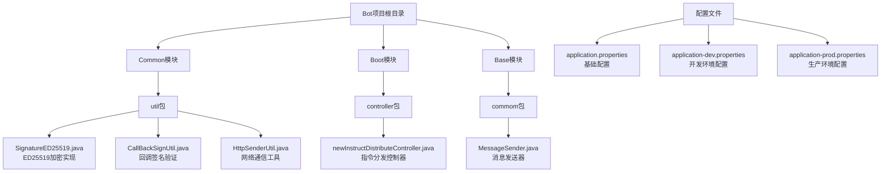
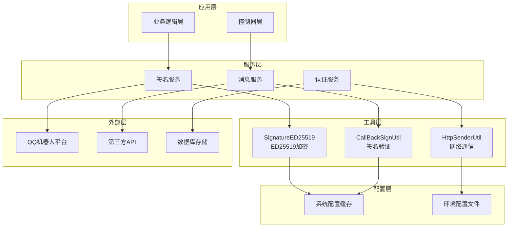
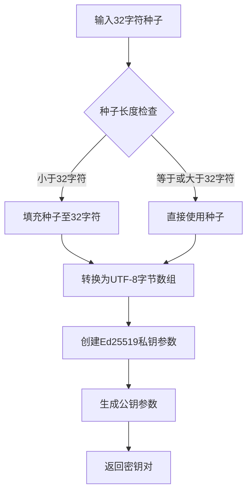
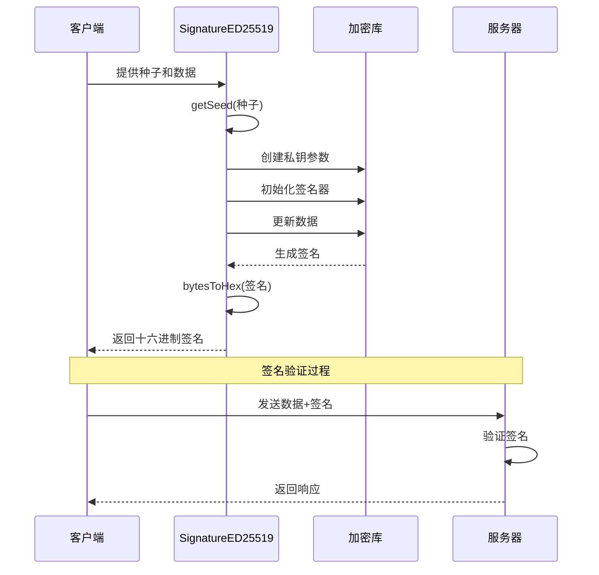
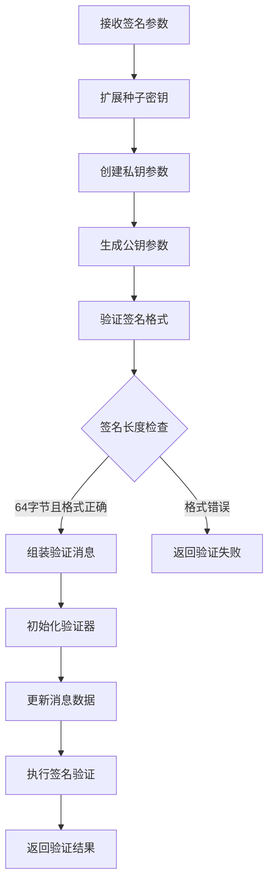
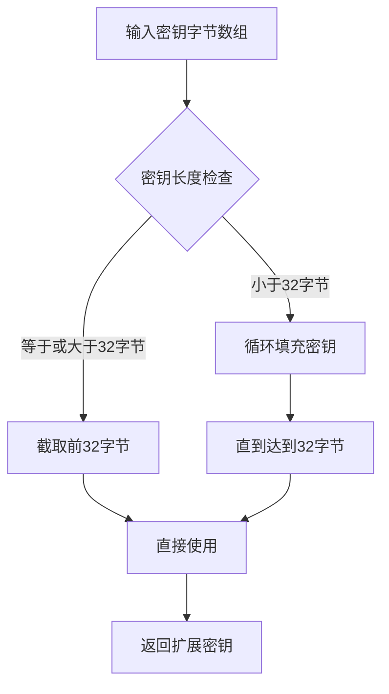
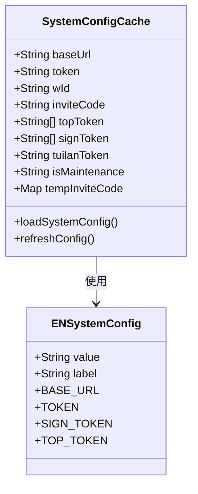
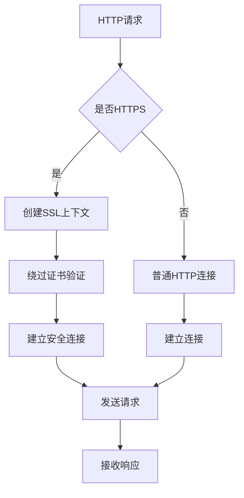
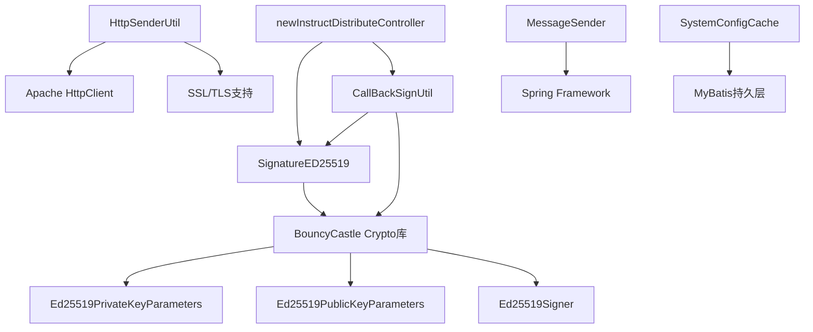

# 数据加密

<cite>
**本文档中引用的文件**
- [SignatureED25519.java](file://Common/src/main/java/com/bot/common/util/SignatureED25519.java)
- [CallBackSignUtil.java](file://Common/src/main/java/com/bot/common/util/CallBackSignUtil.java)
- [application.properties](file://Boot/src/main/resources/application.properties)
- [application-dev.properties](file://Boot/src/main/resources/application-dev.properties)
- [application-prod.properties](file://Boot/src/main/resources/application-prod.properties)
- [newInstructDistributeController.java](file://Boot/src/main/java/com/bot/boot/controller/newInstructDistributeController.java)
- [HttpSenderUtil.java](file://Common/src/main/java/com/bot/common/util/HttpSenderUtil.java)
- [SystemConfigCache.java](file://Common/src/main/java/com/bot/common/config/SystemConfigCache.java)
- [MessageSender.java](file://Base/src/main/java/com/bot/base/commom/MessageSender.java)
</cite>

## 目录
1. [简介](#简介)
2. [项目结构](#项目结构)
3. [核心组件](#核心组件)
4. [架构概览](#架构概览)
5. [详细组件分析](#详细组件分析)
6. [依赖关系分析](#依赖关系分析)
7. [性能考虑](#性能考虑)
8. [故障排除指南](#故障排除指南)
9. [结论](#结论)

## 简介

Bot项目采用了先进的ED25519非对称加密算法来确保消息传输和API调用的安全性。该系统通过SignatureED25519类实现了基于32字符种子的密钥生成机制，配合CallBackSignUtil类提供完整的数字签名验证功能。整个加密体系涵盖了公钥/私钥生成、数字签名流程、数据完整性验证等关键安全特性，为Bot系统的通信安全提供了坚实保障。

## 项目结构

Bot项目的加密模块主要分布在以下目录结构中：

**图表来源**
- [SignatureED25519.java](file://Common/src/main/java/com/bot/common/util/SignatureED25519.java#L1-L65)
- [CallBackSignUtil.java](file://Common/src/main/java/com/bot/common/util/CallBackSignUtil.java#L1-L128)
- [application.properties](file://Boot/src/main/resources/application.properties#L1-L70)

## 核心组件

Bot项目的加密系统由以下核心组件构成：

### SignatureED25519类
负责ED25519非对称加密算法的核心实现，包括：
- 基于32字符种子的密钥对生成
- 数字签名的创建和验证
- 数据格式化和字节转换

### CallBackSignUtil类  
提供回调接口的签名验证功能，确保外部服务调用的合法性：
- 签名验证算法实现
- 时间戳验证机制
- 消息完整性检查

### 配置管理系统
通过Spring框架的配置注入机制管理加密相关的敏感信息：
- 应用密钥配置
- 环境特定的密钥管理
- 动态配置更新支持

**章节来源**
- [SignatureED25519.java](file://Common/src/main/java/com/bot/common/util/SignatureED25519.java#L10-L65)
- [CallBackSignUtil.java](file://Common/src/main/java/com/bot/common/util/CallBackSignUtil.java#L12-L128)

## 架构概览

Bot项目的加密架构采用分层设计，确保了安全性和可维护性：

**图表来源**
- [newInstructDistributeController.java](file://Boot/src/main/java/com/bot/boot/controller/newInstructDistributeController.java#L222-L255)
- [SystemConfigCache.java](file://Common/src/main/java/com/bot/common/config/SystemConfigCache.java#L1-L50)

## 详细组件分析

### SignatureED25519类深度分析

SignatureED25519类是Bot项目中ED25519加密算法的核心实现，提供了完整的非对称加密功能。

#### 密钥生成机制

**图表来源**
- [SignatureED25519.java](file://Common/src/main/java/com/bot/common/util/SignatureED25519.java#L12-L18)

#### 数字签名流程

**图表来源**
- [SignatureED25519.java](file://Common/src/main/java/com/bot/common/util/SignatureED25519.java#L31-L36)

#### 数据格式化处理

SignatureED25519类提供了灵活的数据格式化功能，支持多种数据组合方式：

| 方法 | 输入参数 | 输出格式 | 用途 |
|------|----------|----------|------|
| getData | text, time | 字节数组 | 消息数据组装 |
| sign | secret, data | 十六进制字符串 | 数字签名生成 |
| bytesToHex | byte[] | 十六进制字符串 | 字节到字符串转换 |

**章节来源**
- [SignatureED25519.java](file://Common/src/main/java/com/bot/common/util/SignatureED25519.java#L20-L45)

### CallBackSignUtil类深度分析

CallBackSignUtil类专门处理回调接口的签名验证，确保外部服务调用的安全性。

#### 签名验证算法

**图表来源**
- [CallBackSignUtil.java](file://Common/src/main/java/com/bot/common/util/CallBackSignUtil.java#L22-L44)

#### 密钥扩展机制

**图表来源**
- [CallBackSignUtil.java](file://Common/src/main/java/com/bot/common/util/CallBackSignUtil.java#L92-L104)

**章节来源**
- [CallBackSignUtil.java](file://Common/src/main/java/com/bot/common/util/CallBackSignUtil.java#L22-L73)

### 配置管理系统分析

Bot项目通过多层级的配置管理确保加密密钥的安全存储和动态更新。

#### 环境配置对比

| 配置项 | 开发环境 | 生产环境 | 说明 |
|--------|----------|----------|------|
| system.message.send.key | murongyehua123 | murongyehua123 | 消息发送密钥 |
| chat.key | sk-ymrdvcfjszkwtelpdclkixnyrouixanwyjrrvktsxazjhijw | - | 聊天API密钥 |
| base.chat.key | app-utmEUEMRkTnw91hvOGxii2oI | - | 基础聊天密钥 |
| audio.chat.key | app-MTjenZpBOo3Pl85R5V3uamem | - | 音频聊天密钥 |
| drink.chat.key | app-BMiSrPRblhNvHAbusfIjrSau | - | 饮酒聊天密钥 |
| group.chat.key | app-mRhWaQTW9S01z7V4iZXRp9vJ | - | 群组聊天密钥 |
| review.chat.key | app-yR7rDMIa6keCwG4EmFtHJ1P6 | - | 评论聊天密钥 |

#### 系统配置缓存

**图表来源**
- [SystemConfigCache.java](file://Common/src/main/java/com/bot/common/config/SystemConfigCache.java#L11-L50)
- [ENSystemConfig.java](file://Common/src/main/java/com/bot/common/enums/ENSystemConfig.java#L8-L17)

**章节来源**
- [application-dev.properties](file://Boot/src/main/resources/application-dev.properties#L1-L59)
- [application-prod.properties](file://Boot/src/main/resources/application-prod.properties#L1-L92)
- [SystemConfigCache.java](file://Common/src/main/java/com/bot/common/config/SystemConfigCache.java#L1-L50)

### 网络通信安全分析

HttpSenderUtil类提供了安全的网络通信功能，支持HTTPS连接和SSL证书验证。

#### SSL/TLS安全配置

**图表来源**
- [HttpSenderUtil.java](file://Common/src/main/java/com/bot/common/util/HttpSenderUtil.java#L131-L156)

#### 安全通信流程

| 安全特性 | 实现方式 | 作用 |
|----------|----------|------|
| 连接超时 | 180秒 | 防止长时间等待 |
| 响应超时 | 180秒 | 确保及时响应 |
| SSL绕过 | 自定义TrustManager | 开发环境测试 |
| 请求头验证 | Authorization头 | API访问控制 |

**章节来源**
- [HttpSenderUtil.java](file://Common/src/main/java/com/bot/common/util/HttpSenderUtil.java#L47-L62)
- [HttpSenderUtil.java](file://Common/src/main/java/com/bot/common/util/HttpSenderUtil.java#L131-L156)

## 依赖关系分析

Bot项目的加密模块具有清晰的依赖层次结构：

**图表来源**
- [SignatureED25519.java](file://Common/src/main/java/com/bot/common/util/SignatureED25519.java#L3-L6)
- [CallBackSignUtil.java](file://Common/src/main/java/com/bot/common/util/CallBackSignUtil.java#L4-L6)

**章节来源**
- [SignatureED25519.java](file://Common/src/main/java/com/bot/common/util/SignatureED25519.java#L1-L65)
- [CallBackSignUtil.java](file://Common/src/main/java/com/bot/common/util/CallBackSignUtil.java#L1-L128)

## 性能考虑

### 加密性能优化

1. **密钥复用机制**：通过SystemConfigCache缓存密钥参数，避免重复计算
2. **连接池管理**：HttpSenderUtil使用连接池减少连接建立开销
3. **异步处理**：签名验证采用同步模式，确保安全性优先

### 内存使用优化

- 密钥参数对象生命周期管理
- 字节数组的及时释放
- 缓冲区大小的合理配置

### 并发安全

- 线程安全的静态方法设计
- 不可变对象的广泛使用
- 同步机制的最小化

## 故障排除指南

### 常见问题及解决方案

#### 签名验证失败

**症状**：CallBackSignUtil.verifySignature返回false
**原因**：
- 时间戳过期
- 消息被篡改
- 密钥不匹配

**解决方案**：
1. 检查系统时间同步
2. 验证消息完整性
3. 确认密钥配置正确

#### 密钥生成异常

**症状**：SignatureED25519.getSeed抛出异常
**原因**：
- 种子长度不足
- 字符编码问题

**解决方案**：
1. 确保种子至少32字符
2. 使用UTF-8编码

#### 网络通信失败

**症状**：HttpSenderUtil请求超时或连接失败
**原因**：
- 网络连接问题
- SSL证书验证失败

**解决方案**：
1. 检查网络连通性
2. 在开发环境使用SSL绕过

**章节来源**
- [CallBackSignUtil.java](file://Common/src/main/java/com/bot/common/util/CallBackSignUtil.java#L32-L44)
- [SignatureED25519.java](file://Common/src/main/java/com/bot/common/util/SignatureED25519.java#L12-L18)
- [HttpSenderUtil.java](file://Common/src/main/java/com/bot/common/util/HttpSenderUtil.java#L367-L392)

## 结论

Bot项目的数据加密系统通过ED25519非对称加密算法提供了强大的安全保障。该系统具有以下优势：

1. **安全性**：采用业界标准的ED25519算法，提供抗量子计算的加密强度
2. **灵活性**：支持多种数据格式和应用场景
3. **可维护性**：模块化设计便于维护和扩展
4. **性能**：优化的实现确保高效的加密解密操作

通过合理的密钥管理和配置机制，系统能够在保证安全性的同时提供良好的用户体验。建议定期进行安全审计和密钥轮换，以维持系统的长期安全性。