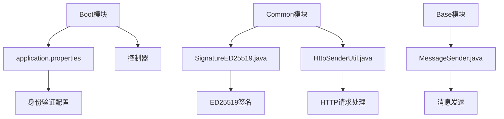
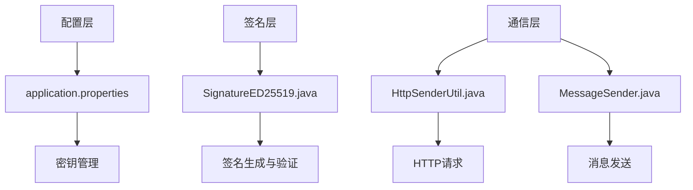
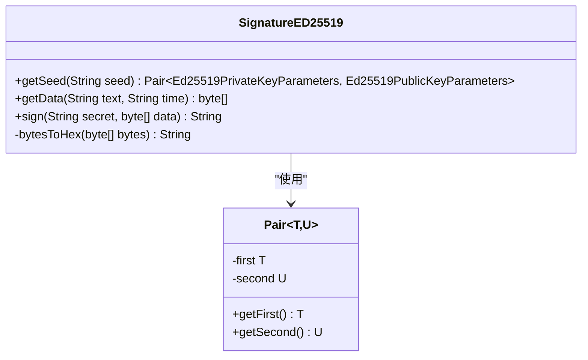
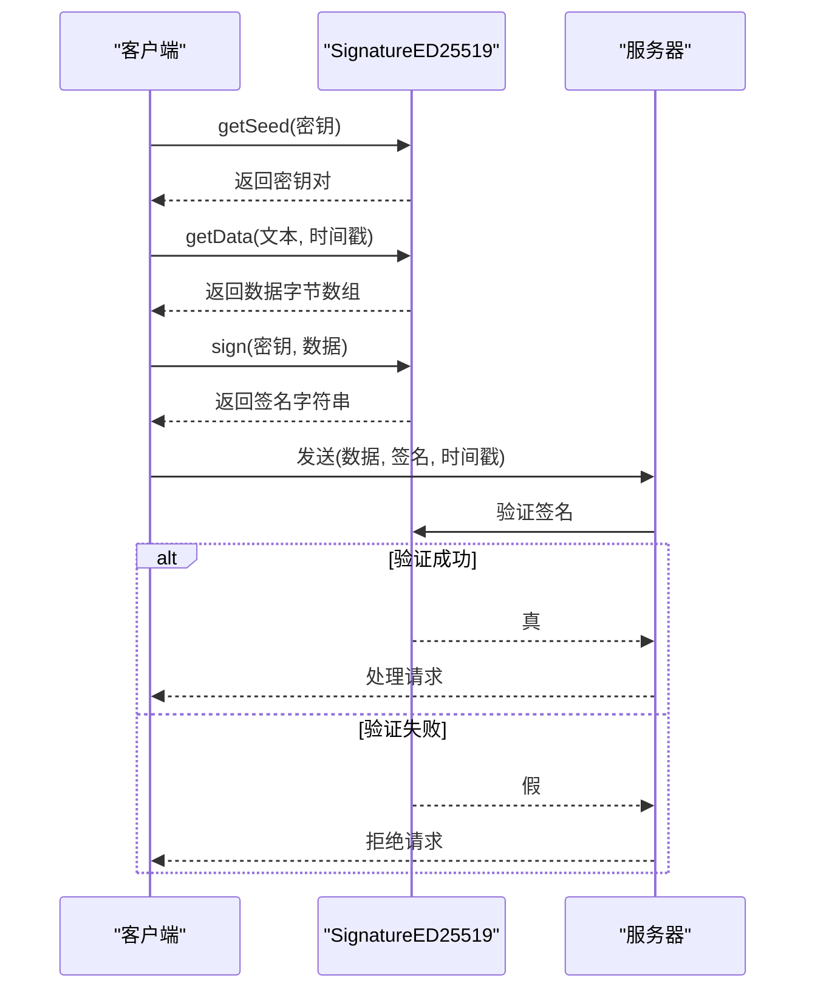
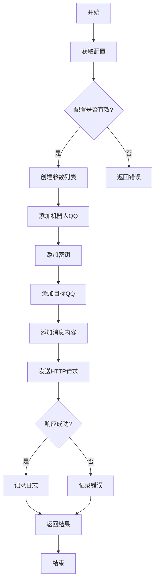
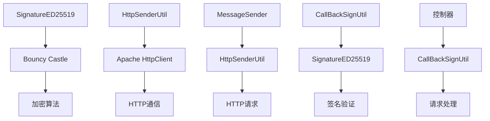

# 身份验证

<cite>
**本文档引用的文件**  
- [application.properties](file://Boot/src/main/resources/application.properties)
- [application-dev.properties](file://Boot/src/main/resources/application-dev.properties)
- [application-prod.properties](file://Boot/src/main/resources/application-prod.properties)
- [SignatureED25519.java](file://Common/src/main/java/com/bot/common/util/SignatureED25519.java)
- [CallBackSignUtil.java](file://Common/src/main/java/com/bot/common/util/CallBackSignUtil.java)
- [MessageSender.java](file://Base/src/main/java/com/bot/base/commom/MessageSender.java)
- [HttpSenderUtil.java](file://Common/src/main/java/com/bot/common/util/HttpSenderUtil.java)
</cite>

## 目录
1. [简介](#简介)
2. [项目结构](#项目结构)
3. [核心组件](#核心组件)
4. [架构概述](#架构概述)
5. [详细组件分析](#详细组件分析)
6. [依赖分析](#依赖分析)
7. [性能考虑](#性能考虑)
8. [故障排除指南](#故障排除指南)
9. [结论](#结论)

## 简介
本文档详细说明了Bot项目中的身份验证机制，重点介绍基于`application.properties`中的系统配置和`SignatureED25519.java`中的ED25519签名实现的安全保护措施。文档涵盖密钥管理、签名验证流程、请求认证机制以及防止重放攻击的策略。通过实际代码示例展示签名生成和验证过程，说明`system.message.send.key`的使用方式，并提供安全配置的最佳实践建议。

## 项目结构
Bot项目采用模块化设计，主要分为Base、Boot、Common、Game和Life五个模块。其中，身份验证相关的核心配置位于Boot模块的`application.properties`文件中，而ED25519签名实现位于Common模块的`SignatureED25519.java`文件中。消息发送功能由Base模块的`MessageSender.java`实现，HTTP请求处理由Common模块的`HttpSenderUtil.java`完成。

**图表来源**
- [application.properties](file://Boot/src/main/resources/application.properties)
- [SignatureED25519.java](file://Common/src/main/java/com/bot/common/util/SignatureED25519.java)
- [HttpSenderUtil.java](file://Common/src/main/java/com/bot/common/util/HttpSenderUtil.java)
- [MessageSender.java](file://Base/src/main/java/com/bot/base/commom/MessageSender.java)

**章节来源**
- [Boot/src/main/resources](file://Boot/src/main/resources)
- [Common/src/main/java/com/bot/common/util](file://Common/src/main/java/com/bot/common/util)
- [Base/src/main/java/com/bot/base/commom](file://Base/src/main/java/com/bot/base/commom)

## 核心组件
本项目的核心身份验证组件包括基于ED25519算法的数字签名机制和基于密钥的身份验证系统。`SignatureED25519.java`实现了ED25519签名算法，用于确保API请求的完整性和真实性。`application.properties`文件中的`system.message.send.key`配置项用于消息发送的身份验证。`MessageSender.java`利用该密钥进行消息发送请求的认证。

**章节来源**
- [SignatureED25519.java](file://Common/src/main/java/com/bot/common/util/SignatureED25519.java)
- [application.properties](file://Boot/src/main/resources/application.properties)
- [MessageSender.java](file://Base/src/main/java/com/bot/base/commom/MessageSender.java)

## 架构概述
Bot项目的身份验证架构采用分层设计，包括配置层、签名层和通信层。配置层由`application.properties`文件提供密钥和URL等配置信息。签名层由`SignatureED25519.java`实现ED25519签名算法，确保数据完整性。通信层由`HttpSenderUtil.java`和`MessageSender.java`实现，负责安全地发送HTTP请求和消息。

**图表来源**
- [application.properties](file://Boot/src/main/resources/application.properties)
- [SignatureED25519.java](file://Common/src/main/java/com/bot/common/util/SignatureED25519.java)
- [HttpSenderUtil.java](file://Common/src/main/java/com/bot/common/util/HttpSenderUtil.java)
- [MessageSender.java](file://Base/src/main/java/com/bot/base/commom/MessageSender.java)

## 详细组件分析
### ED25519签名实现分析
`SignatureED25519.java`文件实现了ED25519数字签名算法，用于验证API请求的真实性和完整性。该实现使用Bouncy Castle加密库，提供了密钥生成、签名和验证功能。

#### 类图

**图表来源**
- [SignatureED25519.java](file://Common/src/main/java/com/bot/common/util/SignatureED25519.java)

#### 签名流程序列图

**图表来源**
- [SignatureED25519.java](file://Common/src/main/java/com/bot/common/util/SignatureED25519.java)

**章节来源**
- [SignatureED25519.java](file://Common/src/main/java/com/bot/common/util/SignatureED25519.java)

### 消息发送认证分析
`MessageSender.java`实现了基于密钥的消息发送认证机制。该组件使用`system.message.send.key`配置项中的密钥对消息发送请求进行认证，确保只有授权的客户端能够发送消息。

#### 消息发送流程

**图表来源**
- [MessageSender.java](file://Base/src/main/java/com/bot/base/commom/MessageSender.java)

**章节来源**
- [MessageSender.java](file://Base/src/main/java/com/bot/base/commom/MessageSender.java)

## 依赖分析
Bot项目的身份验证机制依赖于多个外部库和内部组件。主要依赖包括Bouncy Castle加密库用于ED25519签名算法，Apache HttpClient用于HTTP请求处理，以及Lombok用于简化Java代码。

**图表来源**
- [SignatureED25519.java](file://Common/src/main/java/com/bot/common/util/SignatureED25519.java)
- [HttpSenderUtil.java](file://Common/src/main/java/com/bot/common/util/HttpSenderUtil.java)
- [MessageSender.java](file://Base/src/main/java/com/bot/base/commom/MessageSender.java)
- [CallBackSignUtil.java](file://Common/src/main/java/com/bot/common/util/CallBackSignUtil.java)

**章节来源**
- [Common/src/main/java/com/bot/common/util](file://Common/src/main/java/com/bot/common/util)
- [Base/src/main/java/com/bot/base/commom](file://Base/src/main/java/com/bot/base/commom)

## 性能考虑
ED25519签名算法在提供高安全性的同时，也考虑了性能优化。该算法使用256位密钥，提供128位安全强度，同时具有较快的签名和验证速度。在实际应用中，建议缓存常用的密钥对以减少重复计算，对于高频请求可以考虑使用连接池来提高HTTP通信效率。

## 故障排除指南
当遇到身份验证问题时，可以按照以下步骤进行排查：
1. 检查`application.properties`文件中的`system.message.send.key`配置是否正确
2. 验证时间戳是否在有效范围内，防止重放攻击
3. 确认ED25519密钥格式是否正确，长度是否符合要求
4. 检查HTTP请求头是否包含必要的认证信息
5. 查看日志文件中的错误信息，定位具体问题

**章节来源**
- [application.properties](file://Boot/src/main/resources/application.properties)
- [SignatureED25519.java](file://Common/src/main/java/com/bot/common/util/SignatureED25519.java)
- [HttpSenderUtil.java](file://Common/src/main/java/com/bot/common/util/HttpSenderUtil.java)

## 结论
Bot项目通过ED25519数字签名算法和基于密钥的身份验证机制，实现了安全可靠的API端点和消息通信保护。该方案有效防止了重放攻击和未经授权的访问，确保了系统的安全性。建议定期更新密钥，监控异常请求，并根据实际需求调整安全策略。