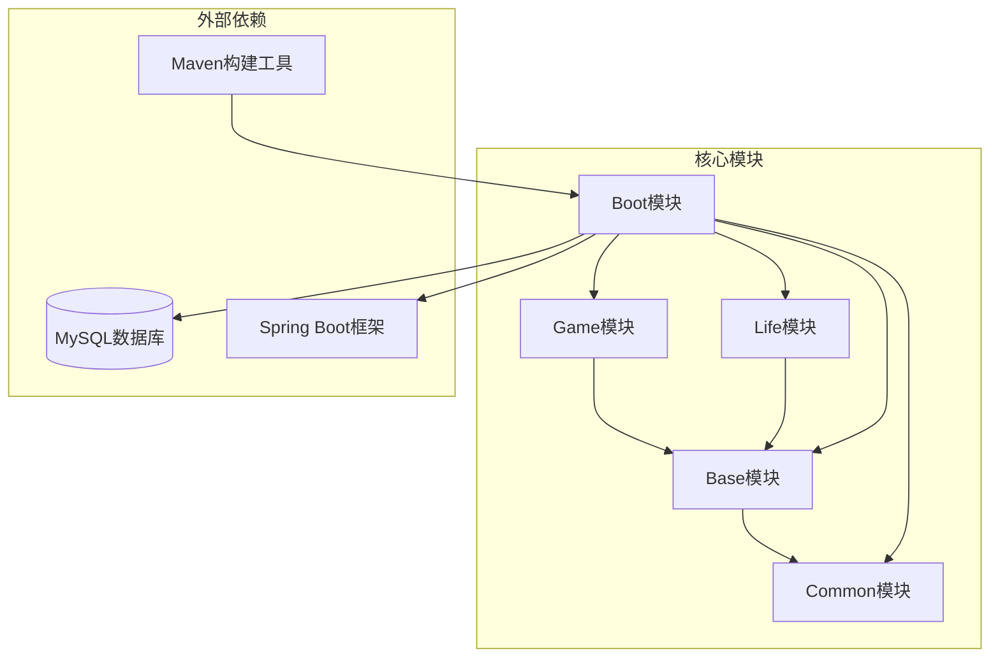
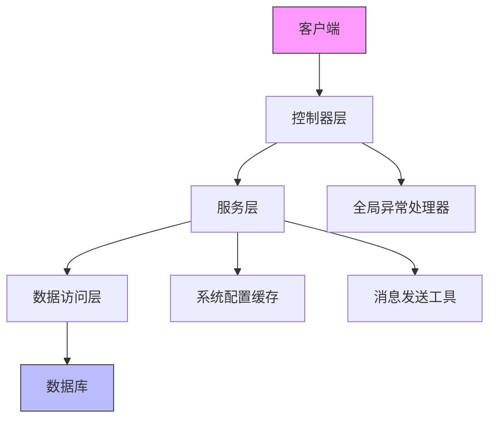
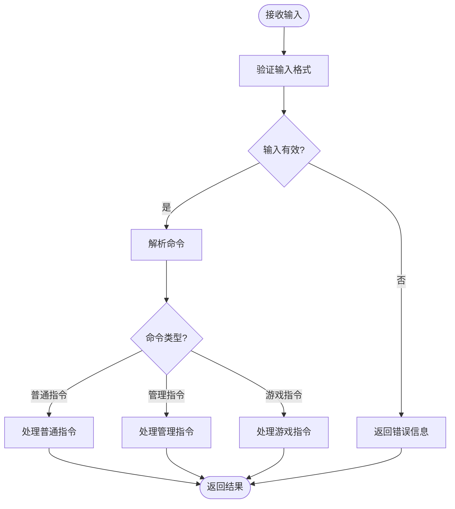
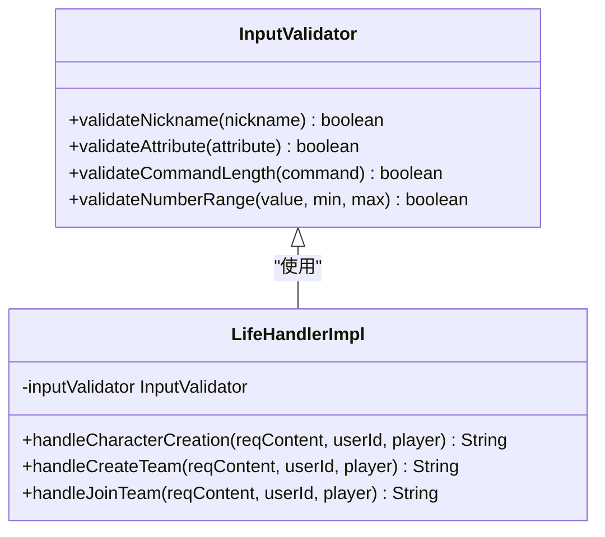
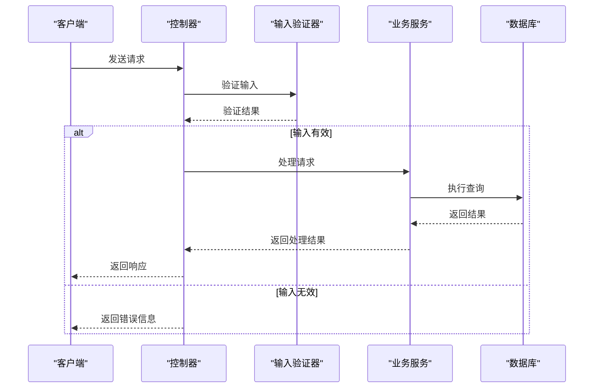
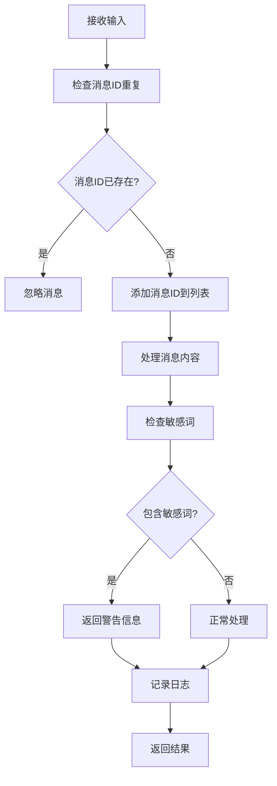
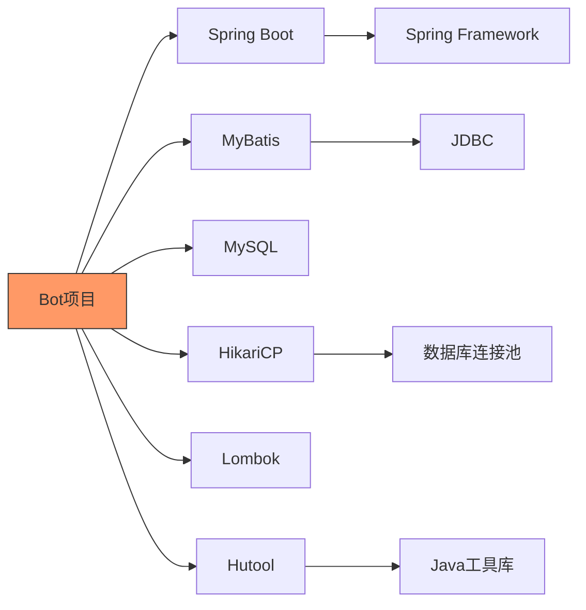

# 输入验证

<cite>
**本文档引用的文件**
- [Life_Deployment_Guide.md](file://Life_Deployment_Guide.md)
- [application.properties](file://Boot/src/main/resources/application.properties)
- [newInstructDistributeController.java](file://Boot/src/main/java/com/bot/boot/controller/newInstructDistributeController.java)
- [LifeHandlerImpl.java](file://Life/src/main/java/com/bot/life/service/impl/LifeHandlerImpl.java)
- [TextUtil.java](file://Common/src/main/java/com/bot/common/util/TextUtil.java)
- [GlobalExceptionHandler.java](file://Boot/src/main/java/com/bot/boot/aspect/GlobalExceptionHandler.java)
- [JXAttributeInitUtil.java](file://Base/src/main/java/com/bot/base/util/JXAttributeInitUtil.java)
- [logback-spring.xml](file://Boot/src/main/resources/logback-spring.xml)
</cite>

## 目录
1. [引言](#引言)
2. [项目结构](#项目结构)
3. [核心组件](#核心组件)
4. [架构概述](#架构概述)
5. [详细组件分析](#详细组件分析)
6. [依赖分析](#依赖分析)
7. [性能考虑](#性能考虑)
8. [故障排除指南](#故障排除指南)
9. [结论](#结论)
10. [附录](#附录)（如有必要）

## 引言
本文档系统性地说明了Bot项目中的输入安全防护措施，基于Life_Deployment_Guide.md中的安全建议和application.properties中的配置参数，描述如何防止注入攻击和恶意输入。文档涵盖了文本过滤、命令解析验证、参数边界检查等方面，说明如何配置安全的输入处理策略。结合实际代码示例，展示了输入验证的实现机制，并提供了常见攻击模式的防御方案和安全审计建议。

## 项目结构
Bot项目采用模块化设计，主要分为Base、Boot、Common、Game和Life五个核心模块。每个模块都有明确的职责划分，确保了系统的可维护性和扩展性。

**图表来源**
- [Life_Deployment_Guide.md](file://Life_Deployment_Guide.md#L3-L234)

**本节来源**
- [Life_Deployment_Guide.md](file://Life_Deployment_Guide.md#L3-L234)

## 核心组件
Bot项目的核心组件包括输入验证、命令分发、服务处理和异常管理。这些组件协同工作，确保系统的安全性和稳定性。

**本节来源**
- [newInstructDistributeController.java](file://Boot/src/main/java/com/bot/boot/controller/newInstructDistributeController.java#L1-L255)
- [LifeHandlerImpl.java](file://Life/src/main/java/com/bot/life/service/impl/LifeHandlerImpl.java#L288-L1195)

## 架构概述
Bot项目的架构设计遵循了分层原则，从输入处理到业务逻辑再到数据访问，每一层都有明确的职责。

**图表来源**
- [newInstructDistributeController.java](file://Boot/src/main/java/com/bot/boot/controller/newInstructDistributeController.java#L1-L255)
- [GlobalExceptionHandler.java](file://Boot/src/main/java/com/bot/boot/aspect/GlobalExceptionHandler.java#L1-L26)

## 详细组件分析

### 输入验证机制分析
Bot项目通过多层次的输入验证机制来确保系统的安全性。

#### 文本过滤与命令解析

**图表来源**
- [newInstructDistributeController.java](file://Boot/src/main/java/com/bot/boot/controller/newInstructDistributeController.java#L72-L255)
- [LifeHandlerImpl.java](file://Life/src/main/java/com/bot/life/service/impl/LifeHandlerImpl.java#L288-L367)

#### 参数边界检查

**图表来源**
- [LifeHandlerImpl.java](file://Life/src/main/java/com/bot/life/service/impl/LifeHandlerImpl.java#L338-L367)
- [JXAttributeInitUtil.java](file://Base/src/main/java/com/bot/base/util/JXAttributeInitUtil.java#L174-L179)

**本节来源**
- [LifeHandlerImpl.java](file://Life/src/main/java/com/bot/life/service/impl/LifeHandlerImpl.java#L288-L367)
- [JXAttributeInitUtil.java](file://Base/src/main/java/com/bot/base/util/JXAttributeInitUtil.java#L174-L179)

### 安全防护策略
Bot项目采用了多种安全防护策略来防止常见的攻击模式。

#### 防止注入攻击

**图表来源**
- [newInstructDistributeController.java](file://Boot/src/main/java/com/bot/boot/controller/newInstructDistributeController.java#L72-L255)
- [application.properties](file://Boot/src/main/resources/application.properties#L47-L62)

#### 恶意输入防御

**图表来源**
- [newInstructDistributeController.java](file://Boot/src/main/java/com/bot/boot/controller/newInstructDistributeController.java#L70-L93)
- [logback-spring.xml](file://Boot/src/main/resources/logback-spring.xml#L1-L58)

**本节来源**
- [newInstructDistributeController.java](file://Boot/src/main/java/com/bot/boot/controller/newInstructDistributeController.java#L70-L93)
- [logback-spring.xml](file://Boot/src/main/resources/logback-spring.xml#L1-L58)

## 依赖分析
Bot项目依赖于多个外部库和框架，这些依赖关系确保了系统的功能完整性和性能优化。

**图表来源**
- [application.properties](file://Boot/src/main/resources/application.properties#L47-L62)
- [pom.xml](file://pom.xml)

**本节来源**
- [application.properties](file://Boot/src/main/resources/application.properties#L47-L62)

## 性能考虑
Bot项目在设计时充分考虑了性能因素，通过合理的配置和优化策略来确保系统的高效运行。

**本节来源**
- [Life_Deployment_Guide.md](file://Life_Deployment_Guide.md#L153-L167)

## 故障排除指南
当遇到输入验证相关的问题时，可以参考以下故障排除步骤：

**本节来源**
- [GlobalExceptionHandler.java](file://Boot/src/main/java/com/bot/boot/aspect/GlobalExceptionHandler.java#L1-L26)
- [Life_Deployment_Guide.md](file://Life_Deployment_Guide.md#L125-L143)

## 结论
Bot项目通过多层次的输入验证机制和全面的安全防护策略，有效地防止了注入攻击和恶意输入。系统的架构设计合理，组件职责明确，为用户提供了一个安全可靠的交互环境。

## 附录
### 配置参数说明
| 配置键 | 默认值 | 说明 |
|--------|--------|------|
| speed_armor_break_rate | 0.005 | 每点速度增加的破防率 |
| constitution_health_rate | 10 | 每点体质增加的血量 |
| constitution_defense_rate | 1 | 每点体质增加的防御 |
| spirit_critical_rate | 0.01 | 每点灵力增加的会心率 |
| spirit_critical_damage_rate | 0.005 | 每点灵力增加的会心效果 |
| strength_attack_rate | 6 | 每点力量增加的攻击力 |

**本节来源**
- [Life_Deployment_Guide.md](file://Life_Deployment_Guide.md#L103-L113)