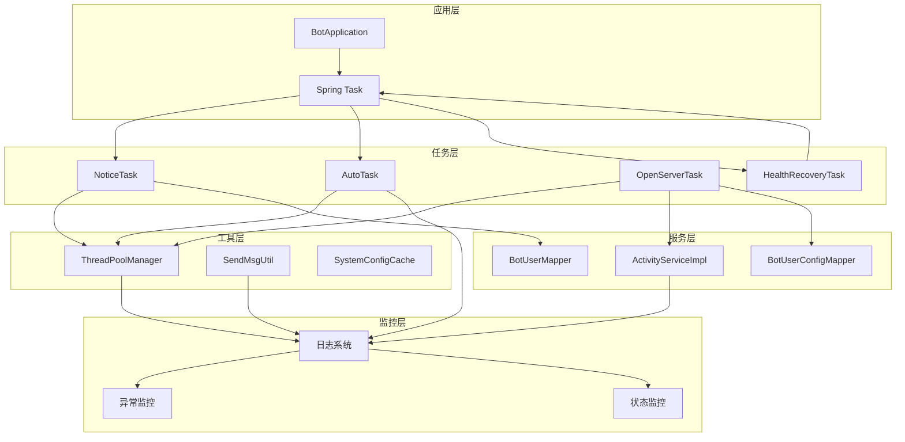
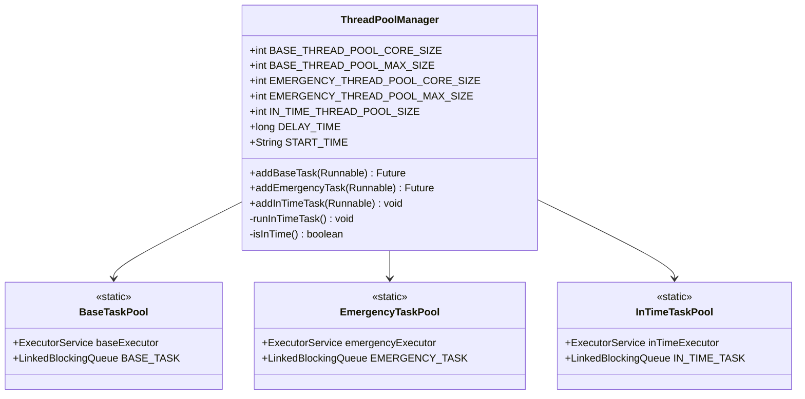
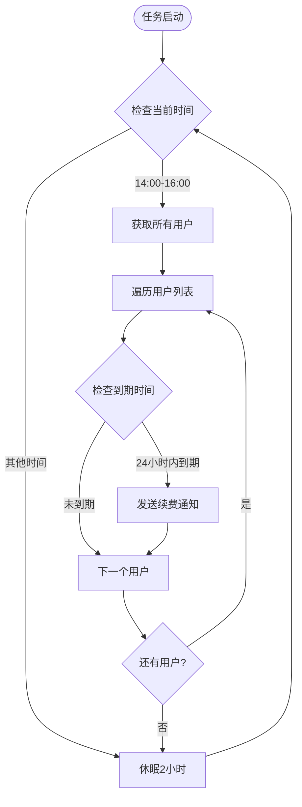
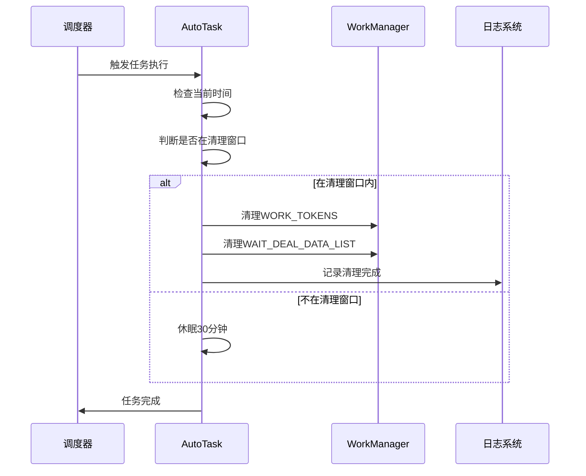
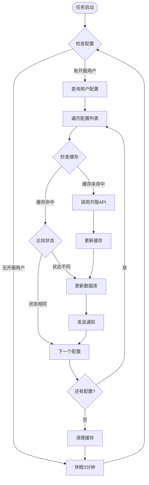
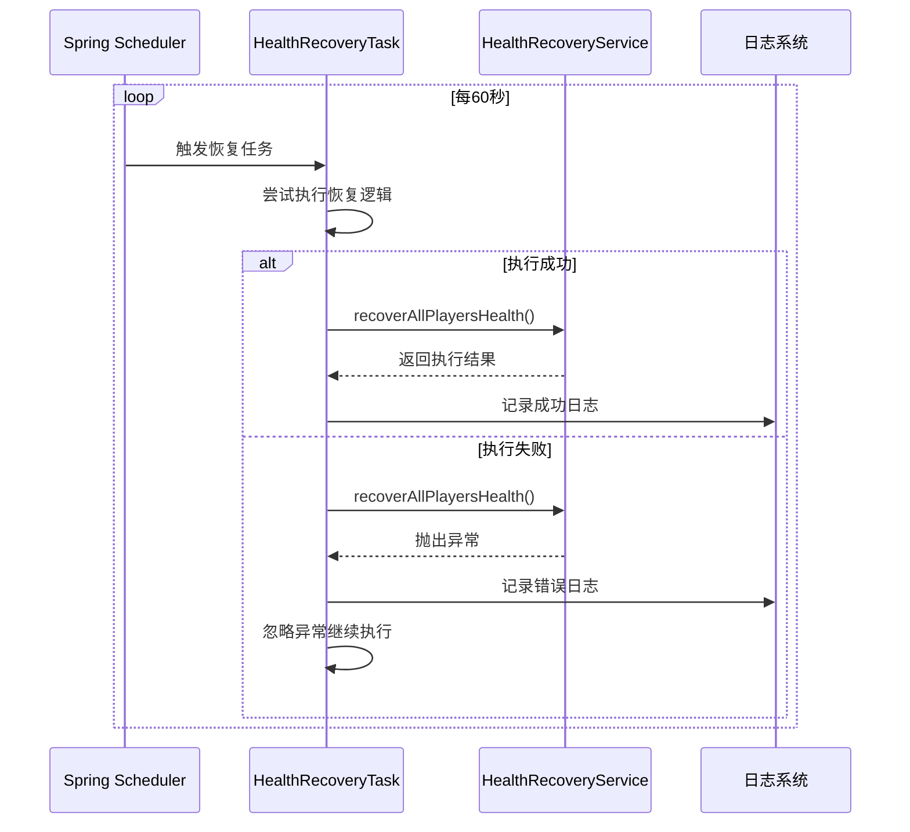
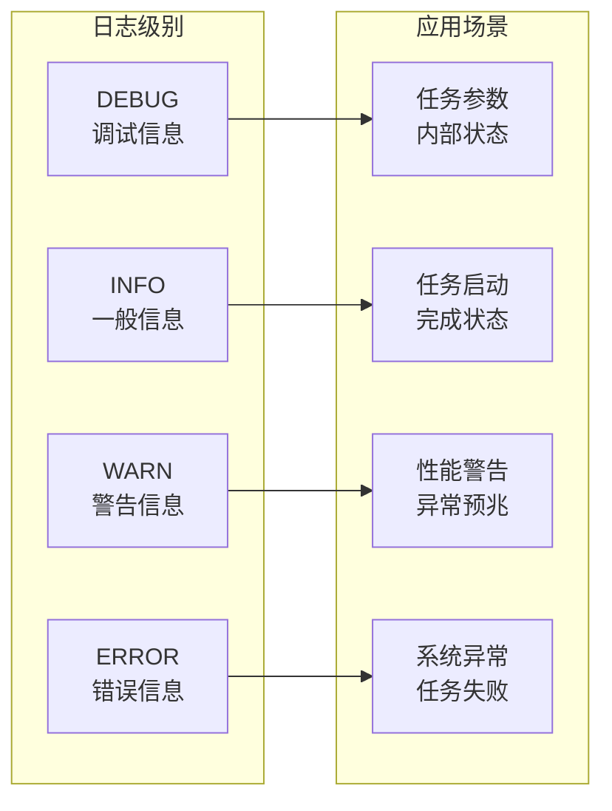
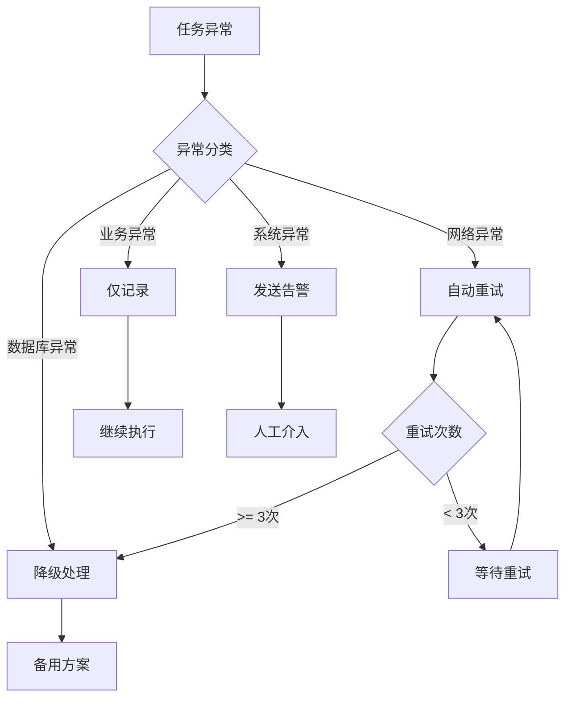

# 任务调度监控

<cite>
**本文档引用的文件**
- [NoticeTask.java](file://Base/src/main/java/com/bot/base/task/NoticeTask.java)
- [AutoTask.java](file://Base/src/main/java/com/bot/base/task/AutoTask.java)
- [OpenServerTask.java](file://Base/src/main/java/com/bot/base/task/OpenServerTask.java)
- [HealthRecoveryTask.java](file://Life/src/main/java/com/bot/life/task/HealthRecoveryTask.java)
- [ThreadPoolManager.java](file://Common/src/main/java/com/bot/common/util/ThreadPoolManager.java)
- [BotApplication.java](file://Boot/src/main/java/com/bot/boot/BotApplication.java)
- [application.properties](file://Boot/src/main/resources/application.properties)
- [BaseConsts.java](file://Common/src/main/java/com/bot/common/constant/BaseConsts.java)
- [ActivityServiceImpl.java](file://Base/src/main/java/com/bot/base/service/impl/ActivityServiceImpl.java)
</cite>

## 目录
1. [概述](#概述)
2. [系统架构](#系统架构)
3. [任务调度配置](#任务调度配置)
4. [核心任务类分析](#核心任务类分析)
5. [监控机制](#监控机制)
6. [日志记录规范](#日志记录规范)
7. [异常处理策略](#异常处理策略)
8. [性能优化建议](#性能优化建议)
9. [故障排查指南](#故障排查指南)
10. [最佳实践](#最佳实践)

## 概述

Bot项目采用基于Spring Task的定时任务调度系统，实现了多层次的任务监控和管理机制。系统通过自定义线程池管理和多种任务执行策略，确保定时任务的稳定性和可靠性。

### 核心特性
- **多层线程池管理**：基础任务、紧急任务、定时任务分别使用独立线程池
- **灵活的调度策略**：支持固定频率、延迟启动、循环执行等多种调度模式
- **完善的监控体系**：实时监控任务执行状态，提供详细的日志记录
- **智能异常处理**：具备自动重试和降级处理能力

## 系统架构



**图表来源**
- [BotApplication.java](file://Boot/src/main/java/com/bot/boot/BotApplication.java#L1-L22)
- [ThreadPoolManager.java](file://Common/src/main/java/com/bot/common/util/ThreadPoolManager.java#L1-L123)

## 任务调度配置

### Spring Task启用配置

系统通过`@EnableScheduling`注解启用Spring Task调度功能，支持基于注解和编程两种方式的任务调度。

### 自定义线程池配置



**图表来源**
- [ThreadPoolManager.java](file://Common/src/main/java/com/bot/common/util/ThreadPoolManager.java#L13-L62)

### 配置参数详解

| 参数名称 | 默认值 | 说明 | 调整建议 |
|---------|--------|------|----------|
| BASE_THREAD_POOL_CORE_SIZE | 10 | 基础任务核心线程数 | 根据CPU核心数调整 |
| BASE_THREAD_POOL_MAX_SIZE | 50 | 基础任务最大线程数 | 避免超过系统资源限制 |
| EMERGENCY_THREAD_POOL_CORE_SIZE | 3 | 紧急任务核心线程数 | 保持较小规模以保证响应性 |
| EMERGENCY_THREAD_POOL_MAX_SIZE | 10 | 紧急任务最大线程数 | 平衡响应性和资源消耗 |
| IN_TIME_THREAD_POOL_SIZE | 1 | 定时任务线程数 | 推荐保持为1避免并发冲突 |
| DELAY_TIME | 3000ms | 定时任务触发间隔 | 根据任务复杂度调整 |
| START_TIME | 10:24:00 | 首次执行时间 | 避开系统高峰期 |

**节来源**
- [ThreadPoolManager.java](file://Common/src/main/java/com/bot/common/util/ThreadPoolManager.java#L16-L46)

## 核心任务类分析

### NoticeTask - 通知任务

#### 执行周期
- **触发条件**：每天下午14:00-16:00之间
- **执行频率**：每2小时轮询一次
- **业务逻辑**：检查用户到期时间，发送续费提醒

#### 关键特性
- **时间窗口控制**：仅在特定时间段内活跃
- **批量处理**：一次性处理所有用户
- **分类通知**：区分个人用户和群组用户



**图表来源**
- [NoticeTask.java](file://Base/src/main/java/com/bot/base/task/NoticeTask.java#L32-L62)

**节来源**
- [NoticeTask.java](file://Base/src/main/java/com/bot/base/task/NoticeTask.java#L1-L66)

### AutoTask - 自动任务

#### 执行周期
- **触发条件**：每日凌晨00:30之前
- **执行频率**：每30分钟检查一次
- **业务逻辑**：清理系统缓存和待处理数据

#### 关键特性
- **定时清理**：每日自动清理过期数据
- **内存管理**：释放不必要的内存占用
- **平滑处理**：避免影响正常业务流程



**图表来源**
- [AutoTask.java](file://Base/src/main/java/com/bot/base/task/AutoTask.java#L18-L42)

**节来源**
- [AutoTask.java](file://Base/src/main/java/com/bot/base/task/AutoTask.java#L1-L45)

### OpenServerTask - 开服任务

#### 执行周期
- **触发条件**：系统配置中有开服监控用户
- **执行频率**：每3分钟检查一次
- **业务逻辑**：监控剑网3服务器开服状态

#### 关键特性
- **状态缓存**：使用内存缓存减少API调用
- **增量更新**：只处理状态发生变化的服务器
- **实时通知**：状态变更时立即通知用户



**图表来源**
- [OpenServerTask.java](file://Base/src/main/java/com/bot/base/task/OpenServerTask.java#L35-L86)

**节来源**
- [OpenServerTask.java](file://Base/src/main/java/com/bot/base/task/OpenServerTask.java#L1-L90)

### HealthRecoveryTask - 生命值恢复任务

#### 执行周期
- **触发条件**：Spring Task调度
- **执行频率**：每60秒固定间隔
- **业务逻辑**：为所有玩家恢复生命值

#### 关键特性
- **固定频率**：使用`@Scheduled(fixedRate)`注解
- **异常隔离**：单个玩家异常不影响整体执行
- **服务依赖**：依赖HealthRecoveryService服务



**图表来源**
- [HealthRecoveryTask.java](file://Life/src/main/java/com/bot/life/task/HealthRecoveryTask.java#L18-L30)

**节来源**
- [HealthRecoveryTask.java](file://Life/src/main/java/com/bot/life/task/HealthRecoveryTask.java#L1-L31)

## 监控机制

### 任务执行状态监控

系统通过以下维度监控任务执行状态：

#### 1. 执行时间监控
- **预期执行时间**：记录任务计划执行时间
- **实际执行时间**：记录任务实际开始时间
- **执行耗时统计**：计算任务执行总耗时

#### 2. 执行结果监控
- **成功计数**：统计成功执行次数
- **失败计数**：统计执行失败次数
- **异常类型**：分类统计不同类型异常

#### 3. 资源使用监控
- **线程池状态**：监控线程池使用率
- **内存占用**：跟踪任务执行内存消耗
- **CPU使用率**：监控任务执行CPU负载

### 异常监控指标

| 监控指标 | 正常范围 | 告警阈值 | 处理策略 |
|---------|----------|----------|----------|
| 任务执行超时 | < 30秒 | > 60秒 | 记录日志，继续执行 |
| 异常发生率 | < 1% | > 5% | 发送告警邮件 |
| 线程池饱和度 | < 80% | > 90% | 动态扩容 |
| 内存使用率 | < 70% | > 85% | 清理缓存 |

## 日志记录规范

### 日志级别定义

系统采用分级日志记录策略：



### 日志格式规范

#### 任务执行日志格式
```
[时间戳] [线程名] [日志级别] [任务类名] - [方法名] - [执行结果] - [耗时(ms)] - [附加信息]
```

#### 示例日志输出
```
14:30:00.123 [task-1] INFO  NoticeTask.doNotice - 用户续费提醒任务启动 - 成功 - 150ms - 处理用户数: 125
16:00:00.456 [task-2] WARN  OpenServerTask.run - 服务器状态查询超时 - 耗时: 4500ms - 重试中...
18:00:00.789 [task-3] ERROR OpenServerTask.run - 服务器状态查询失败 - 异常: NetworkTimeoutException
```

### 日志轮转策略

- **按大小轮转**：单个日志文件最大100MB
- **按时间轮转**：每日生成新的日志文件
- **保留期限**：保留最近30天的日志文件

**节来源**
- [application.properties](file://Boot/src/main/resources/application.properties#L11-L17)

## 异常处理策略

### 异常分类处理



### 具体异常处理策略

#### 1. 网络超时异常
- **重试机制**：最多重试3次，间隔递增
- **超时时间**：初始超时5秒，每次翻倍
- **最终处理**：记录异常并跳过当前任务

#### 2. 数据库连接异常
- **连接池监控**：实时监控连接池状态
- **自动恢复**：尝试重建数据库连接
- **降级处理**：使用本地缓存数据

#### 3. 业务逻辑异常
- **异常隔离**：单个业务单元异常不影响整体
- **状态回滚**：自动回滚已执行的操作
- **用户通知**：向用户发送处理失败通知

**节来源**
- [OpenServerTask.java](file://Base/src/main/java/com/bot/base/task/OpenServerTask.java#L73-L86)

## 性能优化建议

### 线程池优化

#### 1. 核心线程数调整
- **基础任务**：根据CPU核心数×1.5配置
- **紧急任务**：保持较小规模（3-5个线程）
- **定时任务**：固定为1个线程避免并发冲突

#### 2. 队列容量规划
- **基础任务队列**：设置为线程数的10倍
- **紧急任务队列**：设置为线程数的5倍
- **定时任务队列**：使用无界队列

### 任务执行优化

#### 1. 批量处理优化
- **NoticeTask**：一次性处理所有用户，减少数据库查询次数
- **OpenServerTask**：使用缓存机制减少API调用
- **AutoTask**：在清理窗口集中执行清理操作

#### 2. 异步处理优化
- **非阻塞设计**：避免长时间阻塞线程
- **异步回调**：使用Future模式处理异步结果
- **资源复用**：合理复用数据库连接和HTTP连接

### 内存优化策略

#### 1. 缓存管理
- **LRU淘汰**：使用LRU算法管理缓存
- **定期清理**：定时清理过期缓存数据
- **内存监控**：监控缓存内存使用情况

#### 2. 对象池化
- **数据库连接池**：使用Druid连接池
- **HTTP连接池**：使用Apache HttpClient连接池
- **对象复用**：复用频繁创建的对象

## 故障排查指南

### 常见问题诊断

#### 1. 任务未按时执行

**症状表现**：
- 任务执行时间与预期不符
- 日志中缺少任务启动记录

**排查步骤**：
1. 检查Spring Task是否正确启用
2. 验证任务类是否被Spring容器管理
3. 检查线程池是否正常工作
4. 查看系统时间和时区配置

**解决方案**：
```java
// 检查Spring Task启用状态
@EnableScheduling

// 验证任务类注册
@Component
public class NoticeTask {
    // 任务逻辑
}
```

#### 2. 任务执行失败

**症状表现**：
- 任务执行日志显示异常
- 系统监控告警触发

**排查步骤**：
1. 分析异常堆栈信息
2. 检查外部依赖服务状态
3. 验证配置参数正确性
4. 查看系统资源使用情况

**解决方案**：
```java
// 添加详细的异常处理
try {
    // 任务逻辑
} catch (Exception e) {
    log.error("任务执行失败: {}", e.getMessage(), e);
    // 可选的降级处理
}
```

#### 3. 性能问题

**症状表现**：
- 任务执行时间过长
- 系统响应变慢

**排查步骤**：
1. 分析任务执行时间分布
2. 检查数据库查询性能
3. 监控系统资源使用
4. 评估线程池配置

**解决方案**：
- 优化数据库查询
- 增加线程池大小
- 实施任务分片处理

### 监控告警配置

#### 关键监控指标
- **任务执行成功率**：< 95%
- **平均执行时间**：> 30秒
- **异常发生频率**：> 1次/小时
- **线程池饱和度**：> 90%

#### 告警通知机制
- **即时通知**：通过邮件和短信通知
- **聚合通知**：每小时发送汇总报告
- **人工确认**：重要告警需要人工确认

## 最佳实践

### 任务设计原则

#### 1. 单一职责原则
每个任务只负责一个明确的功能模块，避免功能耦合。

#### 2. 异常隔离原则
任务内部异常不应影响其他任务的执行，实现真正的异常隔离。

#### 3. 资源友好原则
任务应合理使用系统资源，避免长时间占用关键资源。

### 部署配置建议

#### 1. 环境配置
- **开发环境**：启用详细日志，禁用生产级监控
- **测试环境**：模拟生产环境配置，启用完整监控
- **生产环境**：优化性能配置，启用完整监控

#### 2. 资源配置
- **JVM参数**：根据任务复杂度调整堆内存大小
- **线程池配置**：根据系统负载动态调整线程池参数
- **数据库连接**：配置合适的连接池大小和超时时间

### 运维管理规范

#### 1. 版本管理
- **任务升级**：采用灰度发布策略
- **配置变更**：建立配置变更审批流程
- **回滚机制**：准备快速回滚方案

#### 2. 监控维护
- **定期检查**：每日检查任务执行状态
- **性能分析**：每周分析任务性能趋势
- **容量规划**：每月评估系统容量需求

#### 3. 应急响应
- **故障预案**：制定详细的故障处理预案
- **人员培训**：定期进行故障处理培训
- **演练计划**：每季度进行应急演练

通过以上全面的任务调度监控机制，Bot项目能够确保定时任务的稳定运行，及时发现和处理各种异常情况，为系统的可靠运行提供有力保障。