# 应用监控

<cite>
**本文档引用的文件**   
- [NoticeTask.java](file://Base/src/main/java/com/bot/base/task/NoticeTask.java)
- [AutoTask.java](file://Base/src/main/java/com/bot/base/task/AutoTask.java)
- [OpenServerTask.java](file://Base/src/main/java/com/bot/base/task/OpenServerTask.java)
- [HealthRecoveryTask.java](file://Life/src/main/java/com/bot/life/task/HealthRecoveryTask.java)
- [ThreadPoolManager.java](file://Common/src/main/java/com/bot/common/util/ThreadPoolManager.java)
- [application.properties](file://Boot/src/main/resources/application.properties)
- [application-dev.properties](file://Boot/src/main/resources/application-dev.properties)
- [application-prod.properties](file://Boot/src/main/resources/application-prod.properties)
- [logback-spring.xml](file://Boot/src/main/resources/logback-spring.xml)
- [Life_Deployment_Guide.md](file://Life_Deployment_Guide.md)
</cite>

## 目录
1. [项目结构](#项目结构)
2. [核心定时任务分析](#核心定时任务分析)
3. [任务调度配置](#任务调度配置)
4. [执行日志记录](#执行日志记录)
5. [异常处理机制](#异常处理机制)
6. [性能监控指标](#性能监控指标)
7. [监控配置建议](#监控配置建议)
8. [运维建议](#运维建议)

## 项目结构

Bot项目采用模块化设计，主要包含Base、Boot、Common、Game和Life五个核心模块。其中，定时任务主要分布在Base和Life模块中，用于实现各种自动化功能和游戏机制。

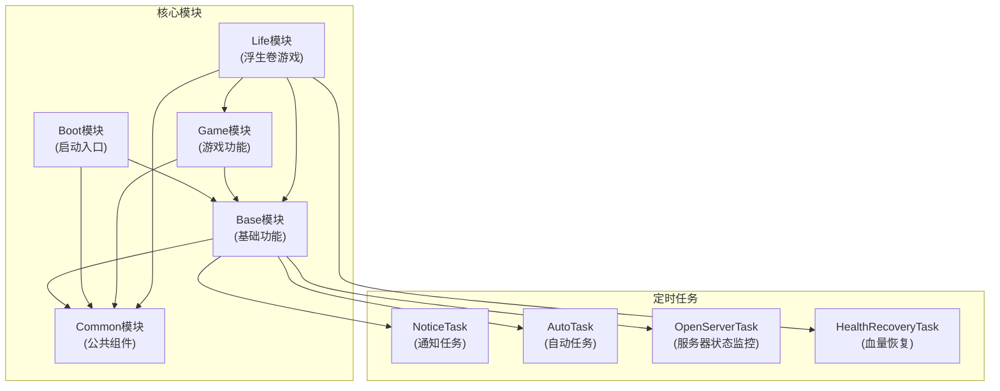
```mermaid
graph TB
subgraph "核心模块"
Base["Base模块\n(基础功能)"]
Boot["Boot模块\n(启动入口)"]
Common["Common模块\n(公共组件)"]
Game["Game模块\n(游戏功能)"]
Life["Life模块\n(浮生卷游戏)"]
end
Base --> Common
Boot --> Base
Boot --> Common
Game --> Base
Game --> Common
Life --> Base
Life --> Common
Life --> Game
subgraph "定时任务"
NoticeTask["NoticeTask\n(通知任务)"]
AutoTask["AutoTask\n(自动任务)"]
OpenServerTask["OpenServerTask\n(服务器状态监控)"]
HealthRecoveryTask["HealthRecoveryTask\n(血量恢复)"]
end
Base --> NoticeTask
Base --> AutoTask
Base --> OpenServerTask
Life --> HealthRecoveryTask
```

**图表来源**
- [NoticeTask.java](file://Base/src/main/java/com/bot/base/task/NoticeTask.java)
- [AutoTask.java](file://Base/src/main/java/com/bot/base/task/AutoTask.java)
- [OpenServerTask.java](file://Base/src/main/java/com/bot/base/task/OpenServerTask.java)
- [HealthRecoveryTask.java](file://Life/src/main/java/com/bot/life/task/HealthRecoveryTask.java)

**章节来源**
- [Base](file://Base)
- [Life](file://Life)

## 核心定时任务分析

Bot项目中的定时任务是保障系统稳定运行和提供游戏体验的关键组件。通过对NoticeTask、AutoTask、OpenServerTask和HealthRecoveryTask的分析，可以了解系统的监控机制。

### 通知任务 (NoticeTask)

NoticeTask负责在特定时间段向用户发送到期提醒。该任务通过线程池每2小时轮询一次，在下午14:00-16:00期间检查用户到期时间，对即将到期的用户发送续费提醒。

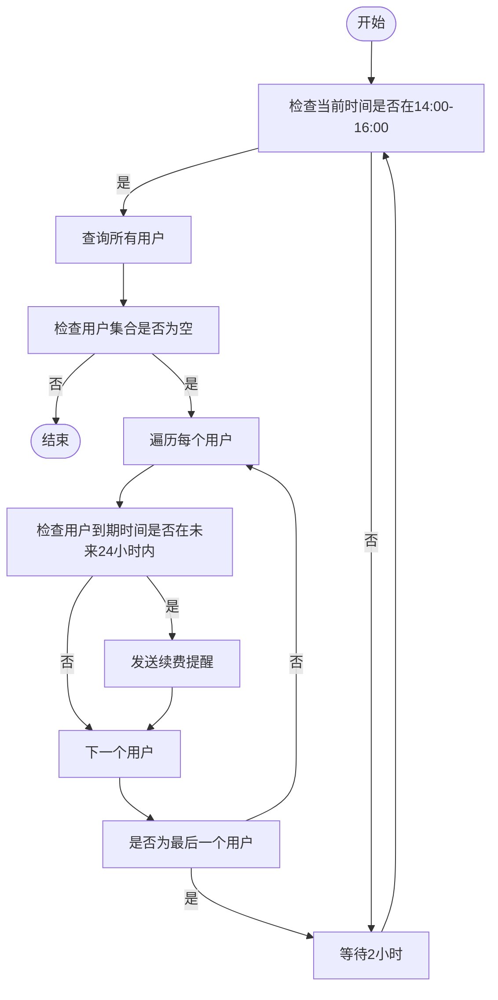
```mermaid
flowchart TD
Start([开始]) --> CheckTime["检查当前时间是否在14:00-16:00"]
CheckTime --> |是| QueryUsers["查询所有用户"]
CheckTime --> |否| Wait["等待2小时"]
QueryUsers --> CheckUsers["检查用户集合是否为空"]
CheckUsers --> |否| End([结束])
CheckUsers --> |是| Loop["遍历每个用户"]
Loop --> CheckDeadline["检查用户到期时间是否在未来24小时内"]
CheckDeadline --> |否| NextUser["下一个用户"]
CheckDeadline --> |是| SendNotice["发送续费提醒"]
SendNotice --> NextUser
NextUser --> CheckLast["是否为最后一个用户"]
CheckLast --> |否| Loop
CheckLast --> |是| Wait
Wait --> CheckTime
```

**图表来源**
- [NoticeTask.java](file://Base/src/main/java/com/bot/base/task/NoticeTask.java#L33-L65)

**章节来源**
- [NoticeTask.java](file://Base/src/main/java/com/bot/base/task/NoticeTask.java#L27-L66)

### 自动任务 (AutoTask)

AutoTask负责每日零点执行的自动清理任务。该任务每30分钟检查一次时间，在每日零点时清空工作令牌和待处理数据列表，确保系统状态的每日重置。

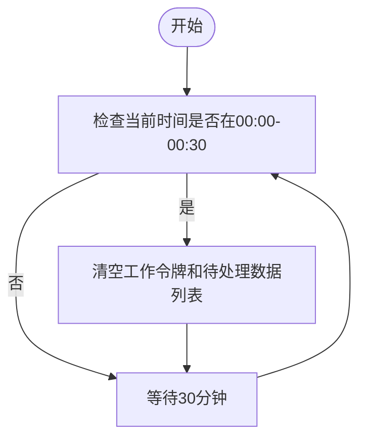
```mermaid
flowchart TD
Start([开始]) --> CheckTime["检查当前时间是否在00:00-00:30"]
CheckTime --> |是| ClearData["清空工作令牌和待处理数据列表"]
CheckTime --> |否| Wait["等待30分钟"]
ClearData --> Wait
Wait --> CheckTime
```

**图表来源**
- [AutoTask.java](file://Base/src/main/java/com/bot/base/task/AutoTask.java#L19-L44)

**章节来源**
- [AutoTask.java](file://Base/src/main/java/com/bot/base/task/AutoTask.java#L16-L45)

### 服务器状态监控任务 (OpenServerTask)

OpenServerTask负责监控游戏服务器的开服状态。该任务每3分钟轮询一次，检查配置的服务器状态，当状态发生变化时更新数据库并通知相关用户。

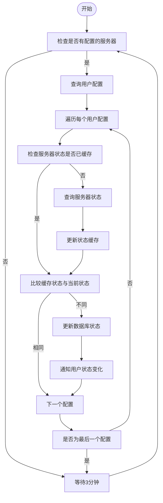
```mermaid
flowchart TD
Start([开始]) --> CheckConfig["检查是否有配置的服务器"]
CheckConfig --> |否| Wait["等待3分钟"]
CheckConfig --> |是| QueryConfig["查询用户配置"]
QueryConfig --> Loop["遍历每个用户配置"]
Loop --> CheckCache["检查服务器状态是否已缓存"]
CheckCache --> |是| CompareStatus["比较缓存状态与当前状态"]
CheckCache --> |否| QueryServer["查询服务器状态"]
CompareStatus --> |相同| NextConfig["下一个配置"]
CompareStatus --> |不同| UpdateStatus["更新数据库状态"]
QueryServer --> UpdateCache["更新状态缓存"]
UpdateCache --> CompareStatus
UpdateStatus --> NotifyUser["通知用户状态变化"]
NotifyUser --> NextConfig
NextConfig --> CheckLast["是否为最后一个配置"]
CheckLast --> |否| Loop
CheckLast --> |是| Wait
Wait --> CheckConfig
```

**图表来源**
- [OpenServerTask.java](file://Base/src/main/java/com/bot/base/task/OpenServerTask.java#L35-L89)

**章节来源**
- [OpenServerTask.java](file://Base/src/main/java/com/bot/base/task/OpenServerTask.java#L24-L90)

### 血量恢复任务 (HealthRecoveryTask)

HealthRecoveryTask是Life模块中的核心定时任务，负责每分钟为所有玩家恢复血量。该任务使用Spring的@Scheduled注解，以60秒为固定间隔执行。

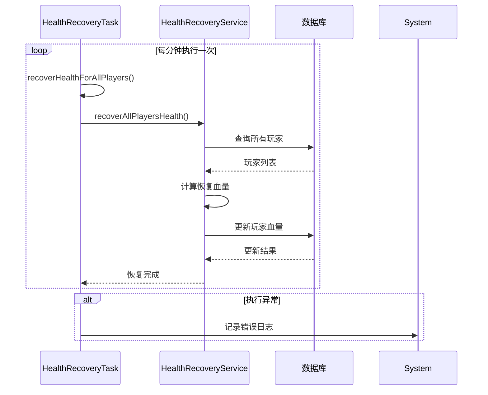
```mermaid
sequenceDiagram
participant Task as HealthRecoveryTask
participant Service as HealthRecoveryService
participant DB as 数据库
loop 每分钟执行一次
Task->>Task : recoverHealthForAllPlayers()
Task->>Service : recoverAllPlayersHealth()
Service->>DB : 查询所有玩家
DB-->>Service : 玩家列表
Service->>Service : 计算恢复血量
Service->>DB : 更新玩家血量
DB-->>Service : 更新结果
Service-->>Task : 恢复完成
end
alt 执行异常
Task->>System : 记录错误日志
end
```

**图表来源**
- [HealthRecoveryTask.java](file://Life/src/main/java/com/bot/life/task/HealthRecoveryTask.java#L21-L30)
- [HealthRecoveryService.java](file://Life/src/main/java/com/bot/life/service/HealthRecoveryService.java)

**章节来源**
- [HealthRecoveryTask.java](file://Life/src/main/java/com/bot/life/task/HealthRecoveryTask.java#L13-L31)

## 任务调度配置

Bot项目的任务调度机制基于自定义的线程池管理器ThreadPoolManager，结合Spring框架的定时任务功能，实现了灵活的任务调度配置。

### 线程池配置

系统定义了三种类型的线程池：基础线程池、紧急线程池和定时任务线程池，以满足不同场景的需求。

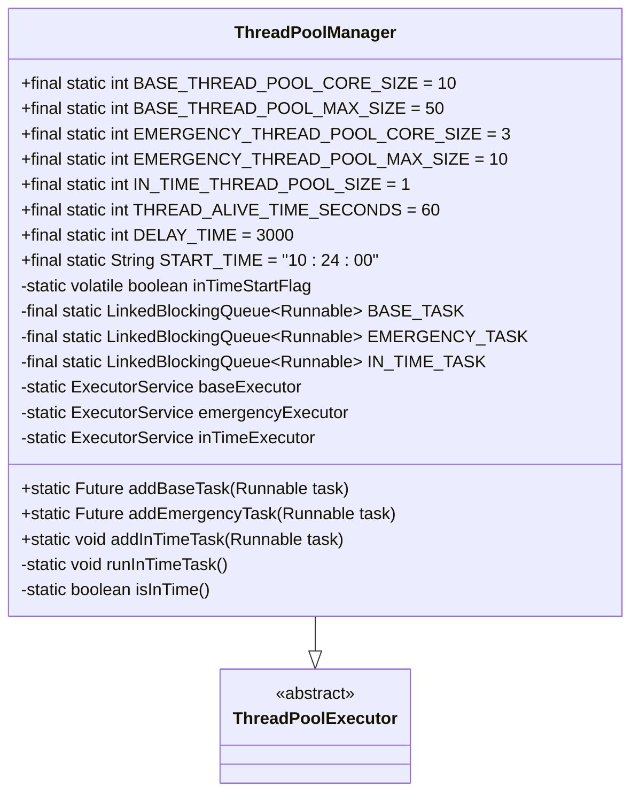
```mermaid
classDiagram
class ThreadPoolManager {
+final static int BASE_THREAD_POOL_CORE_SIZE = 10
+final static int BASE_THREAD_POOL_MAX_SIZE = 50
+final static int EMERGENCY_THREAD_POOL_CORE_SIZE = 3
+final static int EMERGENCY_THREAD_POOL_MAX_SIZE = 10
+final static int IN_TIME_THREAD_POOL_SIZE = 1
+final static int THREAD_ALIVE_TIME_SECONDS = 60
+final static int DELAY_TIME = 3000
+final static String START_TIME = "10 : 24 : 00"
-static volatile boolean inTimeStartFlag
-final static LinkedBlockingQueue~Runnable~ BASE_TASK
-final static LinkedBlockingQueue~Runnable~ EMERGENCY_TASK
-final static LinkedBlockingQueue~Runnable~ IN_TIME_TASK
-static ExecutorService baseExecutor
-static ExecutorService emergencyExecutor
-static ExecutorService inTimeExecutor
+static Future addBaseTask(Runnable task)
+static Future addEmergencyTask(Runnable task)
+static void addInTimeTask(Runnable task)
-static void runInTimeTask()
-static boolean isInTime()
}
class ThreadPoolExecutor {
<<abstract>>
}
ThreadPoolManager --|> ThreadPoolExecutor
```

**图表来源**
- [ThreadPoolManager.java](file://Common/src/main/java/com/bot/common/util/ThreadPoolManager.java#L13-L124)

**章节来源**
- [ThreadPoolManager.java](file://Common/src/main/java/com/bot/common/util/ThreadPoolManager.java#L1-L124)

### 定时任务执行流程

定时任务的执行流程包括任务提交、线程池分配和任务执行三个主要阶段。

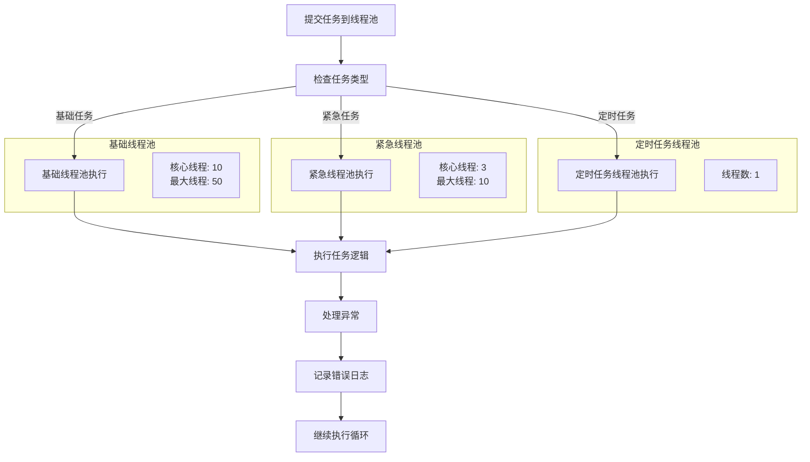
```mermaid
flowchart TD
Submit["提交任务到线程池"] --> CheckType["检查任务类型"]
CheckType --> |基础任务| BasePool["基础线程池执行"]
CheckType --> |紧急任务| EmergencyPool["紧急线程池执行"]
CheckType --> |定时任务| InTimePool["定时任务线程池执行"]
BasePool --> Execute["执行任务逻辑"]
EmergencyPool --> Execute
InTimePool --> Execute
Execute --> HandleException["处理异常"]
HandleException --> LogError["记录错误日志"]
LogError --> Continue["继续执行循环"]
subgraph "基础线程池"
BasePool
direction LR
BaseConfig["核心线程: 10\n最大线程: 50"]
end
subgraph "紧急线程池"
EmergencyPool
direction LR
EmergencyConfig["核心线程: 3\n最大线程: 10"]
end
subgraph "定时任务线程池"
InTimePool
direction LR
InTimeConfig["线程数: 1"]
end
```

**图表来源**
- [ThreadPoolManager.java](file://Common/src/main/java/com/bot/common/util/ThreadPoolManager.java#L68-L116)
- [NoticeTask.java](file://Base/src/main/java/com/bot/base/task/NoticeTask.java#L34-L35)
- [AutoTask.java](file://Base/src/main/java/com/bot/base/task/AutoTask.java#L20-L21)
- [OpenServerTask.java](file://Base/src/main/java/com/bot/base/task/OpenServerTask.java#L36-L37)

**章节来源**
- [ThreadPoolManager.java](file://Common/src/main/java/com/bot/common/util/ThreadPoolManager.java#L1-L124)

## 执行日志记录

Bot项目采用Logback作为日志框架，通过合理的日志配置实现详细的执行日志记录，便于监控和故障排查。

### 日志配置分析

系统通过logback-spring.xml配置文件定义了日志的输出格式、级别和存储策略。

```mermaid
classDiagram
class LogbackConfig {
+logback.path : String
+logback.rootPath : String
+logback.pattern : String
+logback.charset : String
+logback.level : String
+sql.level : String
}
class ConsoleAppender {
+name : "CONSOLE"
+filter : ThresholdFilter
+level : TRACE
+encoder : PatternLayout
+pattern : "%d{HH : mm : ss.SSS} [%thread] %-5level %logger-%line -- %msg --%n"
}
class RollingFileAppender {
+name : "ROLLINGFILE"
+filter : ThresholdFilter
+level : TRACE
+rollingPolicy : SizeAndTimeBasedRollingPolicy
+fileNamePattern : "${logback.path}/%d{yyyy-MM-dd}/${project.name}.%d{yyyy-MM-dd}.%i.log"
+maxFileSize : "100MB"
+maxHistory : 30
+encoder : PatternLayout
+pattern : "%d{HH : mm : ss.SSS} [%thread] %-5level %logger-%line -- %msg --%n"
}
class AsyncAppender {
+name : "ASYNC_ROLLING_FILE"
+discardingThreshold : 0
+queueSize : 2048
+includeCallerData : false
+appender-ref : ROLLINGFILE
}
class RootLogger {
+level : "${logback.level}"
+appender-ref : CONSOLE
+appender-ref : ASYNC_ROLLING_FILE
}
LogbackConfig --> ConsoleAppender
LogbackConfig --> RollingFileAppender
LogbackConfig --> AsyncAppender
LogbackConfig --> RootLogger
```

**图表来源**
- [logback-spring.xml](file://Boot/src/main/resources/logback-spring.xml#L1-L59)

**章节来源**
- [logback-spring.xml](file://Boot/src/main/resources/logback-spring.xml#L1-L59)

### 日志记录实践

各定时任务在执行过程中都遵循统一的日志记录规范，确保关键操作和异常情况都能被有效记录。

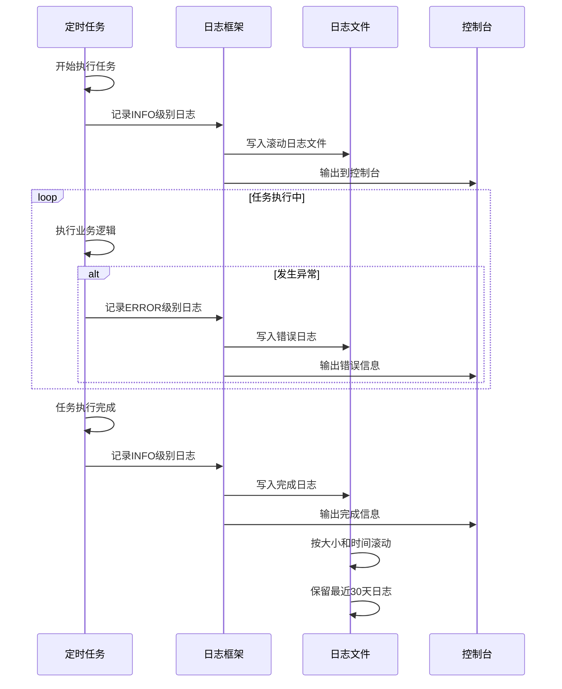
```mermaid
sequenceDiagram
participant Task as 定时任务
participant Logger as 日志框架
participant File as 日志文件
participant Console as 控制台
Task->>Task : 开始执行任务
Task->>Logger : 记录INFO级别日志
Logger->>File : 写入滚动日志文件
Logger->>Console : 输出到控制台
loop 任务执行中
Task->>Task : 执行业务逻辑
alt 发生异常
Task->>Logger : 记录ERROR级别日志
Logger->>File : 写入错误日志
Logger->>Console : 输出错误信息
end
end
Task->>Task : 任务执行完成
Task->>Logger : 记录INFO级别日志
Logger->>File : 写入完成日志
Logger->>Console : 输出完成信息
File->>File : 按大小和时间滚动
File->>File : 保留最近30天日志
```

**图表来源**
- [NoticeTask.java](file://Base/src/main/java/com/bot/base/task/NoticeTask.java#L59-L60)
- [AutoTask.java](file://Base/src/main/java/com/bot/base/task/AutoTask.java#L31-L32)
- [OpenServerTask.java](file://Base/src/main/java/com/bot/base/task/OpenServerTask.java#L76-L77)
- [HealthRecoveryTask.java](file://Life/src/main/java/com/bot/life/task/HealthRecoveryTask.java#L27-L28)
- [logback-spring.xml](file://Boot/src/main/resources/logback-spring.xml#L14-L53)

**章节来源**
- [NoticeTask.java](file://Base/src/main/java/com/bot/base/task/NoticeTask.java#L27-L66)
- [AutoTask.java](file://Base/src/main/java/com/bot/base/task/AutoTask.java#L16-L45)
- [OpenServerTask.java](file://Base/src/main/java/com/bot/base/task/OpenServerTask.java#L24-L90)
- [HealthRecoveryTask.java](file://Life/src/main/java/com/bot/life/task/HealthRecoveryTask.java#L13-L31)

## 异常处理机制

Bot项目建立了完善的异常处理机制，确保定时任务在出现异常时能够优雅地处理，避免影响其他功能的正常运行。

### 任务级异常处理

每个定时任务都在其执行逻辑中包含了try-catch块，捕获并处理可能发生的异常。

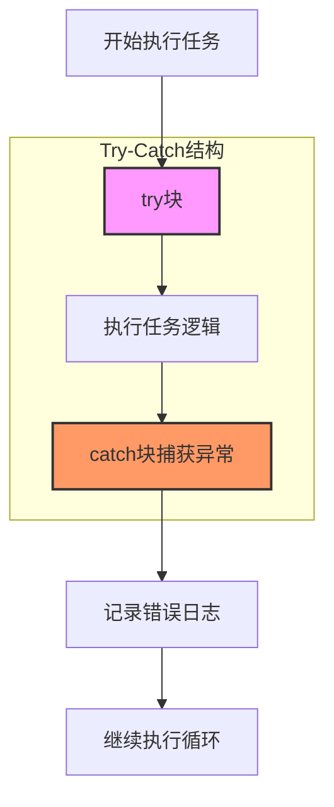
```mermaid
flowchart TD
Start["开始执行任务"] --> Try["try块"]
Try --> Execute["执行任务逻辑"]
Execute --> Catch["catch块捕获异常"]
Catch --> LogError["记录错误日志"]
LogError --> Continue["继续执行循环"]
subgraph "Try-Catch结构"
Try
Execute
Catch
direction TB
end
style Try fill:#f9f,stroke:#333,stroke-width:2px
style Catch fill:#f96,stroke:#333,stroke-width:2px
```

**图表来源**
- [NoticeTask.java](file://Base/src/main/java/com/bot/base/task/NoticeTask.java#L36-L60)
- [AutoTask.java](file://Base/src/main/java/com/bot/base/task/AutoTask.java#L22-L37)
- [OpenServerTask.java](file://Base/src/main/java/com/bot/base/task/OpenServerTask.java#L38-L82)
- [HealthRecoveryTask.java](file://Life/src/main/java/com/bot/life/task/HealthRecoveryTask.java#L23-L28)

**章节来源**
- [NoticeTask.java](file://Base/src/main/java/com/bot/base/task/NoticeTask.java#L27-L66)
- [AutoTask.java](file://Base/src/main/java/com/bot/base/task/AutoTask.java#L16-L45)
- [OpenServerTask.java](file://Base/src/main/java/com/bot/base/task/OpenServerTask.java#L24-L90)
- [HealthRecoveryTask.java](file://Life/src/main/java/com/bot/life/task/HealthRecoveryTask.java#L13-L31)

### 全局异常处理

系统还配置了全局异常处理器，作为最后一道防线捕获未被处理的异常。

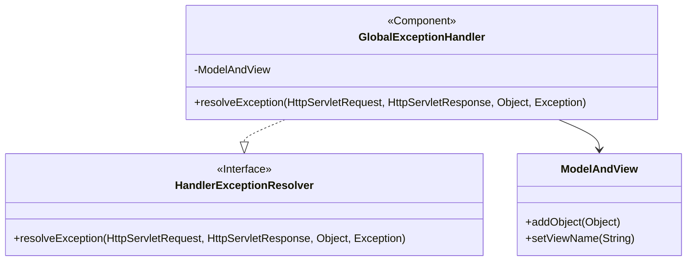
```mermaid
classDiagram
class GlobalExceptionHandler {
<<Component>>
+resolveException(HttpServletRequest, HttpServletResponse, Object, Exception)
-ModelAndView
}
class HandlerExceptionResolver {
<<Interface>>
+resolveException(HttpServletRequest, HttpServletResponse, Object, Exception)
}
GlobalExceptionHandler ..|> HandlerExceptionResolver
class ModelAndView {
+addObject(Object)
+setViewName(String)
}
GlobalExceptionHandler --> ModelAndView
```

**图表来源**
- [GlobalExceptionHandler.java](file://Boot/src/main/java/com/bot/boot/aspect/GlobalExceptionHandler.java#L1-L26)

**章节来源**
- [GlobalExceptionHandler.java](file://Boot/src/main/java/com/bot/boot/aspect/GlobalExceptionHandler.java#L1-L26)

### 异常处理策略

系统采用分层的异常处理策略，确保不同级别的异常得到适当的处理。

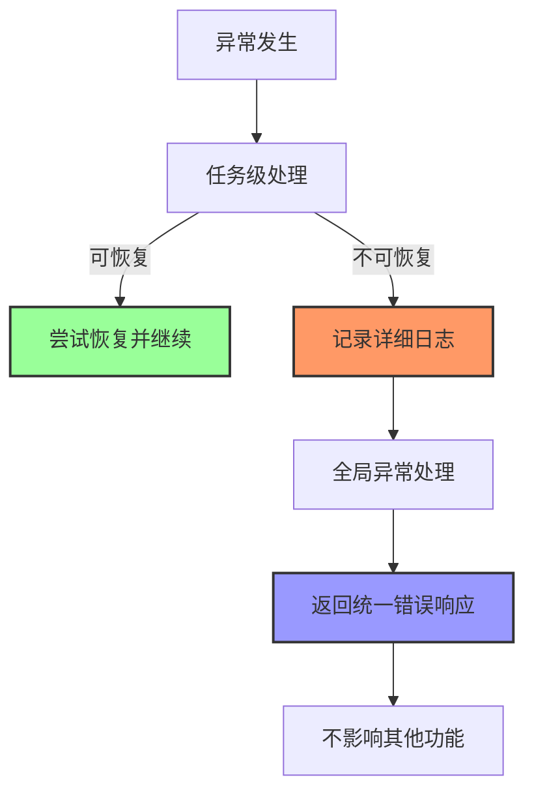
```mermaid
flowchart TD
Exception["异常发生"] --> TaskLevel["任务级处理"]
TaskLevel --> |可恢复| Recover["尝试恢复并继续"]
TaskLevel --> |不可恢复| Log["记录详细日志"]
Log --> GlobalLevel["全局异常处理"]
GlobalLevel --> Response["返回统一错误响应"]
Response --> Continue["不影响其他功能"]
style Recover fill:#9f9,stroke:#333,stroke-width:2px
style Log fill:#f96,stroke:#333,stroke-width:2px
style Response fill:#99f,stroke:#333,stroke-width:2px
```

**图表来源**
- [NoticeTask.java](file://Base/src/main/java/com/bot/base/task/NoticeTask.java#L59-L60)
- [HealthRecoveryTask.java](file://Life/src/main/java/com/bot/life/task/HealthRecoveryTask.java#L27-L28)
- [GlobalExceptionHandler.java](file://Boot/src/main/java/com/bot/boot/aspect/GlobalExceptionHandler.java#L20-L25)

**章节来源**
- [NoticeTask.java](file://Base/src/main/java/com/bot/base/task/NoticeTask.java#L27-L66)
- [HealthRecoveryTask.java](file://Life/src/main/java/com/bot/life/task/HealthRecoveryTask.java#L13-L31)
- [GlobalExceptionHandler.java](file://Boot/src/main/java/com/bot/boot/aspect/GlobalExceptionHandler.java#L1-L26)

## 性能监控指标

根据Life_Deployment_Guide.md中的监控建议，系统需要重点关注以下关键性能指标。

### 在线游戏玩家数量监控

通过定期查询数据库中的活跃玩家记录来监控在线玩家数量。

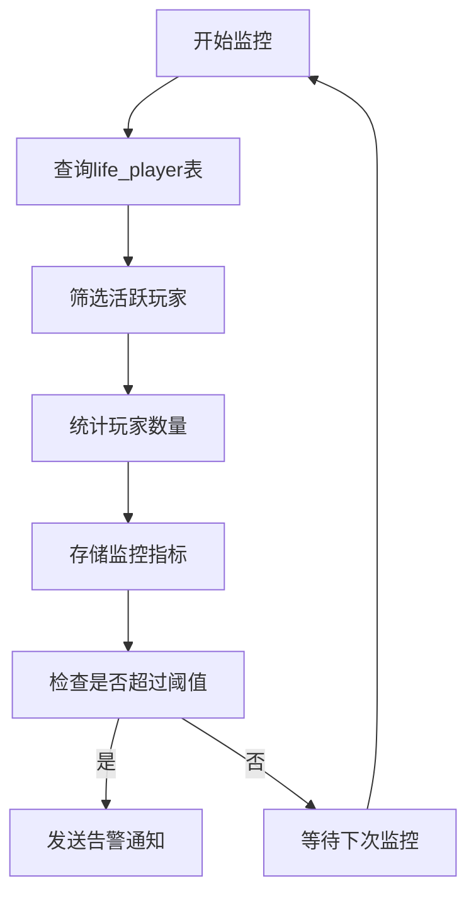
```mermaid
flowchart TD
Start["开始监控"] --> QueryDB["查询life_player表"]
QueryDB --> FilterActive["筛选活跃玩家"]
FilterActive --> CountPlayers["统计玩家数量"]
CountPlayers --> StoreMetric["存储监控指标"]
StoreMetric --> Alert["检查是否超过阈值"]
Alert --> |是| Notify["发送告警通知"]
Alert --> |否| Schedule["等待下次监控"]
Schedule --> Start
```

**图表来源**
- [Life_Deployment_Guide.md](file://Life_Deployment_Guide.md#L189)
- [LifePlayerMapper.java](file://Life/src/main/java/com/bot/life/dao/mapper/LifePlayerMapper.java)

**章节来源**
- [Life_Deployment_Guide.md](file://Life_Deployment_Guide.md#L168-L193)

### 图片生成响应时间监控

监控图片生成服务的响应时间，确保用户体验。

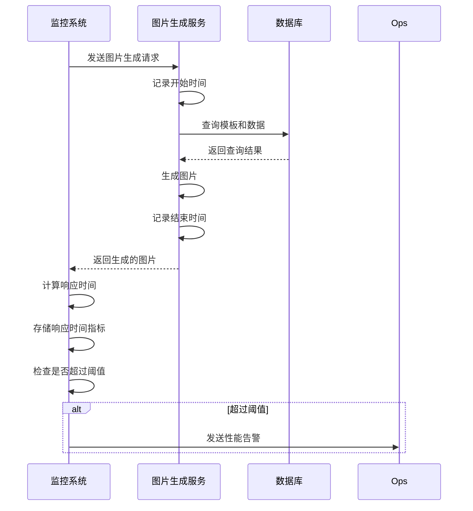
```mermaid
sequenceDiagram
participant Monitor as 监控系统
participant Service as 图片生成服务
participant DB as 数据库
Monitor->>Service : 发送图片生成请求
Service->>Service : 记录开始时间
Service->>DB : 查询模板和数据
DB-->>Service : 返回查询结果
Service->>Service : 生成图片
Service->>Service : 记录结束时间
Service-->>Monitor : 返回生成的图片
Monitor->>Monitor : 计算响应时间
Monitor->>Monitor : 存储响应时间指标
Monitor->>Monitor : 检查是否超过阈值
alt 超过阈值
Monitor->>Ops : 发送性能告警
end
```

**图表来源**
- [Life_Deployment_Guide.md](file://Life_Deployment_Guide.md#L190)
- [ImageGenerationServiceImpl.java](file://Life/src/main/java/com/bot/life/service/impl/ImageGenerationServiceImpl.java)

**章节来源**
- [Life_Deployment_Guide.md](file://Life_Deployment_Guide.md#L168-L193)

### 数据库连接池状态监控

监控数据库连接池的关键指标，预防连接耗尽问题。

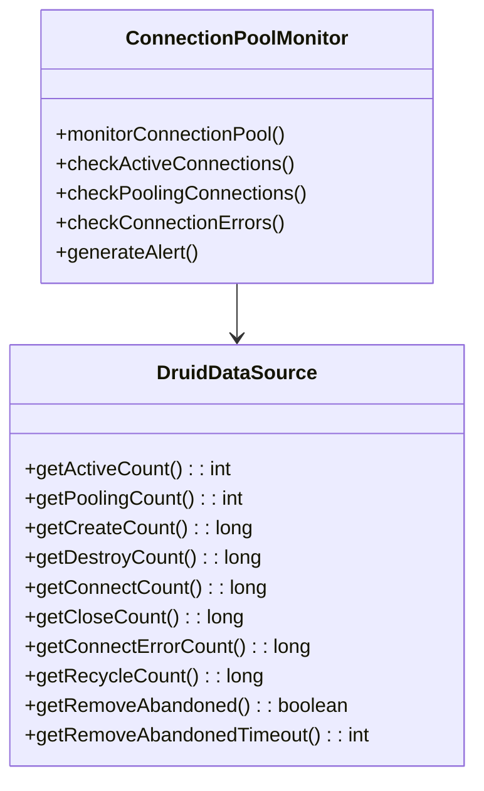
```mermaid
classDiagram
class DruidDataSource {
+getActiveCount() : int
+getPoolingCount() : int
+getCreateCount() : long
+getDestroyCount() : long
+getConnectCount() : long
+getCloseCount() : long
+getConnectErrorCount() : long
+getRecycleCount() : long
+getRemoveAbandoned() : boolean
+getRemoveAbandonedTimeout() : int
}
class ConnectionPoolMonitor {
+monitorConnectionPool()
+checkActiveConnections()
+checkPoolingConnections()
+checkConnectionErrors()
+generateAlert()
}
ConnectionPoolMonitor --> DruidDataSource
```

**图表来源**
- [Life_Deployment_Guide.md](file://Life_Deployment_Guide.md#L191)
- [application.properties](file://Boot/src/main/resources/application.properties#L52-L62)

**章节来源**
- [Life_Deployment_Guide.md](file://Life_Deployment_Guide.md#L168-L193)

### 内存使用情况监控

监控JVM内存使用情况，预防内存溢出问题。

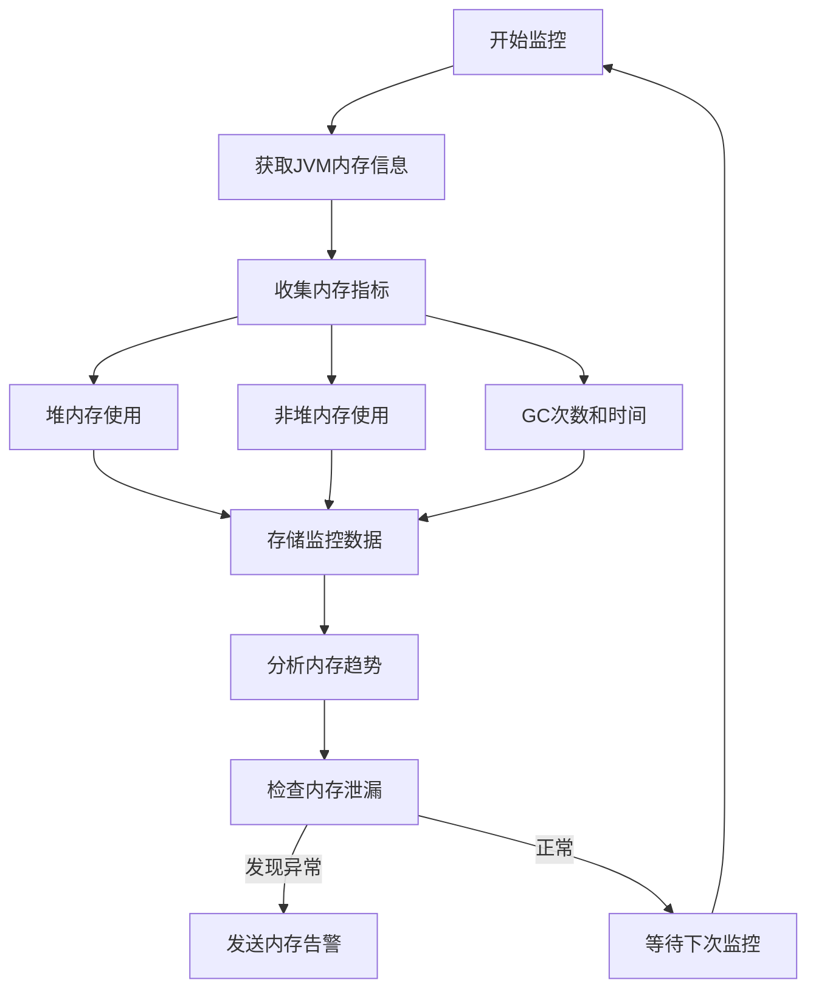
```mermaid
flowchart TD
Start["开始监控"] --> GetMemory["获取JVM内存信息"]
GetMemory --> CollectData["收集内存指标"]
CollectData --> Heap["堆内存使用"]
CollectData --> NonHeap["非堆内存使用"]
CollectData --> GC["GC次数和时间"]
Heap --> Store["存储监控数据"]
NonHeap --> Store
GC --> Store
Store --> Analyze["分析内存趋势"]
Analyze --> Alert["检查内存泄漏"]
Alert --> |发现异常| Notify["发送内存告警"]
Alert --> |正常| Schedule["等待下次监控"]
Schedule --> Start
```

**图表来源**
- [Life_Deployment_Guide.md](file://Life_Deployment_Guide.md#L192)
- [ThreadPoolManager.java](file://Common/src/main/java/com/bot/common/util/ThreadPoolManager.java)

**章节来源**
- [Life_Deployment_Guide.md](file://Life_Deployment_Guide.md#L168-L193)

## 监控配置建议

基于项目现状和监控需求，提出以下配置建议以优化监控效果。

### 日志级别配置

根据不同的环境配置适当的日志级别，平衡调试信息和性能开销。

```mermaid
table
| 环境 | logback.level | sql.level | 说明 |
|------|---------------|-----------|------|
| 开发环境 | DEBUG | DEBUG | 详细调试信息，便于开发调试 |
| 测试环境 | INFO | DEBUG | 适度的调试信息，关注SQL执行 |
| 生产环境 | INFO | INFO | 仅记录关键信息，减少I/O开销 |
```

**图表来源**
- [application.properties](file://Boot/src/main/resources/application.properties#L12)
- [application-dev.properties](file://Boot/src/main/resources/application-dev.properties#L2)
- [application-prod.properties](file://Boot/src/main/resources/application-prod.properties#L2)

**章节来源**
- [application.properties](file://Boot/src/main/resources/application.properties#L1-L70)
- [application-dev.properties](file://Boot/src/main/resources/application-dev.properties#L1-L59)
- [application-prod.properties](file://Boot/src/main/resources/application-prod.properties#L1-L92)

### 监控任务调度优化

调整定时任务的执行频率和调度策略，避免资源竞争。

```mermaid
gantt
title 定时任务调度时间线
dateFormat HH:mm
section 通知任务
通知任务 : 14:00, 2h
section 自动任务
自动任务 : 00:00, 30m
section 服务器监控
服务器监控 : 00:03, 3m
服务器监控 : 00:06, 3m
服务器监控 : 00:09, 3m
服务器监控 : 00:12, 3m
服务器监控 : 00:15, 3m
服务器监控 : 00:18, 3m
服务器监控 : 00:21, 3m
服务器监控 : 00:24, 3m
服务器监控 : 00:27, 3m
服务器监控 : 00:30, 3m
section 血量恢复
血量恢复 : 00:01, 1m
血量恢复 : 00:02, 1m
血量恢复 : 00:03, 1m
血量恢复 : 00:04, 1m
血量恢复 : 00:05, 1m
血量恢复 : 00:06, 1m
血量恢复 : 00:07, 1m
血量恢复 : 00:08, 1m
血量恢复 : 00:09, 1m
血量恢复 : 00:10, 1m
血量恢复 : 00:11, 1m
血量恢复 : 00:12, 1m
血量恢复 : 00:13, 1m
血量恢复 : 00:14, 1m
血量恢复 : 00:15, 1m
血量恢复 : 00:16, 1m
血量恢复 : 00:17, 1m
血量恢复 : 00:18, 1m
血量恢复 : 00:19, 1m
血量恢复 : 00:20, 1m
血量恢复 : 00:21, 1m
血量恢复 : 00:22, 1m
血量恢复 : 00:23, 1m
血量恢复 : 00:24, 1m
血量恢复 : 00:25, 1m
血量恢复 : 00:26, 1m
血量恢复 : 00:27, 1m
血量恢复 : 00:28, 1m
血量恢复 : 00:29, 1m
血量恢复 : 00:30, 1m
```

**图表来源**
- [NoticeTask.java](file://Base/src/main/java/com/bot/base/task/NoticeTask.java#L57)
- [AutoTask.java](file://Base/src/main/java/com/bot/base/task/AutoTask.java#L34)
- [OpenServerTask.java](file://Base/src/main/java/com/bot/base/task/OpenServerTask.java#L74)
- [HealthRecoveryTask.java](file://Life/src/main/java/com/bot/life/task/HealthRecoveryTask.java#L21)

**章节来源**
- [NoticeTask.java](file://Base/src/main/java/com/bot/base/task/NoticeTask.java#L27-L66)
- [AutoTask.java](file://Base/src/main/java/com/bot/base/task/AutoTask.java#L16-L45)
- [OpenServerTask.java](file://Base/src/main/java/com/bot/base/task/OpenServerTask.java#L24-L90)
- [HealthRecoveryTask.java](file://Life/src/main/java/com/bot/life/task/HealthRecoveryTask.java#L13-L31)

### 数据库连接池配置

优化数据库连接池参数，提高数据库访问性能。

```mermaid
table
| 配置项 | 当前值 | 建议值 | 说明 |
|--------|--------|--------|------|
| initial-size | 1 | 5 | 增加初始连接数，减少连接创建开销 |
| min-idle | 3 | 5 | 保持更多空闲连接，提高响应速度 |
| max-active | 60000 | 100 | 限制最大连接数，防止资源耗尽 |
| max-wait | 20 | 30000 | 增加等待时间，避免连接获取失败 |
| time-between-eviction-runs-millis | 60000 | 30000 | 更频繁地检查空闲连接 |
| min-evictable-idle-time-millis | 300000 | 60000 | 减少空闲连接的存活时间 |
```

**图表来源**
- [application.properties](file://Boot/src/main/resources/application.properties#L53-L58)
- [Life_Deployment_Guide.md](file://Life_Deployment_Guide.md#L156-L158)

**章节来源**
- [application.properties](file://Boot/src/main/resources/application.properties#L47-L62)
- [Life_Deployment_Guide.md](file://Life_Deployment_Guide.md#L153-L158)

## 运维建议

为确保系统稳定运行，提出以下运维建议。

### 监控告警设置

建立完善的监控告警机制，及时发现和解决性能问题。

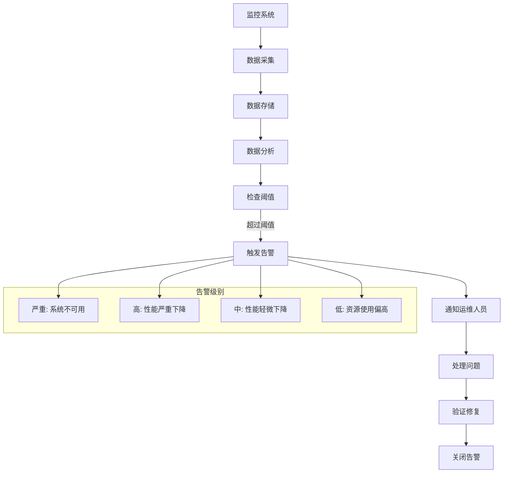
```mermaid
flowchart TD
Monitor["监控系统"] --> Collect["数据采集"]
Collect --> Store["数据存储"]
Store --> Analyze["数据分析"]
Analyze --> CheckThreshold["检查阈值"]
CheckThreshold --> |超过阈值| Alert["触发告警"]
Alert --> Notify["通知运维人员"]
Notify --> Handle["处理问题"]
Handle --> Verify["验证修复"]
Verify --> Close["关闭告警"]
subgraph "告警级别"
Critical["严重: 系统不可用"]
High["高: 性能严重下降"]
Medium["中: 性能轻微下降"]
Low["低: 资源使用偏高"]
end
Alert --> Critical
Alert --> High
Alert --> Medium
Alert --> Low
```

**图表来源**
- [Life_Deployment_Guide.md](file://Life_Deployment_Guide.md#L168-L193)

**章节来源**
- [Life_Deployment_Guide.md](file://Life_Deployment_Guide.md#L168-L234)

### 定期维护任务

执行定期维护任务，保持系统健康状态。

```mermaid
gantt
title 定期维护任务计划
dateFormat YYYY-MM-DD
section 每日任务
清理临时文件 : done, des1, 2023-01-01, 1d
备份关键数据 : done, des2, 2023-01-01, 1d
section 每周任务
分析性能日志 : active, des3, 2023-01-01, 1d
检查磁盘空间 : active, des4, 2023-01-01, 1d
section 每月任务
数据库优化 : 2023-01-01, 2d
安全漏洞扫描 : 2023-01-03, 2d
性能基准测试 : 2023-01-05, 2d
```

**图表来源**
- [Life_Deployment_Guide.md](file://Life_Deployment_Guide.md#L174-L184)

**章节来源**
- [Life_Deployment_Guide.md](file://Life_Deployment_Guide.md#L168-L234)

### 故障排查流程

建立标准化的故障排查流程，提高问题解决效率。

```mermaid
flowchart TD
Alert["收到告警"] --> CheckLogs["检查应用日志"]
CheckLogs --> CheckMetrics["检查监控指标"]
CheckMetrics --> IdentifyIssue["定位问题根源"]
IdentifyIssue --> PlanFix["制定修复方案"]
PlanFix --> ApplyFix["应用修复措施"]
ApplyFix --> VerifyFix["验证修复效果"]
VerifyFix --> |成功| Close["关闭问题"]
VerifyFix --> |失败| Reinvestigate["重新调查"]
Reinvestigate --> PlanFix
```

**图表来源**
- [Life_Deployment_Guide.md](file://Life_Deployment_Guide.md#L126-L143)

**章节来源**
- [Life_Deployment_Guide.md](file://Life_Deployment_Guide.md#L126-L234)