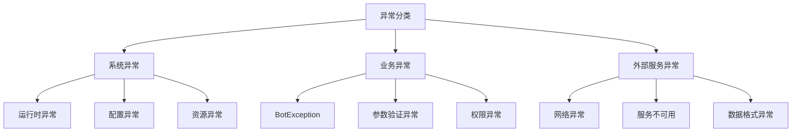
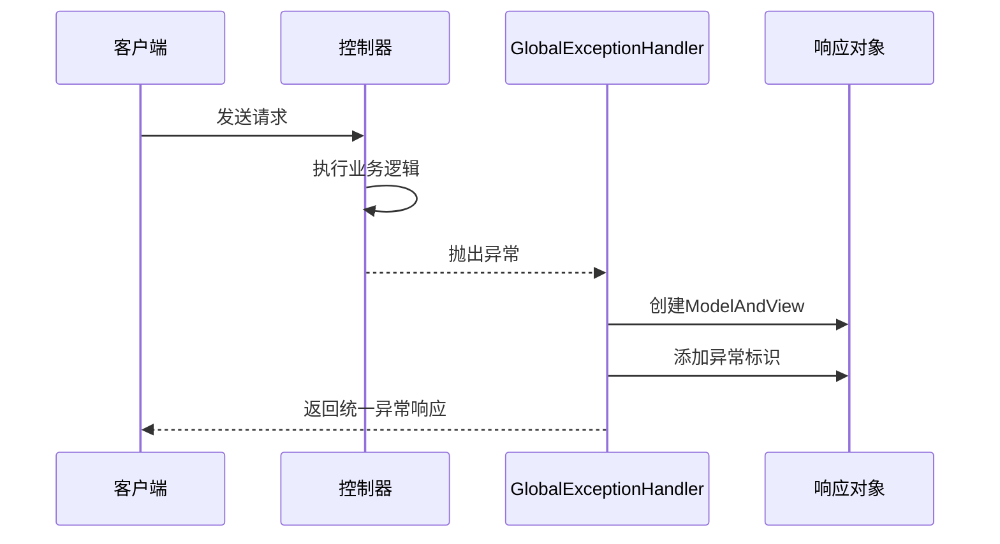
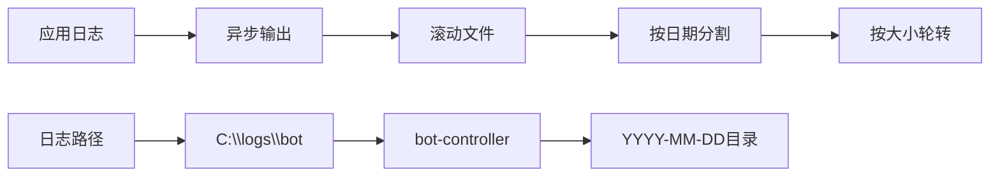
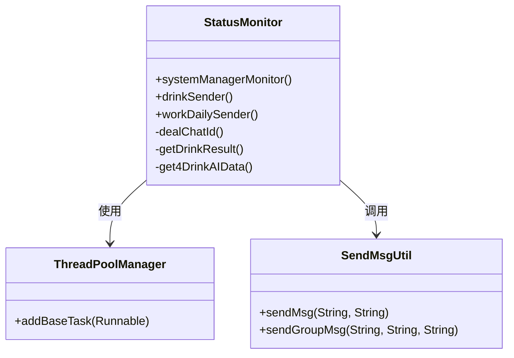
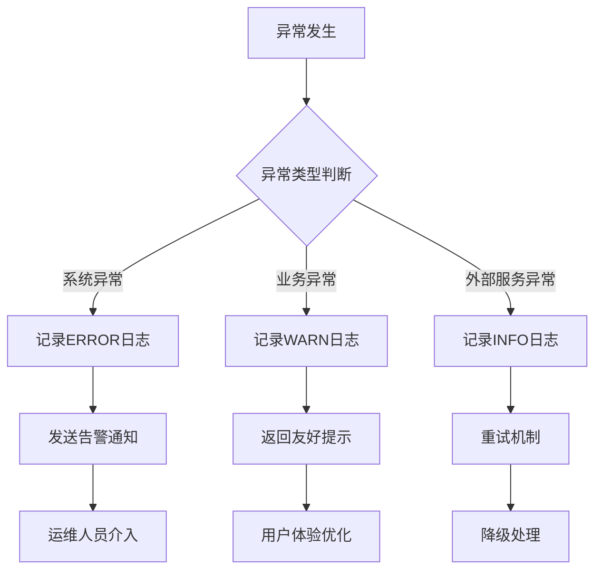
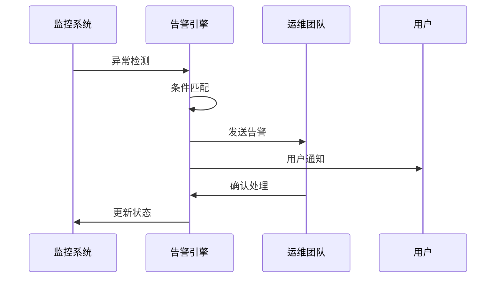
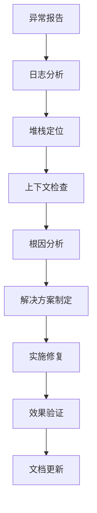

# Bot项目异常监控文档

<cite>
**本文档引用的文件**
- [GlobalExceptionHandler.java](file://Boot/src/main/java/com/bot/boot/aspect/GlobalExceptionHandler.java)
- [BotException.java](file://Common/src/main/java/com/bot/common/exception/BotException.java)
- [StatusMonitor.java](file://Base/src/main/java/com/bot/base/service/StatusMonitor.java)
- [logback-spring.xml](file://Boot/src/main/resources/logback-spring.xml)
- [application.properties](file://Boot/src/main/resources/application.properties)
- [TopTokenServiceImpl.java](file://Base/src/main/java/com/bot/base/service/impl/TopTokenServiceImpl.java)
- [浮生卷开发说明.md](file://浮生卷开发说明.md)
</cite>

## 目录
1. [概述](#概述)
2. [异常分类体系](#异常分类体系)
3. [全局异常处理机制](#全局异常处理机制)
4. [日志记录规范](#日志记录规范)
5. [异常监控架构](#异常监控架构)
6. [告警触发条件](#告警触发条件)
7. [异常堆栈追踪方法](#异常堆栈追踪方法)
8. [故障排查指南](#故障排查指南)
9. [最佳实践建议](#最佳实践建议)

## 概述

Bot项目采用多层次的异常监控体系，通过GlobalExceptionHandler实现全局异常捕获，结合StatusMonitor进行系统状态监控，以及完善的日志记录机制，确保系统的稳定性和可维护性。本文档详细描述了异常处理流程、监控策略和故障定位方法。

## 异常分类体系

### 系统异常
系统异常是指影响整个系统正常运行的异常，包括：
- **运行时异常**：如NullPointerException、ArrayIndexOutOfBoundsException等
- **配置异常**：数据库连接异常、配置文件缺失等
- **资源异常**：内存溢出、文件系统异常等

### 业务异常（BotException）
业务异常是项目自定义的业务逻辑异常，继承自RuntimeException：
- **参数验证异常**：输入参数不符合业务规则
- **权限异常**：用户权限不足或认证失败
- **业务逻辑异常**：业务流程执行失败

### 外部服务调用异常
外部服务调用异常涉及与第三方服务的交互问题：
- **网络异常**：HTTP请求超时、连接失败
- **服务不可用**：第三方服务宕机或维护
- **数据格式异常**：返回数据格式不符合预期



**图表来源**
- [BotException.java](file://Common/src/main/java/com/bot/common/exception/BotException.java#L7-L19)
- [TopTokenServiceImpl.java](file://Base/src/main/java/com/bot/base/service/impl/TopTokenServiceImpl.java#L41-L99)

**章节来源**
- [BotException.java](file://Common/src/main/java/com/bot/common/exception/BotException.java#L1-L20)
- [TopTokenServiceImpl.java](file://Base/src/main/java/com/bot/base/service/impl/TopTokenServiceImpl.java#L35-L99)

## 全局异常处理机制

### GlobalExceptionHandler核心功能

GlobalExceptionHandler作为Spring MVC的全局异常处理器，实现了统一的异常响应机制：



**图表来源**
- [GlobalExceptionHandler.java](file://Boot/src/main/java/com/bot/boot/aspect/GlobalExceptionHandler.java#L21-L24)

### 异常处理流程

1. **异常捕获**：GlobalExceptionHandler自动捕获所有未处理的异常
2. **响应构建**：创建ModelAndView对象并添加异常标识
3. **统一返回**：向客户端返回标准化的异常响应

### 异常响应结构

| 字段 | 类型 | 描述 | 示例值 |
|------|------|------|--------|
| EXCEPTION | String | 异常标识 | "出现未知异常，请及时联系我主人" |

**章节来源**
- [GlobalExceptionHandler.java](file://Boot/src/main/java/com/bot/boot/aspect/GlobalExceptionHandler.java#L1-L27)

## 日志记录规范

### 日志级别配置

系统采用分级日志记录策略，根据重要程度设置不同日志级别：

| 级别 | 用途 | 配置示例 |
|------|------|----------|
| ERROR | 记录严重错误和异常 | `logback.level=ERROR` |
| WARN | 记录警告信息 | 默认配置 |
| INFO | 记录一般信息 | `logback.level=INFO` |
| DEBUG | 调试信息 | `logback.level=DEBUG` |
| TRACE | 最详细的跟踪信息 | `logback.level=TRACE` |

### 日志格式规范

日志采用统一的格式模板：
```
%d{HH:mm:ss.SSS} [%thread] %-5level %logger-%line -- %msg --%n
```

### 日志文件管理



**图表来源**
- [logback-spring.xml](file://Boot/src/main/resources/logback-spring.xml#L27-L33)

### 关键日志字段说明

| 字段 | 含义 | 示例 |
|------|------|------|
| 时间戳 | 日志产生时间 | `09:46:19.849` |
| 线程名 | 执行线程名称 | `[http-nio-9091-exec-4]` |
| 日志级别 | 日志严重程度 | `ERROR` |
| 类名行号 | 异常发生位置 | `com.bot.base.service.impl.DistributorServiceImpl-120` |
| 异常信息 | 具体异常描述 | `目标[wxid_gt9s4k14zz7l22],响应异常` |

**章节来源**
- [logback-spring.xml](file://Boot/src/main/resources/logback-spring.xml#L1-L59)
- [application.properties](file://Boot/src/main/resources/application.properties#L12-L16)

## 异常监控架构

### StatusMonitor监控体系

StatusMonitor负责系统状态监控和异常检测：



**图表来源**
- [StatusMonitor.java](file://Base/src/main/java/com/bot/base/service/StatusMonitor.java#L47-L91)

### 监控任务类型

| 任务类型 | 执行频率 | 监控内容 | 异常处理方式 |
|----------|----------|----------|--------------|
| 管理模式监控 | 5分钟 | 用户临时状态、会话超时 | 记录日志，发送通知 |
| 喝水记录推送 | 实时 | 用户饮水统计、AI对话异常 | 忽略单个用户异常 |
| 打工日报发送 | 每日定时 | 工作日历推送状态 | 记录失败原因 |
| 英语学习推送 | 每日定时 | 英语学习开关状态 | 无异常处理 |

### 异常处理策略



**章节来源**
- [StatusMonitor.java](file://Base/src/main/java/com/bot/base/service/StatusMonitor.java#L67-L91)

## 告警触发条件

### 系统级告警

当系统出现严重异常时触发告警：

| 触发条件 | 告警级别 | 处理方式 |
|----------|----------|----------|
| 管理模式状态监控异常 | 严重 | 立即通知运维团队 |
| 数据库连接失败 | 严重 | 自动重启连接池 |
| 内存使用率超过90% | 警告 | 清理缓存，扩容提醒 |

### 业务级告警

针对业务异常设置告警阈值：

| 业务场景 | 触发条件 | 告警方式 |
|----------|----------|----------|
| 外部服务调用失败 | 连续3次失败 | 邮件+短信通知 |
| 用户操作异常 | 单次失败 | 系统内消息通知 |
| 数据处理异常 | 处理失败率>5% | 自动修复+人工确认 |

### 告警通知机制



## 异常堆栈追踪方法

### 堆栈信息获取

系统通过多种方式获取异常堆栈信息：

1. **标准异常捕获**：使用try-catch块捕获异常并记录堆栈
2. **日志框架记录**：SLF4J自动记录异常堆栈
3. **调试工具支持**：提供详细的调用链信息

### 堆栈分析示例

以战斗系统异常为例：

```
09:46:19.849 [http-nio-9091-exec-4] ERROR com.bot.base.service.impl.DistributorServiceImpl-120 -- 目标[wxid_gt9s4k14zz7l22],响应异常 --
java.lang.NullPointerException: null
    at com.bot.life.service.impl.LifeHandlerImpl.performMonsterActionWithCooldown(LifeHandlerImpl.java:1284)
    at com.bot.life.service.impl.LifeHandlerImpl.handleAttack(LifeHandlerImpl.java:1028)
    at com.bot.life.service.impl.LifeHandlerImpl.handleBattleMode(LifeHandlerImpl.java:949)
    at com.bot.life.service.impl.LifeHandlerImpl.play(LifeHandlerImpl.java:141)
    at com.bot.base.service.impl.DistributorServiceImpl.req2Resp(DistributorServiceImpl.java:197)
    at com.bot.base.service.impl.DistributorServiceImpl.doDistributeWithString(DistributorServiceImpl.java:112)
    at com.bot.boot.controller.newInstructDistributeController.weChatDeal(newInstructDistributeController.java:93)
```

### 堆栈分析步骤

| 分析阶段 | 关注点 | 处理方法 |
|----------|--------|----------|
| 异常定位 | 最终异常类和方法 | 确定问题模块 |
| 调用链分析 | 方法调用顺序 | 追踪问题传播路径 |
| 参数检查 | 方法入参状态 | 验证输入数据有效性 |
| 上下文分析 | 系统状态信息 | 检查相关配置和资源 |

**章节来源**
- [浮生卷开发说明.md](file://浮生卷开发说明.md#L244-L268)

## 故障排查指南

### 常见异常类型及解决方案

#### 1. NullPointerException异常

**症状表现**：
- 空指针访问导致程序崩溃
- 外部服务返回null数据

**排查步骤**：
1. 检查异常堆栈中的具体方法行号
2. 验证相关对象是否正确初始化
3. 检查外部服务返回数据的完整性

**解决方案**：
```java
// 安全的空值检查
if (object != null && object.method() != null) {
    // 执行业务逻辑
}
```

#### 2. 外部服务调用异常

**症状表现**：
- HTTP请求超时
- 服务不可用
- 数据格式不匹配

**排查步骤**：
1. 检查网络连接状态
2. 验证服务地址和端口
3. 分析返回数据格式

**解决方案**：
```java
try {
    // 服务调用
} catch (Exception e) {
    // 降级处理
    log.warn("外部服务调用失败，使用备用方案");
    // 执行备用逻辑
}
```

#### 3. 数据库连接异常

**症状表现**：
- 连接池耗尽
- SQL执行超时
- 数据库锁定

**排查步骤**：
1. 检查连接池配置
2. 分析慢查询日志
3. 监控数据库性能指标

### 故障定位流程



### 性能监控指标

| 指标类别 | 关键指标 | 正常范围 | 告警阈值 |
|----------|----------|----------|----------|
| 响应时间 | 平均响应时间 | < 200ms | > 500ms |
| 错误率 | 异常请求比例 | < 1% | > 5% |
| 资源使用 | CPU使用率 | < 70% | > 85% |
| 连接数 | 数据库连接数 | < 80% | > 90% |

## 最佳实践建议

### 异常处理最佳实践

1. **防御性编程**
   - 对所有外部输入进行验证
   - 使用空值检查避免NullPointerException
   - 设置合理的超时时间

2. **异常分类处理**
   - 区分可恢复和不可恢复异常
   - 为不同类型异常设置不同的处理策略
   - 提供有意义的错误信息

3. **日志记录规范**
   - 记录关键业务操作的日志
   - 包含足够的上下文信息
   - 避免敏感信息泄露

### 监控体系建设建议

1. **多层监控**
   - 应用层：异常监控、性能指标
   - 系统层：资源使用、网络状态
   - 业务层：业务指标、用户体验

2. **智能告警**
   - 设置合理的告警阈值
   - 实现告警去重和聚合
   - 提供告警升级机制

3. **持续改进**
   - 定期回顾异常统计
   - 优化监控指标
   - 完善应急预案

### 团队协作建议

1. **知识共享**
   - 建立异常处理知识库
   - 定期分享故障案例
   - 组织技术培训

2. **流程规范**
   - 制定标准化的异常处理流程
   - 建立故障响应机制
   - 完善文档和注释

3. **工具支持**
   - 使用专业的监控工具
   - 集成自动化运维平台
   - 建立完善的测试环境

通过以上异常监控体系的建设，Bot项目能够实现全面的异常感知、快速的问题定位和有效的故障恢复，为系统的稳定运行提供坚实保障。