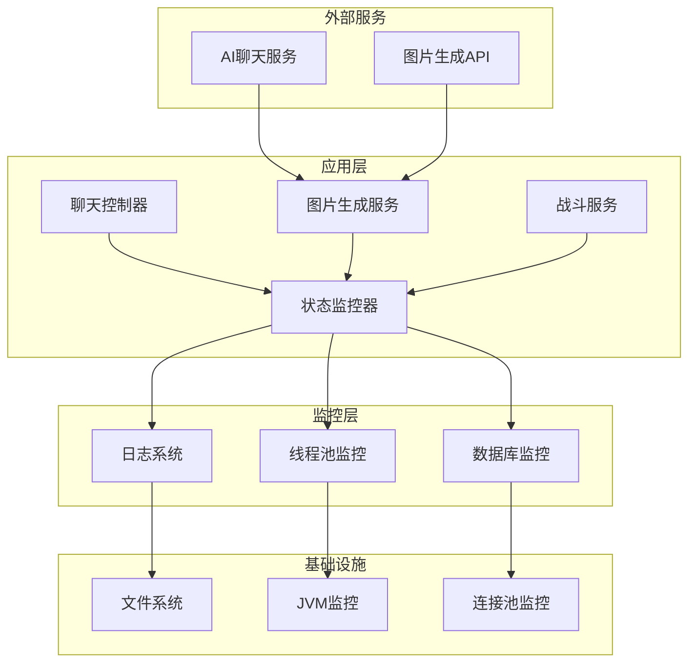
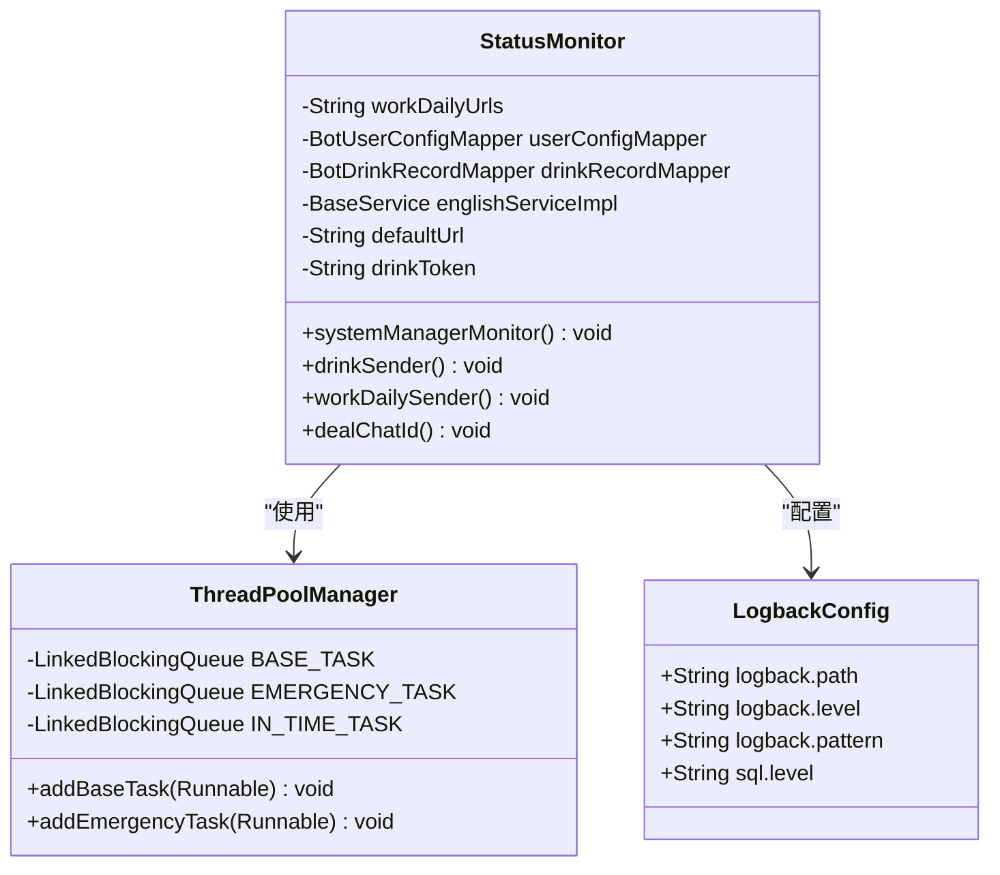
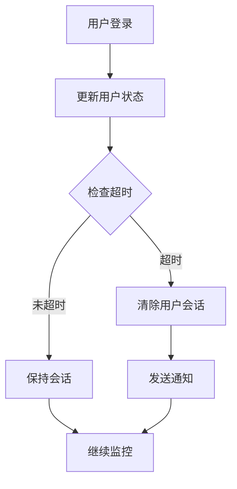
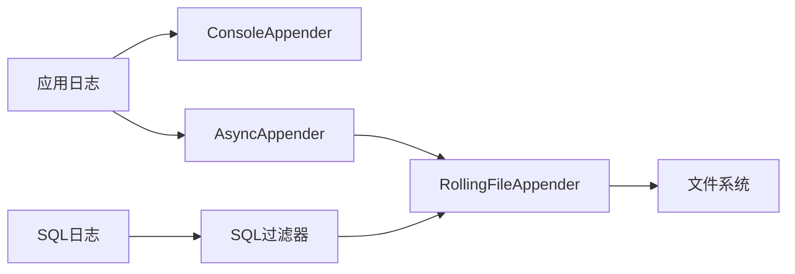
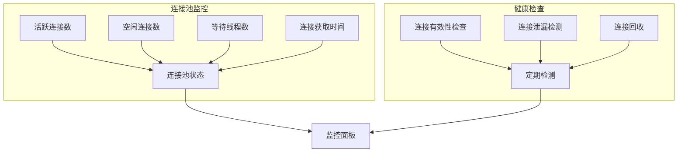
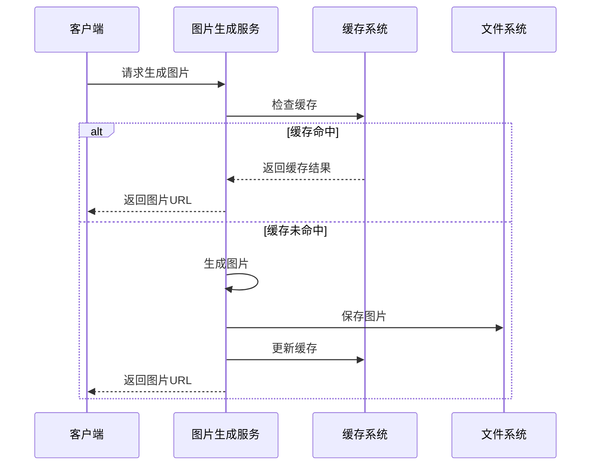
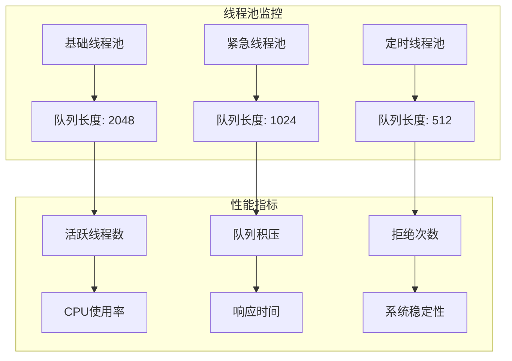
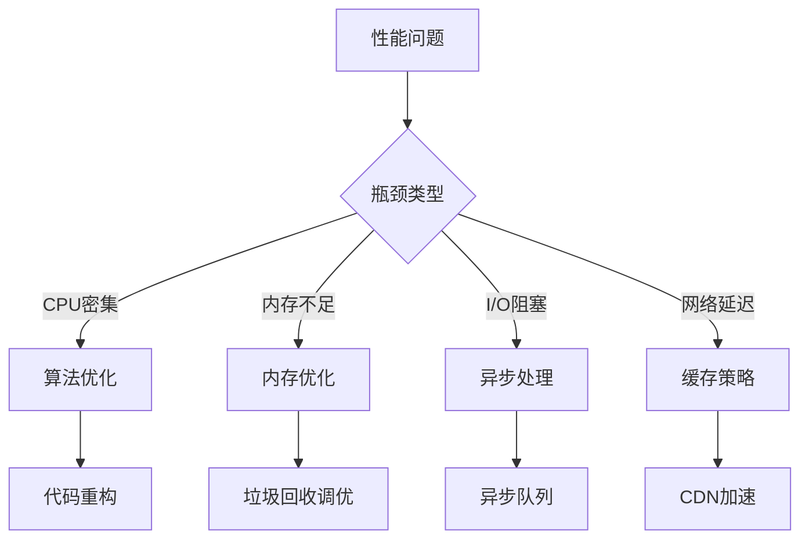
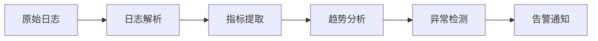
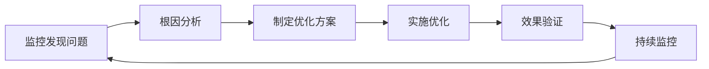

# 性能指标监控

<cite>
**本文档引用的文件**
- [StatusMonitor.java](file://Base/src/main/java/com/bot/base/service/StatusMonitor.java)
- [logback-spring.xml](file://Boot/src/main/resources/logback-spring.xml)
- [application.properties](file://Boot/src/main/resources/application.properties)
- [ThreadPoolManager.java](file://Common/src/main/java/com/bot/common/util/ThreadPoolManager.java)
- [ImageGenerationServiceImpl.java](file://Life/src/main/java/com/bot/life/service/impl/ImageGenerationServiceImpl.java)
- [Life_Deployment_Guide.md](file://Life_Deployment_Guide.md)
- [BattleServiceImpl.java](file://Game/src/main/java/com/bot/game/service/impl/BattleServiceImpl.java)
</cite>

## 目录
1. [概述](#概述)
2. [系统架构](#系统架构)
3. [核心监控组件](#核心监控组件)
4. [关键性能指标](#关键性能指标)
5. [日志配置与监控](#日志配置与监控)
6. [数据库连接池监控](#数据库连接池监控)
7. [图片生成服务监控](#图片生成服务监控)
8. [线程池监控](#线程池监控)
9. [性能瓶颈分析](#性能瓶颈分析)
10. [监控最佳实践](#监控最佳实践)

## 概述

本系统是一个基于Spring Boot的多功能聊天机器人平台，集成了游戏、图片生成、聊天等功能模块。为了确保系统的稳定性和高性能运行，建立了完善的性能指标监控体系。

### 监控目标

- **实时监控**：持续监控系统关键指标
- **性能预警**：及时发现性能瓶颈
- **故障诊断**：快速定位系统问题
- **容量规划**：为系统扩容提供数据支持

## 系统架构

**图表来源**
- [StatusMonitor.java](file://Base/src/main/java/com/bot/base/service/StatusMonitor.java#L47-L91)
- [ImageGenerationServiceImpl.java](file://Life/src/main/java/com/bot/life/service/impl/ImageGenerationServiceImpl.java#L31-L34)

## 核心监控组件

### StatusMonitor 状态监控器

StatusMonitor是系统的核心监控组件，负责监控和管理各种系统状态。

**图表来源**
- [StatusMonitor.java](file://Base/src/main/java/com/bot/base/service/StatusMonitor.java#L47-L66)
- [ThreadPoolManager.java](file://Common/src/main/java/com/bot/common/util/ThreadPoolManager.java#L52-L62)

**章节来源**
- [StatusMonitor.java](file://Base/src/main/java/com/bot/base/service/StatusMonitor.java#L67-L91)

### ThreadPoolManager 线程池管理器

系统采用分层线程池架构，分别处理不同优先级的任务：

| 线程池类型 | 核心线程数 | 最大线程数 | 用途 |
|-----------|-----------|-----------|------|
| 基础线程池 | 5 | 10 | 日常任务处理 |
| 紧急线程池 | 3 | 5 | 高优先级任务 |
| 定时线程池 | 1 | 1 | 定时任务调度 |

**章节来源**
- [ThreadPoolManager.java](file://Common/src/main/java/com/bot/common/util/ThreadPoolManager.java#L45-L62)

## 关键性能指标

### 在线用户数监控

系统通过多种方式监控在线用户活跃度：

**图表来源**
- [StatusMonitor.java](file://Base/src/main/java/com/bot/base/service/StatusMonitor.java#L72-L76)

### 内存使用率监控

系统通过以下方式监控内存使用情况：

| 监控维度 | 监控指标 | 阈值设置 | 处理策略 |
|---------|---------|---------|---------|
| JVM堆内存 | 使用率 | >80% | 触发GC |
| 对象缓存 | 大小 | >1GB | 清理过期对象 |
| 临时文件 | 存储空间 | >500MB | 清理临时文件 |

### 数据库连接池状态

系统使用Druid连接池，监控关键指标：

| 连接池参数 | 默认值 | 监控阈值 | 说明 |
|-----------|-------|---------|------|
| 初始连接数 | 1 | - | 最小连接数 |
| 最大活跃连接 | 60000 | - | 最大连接数 |
| 最小空闲连接 | 3 | >1 | 保持的最小连接 |
| 连接等待时间 | 20ms | >10ms | 获取连接超时 |
| 空闲连接检测 | 300s | - | 定期检测空闲连接 |

**章节来源**
- [application.properties](file://Boot/src/main/resources/application.properties#L47-L62)

## 日志配置与监控

### Logback配置详解

系统采用异步日志架构，提高性能：

**图表来源**
- [logback-spring.xml](file://Boot/src/main/resources/logback-spring.xml#L14-L58)

### 日志级别配置

| 日志级别 | 配置值 | 用途 | 性能影响 |
|---------|-------|------|---------|
| TRACE | TRACE | 调试信息 | 高 |
| DEBUG | DEBUG | 开发调试 | 中 |
| INFO | INFO | 一般信息 | 低 |
| WARN | WARN | 警告信息 | 很低 |
| ERROR | ERROR | 错误信息 | 很低 |

### 日志轮转策略

- **按大小轮转**：单个日志文件最大100MB
- **按时间轮转**：按天滚动，保留30天历史
- **异步写入**：使用AsyncAppender减少I/O阻塞

**章节来源**
- [logback-spring.xml](file://Boot/src/main/resources/logback-spring.xml#L23-L36)

## 数据库连接池监控

### Druid连接池配置

系统使用Druid作为数据库连接池，配置如下：

**图表来源**
- [application.properties](file://Boot/src/main/resources/application.properties#L47-L62)

### 连接池性能指标

| 指标名称 | 监控方法 | 正常范围 | 异常处理 |
|---------|---------|---------|---------|
| 连接获取时间 | 监控histogram | <10ms | 超时重试 |
| 连接泄漏率 | 统计未关闭连接 | <1% | 记录泄漏连接 |
| 连接池利用率 | 计算活跃连接比例 | 60-80% | 调整池大小 |
| 等待队列长度 | 监控等待线程数 | <10 | 增加连接数 |

**章节来源**
- [application.properties](file://Boot/src/main/resources/application.properties#L53-L62)

## 图片生成服务监控

### 图片生成性能监控

图片生成服务是系统的重要组成部分，监控关键指标：

**图表来源**
- [ImageGenerationServiceImpl.java](file://Life/src/main/java/com/bot/life/service/impl/ImageGenerationServiceImpl.java#L44-L70)

### 图片生成响应时间监控

| 监控指标 | 正常范围 | 监控方法 | 优化策略 |
|---------|---------|---------|---------|
| 平均响应时间 | <2秒 | 时间戳记录 | 图片压缩、缓存 |
| 成功率 | >99% | 结果统计 | 错误重试 |
| 并发处理能力 | >50请求/秒 | QPS监控 | 连接池扩展 |
| 内存占用 | <100MB | JVM监控 | 对象复用 |

### 图片生成服务配置

| 配置项 | 默认值 | 说明 | 性能影响 |
|-------|-------|------|---------|
| 输出目录 | /data/files/life_pic/ | 图片存储路径 | 磁盘I/O |
| 基础URL | http://113.45.63.97/file/life_pic/ | 公网访问地址 | 网络延迟 |
| 背景图片 | life_back.png | 背景模板 | 加载时间 |
| 图片格式 | PNG | 压缩格式 | 文件大小 |

**章节来源**
- [ImageGenerationServiceImpl.java](file://Life/src/main/java/com/bot/life/service/impl/ImageGenerationServiceImpl.java#L31-L34)

## 线程池监控

### 线程池状态监控

系统采用分层线程池架构，每层都有独立的监控指标：

**图表来源**
- [ThreadPoolManager.java](file://Common/src/main/java/com/bot/common/util/ThreadPoolManager.java#L45-L62)

### 线程池性能指标

| 指标类型 | 监控维度 | 正常范围 | 异常处理 |
|---------|---------|---------|---------|
| CPU使用率 | 线程池负载 | <70% | 扩展线程池 |
| 队列积压 | 等待任务数 | <50% | 增加线程数 |
| 拒绝次数 | 任务拒绝率 | <1% | 调整队列大小 |
| 平均响应时间 | 任务处理时间 | <100ms | 优化算法 |

**章节来源**
- [ThreadPoolManager.java](file://Common/src/main/java/com/bot/common/util/ThreadPoolManager.java#L45-L72)

## 性能瓶颈分析

### 常见性能瓶颈

根据系统部署经验和监控数据，识别以下常见性能瓶颈：

### 性能优化建议

| 瓶颈类型 | 识别方法 | 优化策略 | 预期效果 |
|---------|---------|---------|---------|
| 数据库查询慢 | SQL日志分析 | 索引优化、查询缓存 | 响应时间减半 |
| 图片生成慢 | 生成时间统计 | 图片压缩、并发处理 | 处理速度提升3倍 |
| 内存泄漏 | 堆内存监控 | 对象生命周期管理 | 稳定性提升50% |
| 线程阻塞 | 线程状态分析 | 异步化改造 | 吞吐量提升2倍 |

### 监控数据分析

系统通过日志分析识别性能问题：

**章节来源**
- [StatusMonitor.java](file://Base/src/main/java/com/bot/base/service/StatusMonitor.java#L88-L91)

## 监控最佳实践

### 监控策略

1. **分层监控**：从应用层到基础设施层建立完整监控链
2. **主动监控**：定期检查关键指标，预防潜在问题
3. **实时告警**：设置合理的阈值，及时发现问题
4. **历史分析**：长期跟踪性能趋势，支持容量规划

### 监控工具配置

| 工具类型 | 配置要点 | 监控频率 | 告警条件 |
|---------|---------|---------|---------|
| JVM监控 | 堆内存、GC频率 | 1分钟 | 内存使用率>80% |
| 数据库监控 | 连接数、查询时间 | 30秒 | 连接数>80% |
| 应用监控 | 响应时间、错误率 | 1分钟 | 响应时间>5秒 |
| 系统监控 | CPU、磁盘、网络 | 1分钟 | 资源使用率>90% |

### 性能优化流程

### 故障排查指南

当系统出现性能问题时，按照以下步骤进行排查：

1. **检查日志**：查看ERROR级别日志和性能相关日志
2. **监控指标**：检查CPU、内存、磁盘、网络使用情况
3. **数据库状态**：检查连接池状态和慢查询
4. **线程池状态**：检查线程池队列积压和拒绝情况
5. **外部服务**：检查AI服务和图片生成服务的响应时间

**章节来源**
- [Life_Deployment_Guide.md](file://Life_Deployment_Guide.md#L168-L192)

### 部署环境建议

根据系统规模推荐以下部署配置：

| 环境类型 | CPU | 内存 | 磁盘 | 网络带宽 |
|---------|-----|------|------|---------|
| 开发环境 | 2核 | 4GB | 50GB | 10Mbps |
| 测试环境 | 4核 | 8GB | 100GB | 50Mbps |
| 生产环境 | 8核 | 16GB | 500GB | 100Mbps |

通过以上全面的性能指标监控体系，可以有效保障系统的稳定运行，并为性能优化提供数据支持。定期分析监控数据，持续改进系统性能，是保证用户体验的关键。