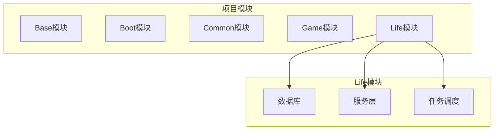
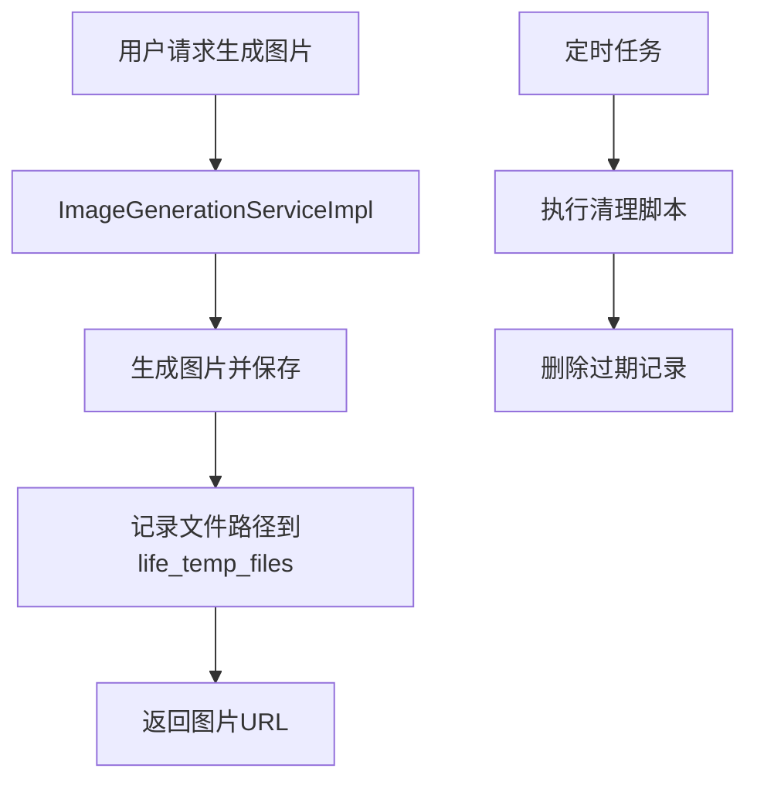
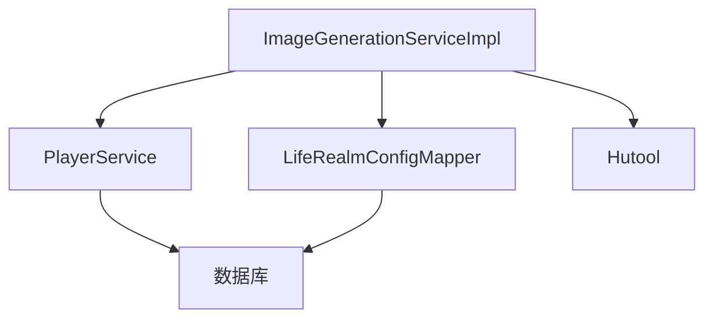

# 临时文件清理

<cite>
**本文档引用的文件**  
- [Life_Database_Init.sql](file://Life_Database_Init.sql)
- [Life_Deployment_Guide.md](file://Life_Deployment_Guide.md)
- [ImageGenerationServiceImpl.java](file://Life/src/main/java/com/bot/life/service/impl/ImageGenerationServiceImpl.java)
</cite>

## 目录
1. [引言](#引言)
2. [项目结构](#项目结构)
3. [核心组件](#核心组件)
4. [架构概述](#架构概述)
5. [详细组件分析](#详细组件分析)
6. [依赖分析](#依赖分析)
7. [性能考虑](#性能考虑)
8. [故障排除指南](#故障排除指南)
9. [结论](#结论)

## 引言
本文档旨在为Bot项目中的临时文件清理提供全面的指导。基于`Life_Deployment_Guide.md`中的维护建议和`Life_Database_Init.sql`中定义的`life_temp_files`表结构，文档将详细说明如何清理过期的临时图片文件记录。内容涵盖清理频率、自动化脚本配置以及清理操作的风险控制，帮助运维团队保持数据库的整洁和高效运行。

## 项目结构
Bot项目是一个基于Java的Spring Boot应用，包含多个模块，其中Life模块负责处理修仙类游戏逻辑。项目结构清晰，分为Base、Boot、Common、Game和Life等主要模块。Life模块专注于游戏的核心功能，包括角色管理、战斗系统、境界突破等。特别地，`life_temp_files`表用于存储生成的临时图片文件记录，这些文件在一定时间后需要被清理以避免占用过多存储空间。



**图表来源**  
- [Life_Database_Init.sql](file://Life_Database_Init.sql#L635-L642)

**本节来源**  
- [Life_Database_Init.sql](file://Life_Database_Init.sql#L635-L642)
- [Life_Deployment_Guide.md](file://Life_Deployment_Guide.md#L175-L176)

## 核心组件
`life_temp_files`表是临时文件管理的核心，其结构包括`id`、`file_path`、`create_time`和`expire_time`字段。`expire_time`字段默认设置为创建时间后的一天，确保文件在过期后可以被安全删除。`ImageGenerationServiceImpl`类负责生成图片并将其路径记录到该表中。

**本节来源**  
- [Life_Database_Init.sql](file://Life_Database_Init.sql#L635-L642)
- [ImageGenerationServiceImpl.java](file://Life/src/main/java/com/bot/life/service/impl/ImageGenerationServiceImpl.java#L31-L33)

## 架构概述
Life模块的架构设计考虑了高可用性和可维护性。图片生成服务通过`ImageGenerationServiceImpl`实现，生成的图片存储在指定目录，并将文件路径记录到`life_temp_files`表中。定期清理任务通过SQL脚本执行，确保过期文件记录被及时删除。



**图表来源**  
- [ImageGenerationServiceImpl.java](file://Life/src/main/java/com/bot/life/service/impl/ImageGenerationServiceImpl.java#L31-L33)
- [Life_Deployment_Guide.md](file://Life_Deployment_Guide.md#L175-L176)

## 详细组件分析
### 临时文件表分析
`life_temp_files`表的设计简洁高效，仅包含必要的字段。`file_path`字段存储文件的完整路径，`create_time`和`expire_time`用于跟踪文件的生命周期。通过`expire_time`字段，可以轻松识别并删除过期的记录。

#### SQL脚本示例
```sql
DELETE FROM life_temp_files WHERE expire_time < NOW();
```

**图表来源**  
- [Life_Database_Init.sql](file://Life_Database_Init.sql#L635-L642)

**本节来源**  
- [Life_Database_Init.sql](file://Life_Database_Init.sql#L635-L642)
- [Life_Deployment_Guide.md](file://Life_Deployment_Guide.md#L175-L176)

## 依赖分析
Life模块依赖于MySQL数据库和Spring Boot框架。`ImageGenerationServiceImpl`类依赖于`PlayerService`和`LifeRealmConfigMapper`来获取玩家信息和境界配置。此外，项目还使用了Hutool工具库来简化文件操作和HTTP请求。



**图表来源**  
- [ImageGenerationServiceImpl.java](file://Life/src/main/java/com/bot/life/service/impl/ImageGenerationServiceImpl.java#L25-L29)
- [Life_Database_Init.sql](file://Life_Database_Init.sql#L635-L642)

**本节来源**  
- [ImageGenerationServiceImpl.java](file://Life/src/main/java/com/bot/life/service/impl/ImageGenerationServiceImpl.java#L25-L29)
- [Life_Database_Init.sql](file://Life_Database_Init.sql#L635-L642)

## 性能考虑
为了确保系统的高性能，建议定期执行清理任务。可以将清理脚本配置为每日凌晨执行，以减少对系统性能的影响。此外，可以通过增加索引优化查询性能，例如在`expire_time`字段上创建索引。

## 故障排除指南
### 常见问题
1. **清理脚本未执行**
   - 检查定时任务是否正确配置
   - 确认数据库连接正常
2. **文件未被删除**
   - 检查`expire_time`字段是否正确设置
   - 确认文件路径是否存在

**本节来源**  
- [Life_Deployment_Guide.md](file://Life_Deployment_Guide.md#L175-L176)

## 结论
通过定期执行清理脚本，可以有效管理`life_temp_files`表中的过期记录，保持数据库的整洁和高效运行。建议将清理任务配置为每日自动执行，并监控其执行情况，确保系统稳定。