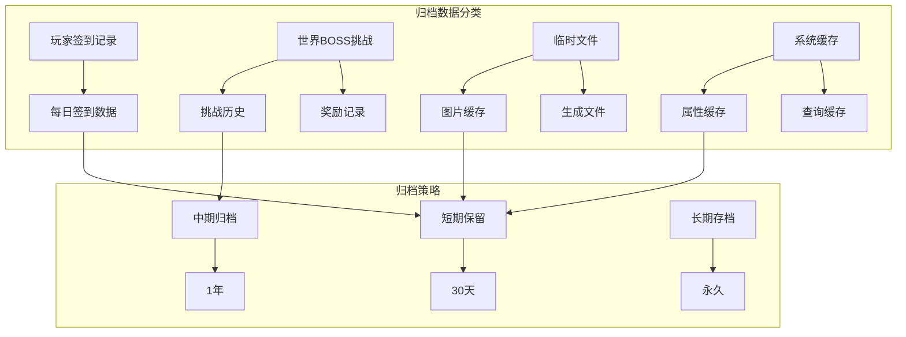
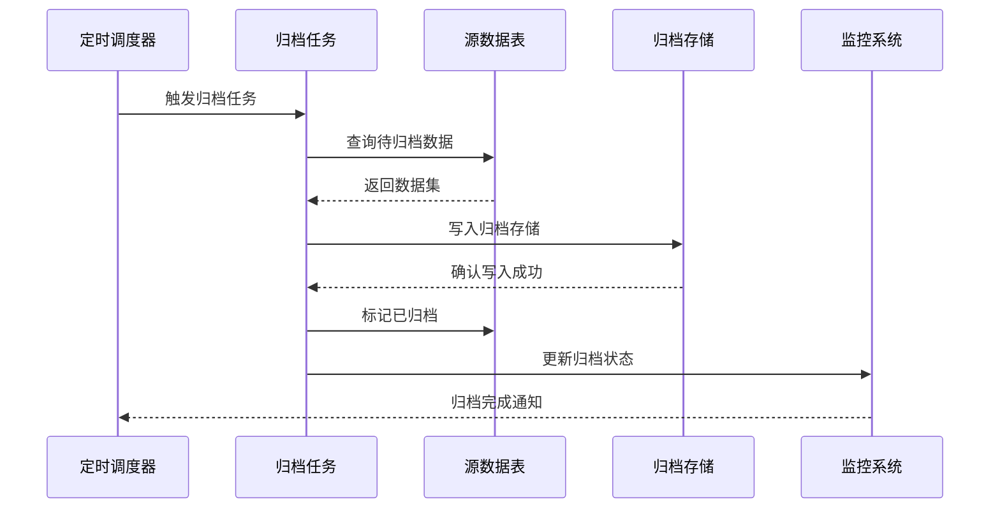
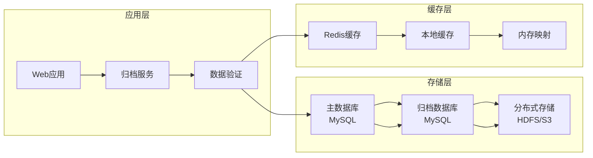
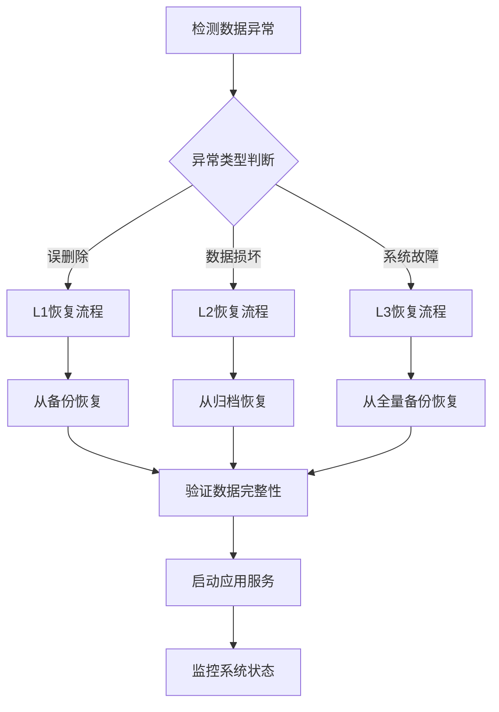
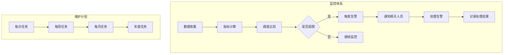

# 数据归档

<cite>
**本文档引用的文件**
- [Life_Database_Init.sql](file://Life_Database_Init.sql)
- [Life_Deployment_Guide.md](file://Life_Deployment_Guide.md)
- [LifePlayerSignin.java](file://Life\src\main\java\com\bot\life\dao\entity\LifePlayerSignin.java)
- [LifeWorldBossChallenge.java](file://Life\src\main\java\com\bot\life\dao\entity\LifeWorldBossChallenge.java)
- [LifePlayerSigninMapper.java](file://Life\src\main\java\com\bot\life\dao\mapper\LifePlayerSigninMapper.java)
- [LifeWorldBossChallengeMapper.java](file://Life\src\main\java\com\bot\life\dao\mapper\LifeWorldBossChallengeMapper.java)
- [LifeTempFiles.java](file://Life\src\main\java\com\bot\life\dao\entity\LifeTempFiles.java)
- [AutoTask.java](file://Base\src\main\java\com\bot\base\task\AutoTask.java)
- [ThreadPoolManager.java](file://Common\src\main\java\com\bot\common\util\ThreadPoolManager.java)
- [logback-spring.xml](file://Boot\src\main\resources\logback-spring.xml)
</cite>

## 目录
1. [概述](#概述)
2. [归档范围](#归档范围)
3. [归档策略](#归档策略)
4. [归档频率](#归档频率)
5. [存储架构](#存储架构)
6. [数据恢复流程](#数据恢复流程)
7. [性能考虑](#性能考虑)
8. [监控与维护](#监控与维护)
9. [故障排除](#故障排除)
10. [最佳实践](#最佳实践)

## 概述

Bot项目的数据归档系统旨在有效管理历史数据，确保重要游戏数据的长期保存同时控制数据库容量。该系统基于Life模块的核心数据结构，包括玩家签到记录、世界BOSS挑战记录等历史数据。

### 核心目标
- **数据保护**：确保重要历史数据的安全存储
- **容量管理**：通过归档策略控制数据库增长
- **快速检索**：提供高效的历史数据查询能力
- **成本优化**：合理利用存储资源

## 归档范围

### 主要归档对象

#### 1. 玩家签到记录
- **表结构**：`life_player_signin`
- **字段**：玩家ID、签到日期、灵粹奖励、创建时间
- **数据特征**：每日产生大量记录，历史价值高

#### 2. 世界BOSS挑战记录
- **表结构**：`life_world_boss_challenge`
- **字段**：玩家ID、世界BOSS ID、造成的伤害、奖励、挑战时间
- **数据特征**：具有竞技性和历史纪念价值

#### 3. 临时文件记录
- **表结构**：`life_temp_files`
- **字段**：文件路径、创建时间、过期时间
- **数据特征**：自动清理机制，防止磁盘空间浪费

#### 4. 系统缓存数据
- **表结构**：`bot_jx_cache`
- **字段**：缓存类型、缓存键、内容、保存日期
- **数据特征**：定期清理，保持系统性能

**图表来源**
- [LifePlayerSignin.java](file://Life\src\main\java\com\bot\life\dao\entity\LifePlayerSignin.java#L1-L18)
- [LifeWorldBossChallenge.java](file://Life\src\main\java\com\bot\life\dao\entity\LifeWorldBossChallenge.java#L1-L18)
- [LifeTempFiles.java](file://Life\src\main\java\com\bot\life\dao\entity\LifeTempFiles.java#L1-L18)

**章节来源**
- [LifePlayerSignin.java](file://Life\src\main\java\com\bot\life\dao\entity\LifePlayerSignin.java#L1-L18)
- [LifeWorldBossChallenge.java](file://Life\src\main\java\com\bot\life\dao\entity\LifeWorldBossChallenge.java#L1-L18)

## 归档策略

### 分层归档架构

#### 第一层：实时存储（热数据）
- **保留期限**：30天
- **存储位置**：主数据库
- **访问频率**：高频
- **适用数据**：最近30天的签到记录、临时文件

#### 第二层：标准归档（温数据）
- **保留期限**：1年
- **存储位置**：归档数据库
- **访问频率**：中频
- **适用数据**：世界BOSS挑战记录、系统缓存

#### 第三层：长期存档（冷数据）
- **保留期限**：永久
- **存储位置**：分布式存储
- **访问频率**：低频
- **适用数据**：历史统计数据、分析数据

### 归档触发机制

**图表来源**
- [AutoTask.java](file://Base\src\main\java\com\bot\base\task\AutoTask.java#L18-L44)
- [ThreadPoolManager.java](file://Common\src\main\java\com\bot\common\util\ThreadPoolManager.java#L45-L72)

## 归档频率

### 自动化调度

#### 每日归档任务
- **执行时间**：凌晨2:00
- **任务内容**：
  - 清理过期临时文件
  - 归档30天前的签到记录
  - 备份系统配置数据

#### 每周归档任务
- **执行时间**：每周日凌晨1:00
- **任务内容**：
  - 归档1个月前的挑战记录
  - 生成归档统计报告
  - 清理无效索引

#### 每月归档任务
- **执行时间**：每月1日凌晨3:00
- **任务内容**：
  - 归档1年前的历史数据
  - 压缩归档文件
  - 验证数据完整性

### 归档优先级

| 数据类型 | 归档优先级 | 执行频率 | 存储介质 |
|---------|-----------|---------|---------|
| 签到记录 | 高 | 每日 | SSD |
| 挑战记录 | 中 | 每周 | HDD |
| 临时文件 | 高 | 实时 | 内存 |
| 系统缓存 | 中 | 每日 | 内存 |

**章节来源**
- [AutoTask.java](file://Base\src\main\java\com\bot\base\task\AutoTask.java#L18-L44)

## 存储架构

### 多层存储体系

### 存储配置

#### 主数据库配置
- **引擎**：InnoDB
- **字符集**：utf8mb4
- **事务支持**：完全支持
- **并发控制**：行级锁

#### 归档数据库配置
- **引擎**：MyISAM
- **压缩**：启用
- **索引**：优化
- **备份**：每日增量备份

#### 分布式存储配置
- **协议**：HTTP/HTTPS
- **加密**：传输层加密
- **冗余**：3副本
- **容量**：弹性扩展

**章节来源**
- [Life_Database_Init.sql](file://Life_Database_Init.sql#L1-L646)

## 数据恢复流程

### 恢复策略

#### 快速恢复（1小时内）
- **适用场景**：误删除、数据损坏
- **恢复步骤**：
  1. 从备份恢复主数据库
  2. 重建索引
  3. 验证数据完整性
  4. 启动应用服务

#### 标准恢复（24小时内）
- **适用场景**：灾难恢复、大规模数据迁移
- **恢复步骤**：
  1. 恢复归档数据库
  2. 导入历史数据
  3. 验证数据一致性
  4. 逐步切换流量

#### 完整恢复（72小时内）
- **适用场景**：系统重建、重大故障
- **恢复步骤**：
  1. 重新部署应用
  2. 恢复所有数据库
  3. 验证业务功能
  4. 全面测试

### 恢复时间目标（RTO）

| 恢复级别 | RTO目标 | 恢复策略 | 适用场景 |
|---------|---------|---------|---------|
| L1 | ≤1小时 | 备份恢复 | 误操作、小规模故障 |
| L2 | ≤24小时 | 归档恢复 | 中等规模故障 |
| L3 | ≤72小时 | 全量恢复 | 重大灾难 |

**章节来源**
- [Life_Deployment_Guide.md](file://Life_Deployment_Guide.md#L194-L200)

## 性能考虑

### 查询优化

#### 归档数据查询策略
- **分区表**：按时间分区存储
- **索引优化**：建立复合索引
- **缓存策略**：热点数据缓存
- **读写分离**：分离查询负载

#### 性能监控指标

| 指标类型 | 监控项 | 告警阈值 | 处理措施 |
|---------|-------|---------|---------|
| 查询性能 | 响应时间 | >500ms | 优化SQL、增加索引 |
| 存储性能 | IOPS | >10000 | 扩容存储、负载均衡 |
| 内存使用 | 缓存命中率 | <80% | 调整缓存策略 |
| 网络带宽 | 传输速率 | >80% | 压缩数据、分批传输 |

### 容量规划

#### 存储容量预测
- **签到记录**：每天约10万条，预计每年3650万条
- **挑战记录**：每天约1万条，预计每年365万条
- **临时文件**：每天约1000个，预计每年36.5万个

#### 扩展策略
- **垂直扩展**：增加单机存储容量
- **水平扩展**：分布式存储架构
- **冷热分离**：不同存储介质

**章节来源**
- [LifePlayerSigninMapper.java](file://Life\src\main\java\com\bot\life\dao\mapper\LifePlayerSigninMapper.java#L1-L38)
- [LifeWorldBossChallengeMapper.java](file://Life\src\main\java\com\bot\life\dao\mapper\LifeWorldBossChallengeMapper.java#L1-L42)

## 监控与维护

### 实时监控

#### 关键指标监控
- **数据增长趋势**：每日新增数据量
- **归档进度**：归档任务执行状态
- **存储使用率**：各存储层级使用情况
- **查询性能**：响应时间和错误率

#### 告警机制
- **邮件告警**：严重问题即时通知
- **短信告警**：紧急情况快速响应
- **钉钉群通知**：日常维护提醒

### 定期维护

#### 日常维护任务
- **数据备份**：每日增量备份
- **日志清理**：清理过期日志文件
- **性能优化**：索引重建和统计更新
- **容量检查**：监控存储使用情况

#### 周期性维护
- **数据归档**：执行归档任务
- **系统优化**：数据库参数调优
- **安全检查**：漏洞扫描和补丁更新
- **容量规划**：评估扩容需求

**图表来源**
- [logback-spring.xml](file://Boot\src\main\resources\logback-spring.xml#L25-L58)

**章节来源**
- [logback-spring.xml](file://Boot\src\main\resources\logback-spring.xml#L25-L58)

## 故障排除

### 常见问题及解决方案

#### 归档任务失败
**症状**：归档任务中断或失败
**原因**：
- 数据库连接超时
- 存储空间不足
- 权限不足

**解决方案**：
1. 检查数据库连接状态
2. 清理存储空间
3. 验证文件权限

#### 数据恢复缓慢
**症状**：数据恢复时间过长
**原因**：
- 网络带宽限制
- 存储设备性能瓶颈
- 并发连接过多

**解决方案**：
1. 增加网络带宽
2. 升级存储设备
3. 限制并发连接数

#### 数据一致性问题
**症状**：恢复后的数据不一致
**原因**：
- 备份数据损坏
- 恢复过程出错
- 时间戳不准确

**解决方案**：
1. 验证备份完整性
2. 重新执行恢复流程
3. 同步系统时间

### 故障预防

#### 预防措施
- **多备份策略**：多重备份保证数据安全
- **定期演练**：定期进行恢复演练
- **监控告警**：及时发现潜在问题
- **文档完善**：详细的操作手册

#### 应急预案
- **快速响应**：建立应急响应团队
- **资源准备**：准备应急资源和工具
- **沟通机制**：明确沟通渠道和流程
- **事后总结**：分析故障原因并改进

## 最佳实践

### 归档设计原则

#### 数据生命周期管理
- **识别关键数据**：确定需要长期保存的数据
- **制定保留策略**：根据业务需求设定保留期限
- **自动化处理**：减少人工干预，提高效率
- **定期评估**：根据业务发展调整策略

#### 性能优化
- **分层存储**：根据访问频率选择合适存储
- **批量处理**：合并小文件，减少I/O操作
- **压缩存储**：节省存储空间，降低成本
- **缓存策略**：缓存热点数据，提高访问速度

#### 安全保障
- **数据加密**：敏感数据加密存储
- **访问控制**：严格的权限管理
- **审计跟踪**：记录所有操作日志
- **备份验证**：定期验证备份有效性

### 运维建议

#### 监控体系建设
- **全面监控**：覆盖所有关键组件
- **智能告警**：基于规则的智能告警
- **可视化展示**：直观的监控界面
- **趋势分析**：预测性维护

#### 文档管理
- **操作手册**：详细的运维手册
- **故障案例**：常见问题解决方案
- **变更记录**：完整的变更历史
- **经验总结**：运维经验积累

### 技术选型

#### 存储技术
- **关系型数据库**：MySQL作为主存储
- **分布式文件系统**：HDFS/S3用于大文件存储
- **缓存系统**：Redis提供高速缓存
- **对象存储**：云存储服务用于归档

#### 工具选择
- **监控工具**：Prometheus + Grafana
- **备份工具**：Percona XtraBackup
- **消息队列**：Kafka用于异步处理
- **容器化**：Docker + Kubernetes部署

通过实施这套完整的数据归档方案，Bot项目能够有效管理历史数据，确保系统的稳定运行和数据的长期安全。运维团队可以根据本文档的指导，建立完善的归档体系，为业务发展提供可靠的数据支撑。